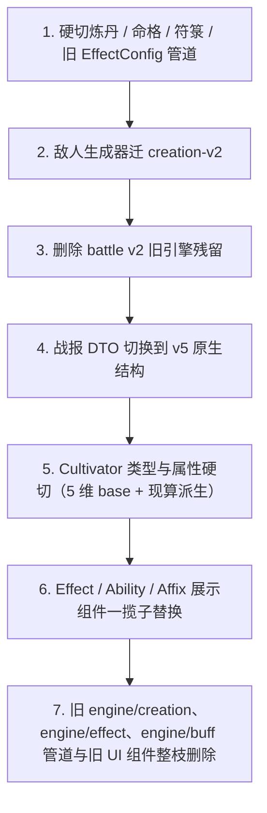

## 目标与非目标

- 目标：
  - creation-v2 承载 **skill / gongfa / artifact / 敌人 ability**；battle-v5 承载所有战斗模拟。
  - Cultivator / DTO / 展示层不再保留任何"旧 effects 占位"或"旧战报形状"兼容。
  - 展示层直接消费 v5 原生 `BattleStateTimeline` / `LogSpan` / `AttrsStateView`，以及 v2 原生 `CreationProductModel` / `AbilityConfig`。
- 非目标（硬切后接受不可用，后续重构）：
  - 炼丹（alchemy / 消耗品 `effects`）
  - 先天命格（`pre_heaven_fates` / FateGenerator / 命格 reshape）
  - 符箓相关能力（与命格/功法抽卡绑定）

## 迁移整体脉络（按强依赖顺序执行）



## 1. 硬切炼丹 / 命格 / 符箓 / 旧 Effect 管道

仅处理 API / 服务入口，直接 410/删除，不保留兼容：

- 炼丹：删除 [app/api/craft/route.ts](app/api/craft/route.ts) 中 `craftType === 'alchemy'` 的 `new CreationEngine().processRequest` 分支；`craftType` 仅保留 `refine / create_skill / create_gongfa`（全部走 `creationServiceV2`）。
- 命格：下线 `app/api/cultivator/fate/reshape/**`、`engine/fate/creation/**`、`engine/creation/FateAffixGenerator.ts`、`engine/creation/affixes/fateAffixes.ts`。
- 符箓（依赖命格/丹药）：`lib/repositories/talismanRepository.ts` 及使用入口整体下线。
- 旧 Effect 管道：`engine/effect/*`、`engine/buff/BuffMaterializer*`、`engine/cultivation/retreatEffectIntegration*`、`engine/creation/EffectMaterializer*`、`engine/creation/affixes/*`、`engine/creation/AffixUtils.ts` 全部列入删除候选（最终删除在阶段 7，阶段 1 先拆除其 API/服务入口，确保 tsc 编译路径无残留引用）。

关键改动点：
- [types/cultivator.ts](types/cultivator.ts) 中 `Skill.effects` / `CultivationTechnique.effects` / `Artifact.effects` / `Consumable.effects` / `PreHeavenFate.effects` **全部删除**；`Cultivator.pre_heaven_fates` 置为 `never[]` 或移除字段（见 §5）。
- [lib/services/cultivatorService.ts](lib/services/cultivatorService.ts) 中所有 `effects: [] as EffectConfig[]`、`effects: consumable.effects || []` 等填充语句删除。
- [lib/services/creationProductArtifactSupport.ts](lib/services/creationProductArtifactSupport.ts) 删除占位 `effects: Array.from(...)` 逻辑；`toArtifactFromProduct` 直接返回不含 `effects` 的 Artifact。

## 2. 敌人生成器迁到 creation-v2

把 [engine/enemyGenerator.ts](engine/enemyGenerator.ts) 对 `EffectMaterializer` / `buildAffixTable` / `getSkillAffixPool` 的依赖换成 creation-v2：

- 新增 `engine/enemyGenerator/v2.ts`：调用 `CreationOrchestrator.craftSync({ productType: 'skill', ... })` 生成每一个敌人技能（复用 v2 的词缀池 / 组合器），返回 `AbilityConfig[]`；技能数量 / 等级缩放沿用原 `enemyGenerator` 的参数。
- 敌人"装配"结果不写入 `creation_products` 表（纯内存构造：`CraftedOutcome` → `projectAbilityConfig`）。
- 调用方（排行榜对手、挑战/竞价战斗、练功房）改为读 `abilityConfig`，不再读 `skill.effects`。
- 删除旧 `engine/enemyGenerator.ts` 与 `engine/enemyGenerator.test.ts`，删除 `engine/fate/creation/FateGenerator.ts`（敌人若需要命格，本阶段保留空数组）。

验收：`app/api/rankings/challenge-battle/route.ts`、`app/api/battle/route.ts`、`lib/services/BetBattleService.ts` 通过 `simulateBattleV5` 跑完一场敌人战斗。

## 3. 删除 battle v2 旧引擎

- 删除：[engine/battle/BattleEngine.v2.ts](engine/battle/BattleEngine.v2.ts)、`engine/battle/BattleUnit.ts`、`engine/battle/SkillExecutor.ts`、`engine/battle/pipeline/**`、`engine/battle/TrainingBattle.test.ts`、`engine/battle/AttributeCalculation.test.ts`、`engine/battle/Issue23Reproduction.test.ts`。
- [engine/battle/index.ts](engine/battle/index.ts) 去掉对 `BattleEngineV2` 的 re-export，整个模块最终只剩类型定义（见 §4 处理）。

## 4. 战报 DTO 切换到 v5 原生结构

核心目标：**`simulateBattleV5` 不再"降级 timeline"，直接返回 v5 原生 BattleResult**；UI 直接消费 `BattleStateFrame` / `UnitStateSnapshot` / `UnitStateDelta` / `LogSpan`。

- 新建 [lib/services/battleResult.ts](lib/services/battleResult.ts)（新 DTO，替代 `engine/battle/types` 中的 `BattleEngineResult` / `TurnSnapshot`）：

```typescript
export interface BattleRecord {
  winnerId: string;
  loserId: string;
  player: { id: string; name: string; cultivator: Cultivator };
  opponent: { id: string; name: string; cultivator: Cultivator };
  turns: number;
  timeline: BattleStateTimeline;  // v5 原生
  logs: string[];
  logSpans: LogSpan[];            // v5 结构化日志
}
```

- [lib/services/simulateBattleV5.ts](lib/services/simulateBattleV5.ts) 重写：删除 `buildTimeline`，直接透传 `battleResult.stateTimeline` / `logSpans`，返回 `BattleRecord`。
- 数据库字段 `battle_records.battle_result` 类型改为 `BattleRecord`（JSONB 内容变化，旧战斗历史不兼容——接受数据丢失，清空该表即可）。
- 删除 `engine/battle/types.ts` 中 `TurnSnapshot` / `TurnUnitSnapshot` / `BattleEngineResult`，只保留战斗内部仍需的 `DamageContext` 等（若也不再使用则整个文件删除）。
- UI 重写（所有 import 改为新 DTO）：
  - [components/feature/battle/BattleReplayViewer.tsx](components/feature/battle/BattleReplayViewer.tsx)：按 `timeline.frames` 逐帧播放，每帧渲染 `UnitStateSnapshot`（含 `AttrsStateView` / `BuffStateView` / 护盾 / 冷却）；过渡动画基于 `UnitStateDelta`（hp/mp 变化、buff 增减、属性变化）。
  - [components/feature/battle/BattleTimelineViewer.tsx](components/feature/battle/BattleTimelineViewer.tsx)：按 `logSpans` 分组（turn + actor）渲染，点击 span 通过 `sourceSpanId` 高亮对应帧。
  - [components/feature/battle/BattleReportViewer.tsx](components/feature/battle/BattleReportViewer.tsx) / [components/feature/battle/BattlePageLayout.tsx](components/feature/battle/BattlePageLayout.tsx) / [components/func/Zhanji.tsx](components/func/Zhanji.tsx) / [components/feature/ranking/RecentBattles.tsx](components/feature/ranking/RecentBattles.tsx)：改为读 `BattleRecord`。
  - 所有 `import type { BattleEngineResult | TurnSnapshot } from '@/engine/battle/types'` 批量替换为 `import type { BattleRecord } from '@/lib/services/battleResult'`（共 14 处，涉及 `app/(game)/game/battle/**`、`app/(game)/game/bet-battle/**`、`app/(game)/game/dungeon/**`、`app/(game)/game/training-room`、`lib/hooks/dungeon/useBattle.ts`、`lib/dungeon/service_v2.ts`、`app/api/battles/route.ts`、`utils/prompts.ts`）。
- AI 战报 Prompt（[utils/prompts.ts](utils/prompts.ts)）：重写为消费 `logSpans`（更结构化，AI 生成质量更高），不再传 `TurnSnapshot`。

## 5. Cultivator 属性硬切：5 维基础值 + 现算派生

按 `full_replace` 决策：`Cultivator.attributes` 只保留 5 维；所有派生属性通过 `getCultivatorDisplayAttributes` 现算。

- [types/cultivator.ts](types/cultivator.ts)：`Attributes` 仅保留 `vitality/spirit/wisdom/speed/willpower`；删除 `critRate/critDamage/damageReduction/flatDamageReduction/hitRate/dodgeRate` 五个 legacy 字段。
- [engine/battle-v5/adapters/CultivatorDisplayAdapter.ts](engine/battle-v5/adapters/CultivatorDisplayAdapter.ts)：`getCultivatorDisplayAttributes` 返回完整 `AttrsStateView`（直接用 `Unit.snapshot()` 或同等接口拿 v5 的全量派生值），而不是现在这份 legacy 映射。
- 所有"角色面板 / 对手预览"页面改为消费新结构：排行榜 probe、挑战页 `BattleChallengeStore`、副本预览、练功房、创建角色预览等。
- DB schema（[lib/drizzle/schema.ts](lib/drizzle/schema.ts)）的 `cultivators.attributes` JSONB 里若有派生字段，作为一次性 migration 清掉（或接受旧行数据丢失）。

## 6. Effect / Ability / Affix 展示组件一揽子替换

按 `new_and_delete` 决策，新建一套新组件，调用方逐个替换后删除旧组件：

- 新建 [components/ui/ability/AbilityCard.tsx](components/ui/ability/AbilityCard.tsx)、`AbilityDetailModal.tsx`、`AffixChip.tsx`、`AttributeModifierList.tsx`，统一基于：
  - `CreationProductModel`（`engine/creation-v2/models/types.ts`）里的 `affixes` + `battleProjection`
  - `AbilityConfig`（`engine/battle-v5/core/configs`）里的 `effects` / `listeners` / `targetPolicy`
  - `AttributeModifierConfig`
- 新增 [lib/ui/abilityDisplay.ts](lib/ui/abilityDisplay.ts)：输入 `AbilityConfig` / `EffectConfig`（v5）/ `ListenerConfig`，输出 `{ label, icon, description, magnitude, isPerfect }`——取代 `lib/utils/effectDisplay.ts` 的职责，但实现基于 v5 的 `EffectRegistry` / `BuffFactory` 元信息，不再 import `engine/effect`。
- 页面与 ViewModel 改造：
  - [app/(game)/game/artifacts/components/ArtifactDetailModal.tsx](app/(game)/game/artifacts/components/ArtifactDetailModal.tsx) / `ArtifactsView.tsx` / `hooks/useArtifactsViewModel.tsx`
  - [app/(game)/game/skills/components/SkillDetailModal.tsx](app/(game)/game/skills/components/SkillDetailModal.tsx) / `SkillsView.tsx` / `hooks/useSkillsViewModel.tsx`
  - [app/(game)/game/techniques/components/TechniqueDetailModal.tsx](app/(game)/game/techniques/components/TechniqueDetailModal.tsx) / `TechniquesView.tsx` / `hooks/useTechniquesViewModel.tsx`
  - 所有页面从 `/api/v2/products` 读 `productModel.affixes` 与 `abilityConfig`（需要 [app/api/v2/products/route.ts](app/api/v2/products/route.ts) 把 `productModel` 完整返回给前端）。
- 删除旧展示：[components/ui/EffectCard.tsx](components/ui/EffectCard.tsx)、`components/ui/EffectDetailModal.tsx`、`lib/utils/effectDisplay.ts`、`utils/rankingUtils` 中基于旧 EffectConfig 的排序逻辑（见 §7 整枝）。

## 7. 整枝删除：engine/creation、engine/effect、engine/buff（旧）、engine/fate/creation

完成 §1-§6 后，以下全部可删（此时已无非测试引用）：

- `engine/creation/**`（包括 `CreationEngine.ts`、`strategies/*`、`EffectMaterializer.ts`、`AffixUtils.ts`、`FateAffixGenerator.ts`、`affixes/*`、`materializationConfig.ts`、`creationConfig.ts`、`skillConfig.ts`、`prompts.ts`、`types.ts`、所有测试）
- `engine/effect/**`（整个旧效果系统与 `EffectFactory`）
- `engine/buff/BuffMaterializer.ts` + `BuffMaterializer.test.ts` + `BuffTemplateRegistry`（若 v5 已用 `BuffFactory` 取代，则整个 `engine/buff/*` 可删；需逐文件确认 v5 依赖面，保留 v5 必须的类型）
- `engine/cultivation/retreatEffectIntegration*`
- `engine/fate/creation/**`
- `engine/battle/BattleEngine.v2.ts` 等已在 §3 删除
- `config/buffTemplates.ts`（若仅服务旧管道）
- `engine/battle-v5/adapters/CultivatorAdapter.ts`（演示用，非业务）

最终留下：`engine/creation-v2/**`、`engine/battle-v5/**`、`engine/cultivator/**`、`engine/material/**`、`engine/yield/**`、`engine/market/**`、`engine/resource/**`、`engine/shared/**`。

## 验证（每个阶段独立可验证）

- §1-§2：`npx tsc --noEmit` 通过；排行榜挑战 + 副本战斗 + 竞价战斗 + 练功房跑通一场，敌人有非空 `abilityConfig`。
- §3：`engine/battle/**` 下无 `BattleEngineV2`、pipeline 残留。
- §4：访问 `/game/battle/history` + 回放一场战斗，Viewer 直接读 `BattleStateTimeline`；AI 战报仍能生成。
- §5：角色主页、排行榜 probe、战斗挑战页展示完整的 v5 派生属性（atk/def/magicAtk/...）。
- §6：`/game/artifacts`、`/game/skills`、`/game/techniques` 的详情弹窗全部渲染新 Effect 描述 + 词缀卡，无"未知效果"。
- §7：`rg "engine/effect|engine/creation/|BuffMaterializer|EffectMaterializer"` 无业务代码命中。
- 全量 `npm test` 通过（旧引擎测试随文件一起删除）。

## 关键风险

- **数据库 `cultivators.pre_heaven_fates / consumables` 等表仍存在旧数据**：硬切后这些表的读取路径被删，但行数据仍在，后续重构时再处理 schema。
- **`cultivators.attributes` JSONB 形状变更**：旧数据里的派生字段会被忽略；若游戏上线前库里已有角色数据，需一次性刷写（即写一个一次性脚本清理派生字段）。
- **`battle_records.battle_result` 结构变更**：旧战斗记录无法回放——清空表或接受 404。
- **AI 战报 Prompt 重写**：需要用若干真实 `logSpans` 样本回归 AI 输出质量。