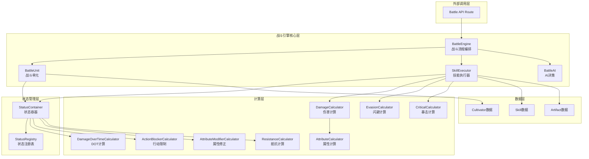
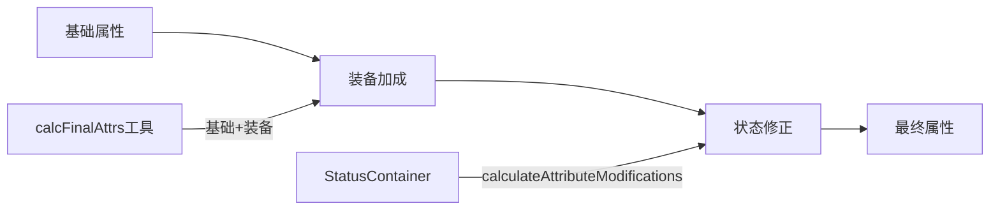
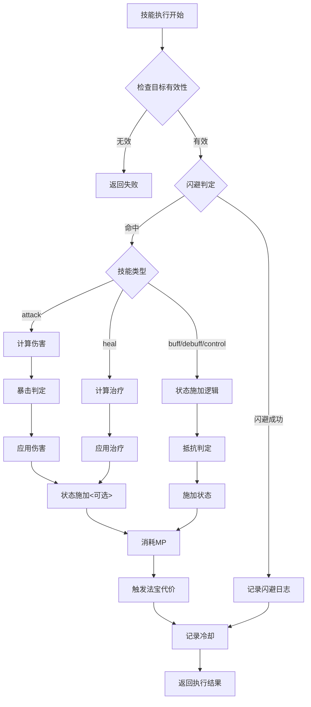
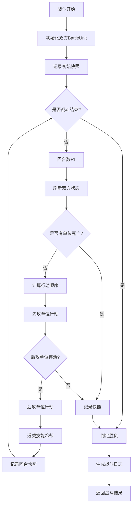

# 战斗引擎重构设计文档

## 一、重构背景与目标

### 1.1 当前问题分析

现有战斗引擎 `battleEngine.ts` 作为 MVP 最小可行模型存在以下问题：

**架构层面**
- 状态管理分散：状态逻辑散布在多个函数中（`applyStatus`、`tickStatusEffects`、`isActionBlocked`）
- 职责不清晰：战斗引擎同时负责战斗流程、状态管理、伤害计算、AI决策等多重职责
- 硬编码严重：状态效果逻辑、属性修正、DOT计算等逻辑直接写死在函数中
- 可扩展性差：新增状态类型需要修改多处代码，违反开闭原则

**数据结构层面**
- 简化的状态模型：使用 `Map<StatusEffect, StatusInstance>` 仅支持单层状态，无法处理叠加
- 状态信息不完整：缺少来源类型、持续时间类型、条件消退等高级特性
- 快照机制粗糙：`StatusSourceSnapshot` 字段固定，无法灵活扩展

**计算逻辑层面**
- 计算逻辑耦合：伤害计算、减伤计算、属性修正等逻辑分散在各处
- 状态影响硬编码：如 `speed_up` 加成在多处重复计算（第 534、735、738 行）
- 抵抗计算简陋：`calculateStatusHitChance` 未考虑状态强度、类型等因素

### 1.2 重构目标

**架构优化**
- 分离关注点：将战斗引擎拆分为战斗流程控制、战斗单元管理、技能执行、状态管理等独立模块
- 集成状态系统：使用新设计的 `StatusContainer` 替代现有状态管理逻辑
- 策略化计算逻辑：将伤害、减伤、闪避等计算抽象为独立的计算器

**可扩展性提升**
- 配置驱动：状态效果、技能行为等通过配置定义，而非硬编码
- 插件化设计：支持通过计算器注册扩展新的状态效果
- 开放封闭原则：新增状态无需修改核心引擎代码

**可维护性增强**
- 清晰的职责划分：每个模块只负责单一职责
- 类型安全：利用 TypeScript 类型系统确保数据正确性
- 测试友好：各模块独立可测试

## 二、整体架构设计

### 2.1 架构分层



### 2.2 模块职责划分

| 模块 | 职责 | 输入 | 输出 |
|------|------|------|------|
| **BattleEngine** | 战斗流程编排、回合推进、胜负判定 | 双方 Cultivator 数据 | BattleEngineResult |
| **BattleUnit** | 封装战斗单元状态（HP/MP/状态容器/冷却等） | Cultivator 数据 | 战斗过程中的动态状态 |
| **SkillExecutor** | 技能执行逻辑、伤害结算、状态施加 | 技能、施法者、目标 | 执行结果（伤害/治疗/状态变化） |
| **BattleAI** | 技能选择策略 | 当前战斗单元、目标、战况 | 选择的技能 |
| **StatusContainer** | 状态添加/移除/刷新/属性修正 | 状态应用请求、Tick上下文 | 状态变化结果 |
| **DamageCalculator** | 伤害计算（包含元素、暴击、减伤） | 攻击者、防御者、技能 | 伤害值 |
| **AttributeCalculator** | 最终属性计算（基础+装备+状态） | 单元快照、状态容器 | 最终属性 |
| **EvasionCalculator** | 闪避概率计算 | 防御者属性、状态 | 闪避概率 |
| **CriticalCalculator** | 暴击概率和倍率计算 | 攻击者属性、状态 | 暴击率和倍率 |

## 三、核心模块设计

### 3.1 BattleUnit 战斗单元

**设计意图**
- 封装战斗中的单位状态，作为状态容器和属性计算的载体
- 提供统一的接口供战斗引擎操作

**核心接口**

```
interface BattleUnit {
  // 基础标识
  unitId: string
  unitName: string
  cultivatorData: Cultivator
  
  // 动态战斗属性
  currentHp: number
  currentMp: number
  maxHp: number
  maxMp: number
  
  // 状态管理
  statusContainer: StatusContainer
  
  // 技能冷却
  skillCooldowns: Map<string, number>
  
  // 行动状态
  isDefending: boolean
}
```

**关键方法**

| 方法 | 说明 | 返回值 |
|------|------|--------|
| `getFinalAttributes()` | 获取最终属性（基础+装备+状态） | Attributes |
| `createUnitSnapshot()` | 创建单元快照供状态系统使用 | UnitSnapshot |
| `applyDamage(damage: number)` | 应用伤害 | 实际伤害值 |
| `applyHealing(heal: number)` | 应用治疗 | 实际治疗值 |
| `consumeMp(cost: number)` | 消耗灵力 | boolean |
| `canUseSkill(skill: Skill)` | 检查是否可使用技能 | boolean |
| `tickCooldowns()` | 递减技能冷却 | void |

**属性计算流程**



### 3.2 SkillExecutor 技能执行器

**设计意图**
- 将技能执行逻辑从战斗引擎中抽离
- 统一处理闪避、暴击、伤害、状态施加等逻辑

**执行流程**



**核心接口**

```
interface SkillExecutionContext {
  caster: BattleUnit
  target: BattleUnit
  skill: Skill
  battleState: BattleState
}

interface SkillExecutionResult {
  success: boolean
  evaded: boolean
  damage: number
  healing: number
  isCritical: boolean
  statusApplied: ApplyResult[]
  logs: string[]
}
```

**关键方法**

| 方法 | 说明 | 输入 | 输出 |
|------|------|------|------|
| `execute(context)` | 执行技能 | SkillExecutionContext | SkillExecutionResult |
| `checkEvasion(context)` | 闪避判定 | 防御者、技能类型 | boolean |
| `calculateDamage(context)` | 伤害计算 | 技能、双方单元 | DamageResult |
| `calculateHealing(context)` | 治疗计算 | 技能、施法者 | number |
| `applySkillStatus(context)` | 施加技能状态 | 技能、目标 | ApplyResult[] |

### 3.3 BattleEngine 战斗引擎

**设计意图**
- 纯粹的流程编排器，不涉及具体计算逻辑
- 协调各模块完成战斗流程

**战斗流程**



**核心方法**

| 方法 | 说明 |
|------|------|
| `simulateBattle(player, opponent, options)` | 执行完整战斗流程 |
| `initializeBattle()` | 初始化战斗状态 |
| `executeTurn()` | 执行单个回合 |
| `executeUnitAction(unit, target)` | 执行单位行动 |
| `determineActionOrder()` | 决定行动顺序 |
| `checkBattleEnd()` | 检查战斗是否结束 |
| `generateBattleResult()` | 生成战斗结果 |

### 3.4 状态系统集成

**集成方式**

现有状态系统已经提供了完整的功能，战斗引擎需要做的是：

1. **替换状态存储**：将 `BattleUnit.statuses: Map<StatusEffect, StatusInstance>` 替换为 `BattleUnit.statusContainer: StatusContainer`

2. **使用状态容器API**：
   - 施加状态：`statusContainer.addStatus(request, targetSnapshot)`
   - 刷新状态：`statusContainer.tickStatuses(tickContext)`
   - 检查状态：`statusContainer.hasStatus(statusKey)`
   - 属性修正：`statusContainer.calculateAttributeModifications(context)`
   - 行动限制：通过 `ActionBlockerCalculator.checkMultipleStatuses()` 检查

3. **废弃旧逻辑**：
   - 删除 `applyStatus` 函数（行233-247）
   - 删除 `tickStatusEffects` 函数（行249-280）
   - 删除 `isActionBlocked` 函数（行282-284）
   - 删除 `calculateDotDamage` 函数（行365-392）

**状态应用示例**

旧方式：
```
const instance: StatusInstance = {
  remaining: duration,
  potency: skill.power,
  element: skill.element,
  skillName: skill.name,
  source: snapshotUnit(caster)
}
applyStatus(recipient, skill.effect, instance)
```

新方式：
```
const request: StatusApplicationRequest = {
  statusKey: skill.effect,
  source: {
    sourceType: 'skill',
    sourceId: skill.id,
    sourceName: skill.name,
    casterSnapshot: caster.createCasterSnapshot()
  },
  potency: skill.power,
  element: skill.element,
  durationOverride: skill.duration ? { remaining: skill.duration } : undefined
}

const result = target.statusContainer.addStatus(request, target.createUnitSnapshot())
```

**状态刷新示例**

旧方式：
```
tickStatusEffects(state.player, state.log)
tickStatusEffects(state.opponent, state.log)
```

新方式：
```
const tickContext: TickContext = {
  currentTurn: state.turn,
  currentTime: Date.now(),
  unitSnapshot: player.createUnitSnapshot(),
  battleContext: {
    turnNumber: state.turn,
    isPlayerTurn: true
  }
}

const tickResult = player.statusContainer.tickStatuses(tickContext)
player.applyDamage(tickResult.damageDealt)
state.log.push(...tickResult.effectLogs)
```

### 3.5 计算层设计

**DamageCalculator 伤害计算器**

职责：统一处理所有伤害计算，包括技能伤害、法宝伤害、元素加成等

核心方法：
- `calculateSkillDamage(caster, target, skill)` - 技能基础伤害
- `applyElementalBonus(damage, element, caster, target)` - 元素加成
- `applyDefenseReduction(damage, target)` - 防御减伤
- `applyCritical(damage, critRate, critMultiplier)` - 暴击倍率

计算流程：
```
基础伤害 = 技能威力 × (1 + 灵力/150)
↓
灵根加成 = 基础伤害 × 灵根倍率
↓
元素克制 = 灵根加成 × 克制系数（已注释，暂不启用）
↓
法宝加成 = 元素克制 × (1 + 法宝元素加成)
↓
暴击判定 = 法宝加成 × 暴击倍率（如果触发）
↓
减伤计算 = 暴击判定 × 减伤系数
↓
最终伤害
```

**AttributeCalculator 属性计算器**

职责：计算战斗单元的最终属性

核心方法：
- `calculateFinalAttributes(unit)` - 计算最终属性
- `getBaseAttributes(cultivator)` - 基础属性
- `getEquipmentBonus(cultivator)` - 装备加成
- `getStatusModifications(statusContainer)` - 状态修正

计算流程：
```
基础属性（从 cultivatorUtils 获取）
↓
装备加成（从 cultivatorUtils 获取）
↓
状态修正（从 StatusContainer 获取）
↓
最终属性
```

**EvasionCalculator 闪避计算器**

职责：计算闪避概率

核心方法：
- `calculateEvasionChance(defender, skill)` - 计算闪避率

计算逻辑：
```
基础闪避率 = min(0.3, (速度 + 速度增益) / 350)

特殊情况：
- 眩晕/定身状态：闪避率 = 0
- 治疗/增益技能：不触发闪避
```

**CriticalCalculator 暴击计算器**

职责：计算暴击概率和倍率

核心方法：
- `calculateCriticalRate(attacker)` - 计算暴击率
- `getCriticalMultiplier()` - 获取暴击倍率（1.8）

计算逻辑：
```
基础暴击率 = (悟性 - 40) / 200
↓
状态修正：
- 锋锐状态：+ 0.15
- 暴击压制：- 0.15
↓
限制范围：min(max(暴击率, 0.05), 0.6)
```

## 四、数据结构设计

### 4.1 战斗状态

```
interface BattleState {
  // 战斗标识
  battleId: string
  
  // 战斗单元
  player: BattleUnit
  opponent: BattleUnit
  
  // 流程控制
  turn: number
  maxTurns: number
  
  // 战斗日志
  log: string[]
  
  // 时间线快照
  timeline: TurnSnapshot[]
  
  // 战斗选项
  options: BattleOptions
}

interface BattleOptions {
  maxTurns: number
  enableTimeline: boolean
  initialPlayerState?: InitialUnitState
}
```

### 4.2 回合快照

保持现有结构，但增强状态信息：

```
interface TurnSnapshot {
  turn: number
  player: TurnUnitSnapshot
  opponent: TurnUnitSnapshot
}

interface TurnUnitSnapshot {
  hp: number
  mp: number
  statuses: StatusEffect[]  // 保持兼容性
  statusDetails?: StatusInstance[]  // 可选：完整状态信息
}
```

### 4.3 战斗结果

扩展现有结构，增加更多统计信息：

```
interface BattleEngineResult {
  // 基础信息
  winner: Cultivator
  loser: Cultivator
  
  // 战斗过程
  log: string[]
  turns: number
  timeline: TurnSnapshot[]
  
  // 结果详情
  playerHp: number
  opponentHp: number
  playerMp: number
  opponentMp: number
  
  // 统计信息（可选扩展）
  statistics?: BattleStatistics
}

interface BattleStatistics {
  totalDamageDealt: { player: number; opponent: number }
  totalHealingDone: { player: number; opponent: number }
  skillsUsed: { player: number; opponent: number }
  criticalHits: { player: number; opponent: number }
  statusApplied: { player: number; opponent: number }
}
```

## 五、重构实施路径

### 5.1 阶段划分

**阶段一：计算层抽取（低风险）**

目标：将分散的计算逻辑抽取为独立计算器，不改变主流程

任务：
1. 创建 `DamageCalculator` 抽取伤害计算逻辑（`calculateSpellBase`）
2. 创建 `AttributeCalculator` 封装属性计算
3. 创建 `EvasionCalculator` 抽取闪避逻辑
4. 创建 `CriticalCalculator` 抽取暴击逻辑
5. 修改现有函数调用新计算器，保持接口不变

验证：现有测试全部通过

**阶段二：技能执行器封装（中风险）**

目标：将技能执行逻辑封装为独立模块

任务：
1. 创建 `SkillExecutor` 类
2. 迁移 `executeSkill` 逻辑到 `SkillExecutor.execute()`
3. 迁移 `applyAndLogStatusFromSkill` 逻辑
4. 修改 `simulateBattle` 调用新执行器

验证：战斗结果与重构前一致

**阶段三：状态系统集成（高风险）**

目标：使用 StatusContainer 替代现有状态管理

任务：
1. 修改 `BattleUnit` 接口，引入 `statusContainer`
2. 实现 `BattleUnit.createUnitSnapshot()` 和 `createCasterSnapshot()`
3. 修改状态施加逻辑，使用 `StatusContainer.addStatus()`
4. 修改状态刷新逻辑，使用 `StatusContainer.tickStatuses()`
5. 修改属性计算，集成 `StatusContainer.calculateAttributeModifications()`
6. 修改行动限制检查，使用 `ActionBlockerCalculator`
7. 删除旧状态管理代码

验证：
- 状态施加与刷新正确
- DOT伤害计算正确
- 属性修正生效
- 行动限制生效
- 状态互斥和叠加正确

**阶段四：战斗单元封装（中风险）**

目标：将战斗单元封装为独立类

任务：
1. 创建 `BattleUnit` 类
2. 封装属性计算、伤害应用、治疗应用等方法
3. 迁移技能可用性检查逻辑
4. 迁移冷却管理逻辑
5. 修改 `simulateBattle` 使用新 `BattleUnit`

验证：战斗流程正常运行

**阶段五：AI决策分离（低风险）**

目标：将AI决策逻辑独立为模块

任务：
1. 创建 `BattleAI` 类
2. 迁移 `chooseSkill` 逻辑
3. 支持策略模式扩展（为未来AI优化预留）

验证：技能选择逻辑不变

**阶段六：引擎重组（低风险）**

目标：精简 BattleEngine 为纯流程编排器

任务：
1. 提取回合推进逻辑为独立方法
2. 提取行动顺序判定逻辑
3. 提取胜负判定逻辑
4. 优化代码结构和可读性

验证：整体战斗流程正确

### 5.2 向后兼容性

**接口兼容**

保持 `simulateBattle` 函数签名不变，确保现有调用方无需修改：
```
function simulateBattle(
  player: Cultivator,
  opponent: Cultivator,
  initialPlayerState?: InitialUnitState
): BattleEngineResult
```

**数据兼容**

`BattleEngineResult` 结构保持不变，新增字段为可选字段，确保前端不受影响

**时间线兼容**

`TurnSnapshot` 保持现有字段，新增字段为可选，确保战报系统正常运行

### 5.3 测试策略

**单元测试**

每个计算器和模块都需要独立的单元测试：
- `DamageCalculator.test.ts` - 测试各种伤害计算场景
- `AttributeCalculator.test.ts` - 测试属性计算正确性
- `SkillExecutor.test.ts` - 测试技能执行各种分支
- `BattleUnit.test.ts` - 测试战斗单元状态管理

**集成测试**

确保模块协作正确：
- 完整战斗流程测试
- 状态系统与战斗引擎集成测试
- 边界情况测试（MP耗尽、沉默、眩晕等）

**回归测试**

使用现有战斗案例进行回归测试：
- 记录重构前的战斗结果
- 重构后执行相同战斗（固定随机种子）
- 对比结果一致性

**对比测试工具**

创建测试工具比对重构前后的差异：
```
功能：
- 输入相同的玩家和敌人数据
- 固定随机数种子
- 执行旧版和新版战斗引擎
- 对比：
  - 伤害值
  - 状态施加
  - 回合数
  - 最终HP/MP
  - 战斗日志
```

### 5.4 风险控制

**并行开发**

在完成重构前，保留旧战斗引擎代码，新旧并存：
- 旧引擎：`battleEngine.legacy.ts`
- 新引擎：`battleEngine.v2.ts`

**特性开关**

在 API 层增加开关控制使用哪个引擎：
```
环境变量：USE_BATTLE_ENGINE_V2=true/false
默认：false（使用旧引擎）
验证通过后：切换为 true
```

**灰度发布**

逐步放量使用新引擎：
- 阶段一：10% 流量使用新引擎，收集数据对比
- 阶段二：50% 流量使用新引擎
- 阶段三：100% 流量使用新引擎
- 稳定后：移除旧引擎代码

## 六、扩展性设计

### 6.1 新增状态类型

通过配置化流程新增状态，无需修改核心代码：

步骤：
1. 在 `StatusRegistry` 中注册状态定义
2. 如需特殊计算逻辑，创建对应计算器
3. 在技能或法宝配置中引用状态

示例 - 添加"虚弱"状态：
```
状态定义：
- statusKey: 'weakness'
- statusType: 'persistent'
- 效果：全属性降低

步骤：
1. StatusRegistry.registerStatus() 注册定义
2. AttributeModifierCalculator 中添加属性修正逻辑
3. 在技能或法宝中配置 effect: 'weakness'
```

### 6.2 新增技能类型

当前支持的技能类型：attack、heal、buff、debuff、control

新增技能类型流程：
1. 在 `types/constants.ts` 中添加新类型
2. 在 `SkillExecutor` 中添加对应执行分支
3. 如需特殊计算，创建新计算器

示例 - 添加"吸血"技能：
```
类型：lifesteal

执行逻辑：
1. 计算伤害
2. 应用伤害到目标
3. 治疗量 = 伤害 × 吸血比例
4. 应用治疗到施法者
```

### 6.3 AI策略扩展

当前 AI 使用简单的基于血量和技能类型的策略，未来可扩展为：

**策略接口**
```
interface BattleStrategy {
  chooseSkill(actor: BattleUnit, target: BattleUnit): Skill | null
  evaluateThreat(target: BattleUnit): number
  shouldRetreat(actor: BattleUnit): boolean
}
```

**策略类型**
- 激进型：优先攻击技能
- 稳健型：平衡攻击与治疗
- 控制型：优先控制和debuff技能
- 防守型：优先buff和治疗

**动态策略**

根据战况动态调整策略：
- HP > 70%：激进策略
- HP 30%-70%：稳健策略
- HP < 30%：防守策略

### 6.4 法宝系统增强

当前法宝作为主动技能集成，未来可扩展：

**被动效果**
- 每回合触发：如"回血"、"护盾"
- 受击触发：如"反弹"、"免疫"
- 击杀触发：如"吸魂"

**组合效果**

多件法宝协同增益：
- 套装效果：装备2件或3件同系列法宝触发额外效果
- 元素共鸣：装备多件同元素法宝提升该元素伤害

**法宝进化**

法宝可在战斗中升级或进化：
- 使用次数达标解锁新效果
- 击杀特定敌人获得新能力

## 七、性能优化建议

### 7.1 属性缓存

**问题**：每次计算伤害都重新计算最终属性，包含多次状态遍历

**优化**：在回合开始时计算并缓存最终属性，回合内复用

实现：
```
class BattleUnit {
  private cachedAttributes?: Attributes
  private attributesDirty: boolean = true
  
  getFinalAttributes(): Attributes {
    if (this.attributesDirty || !this.cachedAttributes) {
      this.cachedAttributes = this.calculateAttributes()
      this.attributesDirty = false
    }
    return this.cachedAttributes
  }
  
  markAttributesDirty(): void {
    this.attributesDirty = true
  }
}

触发脏标记时机：
- 状态添加/移除
- 装备变更（战斗中不发生，可忽略）
```

### 7.2 状态查询优化

**问题**：频繁调用 `hasStatus()` 检查状态存在性

**优化**：使用位掩码或 Set 缓存活动状态类型

实现：
```
class StatusContainer {
  private activeStatusTypes: Set<StatusType> = new Set()
  
  addStatus(...) {
    // ... 添加逻辑
    this.activeStatusTypes.add(definition.statusType)
  }
  
  hasStatusType(type: StatusType): boolean {
    return this.activeStatusTypes.has(type)
  }
}

应用：
- 快速判断是否有控制类状态
- 快速判断是否有DOT类状态
```

### 7.3 日志优化

**问题**：频繁的字符串拼接和数组操作影响性能

**优化**：延迟日志生成，仅在需要时格式化

实现：
```
interface LogEntry {
  type: 'damage' | 'heal' | 'status' | 'evade' | 'critical'
  data: Record<string, any>
}

战斗过程：记录结构化数据
战斗结束：批量生成日志字符串
```

### 7.4 时间线快照优化

**问题**：每回合创建完整快照占用内存

**优化**：仅记录变化差异（diff）

实现：
```
interface TurnSnapshotDiff {
  turn: number
  changes: {
    player?: Partial<TurnUnitSnapshot>
    opponent?: Partial<TurnUnitSnapshot>
  }
}

前端重建：
- 基于初始状态
- 应用每回合的 diff
- 还原完整时间线
```

## 八、质量保障

### 8.1 类型安全

**严格类型检查**

启用 TypeScript 严格模式：
- `strictNullChecks`: 防止空指针
- `noImplicitAny`: 禁止隐式 any
- `strictFunctionTypes`: 函数类型严格检查

**接口约束**

所有模块交互通过接口定义，不依赖具体实现

### 8.2 代码规范

**命名规范**

- 类：PascalCase（如 `BattleEngine`）
- 方法：camelCase（如 `calculateDamage`）
- 常量：UPPER_SNAKE_CASE（如 `MAX_TURNS`）
- 私有成员：前缀 `_` 或使用 `private` 修饰符

**注释规范**

- 所有公共接口必须有 JSDoc 注释
- 复杂逻辑必须有行内注释说明
- 计算公式必须注释说明参数和结果

### 8.3 错误处理

**防御性编程**

- 所有外部输入进行校验
- 所有除法运算检查除数非零
- 所有数组访问检查边界

**错误恢复**

- 状态施加失败不应中断战斗
- 技能执行失败回退到默认行为
- 计算异常返回合理默认值

**日志记录**

- 记录所有异常情况
- 记录关键决策点
- 支持战斗回放调试

## 九、迁移清单

### 9.1 废弃代码

以下代码将在重构后移除：

| 位置 | 内容 | 替代方案 |
|------|------|----------|
| 行 58-64 | `interface StatusInstance` | 使用 `status/types.ts` 中的定义 |
| 行 95-107 | `STATUS_EFFECTS` 和分类常量 | 使用 `StatusRegistry` |
| 行 233-247 | `applyStatus` 函数 | `StatusContainer.addStatus()` |
| 行 249-280 | `tickStatusEffects` 函数 | `StatusContainer.tickStatuses()` |
| 行 282-284 | `isActionBlocked` 函数 | `ActionBlockerCalculator.checkMultipleStatuses()` |
| 行 365-392 | `calculateDotDamage` 函数 | `DamageOverTimeCalculator.calculateDamageOverTime()` |
| 行 111-122 | `getElementMultiplier` 函数 | 迁移到 `DamageCalculator` |
| 行 124-131 | `getRootDamageMultiplier` 函数 | 迁移到 `DamageCalculator` |
| 行 133-141 | `getDefenseMultiplier` 函数 | 迁移到 `DamageCalculator` |
| 行 143-149 | `getCritRate` 函数 | 迁移到 `CriticalCalculator` |
| 行 151-177 | `getArtifactDamageBonus` 函数 | 迁移到 `DamageCalculator` |
| 行 179-205 | `calculateSpellBase` 函数 | 迁移到 `DamageCalculator` |
| 行 207-214 | `calculateStatusHitChance` 函数 | 使用 `ResistanceCalculator` |

### 9.2 新增文件

| 文件路径 | 说明 |
|---------|------|
| `engine/battle/BattleEngine.ts` | 重构后的战斗引擎主文件 |
| `engine/battle/BattleUnit.ts` | 战斗单元封装 |
| `engine/battle/SkillExecutor.ts` | 技能执行器 |
| `engine/battle/BattleAI.ts` | AI决策模块 |
| `engine/battle/calculators/DamageCalculator.ts` | 伤害计算器 |
| `engine/battle/calculators/AttributeCalculator.ts` | 属性计算器 |
| `engine/battle/calculators/EvasionCalculator.ts` | 闪避计算器 |
| `engine/battle/calculators/CriticalCalculator.ts` | 暴击计算器 |
| `engine/battle/types.ts` | 战斗引擎类型定义 |
| `engine/battle/index.ts` | 导出统一接口 |

### 9.3 修改文件

| 文件路径 | 修改内容 |
|---------|---------|
| `app/api/battle/route.ts` | 可选：切换到新战斗引擎 |
| `app/api/dungeon/battle/execute/route.ts` | 可选：切换到新战斗引擎 |
| `engine/battleEngine.ts` | 重命名为 `battleEngine.legacy.ts` 保留备份 |

## 十、后续优化方向

### 10.1 战斗可视化增强

**动画系统集成**

提供更细粒度的战斗事件供前端使用：
- 技能释放动画触发点
- 伤害数字弹出时机
- 状态图标显示/消失
- 暴击特效触发

**战斗回放**

支持战斗录像回放：
- 完整记录所有随机数种子
- 支持加速/减速/暂停
- 支持跳转到任意回合

### 10.2 平衡性调优

**数据收集**

收集战斗数据用于平衡性分析：
- 各状态施加成功率
- 各技能使用频率
- 平均战斗回合数
- 胜率统计（按境界、装备等级分层）

**动态平衡**

基于数据调整平衡参数：
- 状态抵抗率调整
- 伤害公式系数调整
- 技能冷却调整

### 10.3 多人战斗支持

当前架构支持 1v1，未来可扩展为：
- 1vN（玩家挑战多个敌人）
- Nv1（组队挑战BOSS）
- NvN（团队战）

扩展点：
- `BattleState.units: BattleUnit[]` 替代固定的 player/opponent
- 行动顺序改为全局排序
- 目标选择增加策略（最低血量、最高威胁等）

### 10.4 异步战斗支持

当前战斗为同步执行，可扩展为异步：
- 支持长时间挂机战斗
- 支持战斗暂停/恢复
- 支持分步执行（逐回合返回）

应用场景：
- 实时对战（PVP）
- 副本战斗持久化
- 离线挂机- 副本战斗持久化
- 离线挂机