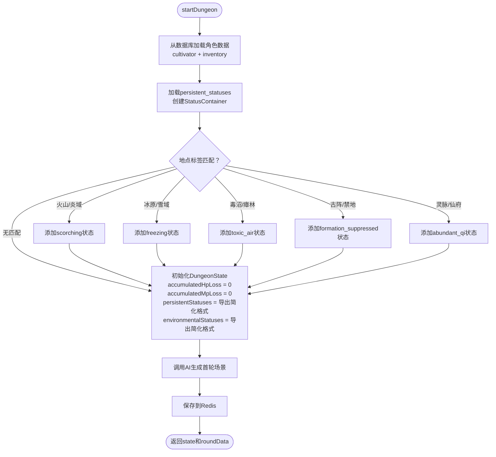
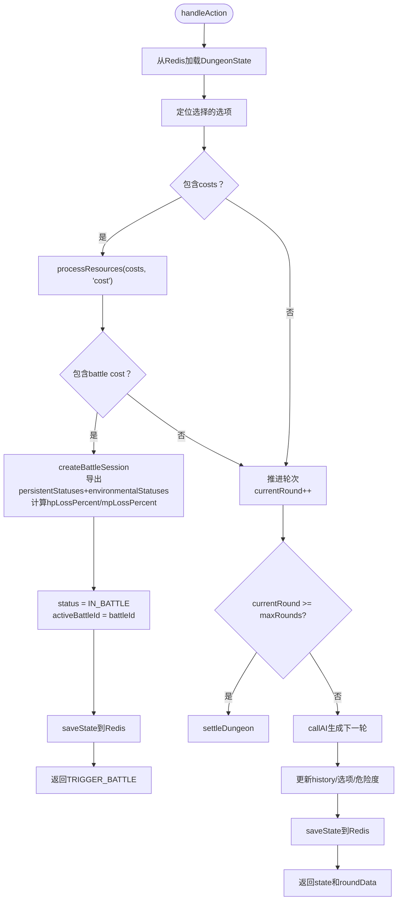
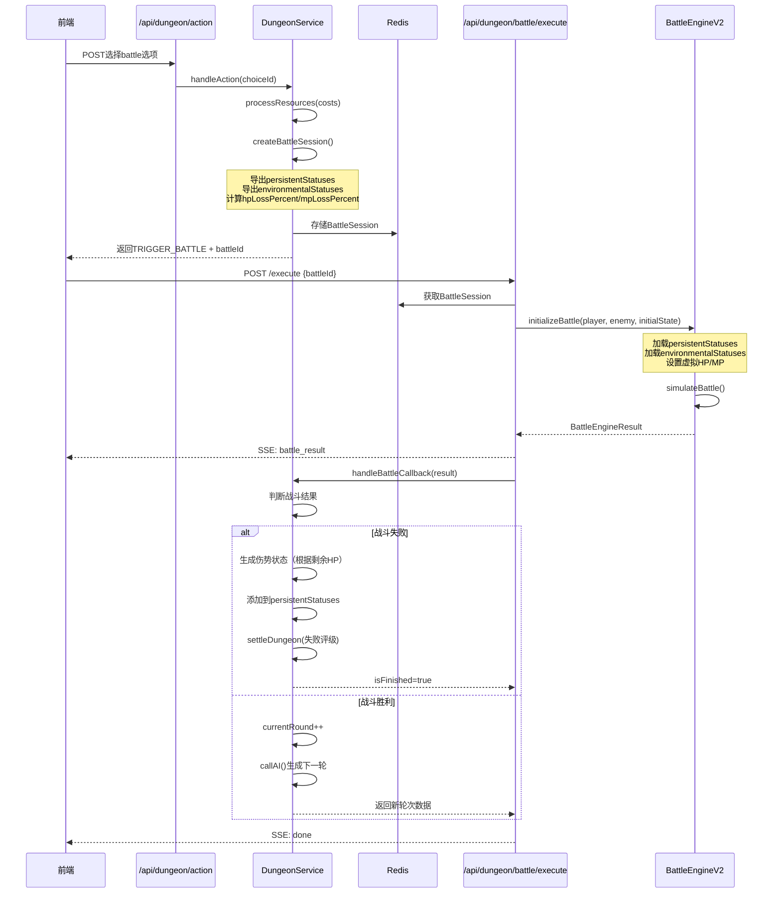
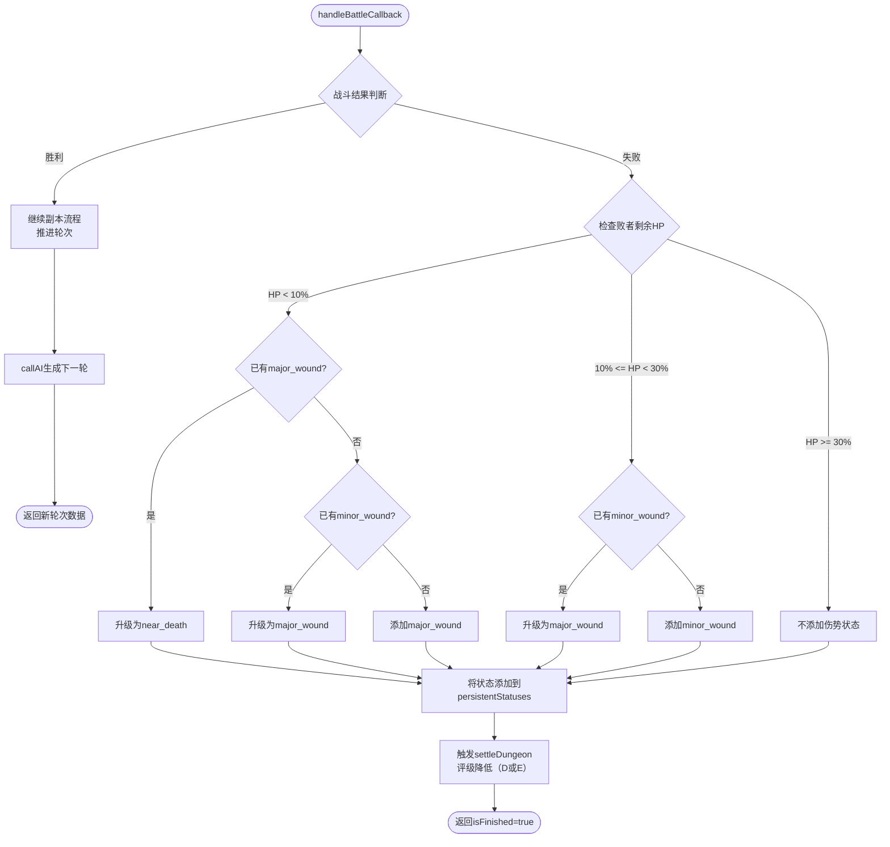
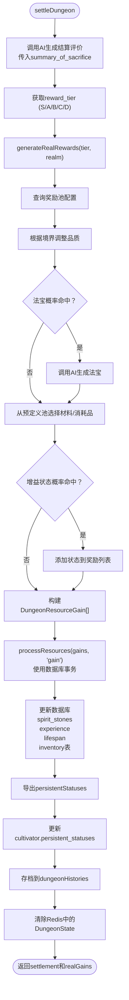

# 副本系统重构设计

## 一、重构背景与动机

### 1.1 核心问题

当前副本系统（DungeonService v2）存在以下架构问题：

**状态系统未集成**

- 副本中使用简单的hp_loss/mp_loss数值累加，未使用状态引擎
- weak等cost类型未映射为状态系统中的weakness状态
- 战斗产生的持久状态（伤势）无法传回副本流程
- 玩家在副本中累积的状态无法传递到战斗中

**战斗集成不完整**

- createBattleSession只传递HP/MP数值，未传递状态实例
- 战斗初始化未考虑玩家携带的持久状态
- 战斗失败后未生成伤势状态（minor_wound、major_wound等）
- 环境状态（scorching、toxic_air等）未在战斗中生效

**资源处理占位**

- processResources方法仅打印日志，未实际修改数据库
- generateRealRewards方法返回空数组，未实现奖励生成逻辑
- 结算时无法真实发放灵石、材料、法宝等奖励

**战斗失败处理缺失**

- 战斗失败后继续推进副本轮次，逻辑不合理
- 应当战斗失败 = 副本失败，立即触发结算
- 失败时应生成伤势状态并降低评级

### 1.2 重构目标

**完整集成状态系统**

- 副本中的cost转换为状态应用
- 使用虚拟HP/MP损失机制（百分比累积）
- 战斗前加载持久状态，战斗后合并伤势状态
- 环境状态根据地点标签自动添加

**完善战斗失败机制**

- 战斗失败时根据剩余HP生成伤势状态
- 状态升级规则：minor_wound → major_wound → near_death
- 战斗失败立即触发副本结算

**实现资源真实处理**

- processResources真实修改数据库（使用事务）
- generateRealRewards根据评级和境界生成奖励
- 结算时发放灵石、材料、法宝、增益状态等

## 二、系统架构设计

### 2.1 副本状态扩展

#### DungeonState字段增强

在现有DungeonState基础上增加以下字段：

| 字段名                | 类型   | 说明                                        |
| --------------------- | ------ | ------------------------------------------- |
| accumulatedHpLoss     | number | 累积HP损失百分比（0-1），用于计算战斗初始HP |
| accumulatedMpLoss     | number | 累积MP损失百分比（0-1），用于计算战斗初始MP |
| persistentStatuses    | Array  | 持久状态快照（简化格式），用于序列化到Redis |
| environmentalStatuses | Array  | 环境状态快照（简化格式），根据地点标签添加  |

简化状态格式定义：

```
{
  statusKey: string;        // 状态键值
  potency: number;          // 效力值
  createdAt: number;        // 创建时间戳
  metadata: Record<string, unknown>; // 元数据
}
```

#### 状态容器管理

副本运行时在内存中维护StatusContainer实例：

- startDungeon时从数据库加载persistent_statuses
- 根据地点标签添加环境状态到environmentalStatuses
- handleAction时将cost转换为状态应用请求
- 存储到Redis时序列化为简化格式
- 恢复时反序列化并重建StatusContainer

### 2.2 战斗集成优化

#### 虚拟HP/MP损失机制

副本中的hp_loss/mp_loss不直接扣减数值，而是：

- 累加到accumulatedHpLoss/accumulatedMpLoss（百分比）
- 战斗初始化时计算：currentHp = maxHp × (1 - accumulatedHpLoss)
- 战斗结束后，accumulatedHpLoss不变，等待结算时清零

#### 状态传递流程

**副本开始**

1. 从cultivator.persistent_statuses加载持久状态
2. 根据location_tags添加环境状态
3. 创建StatusContainer并存储到DungeonState

**进入战斗**

1. 从StatusContainer导出持久状态和环境状态
2. 传递给BattleEngineV2.initializeBattle
3. 计算虚拟HP/MP（基于accumulatedHpLoss/MpLoss）
4. 创建BattleUnit时加载状态

**战斗结束**

1. 判断战斗结果（胜利/失败）
2. 失败时根据剩余HP生成伤势状态
3. 将新状态添加到DungeonState.persistentStatuses
4. 胜利时继续副本，失败时立即结算

**副本结算**

1. 导出persistentStatuses
2. 更新cultivator.persistent_statuses到数据库
3. 清除environmentalStatuses
4. 清零accumulatedHpLoss/MpLoss

#### BattleSession扩展

在现有BattleSession基础上增加字段：

| 字段名                               | 类型   | 说明                       |
| ------------------------------------ | ------ | -------------------------- |
| playerSnapshot.persistentStatuses    | Array  | 玩家持久状态快照           |
| playerSnapshot.environmentalStatuses | Array  | 环境状态快照（仅副本战斗） |
| playerSnapshot.hpLossPercent         | number | 虚拟HP损失百分比           |
| playerSnapshot.mpLossPercent         | number | 虚拟MP损失百分比           |

### 2.3 环境状态系统

#### 地图节点扩展

在data/map.json中为每个副本节点增加以下字段：

```json
{
  "id": "SAT_TN_01",
  "name": "太岳山·无名古修士洞府",
  "realm_requirement": "炼气期", // 新增：境界门槛
  "environmental_status": null, // 新增：环境状态（可选）
  "tags": ["单人副本", "阵法破解", "坐化遗骸", "古宝"]
}
```

环境状态预设示例：

```json
{
  "id": "SAT_DJ_01",
  "name": "南疆·无名古墓",
  "realm_requirement": "筑基期",
  "environmental_status": "toxic_air", // 瘴气环境
  "tags": ["炼尸", "阴气滔天", "万年尸熊", "阴属性材料"]
}
```

#### 环境状态定义

| 状态Key | 显示名称 | 效果 | 适用场景 |
| --- | --- | --- | --- |
| scorching | 炎热 | 火元素伤害+20%，水元素伤害-20% | 火山、炎域类副本 |
| freezing | 冰冻 | 冰元素伤害+20%，火元素伤害-20% | 冰原、极寒类副本 |
| toxic_air | 瘴气 | 每回合损失最大HP的2% | 毒沼、古墓类副本 |
| formation_suppressed | 阵法压制 | 全属性-20% | 禁地、封印类副本 |
| abundant_qi | 灵气充裕 | MP恢复+50% | 灵脉、仙府类副本 |

#### 环境状态加载规则

- 每个副本只有一种环境状态（精确匹配）
- 从地图节点的environmental_status字段读取
- 如果为null或未定义，则无环境状态
- 副本开始时添加到environmentalStatuses
- 整个副本流程有效（包括所有战斗）
- 副本结束时清除，不保存到数据库

### 2.4 伤势状态生成规则

#### 战斗失败判定（仅失败方）

| 剩余HP         | 新增状态    | 状态升级规则                         |
| -------------- | ----------- | ------------------------------------ |
| HP < 30%       | minor_wound | 如已有minor_wound则升级为major_wound |
| HP < 10%       | major_wound | 如已有major_wound则升级为near_death  |
| 已有near_death | 不再叠加    | 保持near_dead状态                    |

#### 状态效果定义

| 状态Key | 显示名称 | 效果 | 持续时间 |
| --- | --- | --- | --- |
| minor_wound | 轻伤 | 最大气血-10% | permanent（通过闭关或丹药清除） |
| major_wound | 重伤 | 最大气血-30% | permanent |
| near_death | 濒死 | 全属性-50%，最大气血-50% | permanent |

注：这些状态仅数值削弱，不禁止进入副本或战斗

### 2.5 资源处理机制

#### processResources实现策略

该方法负责应用cost或gain到数据库，使用事务确保原子性。

**成本校验前置**

- 在processResources执行前，先校验所有资源是否充足
- 灵石不足：抛出异常，前端应禁用该选项
- 材料不足：抛出异常，不允许选择
- 每次processResources独立事务，失败则回滚并向上抛出异常

**Cost处理（扣除资源）**

| Cost类型 | 处理逻辑 | 校验规则 |
| --- | --- | --- |
| spirit_stones_loss | 扣除cultivator.spirit_stones | 余额必须 >= value |
| hp_loss | 累加到accumulatedHpLoss（百分比） | 累计不超过0.9（保留10%生命） |
| mp_loss | 累加到accumulatedMpLoss（百分比） | 累计不超过0.9 |
| weak | 添加weakness状态到StatusContainer | 无需校验 |
| material_loss | 从inventory.materials扣除指定材料 | 材料数量必须充足 |
| exp_loss | 扣除cultivator.experience | 可降为0，不能为负 |
| lifespan_loss | 减少cultivator.lifespan | 寿元必须 > value（不能死亡） |
| battle | 触发战斗（已实现） | 无需校验 |

**Gain处理（增加资源）**

| Gain类型 | 处理逻辑 |
| --- | --- |
| spirit_stones_gain | 增加cultivator.spirit_stones |
| exp_gain | 增加cultivator.experience |
| lifespan_gain | 增加cultivator.lifespan |
| material_gain | 调用materialGenerator生成材料并添加到inventory.materials |
| consumable_gain | 从预定义池选择丹药并添加到inventory.consumables |
| artifact_gain | 调用AI生成法宝雏形，根据评级确定品质和数值，添加到inventory.artifacts |

注意事项：

- hp_loss/mp_loss不直接扣减，而是记录百分比
- weak等状态通过StatusContainer施加，不直接修改数据库
- artifact_damage暂不实现（需等待法宝耐久度系统）

#### generateRealRewards实现策略

根据AI评级和副本地点境界门槛生成真实奖励。

**第一阶段：奖励池配置**

| 评级 | 灵石数量 | 材料数量 | 消耗品数量 | 法宝概率 | 修为奖励 | 寿元奖励 | 增益状态 |
| --- | --- | --- | --- | --- | --- | --- | --- |
| S | 5000-10000 | 3-5个 | 2-3个 | 30% | +5000 | +10年 | 30%获得enlightenment或fate_blessing |
| A | 2000-5000 | 2-3个 | 1-2个 | 15% | +2000 | +5年 | 15%获得willpower_enhanced |
| B | 500-2000 | 1-2个 | 1个 | 5% | +500 | +2年 | 无 |
| C | 100-500 | 1个 | 无 | 无 | +100 | 无 | 无 |
| D | 0-100 | 无 | 无 | 无 | 无 | 无 | 无 |

**第二阶段：境界门槛适配**

从地图节点读取realm_requirement字段，决定材料品质和法宝品质范围：

| 境界门槛     | 材料品质范围 | 法宝品质范围 | 消耗品池                   |
| ------------ | ------------ | ------------ | -------------------------- |
| 炼气期       | 凡品-灵品    | 凡品-灵品    | 基础丹药（凝气丹、疗伤丹） |
| 筑基期       | 灵品-玄品    | 灵品-玄品    | 中级丹药（筑基丹、回灵丹） |
| 金丹期       | 玄品-真品    | 玄品-真品    | 高级丹药（结金丹、破障丹） |
| 元婴期及以上 | 真品-地品    | 真品-地品    | 顶级丹药（化婴丹、续命丹） |

**第三阶段：生成具体奖励**

**法宝生成（半AI模式）**：

1. 调用AI生成法宝雏形（名称、描述、属性加成方向）
2. 根据评级确定品质：
   - S评级：在境界门槛范围内取最高品质
   - A评级：在境界门槛范围内取中高品质
   - B评级：在境界门槛范围内取中等品质
3. 根据品质计算具体数值（后端算法控制）：
   - 凡品：+1-5属性
   - 灵品：+6-15属性
   - 玄品：+16-30属性
   - 真品：+31-50属性
4. 插入到inventory.artifacts表

**材料生成**：

1. 根据境界门槛确定品质范围
2. 调用materialGenerator.generateRandomMaterials(count)
3. 传入品质分布约束（从品质范围内随机）
4. 添加到inventory.materials表

**消耗品生成（硬编码池）**：

练气期丹药池：

```typescript
const QI_CONDENSATION_CONSUMABLES = [
  { name: '凝气丹', desc: '增加修为50点', effect: 'exp_gain', value: 50 },
  { name: '疗伤丹', desc: '恢复气血30%', effect: 'hp_restore', value: 0.3 },
  { name: '回灵丹', desc: '恢复灵力20%', effect: 'mp_restore', value: 0.2 },
];
```

筑基期丹药池：

```typescript
const FOUNDATION_CONSUMABLES = [
  { name: '筑基丹', desc: '增加修为200点', effect: 'exp_gain', value: 200 },
  { name: '回春丹', desc: '恢复气血50%', effect: 'hp_restore', value: 0.5 },
  { name: '清心丹', desc: '恢复灵力40%', effect: 'mp_restore', value: 0.4 },
];
```

金丹期丹药池：

```typescript
const GOLDEN_CORE_CONSUMABLES = [
  { name: '结金丹', desc: '增加修为1000点', effect: 'exp_gain', value: 1000 },
  { name: '大回春丹', desc: '恢复气血80%', effect: 'hp_restore', value: 0.8 },
  {
    name: '破障丹',
    desc: '提升悟性10点（持续一天）',
    effect: 'wisdom_boost',
    value: 10,
  },
];
```

**增益状态**：

- 如果命中概率，添加到DungeonResourceGain数组
- 结算时通过processResources施加状态

## 三、核心流程设计

### 3.1 副本开始流程



### 3.2 战斗失败评级规则

根据副本进度和危险分动态评级：

```typescript
function calculateFailureRewardTier(
  currentRound: number,
  maxRounds: number,
  dangerScore: number,
): 'S' | 'A' | 'B' | 'C' | 'D' {
  // Round 1失败：固定D
  if (currentRound === 1) return 'D';

  // Round 2-3失败：C或D（参考危险分）
  if (currentRound <= 3) {
    return dangerScore >= 50 ? 'C' : 'D';
  }

  // Round 4-5失败：B或C（参考危险分）
  if (currentRound >= maxRounds - 1) {
    if (dangerScore >= 70) return 'B';
    if (dangerScore >= 40) return 'C';
    return 'D';
  }

  return 'D';
}
```

调用AI结算时传入标记：

```typescript
const settlementContext = {
  history: state.history,
  danger_score: state.dangerScore,
  summary_of_sacrifice: state.summary_of_sacrifice,
  battle_failed: true, // 新增标记
  failure_round: state.currentRound, // 失败轮次
  location: state.location,
  playerInfo: state.playerInfo,
};
```

### 3.3 选项处理流程



### 3.4 战斗集成流程



### 3.5 战斗失败处理流程



### 3.6 结算流程



## 四、数据模型设计

### 4.1 地图节点扩展

在data/map.json的satellite_nodes中增加字段：

```typescript
interface MapNode {
  id: string;
  name: string;
  parent_id?: string; // 卫星节点才有
  type?: string; // 卫星节点才有
  region?: string; // 主节点才有
  tags: string[];
  description: string;
  connections: string[];
  x: number;
  y: number;

  // 新增字段
  realm_requirement: '炼气期' | '筑基期' | '金丹期' | '元婴期' | '化神期'; // 境界门槛
  environmental_status?:
    | 'scorching'
    | 'freezing'
    | 'toxic_air'
    | 'formation_suppressed'
    | 'abundant_qi'; // 环境状态（可选）
}
```

示例：

```json
{
  "id": "SAT_TN_01",
  "name": "太岳山·无名古修士洞府",
  "parent_id": "TN_YUE_01",
  "type": "隐秘地点",
  "realm_requirement": "炼气期",
  "environmental_status": null,
  "tags": ["单人副本", "阵法破解", "坐化遗骸", "古宝"],
  "description": "掩映在瀑布后的隐秘洞穴，洞口禁制已然残破，透着一股岁月腐朽的气息。",
  "connections": ["TN_YUE_01"],
  "x": 82,
  "y": 88
}
```

### 4.2 DungeonState扩展类型定义

```
interface DungeonState {
  // ... 现有字段 ...

  // 新增字段
  accumulatedHpLoss: number;           // 累积HP损失百分比 (0-1)
  accumulatedMpLoss: number;           // 累积MP损失百分比 (0-1)
  persistentStatuses: PersistentStatusSnapshot[];  // 持久状态快照
  environmentalStatuses: PersistentStatusSnapshot[]; // 环境状态快照
}

interface PersistentStatusSnapshot {
  statusKey: string;
  potency: number;
  createdAt: number;
  metadata: Record<string, unknown>;
}
```

### 4.3 BattleSession扩展类型定义

```
interface BattleSession {
  // ... 现有字段 ...

  // playerSnapshot扩展
  playerSnapshot: {
    currentHp: number;
    currentMp: number;
    persistentStatuses: PersistentStatusSnapshot[];   // 持久状态
    environmentalStatuses: PersistentStatusSnapshot[]; // 环境状态（仅副本战斗）
    hpLossPercent: number;                             // 虚拟HP损失百分比
    mpLossPercent: number;                             // 虚拟MP损失百分比
  };
}
```

### 4.4 数据库Schema变更

cultivators表已有persistent_statuses字段：

```
persistent_statuses: jsonb('persistent_statuses').default([])
```

格式约定：

```
[
  {
    "statusKey": "minor_wound",
    "potency": 1.0,
    "createdAt": 1234567890,
    "metadata": {}
  }
]
```

## 五、实现清单

### 5.1 状态引擎扩展（基于已有实现）

已完成：

- ✅ StatusContainer.exportPersistentStatuses
- ✅ StatusContainer.loadPersistentStatuses
- ✅ StatusContainer.clearTemporaryStatuses

待补充：

- 注册持久状态（minor_wound、major_wound、near_death等）
- 注册环境状态（scorching、freezing、toxic_air等）
- 实现对应的效果计算器

### 5.2 战斗引擎集成（基于已有实现）

已完成：

- ✅ BattleEngineV2支持initialState传参
- ✅ initializeBattle支持persistentStatuses和environmentalStatuses
- ✅ 战斗结束后状态管理

待补充：

- 实现战斗失败时的伤势状态生成逻辑
- 扩展BattleEngineResult返回持久状态快照
- 环境状态效果在战斗中的应用

### 5.3 副本引擎重构

#### DungeonState字段扩展

- 增加accumulatedHpLoss字段
- 增加accumulatedMpLoss字段
- 增加persistentStatuses字段
- 增加environmentalStatuses字段

#### startDungeon改造

- 从数据库加载cultivator.persistent_statuses
- 创建StatusContainer并加载持久状态
- 从地图节点读取environmental_status字段
- 如果有环境状态，添加到StatusContainer
- 序列化状态到DungeonState

#### handleAction改造

- 扩展processResources实现真实资源处理
- hp_loss累加到accumulatedHpLoss
- mp_loss累加到accumulatedMpLoss
- weak映射为weakness状态

#### createBattleSession改造

- 从DungeonState提取persistentStatuses
- 从DungeonState提取environmentalStatuses
- 计算hpLossPercent和mpLossPercent
- 扩展BattleSession类型定义

#### handleBattleCallback改造

- 判断战斗结果（基于BattleEngineResult.winner）
- 战斗失败时根据剩余HP生成伤势状态
  - HP < 10%：添加或升级到major_wound/near_death
  - 10% <= HP < 30%：添加或升级到minor_wound/major_wound
- 状态升级规则：
  - 删除旧状态（removeStatusByKey）
  - 添加新状态到StatusContainer
  - 在metadata中记录升级路径：`{upgradedFrom: 'minor_wound', upgradeTime: timestamp}`
- 失败时计算评级并调用settleDungeon
  - 使用calculateFailureRewardTier计算评级
  - 传入battle_failed标记
- 胜利时继续副本流程

#### processResources真实实现

- 成本校验前置（validateResources方法）
  - 检查灵石余额
  - 检查材料数量
  - 检查寿元是否充足
  - 校验失败抛出异常
- 使用数据库事务（db.transaction）
- 处理灵石增减
- 处理修为、寿元增减
- 处理材料增减
  - cost时从inventory.materials扣除
  - gain时调用materialGenerator生成
- 处理消耗品增减
  - cost时从inventory.consumables扣除
  - gain时从硬编码池随机选择
- 处理法宝获得
  - 调用AI生成雏形（名称、描述、加成方向）
  - 根据评级和境界门槛确定品质
  - 后端计算具体数值
  - 插入inventory.artifacts表
- 处理状态施加（weakness等）
  - 仅更新StatusContainer，不写数据库
- 事务失败时回滚并抛出异常

#### generateRealRewards真实实现

- 定义奖励池配置表（硬编码常量）
- 从地图节点读取realm_requirement字段
- 根据reward_tier查询奖励框架
- 根据境界门槛确定品质范围
- 材料生成：
  - 调用materialGenerator.generateRandomMaterials
  - 传入品质范围约束
- 消耗品生成：
  - 根据境界门槛选择丹药池
  - 随机选择指定数量的丹药
- 法宝生成（半AI模式）：
  - 调用AI生成雏形
  - 根据评级在品质范围内确定品质
  - 根据品质计算属性数值
- 增益状态：
  - 根据评级概率判定
  - 添加到奖励列表
- 返回DungeonResourceGain数组

#### settleDungeon改造

- 调用generateRealRewards
- 调用processResources应用奖励
- 导出persistentStatuses
- 更新cultivator.persistent_statuses
- 清除environmentalStatuses
- 存档到dungeonHistories

### 5.4 地图数据更新

#### data/map.json

- 为所有satellite_nodes增加realm_requirement字段
- 为适用的节点增加environmental_status字段
- 示例：
  - "SAT_TN_01"（太岳山洞府）：realm_requirement="炼气期"，无环境状态
  - "SAT_DJ_01"（南疆古墓）：realm_requirement="筑基期"，environmental_status="toxic_air"
  - "SAT_LX_02"（深海沉船）：realm_requirement="筑基期"，environmental_status="freezing"

### 5.5 类型定义更新

#### lib/dungeon/types.ts

- 扩展DungeonState增加四个新字段
- 定义PersistentStatusSnapshot类型
- 扩展BattleSession.playerSnapshot

#### engine/battle/types.ts

- 扩展InitialUnitState类型定义
- 确保persistentStatuses和environmentalStatuses字段存在

#### lib/game/mapSystem.ts

- 扩展MapNode类型定义
- 增加realm_requirement和environmental_status字段

### 5.6 常量定义

#### utils/dungeonRewards.ts（新建）

定义奖励池配置和消耗品池：

```typescript
// 奖励池配置
export const REWARD_TIER_CONFIG = {
  S: {
    spiritStones: { min: 5000, max: 10000 },
    materialCount: { min: 3, max: 5 },
    consumableCount: { min: 2, max: 3 },
    artifactChance: 0.3,
    expGain: 5000,
    lifespanGain: 10,
    statusChance: 0.3,
    statusPool: ['enlightenment', 'fate_blessing'],
  },
  // ... A/B/C/D配置
};

// 消耗品池
export const CONSUMABLE_POOLS = {
  炼气期: [
    { name: '凝气丹', desc: '增加修为50点', effect: 'exp_gain', value: 50 },
    { name: '疗伤丹', desc: '恢复气血30%', effect: 'hp_restore', value: 0.3 },
    { name: '回灵丹', desc: '恢复灵力20%', effect: 'mp_restore', value: 0.2 },
  ],
  // ... 其他境界池
};

// 品质数值映射
export const QUALITY_ATTRIBUTE_BONUS = {
  凡品: { min: 1, max: 5 },
  灵品: { min: 6, max: 15 },
  玄品: { min: 16, max: 30 },
  真品: { min: 31, max: 50 },
  // ...
};
```

### 5.7 测试与验证

#### 单元测试

- 状态序列化与反序列化
- 伤势状态生成逻辑
- 奖励池配置查询
- 资源处理事务

#### 集成测试

- 副本开始加载状态
- 选项处理转换状态
- 战斗传递状态
- 战斗失败生成伤势
- 结算保存状态

#### 端到端测试

- 完整副本流程（含环境状态）
- 多次战斗状态累积
- 战斗失败立即结算
- 奖励真实发放

### 5.8 AI Prompt更新

#### utils/prompts.ts

新增法宝生成prompt：

```typescript
export const DUNGEON_ARTIFACT_REWARD_PROMPT = `
你是修仙世界的天道系统，负责生成副本奖励法宝。

## 生成规则

1. **名称**：2-8个汉字，古朴玄奥，符合《凡人修仙传》世界观
2. **描述**：60-100字，说明外形、来历、特性
3. **属性加成方向**：从以下选择1-2个
   - vitality（体魄）
   - spirit（灵力）
   - wisdom（悟性）
   - speed（速度）
   - willpower（神识）
4. **特殊效果**（可选）：简要描述，如"攻击附带火焰伤害"、"提升闪避率"

## 输出格式

请输出JSON格式，包含以下字段：
- name: string
- description: string
- attributeBonus: { attribute: 'vitality' | 'spirit' | 'wisdom' | 'speed' | 'willpower', direction: string }[]
- specialEffect?: string

## 注意

- 不要输出具体数值（如+10体魄），只需方向（如"提升体魄"）
- 不要输出品质（如"凡品"、"灵品"），品质由后端确定
- 确保内容符合凡人流现实修仙基调
`;
```

## 六、技术约束与设计原则

### 6.1 状态系统约束

**持久状态不可叠加**

- persistent类型状态均不可叠加
- 避免状态爆炸

**持久状态清除机制**

- 仅通过特定功能清除（闭关疗伤、使用丹药）
- 不在战斗或副本中自动消退
- 本次重构不实现清除功能

**环境状态作用域**

- environmental状态仅在副本中有效
- 副本结束后自动清除
- 不保存到数据库

**状态不影响玩法准入**

- 持久状态仅数值削弱，不禁止进入副本或战斗
- 玩家可以带伤继续冒险

### 6.2 战斗引擎约束

**状态传递单向性**

- 战斗前：从DungeonState加载状态到BattleUnit
- 战斗后：从BattleUnit导出持久状态到DungeonState
- 战斗中产生的临时状态（buff/debuff）不保存

**伤势状态仅失败方**

- 战斗胜利方不生成伤势状态
- 战斗失败方根据剩余HP生成伤势
- 状态升级规则明确且递进

### 6.3 副本引擎约束

**状态与数值的隔离**

- 副本中的代价优先表达为状态
- hp_loss/mp_loss使用虚拟百分比，不直接扣减
- 仅在结算时一次性写入数据库

**战斗失败即副本失败**

- 战斗失败后立即触发结算
- 不再推进后续轮次
- 评级降低（D或更低）

**资源处理事务性**

- processResources必须使用数据库事务
- 确保奖励发放的原子性
- 发生错误时回滚

### 6.4 性能考虑

**状态数量限制**

- 单个角色状态数量建议不超过20个
- 超出时考虑合并或替换低优先级状态

**状态快照序列化**

- StatusContainer序列化后不应超过10KB
- 仅序列化必要字段（statusKey、potency等）

**Redis存储优化**

- DungeonState序列化尽量精简
- 设置合理的TTL（当前3600秒）
- 避免内存泄漏

## 七、风险评估与应对

### 7.1 向后兼容性

**风险**：引入新字段后，旧的副本会话可能无法恢复

**应对**：

- 代码中做好空值校验
- accumulatedHpLoss/MpLoss默认值为0
- persistentStatuses/environmentalStatuses默认值为空数组

### 7.2 状态爆炸

**风险**：副本中多次应用状态，导致状态数量过多

**应对**：

- 限制同类状态的叠加（已有maxStack机制）
- 战斗结束后清理临时状态
- 环境状态仅添加一次

### 7.3 AI生成不确定性

**风险**：AI生成的costs类型可能不符合预期

**应对**：

- 严格验证AI返回的schema
- 对不支持的cost类型降级处理（打印警告，不应用效果）
- 使用Zod schema校验

### 7.4 事务失败

**风险**：processResources中数据库事务可能失败

**应对**：

- 捕获异常并回滚
- 记录错误日志
- 向用户返回友好提示

**置信度评估**：高置信度

**置信基础**：

- 战斗引擎和状态引擎已实现且测试通过
- 副本v2架构清晰，扩展点明确
- 数据库schema已支持persistent_statuses
- 所有关键决策已明确：
  - 奖励生成采用半AI模式，数值后端控制
  - 战斗失败评级规则清晰
  - 环境状态从地图节点预设读取
  - 资源校验前置，事务失败回滚
  - 状态升级逻辑明确
- 材料生成复用已有的materialGenerator
- 消耗品使用硬编码池，可控性强
- 境界门槛从地图节点读取，避免硬编码

## 八、后续扩展方向

### 8.1 状态清除机制

实现闭关疗伤、使用丹药等功能，清除或减轻持久状态。

### 8.2 状态驱动的UI展示

在角色详情页展示当前持久状态，提供状态图标和说明。

### 8.3 状态触发的剧情事件

某些持久状态可能触发特殊剧情（如：携带enlightenment状态时，顿悟系统成功率提升）。

### 8.4 法宝耐久度系统

实现artifact_damaged状态，法宝使用后耐久度降低，损坏时禁用或降低威力。

### 8.5 状态的社交影响

战斗时，对方可以探测到部分持久状态，影响挑战决策。
