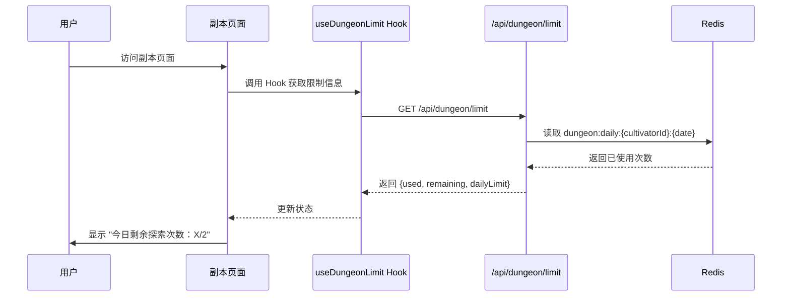

# 副本系统展示优化设计

## 一、优化目标

针对副本系统存在的三个用户体验问题进行优化：

1. 副本入口页面显示过时的"体验版"文案，未体现实际的每日探索次数限制
2. 副本历史记录中详细日志以纯文本形式展示，缺乏结构化和可读性
3. 副本历史记录页面缺少入口，用户无法便捷访问

## 二、问题分析

### 问题 1：入口页面文案过时

**当前状态**

- 位置：`DungeonViewRenderer.tsx` 第 132 行
- 内容：`* 每日仅可探索一次（体验版，不会消耗材料、获得奖励）`
- 问题：与实际业务逻辑不符，副本已实现完整功能（消耗材料、发放奖励、每日 2 次限制）

**业务逻辑现状**

- 每日探索限制：2 次（定义在 `lib/dungeon/dungeonLimiter.ts`）
- 限制检查：通过 Redis 存储每日计数，key 格式为 `dungeon:daily:{cultivatorId}:{YYYY-MM-DD}`
- API 端点：`/api/dungeon/limit` 提供剩余次数查询

### 问题 2：历史日志展示不直观

**当前状态**

- 位置：`app/(main)/game/dungeon/history/page.tsx` 第 174-176 行
- 展示方式：使用 `<pre>` 标签直接渲染 `record.log` 字符串
- 日志格式示例：`"[Round 1] 场景描述 -> Choice: 选项文本\n[Round 2] ..."`

**存在问题**

- 纯文本堆叠，信息密度高但难以阅读
- 缺乏视觉层次，无法快速定位关键信息（回合数、场景、选择）
- 未充分利用数据结构（DungeonState.history 包含结构化数据）

### 问题 3：历史记录入口缺失

**当前状态**

- 历史记录页面路径：`/game/dungeon/history`
- 首页快捷入口列表：包含"云游探秘"但指向副本主页（`/game/dungeon`）
- 副本主页：无指向历史记录的导航

**影响**

- 用户需手动拼接 URL 或通过浏览器历史访问
- 降低历史记录功能的可发现性和使用频率

## 三、优化方案

### 方案 1：动态显示每日剩余次数

#### 设计思路

在副本入口页面（地图选择视图）动态获取并展示用户当日剩余的探索次数，替代静态的过时文案。

#### 交互流程



#### 数据流设计

**新增自定义 Hook**

| 字段名          | 类型 | 说明             |
| --------------- | ---- | ---------------- |
| useDungeonLimit | Hook | 封装次数查询逻辑 |

**Hook 返回值**

| 字段名               | 类型           | 说明                 |
| -------------------- | -------------- | -------------------- |
| limitInfo            | Object \| null | 限制信息对象         |
| limitInfo.used       | number         | 今日已使用次数       |
| limitInfo.remaining  | number         | 今日剩余次数         |
| limitInfo.dailyLimit | number         | 每日上限（固定为 2） |
| isLoading            | boolean        | 是否正在加载         |
| error                | string \| null | 错误信息             |

**API 响应格式**（已存在）

```
GET /api/dungeon/limit
Response:
{
  "success": true,
  "data": {
    "allowed": boolean,
    "remaining": number,
    "used": number,
    "dailyLimit": number
  }
}
```

#### 文案展示规则

| 剩余次数 | 展示文案                     | 样式提示                     |
| -------- | ---------------------------- | ---------------------------- |
| 2        | 今日剩余探索次数：2/2        | 正常色（text-ink）           |
| 1        | 今日剩余探索次数：1/2        | 警告色（text-amber-600）     |
| 0        | 今日探索次数已用尽，明日再来 | 危险色（text-crimson）       |
| 加载中   | 查询中...                    | 次要色（text-ink-secondary） |
| 错误     | 不显示次数信息（降级展示）   | 无                           |

#### 组件修改位置

**DungeonViewRenderer.tsx**

- 修改位置：第 131-133 行（地图选择视图底部文案）
- 修改方式：条件渲染，根据 `limitInfo` 状态显示不同内容

**useDungeonViewModel.ts**

- 新增：调用 `useDungeonLimit` Hook
- 传递：将 `limitInfo` 通过 `viewState` 传递给视图

### 方案 2：结构化展示历史日志

#### 设计思路

将原始日志字符串解析为结构化数据，以时间线形式呈现每轮探索的场景、选择和结果，提升可读性。

#### 日志数据结构

**原始日志格式**（字符串）

```
[Round 1] 场景描述 -> Choice: 选择文本
[Round 2] 场景描述 -> Choice: 选择文本
...
```

**解析后数据结构**

| 字段名          | 类型           | 说明                 |
| --------------- | -------------- | -------------------- |
| LogEntry        | Object         | 单轮日志条目         |
| LogEntry.round  | number         | 轮次编号             |
| LogEntry.scene  | string         | 场景描述             |
| LogEntry.choice | string \| null | 玩家选择（可能为空） |

#### 解析逻辑

**日志解析函数**

| 函数名          | 参数          | 返回值     | 说明               |
| --------------- | ------------- | ---------- | ------------------ |
| parseDungeonLog | (log: string) | LogEntry[] | 解析原始日志字符串 |

**解析规则**

1. 按换行符分割日志字符串
2. 对每行应用正则匹配：`/\[Round (\d+)\] (.+?)(?: -> Choice: (.+))?$/`
3. 提取回合数、场景描述、选择文本
4. 构建结构化对象数组

#### 视觉设计

**时间线样式组件**

| 层级     | 元素    | 样式说明                            |
| -------- | ------- | ----------------------------------- |
| 容器     | `<div>` | 垂直排列，左侧边框线（border-l-2）  |
| 回合标题 | `<div>` | 粗体，显示"第 X 回"                 |
| 场景描述 | `<p>`   | 正常字重，完整显示场景文本          |
| 选择文本 | `<div>` | 高亮色（text-crimson），箭头前缀"➜" |

**展开收起交互**

| 状态         | 显示内容         | 操作                   |
| ------------ | ---------------- | ---------------------- |
| 收起（默认） | 隐藏详细日志     | 点击"展开详细日志"按钮 |
| 展开         | 显示结构化时间线 | 点击"收起"按钮         |

#### 组件修改位置

**app/(main)/game/dungeon/history/page.tsx**

- 新增：`parseDungeonLog` 工具函数（第 6 行后）
- 修改：第 170-178 行（`<details>` 区块）
- 替换：将 `<pre>` 标签改为结构化时间线组件

### 方案 3：增加历史记录入口

#### 设计思路

在多个用户可能访问的位置添加指向历史记录页面的入口，降低访问成本。

#### 入口位置设计

**位置 1：首页快捷入口（推荐优先级：高）**

| 属性     | 值                                    |
| -------- | ------------------------------------- |
| 位置     | HomeView.tsx（QuickActionsGrid 组件） |
| 标签     | 🗂️ 探险札记                           |
| 链接     | /game/dungeon/history                 |
| 插入位置 | "云游探秘"按钮之后                    |

**位置 2：副本入口页面（推荐优先级：高）**

| 属性     | 值                                      |
| -------- | --------------------------------------- |
| 位置     | DungeonViewRenderer.tsx（地图选择视图） |
| 组件类型 | InkButton                               |
| 标签     | 📖 查看历史记录                         |
| 链接     | /game/dungeon/history                   |
| 样式     | variant="ghost"                         |
| 位置     | 次数提示下方，独立一行居中              |

#### 组件修改位置

**QuickActionsGrid.tsx 或 useHomeViewModel.tsx**

- 修改：`quickActionsConfig` 数组
- 新增项：`{ label: '🗂️ 探险札记', href: '/game/dungeon/history' }`
- 插入位置：在 `{ label: '🏔️ 云游探秘', href: '/game/dungeon' }` 之后

**DungeonViewRenderer.tsx**

- 修改位置：第 113-135 行（地图选择视图）
- 新增元素：在次数提示下方添加 `<InkButton>` 按钮

## 四、数据与接口

### API 依赖

| 端点 | 方法 | 用途 | 返回数据 |
| --- | --- | --- | --- |
| /api/dungeon/limit | GET | 获取每日次数限制 | {used, remaining, dailyLimit, allowed} |
| /api/dungeon/history | GET | 获取历史记录列表 | {records[], pagination} |

### 数据模型

**DungeonHistoryRecord（已存在）**

| 字段      | 类型   | 说明           |
| --------- | ------ | -------------- |
| id        | string | 记录 ID        |
| theme     | string | 副本主题       |
| log       | string | 原始日志字符串 |
| result    | Object | 结算结果       |
| realGains | Array  | 实际获得物品   |
| createdAt | string | 创建时间       |

**解析后日志条目（新增）**

| 字段   | 类型           | 说明                 |
| ------ | -------------- | -------------------- |
| round  | number         | 轮次编号             |
| scene  | string         | 场景描述文本         |
| choice | string \| null | 玩家选择文本（可选） |

## 五、用户体验优化

### 信息层级

| 优先级 | 信息类型     | 展示方式                     |
| ------ | ------------ | ---------------------------- |
| P0     | 剩余次数     | 入口页面显眼位置，带色彩提示 |
| P1     | 历史记录入口 | 多处可访问，降低学习成本     |
| P2     | 日志回合数   | 结构化展示，快速定位         |
| P3     | 日志详情     | 默认收起，按需展开           |

### 响应式提示

| 场景      | 提示内容                       | 交互               |
| --------- | ------------------------------ | ------------------ |
| 次数耗尽  | "今日探索次数已用尽，明日再来" | 禁用"开始探索"按钮 |
| 仅剩 1 次 | "今日剩余探索次数：1/2"        | 黄色警告色         |
| 加载失败  | 不显示次数（降级处理）         | 不阻塞主流程       |

### 可访问性

| 考虑点     | 设计措施                                |
| ---------- | --------------------------------------- |
| 文本可读性 | 日志段落使用合适行高（leading-relaxed） |
| 色彩对比   | 警告色和危险色符合 WCAG AA 标准         |
| 交互反馈   | 按钮 hover 和 disabled 状态明确         |

## 六、兼容性与降级

### 错误处理

| 错误场景         | 处理策略                       |
| ---------------- | ------------------------------ |
| 次数查询失败     | 不显示次数信息，不阻塞副本入口 |
| 日志解析失败     | 降级显示原始日志文本           |
| 历史记录加载失败 | 显示错误提示，提供重试按钮     |

### 数据兼容

| 场景             | 处理方式               |
| ---------------- | ---------------------- |
| 旧日志格式不匹配 | 正则匹配失败时显示原文 |
| 空日志           | 显示"暂无详细记录"     |
| 未开始副本的用户 | 次数显示为 2/2         |

## 七、实施优先级

| 优化项               | 优先级 | 原因                       |
| -------------------- | ------ | -------------------------- |
| 方案 1：动态显示次数 | P0     | 修正错误信息，影响用户决策 |
| 方案 3：添加历史入口 | P0     | 提升功能可发现性，成本低   |
| 方案 2：结构化日志   | P1     | 提升体验，但不阻塞核心流程 |

建议分两个迭代实施：

- 迭代 1：方案 1 + 方案 3（快速修复错误信息和入口问题）
- 迭代 2：方案 2（优化阅读体验）

## 八、非功能性约束

### 性能约束

| 指标               | 目标                  |
| ------------------ | --------------------- |
| 次数查询响应时间   | < 100ms（Redis 读取） |
| 日志解析时间       | < 50ms（纯前端计算）  |
| 历史记录页加载时间 | < 1s（含分页数据）    |

### 维护性约束

| 约束点       | 要求                               |
| ------------ | ---------------------------------- |
| 日志格式依赖 | 解析逻辑需容错，支持格式演进       |
| 次数限制配置 | 从配置文件读取，便于调整           |
| 组件耦合度   | 新增 Hook 保持独立，不污染现有逻辑 |

### 测试覆盖

| 测试类型 | 覆盖范围                   |
| -------- | -------------------------- |
| 单元测试 | 日志解析函数、次数计算逻辑 |
| 集成测试 | 次数查询 API、历史记录 API |
| 用户测试 | 入口可发现性、日志可读性   |
