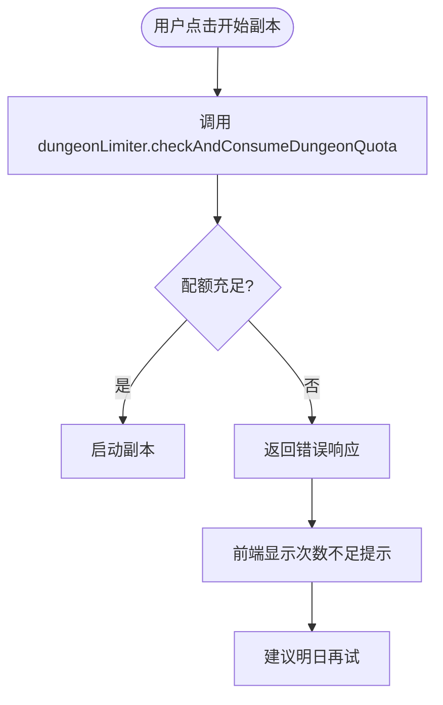

# 副本系统优化设计

## 需求背景

副本系统当前存在以下待优化问题：

1. **数据刷新缺失**：副本结算后未调用 useCultivator 的 refresh 方法，导致用户回到储物袋时无法看到新获得的道具
2. **战斗代价设计缺陷**：AI 在生成选项代价时会同时包含战斗成本和血量蓝量扣除，导致玩家进入战斗前已损失大量生命值，出现"一进战斗就战败"的不合理现象
3. **历史记录缺失**：副本结算后用户无法回顾副本记录，退出后无法查看获得了什么道具和副本经过
4. **缺乏次数限制**：副本系统未限制每日完成次数，需要通过 Redis 实现每个角色每天只能完成 2 次的限制

## 优化目标

1. 确保副本结算后角色数据同步更新至前端状态
2. 优化 AI 生成逻辑，避免战斗选项与虚拟损耗叠加
3. 提供副本历史查询能力，支持用户回顾副本过程和收益
4. 实现每日副本次数限制机制，防止资源滥刷

## 设计方案

### 一、数据刷新机制优化

#### 1.1 问题分析

当前 DungeonViewRenderer 在副本结算完成后展示结算界面，但未触发角色数据刷新，导致：

- 新获得的道具、材料、丹药未同步到前端状态
- 用户进入储物袋页面时看到的是过期数据
- 需要用户手动刷新页面才能看到最新数据

#### 1.2 解决方案

在副本结算完成时主动调用 CultivatorContext 提供的 refresh 方法，确保前端状态与后端数据同步。

**触发时机**：

- 副本正常结算完成后
- 副本战斗失败结算后
- 用户主动放弃副本后（如果有奖励发放）

**刷新范围**：

- 角色基础数据（灵石、修为、寿元等）
- 储物袋数据（材料、丹药、法宝）
- 角色状态（持久状态快照）

**调用位置**：在 DungeonViewRenderer 的 settlement 分支中，展示结算结果后调用 refresh 方法。

#### 1.3 设计约束

- 刷新操作应在结算数据展示之前完成，确保用户看到的数据一致
- 刷新失败不应阻断结算界面展示，但需要提示用户
- 避免重复刷新，使用标志位控制刷新次数

---

### 二、战斗代价生成逻辑优化

#### 2.1 问题分析

当前 AI 生成副本选项时，会为战斗类选项同时添加多种代价：

- `battle`：触发战斗
- `hp_loss`：气血损耗
- `mp_loss`：灵力损耗
- `weak`：虚弱状态

这导致玩家在进入战斗前已经承受了虚拟损耗，使得战斗开始时角色状态已经很差，容易直接战败。

**根本原因**：

- AI 未理解 `battle` 成本与 `hp_loss`/`mp_loss` 的互斥关系
- Prompt 未明确约束战斗选项的代价组合规则

#### 2.2 解决方案

**方案 A：Prompt 约束优化（推荐）**

在 System Prompt 中增加明确的代价组合规则：

- 选项如果包含 `battle` 成本，则不应同时包含 `hp_loss`、`mp_loss`、`weak` 等虚拟损耗成本
- 战斗的难度和损耗应通过 `battle.value`（战斗难度系数）体现
- 虚拟损耗成本仅用于非战斗场景，如强行破阵、催动禁制等

**约束规则表**：

| 成本类型        | 可与 battle 共存 | 说明                   |
| --------------- | ---------------- | ---------------------- |
| spirit_stones   | ✅               | 战前准备消耗灵石合理   |
| lifespan        | ✅               | 燃烧寿元催动法宝合理   |
| cultivation_exp | ⚠️               | 谨慎使用，需明确理由   |
| material        | ✅               | 战前使用符箓等材料合理 |
| hp_loss         | ❌               | 战斗本身会造成气血损耗 |
| mp_loss         | ❌               | 战斗本身会消耗灵力     |
| weak            | ❌               | 战斗结果会决定状态     |
| artifact_damage | ⚠️               | 战前损坏法宝需明确理由 |

**方案 B：后端拦截与清理**

在 DungeonService.handleAction 处理选项成本时，检测并清理不合理的代价组合：

- 如果选项包含 `battle` 成本，过滤掉 `hp_loss`、`mp_loss`、`weak` 成本
- 记录清理日志，用于监控 AI 生成质量
- 向用户展示修正后的代价

**采用策略**：优先采用方案 A（Prompt 约束），辅以方案 B（后端兜底），双重保障。

#### 2.3 Prompt 修改内容

在 `costs` 输出约束部分增加以下内容：

> **战斗代价组合规则**：
>
> - 如果选项包含 `battle` 成本，则**禁止**同时包含 `hp_loss`、`mp_loss`、`weak` 成本
> - 战斗的危险程度通过 `battle.value`（战斗难度系数 1-10）体现
> - 战斗造成的气血、灵力损耗由战斗引擎自动计算
> - 非战斗选项可以使用 `hp_loss`、`mp_loss`、`weak` 表示过程中的损耗
>
> **示例**：
>
> - ✅ 正确：`[{type: "battle", value: 5, desc: "二阶傀儡"}]`
> - ✅ 正确：`[{type: "material", name: "破禁符", value: 1}, {type: "battle", value: 3}]`
> - ❌ 错误：`[{type: "battle", value: 5}, {type: "hp_loss", value: 3}]`
> - ✅ 正确：`[{type: "hp_loss", value: 2, desc: "强行破阵受伤"}]`（无战斗）

---

### 三、副本历史记录查询功能

#### 3.1 数据模型

副本历史数据已存储在 `dungeonHistories` 表中，包含以下字段：

| 字段 | 类型 | 说明 |
| --- | --- | --- |
| id | uuid | 主键 |
| cultivatorId | uuid | 角色ID，外键关联 cultivators 表 |
| theme | varchar(100) | 副本主题/地点名称 |
| result | jsonb | 结算结果，包含 ending_narrative 和 settlement 数据 |
| log | text | 完整交互日志，格式：`[Round X] 场景 -> Choice: 选择` |
| createdAt | timestamp | 创建时间 |

**result JSONB 结构**：

```
{
  settlement: {
    reward_tier: "S" | "A" | "B" | "C" | "D",
    ending_narrative: "结局叙事文本",
    reward_blueprints: [
      {
        type: "spirit_stones" | "material" | "artifact" | "consumable" | "cultivation_exp" | "comprehension_insight",
        name?: "物品名称",
        desc: "物品描述",
        quality?: "lower" | "medium" | "upper",
        tags?: ["标签1", "标签2"]
      }
    ]
  }
}
```

#### 3.2 API 设计

新增副本历史查询接口，支持分页和筛选。

**接口路径**：`GET /api/dungeon/history`

**请求参数**：

| 参数     | 类型   | 必填 | 说明                       |
| -------- | ------ | ---- | -------------------------- |
| page     | number | 否   | 页码，默认 1               |
| pageSize | number | 否   | 每页条数，默认 10，最大 50 |
| tier     | string | 否   | 按评级筛选（S/A/B/C/D）    |

**响应结构**：

```
{
  success: boolean,
  data: [
    {
      id: string,
      theme: string,
      tier: "S" | "A" | "B" | "C" | "D",
      endingNarrative: string,
      rewards: [
        {
          type: string,
          name: string,
          desc: string,
          quantity?: number
        }
      ],
      createdAt: string
    }
  ],
  pagination: {
    page: number,
    pageSize: number,
    total: number,
    totalPages: number
  }
}
```

**查询逻辑**：

- 根据当前用户获取其激活角色的 cultivatorId
- 查询 dungeonHistories 表，按 createdAt 降序排列
- 从 result JSONB 字段提取 settlement 数据
- 支持按 reward_tier 筛选
- 实现分页逻辑

#### 3.3 前端界面设计

**页面位置**：`app/(main)/game/dungeon/history/page.tsx`

**界面结构**：

```
┌─────────────────────────────────────┐
│  【副本历程】                        │
├─────────────────────────────────────┤
│                                     │
│  [标签页]  全部 | S级 | A级 | B级   │
│                                     │
│  ┌────────────────────────────────┐│
│  │ 📜 古修洞府                    ││
│  │ 评级：S  时间：2024-12-30     ││
│  │                                ││
│  │ 结局：你在洞府深处找到...      ││
│  │                                ││
│  │ 收获：                         ││
│  │ • 破禁符 x3                    ││
│  │ • 凝神丹（上品）x1             ││
│  │ • 灵石 +500                    ││
│  │                                ││
│  │ [查看详情]                     ││
│  └────────────────────────────────┘│
│                                     │
│  ┌────────────────────────────────┐│
│  │ 📜 妖兽巢穴                    ││
│  │ 评级：B  时间：2024-12-29     ││
│  │ ...                            ││
│  └────────────────────────────────┘│
│                                     │
│  [上一页]  1 / 5  [下一页]         │
└─────────────────────────────────────┘
```

**详情弹窗**（点击查看详情）：

```
┌─────────────────────────────────────┐
│  副本详情 - 古修洞府                │
├─────────────────────────────────────┤
│                                     │
│  【副本经过】                        │
│  Round 1: 你在洞府入口发现...       │
│  选择: 谨慎探查                     │
│                                     │
│  Round 2: 阵法被触发...             │
│  选择: 使用破禁符                   │
│                                     │
│  Round 3: 遭遇守护傀儡...           │
│  结果: 历经5回合击败傀儡            │
│                                     │
│  【最终结局】                        │
│  你在洞府深处找到了...              │
│                                     │
│  【奖励评级】S                       │
│  • 破禁符 x3                        │
│  • 凝神丹（上品）x1                 │
│  • 灵石 +500                        │
│                                     │
│            [关闭]                   │
└─────────────────────────────────────┘
```

**组件拆分**：

- `DungeonHistoryList`：历史记录列表组件
- `DungeonHistoryCard`：单条记录卡片组件
- `DungeonHistoryDetailModal`：详情弹窗组件
- `DungeonRewardBadge`：奖励徽章组件（显示评级和物品）

#### 3.4 导航入口

在副本相关页面添加历史记录入口：

**位置 1**：副本选择页面（地图界面）

- 在页面顶部添加"【查看副本历程】"按钮
- 跳转到历史记录页面

**位置 2**：副本结算页面

- 在结算界面底部添加"【查看所有副本记录】"链接
- 提示用户可以随时回顾历史副本

**位置 3**：主页面快捷入口

- 在主页面"探索"区域添加"副本历程"入口
- 显示最近一次副本的简要信息

---

### 四、每日副本次数限制

#### 4.1 需求规格

- 每个角色每天最多完成 2 次副本
- 放弃的副本不计入完成次数
- 战斗失败导致的结算计入完成次数
- 每日凌晨自动重置
- 提供查询接口，用于前端展示剩余次数

#### 4.2 技术方案

参考现有的 `LifespanLimiter` 设计模式，创建独立的 `DungeonLimiter` 工具类。

**工具类设计**：`lib/redis/dungeonLimiter.ts`

**核心方法**：

| 方法 | 功能 | 返回值 |
| --- | --- | --- |
| checkAndConsumeDungeonQuota | 检查并消耗副本次数配额 | `{ allowed: boolean, remaining: number, consumed: number, message?: string }` |
| getConsumedCount | 获取今日已完成次数 | `number` |
| getRemainingCount | 获取今日剩余次数 | `number` |
| rollbackDungeonQuota | 回滚副本次数（放弃时） | `void` |

**Redis 数据结构**：

- Key 格式：`dungeon:daily:{cultivatorId}:{YYYY-MM-DD}`
- Value：已完成次数（整数）
- TTL：到明天凌晨的秒数（自动过期）

**常量定义**：

```
class DungeonLimiter {
  private readonly DAILY_LIMIT = 2;  // 每日副本上限

  private getDailyKey(cultivatorId: string): string {
    const today = new Date().toISOString().split('T')[0];
    return `dungeon:daily:${cultivatorId}:${today}`;
  }
}
```

#### 4.3 集成点

**检查时机 1**：启动副本时（预检查）

- 位置：`DungeonService.startDungeon` 方法开始处
- 行为：检查剩余次数，如果为 0 则抛出错误，阻止副本启动
- 错误信息：`今日副本次数已用尽，剩余次数：0/2`

**消耗时机**：副本结算时

- 位置：`DungeonService.settleDungeon` 方法中
- 时机：在发放奖励之后、归档数据之前
- 行为：调用 `checkAndConsumeDungeonQuota`，消耗 1 次配额
- 注意：即使评级为 D 也要消耗次数

**回滚时机**：用户主动放弃副本时

- 位置：`DungeonService.quitDungeon` 方法中
- 行为：不消耗次数（因为未调用 settleDungeon，自然不会消耗）

**特殊情况**：战斗失败导致结算

- 位置：`DungeonService.handleBattleCallback` 中调用 `settleDungeon`
- 行为：正常消耗次数（战斗失败也算完成一次副本）

#### 4.4 前端展示

**查询接口**：`GET /api/dungeon/quota`

**响应结构**：

```
{
  success: true,
  data: {
    dailyLimit: 2,
    consumed: 1,
    remaining: 1
  }
}
```

**展示位置**：

**位置 1**：副本选择页面

- 在页面顶部显示"今日剩余副本次数：1/2"
- 次数用尽时，入口按钮禁用，显示"今日次数已用尽"

**位置 2**：副本结算页面

- 在结算界面底部显示"今日剩余副本次数：0/2"
- 提示"明日凌晨重置"

**组件设计**：

创建 `DungeonQuotaCard` 组件（参考 `LifespanStatusCard`）：

- 显示每日上限和剩余次数
- 进度条展示消耗比例
- 支持自动刷新（可选）
- 支持紧凑模式

#### 4.5 错误处理

**次数不足时的处理流程**：



**错误响应示例**：

```
{
  success: false,
  error: "今日副本次数已用尽",
  data: {
    consumed: 2,
    remaining: 0,
    dailyLimit: 2,
    resetTime: "明日00:00"
  }
}
```

---

## 实现优先级

| 优先级 | 任务                 | 复杂度 | 影响范围          |
| ------ | -------------------- | ------ | ----------------- |
| P0     | 数据刷新机制优化     | 低     | 前端单点修改      |
| P0     | 战斗代价生成逻辑优化 | 中     | Prompt 和后端逻辑 |
| P1     | 副本历史记录查询功能 | 中     | 新增 API 和页面   |
| P1     | 每日副本次数限制     | 中     | 新增工具类和集成  |

## 测试验证要点

### 数据刷新测试

- 副本结算后，储物袋页面应立即显示新获得的物品
- 灵石、修为等资源应同步更新
- 刷新失败时应有友好提示

### 战斗代价测试

- 检查 AI 生成的战斗选项，确保不包含 hp_loss/mp_loss/weak
- 战斗开始时角色状态应为正常（考虑环境和持久状态）
- 非战斗选项可以正常使用虚拟损耗成本

### 历史记录测试

- 完成副本后，历史记录列表应显示该副本
- 详情弹窗应正确展示副本经过和奖励
- 分页和筛选功能正常
- 放弃的副本也应有记录（评级为"放弃"）

### 次数限制测试

- 完成 2 次副本后，第 3 次启动应被拦截
- 放弃副本不消耗次数
- 战斗失败导致的结算应消耗次数
- 次日凌晨配额应自动重置
- 前端次数展示准确

## 兼容性考虑

### 现有数据兼容

- dungeonHistories 表已存在，无需迁移
- 历史记录查询兼容已有数据格式

### API 版本兼容

- 新增接口不影响现有接口
- 副本启动接口增加次数检查，响应格式保持兼容

### 前端状态管理

- CultivatorContext 的 refresh 方法已存在，无需修改
- 新增组件遵循现有 Ink 组件体系

## 文档更新

需要更新以下文档：

1. **副本系统使用指南**
   - 增加每日次数限制说明
   - 增加历史记录查询入口说明

2. **DungeonLimiter 使用指南**
   - 参考 LIFESPAN_LIMITER_GUIDE.md 格式
   - 提供完整的 API 文档和示例

3. **API 文档**
   - 新增副本历史查询接口文档
   - 新增副本配额查询接口文档

## 未来扩展

以下功能可在后续版本考虑：

1. **副本成就系统**
   - 统计 S 级副本完成次数
   - 特定主题副本全通成就
   - 无伤通关成就

2. **副本重玩功能**
   - 允许用户重玩历史副本（不消耗次数，不发放奖励）
   - 用于体验剧情或测试策略

3. **副本分享功能**
   - 生成副本经过分享链接
   - 其他用户可查看但不可操作

4. **副本难度选择**
   - 提供简单/普通/困难模式
   - 难度影响奖励品质和 AI 生成策略
