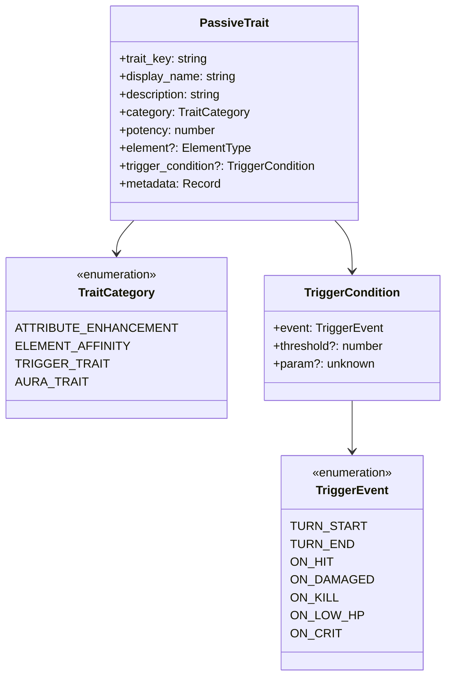

# 效果系统重构设计文档

## 设计概述

本设计旨在将现有的特效词条系统从局限的法宝主动效果模式，重构为统一且可扩展的主被动效果体系。重构后，技能仅触发主动效果，而法宝和功法承载被动效果词条，两类效果相互独立且具备清晰的职责边界。

## 设计目标

### 核心诉求

将游戏中所有效果分为两大类别，并实现统一管理：

- 主动效果：由技能施放触发，包括控制、异常、减益、增益等战斗时效性效果
- 被动效果：作为词条挂载在功法、法宝上，包括属性加成、元素增强、触发特性等持续性效果

### 系统价值

- 统一性：建立清晰的效果分类标准，消除法宝特效与技能效果的概念模糊
- 可扩展性：通过词条化设计，支持未来快速添加新的被动效果类型
- 趣味性：丰富被动词条池，增强装备与功法的多样性组合策略
- 系统性：为后续装备养成、功法进阶等深度玩法奠定架构基础

## 现状分析

### 当前状态引擎结构

现有状态引擎位于 engine/status 目录，具备以下特点：

**StatusContainer（状态容器）**

- 负责管理单个角色的所有临时状态实例
- 支持状态应用、移除、叠加、互斥等逻辑
- 提供状态刷新机制，每回合触发持续伤害和过期检查
- 实现持久状态导出与恢复功能

**StatusRegistry（状态注册表）**

- 维护所有状态的元信息定义
- 支持状态定义和效果计算器注册
- 已预定义 buff、debuff、control、dot、persistent、environmental 六类状态

**效果计算器体系**

- AttributeModifierCalculator：计算状态对属性的修正
- DamageOverTimeCalculator：计算持续伤害
- ActionBlockerCalculator：检查行动限制
- ResistanceCalculator：计算抵抗率

**状态类型枚举**

- buff：增益效果（护体、疾行、锋锐等）
- debuff：减益效果（破防、暴击压制等）
- control：控制效果（眩晕、沉默、定身）
- dot：持续伤害（灼烧、流血、中毒）
- persistent：持久状态（虚弱、重伤、濒死等）
- environmental：环境状态（炎热、冰冻、瘴气等）

### 现有法宝与功法系统

**法宝系统（Artifact）**

当前法宝包含以下字段：

- slot：装备槽位（weapon/armor/accessory）
- element：元素属性
- bonus：属性加成（vitality、spirit、wisdom、speed、willpower）
- special_effects：特殊效果数组
- curses：诅咒效果数组

现有法宝特殊效果类型（ArtifactEffect）：

- damage_bonus：伤害加成
- on_hit_add_effect：攻击命中后添加状态效果（概率触发）
- on_use_cost_hp：使用法术消耗气血
- environment_change：环境变化

**功法系统（CultivationTechnique）**

当前功法结构：

- name：功法名称
- grade：品阶（天阶上品～黄阶下品）
- bonus：属性加成（Partial<Attributes>）
- required_realm：境界要求

**技能系统（Skill）**

当前技能包含：

- type：技能类型（attack/heal/control/debuff/buff）
- element：元素类型
- power：威力值
- cost：消耗
- cooldown：冷却回合
- effect：施加的状态效果
- duration：状态持续时间

### 当前问题识别

**概念混淆**

- 法宝 on_hit_add_effect 实质是"主动触发效果"，与技能 effect 功能重叠
- 法宝特效与技能效果缺乏统一抽象，导致战斗引擎中处理逻辑分散

**扩展受限**

- 无法为法宝添加"五行伤害加成"、"低血触发"、"斩杀效果"等被动词条
- 功法仅支持固定属性加成，缺乏特殊被动能力表达

**战斗引擎耦合**

- BattleEngine 中动态生成法宝技能（createArtifactSkill），将法宝当作主动技能使用
- 法宝效果检查散落在技能执行流程中，未能与状态引擎充分集成

## 设计方案

### 核心概念重定义

**主动效果（Active Effect）**

定义：战斗中由技能施放主动触发的时效性状态效果

分类：

- 增益类：提升施放者或友方属性、能力的正面状态
- 减益类：降低目标防御、属性的负面状态
- 控制类：限制目标行动能力的硬控状态
- 异常类：造成持续伤害或异常状态的效果

承载载体：技能（Skill）作用时机：技能施放命中后立即生效生命周期：有限回合或可被驱散

**被动效果（Passive Effect）**

定义：持续生效的词条化能力，无需主动触发

分类：

- 属性增强类：提升基础属性或战斗数值
- 元素亲和类：增强特定元素伤害或减免
- 触发特性类：满足特定条件时自动触发效果
- 持续光环类：持续影响战斗环境或行为模式

承载载体：功法（CultivationTechnique）、法宝（Artifact）作用时机：装备生效期间持续存在生命周期：随装备状态变化而启用或失效

### 被动效果词条体系

#### 词条数据结构

```
被动效果词条包含以下核心字段：

- trait_id：词条唯一标识符
- trait_key：词条键名（枚举类型）
- display_name：显示名称
- description：效果描述
- category：词条类别（属性增强/元素亲和/触发特性/持续光环）
- potency：效果强度（数值或百分比）
- element：关联元素（可选）
- trigger_condition：触发条件（可选）
- priority：触发优先级（数值越小越优先）
- stackable：是否可叠加（true时多个同类词条累加，false时取最高值）
- metadata：扩展元数据
```

#### 词条品质与数量规则

法宝和功法可拥有的被动词条数量由品质决定：

| 品质 | 最大词条数 |
| ---- | ---------- |
| 凡品 | 0-1        |
| 灵品 | 1-2        |
| 玄品 | 2-3        |
| 真品 | 3-4        |
| 地品 | 3-4        |
| 天品 | 4-5        |
| 仙品 | 4-5        |
| 神品 | 4-5        |

注：实际词条数量在范围内随机，由生成算法决定

#### 词条类别定义

**属性增强类（Attribute Enhancement）**

特征：提供恒定的属性加成或战斗数值修正

词条列表：

| 词条键名          | 显示名称 | 效果描述         | 强度示例     |
| ----------------- | -------- | ---------------- | ------------ | --- |
| vitality_boost    | 体魄强化 | 体魄属性提升     | 1%-30%       | 是  |
| spirit_boost      | 灵力澎湃 | 灵力属性提升     | 1%-30%       | 是  |
| wisdom_boost      | 智慧灵犀 | 悟性属性提升     | 1%-30%       | 是  |
| speed_boost       | 身法轻盈 | 身法属性提升     | 1%-30%       | 是  |
| willpower_boost   | 神识凝练 | 神识属性提升     | 1%-30%       | 是  |
| max_hp_boost      | 气血充盈 | 最大气血提升     | 1%-30%       | 是  |
| max_mp_boost      | 灵力深厚 | 最大灵力提升     | 1%-30%       | 是  |
| hp_regen          | 气血回春 | 回合开始恢复气血 | 1%-10%最大值 | 是  |
| mp_regen          | 灵力复苏 | 回合开始恢复灵力 | 1%-10%最大值 | 是  |
| damage_amplify    | 摧枯拉朽 | 造成伤害提升     | 1%-30%       | 是  |
| damage_reduction  | 金刚不坏 | 受到伤害降低     | 1%-30%       | 是  |
| crit_rate_boost   | 破绽洞察 | 暴击率提升       | 1%-20%       | 是  |
| crit_damage_boost | 致命一击 | 暴击伤害提升     | 1%-50%       | 是  |
| dodge_rate_boost  | 身若游龙 | 闪避率提升       | 1%-20%       | 是  |
| accuracy_boost    | 百步穿杨 | 命中率提升       | 1%-20%       | 是  |
| healing_boost     | 回生妙手 | 治疗效果提升     | 1%-30%       | 是  |

**元素亲和类（Element Affinity）**

特征：影响特定元素的伤害输出或抗性

词条列表：

| 词条键名             | 显示名称 | 效果描述       | 强度示例 |
| -------------------- | -------- | -------------- | -------- | --- |
| fire_damage_boost    | 烈焰精通 | 火元素伤害提升 | 1%-30%   | 是  |
| water_damage_boost   | 寒冰精通 | 水元素伤害提升 | 1%-30%   | 是  |
| wood_damage_boost    | 青木精通 | 木元素伤害提升 | 1%-30%   | 是  |
| metal_damage_boost   | 锐金精通 | 金元素伤害提升 | 1%-30%   | 是  |
| earth_damage_boost   | 厚土精通 | 土元素伤害提升 | 1%-30%   | 是  |
| thunder_damage_boost | 雷霆精通 | 雷元素伤害提升 | 1%-30%   | 是  |
| ice_damage_boost     | 冰霜精通 | 冰元素伤害提升 | 1%-30%   | 是  |
| wind_damage_boost    | 疾风精通 | 风元素伤害提升 | 1%-30%   | 是  |
| fire_resistance      | 抗火之体 | 火元素伤害减免 | 1%-30%   | 是  |
| water_resistance     | 抗水之体 | 水元素伤害减免 | 1%-30%   | 是  |
| wood_resistance      | 抗木之体 | 木元素伤害减免 | 1%-30%   | 是  |
| metal_resistance     | 抗金之体 | 金元素伤害减免 | 1%-30%   | 是  |
| earth_resistance     | 抗土之体 | 土元素伤害减免 | 1%-30%   | 是  |
| thunder_resistance   | 抗雷之体 | 雷元素伤害减免 | 1%-30%   | 是  |
| ice_resistance       | 抗冰之体 | 冰元素伤害减免 | 1%-30%   | 是  |
| wind_resistance      | 抗风之体 | 风元素伤害减免 | 1%-30%   | 是  |
| element_penetration  | 五行破障 | 元素抗性穿透   | 1%-20%   | 是  |

**触发特性类（Trigger Trait）**

特征：满足特定条件时自动触发效果

词条列表：

| 词条键名                 | 显示名称 | 触发条件         | 效果描述           |
| ------------------------ | -------- | ---------------- | ------------------ | -------- | -------------- |
| turn_start_heal          | 养气凝神 | 回合开始         | 恢复一定气血       | 优先级10 | 是             |
| turn_start_mp_gain       | 吐纳法   | 回合开始         | 恢复一定灵力       | 优先级10 | 是             |
| low_hp_defense           | 困兽犹斗 | 气血低于30%      | 大幅提升防御力     | 优先级20 | 否(取最高)     |
| low_hp_attack            | 背水一战 | 气血低于30%      | 大幅提升攻击力     | 优先级20 | 否(取最高)     |
| low_hp_regen             | 涅槃重生 | 气血低于30%      | 每回合恢复气血     | 优先级15 | 是             |
| execute_damage           | 斩杀     | 目标气血低于15%  | 对低血目标额外伤害 | 优先级30 | 是             |
| counter_attack           | 反击     | 受到攻击后       | 概率反击攻击者     | 优先级50 | 否(取最高概率) |
| damage_reflect           | 荆棘护甲 | 受到伤害时       | 反弹部分伤害       | 优先级40 | 是             |
| mp_shield                | 灵力护盾 | 受到伤害时       | 消耗灵力抵消伤害   | 优先级5  | 否(取最高)     |
| first_strike             | 先发制人 | 战斗开始时       | 获得增益状态       | 优先级1  | 否(只触发一次) |
| last_stand               | 殊死一搏 | 即将死亡时       | 一定概率避免死亡   | 优先级1  | 否(取最高概率) |
| skill_cost_reduction     | 节能运转 | 使用技能时       | 降低技能消耗       | 优先级5  | 是             |
| skill_cooldown_reduction | 疾风骤雨 | 技能进入冷却时   | 缩短冷却回合       | 优先级10 | 是             |
| dodge_counter            | 闪避反击 | 成功闪避后       | 立即进行反击       | 优先级10 | 否(只触发一次) |
| status_immunity          | 百毒不侵 | 被施加异常状态时 | 免疫特定状态类型   | 优先级1  | 否(取最高)     |
| revive_once              | 重生     | 首次死亡时       | 复活并恢复部分气血 | 优先级1  | 否(只触发一次) |

**持续光环类（Aura Trait）**

特征：持续改变战斗环境或行为模式

词条列表：

| 词条键名           | 显示名称 | 效果范围   | 效果描述             |
| ------------------ | -------- | ---------- | -------------------- | ------------- | -------------- |
| lifesteal          | 生命吸取 | 自身攻击   | 造成伤害时恢复气血   | 1%-20%        | 是             |
| manasteal          | 灵力吸取 | 自身攻击   | 造成伤害时恢复灵力   | 1%-20%        | 是             |
| thorns             | 荆棘反伤 | 持续存在   | 攻击者受到反弹伤害   | 5%-30%        | 是             |
| mp_burn            | 灵力燃烧 | 自身技能   | 消耗额外灵力提升伤害 | 10%-50%       | 否(取最高)     |
| hp_sacrifice       | 血祭     | 自身技能   | 消耗气血提升威力     | 10%-50%       | 否(取最高)     |
| skill_enhance_aura | 法力强化 | 持续存在   | 所有技能威力提升     | 1%-20%        | 是             |
| defense_aura       | 护体法阵 | 持续存在   | 持续降低受到伤害     | 1%-20%        | 是             |
| speed_aura         | 疾行领域 | 持续存在   | 持续提升行动速度     | 1%-20%        | 是             |
| dot_amplify        | 毒瘴扩散 | 持续存在   | 持续伤害效果增强     | 1%-30%        | 是             |
| control_duration   | 控制延长 | 施加控制时 | 控制效果持续时间延长 | 1-2回合       | 是             |
| status_cleanse     | 净化之光 | 回合开始   | 移除一个负面状态     | 固定效果      | 否(只触发一次) |
| mp_overflow        | 灵力溢出 | 灵力满时   | 灵力溢出转化为护盾   | 10%-50%溢出值 | 否(取最高)     |

### 主动效果整合方案

#### 状态效果扩展

在现有 StatusEffect 枚举基础上扩充新增战斗状态：

**增益状态扩展**

| 状态键名    | 显示名称 | 效果描述     |
| ----------- | -------- | ------------ |
| attack_up   | 蓄力     | 攻击力提升   |
| defense_up  | 铁壁     | 防御力提升   |
| spirit_up   | 灵气激发 | 灵力属性提升 |
| evasion_up  | 飘渺身法 | 闪避率提升   |
| accuracy_up | 神机锁定 | 命中率提升   |
| shield      | 护盾     | 抵挡固定伤害 |
| invincible  | 金刚     | 短暂无敌     |
| regen       | 回春     | 持续恢复气血 |
| mp_regen    | 聚灵     | 持续恢复灵力 |

**减益状态扩展**

| 状态键名      | 显示名称 | 效果描述             |
| ------------- | -------- | -------------------- |
| attack_down   | 虚弱     | 攻击力降低           |
| defense_down  | 破甲     | 防御力降低           |
| spirit_down   | 灵力枯竭 | 灵力属性降低         |
| slow          | 迟缓     | 速度降低             |
| blind         | 目盲     | 命中率大幅降低       |
| vulnerability | 易伤     | 受到伤害提升         |
| curse         | 诅咒     | 治疗效果降低         |
| fragile       | 脆弱     | 防御力和最大气血降低 |

**控制状态扩展**

| 状态键名 | 显示名称 | 效果描述               |
| -------- | -------- | ---------------------- |
| freeze   | 冰冻     | 无法行动且受到额外伤害 |
| petrify  | 石化     | 无法行动但伤害减免     |
| sleep    | 沉睡     | 无法行动，受击清除     |
| fear     | 恐惧     | 无法攻击，只能防御     |
| disarm   | 缴械     | 无法使用武器技能       |

**异常状态扩展**

| 状态键名   | 显示名称 | 效果描述           |
| ---------- | -------- | ------------------ |
| corrosion  | 腐蚀     | 持续伤害且降低防御 |
| shock      | 触电     | 持续伤害且可能眩晕 |
| frostbite  | 冻伤     | 持续伤害且速度降低 |
| ignite     | 引燃     | 高额持续火焰伤害   |
| soul_drain | 灵魂虹吸 | 持续失去灵力       |

#### 技能与主动效果关联

技能不再直接定义效果逻辑，而是通过引用状态键名触发主动效果：

技能施放流程：

1. 技能执行器计算伤害或治疗数值
2. 根据技能的 effect 字段查找对应状态定义
3. 调用状态容器的 addStatus 施加状态
4. 状态容器根据抵抗率、互斥规则等判定是否生效

技能字段保持：

- effect：关联的状态键名
- duration：状态持续回合
- target_self：是否作用于自身

### 法宝与功法改造方案

#### 法宝数据结构调整

移除现有 special_effects 和 curses 字段，新增 passive_traits 字段：

```
法宝新增字段：

- passive_traits：被动词条数组，每个词条包含：
  - trait_key：词条键名
  - potency：效果强度（覆盖默认值）
  - metadata：额外数据

保留字段：
- bonus：基础属性加成
- element：元素属性
- slot：装备槽位
- quality：品质
```

法宝示例：

某天阶上品火系武器：

- 名称：焚天神剑
- 元素：火
- 品质：天品
- 属性加成：spirit +100, willpower +80
- 被动词条：
  - 烈焰精通（火元素伤害+30%）
  - 灵力吸取（造成伤害恢复5%灵力）
  - 斩杀（目标低血额外伤害）

#### 功法数据结构调整

在现有结构基础上新增 passive_traits 字段：

```
功法新增字段：

- passive_traits：被动词条数组（结构同法宝）
- special_description：特殊能力描述文本

保留字段：
- bonus：基础属性加成
- grade：功法品阶
- required_realm：境界要求
```

功法示例：

某地阶上品功法：

- 名称：九转玄功
- 品阶：地阶上品
- 境界要求：元婴
- 属性加成：vitality +60, willpower +40
- 被动词条：
  - 金刚不坏（受到伤害降低15%）
  - 养气凝神（回合开始恢复3%气血）
  - 涅槃重生（低血时回血速度翻倍）

#### 法宝主动技能移除

移除战斗引擎中的 createArtifactSkill 逻辑，法宝不再生成主动技能：

- 法宝仅通过 bonus 和 passive_traits 影响战斗
- 被动词条在战斗初始化时加载到效果计算系统
- 触发类词条在相应时机检查并执行

### 战斗引擎集成方案

#### 被动效果管理器（PassiveEffectManager）

新增被动效果管理组件，职责包括：

**初始化阶段**

- 从角色的法宝和功法中收集所有被动词条
- 将被动词条转化为内部效果实例
- 注册到效果计算系统

**战斗阶段**

- 属性计算时应用被动增强类词条
- 伤害计算时应用元素亲和类词条
- 特定时机触发触发特性类词条
- 持续光环类词条全程生效

**数据流向**

```
角色装备法宝/功法
    ↓
战斗初始化
    ↓
PassiveEffectManager 收集词条
    ↓
转化为效果实例
    ↓
注册到 BattleUnit
    ↓
战斗流程中调用
```

#### BattleUnit 扩展

BattleUnit 需要新增被动效果管理能力：

新增字段：

- passiveEffects：被动效果实例列表
- passiveEffectManager：被动效果管理器引用

新增方法：

- loadPassiveTraits：加载被动词条
- applyPassiveModifications：应用被动修正
- checkTriggerConditions：检查触发条件
- executeTriggeredEffect：执行触发效果

#### 战斗流程调整

**战斗初始化**

1. 创建 BattleUnit 实例
2. 加载角色的持久状态
3. 加载角色的被动词条
4. 计算初始属性（应用被动修正）

**回合开始**

1. 触发"回合开始"类被动效果（回春、聚灵等）
2. 刷新状态容器（DOT 伤害、状态过期）
3. 检查是否触发"低血"类被动效果

**技能执行**

1. 检查技能消耗（应用消耗降低词条）
2. 计算技能伤害（应用伤害增幅、元素精通等）
3. 应用技能状态效果
4. 触发"击杀后"、"暴击后"等被动效果

**受到伤害**

1. 触发"灵力护盾"类词条（优先消耗灵力）
2. 计算伤害减免（应用防御类词条）
3. 触发"反击"、"反伤"类词条
4. 应用最终伤害

### 效果计算器扩展

#### PassiveEffectCalculator

新增被动效果计算器，负责被动词条的数值计算：

核心方法：

- calculateAttributeBonus：计算属性加成
- calculateElementDamageMultiplier：计算元素伤害倍率
- calculateElementResistance：计算元素抗性
- calculateDamageModifier：计算伤害修正
- calculateHealingModifier：计算治疗修正
- calculateCostReduction：计算消耗降低
- evaluateTriggerCondition：评估触发条件

计算上下文：

- 角色当前状态（气血、灵力、状态列表）
- 战斗环境信息（回合数、对手信息）
- 触发事件类型（受击、施法、回合开始等）

#### CalculationContext 增强

在现有 CalculationContext 基础上新增字段：

```
CalculationContext 新增：

- passiveEffects：被动效果列表
- triggerEvent：触发事件类型（可选）
- eventData：事件数据（可选）
```

触发事件类型枚举：

- turn_start：回合开始
- turn_end：回合结束
- before_skill：技能施放前
- after_skill：技能施放后
- on_hit：命中目标时
- on_damaged：受到伤害时
- on_kill：击杀目标时
- on_dodge：成功闪避时
- on_crit：暴击时
- on_low_hp：低血时

### 数据结构定义

#### 法宝表（artifacts）字段定义

移除字段：

- special_effects（jsonb）：旧的特殊效果字段
- curses（jsonb）：旧的诅咒效果字段

新增字段：

- passive_traits（jsonb）：存储被动词条数组

#### 功法表（cultivationTechniques）字段定义

新增字段：

- passive_traits（jsonb）：存储被动词条数组
- special_description（text）：特殊能力描述

## 创意效果扩展

### 高级触发特性

**修仙特色词条**

| 词条键名 | 显示名称 | 触发条件 | 效果 |
| --- | --- | --- | --- | --- |
| qi_deviation_burst | 走火入魔 | 灵力低于10% | 临时大幅提升攻击但持续掉血 | 否(只触发一次) |
| dao_enlightenment | 悟道瞬间 | 连续三回合未受伤 | 获得短暂无敌并恢复状态 | 否(只触发一次) |
| spirit_beast_summon | 灵兽守护 | 首次受到致命伤 | 替死并恢复少量气血 | 否(只触发一次) |
| formation_mastery | 阵法大师 | 战斗持续超过10回合 | 布置法阵压制敌人 | 否(只触发一次) |
| pill_overdose | 丹毒爆发 | 使用恢复效果后 | 恢复量提升但累积丹毒 | 否(取最高) |
| bloodline_awakening | 血脉觉醒 | 气血低于50%时首次 | 属性大幅提升，持续到战斗结束 | 否(只触发一次) |

**元素组合词条**

| 词条键名 | 显示名称 | 触发条件 | 效果 |
| --- | --- | --- | --- | --- | --- |
| metal_wood_clash | 金木相克 | 金系攻击木元素敌人 | 造成额外真实伤害 | 10%-50% | 否(取最高) |
| thunder_water_synergy | 雷涌 | 敌人有水属性状态时使用雷系 | 伤害提升并有概率麻痹 | 20%-100% | 否(取最高) |

**境界相关词条**

| 词条键名           | 显示名称 | 触发条件       | 效果                   |
| ------------------ | -------- | -------------- | ---------------------- |
| realm_suppression  | 境界压制 | 对低境界敌人   | 全属性碾压，增伤减免伤 |
| underdog_burst     | 越级挑战 | 对高境界敌人   | 暴击率和伤害提升       |
| realm_breakthrough | 临阵突破 | 击败高境界敌人 | 战斗后获得额外修为     |
| bottleneck_power   | 瓶颈之力 | 当前境界圆满   | 战斗属性额外加成       |

### 高级持续光环

**功法特色光环**

| 词条键名 | 显示名称 | 效果范围 | 效果 |
| --- | --- | --- | --- | --- | --- |
| yin_yang_balance | 阴阳调和 | 持续存在 | 气血灵力互相转化 | 固定效果 | 否(只保留一个) |
| qi_circulation | 周天运转 | 持续存在 | 每回合恢复气血和灵力 | 1%-5% | 是 |
| heavenly_dao | 天道契合 | 持续存在 | 所有效果持续时间延长 | 1-2回合 | 是 |
| chaos_body | 混沌体质 | 持续存在 | 随机元素伤害提升 | 10%-30% | 否(取最高) |
| immortal_physique | 不灭金身 | 持续存在 | 持续恢复且伤害减免 | 恢复2%-5%+减伤5%-15% | 否(取最高) |
| spirit_root_resonance | 灵根共鸣 | 持续存在 | 匹配元素技能威力大幅提升 | 10%-50% | 否(取最高) |
| karma_link | 因果牵引 | 持续存在 | 对敌人造成伤害时，自身也受少量伤害 | 5%-20%反噬 | 否(取最高) |

**法宝特殊光环**

| 词条键名           | 显示名称 | 效果范围       | 效果                   |
| ------------------ | -------- | -------------- | ---------------------- | ------------------------------- | ---------- |
| weapon_spirit      | 器灵觉醒 | 持续存在       | 攻击有概率触发额外伤害 | 10%-30%概率造成50%-150%额外伤害 | 否(取最高) |
| artifact_resonance | 法宝共鸣 | 多件同元素法宝 | 元素伤害提升叠加       | 每件5%-15%                      | 是         |
| cursed_power       | 诅咒之力 | 持续存在       | 提升伤害但持续损失气血 | 伤害+10%-50%,每回合失血1%-5%    | 否(取最高) |
| divine_blessing    | 神器祝福 | 持续存在       | 所有状态效果增强       | 10%-30%                         | 否(取最高) |
| space_distortion   | 空间扭曲 | 持续存在       | 闪避率提升             | 5%-20%                          | 是         |

## 实施路径

### 阶段划分

**阶段一：基础架构搭建**

目标：建立被动效果词条系统的核心框架

任务：

- 定义 PassiveTrait 数据结构
- 创建词条类别枚举和键名常量
- 实现 PassiveTraitRegistry 词条注册表
- 编写 PassiveEffectCalculator 基础计算器
- 注册第一批基础词条（属性增强类、元素亲和类）

交付物：

- 词条类型定义文件
- 词条注册表模块
- 基础计算器实现
- 单元测试覆盖

**阶段二：战斗引擎集成**

目标：将被动效果系统集成到战斗流程

任务：

- 实现 PassiveEffectManager 管理器
- 扩展 BattleUnit 支持被动效果加载
- 修改战斗初始化流程加载被动词条
- 在伤害计算、属性修正中应用被动效果
- 实现基础触发特性检查机制

交付物：

- PassiveEffectManager 模块
- BattleUnit 扩展实现
- 战斗流程调整
- 集成测试用例

**阶段三：数据模型调整**

目标：调整法宝和功法数据结构

任务：

- 修改 Artifact 类型定义，替换 special_effects 为 passive_traits
- 修改 CultivationTechnique 类型定义，新增 passive_traits
- 更新 schema 定义
- 更新法宝和功法的 CRUD 接口

交付物：

- 更新后的类型定义
- schema 定义调整
- API 接口调整

**阶段四：高级词条实现**

目标：实现触发特性类和持续光环类词条

任务：

- 扩展 PassiveEffectCalculator 支持复杂触发逻辑
- 实现回合开始、受击、击杀等触发事件
- 实现生命吸取、反伤、灵力护盾等光环效果
- 注册高级词条到词条表
- 编写复杂词条的测试案例

交付物：

- 完整的触发机制
- 光环效果实现
- 高级词条注册
- 场景测试

**阶段五：AI生成集成**

目标：将被动词条系统集成到AI生成流程

任务：

- 更新法宝生成提示词，让AI指定词条方向
- 实现词条生成算法，根据品质、元素、境界计算词条
- 更新功法生成提示词，支持被动词条
- 调整生成后的数值计算逻辑

交付物：

- 更新的提示词模板
- 词条生成算法
- AI返回结果解析逻辑
- 生成测试用例

**阶段六：主动效果扩展**

目标：扩充状态效果池，丰富技能选择

任务：

- 扩展 StatusEffect 枚举新增状态类型
- 在 StatusRegistry 中注册新增状态定义
- 为新状态编写对应的效果计算器逻辑
- 更新技能生成逻辑支持新状态
- 移除法宝主动技能生成逻辑

交付物：

- 扩展的状态枚举
- 新增状态定义
- 效果计算器更新
- 战斗引擎清理

**阶段七：前端展示与体验**

目标：在前端展示被动词条，优化用户体验

任务：

- 设计词条展示组件
- 在法宝详情页显示被动词条列表
- 在功法详情页显示被动词条列表
- 在战斗日志中展示触发效果
- 优化词条描述文案，融入古风语境

交付物：

- 词条展示组件
- 法宝功法页面更新
- 战斗日志优化
- 文案润色

### 技术依赖

**数据层**

- drizzle ORM：数据库迁移和模型定义
- PostgreSQL：JSONB 字段存储词条数组

**引擎层**

- engine/status：状态引擎核心
- engine/battle：战斗引擎 V2
- types/constants：常量和枚举定义

**前端层**

- React 组件：词条展示
- InkUI 组件体系：UI 风格统一

### 风险控制

**性能影响**

风险：被动效果计算增加战斗计算复杂度

措施：

- 词条效果按需计算，避免全量遍历
- 缓存计算结果，减少重复计算
- 性能测试验证回合耗时

**平衡性调整**

风险：新增词条可能导致数值失衡

措施：

- 分批次上线词条，逐步观察影响
- 设置词条强度上限
- 保留词条数值热更新能力

## 测试策略

### 单元测试

**词条注册表测试**

- 词条注册和查询功能
- 词条分类过滤
- 重复注册检测

**效果计算器测试**

- 属性加成计算准确性
- 元素伤害倍率计算
- 触发条件判定逻辑
- 边界值和异常情况

**被动效果管理器测试**

- 词条加载和转化
- 效果实例管理
- 触发事件分发

### 集成测试

**战斗流程测试**

- 被动效果在战斗初始化正确加载
- 属性修正应用正确
- 伤害计算包含被动加成
- 触发特性在正确时机执行

**数据验证测试**

- 新法宝数据结构正确性验证
- 战斗功能正常
- 前端正确展示词条数据

### 场景测试

**词条组合测试**

- 多个属性增强词条叠加效果
- 元素精通与元素技能协同
- 触发特性的连锁反应
- 光环效果的持续影响

**极端场景测试**

- 大量词条同时生效时的性能
- 触发条件边界情况（如恰好30%血量）
- 词条冲突或互斥场景

## 配置示例

### 被动词条定义示例



### 法宝配置示例

焚天神剑（天品火系武器）：

| 字段           | 值                         |
| -------------- | -------------------------- |
| name           | 焚天神剑                   |
| slot           | weapon                     |
| element        | 火                         |
| quality        | 天品                       |
| required_realm | 元婴                       |
| bonus          | spirit: 100, willpower: 80 |
| passive_traits | 见下表                     |

被动词条配置：

| trait_key         | potency | 说明                  |
| ----------------- | ------- | --------------------- |
| fire_damage_boost | 30      | 火元素伤害+30%        |
| manasteal         | 5       | 造成伤害时恢复5%灵力  |
| execute_damage    | 50      | 目标低血时额外50%伤害 |

### 功法配置示例

九转玄功（地阶上品功法）：

| 字段           | 值                          |
| -------------- | --------------------------- |
| name           | 九转玄功                    |
| grade          | 地阶上品                    |
| required_realm | 元婴                        |
| bonus          | vitality: 60, willpower: 40 |
| passive_traits | 见下表                      |

被动词条配置：

| trait_key        | potency | 说明               |
| ---------------- | ------- | ------------------ |
| damage_reduction | 15      | 受到伤害降低15%    |
| turn_start_heal  | 3       | 回合开始恢复3%气血 |
| low_hp_regen     | 100     | 低血时回复效果翻倍 |

## 扩展性考量

### 未来功能预留

**词条品质系统**

- 为词条引入品质等级（普通/稀有/史诗/传说）
- 同一词条不同品质效果强度不同
- 支持词条升级或强化机制

**词条镶嵌系统**

- 法宝和功法预留词条槽位
- 玩家可自由镶嵌词条
- 不同槽位限制词条类别

**词条组合效果**

- 特定词条组合触发额外效果
- 套装效果概念引入
- 协同增益机制

**词条随机生成**

- AI 生成随机词条组合
- 根据品质和境界约束词条池
- 增加装备掉落的随机性

### 数据扩展性

**词条元数据扩展**

- 支持多层级触发条件
- 词条之间的依赖关系
- 词条冷却机制

**效果计算扩展**

- 支持自定义计算公式
- 引入脚本化效果描述
- 动态效果参数

## 交付清单

### 核心模块

- PassiveTraitRegistry：被动词条注册表
- PassiveEffectCalculator：被动效果计算器
- PassiveEffectManager：被动效果管理器
- StatusRegistry 扩展：新增状态定义

### 数据层

- artifacts 表结构定义
- cultivationTechniques 表结构定义
- 词条数据种子文件
- 类型定义更新

### 战斗引擎

- BattleUnit 扩展实现
- 战斗初始化流程调整
- 触发事件机制实现
- 法宝主动技能移除

### 前端组件

- PassiveTraitCard：词条展示卡片
- PassiveTraitList：词条列表组件
- 法宝详情页更新
- 功法详情页更新

### 测试与文档

- 单元测试套件
- 集成测试用例
- 性能测试报告
- 词条配置文档
- 开发指南

## 总结

本设计将游戏效果体系重构为主被动效果分离的架构，主动效果由技能触发，被动效果以词条形式挂载在法宝和功法上。通过建立统一的词条注册表和效果计算器，实现效果的系统化管理和灵活扩展。

设计充分考虑了修仙题材的特色，引入境界压制、五行相生、走火入魔等具有修仙世界观特色的词条类型，丰富玩法策略深度。同时通过模块化设计和分阶段实施，确保系统平滑过渡和向后兼容。

未来可在此基础上进一步扩展词条镶嵌、套装效果、词条强化等深度养成玩法，为玩家提供更丰富的装备搭配和策略选择空间。

- 触发事件机制实现
- 法宝主动技能移除

### 前端组件

- PassiveTraitCard：词条展示卡片
- PassiveTraitList：词条列表组件
- 法宝详情页更新
- 功法详情页更新

### 测试与文档

- 单元测试套件
- 集成测试用例
- 性能测试报告
- 词条配置文档
- 开发指南

## 总结

本设计将游戏效果体系重构为主被动效果分离的架构，主动效果由技能触发，被动效果以词条形式挂载在法宝和功法上。通过建立统一的词条注册表和效果计算器，实现效果的系统化管理和灵活扩展。

设计充分考虑了修仙题材的特色，引入境界压制、五行相生、走火入魔等具有修仙世界观特色的词条类型，丰富玩法策略深度。同时通过模块化设计和分阶段实施，确保系统平滑过渡和向后兼容。

未来可在此基础上进一步扩展词条镶嵌、套装效果、词条强化等深度养成玩法，为玩家提供更丰富的装备搭配和策略选择空间。
