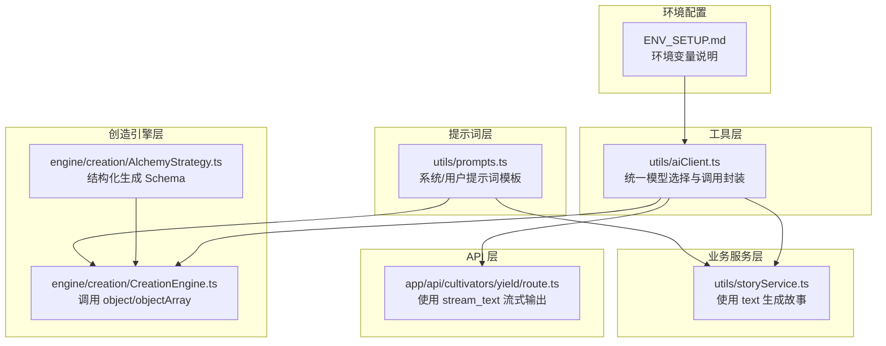
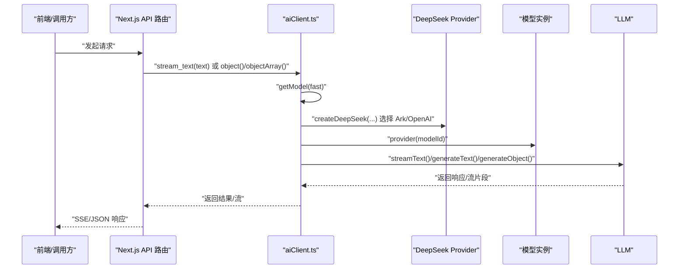
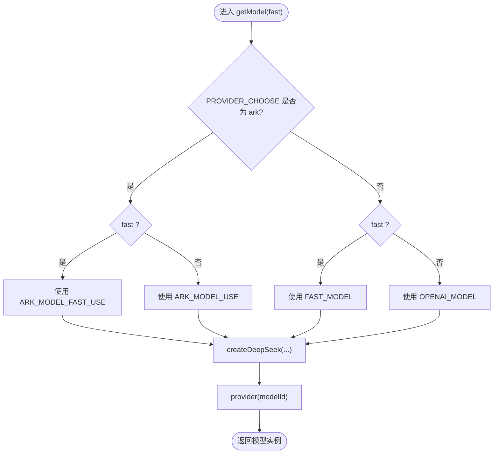
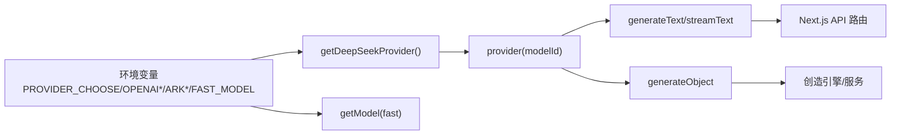

# AI客户端封装

<cite>
**本文引用的文件**
- [aiClient.ts](file://utils/aiClient.ts)
- [prompts.ts](file://utils/prompts.ts)
- [storyService.ts](file://utils/storyService.ts)
- [AlchemyStrategy.ts](file://engine/creation/strategies/AlchemyStrategy.ts)
- [CreationEngine.ts](file://engine/creation/CreationEngine.ts)
- [route.ts](file://app/api/cultivators/yield/route.ts)
- [ENV_SETUP.md](file://ENV_SETUP.md)
</cite>

## 目录
1. [简介](#简介)
2. [项目结构](#项目结构)
3. [核心组件](#核心组件)
4. [架构总览](#架构总览)
5. [详细组件分析](#详细组件分析)
6. [依赖关系分析](#依赖关系分析)
7. [性能考量](#性能考量)
8. [故障排查指南](#故障排查指南)
9. [结论](#结论)
10. [附录](#附录)

## 简介
本文件面向开发者与产品同学，系统化梳理项目中的AI客户端封装，重点说明aiClient.ts如何通过@ai-sdk/deepseek封装对DeepSeek与OpenAI兼容模型的调用；解释getModel函数如何根据环境变量(PROVIDER_CHOOSE、ARK_BASE_URL等)动态选择模型提供者与模型实例；详解text、stream_text、object、objectArray、tool等核心函数的参数、返回值与使用场景；阐述providerOptions中thinking配置的作用；说明parseAIResponse如何处理AI返回的非标准JSON格式；给出实际调用示例、错误处理与重试机制建议，以及性能优化策略（fast参数的使用场景）。

## 项目结构
AI客户端封装位于utils目录下的aiClient.ts，围绕该模块构建了多处业务使用点：
- 工具函数层：aiClient.ts提供统一的模型选择与调用封装
- 提示词层：prompts.ts提供系统提示词与用户提示词模板
- 业务服务层：storyService.ts使用aiClient.text生成故事文案
- 创造引擎层：AlchemyStrategy与CreationEngine结合aiClient.object进行结构化生成
- API层：app/api/cultivators/yield/route.ts使用aiClient.stream_text进行流式生成
- 环境配置：ENV_SETUP.md说明环境变量配置

图表来源
- [aiClient.ts](file://utils/aiClient.ts#L1-L211)
- [prompts.ts](file://utils/prompts.ts#L1-L356)
- [storyService.ts](file://utils/storyService.ts#L1-L22)
- [AlchemyStrategy.ts](file://engine/creation/strategies/AlchemyStrategy.ts#L1-L185)
- [CreationEngine.ts](file://engine/creation/CreationEngine.ts#L84-L133)
- [route.ts](file://app/api/cultivators/yield/route.ts#L160-L207)
- [ENV_SETUP.md](file://ENV_SETUP.md#L1-L39)

章节来源
- [aiClient.ts](file://utils/aiClient.ts#L1-L211)
- [prompts.ts](file://utils/prompts.ts#L1-L356)
- [storyService.ts](file://utils/storyService.ts#L1-L22)
- [AlchemyStrategy.ts](file://engine/creation/strategies/AlchemyStrategy.ts#L1-L185)
- [CreationEngine.ts](file://engine/creation/CreationEngine.ts#L84-L133)
- [route.ts](file://app/api/cultivators/yield/route.ts#L160-L207)
- [ENV_SETUP.md](file://ENV_SETUP.md#L1-L39)

## 核心组件
- 模型提供者选择：getDeepSeekProvider根据PROVIDER_CHOOSE选择Ark或OpenAI兼容路径
- 模型实例选择：getModel根据fast参数与不同提供商的环境变量选择快模型或常规模型
- 文本生成：text、stream_text分别提供同步与流式文本生成
- 结构化生成：object、objectArray分别生成单对象与数组对象，内置maxRetries
- 工具调用：tool支持工具集调用
- JSON解析：parseAIResponse增强解析鲁棒性

章节来源
- [aiClient.ts](file://utils/aiClient.ts#L1-L211)

## 架构总览
下面的序列图展示了从API到AI客户端再到模型提供者的调用链路，以及流式与结构化生成的关键节点。

图表来源
- [aiClient.ts](file://utils/aiClient.ts#L1-L211)
- [route.ts](file://app/api/cultivators/yield/route.ts#L160-L207)

## 详细组件分析

### 模型选择与提供者封装
- getDeepSeekProvider
  - 当PROVIDER_CHOOSE为ark时，使用ARK_BASE_URL与ARK_API_KEY创建DeepSeek Provider
  - 否则使用OPENAI_API_KEY与OPENAI_BASE_URL创建DeepSeek Provider（兼容OpenAI生态）
- getModel
  - fast=true时，优先使用ARK_MODEL_FAST_USE或FAST_MODEL
  - fast=false时，使用ARK_MODEL_USE或OPENAI_MODEL
  - 返回provider(modelId)的模型实例

图表来源
- [aiClient.ts](file://utils/aiClient.ts#L1-L37)

章节来源
- [aiClient.ts](file://utils/aiClient.ts#L1-L37)

### 文本生成接口：text
- 参数
  - prompt: 系统提示词
  - userInput: 用户输入
  - fast: 是否使用快速模型
- 行为
  - 选择模型实例
  - 调用generateText
  - providerOptions中deepseek.thinking设置为disabled
  - 返回包含totalUsage等信息的结果对象
- 使用场景
  - 需要稳定、可控的文本生成，不需要思维过程输出
  - 适合故事生成、简短问答等

章节来源
- [aiClient.ts](file://utils/aiClient.ts#L42-L62)
- [storyService.ts](file://utils/storyService.ts#L1-L22)

### 流式文本生成：stream_text
- 参数
  - prompt: 系统提示词
  - userInput: 用户输入
  - fast: 是否使用快速模型
  - thinking: 是否开启DeepSeek思维过程输出
- 行为
  - 选择模型实例
  - 调用streamText
  - providerOptions中deepseek.thinking根据thinking参数设置为auto或disabled
  - onFinish回调中记录totalUsage
  - 返回可迭代的流对象
- 使用场景
  - 实时展示AI生成内容，如推演过程、战斗播报等
  - 需要边生成边渲染的交互体验

章节来源
- [aiClient.ts](file://utils/aiClient.ts#L67-L90)
- [route.ts](file://app/api/cultivators/yield/route.ts#L160-L207)

### 结构化对象生成：object
- 参数
  - prompt: 系统提示词
  - userInput: 用户输入
  - options: 包含schema、schemaName、schemaDescription
  - fast: 是否使用快速模型
  - thinking: 是否开启DeepSeek思维过程输出
- 行为
  - 选择模型实例
  - 调用generateObject
  - providerOptions中deepseek.thinking根据thinking参数设置
  - 内置maxRetries=3
  - 返回包含object与usage等信息的结果对象
- 使用场景
  - 需要严格Schema的数据结构，如炼丹产物、技能信息等

章节来源
- [aiClient.ts](file://utils/aiClient.ts#L95-L124)
- [AlchemyStrategy.ts](file://engine/creation/strategies/AlchemyStrategy.ts#L1-L185)
- [CreationEngine.ts](file://engine/creation/CreationEngine.ts#L84-L133)

### 结构化数组生成：objectArray
- 参数
  - prompt: 系统提示词
  - userInput: 用户输入
  - options: 包含schema、schemaName、schemaDescription
  - fast: 是否使用快速模型
  - thinking: 是否开启DeepSeek思维过程输出
- 行为
  - 选择模型实例
  - 调用generateObject，output设为array
  - providerOptions中deepseek.thinking根据thinking参数设置
  - 内置maxRetries=3
  - 返回包含object数组与usage等信息的结果对象
- 使用场景
  - 需要生成多个结构化对象的集合，如多个材料或技能

章节来源
- [aiClient.ts](file://utils/aiClient.ts#L129-L159)
- [CreationEngine.ts](file://engine/creation/CreationEngine.ts#L84-L133)

### 工具调用：tool
- 参数
  - prompt: 系统提示词
  - userInput: 用户输入
  - tools: ToolSet工具集
  - thinking: 是否开启DeepSeek思维过程输出
- 行为
  - 选择模型实例
  - 调用generateText并传入tools
  - providerOptions中deepseek.thinking根据thinking参数设置
  - 返回包含text与usage等信息的结果对象
- 使用场景
  - 需要AI调用外部工具完成特定任务

章节来源
- [aiClient.ts](file://utils/aiClient.ts#L164-L186)

### JSON解析增强：parseAIResponse
- 功能
  - 优先尝试直接解析JSON
  - 若失败，尝试从字符串中提取第一个JSON对象并解析
  - 若仍失败，抛出明确错误
- 使用场景
  - 当AI返回包含额外文本的非标准JSON时，保证解析稳健性

章节来源
- [aiClient.ts](file://utils/aiClient.ts#L188-L210)

### 提示词模板与使用
- prompts.ts提供多类提示词模板，包括角色生成、战斗报告、突破故事、寿元耗尽故事等
- storyService.ts演示了如何使用aiClient.text生成故事文本
- AlchemyStrategy与CreationEngine演示了如何使用aiClient.object进行结构化生成

章节来源
- [prompts.ts](file://utils/prompts.ts#L1-L356)
- [storyService.ts](file://utils/storyService.ts#L1-L22)
- [AlchemyStrategy.ts](file://engine/creation/strategies/AlchemyStrategy.ts#L1-L185)
- [CreationEngine.ts](file://engine/creation/CreationEngine.ts#L84-L133)

## 依赖关系分析
- aiClient.ts依赖@ai-sdk/deepseek与ai库的generateText/streamText/generateObject
- 业务层通过aiClient.ts间接依赖环境变量(PROVIDER_CHOOSE、OPENAI_*、ARK_*、FAST_MODEL等)
- API层通过aiClient.stream_text实现SSE流式输出
- 创造引擎通过aiClient.object/objectArray实现结构化产物生成

图表来源
- [aiClient.ts](file://utils/aiClient.ts#L1-L211)
- [route.ts](file://app/api/cultivators/yield/route.ts#L160-L207)
- [CreationEngine.ts](file://engine/creation/CreationEngine.ts#L84-L133)

章节来源
- [aiClient.ts](file://utils/aiClient.ts#L1-L211)
- [route.ts](file://app/api/cultivators/yield/route.ts#L160-L207)
- [CreationEngine.ts](file://engine/creation/CreationEngine.ts#L84-L133)

## 性能考量
- fast参数的使用场景
  - 在需要更快响应、成本更低或对质量要求不高的场景下启用fast
  - 通过MODEL_FAST_USE与FAST_MODEL切换到更快的模型实例
- 流式输出
  - 使用stream_text与SSE可实现边生成边渲染，改善用户体验
- 结构化生成的重试
  - object与objectArray内置maxRetries=3，提高Schema生成成功率
- providerOptions.thinking
  - thinking: disabled（默认）减少思维过程输出，降低token与延迟
  - thinking: auto（可选）在需要推理过程时开启，但会增加token与延迟

章节来源
- [aiClient.ts](file://utils/aiClient.ts#L26-L37)
- [aiClient.ts](file://utils/aiClient.ts#L67-L90)
- [aiClient.ts](file://utils/aiClient.ts#L95-L124)
- [aiClient.ts](file://utils/aiClient.ts#L129-L159)
- [route.ts](file://app/api/cultivators/yield/route.ts#L160-L207)

## 故障排查指南
- 环境变量配置
  - 确认PROVIDER_CHOOSE、OPENAI_*、ARK_*、FAST_MODEL等已正确设置
  - 参考ENV_SETUP.md进行本地与生产环境配置
- JSON解析失败
  - 使用parseAIResponse增强解析鲁棒性
  - 若仍失败，检查AI输出是否包含非JSON前缀/后缀
- 流式输出中断
  - 检查API路由中的SSE编码与错误捕获逻辑
  - 确保finally中释放锁与关闭controller
- 结构化生成失败
  - 检查schema是否合理，必要时放宽约束或增加示例
  - 利用内置maxRetries机制重试

章节来源
- [ENV_SETUP.md](file://ENV_SETUP.md#L1-L39)
- [aiClient.ts](file://utils/aiClient.ts#L188-L210)
- [route.ts](file://app/api/cultivators/yield/route.ts#L160-L207)

## 结论
aiClient.ts提供了统一、可扩展的AI调用封装，通过环境变量灵活切换Ark与OpenAI生态，结合fast参数与providerOptions.thinking实现性能与质量的平衡。text、stream_text、object、objectArray、tool覆盖了从简单文本到结构化数据与工具调用的完整场景；parseAIResponse增强了JSON解析的鲁棒性。结合业务层的提示词与引擎层的Schema约束，可稳定产出高质量内容。

## 附录

### 实际调用示例（路径指引）
- 使用text生成故事
  - 路径：utils/storyService.ts
  - 关键调用：text(systemPrompt, userPrompt, true)
- 使用object进行结构化生成
  - 路径：engine/creation/CreationEngine.ts
  - 关键调用：object(system, user, { schema, schemaName, schemaDescription })
- 使用stream_text进行流式生成
  - 路径：app/api/cultivators/yield/route.ts
  - 关键调用：stream_text(systemPrompt, userPrompt, true)

章节来源
- [storyService.ts](file://utils/storyService.ts#L1-L22)
- [CreationEngine.ts](file://engine/creation/CreationEngine.ts#L84-L133)
- [route.ts](file://app/api/cultivators/yield/route.ts#L160-L207)