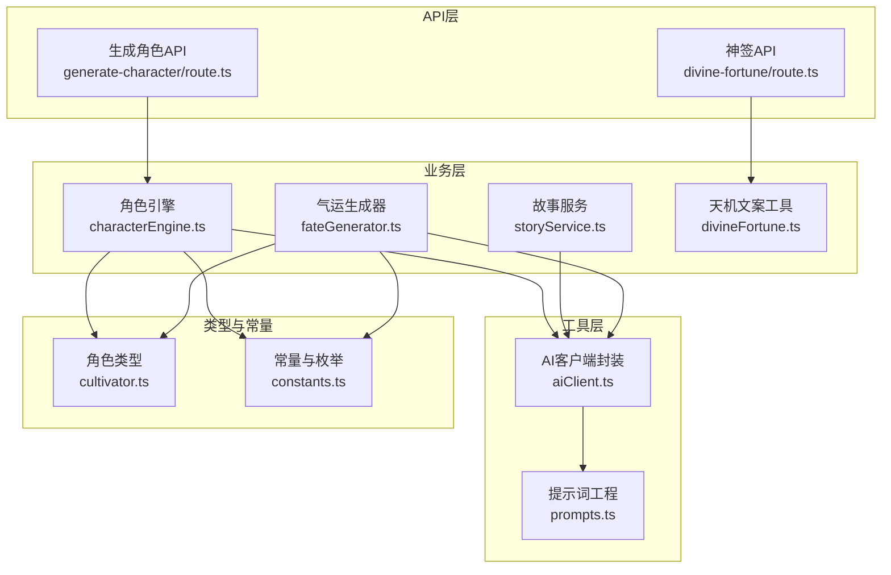
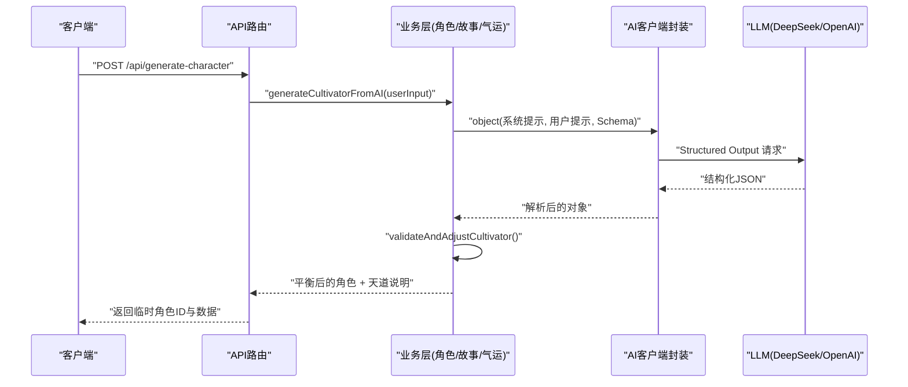
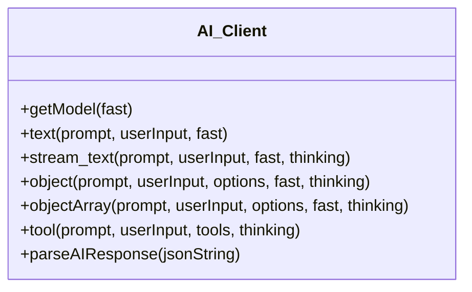
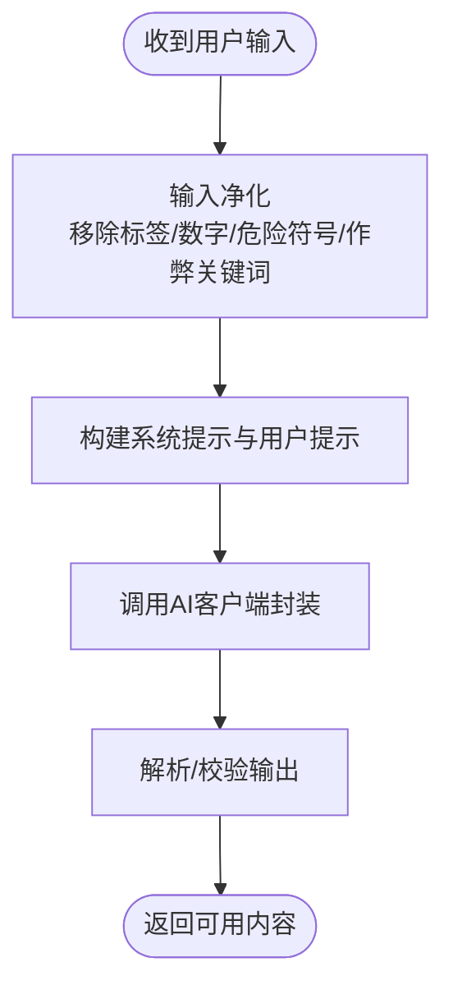
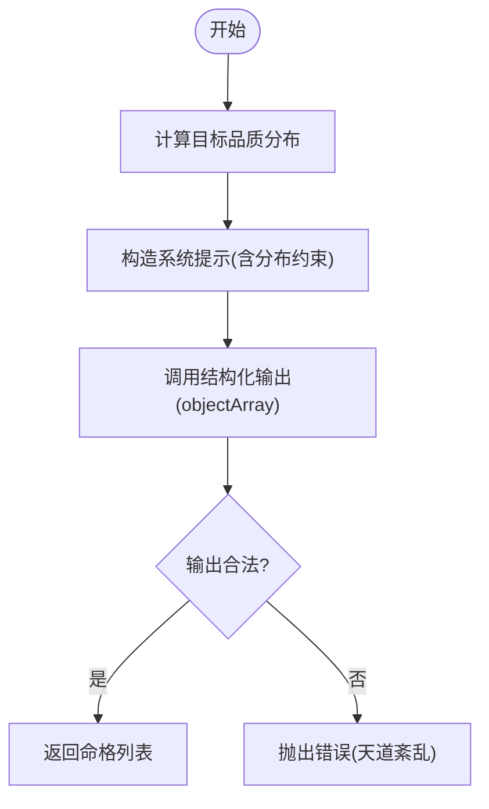
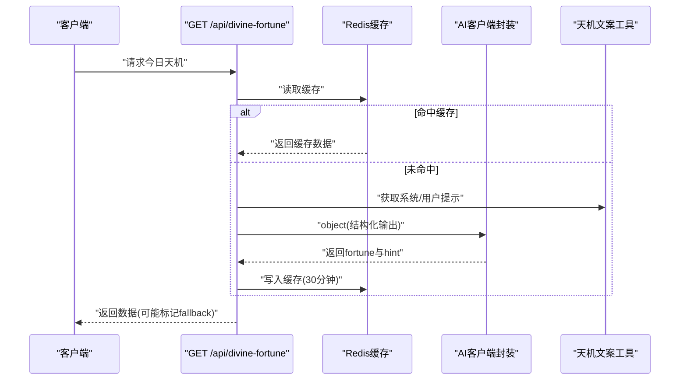
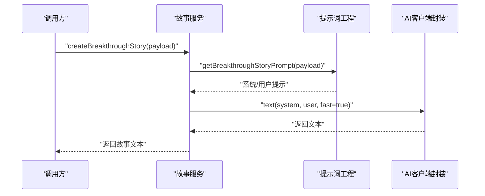
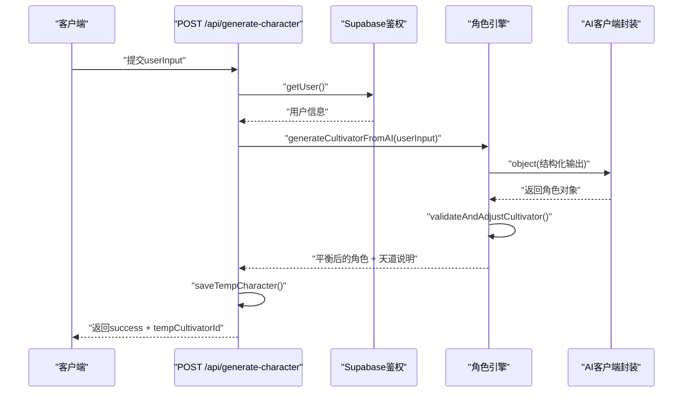
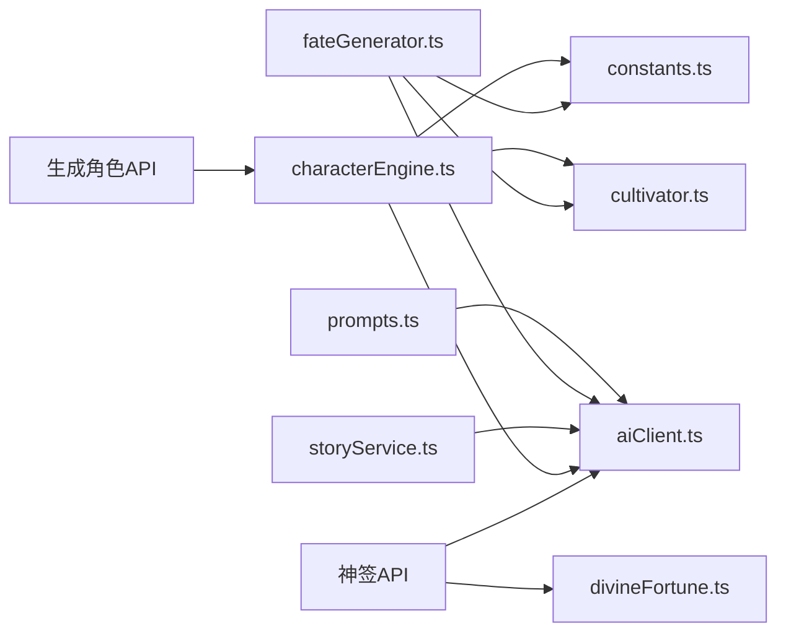

# AI集成与AIGC设计

<cite>
**本文引用的文件**
- [aiClient.ts](file://utils/aiClient.ts)
- [prompts.ts](file://utils/prompts.ts)
- [fateGenerator.ts](file://utils/fateGenerator.ts)
- [storyService.ts](file://utils/storyService.ts)
- [divineFortune.ts](file://utils/divineFortune.ts)
- [route.ts（生成角色API）](file://app/api/generate-character/route.ts)
- [route.ts（神签API）](file://app/api/divine-fortune/route.ts)
- [characterEngine.ts](file://utils/characterEngine.ts)
- [cultivator.ts](file://types/cultivator.ts)
- [constants.ts](file://types/constants.ts)
- [ENV_SETUP.md](file://ENV_SETUP.md)
</cite>

## 目录
1. [简介](#简介)
2. [项目结构](#项目结构)
3. [核心组件](#核心组件)
4. [架构总览](#架构总览)
5. [组件详解](#组件详解)
6. [依赖关系分析](#依赖关系分析)
7. [性能与成本优化](#性能与成本优化)
8. [故障排查指南](#故障排查指南)
9. [结论](#结论)
10. [附录](#附录)

## 简介
本专项文档聚焦项目中的AIGC（人工智能生成内容）能力，系统梳理AI客户端封装、提示词工程、动态内容生成（命格/神签/剧情）、以及API层如何将AI输出无缝整合到游戏流程。同时总结质量控制、成本优化与错误处理策略，并给出扩展AI功能的实践指导，帮助开发者在保持游戏平衡与体验的前提下高效迭代AI能力。

## 项目结构
围绕AI集成的关键文件组织如下：
- 工具层
  - utils/aiClient.ts：统一的AI客户端封装，支持文本生成、结构化输出、流式输出与工具调用，并内置JSON解析兜底。
  - utils/prompts.ts：提示词工程，包含角色生成、战斗播报、突破/坐化故事等模板与输入净化。
  - utils/fateGenerator.ts：基于结构化输出的先天气运生成器，保证品质分布与属性加成约束。
  - utils/storyService.ts：面向突破与坐化场景的故事生成服务，调用AI文本生成。
  - utils/divineFortune.ts：天机推演文案生成与备用池。
- 业务层
  - utils/characterEngine.ts：角色生成主引擎，结合结构化输出与平衡校验逻辑。
  - types/cultivator.ts、types/constants.ts：数据模型与常量定义，支撑AI生成的数据合法性。
- API层
  - app/api/generate-character/route.ts：角色生成API，整合AI生成与平衡校验，返回临时角色ID。
  - app/api/divine-fortune/route.ts：神签API，缓存与降级策略保障可用性。

图表来源
- [route.ts（生成角色API）](file://app/api/generate-character/route.ts#L1-L80)
- [route.ts（神签API）](file://app/api/divine-fortune/route.ts#L1-L81)
- [characterEngine.ts](file://utils/characterEngine.ts#L1-L180)
- [storyService.ts](file://utils/storyService.ts#L1-L22)
- [fateGenerator.ts](file://utils/fateGenerator.ts#L1-L166)
- [divineFortune.ts](file://utils/divineFortune.ts#L1-L132)
- [aiClient.ts](file://utils/aiClient.ts#L1-L211)
- [prompts.ts](file://utils/prompts.ts#L1-L356)
- [cultivator.ts](file://types/cultivator.ts#L1-L253)
- [constants.ts](file://types/constants.ts#L1-L191)

章节来源
- [aiClient.ts](file://utils/aiClient.ts#L1-L211)
- [prompts.ts](file://utils/prompts.ts#L1-L356)
- [fateGenerator.ts](file://utils/fateGenerator.ts#L1-L166)
- [storyService.ts](file://utils/storyService.ts#L1-L22)
- [divineFortune.ts](file://utils/divineFortune.ts#L1-L132)
- [route.ts（生成角色API）](file://app/api/generate-character/route.ts#L1-L80)
- [route.ts（神签API）](file://app/api/divine-fortune/route.ts#L1-L81)
- [characterEngine.ts](file://utils/characterEngine.ts#L1-L180)
- [cultivator.ts](file://types/cultivator.ts#L1-L253)
- [constants.ts](file://types/constants.ts#L1-L191)

## 核心组件
- AI客户端封装（aiClient.ts）
  - 提供统一接口：文本生成、结构化输出、数组结构化输出、流式文本、工具调用。
  - 支持多Provider切换（DeepSeek/OpenAI兼容），按fast/fast模型策略选择不同模型。
  - 内置JSON解析兜底，增强鲁棒性。
- 提示词工程（prompts.ts）
  - 角色生成：严格的数值范围、灵根/神通/功法品阶分布、天道平衡约束与输出格式要求。
  - 战斗播报：回合制描述、HTML标记规范、关键信息高亮。
  - 突破/坐化故事：情境化短文，强调意境与伏笔。
  - 输入净化：移除标签、数字、危险符号与作弊关键词，降低越狱风险。
- 动态内容生成
  - 命格/气运（fateGenerator.ts）：结构化输出+品质分布控制，保证属性加成范围与数量。
  - 神签（divineFortune.ts）：结构化输出+备用池+Redis缓存。
  - 剧情（storyService.ts）：基于模板的文本生成，快速适配不同场景。
- API整合
  - 生成角色API：调用角色引擎，执行平衡校验，返回临时角色ID。
  - 神签API：优先缓存，失败降级备用文案，保障可用性。

章节来源
- [aiClient.ts](file://utils/aiClient.ts#L1-L211)
- [prompts.ts](file://utils/prompts.ts#L1-L356)
- [fateGenerator.ts](file://utils/fateGenerator.ts#L1-L166)
- [storyService.ts](file://utils/storyService.ts#L1-L22)
- [divineFortune.ts](file://utils/divineFortune.ts#L1-L132)
- [route.ts（生成角色API）](file://app/api/generate-character/route.ts#L1-L80)
- [route.ts（神签API）](file://app/api/divine-fortune/route.ts#L1-L81)

## 架构总览
AI在项目中的位置与交互如下：
- API层接收请求，调用业务层生成器或服务。
- 业务层通过AI客户端封装调用LLM，使用结构化输出Schema确保数据一致性。
- 提示词工程提供高质量系统提示与用户提示，配合输入净化与平衡校验，保障输出质量与游戏平衡。
- 缓存与降级策略贯穿关键路径，提升稳定性与用户体验。

图表来源
- [route.ts（生成角色API）](file://app/api/generate-character/route.ts#L1-L80)
- [characterEngine.ts](file://utils/characterEngine.ts#L134-L181)
- [aiClient.ts](file://utils/aiClient.ts#L95-L124)

## 组件详解

### AI客户端封装（aiClient.ts）
- 多Provider与模型选择
  - 通过环境变量选择Ark/DeepSeek或OpenAI，支持fast与标准模型切换。
- 通用接口
  - 文本生成：适合故事/播报等自由文本。
  - 结构化输出：object/objectArray，配合Zod Schema，确保输出结构与字段完整性。
  - 流式文本：支持thinking开关，便于实时渲染。
  - 工具调用：支持工具集，满足复杂推理需求。
- JSON解析兜底
  - parseAIResponse：当AI返回非严格JSON时，尝试提取最内层JSON并二次解析，失败抛出明确错误。

图表来源
- [aiClient.ts](file://utils/aiClient.ts#L1-L211)

章节来源
- [aiClient.ts](file://utils/aiClient.ts#L1-L211)

### 提示词工程（prompts.ts）
- 角色生成模板
  - 严控数值范围、灵根/神通/功法品阶分布、天道平衡与输出格式。
  - 输出为严格JSON，避免下游解析失败。
- 战斗播报模板
  - 回合制描述、HTML标记规范、关键信息高亮，便于前端渲染。
- 突破/坐化故事模板
  - 短小精悍，强调意境与伏笔，契合游戏叙事节奏。
- 输入净化
  - 移除标签、数字、危险符号与作弊关键词，降低越狱风险，保护系统安全。

图表来源
- [prompts.ts](file://utils/prompts.ts#L262-L356)
- [aiClient.ts](file://utils/aiClient.ts#L95-L124)

章节来源
- [prompts.ts](file://utils/prompts.ts#L1-L356)

### 命格/气运生成（fateGenerator.ts）
- 结构化输出Schema
  - 限定名称长度、类型、品质、属性加成数量与范围。
- 品质分布控制
  - 代码侧先计算目标分布，再通过提示词约束AI严格遵循，避免采样偏差。
- 属性加成范围
  - 按品质限定加成总量范围，保证数值合理性与平衡性。
- 错误处理
  - 失败时抛出明确错误，上游可捕获并提示重试。

图表来源
- [fateGenerator.ts](file://utils/fateGenerator.ts#L91-L166)
- [aiClient.ts](file://utils/aiClient.ts#L129-L159)

章节来源
- [fateGenerator.ts](file://utils/fateGenerator.ts#L1-L166)
- [constants.ts](file://types/constants.ts#L115-L127)

### 神签生成（divineFortune.ts + route.ts（神签API））
- 结构化输出
  - 严格Schema：fortune与hint字段，确保前后端一致消费。
- 备用池
  - 预定义的天机格言池，作为AI失败时的降级方案。
- 缓存策略
  - Redis缓存30分钟，减少重复生成与成本。
- API整合
  - 成功返回数据；失败返回备用数据并标记fallback。

图表来源
- [route.ts（神签API）](file://app/api/divine-fortune/route.ts#L1-L81)
- [divineFortune.ts](file://utils/divineFortune.ts#L1-L132)
- [aiClient.ts](file://utils/aiClient.ts#L95-L124)

章节来源
- [route.ts（神签API）](file://app/api/divine-fortune/route.ts#L1-L81)
- [divineFortune.ts](file://utils/divineFortune.ts#L1-L132)

### 剧情生成（storyService.ts + prompts.ts）
- 突破故事
  - 基于角色背景与突破摘要，生成短篇故事，强调天地异象与心境变化。
- 坐化故事
  - 面向寿元耗尽的失败场景，营造惋惜与希望交织的氛围。
- 文本生成
  - 使用aiClient.text接口，开启fast模型以降低成本。

图表来源
- [storyService.ts](file://utils/storyService.ts#L1-L22)
- [prompts.ts](file://utils/prompts.ts#L147-L197)
- [aiClient.ts](file://utils/aiClient.ts#L42-L62)

章节来源
- [storyService.ts](file://utils/storyService.ts#L1-L22)
- [prompts.ts](file://utils/prompts.ts#L147-L197)

### 角色生成API整合（route.ts（生成角色API） + characterEngine.ts）
- 用户鉴权与输入校验
  - 使用Supabase验证用户身份，校验用户输入长度。
- AI生成与平衡校验
  - 调用角色引擎生成结构化角色，随后执行平衡校验（属性、灵根品阶、技能/功法品阶与威力范围、天道平衡）。
- 临时存储与返回
  - 保存到Redis临时存储，返回临时角色ID与平衡说明。

图表来源
- [route.ts（生成角色API）](file://app/api/generate-character/route.ts#L1-L80)
- [characterEngine.ts](file://utils/characterEngine.ts#L134-L181)
- [aiClient.ts](file://utils/aiClient.ts#L95-L124)

章节来源
- [route.ts（生成角色API）](file://app/api/generate-character/route.ts#L1-L80)
- [characterEngine.ts](file://utils/characterEngine.ts#L1-L181)

## 依赖关系分析
- 组件耦合
  - aiClient.ts是底层依赖，被prompts.ts、fateGenerator.ts、storyService.ts、characterEngine.ts广泛使用。
  - characterEngine.ts与fateGenerator.ts共同依赖types中的数据模型与常量。
  - API层仅依赖业务层与工具层，职责清晰。
- 外部依赖
  - ai包与@ai-sdk/*系列提供统一的Provider抽象与结构化输出能力。
  - zod用于Schema校验与类型推断。
- 循环依赖
  - 当前模块间无循环依赖迹象，结构清晰。

图表来源
- [prompts.ts](file://utils/prompts.ts#L1-L356)
- [fateGenerator.ts](file://utils/fateGenerator.ts#L1-L166)
- [storyService.ts](file://utils/storyService.ts#L1-L22)
- [characterEngine.ts](file://utils/characterEngine.ts#L1-L181)
- [aiClient.ts](file://utils/aiClient.ts#L1-L211)
- [cultivator.ts](file://types/cultivator.ts#L1-L253)
- [constants.ts](file://types/constants.ts#L1-L191)
- [route.ts（生成角色API）](file://app/api/generate-character/route.ts#L1-L80)
- [route.ts（神签API）](file://app/api/divine-fortune/route.ts#L1-L81)
- [divineFortune.ts](file://utils/divineFortune.ts#L1-L132)

章节来源
- [prompts.ts](file://utils/prompts.ts#L1-L356)
- [fateGenerator.ts](file://utils/fateGenerator.ts#L1-L166)
- [storyService.ts](file://utils/storyService.ts#L1-L22)
- [characterEngine.ts](file://utils/characterEngine.ts#L1-L181)
- [aiClient.ts](file://utils/aiClient.ts#L1-L211)
- [cultivator.ts](file://types/cultivator.ts#L1-L253)
- [constants.ts](file://types/constants.ts#L1-L191)
- [route.ts（生成角色API）](file://app/api/generate-character/route.ts#L1-L80)
- [route.ts（神签API）](file://app/api/divine-fortune/route.ts#L1-L81)
- [divineFortune.ts](file://utils/divineFortune.ts#L1-L132)

## 性能与成本优化
- 模型选择与调用策略
  - fast模型优先：在故事与神签等对质量要求相对较低的场景使用fast模型，显著降低成本。
  - 高质量模型：角色生成等关键路径使用高质量模型，确保输出质量。
- 结构化输出
  - 通过Schema减少LLM歧义，提高一次成功率，降低重试成本。
- 缓存与降级
  - 神签API使用Redis缓存30分钟，避免重复生成。
  - AI失败时使用备用池，保障可用性。
- 输入净化
  - 提前净化用户输入，减少越狱与无效输出，降低重试概率。
- 日志与用量追踪
  - aiClient.ts记录totalUsage，便于成本监控与优化。

章节来源
- [aiClient.ts](file://utils/aiClient.ts#L42-L62)
- [route.ts（神签API）](file://app/api/divine-fortune/route.ts#L1-L81)
- [prompts.ts](file://utils/prompts.ts#L262-L356)

## 故障排查指南
- 常见错误与定位
  - AI响应非严格JSON：使用parseAIResponse进行提取与二次解析；若仍失败，检查提示词与Schema是否一致。
  - 结构化输出失败：确认Schema字段与提示词约束一致，必要时增加maxRetries或放宽约束。
  - 缓存失效或降级：检查Redis连接与TTL设置；确认备用池可用。
  - 用户输入非法：API层会拒绝过短或过长输入；前端应提前校验。
- 错误处理策略
  - API层统一捕获错误，开发环境返回详细信息，生产环境返回通用提示。
  - 角色生成失败：返回错误并提示重试；上游可引导用户调整描述或重新生成。
  - 气运生成失败：抛出明确错误，提示“天道紊乱，请重试”。

章节来源
- [aiClient.ts](file://utils/aiClient.ts#L188-L211)
- [route.ts（生成角色API）](file://app/api/generate-character/route.ts#L60-L80)
- [route.ts（神签API）](file://app/api/divine-fortune/route.ts#L60-L81)
- [fateGenerator.ts](file://utils/fateGenerator.ts#L150-L166)

## 结论
本项目通过统一的AI客户端封装、严谨的提示词工程与结构化输出、完善的缓存与降级策略，实现了高质量、低成本、稳定的AIGC能力。角色生成、命格/气运、神签与剧情生成均在游戏流程中得到良好整合，既保证了内容多样性，又维持了游戏平衡与体验一致性。未来可在更多玩法中引入AIGC，同时持续优化提示词与Schema，加强成本监控与错误治理。

## 附录
- 环境变量配置
  - OPENAI_API_KEY：必填。
  - OPENAI_BASE_URL：可选，支持OpenRouter、DeepSeek等兼容服务。
  - OPENAI_MODEL/FAST_MODEL：可选，推荐gpt-4o-mini等性价比高的模型。
  - PROVIDER_CHOOSE/ARK_*：可选，切换Ark/DeepSeek Provider。
- 开发与部署建议
  - 在本地创建.env.local并按ENV_SETUP.md配置。
  - 生产环境在部署平台配置相同环境变量。
  - 关注totalUsage与成本阈值，适时调整fast模型使用比例。

章节来源
- [ENV_SETUP.md](file://ENV_SETUP.md#L1-L39)
- [aiClient.ts](file://utils/aiClient.ts#L1-L40)