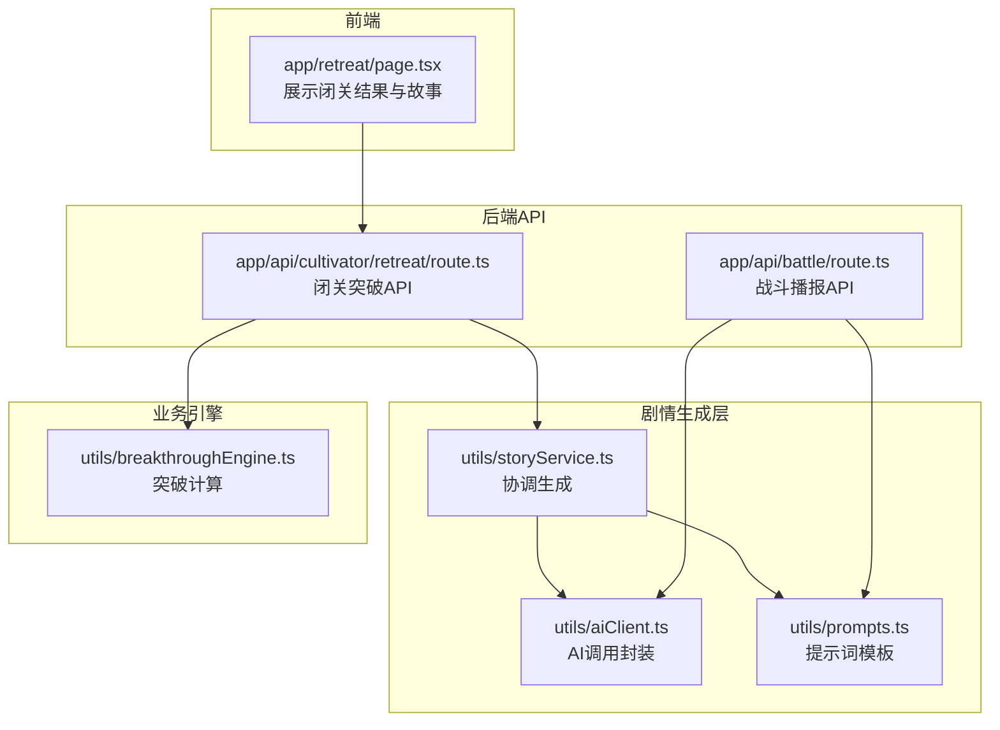
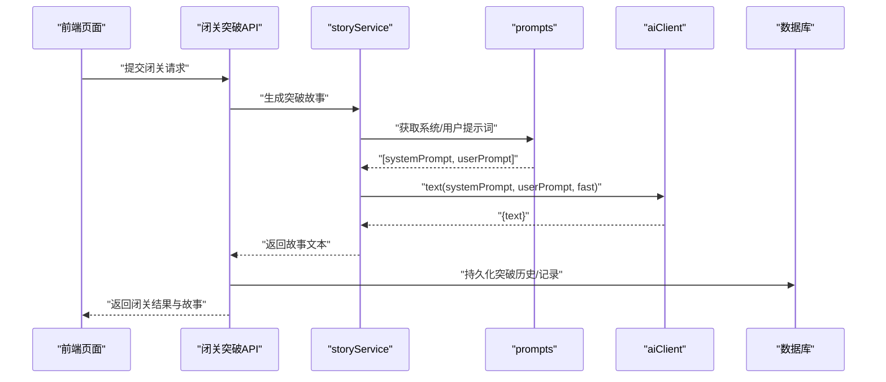
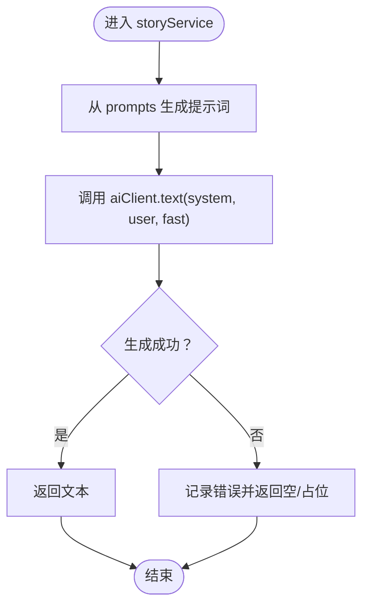
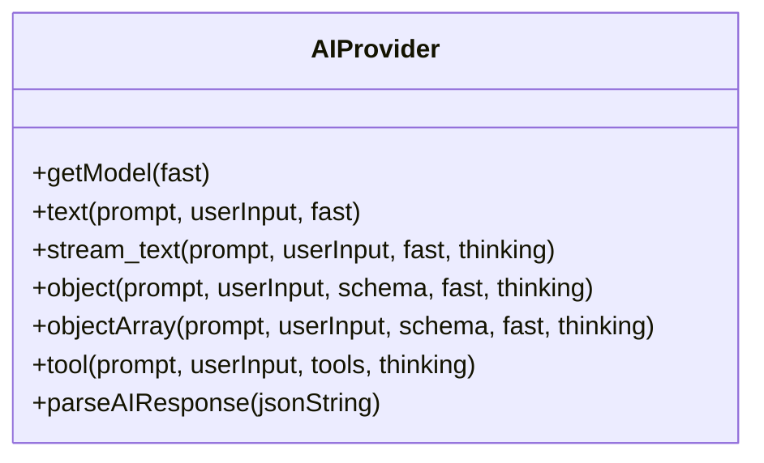
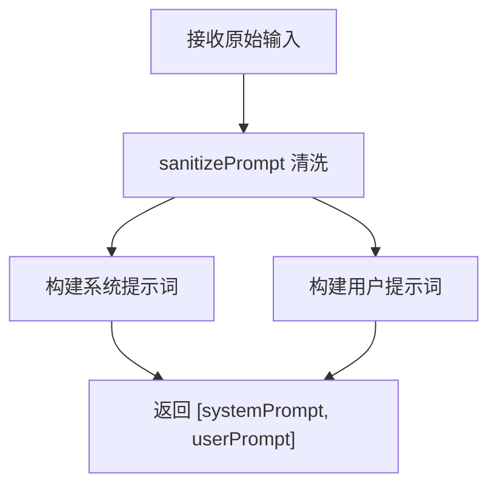
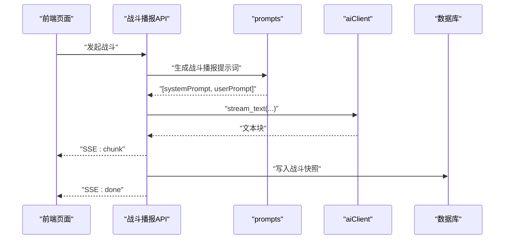
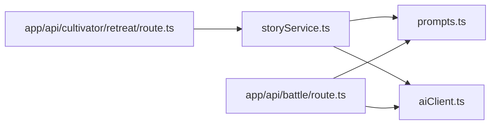

# 剧情内容生成

<cite>
**本文引用的文件**
- [utils/storyService.ts](file://utils/storyService.ts)
- [utils/aiClient.ts](file://utils/aiClient.ts)
- [utils/prompts.ts](file://utils/prompts.ts)
- [app/api/cultivator/retreat/route.ts](file://app/api/cultivator/retreat/route.ts)
- [app/api/battle/route.ts](file://app/api/battle/route.ts)
- [app/retreat/page.tsx](file://app/retreat/page.tsx)
- [utils/breakthroughEngine.ts](file://utils/breakthroughEngine.ts)
</cite>

## 目录
1. [简介](#简介)
2. [项目结构](#项目结构)
3. [核心组件](#核心组件)
4. [架构总览](#架构总览)
5. [详细组件分析](#详细组件分析)
6. [依赖关系分析](#依赖关系分析)
7. [性能考量](#性能考量)
8. [故障排查指南](#故障排查指南)
9. [结论](#结论)
10. [附录](#附录)

## 简介
本文件围绕 storyService.ts 如何作为动态剧情生成的核心协调器进行深入剖析，系统说明其如何整合 AI 客户端（aiClient.ts）、提示词模板（prompts.ts）与上下文数据（角色状态、当前事件），从而生成连贯且情境相关的叙事内容。文档还涵盖服务内部的异步处理流程、超时控制与缓存策略，给出实际调用示例（闭关顿悟、战斗描述、奇遇展开），并讨论内容安全过滤机制与生成质量评估方法，确保输出符合游戏风格且无违规内容。

## 项目结构
- 剧情生成链路主要位于 utils 目录下的 storyService.ts、aiClient.ts、prompts.ts，配合业务 API 路由与前端页面实现闭环。
- 关键集成点：
  - 闭关突破：app/api/cultivator/retreat/route.ts 调用 storyService.ts 生成突破或坐化故事，并持久化到角色历史。
  - 战斗播报：app/api/battle/route.ts 使用 prompts.ts 生成战斗报告并通过 SSE 流式输出。
  - 前端页面：app/retreat/page.tsx 展示闭关结果与故事，驱动用户交互。

图表来源
- [app/retreat/page.tsx](file://app/retreat/page.tsx#L1-L218)
- [app/api/cultivator/retreat/route.ts](file://app/api/cultivator/retreat/route.ts#L1-L179)
- [app/api/battle/route.ts](file://app/api/battle/route.ts#L1-L172)
- [utils/storyService.ts](file://utils/storyService.ts#L1-L22)
- [utils/aiClient.ts](file://utils/aiClient.ts#L1-L211)
- [utils/prompts.ts](file://utils/prompts.ts#L1-L356)
- [utils/breakthroughEngine.ts](file://utils/breakthroughEngine.ts#L1-L342)

章节来源
- [utils/storyService.ts](file://utils/storyService.ts#L1-L22)
- [utils/aiClient.ts](file://utils/aiClient.ts#L1-L211)
- [utils/prompts.ts](file://utils/prompts.ts#L1-L356)
- [app/api/cultivator/retreat/route.ts](file://app/api/cultivator/retreat/route.ts#L1-L179)
- [app/api/battle/route.ts](file://app/api/battle/route.ts#L1-L172)
- [app/retreat/page.tsx](file://app/retreat/page.tsx#L1-L218)
- [utils/breakthroughEngine.ts](file://utils/breakthroughEngine.ts#L1-L342)

## 核心组件
- storyService.ts
  - 提供两个故事生成函数：创建突破故事与坐化故事。
  - 通过 prompts.ts 生成系统提示词与用户提示词，再交由 aiClient.text 进行文本生成。
- aiClient.ts
  - 封装模型选择、生成策略（直出文本、流式文本、结构化对象）、重试与统计。
  - 支持不同提供商与模型配置，统一对外接口。
- prompts.ts
  - 提供多种提示词模板，包括闭关突破、坐化、战斗播报等。
  - 包含高安全级别净化函数，用于过滤潜在风险内容。
- API 路由
  - 闭关突破 API：在生成故事后持久化到角色历史。
  - 战斗播报 API：流式生成战斗报告并写入数据库。
- 前端页面
  - 展示闭关结果与生成的故事，支持转世重修入口。

章节来源
- [utils/storyService.ts](file://utils/storyService.ts#L1-L22)
- [utils/aiClient.ts](file://utils/aiClient.ts#L1-L211)
- [utils/prompts.ts](file://utils/prompts.ts#L1-L356)
- [app/api/cultivator/retreat/route.ts](file://app/api/cultivator/retreat/route.ts#L1-L179)
- [app/api/battle/route.ts](file://app/api/battle/route.ts#L1-L172)
- [app/retreat/page.tsx](file://app/retreat/page.tsx#L1-L218)

## 架构总览
storyService 作为“协调器”，职责如下：
- 从上下文数据（角色、突破摘要）构造提示词。
- 调用 aiClient 文本生成接口，获得自然语言文本。
- 将生成结果写入业务数据结构（如角色突破历史）。

图表来源
- [app/api/cultivator/retreat/route.ts](file://app/api/cultivator/retreat/route.ts#L82-L115)
- [utils/storyService.ts](file://utils/storyService.ts#L9-L21)
- [utils/prompts.ts](file://utils/prompts.ts#L147-L241)
- [utils/aiClient.ts](file://utils/aiClient.ts#L42-L62)

## 详细组件分析

### 组件A：storyService.ts
- 设计要点
  - 低耦合：仅依赖 prompts.ts 与 aiClient.ts，职责清晰。
  - 可扩展：新增故事类型只需在 prompts.ts 新增模板并在 storyService.ts 暴露对应函数。
- 数据流
  - 输入：角色上下文与事件摘要（如突破尝试总结）。
  - 输出：自然语言故事文本。
- 性能与可靠性
  - 使用 fast 模式参数调用文本生成，兼顾速度与成本。
  - 异常捕获与降级：API 层对故事生成失败进行日志记录并继续返回其他数据。
- 实际调用示例
  - 闭关顿悟：调用 createBreakthroughStory，传入角色与突破摘要，返回故事文本。
  - 坐化场景：调用 createLifespanExhaustedStory，传入角色与失败摘要，返回故事文本。

图表来源
- [utils/storyService.ts](file://utils/storyService.ts#L9-L21)
- [utils/aiClient.ts](file://utils/aiClient.ts#L42-L62)
- [utils/prompts.ts](file://utils/prompts.ts#L147-L241)

章节来源
- [utils/storyService.ts](file://utils/storyService.ts#L1-L22)
- [app/api/cultivator/retreat/route.ts](file://app/api/cultivator/retreat/route.ts#L86-L115)

### 组件B：aiClient.ts
- 模型选择与配置
  - 根据环境变量选择提供商与模型，支持快速模型与思考模式开关。
- 生成接口
  - text：直出文本，返回文本与用量统计。
  - stream_text：流式文本，适合实时播报。
  - object/objectArray：结构化输出，带重试与模式约束。
  - tool：工具调用，结合外部能力。
- 安全与容错
  - 统一 providerOptions 控制“思考”行为，避免冗余输出。
  - object 接口默认重试次数，提高稳定性。
- 解析辅助
  - parseAIResponse：增强 JSON 解析鲁棒性，处理 AI 返回中的额外文本。

图表来源
- [utils/aiClient.ts](file://utils/aiClient.ts#L1-L211)

章节来源
- [utils/aiClient.ts](file://utils/aiClient.ts#L1-L211)

### 组件C：prompts.ts
- 模板体系
  - 闭关突破故事：结合角色背景、突破类型、属性变化与寿元增益。
  - 坐化故事：结合失败原因、执念与转世重修伏笔。
  - 战斗播报：基于战斗引擎结果，按回合生成画面感强的描述。
- 安全净化
  - sanitizePrompt：移除标签、数字、危险符号、空白字符，过滤作弊关键词，保证输入安全。
- 上下文拼装
  - 自动汇总角色灵根、功法、先天气运、属性等，减少调用方负担。

图表来源
- [utils/prompts.ts](file://utils/prompts.ts#L262-L356)

章节来源
- [utils/prompts.ts](file://utils/prompts.ts#L147-L241)
- [utils/prompts.ts](file://utils/prompts.ts#L262-L356)

### 组件D：API 路由与前端集成
- 闭关突破 API
  - 在生成故事后，将故事文本写入角色突破历史条目，便于后续展示与复盘。
- 战斗播报 API
  - 使用 prompts 生成战斗报告，通过 SSE 流式输出，前端逐块渲染。
- 前端页面
  - 展示闭关结果与故事，支持转世重修入口，故事文本可保存到会话存储以便转世页使用。

图表来源
- [app/api/battle/route.ts](file://app/api/battle/route.ts#L90-L124)
- [utils/prompts.ts](file://utils/prompts.ts#L63-L145)
- [utils/aiClient.ts](file://utils/aiClient.ts#L67-L90)

章节来源
- [app/api/cultivator/retreat/route.ts](file://app/api/cultivator/retreat/route.ts#L82-L115)
- [app/api/battle/route.ts](file://app/api/battle/route.ts#L1-L172)
- [app/retreat/page.tsx](file://app/retreat/page.tsx#L1-L218)

## 依赖关系分析
- 组件内聚与耦合
  - storyService 仅依赖 prompts 与 aiClient，内聚度高、耦合度低。
  - prompts 与 aiClient 作为基础设施，被多个业务模块复用。
- 外部依赖
  - 提供商 SDK（DeepSeek）、AI SDK（generateText/streamText/generateObject）。
  - 数据库与 Supabase 认证。
- 循环依赖
  - 未发现循环依赖迹象，模块边界清晰。

图表来源
- [utils/storyService.ts](file://utils/storyService.ts#L1-L22)
- [utils/aiClient.ts](file://utils/aiClient.ts#L1-L211)
- [utils/prompts.ts](file://utils/prompts.ts#L1-L356)
- [app/api/cultivator/retreat/route.ts](file://app/api/cultivator/retreat/route.ts#L1-L179)
- [app/api/battle/route.ts](file://app/api/battle/route.ts#L1-L172)

章节来源
- [utils/storyService.ts](file://utils/storyService.ts#L1-L22)
- [utils/aiClient.ts](file://utils/aiClient.ts#L1-L211)
- [utils/prompts.ts](file://utils/prompts.ts#L1-L356)
- [app/api/cultivator/retreat/route.ts](file://app/api/cultivator/retreat/route.ts#L1-L179)
- [app/api/battle/route.ts](file://app/api/battle/route.ts#L1-L172)

## 性能考量
- 模型与流式输出
  - aiClient 提供 stream_text，适合长文本生成的实时渲染，降低首屏延迟。
  - text/fast 参数用于快速模型，平衡成本与速度。
- 重试与稳定性
  - 结构化生成接口默认重试，提升稳定性。
- 缓存策略
  - 代码中未见显式缓存实现。建议：
    - 对高频提示词与固定模板进行内存缓存（注意上下文敏感性）。
    - 对相同输入的生成结果进行短期缓存（如 Redis），避免重复调用。
- 超时控制
  - 未见显式超时设置。建议：
    - 在调用层设置超时，防止长时间阻塞。
    - 对流式输出设置心跳与断开检测，保障用户体验。

[本节为通用性能建议，不直接分析具体文件]

## 故障排查指南
- 常见问题
  - 生成失败：检查 aiClient 的 provider 配置与模型可用性。
  - 提示词异常：确认 prompts 中的上下文拼装是否正确。
  - API 返回错误：查看路由层错误处理与日志。
- 安全与合规
  - 使用 sanitizePrompt 对输入进行清洗，避免注入与越权指令。
  - 对生成内容进行二次校验（长度、风格、关键词），必要时引入内容审核。
- 日志与监控
  - 记录 totalUsage 与错误堆栈，定位性能与稳定性问题。
  - 对故事生成失败进行告警，避免静默失败。

章节来源
- [utils/aiClient.ts](file://utils/aiClient.ts#L42-L62)
- [utils/prompts.ts](file://utils/prompts.ts#L262-L356)
- [app/api/cultivator/retreat/route.ts](file://app/api/cultivator/retreat/route.ts#L165-L178)
- [app/api/battle/route.ts](file://app/api/battle/route.ts#L130-L144)

## 结论
storyService 以“提示词模板 + AI 客户端”为核心，通过明确的职责划分与简洁的接口设计，实现了高质量、情境化的剧情生成。配合 API 路由与前端页面，形成从数据到故事再到展示的完整闭环。建议在现有基础上补充缓存与超时控制，并强化内容安全与质量评估，以进一步提升稳定性与用户体验。

[本节为总结性内容，不直接分析具体文件]

## 附录

### 实际调用示例（路径指引）
- 闭关顿悟
  - 调用位置：[app/api/cultivator/retreat/route.ts](file://app/api/cultivator/retreat/route.ts#L86-L115)
  - 生成函数：[utils/storyService.ts](file://utils/storyService.ts#L9-L14)
  - 上下文来源：[utils/breakthroughEngine.ts](file://utils/breakthroughEngine.ts#L66-L117)
- 坐化场景
  - 调用位置：[app/api/cultivator/retreat/route.ts](file://app/api/cultivator/retreat/route.ts#L105-L115)
  - 生成函数：[utils/storyService.ts](file://utils/storyService.ts#L16-L21)
- 战斗描述
  - 调用位置：[app/api/battle/route.ts](file://app/api/battle/route.ts#L90-L124)
  - 提示词模板：[utils/prompts.ts](file://utils/prompts.ts#L63-L145)
  - 流式输出：[utils/aiClient.ts](file://utils/aiClient.ts#L67-L90)

### 内容安全与质量评估
- 安全过滤
  - 使用 [utils/prompts.ts](file://utils/prompts.ts#L262-L356) 的 sanitizePrompt 对输入进行清洗。
- 质量评估
  - 长度与风格：限制字数、检查是否符合修仙风格。
  - 关键词与合规：过滤作弊关键词与不当内容。
  - 用户反馈：收集用户对故事的评分与反馈，持续优化提示词与生成策略。

章节来源
- [utils/prompts.ts](file://utils/prompts.ts#L262-L356)
- [app/api/cultivator/retreat/route.ts](file://app/api/cultivator/retreat/route.ts#L155-L164)
- [app/api/battle/route.ts](file://app/api/battle/route.ts#L104-L124)