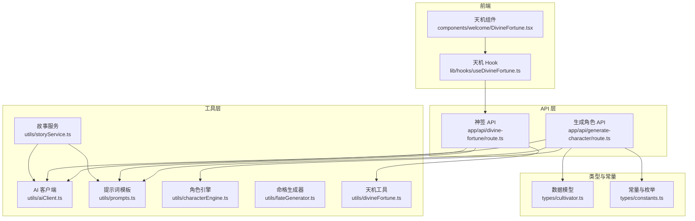
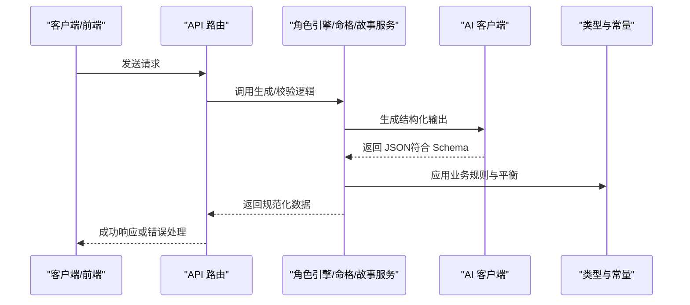
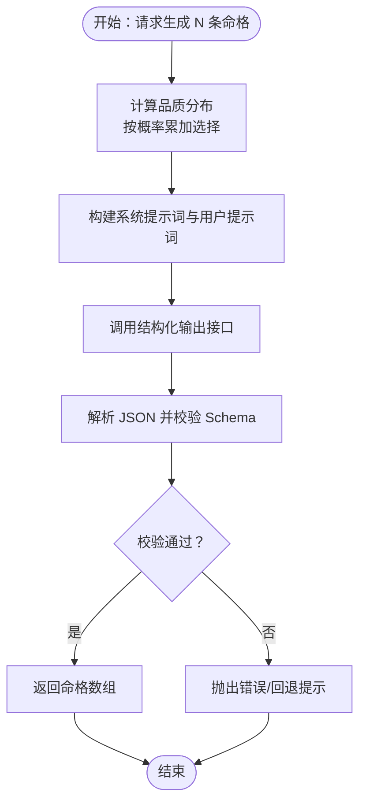
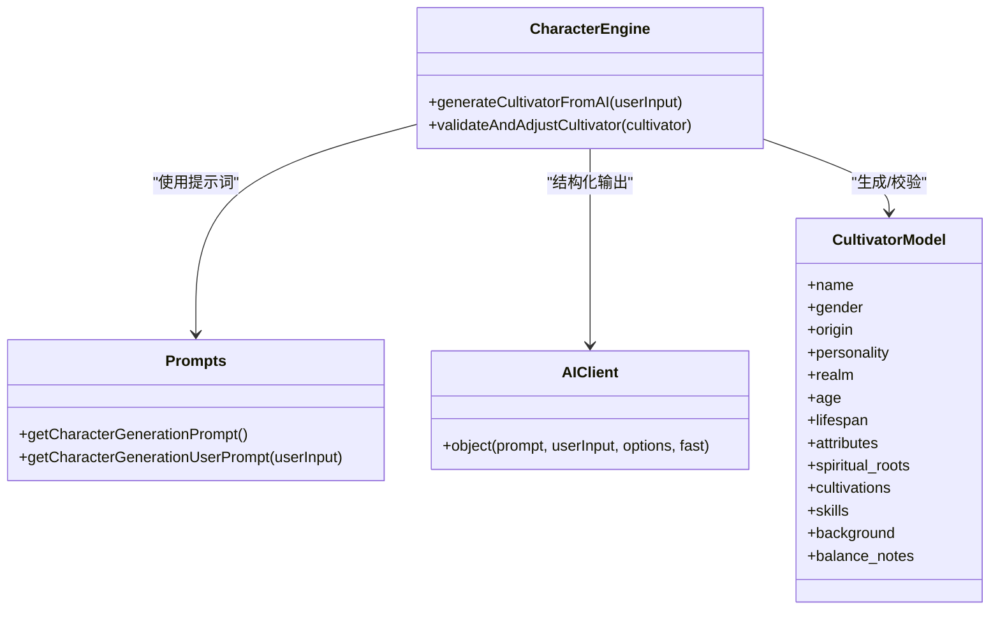
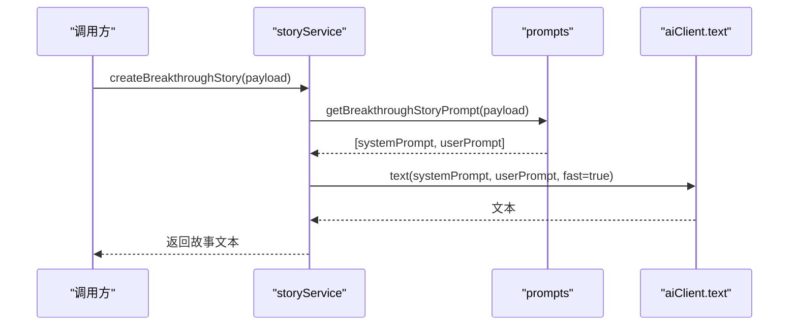
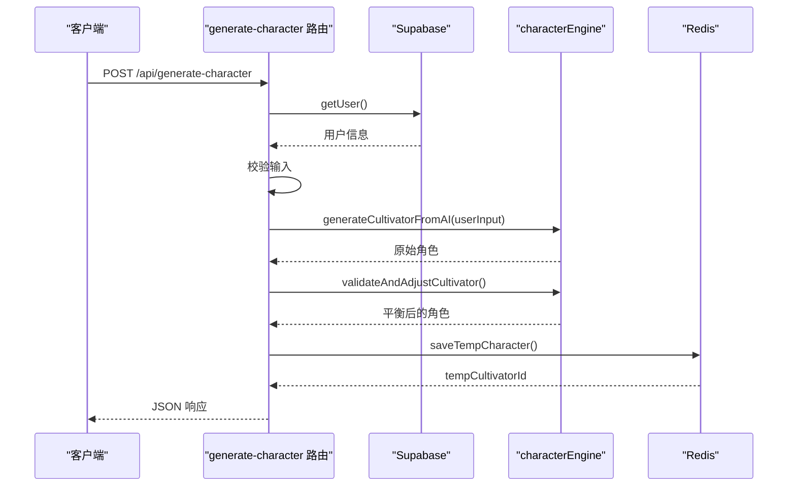
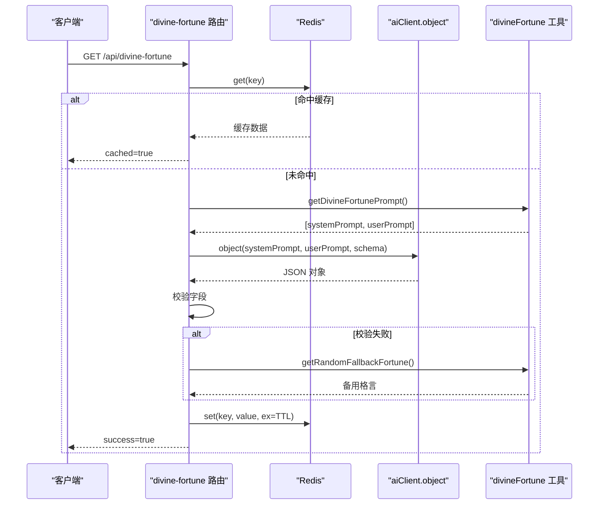
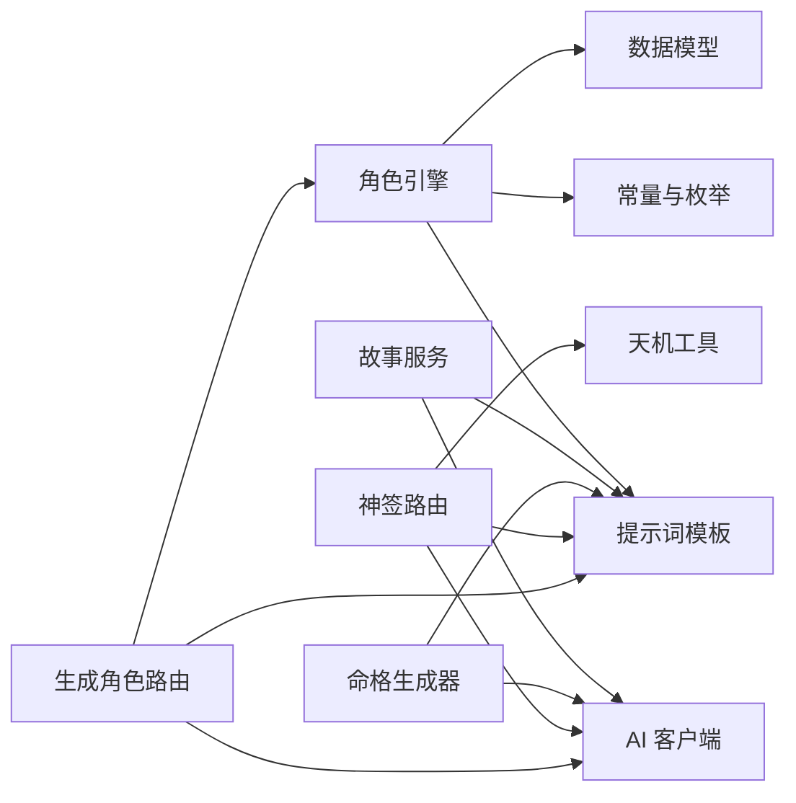

# 动态内容生成

<cite>
**本文引用的文件**
- [fateGenerator.ts](file://utils/fateGenerator.ts)
- [storyService.ts](file://utils/storyService.ts)
- [route.ts（生成角色）](file://app/api/generate-character/route.ts)
- [route.ts（神签）](file://app/api/divine-fortune/route.ts)
- [prompts.ts](file://utils/prompts.ts)
- [aiClient.ts](file://utils/aiClient.ts)
- [characterEngine.ts](file://utils/characterEngine.ts)
- [divineFortune.ts](file://utils/divineFortune.ts)
- [cultivator.ts](file://types/cultivator.ts)
- [constants.ts](file://types/constants.ts)
- [DivineFortune.tsx](file://components/welcome/DivineFortune.tsx)
- [useDivineFortune.ts](file://lib/hooks/useDivineFortune.ts)
- [fateGenerator.test.ts](file://utils/fateGenerator.test.ts)
</cite>

## 目录
1. [简介](#简介)
2. [项目结构](#项目结构)
3. [核心组件](#核心组件)
4. [架构总览](#架构总览)
5. [详细组件分析](#详细组件分析)
6. [依赖关系分析](#依赖关系分析)
7. [性能考量](#性能考量)
8. [故障排查指南](#故障排查指南)
9. [结论](#结论)

## 简介
本文件系统性阐述本项目的动态内容生成机制，围绕以下目标展开：
- 解释 fateGenerator.ts 如何利用结构化输出与提示工程，结合角色属性生成个性化命格与奇遇。
- 分析 storyService.ts 如何协调 AI 客户端与提示词模板，生成连贯剧情。
- 解析 generate-character API 端点如何整合用户输入、调用 AI 生成角色并进行数据验证。
- 讨论 divine-fortune 端点如何实现“神签抽取”，包括用户意图理解、提示词构造与结果解析。
- 总结质量控制策略：Zod 模式验证、结果后处理与异常处理。

## 项目结构
动态内容生成相关的关键路径与职责：
- 工具层
  - utils/aiClient.ts：统一的 AI 客户端封装，提供文本与结构化输出能力，并支持模型切换与重试。
  - utils/prompts.ts：集中管理各类提示词模板，包括角色生成、战斗播报、突破/坐化故事等。
  - utils/characterEngine.ts：角色生成与平衡校验引擎，负责结构化输出、Schema 校验与数值平衡。
  - utils/fateGenerator.ts：先天气运生成器，基于概率分布与结构化输出生成命格。
  - utils/divineFortune.ts：天机格言生成与备用方案。
  - utils/storyService.ts：故事生成服务，封装两类剧情生成函数。
- API 层
  - app/api/generate-character/route.ts：生成角色 API，整合鉴权、输入校验、AI 生成与二次验证。
  - app/api/divine-fortune/route.ts：神签抽取 API，缓存、结构化输出与降级策略。
- 类型与常量
  - types/cultivator.ts：角色与命格等数据模型。
  - types/constants.ts：元素、技能类型、境界、品质等枚举与常量。
- 前端集成
  - components/welcome/DivineFortune.tsx：欢迎页展示组件。
  - lib/hooks/useDivineFortune.ts：前端 Hook，拉取并展示天机格言。

图表来源
- [route.ts（生成角色）](file://app/api/generate-character/route.ts#L1-L80)
- [route.ts（神签）](file://app/api/divine-fortune/route.ts#L1-L81)
- [aiClient.ts](file://utils/aiClient.ts#L1-L211)
- [prompts.ts](file://utils/prompts.ts#L1-L356)
- [characterEngine.ts](file://utils/characterEngine.ts#L1-L643)
- [fateGenerator.ts](file://utils/fateGenerator.ts#L1-L166)
- [divineFortune.ts](file://utils/divineFortune.ts#L1-L132)
- [storyService.ts](file://utils/storyService.ts#L1-L22)
- [cultivator.ts](file://types/cultivator.ts#L1-L253)
- [constants.ts](file://types/constants.ts#L1-L191)
- [DivineFortune.tsx](file://components/welcome/DivineFortune.tsx#L1-L77)
- [useDivineFortune.ts](file://lib/hooks/useDivineFortune.ts#L1-L45)

章节来源
- [route.ts（生成角色）](file://app/api/generate-character/route.ts#L1-L80)
- [route.ts（神签）](file://app/api/divine-fortune/route.ts#L1-L81)
- [aiClient.ts](file://utils/aiClient.ts#L1-L211)
- [prompts.ts](file://utils/prompts.ts#L1-L356)
- [characterEngine.ts](file://utils/characterEngine.ts#L1-L643)
- [fateGenerator.ts](file://utils/fateGenerator.ts#L1-L166)
- [divineFortune.ts](file://utils/divineFortune.ts#L1-L132)
- [storyService.ts](file://utils/storyService.ts#L1-L22)
- [cultivator.ts](file://types/cultivator.ts#L1-L253)
- [constants.ts](file://types/constants.ts#L1-L191)
- [DivineFortune.tsx](file://components/welcome/DivineFortune.tsx#L1-L77)
- [useDivineFortune.ts](file://lib/hooks/useDivineFortune.ts#L1-L45)

## 核心组件
- 命格生成器（fateGenerator.ts）
  - 基于预设品质概率分布与结构化输出，生成先天气运（名称、类型、品质、属性加成、描述）。
  - 通过 Zod Schema 保证字段完整性与范围约束。
- 角色生成引擎（characterEngine.ts）
  - 采用结构化输出生成角色，结合 Zod Schema 进行严格校验。
  - 提供二次平衡校验与调整，确保数值合理性与可玩性。
- 故事服务（storyService.ts）
  - 基于提示词模板生成突破/坐化等剧情文本，面向叙事体验优化。
- 生成角色 API（app/api/generate-character/route.ts）
  - 用户鉴权、输入校验、调用 AI 生成角色、二次验证与临时存储。
- 神签 API（app/api/divine-fortune/route.ts）
  - 结构化输出生成“今日天机”，带缓存与降级策略。
- 提示词模板（utils/prompts.ts）
  - 集中管理角色生成、战斗播报、突破/坐化故事等模板，明确输出格式与约束。
- AI 客户端（utils/aiClient.ts）
  - 统一封装文本与结构化输出，支持模型切换、重试与用量记录。
- 数据模型与常量（types/cultivator.ts、types/constants.ts）
  - 定义角色、命格、元素、技能类型、境界、品质等类型与边界。

章节来源
- [fateGenerator.ts](file://utils/fateGenerator.ts#L1-L166)
- [characterEngine.ts](file://utils/characterEngine.ts#L1-L643)
- [storyService.ts](file://utils/storyService.ts#L1-L22)
- [route.ts（生成角色）](file://app/api/generate-character/route.ts#L1-L80)
- [route.ts（神签）](file://app/api/divine-fortune/route.ts#L1-L81)
- [prompts.ts](file://utils/prompts.ts#L1-L356)
- [aiClient.ts](file://utils/aiClient.ts#L1-L211)
- [cultivator.ts](file://types/cultivator.ts#L1-L253)
- [constants.ts](file://types/constants.ts#L1-L191)

## 架构总览
动态内容生成遵循“提示词模板 + 结构化输出 + 类型校验 + 平衡调整”的闭环：
- 输入层：用户请求或系统触发（如欢迎页）。
- 模板层：根据场景选择合适的提示词模板。
- 生成层：通过 AI 客户端调用模型，使用结构化输出确保 JSON 符合 Schema。
- 校验层：Zod Schema 与业务规则共同保证数据一致性与合理性。
- 输出层：API 返回或前端渲染，必要时引入缓存与降级。

图表来源
- [route.ts（生成角色）](file://app/api/generate-character/route.ts#L1-L80)
- [characterEngine.ts](file://utils/characterEngine.ts#L1-L643)
- [fateGenerator.ts](file://utils/fateGenerator.ts#L1-L166)
- [storyService.ts](file://utils/storyService.ts#L1-L22)
- [aiClient.ts](file://utils/aiClient.ts#L1-L211)
- [prompts.ts](file://utils/prompts.ts#L1-L356)
- [cultivator.ts](file://types/cultivator.ts#L1-L253)
- [constants.ts](file://types/constants.ts#L1-L191)

## 详细组件分析

### 命格生成器（fateGenerator.ts）
- 生成策略
  - 基于品质概率分布生成目标分布，再将分布转化为提示词中的“必须严格按此分布生成”的约束。
  - 使用结构化输出（objectArray）确保返回数组符合 Zod Schema。
- Schema 设计
  - 字段覆盖名称、类型（吉/凶）、品质、属性加成（体魄/灵力/悟性/速度/神识）、描述长度与风格约束。
  - 属性加成数量与绝对值之和受品质范围限制，避免平均化。
- 错误处理
  - 生成失败时抛出错误，上游可捕获并提示“天道紊乱”。

图表来源
- [fateGenerator.ts](file://utils/fateGenerator.ts#L1-L166)

章节来源
- [fateGenerator.ts](file://utils/fateGenerator.ts#L1-L166)
- [fateGenerator.test.ts](file://utils/fateGenerator.test.ts#L1-L8)

### 角色生成与平衡（characterEngine.ts + prompts.ts）
- 角色生成
  - 通过结构化输出生成角色，系统提示词严格限定数值范围、灵根数量与品阶分布倾向。
  - 输出包含姓名、性别、出身、性格、境界、年龄、寿元、基础属性、灵根、功法、神通、背景故事、平衡说明等。
- 平衡校验与调整
  - 属性总和不超过上限的 80%；按比例缩放过高属性。
  - 灵根品阶与强度根据数量与元素类型确定并限制。
  - 技能威力与功法加幅按品阶范围校准；当存在“顶级天赋”时进行适度削弱与降阶。
- 与提示工程协作
  - prompts.ts 提供角色生成系统提示词与用户提示词，明确输出格式与字段要求。

图表来源
- [characterEngine.ts](file://utils/characterEngine.ts#L1-L643)
- [prompts.ts](file://utils/prompts.ts#L1-L120)
- [aiClient.ts](file://utils/aiClient.ts#L92-L159)
- [cultivator.ts](file://types/cultivator.ts#L217-L253)

章节来源
- [characterEngine.ts](file://utils/characterEngine.ts#L1-L643)
- [prompts.ts](file://utils/prompts.ts#L1-L120)
- [cultivator.ts](file://types/cultivator.ts#L217-L253)

### 故事生成服务（storyService.ts + prompts.ts）
- 两类故事生成
  - 突破成功：结合角色背景、境界、灵根、功法、气运与突破摘要，生成短篇故事。
  - 坐化/寿元耗尽：描述失败与转世重修的伏笔，语言带有惋惜与希望。
- 实现方式
  - 从 prompts.ts 获取系统提示词与用户提示词，调用文本生成接口返回自然语言。

图表来源
- [storyService.ts](file://utils/storyService.ts#L1-L22)
- [prompts.ts](file://utils/prompts.ts#L147-L241)
- [aiClient.ts](file://utils/aiClient.ts#L42-L62)

章节来源
- [storyService.ts](file://utils/storyService.ts#L1-L22)
- [prompts.ts](file://utils/prompts.ts#L147-L241)

### 生成角色 API（app/api/generate-character/route.ts）
- 流程概览
  - 鉴权：使用 Supabase 获取当前用户。
  - 输入校验：检查用户输入长度与格式。
  - 调用角色引擎：生成角色并进行二次平衡。
  - 临时存储：将生成的角色保存到 Redis。
  - 返回响应：包含角色、平衡说明与临时 ID。
- 错误处理
  - 未授权、输入非法、内部错误均返回标准化错误信息。

图表来源
- [route.ts（生成角色）](file://app/api/generate-character/route.ts#L1-L80)
- [characterEngine.ts](file://utils/characterEngine.ts#L134-L181)

章节来源
- [route.ts（生成角色）](file://app/api/generate-character/route.ts#L1-L80)
- [characterEngine.ts](file://utils/characterEngine.ts#L134-L181)

### 神签抽取（app/api/divine-fortune/route.ts + utils/divineFortune.ts）
- 端点逻辑
  - 优先从 Redis 读取缓存；若命中直接返回。
  - 未命中则调用结构化输出生成“今日天机”，包含格言与提示。
  - 解析 JSON 并做格式校验；失败则使用备用池随机返回。
  - 无论成功与否，均设置 TTL 缓存。
- 前端集成
  - 组件与 Hook 负责拉取 API 并展示；失败时回退到本地备用池。

图表来源
- [route.ts（神签）](file://app/api/divine-fortune/route.ts#L1-L81)
- [divineFortune.ts](file://utils/divineFortune.ts#L1-L132)
- [aiClient.ts](file://utils/aiClient.ts#L92-L159)

章节来源
- [route.ts（神签）](file://app/api/divine-fortune/route.ts#L1-L81)
- [divineFortune.ts](file://utils/divineFortune.ts#L1-L132)
- [DivineFortune.tsx](file://components/welcome/DivineFortune.tsx#L1-L77)
- [useDivineFortune.ts](file://lib/hooks/useDivineFortune.ts#L1-L45)

## 依赖关系分析
- 组件耦合
  - API 路由依赖角色引擎与 AI 客户端；角色引擎依赖提示词模板与类型常量。
  - 命格生成器与故事服务各自独立，但都依赖 AI 客户端与提示词模板。
  - 神签 API 依赖 Redis 缓存与 divineFortune 工具。
- 外部依赖
  - AI 客户端封装了模型提供商与模型选择逻辑，支持 Ark/OpenAI 两种模式。
  - Supabase 用于用户鉴权。
- 循环依赖
  - 当前模块间无循环导入迹象，职责清晰。

图表来源
- [route.ts（生成角色）](file://app/api/generate-character/route.ts#L1-L80)
- [route.ts（神签）](file://app/api/divine-fortune/route.ts#L1-L81)
- [characterEngine.ts](file://utils/characterEngine.ts#L1-L643)
- [fateGenerator.ts](file://utils/fateGenerator.ts#L1-L166)
- [storyService.ts](file://utils/storyService.ts#L1-L22)
- [prompts.ts](file://utils/prompts.ts#L1-L356)
- [aiClient.ts](file://utils/aiClient.ts#L1-L211)
- [cultivator.ts](file://types/cultivator.ts#L1-L253)
- [constants.ts](file://types/constants.ts#L1-L191)

章节来源
- [route.ts（生成角色）](file://app/api/generate-character/route.ts#L1-L80)
- [route.ts（神签）](file://app/api/divine-fortune/route.ts#L1-L81)
- [characterEngine.ts](file://utils/characterEngine.ts#L1-L643)
- [fateGenerator.ts](file://utils/fateGenerator.ts#L1-L166)
- [storyService.ts](file://utils/storyService.ts#L1-L22)
- [prompts.ts](file://utils/prompts.ts#L1-L356)
- [aiClient.ts](file://utils/aiClient.ts#L1-L211)
- [cultivator.ts](file://types/cultivator.ts#L1-L253)
- [constants.ts](file://types/constants.ts#L1-L191)

## 性能考量
- 模型选择与成本
  - 生成角色使用高质量模型，命格与故事使用快速模型，兼顾质量与成本。
- 缓存策略
  - 神签端点使用 Redis 缓存，减少重复生成开销。
- 重试与稳定性
  - 结构化输出默认启用重试，提高成功率。
- 前端体验
  - 天机组件支持延迟与打字机效果，提升沉浸感。

[本节为通用指导，无需列出具体文件来源]

## 故障排查指南
- 生成角色 API
  - 未授权：检查 Supabase 用户鉴权是否成功。
  - 输入非法：确认用户输入长度与格式满足要求。
  - 内部错误：查看错误响应中的消息，开发环境会返回更详细的错误信息。
- 神签 API
  - 缓存未命中：检查 Redis 连接与键值。
  - 结构化输出解析失败：查看备用方案是否生效。
- 命格/角色/故事生成
  - Schema 校验失败：检查提示词是否明确输出格式，或调整模型参数。
  - 数值不平衡：观察平衡说明，必要时放宽或收紧规则。

章节来源
- [route.ts（生成角色）](file://app/api/generate-character/route.ts#L1-L80)
- [route.ts（神签）](file://app/api/divine-fortune/route.ts#L1-L81)
- [characterEngine.ts](file://utils/characterEngine.ts#L588-L642)
- [fateGenerator.ts](file://utils/fateGenerator.ts#L148-L165)
- [divineFortune.ts](file://utils/divineFortune.ts#L1-L132)

## 结论
本项目通过“提示词模板 + 结构化输出 + Zod 校验 + 平衡调整”的方法，实现了高质量、可扩展的动态内容生成体系：
- 命格与角色生成具备明确的品质分布与数值边界，确保可玩性与一致性。
- 故事生成服务提供沉浸式叙事体验，便于后续剧情拓展。
- 神签抽取具备缓存与降级策略，保障稳定性与可用性。
- 质量控制贯穿生成、校验与后处理全流程，有效降低异常风险。