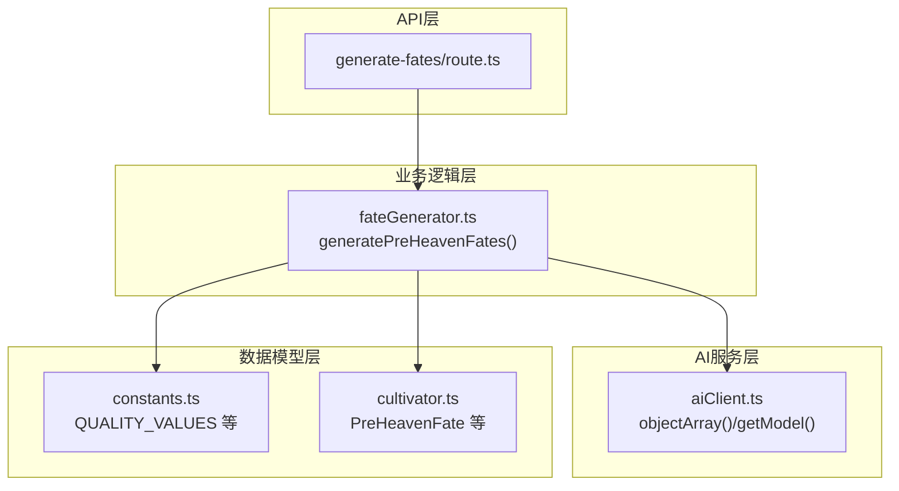
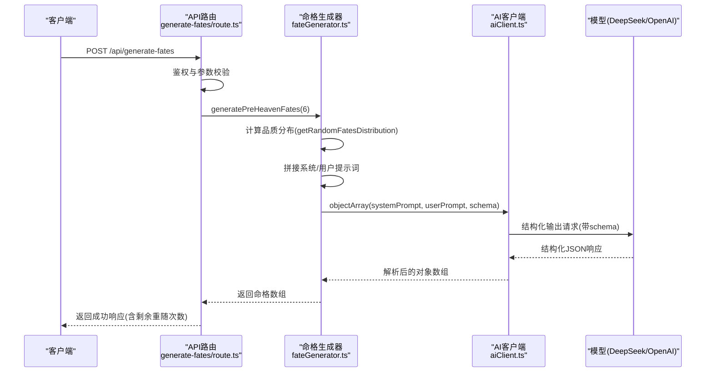
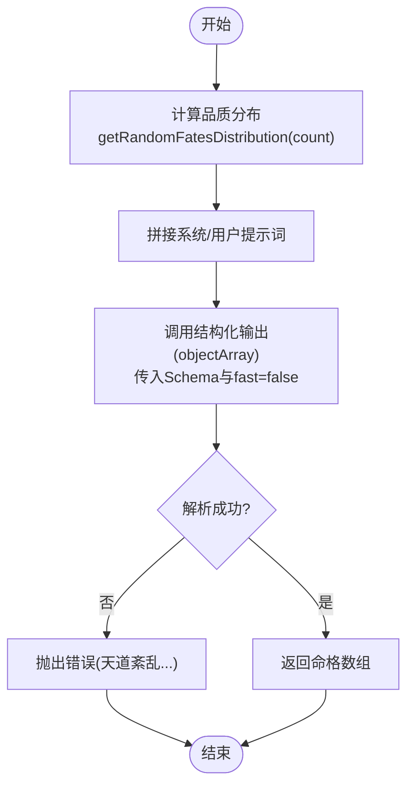
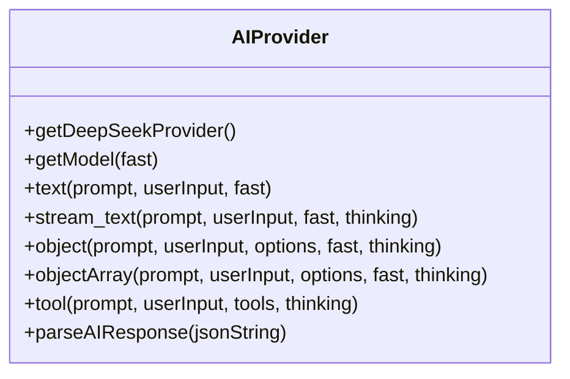
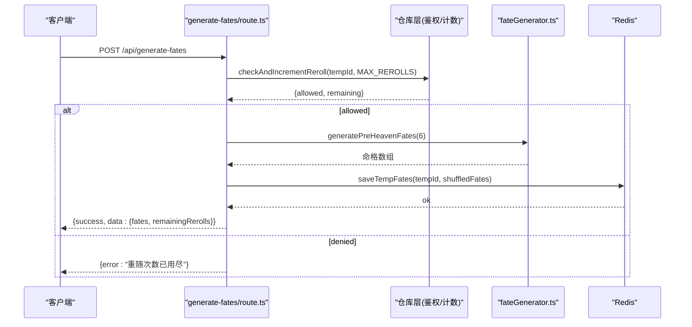
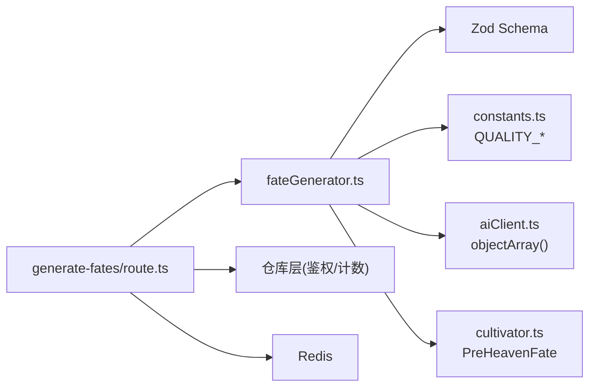

# 命格与奇遇生成

<cite>
**本文引用的文件**
- [utils/fateGenerator.ts](file://utils/fateGenerator.ts)
- [utils/aiClient.ts](file://utils/aiClient.ts)
- [types/cultivator.ts](file://types/cultivator.ts)
- [types/constants.ts](file://types/constants.ts)
- [app/api/generate-fates/route.ts](file://app/api/generate-fates/route.ts)
- [utils/prompts.ts](file://utils/prompts.ts)
- [utils/divineFortune.ts](file://utils/divineFortune.ts)
- [utils/fateGenerator.test.ts](file://utils/fateGenerator.test.ts)
</cite>

## 目录
1. [简介](#简介)
2. [项目结构](#项目结构)
3. [核心组件](#核心组件)
4. [架构总览](#架构总览)
5. [详细组件分析](#详细组件分析)
6. [依赖关系分析](#依赖关系分析)
7. [性能考量](#性能考量)
8. [故障排查指南](#故障排查指南)
9. [结论](#结论)
10. [附录](#附录)

## 简介
本文件深入解析命格与奇遇生成机制，聚焦于 utils/fateGenerator.ts 中的“先天气运”生成流程。文档说明如何基于角色属性（如灵根、功法、境界）构建AI提示词，调用 DeepSeek/OpenAI 模型生成符合修仙世界观的个性化命运轨迹；详细描述从输入参数校验、提示词模板拼接、AI调用到结果解析与结构化处理的全流程；解释 zod 模式验证在确保输出格式一致性中的作用，并提供异常处理策略（如重试机制、默认值兜底）；最后给出扩展新奇遇类型与调整生成权重的方法。

## 项目结构
围绕命格与奇遇生成的相关模块组织如下：
- 命格生成器：utils/fateGenerator.ts
- AI 客户端：utils/aiClient.ts（统一模型与结构化输出）
- 数据模型与常量：types/cultivator.ts、types/constants.ts
- API 入口：app/api/generate-fates/route.ts
- 辅助提示词与兜底文案：utils/prompts.ts、utils/divineFortune.ts
- 测试：utils/fateGenerator.test.ts

图表来源
- [app/api/generate-fates/route.ts](file://app/api/generate-fates/route.ts#L1-L69)
- [utils/fateGenerator.ts](file://utils/fateGenerator.ts#L1-L166)
- [utils/aiClient.ts](file://utils/aiClient.ts#L1-L211)
- [types/constants.ts](file://types/constants.ts#L115-L126)
- [types/cultivator.ts](file://types/cultivator.ts#L63-L78)

章节来源
- [app/api/generate-fates/route.ts](file://app/api/generate-fates/route.ts#L1-L69)
- [utils/fateGenerator.ts](file://utils/fateGenerator.ts#L1-L166)
- [utils/aiClient.ts](file://utils/aiClient.ts#L1-L211)
- [types/cultivator.ts](file://types/cultivator.ts#L63-L78)
- [types/constants.ts](file://types/constants.ts#L115-L126)

## 核心组件
- 命格生成器：负责按目标数量生成品质分布、构造系统/用户提示词、调用结构化输出接口、解析并返回结构化命格数组。
- AI 客户端：统一封装 DeepSeek/OpenAI Provider 与模型选择，提供结构化输出方法（object/objectArray），内置重试与思考模式开关。
- 数据模型与常量：定义命格结构、品质枚举、属性键等，保证前后端一致的数据契约。
- API 入口：接收请求、鉴权、调用命格生成器、打散与保存临时命格、返回剩余重随次数。

章节来源
- [utils/fateGenerator.ts](file://utils/fateGenerator.ts#L91-L166)
- [utils/aiClient.ts](file://utils/aiClient.ts#L92-L159)
- [types/cultivator.ts](file://types/cultivator.ts#L63-L78)
- [types/constants.ts](file://types/constants.ts#L115-L126)
- [app/api/generate-fates/route.ts](file://app/api/generate-fates/route.ts#L1-L69)

## 架构总览
整体流程：API 接收请求 -> 生成命格 -> AI 结构化输出 -> 返回结果。其中命格生成器内部完成品质分布采样、提示词拼接、调用 AI、Zod 校验与错误兜底。

图表来源
- [app/api/generate-fates/route.ts](file://app/api/generate-fates/route.ts#L1-L69)
- [utils/fateGenerator.ts](file://utils/fateGenerator.ts#L91-L166)
- [utils/aiClient.ts](file://utils/aiClient.ts#L92-L159)

## 详细组件分析

### 命格生成器：generatePreHeavenFates
- 输入参数与校验
  - count 默认 10，内部通过随机分布函数生成各品质的数量分布，再拼接为“目标分布描述”用于提示词。
- 提示词模板
  - 系统提示词明确世界观背景、生成要求（名称长度、类型、品质、属性加成数量与范围、描述长度与风格）、输出格式约束（纯 JSON）。
  - 用户提示词要求生成恰好 count 条数据，并严格遵循“目标分布描述”。
- AI 调用
  - 使用结构化输出方法，传入 Zod Schema 与 schemaName，启用 maxRetries 重试。
  - fast 参数为 false，表示使用较慢但更稳定的模型。
- 结果解析与结构化处理
  - 返回对象数组，每个元素符合 PreHeavenFate 结构。
- 异常处理
  - try/catch 包裹，捕获错误后抛出统一错误消息，便于上游处理。

图表来源
- [utils/fateGenerator.ts](file://utils/fateGenerator.ts#L91-L166)
- [utils/aiClient.ts](file://utils/aiClient.ts#L129-L159)

章节来源
- [utils/fateGenerator.ts](file://utils/fateGenerator.ts#L91-L166)

### AI 客户端：结构化输出与模型选择
- Provider 选择
  - 根据环境变量选择 DeepSeek Provider，并支持 Ark 基座与 OpenAI 基座切换。
- 模型选择
  - fast=true/false 决定使用不同模型；Ark 基座与 OpenAI 基座分别读取对应环境变量。
- 结构化输出
  - object/objectArray 方法均支持 schema 校验、schemaName、maxRetries=3、thinking 开关。
- JSON 解析兜底
  - 提供 parseAIResponse 辅助函数，尝试直接解析，失败时提取首个 JSON 片段并再次解析。

图表来源
- [utils/aiClient.ts](file://utils/aiClient.ts#L1-L211)

章节来源
- [utils/aiClient.ts](file://utils/aiClient.ts#L1-L211)

### 数据模型与常量
- 命格结构
  - PreHeavenFate：name、type、quality、attribute_mod、description。
  - PreHeavenFateAttributeMod：vitality、spirit、wisdom、speed、willpower 可选整数加成。
- 品质枚举
  - QUALITY_VALUES：凡品、灵品、玄品、真品、地品、天品、仙品、神品。
- 属性键
  - 与命格加成键一致，确保前后端一致。

章节来源
- [types/cultivator.ts](file://types/cultivator.ts#L63-L78)
- [types/constants.ts](file://types/constants.ts#L115-L126)

### API 入口：生成命格路由
- 鉴权与参数校验
  - 通过 Supabase 获取当前用户，校验 tempId 存在性。
- 重随次数控制
  - 调用仓库层检查并递增重随次数，限制 MAX_REROLLS。
- 生成与保存
  - 调用 generatePreHeavenFates(6)，洗牌后取前 6 个，保存到 Redis。
- 响应
  - 返回 success、data.fates、remainingRerolls。

图表来源
- [app/api/generate-fates/route.ts](file://app/api/generate-fates/route.ts#L1-L69)
- [utils/fateGenerator.ts](file://utils/fateGenerator.ts#L91-L166)

章节来源
- [app/api/generate-fates/route.ts](file://app/api/generate-fates/route.ts#L1-L69)

### 提示词与兜底文案
- 命格提示词
  - 系统提示词包含世界观背景、生成要求（名称、类型、品质、属性加成数量与范围、描述长度与风格）、输出格式约束。
- 天机推演兜底
  - divineFortune.ts 提供预设格言池与随机选择方法，作为 AIGC 失败时的备用文案。

章节来源
- [utils/fateGenerator.ts](file://utils/fateGenerator.ts#L109-L147)
- [utils/divineFortune.ts](file://utils/divineFortune.ts#L1-L132)

## 依赖关系分析
- 命格生成器依赖
  - Zod Schema（PreHeavenFateSchema）进行输出校验。
  - 常量 QUALITY_VALUES 与 QUALITY_RANGES、QUALITY_CHANCE_MAP 控制品质分布与加成范围。
  - AI 客户端 objectArray 提供结构化输出能力。
- API 路由依赖
  - 命格生成器、仓库层（鉴权与重随计数）、Redis 保存。
- 数据模型依赖
  - PreHeavenFate 与属性键与提示词中的 attribute_mod 字段一一对应。

图表来源
- [utils/fateGenerator.ts](file://utils/fateGenerator.ts#L1-L166)
- [utils/aiClient.ts](file://utils/aiClient.ts#L129-L159)
- [types/constants.ts](file://types/constants.ts#L115-L126)
- [types/cultivator.ts](file://types/cultivator.ts#L63-L78)
- [app/api/generate-fates/route.ts](file://app/api/generate-fates/route.ts#L1-L69)

章节来源
- [utils/fateGenerator.ts](file://utils/fateGenerator.ts#L1-L166)
- [utils/aiClient.ts](file://utils/aiClient.ts#L129-L159)
- [types/cultivator.ts](file://types/cultivator.ts#L63-L78)
- [types/constants.ts](file://types/constants.ts#L115-L126)
- [app/api/generate-fates/route.ts](file://app/api/generate-fates/route.ts#L1-L69)

## 性能考量
- 模型选择
  - 命格生成 fast=false，优先稳定性与结构化输出质量，避免因追求速度导致 JSON 格式不合规。
- 重试机制
  - AI 客户端默认 maxRetries=3，减少偶发失败带来的用户体验波动。
- 分布采样
  - getRandomFatesDistribution 采用累积概率法，复杂度 O(n)，n 为命格数量，开销可控。
- 输出解析
  - Zod 校验在服务端完成，避免前端渲染错误数据。

[本节为通用性能讨论，无需列出具体文件来源]

## 故障排查指南
- 常见错误
  - AI 生成失败：捕获异常并抛出统一错误消息，便于前端提示。
  - 重随次数用尽：API 层返回相应错误码与提示。
  - 缺少鉴权或参数：API 层返回 401/400。
- 排查步骤
  - 检查环境变量 PROVIDER_CHOOSE、OPENAI_* 或 ARK_* 是否正确配置。
  - 查看 AI 客户端日志 totalUsage，确认模型调用是否成功。
  - 使用 parseAIResponse 辅助函数定位 JSON 解析问题。
- 兜底策略
  - 命格生成器捕获错误后抛错，建议上游重试或提示用户稍后重试。
  - 天机推演提供预设池，作为 AIGC 失败时的备用文案。

章节来源
- [utils/fateGenerator.ts](file://utils/fateGenerator.ts#L148-L165)
- [utils/aiClient.ts](file://utils/aiClient.ts#L188-L211)
- [app/api/generate-fates/route.ts](file://app/api/generate-fates/route.ts#L1-L69)
- [utils/divineFortune.ts](file://utils/divineFortune.ts#L1-L132)

## 结论
fateGenerator.ts 通过“品质分布采样 + 结构化提示词 + Zod 校验”的组合，实现了稳定、可扩展且符合修仙世界观的命格生成。AI 客户端提供统一的模型与重试机制，API 路由负责鉴权与重随控制，数据模型确保前后端一致性。该设计既满足当前需求，也为后续扩展新奇遇类型与调整权重提供了清晰路径。

[本节为总结性内容，无需列出具体文件来源]

## 附录

### 生成流程要点清单
- 输入参数校验：API 层校验用户与 tempId；命格生成器内部校验 count。
- 提示词模板：系统提示词明确规则与输出格式；用户提示词限定数量与分布。
- AI 调用：objectArray(schema, fast=false)，maxRetries=3。
- 结果解析：Zod 校验，返回结构化数组。
- 异常处理：捕获错误并抛出统一消息，便于前端提示。

章节来源
- [app/api/generate-fates/route.ts](file://app/api/generate-fates/route.ts#L1-L69)
- [utils/fateGenerator.ts](file://utils/fateGenerator.ts#L91-L166)
- [utils/aiClient.ts](file://utils/aiClient.ts#L129-L159)

### 扩展新奇遇类型的建议
- 新增类型枚举
  - 在 constants.ts 中新增奇遇类型枚举值，并在命格 Schema 中扩展 type 字段。
- 调整权重与范围
  - 在 QUALITY_CHANCE_MAP 中调整各品质概率，在 QUALITY_RANGES 中调整加成总和范围。
- 更新提示词
  - 在系统提示词中补充新奇遇的命名风格、属性加成数量与范围、描述长度与风格要求。
- 测试与回归
  - 添加单元测试，验证新类型在不同品质下的分布与加成合理性。

章节来源
- [types/constants.ts](file://types/constants.ts#L115-L126)
- [utils/fateGenerator.ts](file://utils/fateGenerator.ts#L1-L89)
- [utils/fateGenerator.test.ts](file://utils/fateGenerator.test.ts#L1-L8)

### 调整生成权重的方法
- 修改 QUALITY_CHANCE_MAP：提高/降低某品质出现概率，从而影响命格整体风格（如更偏向“吉”或“凶”）。
- 修改 QUALITY_RANGES：调整加成总和范围，控制命格强度与风险。
- 修改提示词中的属性组合偏好：引导模型在特定品质下生成更突出的单项加成。

章节来源
- [utils/fateGenerator.ts](file://utils/fateGenerator.ts#L6-L29)
- [utils/fateGenerator.ts](file://utils/fateGenerator.ts#L109-L147)