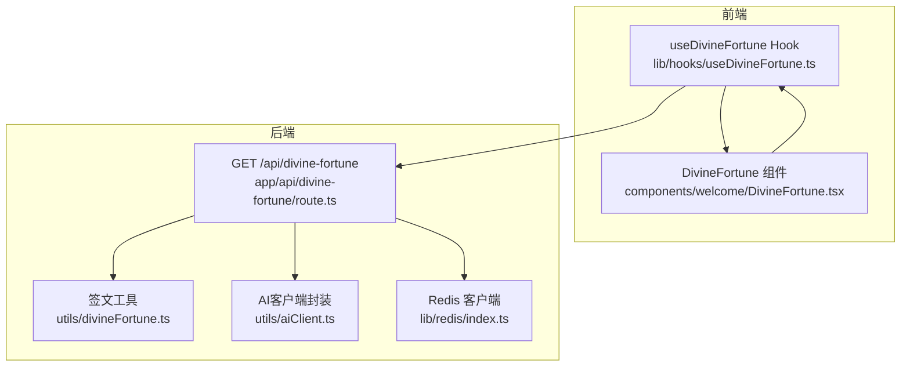
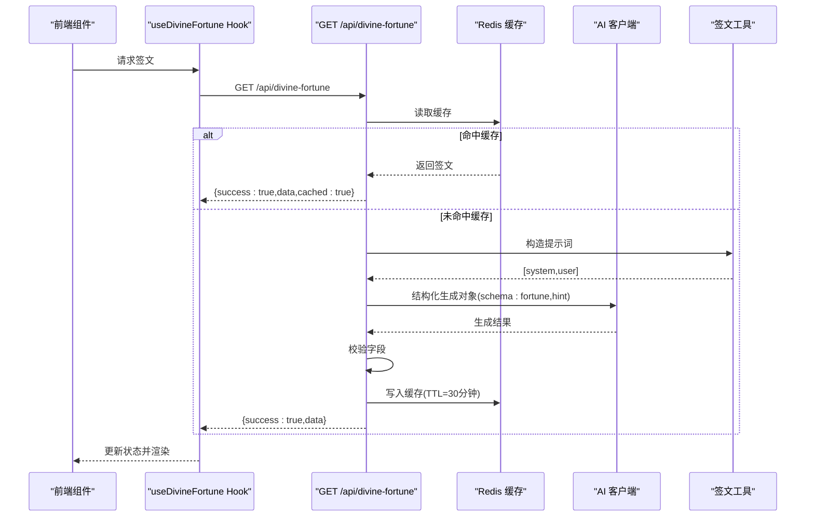
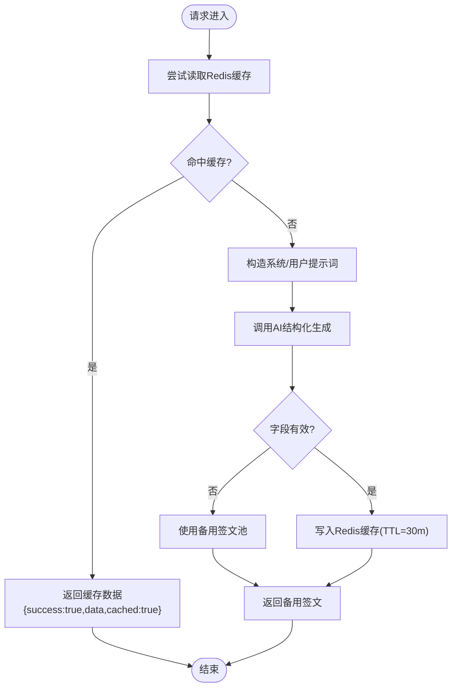
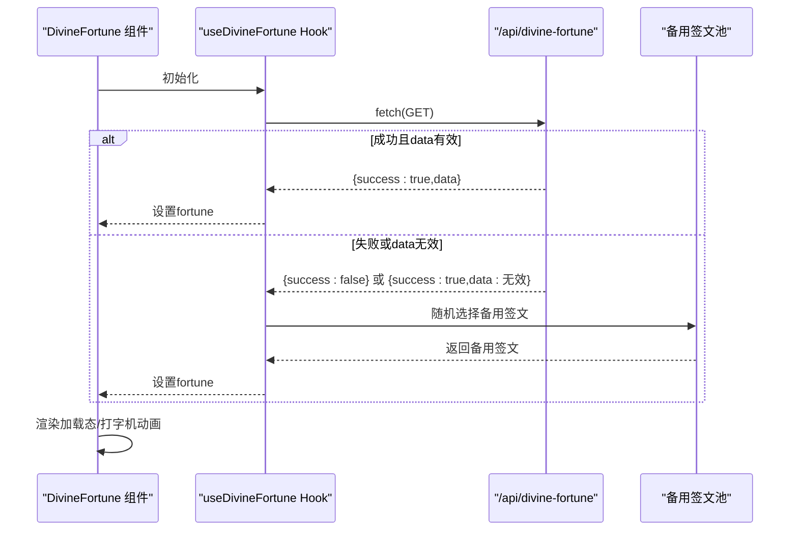
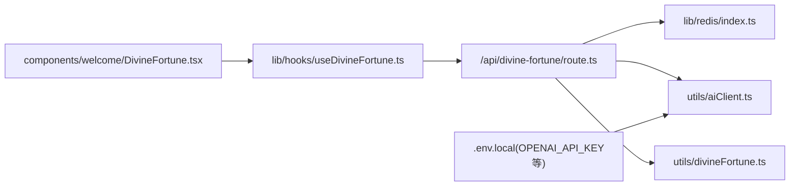

# 神签抽取API

<cite>
**本文引用的文件**
- [app/api/divine-fortune/route.ts](file://app/api/divine-fortune/route.ts)
- [utils/divineFortune.ts](file://utils/divineFortune.ts)
- [utils/aiClient.ts](file://utils/aiClient.ts)
- [lib/redis/index.ts](file://lib/redis/index.ts)
- [lib/hooks/useDivineFortune.ts](file://lib/hooks/useDivineFortune.ts)
- [components/welcome/DivineFortune.tsx](file://components/welcome/DivineFortune.tsx)
- [ENV_SETUP.md](file://ENV_SETUP.md)
- [README.md](file://README.md)
</cite>

## 目录
1. [简介](#简介)
2. [项目结构](#项目结构)
3. [核心组件](#核心组件)
4. [架构总览](#架构总览)
5. [详细组件分析](#详细组件分析)
6. [依赖关系分析](#依赖关系分析)
7. [性能考量](#性能考量)
8. [故障排查指南](#故障排查指南)
9. [结论](#结论)
10. [附录](#附录)

## 简介
本文件全面记录“神签抽取API”的实现细节，涵盖用户触发抽签后，系统如何解析意图、构造包含角色背景的提示词，并调用AI模型生成具有隐喻性和指引性的签文内容。文档还说明响应格式设计（签文文本、吉凶评级、潜在事件提示等字段），分析Redis缓存机制以防止频繁重复请求，以及如何记录抽签历史用于后续剧情联动。最后提供前端调用示例与用户体验优化建议（如加载状态、结果动画）。

## 项目结构
围绕“神签抽取API”的关键文件组织如下：
- 后端API：Next.js App Router路由，负责缓存读取、AI调用与降级策略
- 工具库：提示词构造、AI客户端封装、备用签文池
- 前端Hook与组件：拉取签文、展示打字机动画与加载态
- 缓存：基于Upstash Redis的键值缓存
- 环境配置：API Key与模型选择

图表来源
- [app/api/divine-fortune/route.ts](file://app/api/divine-fortune/route.ts#L1-L81)
- [utils/divineFortune.ts](file://utils/divineFortune.ts#L1-L132)
- [utils/aiClient.ts](file://utils/aiClient.ts#L1-L211)
- [lib/redis/index.ts](file://lib/redis/index.ts#L1-L6)
- [lib/hooks/useDivineFortune.ts](file://lib/hooks/useDivineFortune.ts#L1-L45)
- [components/welcome/DivineFortune.tsx](file://components/welcome/DivineFortune.tsx#L1-L77)

章节来源
- [README.md](file://README.md#L156-L187)

## 核心组件
- 后端路由：提供GET /api/divine-fortune接口，实现Redis缓存命中优先、AI结构化生成、降级备用方案与统一JSON响应
- 签文工具：定义签文数据结构、构造系统与用户提示词、提供备用签文池与随机选择
- AI客户端：封装DeepSeek/OpenAI兼容模型调用，支持结构化输出与重试
- Redis客户端：基于Upstash Redis，提供键值读写与TTL设置
- 前端Hook与组件：拉取签文、处理加载与错误、展示打字机动画

章节来源
- [app/api/divine-fortune/route.ts](file://app/api/divine-fortune/route.ts#L1-L81)
- [utils/divineFortune.ts](file://utils/divineFortune.ts#L1-L132)
- [utils/aiClient.ts](file://utils/aiClient.ts#L1-L211)
- [lib/redis/index.ts](file://lib/redis/index.ts#L1-L6)
- [lib/hooks/useDivineFortune.ts](file://lib/hooks/useDivineFortune.ts#L1-L45)
- [components/welcome/DivineFortune.tsx](file://components/welcome/DivineFortune.tsx#L1-L77)

## 架构总览
后端API在请求到达时优先检查Redis缓存；命中则直接返回；未命中则构造系统与用户提示词，调用AI模型生成结构化签文，校验并落盘缓存，最终返回统一响应。前端通过Hook与组件完成调用与展示。

图表来源
- [app/api/divine-fortune/route.ts](file://app/api/divine-fortune/route.ts#L1-L81)
- [utils/divineFortune.ts](file://utils/divineFortune.ts#L1-L132)
- [utils/aiClient.ts](file://utils/aiClient.ts#L92-L124)
- [lib/redis/index.ts](file://lib/redis/index.ts#L1-L6)

## 详细组件分析

### 后端API：GET /api/divine-fortune
- 缓存键与TTL：使用固定键名与30分钟TTL，避免频繁重复请求
- 缓存命中：直接返回data与cached标记
- 提示词构造：调用签文工具获取系统提示词与用户提示词
- AI调用：使用结构化对象生成，约束schema为fortune与hint两个字段
- 校验与降级：若AI响应不符合schema，使用备用签文池随机选择
- 统一响应：success布尔值、data对象、fallback/cached标记

图表来源
- [app/api/divine-fortune/route.ts](file://app/api/divine-fortune/route.ts#L1-L81)
- [utils/divineFortune.ts](file://utils/divineFortune.ts#L1-L132)

章节来源
- [app/api/divine-fortune/route.ts](file://app/api/divine-fortune/route.ts#L1-L81)

### 签文工具：提示词与备用池
- 数据结构：fortune（签文文本）、hint（提示/建议）
- 系统提示词：要求签文10-20字、提示8-15字、风格玄妙优雅、禁止现代词汇、输出纯JSON
- 用户提示词：要求新意、避免常见重复
- 备用池：预置多条道家风格签文，作为AI失败时的降级方案

章节来源
- [utils/divineFortune.ts](file://utils/divineFortune.ts#L1-L132)

### AI客户端：结构化生成与重试
- 模型选择：根据环境变量选择OpenAI或Ark兼容服务，支持fast与非fast模型切换
- 结构化生成：generateObject，传入schema、schemaName、schemaDescription，限制最大重试次数
- 日志统计：调试输出token用量

章节来源
- [utils/aiClient.ts](file://utils/aiClient.ts#L92-L124)

### Redis缓存：键值存储与TTL
- 客户端：基于Upstash Redis，从环境变量读取连接信息
- 使用方式：读取、写入、设置TTL

章节来源
- [lib/redis/index.ts](file://lib/redis/index.ts#L1-L6)
- [app/api/divine-fortune/route.ts](file://app/api/divine-fortune/route.ts#L1-L81)

### 前端Hook与组件：调用与展示
- Hook：首次挂载时fetch /api/divine-fortune，成功则设置data，失败或非success则降级到备用签文
- 组件：展示“正在推演天机…”加载态；渲染fortune与hint；支持打字机动画与延迟；提供回调与立即显示选项

图表来源
- [lib/hooks/useDivineFortune.ts](file://lib/hooks/useDivineFortune.ts#L1-L45)
- [components/welcome/DivineFortune.tsx](file://components/welcome/DivineFortune.tsx#L1-L77)
- [utils/divineFortune.ts](file://utils/divineFortune.ts#L125-L132)

章节来源
- [lib/hooks/useDivineFortune.ts](file://lib/hooks/useDivineFortune.ts#L1-L45)
- [components/welcome/DivineFortune.tsx](file://components/welcome/DivineFortune.tsx#L1-L77)

## 依赖关系分析
- 路由依赖：Redis客户端、AI客户端、签文工具
- Hook依赖：前端fetch、备用签文工具
- 组件依赖：Hook、打字机文本组件
- 环境依赖：API Key与模型配置

图表来源
- [app/api/divine-fortune/route.ts](file://app/api/divine-fortune/route.ts#L1-L81)
- [lib/redis/index.ts](file://lib/redis/index.ts#L1-L6)
- [utils/aiClient.ts](file://utils/aiClient.ts#L1-L211)
- [utils/divineFortune.ts](file://utils/divineFortune.ts#L1-L132)
- [lib/hooks/useDivineFortune.ts](file://lib/hooks/useDivineFortune.ts#L1-L45)
- [components/welcome/DivineFortune.tsx](file://components/welcome/DivineFortune.tsx#L1-L77)
- [ENV_SETUP.md](file://ENV_SETUP.md#L1-L39)

章节来源
- [ENV_SETUP.md](file://ENV_SETUP.md#L1-L39)

## 性能考量
- 缓存命中率：30分钟TTL减少AI调用频率，显著降低延迟与成本
- 结构化输出：AI客户端启用schema约束，减少后处理开销与解析失败概率
- 重试策略：最大重试次数限制，避免长时间阻塞
- 前端懒加载：组件在首次渲染时触发请求，避免不必要的并发

## 故障排查指南
- AI响应格式不符
  - 现象：返回数据缺少fortune或hint字段
  - 处理：路由会捕获并使用备用签文池，同时在控制台告警
  - 参考路径：[app/api/divine-fortune/route.ts](file://app/api/divine-fortune/route.ts#L47-L62)
- Redis读写异常
  - 现象：缓存未命中或写入失败
  - 处理：确认环境变量与连接信息正确，检查网络连通性
  - 参考路径：[lib/redis/index.ts](file://lib/redis/index.ts#L1-L6)
- 环境变量缺失
  - 现象：模型调用失败或无法选择
  - 处理：按ENV_SETUP.md配置OPENAI_API_KEY、OPENAI_BASE_URL、模型名称
  - 参考路径：[ENV_SETUP.md](file://ENV_SETUP.md#L1-L39)
- 前端请求失败
  - 现象：组件显示加载态或错误文案
  - 处理：检查网络与跨域配置，确认路由可达
  - 参考路径：[lib/hooks/useDivineFortune.ts](file://lib/hooks/useDivineFortune.ts#L1-L45)

章节来源
- [app/api/divine-fortune/route.ts](file://app/api/divine-fortune/route.ts#L47-L79)
- [lib/redis/index.ts](file://lib/redis/index.ts#L1-L6)
- [ENV_SETUP.md](file://ENV_SETUP.md#L1-L39)
- [lib/hooks/useDivineFortune.ts](file://lib/hooks/useDivineFortune.ts#L1-L45)

## 结论
“神签抽取API”通过明确的提示词约束、结构化AI输出与Redis缓存，实现了稳定高效的签文生成与展示。前端Hook与组件提供了良好的用户体验，包括加载态与打字机动画。备用签文池确保在AI异常时仍能提供一致的体验。未来可考虑引入抽签历史记录与剧情联动，进一步增强沉浸感。

## 附录

### 响应格式设计
- 字段
  - success: 布尔，表示请求是否成功
  - data: 对象，包含
    - fortune: 签文文本（10-20字，道家隐喻）
    - hint: 提示/建议（8-15字，宜/忌格式）
  - cached: 布尔，仅当命中缓存时返回
  - fallback: 布尔，仅当使用备用签文时返回

章节来源
- [app/api/divine-fortune/route.ts](file://app/api/divine-fortune/route.ts#L23-L28)
- [app/api/divine-fortune/route.ts](file://app/api/divine-fortune/route.ts#L64-L78)
- [utils/divineFortune.ts](file://utils/divineFortune.ts#L1-L132)

### 前端调用示例与用户体验优化
- 调用示例
  - 使用useDivineFortune Hook在组件中发起请求
  - 参考路径：[lib/hooks/useDivineFortune.ts](file://lib/hooks/useDivineFortune.ts#L1-L45)
- 用户体验优化
  - 加载状态：显示“正在推演天机…”脉动文案
  - 结果动画：使用打字机效果逐字呈现fortune与hint
  - 错误兜底：请求失败或数据无效时，自动降级到备用签文
  - 参考路径：[components/welcome/DivineFortune.tsx](file://components/welcome/DivineFortune.tsx#L1-L77)