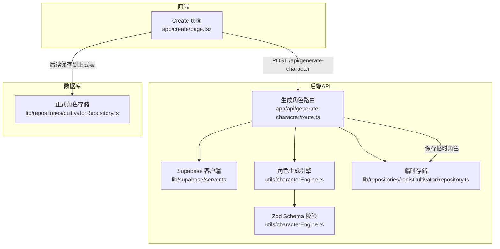
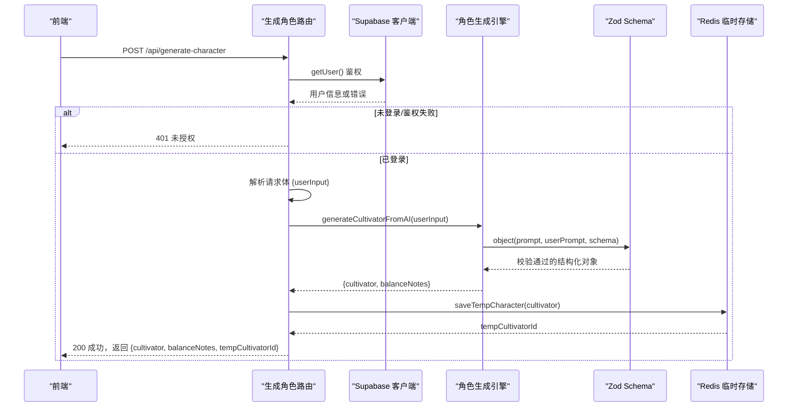
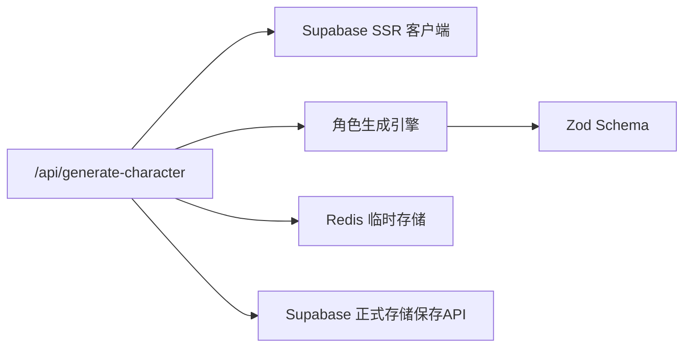

# 角色生成API

<cite>
**本文引用的文件**
- [app/api/generate-character/route.ts](file://app/api/generate-character/route.ts)
- [utils/characterEngine.ts](file://utils/characterEngine.ts)
- [utils/fateGenerator.ts](file://utils/fateGenerator.ts)
- [lib/repositories/redisCultivatorRepository.ts](file://lib/repositories/redisCultivatorRepository.ts)
- [lib/repositories/cultivatorRepository.ts](file://lib/repositories/cultivatorRepository.ts)
- [lib/supabase/server.ts](file://lib/supabase/server.ts)
- [app/create/page.tsx](file://app/create/page.tsx)
- [types/cultivator.ts](file://types/cultivator.ts)
- [utils/prompts.ts](file://utils/prompts.ts)
</cite>

## 目录
1. [简介](#简介)
2. [项目结构](#项目结构)
3. [核心组件](#核心组件)
4. [架构总览](#架构总览)
5. [详细组件分析](#详细组件分析)
6. [依赖关系分析](#依赖关系分析)
7. [性能考量](#性能考量)
8. [故障排查指南](#故障排查指南)
9. [结论](#结论)
10. [附录](#附录)

## 简介
本文件面向“生成角色”RESTful API（POST /api/generate-character）的完整技术文档，涵盖：
- 请求方法与认证要求（Supabase JWT）
- 输入输出JSON结构
- 数据验证流程（Zod Schema）
- 生成流程（AI生成角色、角色平衡调整、临时存储）
- 与前端“创建角色”页面的集成方式
- 错误码说明与常见问题排查

## 项目结构
该API位于Next.js App Router的API路由中，围绕角色生成的核心链路由以下模块协作完成：
- 路由层：鉴权与请求处理
- 生成层：AI生成角色与Schema校验
- 平衡层：角色数值与平衡策略
- 存储层：临时存储（Redis）与正式存储（Supabase）

图表来源
- [app/api/generate-character/route.ts](file://app/api/generate-character/route.ts#L1-L80)
- [lib/supabase/server.ts](file://lib/supabase/server.ts#L1-L28)
- [utils/characterEngine.ts](file://utils/characterEngine.ts#L1-L181)
- [lib/repositories/redisCultivatorRepository.ts](file://lib/repositories/redisCultivatorRepository.ts#L1-L103)
- [lib/repositories/cultivatorRepository.ts](file://lib/repositories/cultivatorRepository.ts#L180-L294)

章节来源
- [app/api/generate-character/route.ts](file://app/api/generate-character/route.ts#L1-L80)
- [app/create/page.tsx](file://app/create/page.tsx#L105-L155)

## 核心组件
- 生成路由：负责鉴权、请求解析、调用生成与平衡逻辑、临时存储、返回结果
- 角色生成引擎：基于Prompt与Zod Schema生成角色，并构造运行时对象
- Zod Schema：对输入与输出进行严格约束
- 临时存储：将生成的角色以临时ID存入Redis，便于前端后续确认与保存
- 正式存储：将临时角色持久化到Supabase数据库（由保存API完成）

章节来源
- [app/api/generate-character/route.ts](file://app/api/generate-character/route.ts#L1-L80)
- [utils/characterEngine.ts](file://utils/characterEngine.ts#L1-L181)
- [lib/repositories/redisCultivatorRepository.ts](file://lib/repositories/redisCultivatorRepository.ts#L1-L103)
- [types/cultivator.ts](file://types/cultivator.ts#L218-L253)

## 架构总览
下面的序列图展示了从前端发起请求到返回临时角色数据的完整流程。

图表来源
- [app/api/generate-character/route.ts](file://app/api/generate-character/route.ts#L1-L80)
- [lib/supabase/server.ts](file://lib/supabase/server.ts#L1-L28)
- [utils/characterEngine.ts](file://utils/characterEngine.ts#L134-L181)
- [lib/repositories/redisCultivatorRepository.ts](file://lib/repositories/redisCultivatorRepository.ts#L12-L21)

## 详细组件分析

### API定义与端点
- 方法：POST
- 路径：/api/generate-character
- 认证：需要携带Supabase JWT（通过Cookie传递），服务端使用Supabase SSR客户端进行getUser鉴权
- 请求体JSON结构
  - userInput: string（最小长度2，最大长度200）
- 响应JSON结构
  - success: boolean
  - data.cultivator: 角色对象（见“角色数据模型”）
  - data.balanceNotes: string[]（平衡调整说明）
  - data.tempCultivatorId: string（临时角色ID，用于后续保存）

章节来源
- [app/api/generate-character/route.ts](file://app/api/generate-character/route.ts#L1-L80)
- [app/create/page.tsx](file://app/create/page.tsx#L120-L148)

### 数据验证与Zod Schema
- 输入验证
  - userInput必须存在且为字符串，长度在2~200之间
- 输出验证
  - 角色生成引擎使用Zod Schema对AI输出进行严格校验，确保字段齐全、类型正确、范围合理
  - 关键字段约束（示例）
    - 姓名：2~4个字符
    - 性别：枚举值
    - 出身：2~40字符
    - 性格：2~100字符
    - 境界：炼气
    - 境界阶段：枚举值
    - 年龄：10~100
    - 寿元：80~200
    - 基础属性：每项1~30
    - 灵根：1~4个，强度0~95
    - 功法：2个，包含名称、品阶、加成、所需境界
    - 神通：2~3个，包含名称、类型、元素、品阶、威力、消耗、冷却、效果等
    - 背景故事：10~300字符
    - 平衡说明：≤200字符

章节来源
- [app/api/generate-character/route.ts](file://app/api/generate-character/route.ts#L28-L42)
- [utils/characterEngine.ts](file://utils/characterEngine.ts#L30-L133)
- [utils/prompts.ts](file://utils/prompts.ts#L12-L57)

### 生成流程与平衡策略
- AI生成角色
  - 使用系统提示词与用户输入，调用结构化输出接口生成角色
  - 生成完成后构造运行时对象，填充默认字段（如状态、初始库存、装备等）
- 角色平衡调整
  - 属性总和限制：按境界上限的80%进行平衡
  - 灵根品阶确定与强度限制：根据灵根数量与元素类型确定品阶与强度范围
  - 技能威力与功法加成范围校验与调整：按品阶范围进行裁剪
  - 天道平衡：当存在顶级天赋或过强组合时，进行属性与品阶的适度下调，确保数值与体验平衡

章节来源
- [utils/characterEngine.ts](file://utils/characterEngine.ts#L134-L181)
- [utils/characterEngine.ts](file://utils/characterEngine.ts#L188-L643)

### 临时存储与后续保存
- 临时存储
  - 生成并通过平衡调整后的角色对象保存到Redis，带过期时间（1小时）
  - 返回临时ID给前端，用于后续“保存角色”流程
- 正式存储
  - 保存角色由另一个API完成（/api/save-character），将临时数据持久化到Supabase数据库
  - 该流程不在本API内，但与本API紧密衔接

章节来源
- [lib/repositories/redisCultivatorRepository.ts](file://lib/repositories/redisCultivatorRepository.ts#L12-L21)
- [app/create/page.tsx](file://app/create/page.tsx#L170-L212)

### 角色数据模型
- 基础属性：体魄、灵力、悟性、速度、神识
- 灵根：元素、强度、品阶（天灵根/真灵根/伪灵根）
- 功法：名称、品阶、加成、所需境界
- 神通：名称、类型、元素、品阶、威力、消耗、冷却、效果、持续时间等
- 其他：姓名、性别、出身、性格、背景、境界、境界阶段、年龄、寿命、状态、库存、装备、最大神通数、灵石、平衡说明等

章节来源
- [types/cultivator.ts](file://types/cultivator.ts#L218-L253)

### 与前端“创建角色”页面的集成
- 前端通过fetch调用本API，传入userInput
- 成功后前端保存tempCultivatorId，并自动触发“生成气运”流程
- 用户可在页面上查看平衡说明、属性与神通等信息，确认后调用保存API完成入库

章节来源
- [app/create/page.tsx](file://app/create/page.tsx#L105-L155)
- [app/create/page.tsx](file://app/create/page.tsx#L170-L212)

## 依赖关系分析
- 路由依赖Supabase进行用户鉴权
- 生成依赖角色生成引擎与Zod Schema
- 临时存储依赖Redis
- 正式存储依赖Supabase数据库（由保存API完成）

图表来源
- [app/api/generate-character/route.ts](file://app/api/generate-character/route.ts#L1-L80)
- [lib/supabase/server.ts](file://lib/supabase/server.ts#L1-L28)
- [utils/characterEngine.ts](file://utils/characterEngine.ts#L134-L181)
- [lib/repositories/redisCultivatorRepository.ts](file://lib/repositories/redisCultivatorRepository.ts#L12-L21)
- [lib/repositories/cultivatorRepository.ts](file://lib/repositories/cultivatorRepository.ts#L180-L294)

## 性能考量
- 生成阶段使用结构化输出与Zod校验，确保AI输出稳定可靠，减少后处理开销
- 临时存储采用Redis，避免数据库压力，提高并发下的响应速度
- 平衡调整逻辑在服务端完成，保证数值一致性与体验平衡
- 建议前端在生成后尽快调用保存API，避免临时数据过期

[本节为通用指导，无需列出章节来源]

## 故障排查指南
- 400 输入无效
  - userInput缺失、非字符串、长度不在2~200范围内
  - 建议：检查前端输入长度与类型
- 401 未授权访问
  - Supabase鉴权失败或用户不存在
  - 建议：确认浏览器Cookie中包含有效JWT，网络请求头中携带Cookie
- 500 生成失败
  - AI生成或平衡调整过程中发生异常
  - 建议：查看服务端日志，确认NODE_ENV与错误信息输出策略

章节来源
- [app/api/generate-character/route.ts](file://app/api/generate-character/route.ts#L24-L42)
- [app/api/generate-character/route.ts](file://app/api/generate-character/route.ts#L66-L78)

## 结论
本API通过严格的Zod Schema与平衡策略，结合Supabase鉴权与Redis临时存储，为前端提供了一个安全、稳定、可扩展的角色生成能力。前端“创建角色”页面通过一次调用即可获得可预览、可调整的临时角色，并在确认后完成正式入库。

[本节为总结性内容，无需列出章节来源]

## 附录

### curl示例
- 生成角色（需携带Cookie中的JWT）
  - curl -X POST http://localhost:3000/api/generate-character \
    -H "Content-Type: application/json" \
    -b "supabase.auth.token=<你的JWT>" \
    -d '{"userInput":"我想成为一位靠炼丹逆袭的废柴少主……"}'

[本节为示例说明，无需列出章节来源]