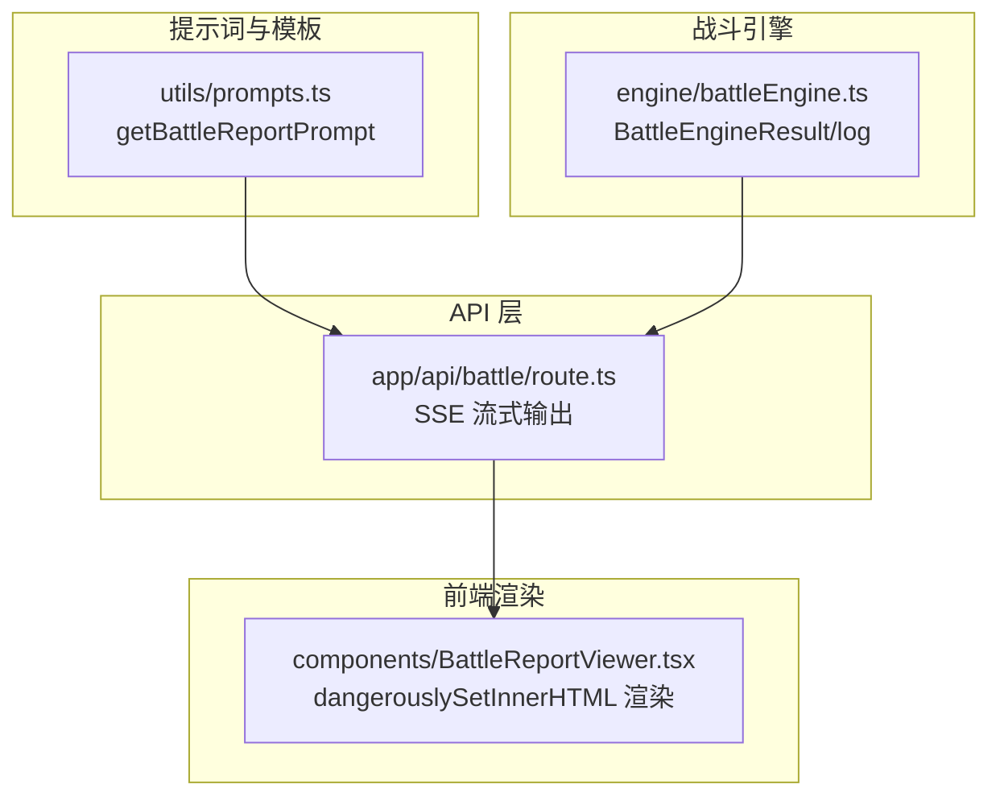
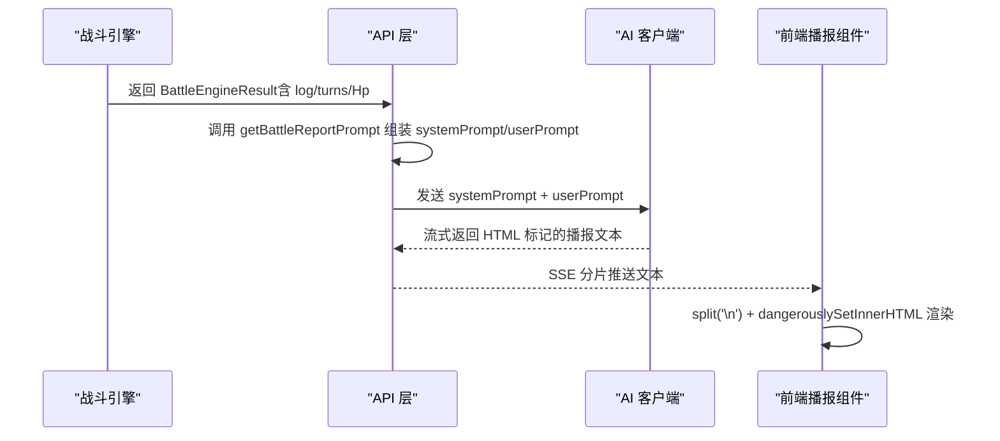
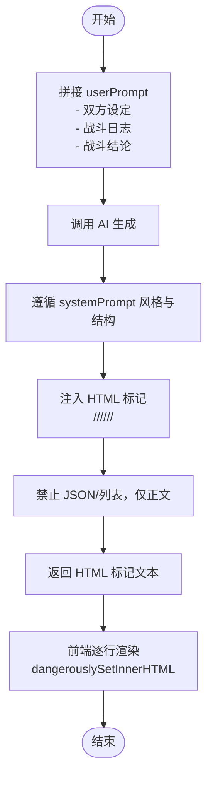
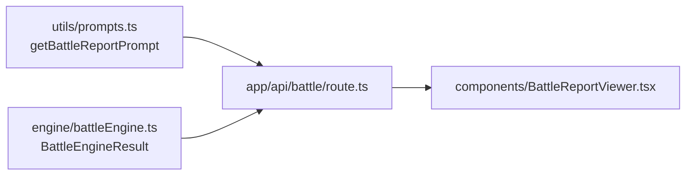

# 战斗播报提示词设计

<cite>
**本文引用的文件**
- [utils/prompts.ts](file://utils/prompts.ts)
- [engine/battleEngine.ts](file://engine/battleEngine.ts)
- [app/api/battle/route.ts](file://app/api/battle/route.ts)
- [components/BattleReportViewer.tsx](file://components/BattleReportViewer.tsx)
- [types/cultivator.ts](file://types/cultivator.ts)
</cite>

## 目录
1. [简介](#简介)
2. [项目结构](#项目结构)
3. [核心组件](#核心组件)
4. [架构总览](#架构总览)
5. [详细组件分析](#详细组件分析)
6. [依赖关系分析](#依赖关系分析)
7. [性能考量](#性能考量)
8. [故障排查指南](#故障排查指南)
9. [结论](#结论)

## 简介
本文件围绕“战斗播报提示词设计”展开，系统性解析 getBattleReportPrompt 如何将战斗引擎生成的日志，转化为具备古风韵味、回合结构清晰、并注入特定 HTML 标记的文学化播报。文档重点说明：
- systemPrompt 的语言风格、回合结构与 HTML 标记注入规则的设计意图
- summarizeCultivator 如何抽取角色核心信息用于上下文注入
- userPrompt 中对战双方设定与战斗日志的拼接逻辑
- AI 生成时如何确保招式与技能、气运相符
- 通过实际战斗日志示例，演示从原始数据到文学化描述的转换过程
- 强调禁止输出 JSON 或列表的安全要求，确保前端可直接渲染 HTML 标记

## 项目结构
与战斗播报提示词相关的核心模块包括：
- 提示词与模板：utils/prompts.ts
- 战斗引擎与日志：engine/battleEngine.ts
- API 入口与流式输出：app/api/battle/route.ts
- 前端渲染组件：components/BattleReportViewer.tsx
- 数据模型：types/cultivator.ts

图表来源
- [utils/prompts.ts](file://utils/prompts.ts#L72-L145)
- [engine/battleEngine.ts](file://engine/battleEngine.ts#L35-L43)
- [app/api/battle/route.ts](file://app/api/battle/route.ts#L80-L120)
- [components/BattleReportViewer.tsx](file://components/BattleReportViewer.tsx#L34-L67)

章节来源
- [utils/prompts.ts](file://utils/prompts.ts#L72-L145)
- [engine/battleEngine.ts](file://engine/battleEngine.ts#L35-L43)
- [app/api/battle/route.ts](file://app/api/battle/route.ts#L80-L120)
- [components/BattleReportViewer.tsx](file://components/BattleReportViewer.tsx#L34-L67)

## 核心组件
- getBattleReportPrompt：生成 systemPrompt 与 userPrompt，负责将战斗日志转化为文学化播报
- 战斗引擎 BattleEngineResult：提供 log、turns、playerHp/opponentHp 等关键数据
- API 层 route.ts：组装提示词并流式输出 AI 文本
- 前端 BattleReportViewer：逐行渲染 HTML 标记，支持流式展示

章节来源
- [utils/prompts.ts](file://utils/prompts.ts#L72-L145)
- [engine/battleEngine.ts](file://engine/battleEngine.ts#L35-L43)
- [app/api/battle/route.ts](file://app/api/battle/route.ts#L80-L120)
- [components/BattleReportViewer.tsx](file://components/BattleReportViewer.tsx#L34-L67)

## 架构总览
下面的序列图展示了从战斗结束到前端渲染的完整链路，包括提示词构造、AI 流式生成与前端渲染。

图表来源
- [engine/battleEngine.ts](file://engine/battleEngine.ts#L35-L43)
- [app/api/battle/route.ts](file://app/api/battle/route.ts#L80-L120)
- [utils/prompts.ts](file://utils/prompts.ts#L72-L145)
- [components/BattleReportViewer.tsx](file://components/BattleReportViewer.tsx#L34-L67)

## 详细组件分析

### systemPrompt 的设计意图
- 语言风格与镜头感：要求“热血、古风、有镜头感”，允许台词与心理描写，使播报更具画面感与代入感
- 回合结构：每回合独立成行，以“【第X回合】”开头，便于前端按行渲染与滚动
- HTML 标记注入规则：明确要求为关键信息添加特定标签，如 <turn>、<name>、<skill>、<damage>、<heal>、<effect>、<result>，并禁止输出 JSON 或列表，确保前端可直接渲染
- 生成约束：要求“招式须与技能、气运相符”，即 AI 在生成时需结合角色的技能、功法、先天气运等背景，使描述与设定一致

章节来源
- [utils/prompts.ts](file://utils/prompts.ts#L107-L124)

### summarizeCultivator 的角色信息抽取
- 提取维度：姓名、境界、灵根/属性、基础属性、神通、功法、先天气运
- 输出格式：以“键：值”的形式组织，便于 AI 在 userPrompt 中直接引用
- 作用：将角色的背景信息注入到 userPrompt，帮助 AI 在生成时“贴合角色设定”

章节来源
- [utils/prompts.ts](file://utils/prompts.ts#L79-L103)
- [types/cultivator.ts](file://types/cultivator.ts#L21-L25)

### userPrompt 的拼接逻辑
- 对战双方设定：分别调用 summarizeCultivator 输出双方背景
- 战斗日志：将 battleResult.log 以换行拼接，形成完整回合日志
- 战斗结论：包含胜者、回合数、双方剩余气血，作为总结与收束
- 设计目的：将“角色设定 + 实战日志 + 结论”三要素整合，引导 AI 生成连贯、贴合设定的播报

章节来源
- [utils/prompts.ts](file://utils/prompts.ts#L126-L142)

### AI 生成时的“招式与技能、气运相符”
- systemPrompt 明确要求“招式须与技能、气运相符”，避免 AI 生成与角色设定不符的描述
- 战斗引擎日志本身已基于技能类型（攻击/治疗/控制/增益/异常）与状态效果（如 burn、bleed、poison、stun、silence、root、buff/debuff）进行记录，userPrompt 中的角色背景（技能、功法、先天气运）为 AI 提供了“设定锚点”
- 前端渲染组件通过 HTML 标记，将关键信息高亮，便于读者快速定位回合、人物、技能与伤害

章节来源
- [utils/prompts.ts](file://utils/prompts.ts#L107-L124)
- [engine/battleEngine.ts](file://engine/battleEngine.ts#L394-L432)
- [engine/battleEngine.ts](file://engine/battleEngine.ts#L452-L516)
- [components/BattleReportViewer.tsx](file://components/BattleReportViewer.tsx#L34-L67)

### 从原始数据到文学化描述的转换流程
- 输入：BattleEngineResult.log（字符串数组，每项为回合事件）、双方角色数据（Cultivator）
- 处理：
  - systemPrompt：定义风格、结构与 HTML 标记规范
  - userPrompt：拼接双方设定、战斗日志与结论
  - AI：依据 systemPrompt 与 userPrompt，将日志逐回合改写为文学化描述
- 输出：HTML 标记的播报文本（每行一个回合，末尾附带胜负与状态总结）

图表来源
- [utils/prompts.ts](file://utils/prompts.ts#L72-L145)
- [app/api/battle/route.ts](file://app/api/battle/route.ts#L80-L120)
- [components/BattleReportViewer.tsx](file://components/BattleReportViewer.tsx#L34-L67)

### HTML 标记注入规则与前端渲染
- systemPrompt 明确要求的标记：回合数、人名、技能名、伤害/治疗数值、效果描述、胜负结果
- 前端组件通过 split('\n') 逐行渲染，并使用 dangerouslySetInnerHTML 将 HTML 标记直接注入，保证渲染一致性
- 该设计确保“后端只负责生成 HTML 正文，前端负责渲染”，职责清晰且安全可控

章节来源
- [utils/prompts.ts](file://utils/prompts.ts#L116-L124)
- [components/BattleReportViewer.tsx](file://components/BattleReportViewer.tsx#L34-L67)

## 依赖关系分析
- getBattleReportPrompt 依赖 BattleEngineResult 的 log、turns、playerHp、opponentHp 与 winnerId
- API 层 route.ts 调用 getBattleReportPrompt 并将结果通过 SSE 流式返回
- 前端 BattleReportViewer 依赖 HTML 标记的正确性，以实现逐行渲染与高亮

图表来源
- [utils/prompts.ts](file://utils/prompts.ts#L72-L145)
- [engine/battleEngine.ts](file://engine/battleEngine.ts#L35-L43)
- [app/api/battle/route.ts](file://app/api/battle/route.ts#L80-L120)
- [components/BattleReportViewer.tsx](file://components/BattleReportViewer.tsx#L34-L67)

章节来源
- [utils/prompts.ts](file://utils/prompts.ts#L72-L145)
- [engine/battleEngine.ts](file://engine/battleEngine.ts#L35-L43)
- [app/api/battle/route.ts](file://app/api/battle/route.ts#L80-L120)
- [components/BattleReportViewer.tsx](file://components/BattleReportViewer.tsx#L34-L67)

## 性能考量
- 流式输出：API 层通过 SSE 将 AI 文本分片推送，前端逐行渲染，降低一次性渲染压力
- 日志拼接：userPrompt 中将 log 数组以换行拼接，避免额外解析开销
- 前端渲染：逐行渲染与 dangerouslySetInnerHTML 的使用，确保渲染效率与一致性

[本节为通用性能讨论，无需列出具体文件来源]

## 故障排查指南
- HTML 标记缺失：若前端未正确渲染，检查 systemPrompt 是否被正确传入，以及 AI 是否遵守“禁止 JSON/列表”的约束
- 回合结构异常：确认 userPrompt 中是否正确拼接了“【对战双方设定】”“【战斗日志】”“【战斗结论】”三部分
- 招式与设定不符：检查角色的技能、功法、先天气运是否在 userPrompt 中充分呈现，必要时优化 summarizeCultivator 的抽取维度
- SSE 连接中断：关注 API 层的错误处理与关闭逻辑，确保在异常情况下发送 error 标记并关闭连接

章节来源
- [utils/prompts.ts](file://utils/prompts.ts#L107-L124)
- [app/api/battle/route.ts](file://app/api/battle/route.ts#L126-L171)
- [components/BattleReportViewer.tsx](file://components/BattleReportViewer.tsx#L34-L67)

## 结论
getBattleReportPrompt 通过明确的 systemPrompt 与严谨的 userPrompt 拼接，将战斗引擎的日志转化为具备古风韵味、回合结构清晰、并注入特定 HTML 标记的文学化播报。systemPrompt 的风格与标记规范确保前端可直接渲染；summarizeCultivator 将角色核心信息注入上下文，使 AI 生成更贴合设定；API 层的流式输出与前端的逐行渲染共同保障了良好的用户体验。整体设计在“生成质量”“渲染一致性”“安全性”之间取得良好平衡。