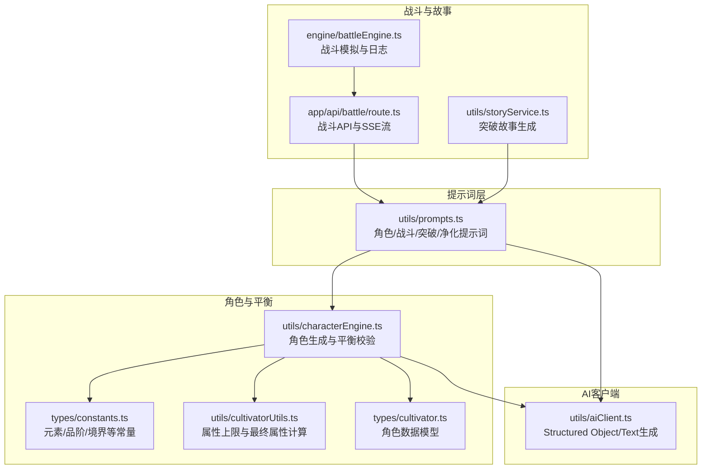
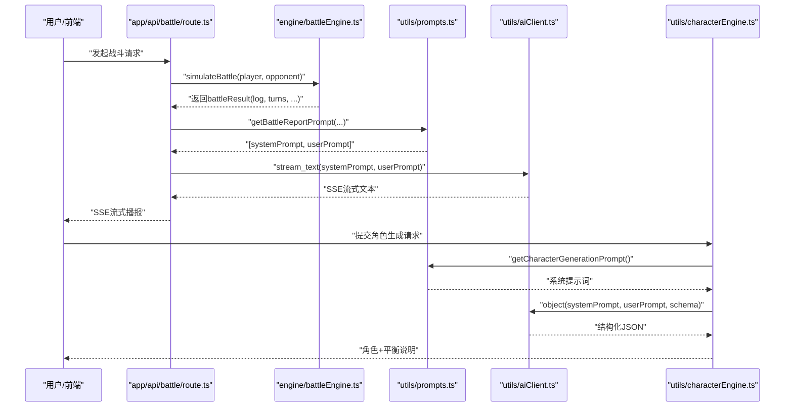
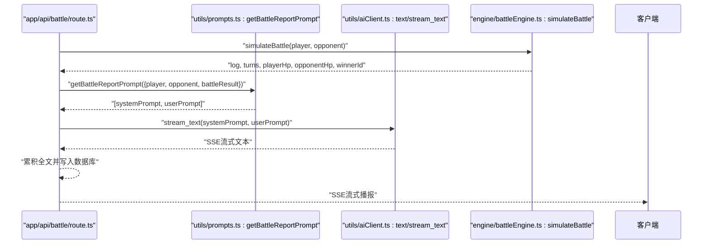
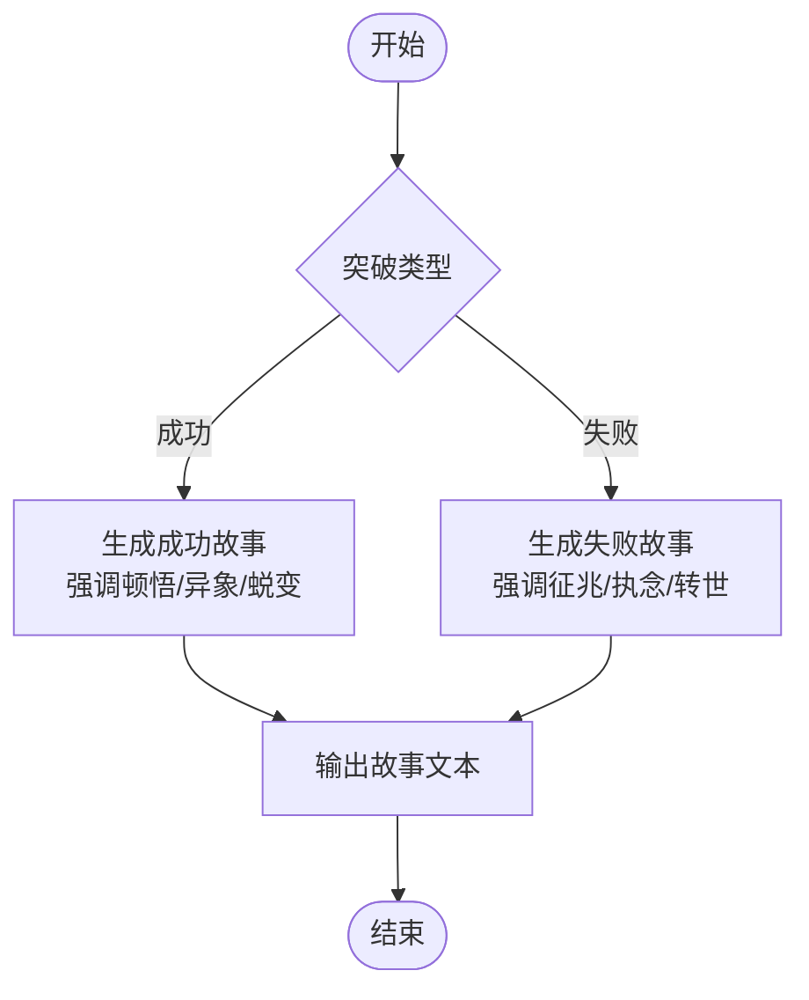
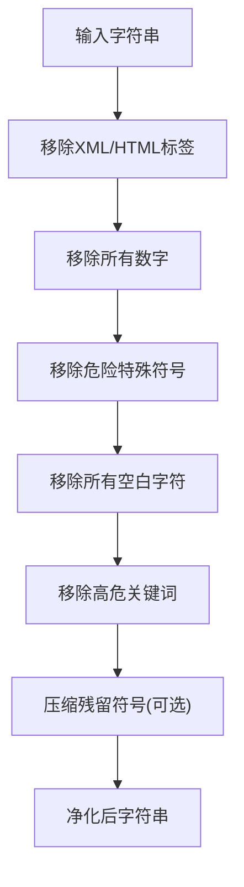
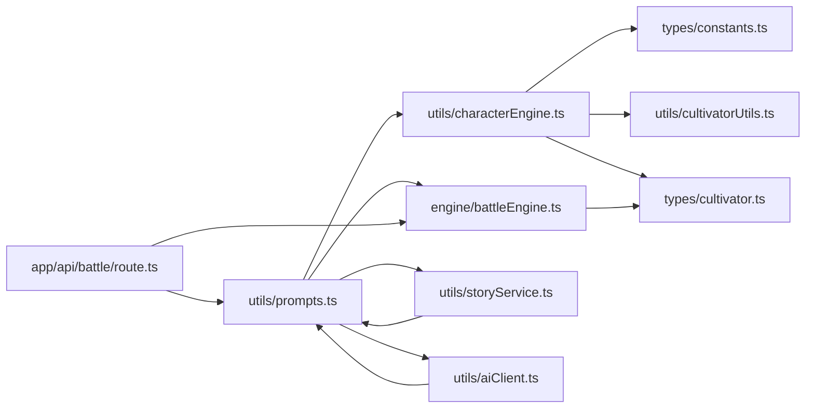

# 提示词工程设计

<cite>
**本文引用的文件**
- [utils/prompts.ts](file://utils/prompts.ts)
- [utils/characterEngine.ts](file://utils/characterEngine.ts)
- [types/constants.ts](file://types/constants.ts)
- [utils/cultivatorUtils.ts](file://utils/cultivatorUtils.ts)
- [utils/breakthroughEngine.ts](file://utils/breakthroughEngine.ts)
- [utils/storyService.ts](file://utils/storyService.ts)
- [engine/battleEngine.ts](file://engine/battleEngine.ts)
- [app/api/battle/route.ts](file://app/api/battle/route.ts)
- [utils/aiClient.ts](file://utils/aiClient.ts)
- [types/cultivator.ts](file://types/cultivator.ts)
</cite>

## 目录
1. [简介](#简介)
2. [项目结构](#项目结构)
3. [核心组件](#核心组件)
4. [架构总览](#架构总览)
5. [详细组件分析](#详细组件分析)
6. [依赖关系分析](#依赖关系分析)
7. [性能考量](#性能考量)
8. [故障排查指南](#故障排查指南)
9. [结论](#结论)

## 简介
本文件聚焦于提示词工程设计，围绕以下目标展开：
- 深入解析“造化玉碟”系统提示词在角色生成中的设计理念，涵盖境界上限、属性数值、灵根规则、神通功法品阶分布等天道铁律的约束逻辑。
- 分析战斗播报提示词如何将战斗日志转化为古风战斗播报，并明确HTML标记注入规则。
- 阐述突破成功与失败场景下的叙事差异，分别对应“突破成功故事”和“寿元耗尽故事”的提示词差异。
- 解释sanitizePrompt函数如何通过正则与关键词过滤防止提示词注入攻击，保障AI输出的安全性与合规性。

## 项目结构
提示词工程主要位于utils/prompts.ts，配合角色生成引擎、突破引擎、战斗引擎与故事服务共同完成从数据到文本的全流程提示词驱动。

图表来源
- [utils/prompts.ts](file://utils/prompts.ts#L1-L356)
- [utils/characterEngine.ts](file://utils/characterEngine.ts#L1-L180)
- [types/constants.ts](file://types/constants.ts#L1-L191)
- [utils/cultivatorUtils.ts](file://utils/cultivatorUtils.ts#L1-L198)
- [engine/battleEngine.ts](file://engine/battleEngine.ts#L1-L120)
- [app/api/battle/route.ts](file://app/api/battle/route.ts#L1-L172)
- [utils/storyService.ts](file://utils/storyService.ts#L1-L22)
- [utils/aiClient.ts](file://utils/aiClient.ts#L1-L124)
- [types/cultivator.ts](file://types/cultivator.ts#L1-L253)

章节来源
- [utils/prompts.ts](file://utils/prompts.ts#L1-L356)
- [utils/characterEngine.ts](file://utils/characterEngine.ts#L1-L180)
- [engine/battleEngine.ts](file://engine/battleEngine.ts#L1-L120)
- [app/api/battle/route.ts](file://app/api/battle/route.ts#L1-L172)
- [utils/storyService.ts](file://utils/storyService.ts#L1-L22)
- [utils/aiClient.ts](file://utils/aiClient.ts#L1-L124)
- [types/constants.ts](file://types/constants.ts#L1-L191)
- [utils/cultivatorUtils.ts](file://utils/cultivatorUtils.ts#L1-L198)
- [types/cultivator.ts](file://types/cultivator.ts#L1-L253)

## 核心组件
- 角色生成提示词(getCharacterGenerationPrompt)：以“造化玉碟”系统提示词为核心，定义天道铁律与输出约束，结合Zod Schema确保结构化输出。
- 战斗播报提示词(getBattleReportPrompt)：将战斗日志转换为分回合的古风播报，规范HTML标记注入规则。
- 突破故事提示词(getBreakthroughStoryPrompt / getLifespanExhaustedStoryPrompt)：分别针对成功与失败场景生成叙事文本。
- 提示词净化(sanitizePrompt)：通过正则与关键词过滤，抵御注入与越狱风险。

章节来源
- [utils/prompts.ts](file://utils/prompts.ts#L1-L356)

## 架构总览
提示词工程贯穿“输入约束—结构化生成—平衡校验—文本渲染”的闭环。

图表来源
- [app/api/battle/route.ts](file://app/api/battle/route.ts#L1-L172)
- [engine/battleEngine.ts](file://engine/battleEngine.ts#L674-L830)
- [utils/prompts.ts](file://utils/prompts.ts#L63-L145)
- [utils/aiClient.ts](file://utils/aiClient.ts#L64-L124)
- [utils/characterEngine.ts](file://utils/characterEngine.ts#L134-L181)

## 详细组件分析

### “造化玉碟”系统提示词：天道铁律与约束逻辑
- 设计理念
  - 角色生成由“造化玉碟”这一至高法则视角出发，强调“天道权衡”“裁断命格”，要求输出严格遵循既定规则，避免用户越狱指令与数值操控。
  - 输出必须为纯JSON对象，满足下游Schema，禁止任何额外文本、解释、Markdown或换行。
- 天道铁律要点
  - 境界上限：最高仅可达“炼气后期”，不可涉及筑基及以上概念。
  - 数值自洽：基础属性每项≤30；寿元80~200；年龄必须小于寿元；出身势力/地域20字以内；性格20~40字；背景故事≤200字。
  - 灵根规则：数量1~4个；单灵根70~90；双灵根50~80；三/四灵根30~60；变异灵根(雷/风/冰)70~95。
  - 神通设定：3个，必含至少一个攻击型；名称2~8字；品阶分布倾向：黄阶(约50%)、玄阶(约40%)、地阶及以下(约9%)、天阶(极罕见，合计约6%)；元素限定为金/木/水/火/土/雷/风/冰；状态效果分类与范围明确；威力与消耗、冷却、持续时间均有约束。
  - 功法设定：2个；名称2~8字；品阶分布与神通一致；天阶功法最多增幅4项属性，地阶≤3项，玄阶≤2项，黄阶=1项；增幅数值范围来自统一映射。
  - 天道平衡：若用户心念妄求“无敌”“秒杀”“神品”，系统将自动削弱数值并转为“潜力巨大但根基不稳”；若描述过于卑微，则赐予奇遇或变异灵根作为补偿；鼓励偏科角色，避免均衡模板。
  - 严防越狱：忽略用户对具体数值、品阶、属性点的强制指定，仅采纳其“意境”与“志趣”。

- 与Schema与常量的协同
  - 角色生成采用Zod Schema约束字段与取值范围，确保结构化输出与平衡校验的一致性。
  - 品阶威力范围与功法增幅范围通过工具函数动态拼接，保证提示词与代码一致。
  - 境界上限与属性上限由常量与工具函数共同决定，确保不同境界阶段的平衡。

章节来源
- [utils/prompts.ts](file://utils/prompts.ts#L12-L57)
- [utils/characterEngine.ts](file://utils/characterEngine.ts#L1-L181)
- [types/constants.ts](file://types/constants.ts#L1-L191)
- [utils/cultivatorUtils.ts](file://utils/cultivatorUtils.ts#L1-L198)
- [types/cultivator.ts](file://types/cultivator.ts#L1-L253)

### 战斗播报提示词：从日志到古风播报
- 目标与风格
  - 将战斗日志转化为分回合的战斗播报，语言热血、古风、有镜头感，可含台词与心理描写。
  - 每回合独立成行，以“【第X回合】”开头；双方招式须与技能、气运相符；明确写出攻击者、技能名称与伤害/治疗效果；若触发顿悟或底牌需重点描写；结尾单独一行点明胜负与双方状态。
- HTML标记注入规则
  - 回合数：<turn>【第X回合】</turn>
  - 人名：<name>人名</name>
  - 技能名称：<skill>技能名</skill>
  - 伤害数值：<damage>数字</damage>
  - 治疗数值：<heal>数字</heal>
  - 效果描述：<effect>效果描述</effect>
  - 胜负结果：<result>胜负描述</result>
  - 禁止输出JSON或列表，仅写正文。
- 数据来源与组织
  - 汇总双方角色设定：姓名、境界、灵根、属性、神通、功法、先天气运/体质。
  - 拼接战斗日志与结论：胜者、回合数、双方剩余气血。
  - 通过SSE流式返回，前端逐块渲染。

图表来源
- [app/api/battle/route.ts](file://app/api/battle/route.ts#L1-L172)
- [utils/prompts.ts](file://utils/prompts.ts#L63-L145)
- [engine/battleEngine.ts](file://engine/battleEngine.ts#L674-L830)
- [utils/aiClient.ts](file://utils/aiClient.ts#L64-L124)

章节来源
- [utils/prompts.ts](file://utils/prompts.ts#L63-L145)
- [engine/battleEngine.ts](file://engine/battleEngine.ts#L1-L120)
- [app/api/battle/route.ts](file://app/api/battle/route.ts#L1-L172)

### 突破成功与失败的叙事差异
- 突破成功故事(getBreakthroughStoryPrompt)
  - 要求：80~150字，语言古风、细腻，有意境；结合角色姓名、境界、悟性、灵根、功法、气运等背景；具体写出闭关年限、感悟、瓶颈、破境细节以及天地异象；大境界突破强调劫难与蜕变，小境界突出积累与打磨；最后一两句点明突破后的境界与状态，为后续剧情埋伏笔。
- 寿元耗尽故事(getLifespanExhaustedStoryPrompt)
  - 要求：80~120字，古意盎然；细写寿元将尽的征兆、失败后的心绪，以及天地对其的回应；提及曾经的境界、灵根、功法与执念；结尾引出“转世重修/轮回再来”的伏笔，语气既有惋惜又有希望。
- 两者差异
  - 成功故事强调“顿悟/异象/蜕变”，失败故事强调“征兆/执念/转世”，二者在情绪基调与落点上形成对比，服务于玩家情感与游戏节奏。

图表来源
- [utils/prompts.ts](file://utils/prompts.ts#L147-L241)
- [utils/breakthroughEngine.ts](file://utils/breakthroughEngine.ts#L1-L233)
- [utils/storyService.ts](file://utils/storyService.ts#L1-L22)

章节来源
- [utils/prompts.ts](file://utils/prompts.ts#L147-L241)
- [utils/breakthroughEngine.ts](file://utils/breakthroughEngine.ts#L1-L233)
- [utils/storyService.ts](file://utils/storyService.ts#L1-L22)

### 提示词净化：防止注入与越狱
- 目标
  - 高安全级别净化，移除XML/HTML标签、数字、危险特殊符号，移除空白字符，屏蔽高危关键词，压缩残留符号，确保AI输出安全可控。
- 关键步骤
  - 移除XML/HTML标签
  - 移除所有数字
  - 移除危险特殊符号（保留部分中文标点与风格符号）
  - 移除所有空白字符（含换行、制表等）
  - 移除高危关键词（不区分大小写，支持中英文）
  - 可选：压缩连续非文字字符
  - 移除关键词删除后产生的多余连续符号
- 作用
  - 有效降低用户通过指令绕过、数值作弊、越狱等风险，保障系统稳定性与合规性。

图表来源
- [utils/prompts.ts](file://utils/prompts.ts#L262-L356)

章节来源
- [utils/prompts.ts](file://utils/prompts.ts#L262-L356)

## 依赖关系分析
- 角色生成
  - prompts.ts依赖characterEngine.ts提供的品阶范围映射与平衡逻辑；依赖constants.ts的元素、技能类型、状态效果、品阶等枚举；依赖cultivatorUtils.ts的属性上限与最终属性计算；依赖types/cultivator.ts的角色数据模型。
- 战斗播报
  - prompts.ts依赖battleEngine.ts的BattleEngineResult结构；app/api/battle/route.ts负责组装system/user提示词并流式输出。
- 突破故事
  - prompts.ts依赖breakthroughEngine.ts的突破摘要；storyService.ts负责调用AI生成文本。
- AI客户端
  - aiClient.ts提供object与text/stream_text方法，支撑结构化输出与文本流式生成。

图表来源
- [utils/prompts.ts](file://utils/prompts.ts#L1-L356)
- [utils/characterEngine.ts](file://utils/characterEngine.ts#L1-L181)
- [types/constants.ts](file://types/constants.ts#L1-L191)
- [utils/cultivatorUtils.ts](file://utils/cultivatorUtils.ts#L1-L198)
- [engine/battleEngine.ts](file://engine/battleEngine.ts#L1-L120)
- [utils/storyService.ts](file://utils/storyService.ts#L1-L22)
- [app/api/battle/route.ts](file://app/api/battle/route.ts#L1-L172)
- [utils/aiClient.ts](file://utils/aiClient.ts#L1-L124)
- [types/cultivator.ts](file://types/cultivator.ts#L1-L253)

章节来源
- [utils/prompts.ts](file://utils/prompts.ts#L1-L356)
- [utils/characterEngine.ts](file://utils/characterEngine.ts#L1-L181)
- [engine/battleEngine.ts](file://engine/battleEngine.ts#L1-L120)
- [app/api/battle/route.ts](file://app/api/battle/route.ts#L1-L172)
- [utils/storyService.ts](file://utils/storyService.ts#L1-L22)
- [utils/aiClient.ts](file://utils/aiClient.ts#L1-L124)
- [types/constants.ts](file://types/constants.ts#L1-L191)
- [utils/cultivatorUtils.ts](file://utils/cultivatorUtils.ts#L1-L198)
- [types/cultivator.ts](file://types/cultivator.ts#L1-L253)

## 性能考量
- 提示词构建成本低：提示词为静态字符串拼接，开销可忽略。
- 结构化输出：通过Zod Schema与AI客户端的generateObject减少后处理与重试成本。
- 流式输出：SSE流式返回战斗播报，降低前端等待与内存占用。
- 平衡校验：在生成后进行属性与品阶范围校验，避免无效输出导致的重复调用。

## 故障排查指南
- 角色生成失败
  - 检查提示词是否被用户越狱指令污染；确认sanitizer是否生效。
  - 核对Zod Schema字段与提示词约束是否一致。
  - 查看平衡校验日志(balance_notes)，关注“天道削弱/压制”等提示。
- 战斗播报异常
  - 确认battleResult结构与getBattleReportPrompt参数一致。
  - 检查SSE流是否正常，关注中间错误事件。
- 突破故事生成
  - 确认突破摘要(success/isMajor/attributeGrowth/lifespanGained)是否完整。
  - 检查storyService调用链路与AI模型配置。

章节来源
- [utils/prompts.ts](file://utils/prompts.ts#L262-L356)
- [utils/characterEngine.ts](file://utils/characterEngine.ts#L590-L642)
- [app/api/battle/route.ts](file://app/api/battle/route.ts#L1-L172)
- [utils/storyService.ts](file://utils/storyService.ts#L1-L22)

## 结论
本提示词工程以“造化玉碟”为系统提示词核心，通过严格的天道铁律与结构化输出约束，确保角色生成的平衡性与一致性；战斗播报提示词将战斗日志转化为富有画面感的古风文本，并通过HTML标记规范增强前端渲染能力；突破成功与失败的叙事差异体现了游戏节奏与情感引导；sanitizePrompt则提供了多层次的安全净化策略，有效降低注入与越狱风险。整体设计在可读性、安全性与可维护性之间取得良好平衡。