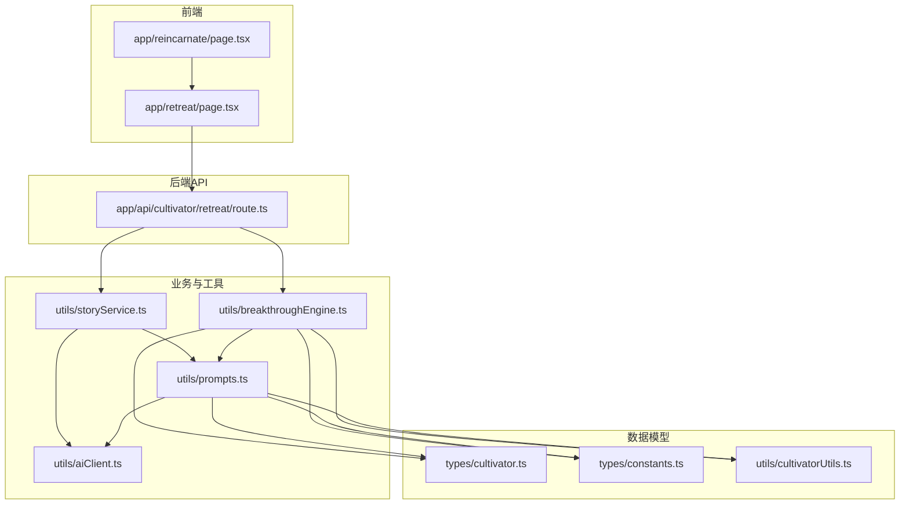
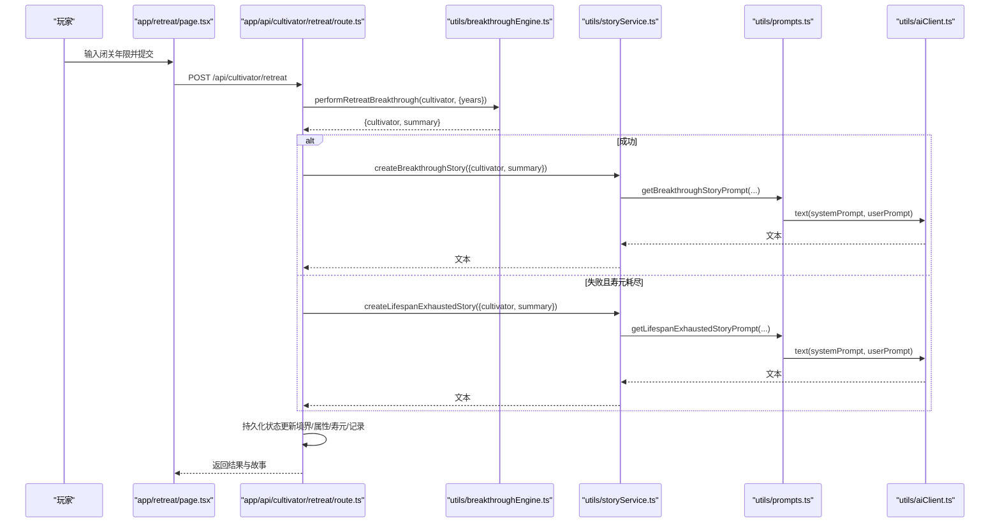
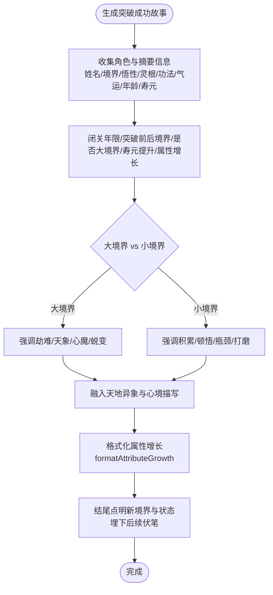
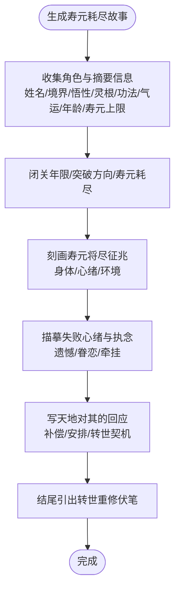
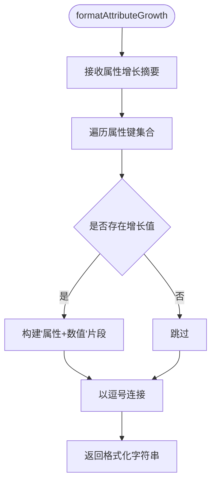
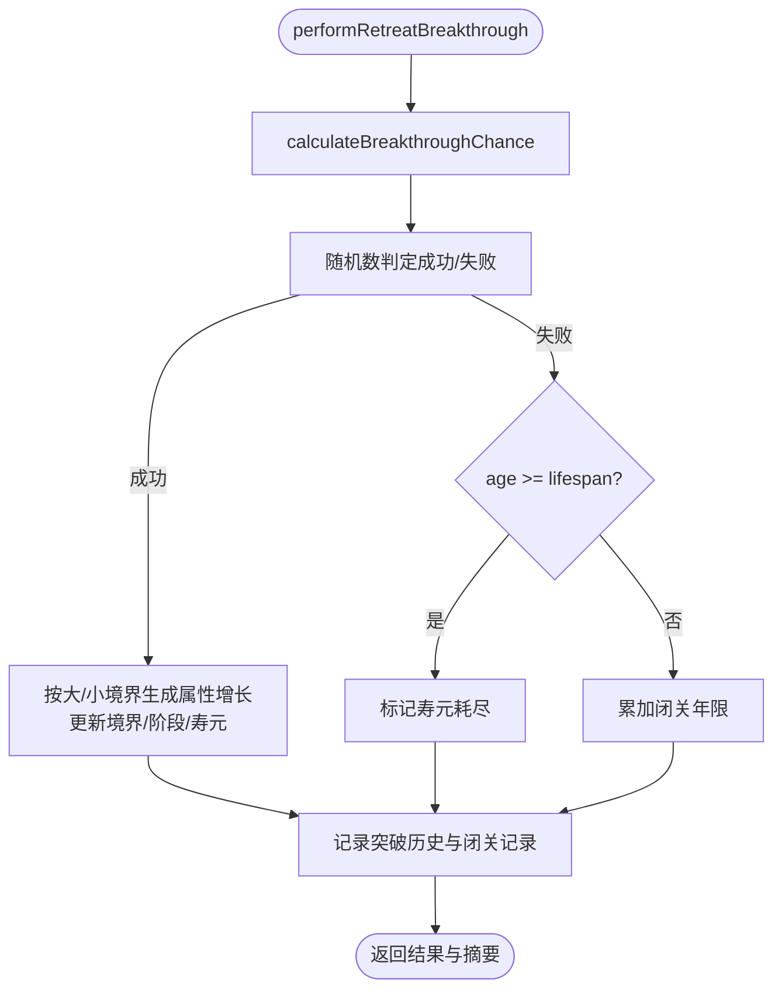
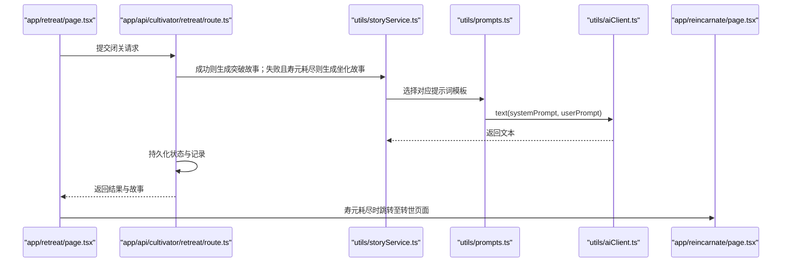
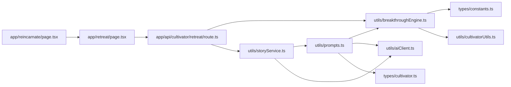

# 突破叙事提示词设计

<cite>
**本文引用的文件**
- [utils/prompts.ts](file://utils/prompts.ts)
- [utils/breakthroughEngine.ts](file://utils/breakthroughEngine.ts)
- [utils/storyService.ts](file://utils/storyService.ts)
- [app/api/cultivator/retreat/route.ts](file://app/api/cultivator/retreat/route.ts)
- [app/retreat/page.tsx](file://app/retreat/page.tsx)
- [app/reincarnate/page.tsx](file://app/reincarnate/page.tsx)
- [utils/aiClient.ts](file://utils/aiClient.ts)
- [types/constants.ts](file://types/constants.ts)
- [types/cultivator.ts](file://types/cultivator.ts)
- [utils/cultivatorUtils.ts](file://utils/cultivatorUtils.ts)
- [tupo.md](file://tupo.md)
</cite>

## 目录
1. [简介](#简介)
2. [项目结构](#项目结构)
3. [核心组件](#核心组件)
4. [架构总览](#架构总览)
5. [详细组件分析](#详细组件分析)
6. [依赖关系分析](#依赖关系分析)
7. [性能考量](#性能考量)
8. [故障排查指南](#故障排查指南)
9. [结论](#结论)
10. [附录](#附录)

## 简介
本文件聚焦于两类突破叙事提示词的设计与实现：成功突破的“突破成功故事提示词”与失败寿元耗尽的“寿元耗尽故事提示词”。文档将对比二者在不同场景下的叙事策略差异，阐明对闭关年限、感悟瓶颈、天地异象、属性增幅的描写要求，以及大境界与小境界突破的文风区分；同时解析失败时对寿元征兆、修士心绪、执念未了的氛围营造技巧，并说明如何通过角色灵根、功法、气运等背景信息生成个性化叙事。最后强调formatAttributeGrowth工具函数在属性增幅格式化中的作用，并强调两类提示词均需为后续剧情埋下伏笔，引导玩家进行转世重修操作。

## 项目结构
围绕突破叙事与生成，系统的关键文件与职责如下：
- utils/prompts.ts：定义两类提示词模板与属性格式化函数，负责将角色与突破摘要转化为可被AI理解的系统提示与用户提示。
- utils/breakthroughEngine.ts：实现闭关与突破的核心算法，包括成功率计算、属性增长、寿元与境界变更、失败判定等。
- utils/storyService.ts：封装两类故事生成的调用，屏蔽AI客户端细节。
- app/api/cultivator/retreat/route.ts：后端API，执行闭关突破、生成故事、持久化结果与状态。
- app/retreat/page.tsx：前端闭关界面，收集闭关年限、预览成功率、展示结果与故事。
- app/reincarnate/page.tsx：转世重修页面，承接坐化故事并引导玩家重新创建角色。
- utils/aiClient.ts：统一的AI文本与结构化输出客户端。
- types/constants.ts、types/cultivator.ts、utils/cultivatorUtils.ts：支撑数据模型与属性上限、计算等基础能力。
- tupo.md：系统改造方案概览，包含突破机制、数值与平衡建议、前后端对接思路。

图表来源
- [app/retreat/page.tsx](file://app/retreat/page.tsx#L1-L218)
- [app/api/cultivator/retreat/route.ts](file://app/api/cultivator/retreat/route.ts#L1-L179)
- [utils/breakthroughEngine.ts](file://utils/breakthroughEngine.ts#L1-L342)
- [utils/prompts.ts](file://utils/prompts.ts#L1-L356)
- [utils/storyService.ts](file://utils/storyService.ts#L1-L22)
- [utils/aiClient.ts](file://utils/aiClient.ts#L1-L211)
- [types/cultivator.ts](file://types/cultivator.ts#L1-L253)
- [types/constants.ts](file://types/constants.ts#L1-L191)
- [utils/cultivatorUtils.ts](file://utils/cultivatorUtils.ts#L1-L198)

章节来源
- [tupo.md](file://tupo.md#L1-L153)

## 核心组件
- getBreakthroughStoryPrompt：面向“突破成功”的短篇故事生成，要求结合闭关年限、感悟瓶颈、破境细节与天地异象，区分大/小境界文风，并在结尾点明新境界与状态，为后续剧情埋下伏笔。
- getLifespanExhaustedStoryPrompt：面向“寿元耗尽、突破失败”的坐化场景，要求细致刻画寿元将尽征兆、失败心绪与天地回应，结尾引出“转世重修/轮回再来”的伏笔，语气既惋惜又有希望。
- formatAttributeGrowth：将属性增长摘要格式化为“属性+数值”的简洁字符串，便于提示词注入与前端展示。
- 突破算法与数据：breakthroughEngine负责计算成功率、属性增长、寿元与境界变更、失败判定；prompts.ts据此生成两类提示词；storyService封装AI调用；API路由整合流程并持久化状态。

章节来源
- [utils/prompts.ts](file://utils/prompts.ts#L147-L260)
- [utils/breakthroughEngine.ts](file://utils/breakthroughEngine.ts#L49-L233)
- [utils/storyService.ts](file://utils/storyService.ts#L1-L22)
- [app/api/cultivator/retreat/route.ts](file://app/api/cultivator/retreat/route.ts#L1-L179)

## 架构总览
下面的序列图展示了从用户发起闭关到生成两类故事并持久化的完整流程：

图表来源
- [app/retreat/page.tsx](file://app/retreat/page.tsx#L91-L141)
- [app/api/cultivator/retreat/route.ts](file://app/api/cultivator/retreat/route.ts#L82-L150)
- [utils/breakthroughEngine.ts](file://utils/breakthroughEngine.ts#L119-L233)
- [utils/storyService.ts](file://utils/storyService.ts#L9-L21)
- [utils/prompts.ts](file://utils/prompts.ts#L152-L241)
- [utils/aiClient.ts](file://utils/aiClient.ts#L42-L62)

## 详细组件分析

### 突破成功故事提示词（getBreakthroughStoryPrompt）
- 描写要求
  - 字数与风格：80~150字，古风、细腻、有意境。
  - 背景要素：姓名、境界、悟性、灵根、功法、气运、年龄与寿元。
  - 突破细节：闭关年限、从哪一境界/阶段突破到哪一境界/阶段、是否大境界突破、寿元提升、基础属性增幅。
  - 天地异象：需结合破境细节与境界层次，大境界强调劫难与蜕变，小境界强调积累与打磨。
  - 结尾：点明突破后的境界与状态，为后续剧情埋下伏笔。
- 文风区分
  - 大境界突破：更强调劫难、天象异变、心魔与蜕变，语言更具史诗感与画面感。
  - 小境界突破：更强调积累、顿悟、瓶颈突破与日常打磨，语言更内敛、细腻。
- 个性化叙事
  - 灵根：可体现元素特性与强度，影响突破路径与异象表现。
  - 功法：可暗示突破契机或契合的道韵。
  - 气运：可作为“天道垂怜”或“机缘巧合”的铺垫。
- 属性增幅格式化
  - formatAttributeGrowth将属性增长映射为“属性+数值”的字符串，便于提示词注入与前端展示。

图表来源
- [utils/prompts.ts](file://utils/prompts.ts#L152-L197)
- [utils/prompts.ts](file://utils/prompts.ts#L243-L260)

章节来源
- [utils/prompts.ts](file://utils/prompts.ts#L152-L197)
- [utils/prompts.ts](file://utils/prompts.ts#L243-L260)

### 寿元耗尽故事提示词（getLifespanExhaustedStoryPrompt）
- 描写要求
  - 字数与风格：80~120字，古意盎然。
  - 失败要素：寿元将尽征兆、失败后的心绪、天地对其的回应。
  - 背景要素：曾经的境界、灵根、功法与执念。
  - 结尾：引出“转世重修/轮回再来”的伏笔，语气既有惋惜又有希望。
- 氛围营造技巧
  - 征兆：可从身体、心绪、环境三方面入手，体现油尽灯枯的状态。
  - 心绪：可写对未竟道业的遗憾、对红尘的眷恋、对传承的挂念。
  - 执念：可点出未了心愿或对某人/某物的牵挂，为转世动机提供理由。
  - 天地回应：可写天道对“未尽之志”的某种补偿或安排，使转世成为希望而非绝望。
- 个性化叙事
  - 灵根、功法、气运可作为“前世余荫”的线索，为转世重修提供合理解释。

图表来源
- [utils/prompts.ts](file://utils/prompts.ts#L199-L241)

章节来源
- [utils/prompts.ts](file://utils/prompts.ts#L199-L241)

### 属性增幅格式化（formatAttributeGrowth）
- 作用：将属性增长摘要映射为“属性+数值”的字符串，便于提示词注入与前端展示。
- 实现要点：
  - 遍历属性键集合，过滤掉未增长的属性。
  - 将存在的增长值拼接为“属性+数值”的形式，以逗号分隔。
- 适用场景：
  - 突破成功故事提示词中直接注入“基础属性增幅”。
  - 前端展示“属性收获”时使用。

图表来源
- [utils/prompts.ts](file://utils/prompts.ts#L243-L260)

章节来源
- [utils/prompts.ts](file://utils/prompts.ts#L243-L260)

### 突破算法与数据流（breakthroughEngine）
- 成功概率与判定
  - 计算基础成功率、悟性修正、闭关年限修正、失败连败修正、突破难度修正，综合得出成功率。
  - 若成功，更新境界与阶段，按大/小境界规则决定是否增加寿元，并按悟性与境界差生成属性增长。
  - 若失败，根据年龄与寿元判断是否“寿元耗尽”，并记录闭关年限。
- 属性增长机制
  - 小境界突破：通常不提升悟性，其他属性按上限差与悟性修正生成增长区间。
  - 大境界突破：可能提升悟性，增长幅度更大，且伴随寿元奖励（进阶各大境界时）。
- 闭关年限与失败连败
  - 闭关年限越多，成功率越高，但收益呈递减。
  - 失败连败会带来成功率修正，鼓励玩家调整策略或延长闭关。

图表来源
- [utils/breakthroughEngine.ts](file://utils/breakthroughEngine.ts#L82-L233)

章节来源
- [utils/breakthroughEngine.ts](file://utils/breakthroughEngine.ts#L49-L233)

### 前后端集成与转世流程
- 前端闭关页面
  - 输入闭关年限，预览成功率，提交后调用API。
  - 成功：展示突破结果与故事；失败且寿元耗尽：提供“转世重修”按钮。
- 后端API
  - 执行闭关突破，生成两类故事之一，持久化状态（更新境界、属性、寿元、记录），并将故事写入突破历史。
- 转世重修页面
  - 展示坐化故事与角色生平，提供“以新身入道”按钮，引导玩家重新创建角色。

图表来源
- [app/retreat/page.tsx](file://app/retreat/page.tsx#L127-L141)
- [app/api/cultivator/retreat/route.ts](file://app/api/cultivator/retreat/route.ts#L82-L150)
- [utils/storyService.ts](file://utils/storyService.ts#L9-L21)
- [utils/prompts.ts](file://utils/prompts.ts#L152-L241)
- [utils/aiClient.ts](file://utils/aiClient.ts#L42-L62)
- [app/reincarnate/page.tsx](file://app/reincarnate/page.tsx#L1-L96)

章节来源
- [app/retreat/page.tsx](file://app/retreat/page.tsx#L91-L141)
- [app/api/cultivator/retreat/route.ts](file://app/api/cultivator/retreat/route.ts#L82-L150)
- [app/reincarnate/page.tsx](file://app/reincarnate/page.tsx#L1-L96)

## 依赖关系分析
- 提示词依赖
  - getBreakthroughStoryPrompt/getLifespanExhaustedStoryPrompt依赖角色与突破摘要（境界、阶段、属性增长、寿元、闭关年限等）。
  - formatAttributeGrowth依赖属性增长摘要。
- 突破算法依赖
  - breakthroughEngine依赖常量与属性上限、悟性、闭关年限、失败连败等参数。
- 前后端依赖
  - API路由依赖突破算法与故事服务；前端依赖API返回结果与故事文本。

图表来源
- [utils/prompts.ts](file://utils/prompts.ts#L147-L260)
- [utils/breakthroughEngine.ts](file://utils/breakthroughEngine.ts#L1-L342)
- [utils/storyService.ts](file://utils/storyService.ts#L1-L22)
- [utils/aiClient.ts](file://utils/aiClient.ts#L1-L211)
- [app/api/cultivator/retreat/route.ts](file://app/api/cultivator/retreat/route.ts#L1-L179)
- [app/retreat/page.tsx](file://app/retreat/page.tsx#L1-L218)
- [app/reincarnate/page.tsx](file://app/reincarnate/page.tsx#L1-L96)
- [types/constants.ts](file://types/constants.ts#L1-L191)
- [types/cultivator.ts](file://types/cultivator.ts#L1-L253)
- [utils/cultivatorUtils.ts](file://utils/cultivatorUtils.ts#L1-L198)

章节来源
- [utils/prompts.ts](file://utils/prompts.ts#L147-L260)
- [utils/breakthroughEngine.ts](file://utils/breakthroughEngine.ts#L1-L342)
- [app/api/cultivator/retreat/route.ts](file://app/api/cultivator/retreat/route.ts#L1-L179)

## 性能考量
- 提示词生成成本
  - 两类提示词均为短文本生成，调用AI文本接口成本可控；建议在前端预估成功率时避免频繁触发AI调用。
- 突破算法复杂度
  - 突破概率与属性增长计算为O(1)，不构成性能瓶颈；注意闭关年限过大时的递减收益与失败连败修正的叠加。
- 前后端交互
  - API路由中对冷却时间、寿元检查与记录持久化为必要约束，避免高频请求带来的压力。

[本节为一般性指导，无需特定文件引用]

## 故障排查指南
- 生成失败
  - 若生成突破或坐化故事失败，API会记录警告并继续保存角色状态；前端toast提示错误信息。
- 闭关失败
  - 若寿元不足或冷却时间未到，API会返回相应错误；前端toast提示并阻止提交。
- 转世重修
  - 坐化后前端会将故事与角色信息写入sessionStorage，转世页面优先读取本地上下文；若为空则通过服务端接口获取。

章节来源
- [app/api/cultivator/retreat/route.ts](file://app/api/cultivator/retreat/route.ts#L45-L81)
- [app/api/cultivator/retreat/route.ts](file://app/api/cultivator/retreat/route.ts#L105-L115)
- [app/retreat/page.tsx](file://app/retreat/page.tsx#L127-L141)
- [app/reincarnate/page.tsx](file://app/reincarnate/page.tsx#L15-L59)

## 结论
两类提示词分别服务于“突破成功”与“寿元耗尽”的叙事目标：前者强调大/小境界的文风差异与天地异象，后者聚焦失败心绪与执念未了的悲怆氛围。通过角色背景（灵根、功法、气运）与突破摘要（闭关年限、属性增长、寿元变化）的有机融合，提示词能够生成个性化且富有画面感的故事。formatAttributeGrowth确保属性增长信息以统一格式注入与展示。最终，两类提示词均以“为后续剧情埋下伏笔”为目标，成功突破引导玩家继续修行，寿元耗尽则自然导向转世重修，形成闭环。

[本节为总结性内容，无需特定文件引用]

## 附录
- 设计要点速览
  - 成功突破：强调破境细节、天地异象、大/小境界文风区分，结尾点明新境界与状态，为后续剧情埋伏笔。
  - 寿元耗尽：刻画征兆、心绪与执念，结尾引出转世重修伏笔，语气惋惜中有希望。
  - 属性增长：使用formatAttributeGrowth统一格式，便于注入与展示。
  - 数据与算法：基于悟性、闭关年限、失败连败与境界差的综合修正，确保可玩性与平衡性。

[本节为补充说明，无需特定文件引用]