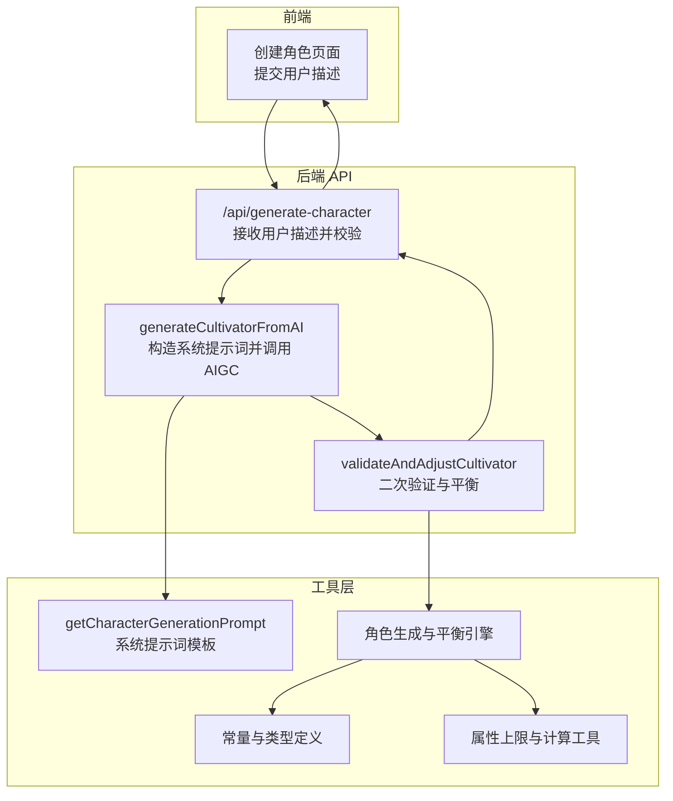
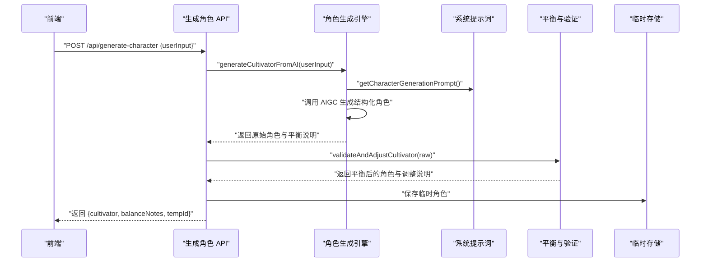
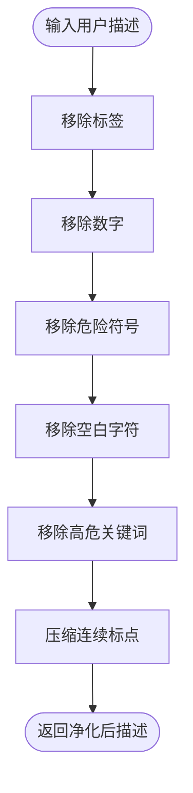
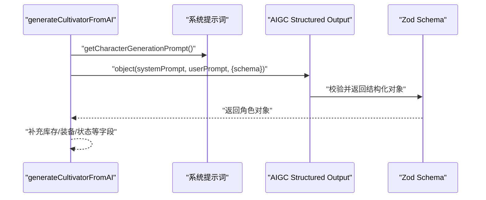
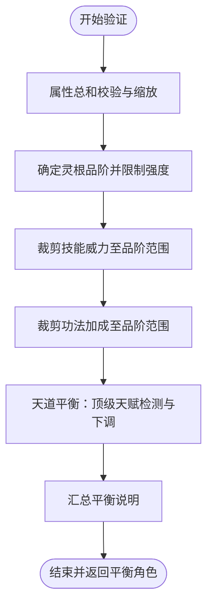
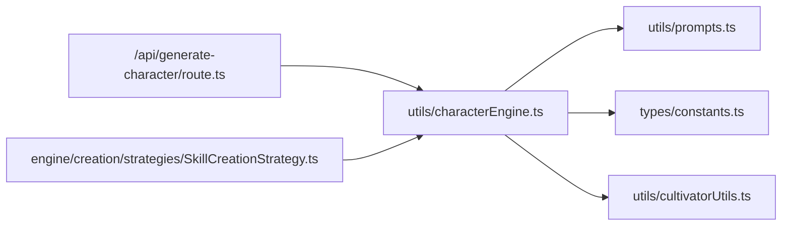

# 角色生成提示词设计

<cite>
**本文引用的文件**
- [utils/prompts.ts](file://utils/prompts.ts)
- [utils/characterEngine.ts](file://utils/characterEngine.ts)
- [types/constants.ts](file://types/constants.ts)
- [types/cultivator.ts](file://types/cultivator.ts)
- [utils/cultivatorUtils.ts](file://utils/cultivatorUtils.ts)
- [app/api/generate-character/route.ts](file://app/api/generate-character/route.ts)
- [engine/creation/strategies/SkillCreationStrategy.ts](file://engine/creation/strategies/SkillCreationStrategy.ts)
</cite>

## 目录
1. [简介](#简介)
2. [项目结构](#项目结构)
3. [核心组件](#核心组件)
4. [架构总览](#架构总览)
5. [详细组件分析](#详细组件分析)
6. [依赖关系分析](#依赖关系分析)
7. [性能考量](#性能考量)
8. [故障排查指南](#故障排查指南)
9. [结论](#结论)
10. [附录](#附录)

## 简介
本文件聚焦于“造化玉碟”系统提示词在角色生成中的设计理念与落地实现，系统性解析以下关键约束与平衡逻辑：
- 境界上限：炼气后期封顶，避免筑基及以上直接出现
- 属性数值：基础属性每项上限、总和上限、年龄与寿元关系
- 灵根规则：数量与强度区间、灵根品阶判定
- 神通与功法品阶分布：黄阶为主、玄阶次之、地阶及以下较少、天阶极罕见
- 动态注入：通过 getAllCultivationBonusRangePrompt 与 getAllSkillPowerRangePrompt 将数值范围注入系统提示词
- 安全与可控：用户输入预处理与“严防越狱”策略，仅采纳意境与志趣
- 实际生成对比：展示合规输出与越狱尝试的差异

## 项目结构
角色生成流程由前端发起请求，后端 API 调用 AIGC 生成角色，随后通过角色生成引擎进行二次验证与平衡调整，最终返回给前端。

图表来源
- [app/api/generate-character/route.ts](file://app/api/generate-character/route.ts#L1-L79)
- [utils/characterEngine.ts](file://utils/characterEngine.ts#L134-L181)
- [utils/prompts.ts](file://utils/prompts.ts#L12-L56)
- [types/constants.ts](file://types/constants.ts#L54-L83)
- [utils/cultivatorUtils.ts](file://utils/cultivatorUtils.ts#L15-L32)

章节来源
- [app/api/generate-character/route.ts](file://app/api/generate-character/route.ts#L1-L79)

## 核心组件
- 系统提示词模板：getCharacterGenerationPrompt，定义“造化玉碟”的天道铁律、数值范围、品阶分布、输出格式与平衡说明
- 角色生成引擎：generateCultivatorFromAI，将系统提示词与用户输入拼装后调用 AIGC，得到结构化角色数据
- 角色验证与平衡：validateAndAdjustCultivator，执行属性总和限制、灵根强度与品阶判定、技能/功法数值与品阶一致性校验与下调
- 境界上限与属性上限：通过 REALM_STAGE_CAPS 与 getRealmStageAttributeCap 计算属性上限
- 动态注入：getAllCultivationBonusRangePrompt 与 getAllSkillPowerRangePrompt 将品阶范围注入系统提示词
- 用户输入预处理：sanitizePrompt，移除数字、危险符号、空白字符与作弊关键词，仅保留意境与志趣

章节来源
- [utils/prompts.ts](file://utils/prompts.ts#L12-L56)
- [utils/characterEngine.ts](file://utils/characterEngine.ts#L134-L181)
- [utils/characterEngine.ts](file://utils/characterEngine.ts#L193-L642)
- [types/constants.ts](file://types/constants.ts#L54-L83)
- [utils/cultivatorUtils.ts](file://utils/cultivatorUtils.ts#L15-L32)
- [utils/prompts.ts](file://utils/prompts.ts#L262-L355)

## 架构总览
系统提示词作为“造化玉碟”的权威约束，贯穿角色生成的“生成—校验—平衡—输出”全流程，确保可控性与游戏平衡性。

图表来源
- [app/api/generate-character/route.ts](file://app/api/generate-character/route.ts#L13-L78)
- [utils/characterEngine.ts](file://utils/characterEngine.ts#L134-L181)
- [utils/characterEngine.ts](file://utils/characterEngine.ts#L590-L642)
- [utils/prompts.ts](file://utils/prompts.ts#L12-L56)

## 详细组件分析

### 系统提示词模板：getCharacterGenerationPrompt
- 设计理念
  - “造化玉碟”作为天道化身，负责裁断命格，一切须合天理、循道韵，不得逾矩
  - 明确“严守境界上限”“数值自洽”“灵根规则”“神通与功法设定”“天道平衡”“严防越狱”等七条天道铁律
  - 输出格式与平衡说明字段约束，确保下游解析稳定
- 关键约束
  - 境界上限：炼气后期封顶，不可涉及筑基及以上
  - 属性上限：每项基础属性≤30，年龄<寿元，寿元80~200
  - 灵根：数量1~4个；单灵根强度70~90、双灵根50~80、三/四灵根30~60、变异灵根70~95
  - 神通：3个，必含至少一个攻击型；品阶倾向：黄阶≈50%、玄阶≈40%、地阶及以下≈9%、天阶≈6%
  - 功法：2个，品阶分布与神通一致；天阶功法最多增幅4项属性，地阶≤3项，玄阶≤2项，黄阶=1项
  - 天道平衡：针对“无敌”“秒杀”“神品”等越狱倾向进行削弱；对卑微描述给予补偿
  - 严防越狱：忽略用户对具体数值、品阶、属性点的强制指定，仅采纳意境与志趣
- 动态注入
  - 通过 getAllSkillPowerRangePrompt 注入技能威力范围
  - 通过 getAllCultivationBonusRangePrompt 注入功法属性加成范围
- 输出格式与平衡说明
  - 严格要求返回纯 JSON 对象，字段齐全
  - balance_notes 字段用于说明调整缘由（≤120字）

章节来源
- [utils/prompts.ts](file://utils/prompts.ts#L12-L56)

### 用户输入预处理：sanitizePrompt
- 目标：防止越狱与作弊指令，确保系统提示词的权威性
- 处理流程
  - 移除 XML/HTML 标签
  - 移除所有数字
  - 移除危险特殊符号（保留修仙常用标点）
  - 移除所有空白字符
  - 移除高危关键词（不区分大小写，覆盖中文与英文）
  - 压缩连续标点，避免残留组合
- 设计要点
  - 仅保留“意境”与“志趣”，屏蔽数值与品阶强制指令
  - 通过关键词过滤与符号清理，降低越狱风险

图表来源
- [utils/prompts.ts](file://utils/prompts.ts#L262-L355)

章节来源
- [utils/prompts.ts](file://utils/prompts.ts#L262-L355)

### 角色生成引擎：generateCultivatorFromAI
- 流程
  - 生成系统提示词与用户提示词
  - 调用 AIGC（Structured Output）生成符合 Schema 的角色对象
  - 补充库存、装备、状态等字段，返回原始角色与平衡说明
- Schema 约束
  - 姓名长度、性别、出身、性格、背景故事长度
  - 境界固定为“炼气”，阶段枚举
  - 属性范围：每项1~30
  - 灵根数量1~4，强度0~95
  - 功法2个，技能2~3个（后端平衡阶段会补足到3个）
  - 年龄≥10且<寿元，寿元80~200
  - balance_notes 字段存在且长度受限

图表来源
- [utils/characterEngine.ts](file://utils/characterEngine.ts#L134-L181)
- [types/cultivator.ts](file://types/cultivator.ts#L218-L252)

章节来源
- [utils/characterEngine.ts](file://utils/characterEngine.ts#L134-L181)
- [types/cultivator.ts](file://types/cultivator.ts#L218-L252)

### 角色验证与平衡：validateAndAdjustCultivator
- 属性总和限制
  - 基于 REALM_STAGE_CAPS 计算属性上限，按比例缩放属性总和至上限的80%
  - 若总和过高，统一降低，确保平衡
- 灵根强度与品阶
  - 单灵根→天灵根（70~90），双灵根→真灵根（50~80），三/四灵根→伪灵根（30~60）
  - 变异灵根（雷/风/冰）→天灵根（70~95）
- 技能威力与功法加成
  - 按品阶范围裁剪技能威力与功法加成
  - 当存在“顶级天赋”（天阶技能/功法或极高属性）时，进行系统性下调
- 天道平衡
  - 顶级天赋≥2项：对最高属性进行百分比削减
  - 天阶技能≥1且不平衡：将天阶技能下调一级
  - 天阶功法≥1且不平衡：将天阶功法下调一级
- 输出
  - 返回平衡后的角色与多条平衡说明

图表来源
- [utils/characterEngine.ts](file://utils/characterEngine.ts#L272-L325)
- [utils/characterEngine.ts](file://utils/characterEngine.ts#L327-L376)
- [utils/characterEngine.ts](file://utils/characterEngine.ts#L378-L403)
- [utils/characterEngine.ts](file://utils/characterEngine.ts#L404-L458)
- [utils/characterEngine.ts](file://utils/characterEngine.ts#L469-L577)
- [utils/characterEngine.ts](file://utils/characterEngine.ts#L590-L642)

章节来源
- [utils/characterEngine.ts](file://utils/characterEngine.ts#L272-L325)
- [utils/characterEngine.ts](file://utils/characterEngine.ts#L327-L376)
- [utils/characterEngine.ts](file://utils/characterEngine.ts#L378-L403)
- [utils/characterEngine.ts](file://utils/characterEngine.ts#L404-L458)
- [utils/characterEngine.ts](file://utils/characterEngine.ts#L469-L577)
- [utils/characterEngine.ts](file://utils/characterEngine.ts#L590-L642)

### 境界上限与属性上限：REALM_STAGE_CAPS 与 getRealmStageAttributeCap
- 境界上限
  - 系统提示词中明确“炼气后期”为最高境界
  - 角色生成引擎中提供 limitRealmToFoundation，将高于“筑基”的角色降级为“筑基后期”
- 属性上限
  - 通过 REALM_STAGE_CAPS 获取各境界阶段上限
  - getRealmStageAttributeCap 计算单属性上限，用于属性总和与平衡裁剪

章节来源
- [utils/prompts.ts](file://utils/prompts.ts#L15-L17)
- [utils/characterEngine.ts](file://utils/characterEngine.ts#L255-L270)
- [types/constants.ts](file://types/constants.ts#L54-L83)
- [utils/cultivatorUtils.ts](file://utils/cultivatorUtils.ts#L15-L32)

### 动态注入：getAllCultivationBonusRangePrompt 与 getAllSkillPowerRangePrompt
- 功能
  - 将功法属性加成范围与技能威力范围以“品阶：最小-最大”的形式注入系统提示词
- 价值
  - 使 AI 在生成时具备明确的数值边界，减少越界与不平衡
  - 与角色生成引擎的裁剪逻辑形成“提示词约束+后端裁剪”的双重保障

章节来源
- [utils/characterEngine.ts](file://utils/characterEngine.ts#L212-L221)
- [utils/characterEngine.ts](file://utils/characterEngine.ts#L247-L253)
- [utils/prompts.ts](file://utils/prompts.ts#L35-L41)

### 品阶分布与规则：技能/功法品阶倾向
- 神通与功法品阶倾向
  - 黄阶≈50%、玄阶≈40%、地阶及以下≈9%、天阶≈6%
- 限制
  - 天阶功法最多增幅4项属性，地阶≤3项，玄阶≤2项，黄阶=1项
- 与平衡的关系
  - 当出现多个天阶技能/功法或极高属性时，系统会进行下调与削弱，维持整体平衡

章节来源
- [utils/prompts.ts](file://utils/prompts.ts#L26-L41)
- [utils/characterEngine.ts](file://utils/characterEngine.ts#L469-L577)

### 实际生成案例对比（概念性说明）
- 合规输出
  - 用户描述强调“意境”与“志趣”，系统提示词严格约束数值与品阶
  - 生成角色符合炼气后期、属性每项≤30、年龄<寿元、灵根数量与强度在区间内
  - 神通/功法品阶分布符合倾向，且无越狱倾向
- 越狱尝试
  - 用户试图强制指定具体数值、品阶或“无敌”“秒杀”等关键词
  - sanitizePrompt 会移除数字、危险符号与关键词，仅保留意境与志趣
  - 系统提示词仍会进行数值裁剪与平衡下调，确保输出可控

[本节为概念性说明，不直接分析具体文件，故不附“章节来源”]

## 依赖关系分析
- 角色生成 API 依赖角色生成引擎与系统提示词
- 角色生成引擎依赖常量与类型定义、属性上限工具
- 角色验证与平衡依赖常量与类型定义、属性上限工具
- 神通创建策略依赖 getAllSkillPowerRangePrompt，用于 Zod Schema 的描述

图表来源
- [app/api/generate-character/route.ts](file://app/api/generate-character/route.ts#L13-L78)
- [utils/characterEngine.ts](file://utils/characterEngine.ts#L134-L181)
- [utils/prompts.ts](file://utils/prompts.ts#L12-L56)
- [types/constants.ts](file://types/constants.ts#L54-L83)
- [utils/cultivatorUtils.ts](file://utils/cultivatorUtils.ts#L15-L32)
- [engine/creation/strategies/SkillCreationStrategy.ts](file://engine/creation/strategies/SkillCreationStrategy.ts#L1-L35)

章节来源
- [engine/creation/strategies/SkillCreationStrategy.ts](file://engine/creation/strategies/SkillCreationStrategy.ts#L1-L35)

## 性能考量
- AIGC Structured Output 的调用成本较高，建议在前端做好加载态与错误兜底
- 角色验证与平衡逻辑为纯计算，复杂度低，可在 API 层快速完成
- sanitizePrompt 的正则替换与关键词过滤为 O(n)，在用户输入较短时开销可忽略
- 建议对频繁调用的提示词注入方法进行缓存，避免重复构建字符串

[本节为通用建议，不直接分析具体文件，故不附“章节来源”]

## 故障排查指南
- 生成失败或字段缺失
  - 检查系统提示词是否正确注入了数值范围与平衡说明
  - 确认 AIGC Structured Output 的 Schema 是否与提示词一致
- 数值越界或品阶不符
  - 查看 validateAndAdjustCultivator 的裁剪逻辑与平衡说明
  - 确认 REALM_STAGE_CAPS 与 getRealmStageAttributeCap 的使用是否正确
- 越狱尝试导致输出异常
  - 检查 sanitizePrompt 的关键词过滤是否生效
  - 确认系统提示词中的“严防越狱”是否被严格执行

章节来源
- [utils/characterEngine.ts](file://utils/characterEngine.ts#L590-L642)
- [utils/prompts.ts](file://utils/prompts.ts#L262-L355)

## 结论
“造化玉碟”系统提示词通过明确的天道铁律与动态数值注入，为角色生成提供了可控的边界；角色生成引擎与平衡机制则在生成后进行二次验证与下调，确保数值与品阶分布符合游戏平衡。用户输入预处理进一步强化了系统的安全性，使 AI 仅采纳意境与志趣，从而实现可控性与趣味性的统一。

[本节为总结性内容，不直接分析具体文件，故不附“章节来源”]

## 附录
- 常用路径参考
  - 系统提示词模板：[utils/prompts.ts](file://utils/prompts.ts#L12-L56)
  - 用户输入预处理：[utils/prompts.ts](file://utils/prompts.ts#L262-L355)
  - 角色生成引擎：[utils/characterEngine.ts](file://utils/characterEngine.ts#L134-L181)
  - 角色验证与平衡：[utils/characterEngine.ts](file://utils/characterEngine.ts#L590-L642)
  - 境界与属性上限：[types/constants.ts](file://types/constants.ts#L54-L83)、[utils/cultivatorUtils.ts](file://utils/cultivatorUtils.ts#L15-L32)
  - 动态注入范围：[utils/characterEngine.ts](file://utils/characterEngine.ts#L212-L221)、[utils/characterEngine.ts](file://utils/characterEngine.ts#L247-L253)
  - 神通创建策略（依赖注入）：[engine/creation/strategies/SkillCreationStrategy.ts](file://engine/creation/strategies/SkillCreationStrategy.ts#L1-L35)