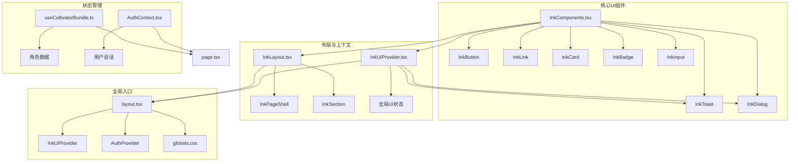
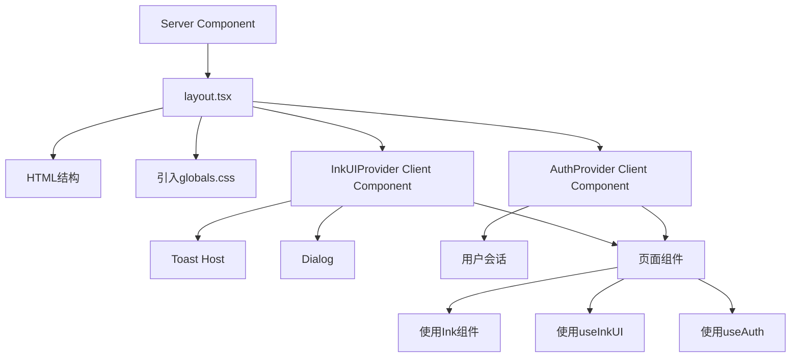
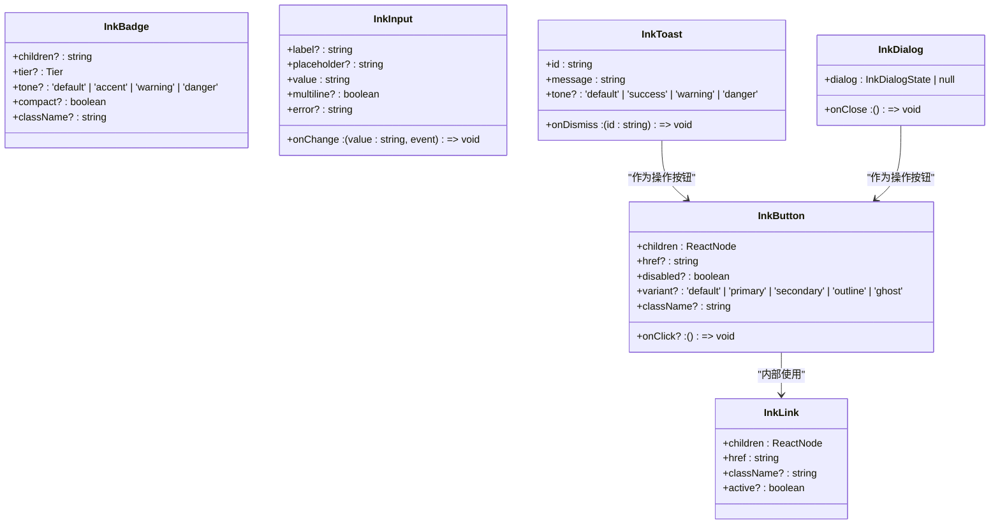
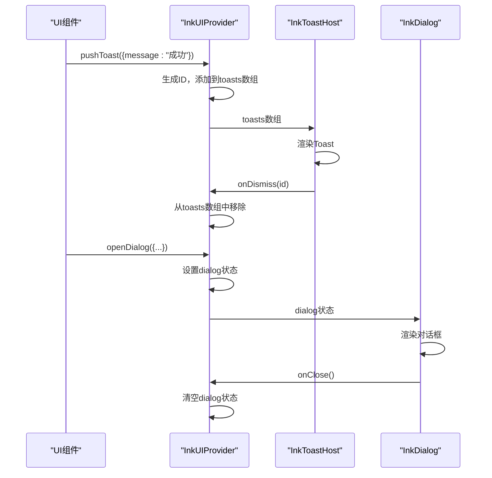
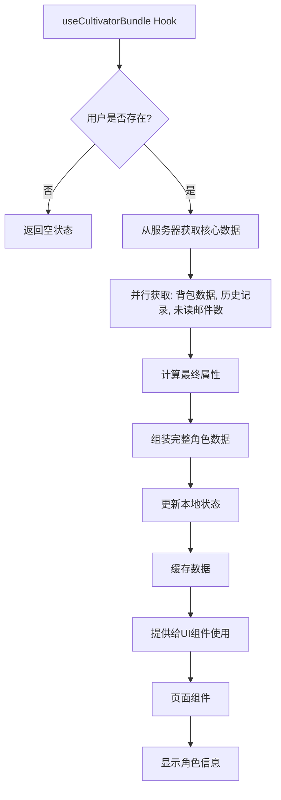
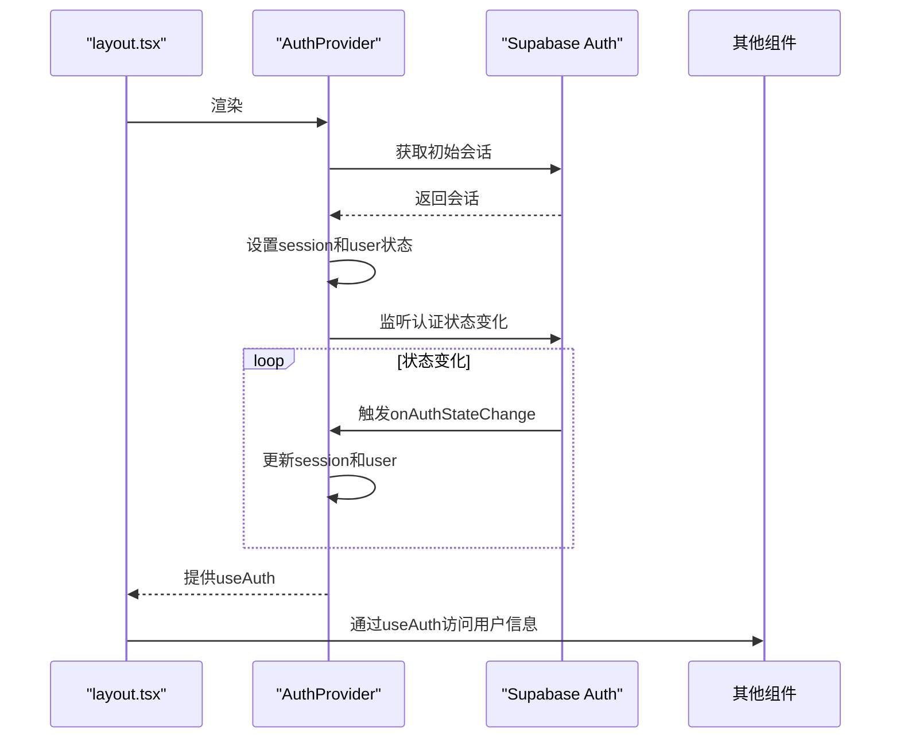
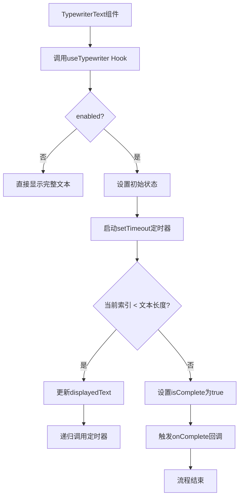
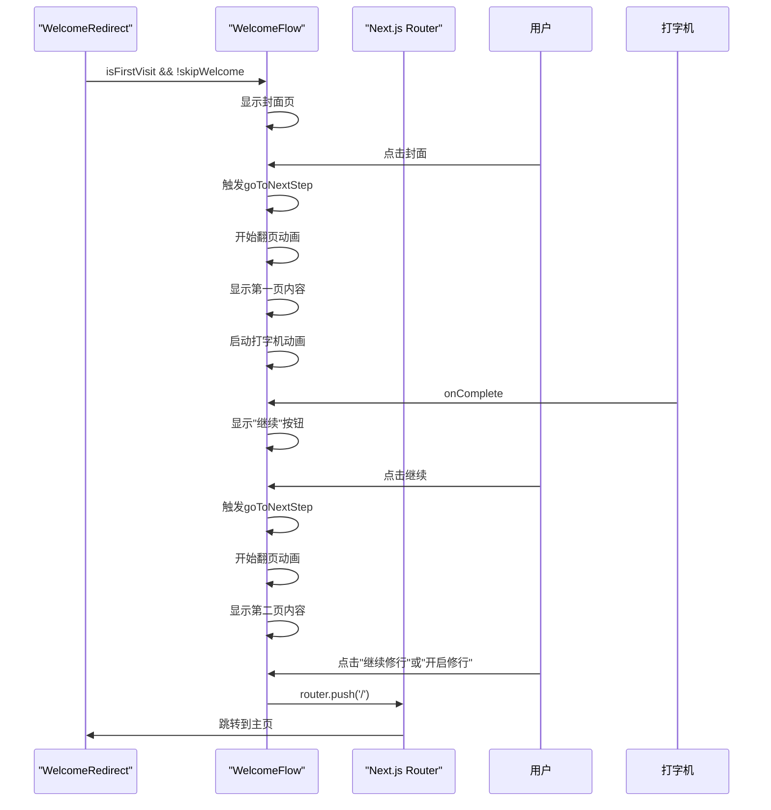
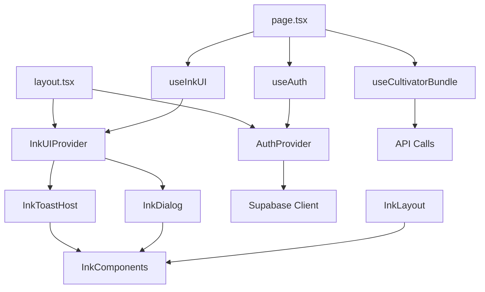

# 前端架构

<cite>
**本文档引用的文件**   
- [InkComponents.tsx](file://components/InkComponents.tsx)
- [InkModal.tsx](file://components/InkModal.tsx)
- [InkLayout.tsx](file://components/InkLayout.tsx)
- [InkUIProvider.tsx](file://components/InkUIProvider.tsx)
- [AuthContext.tsx](file://lib/auth/AuthContext.tsx)
- [useTypewriter.ts](file://lib/hooks/useTypewriter.ts)
- [useCultivatorBundle.ts](file://lib/hooks/useCultivatorBundle.ts)
- [layout.tsx](file://app/layout.tsx)
- [globals.css](file://app/globals.css)
- [page.tsx](file://app/page.tsx)
- [WelcomeFlow.tsx](file://components/welcome/WelcomeFlow.tsx)
- [TypewriterText.tsx](file://components/welcome/TypewriterText.tsx)
- [WelcomeRedirect.tsx](file://components/welcome/WelcomeRedirect.tsx)
- [useWelcomeStatus.ts](file://lib/hooks/useWelcomeStatus.ts)
</cite>

## 目录
1. [简介](#简介)
2. [项目结构](#项目结构)
3. [核心组件](#核心组件)
4. [架构概览](#架构概览)
5. [详细组件分析](#详细组件分析)
6. [依赖分析](#依赖分析)
7. [性能考虑](#性能考虑)
8. [故障排除指南](#故障排除指南)
9. [结论](#结论)

## 简介
本文档旨在深入解析《万界道友》游戏的前端架构，重点阐述其独特的修仙风格UI体系。文档将详细描述基于Ink系列组件构建的UI层设计模式与实现，涵盖React Server Components与Client Components的混合使用策略、状态管理方案以及Tailwind CSS的样式规范与响应式设计实践。通过本指南，UI开发者将能够全面理解架构设计，并高效地进行组件开发与维护。

## 项目结构
项目采用Next.js App Router架构，核心前端代码组织清晰，遵循功能模块化原则。UI组件主要集中在`components`目录下，其中`InkComponents.tsx`、`InkModal.tsx`、`InkLayout.tsx`和`InkUIProvider.tsx`构成了修仙风格UI体系的核心。状态管理逻辑（如`useCultivatorBundle`）和认证上下文（`AuthContext`）位于`lib`目录。全局样式和布局定义在`app`目录的`globals.css`和`layout.tsx`中。这种结构确保了代码的高内聚与低耦合，便于维护和扩展。

**Diagram sources**
- [InkComponents.tsx](file://components/InkComponents.tsx)
- [InkLayout.tsx](file://components/InkLayout.tsx)
- [InkUIProvider.tsx](file://components/InkUIProvider.tsx)
- [AuthContext.tsx](file://lib/auth/AuthContext.tsx)
- [useCultivatorBundle.ts](file://lib/hooks/useCultivatorBundle.ts)
- [layout.tsx](file://app/layout.tsx)

**Section sources**
- [InkComponents.tsx](file://components/InkComponents.tsx)
- [InkLayout.tsx](file://components/InkLayout.tsx)
- [InkUIProvider.tsx](file://components/InkUIProvider.tsx)
- [AuthContext.tsx](file://lib/auth/AuthContext.tsx)
- [useCultivatorBundle.ts](file://lib/hooks/useCultivatorBundle.ts)
- [layout.tsx](file://app/layout.tsx)
- [globals.css](file://app/globals.css)

## 核心组件
核心组件围绕Ink系列构建，形成了一套完整的修仙风格UI体系。`InkComponents.tsx`提供了基础的UI元素，如`InkButton`（文字化按钮）、`InkBadge`（品阶徽记）和`InkStatusBar`（状态条），这些组件通过方括号`[]`和特殊符号（如`☯`）营造出浓厚的修仙氛围。`InkModal.tsx`实现了模态框，支持ESC键关闭和背景滚动锁定。`InkLayout.tsx`中的`InkPageShell`为页面提供了统一的壳结构，包含标题、操作区和底部导航。`InkUIProvider.tsx`则通过React Context为整个应用提供全局的Toast和Dialog服务，实现了UI状态的集中管理。

**Section sources**
- [InkComponents.tsx](file://components/InkComponents.tsx)
- [InkModal.tsx](file://components/InkModal.tsx)
- [InkLayout.tsx](file://components/InkLayout.tsx)
- [InkUIProvider.tsx](file://components/InkUIProvider.tsx)

## 架构概览
整个前端架构以Next.js的App Router为基础，采用混合渲染策略。`app/layout.tsx`作为服务器组件，负责定义全局的HTML结构和引入全局样式，它包裹了所有页面。在此布局内，`InkUIProvider`和`AuthProvider`作为客户端组件被引入，为子组件提供必要的上下文。页面组件（如`app/page.tsx`）根据需要混合使用服务器和客户端组件逻辑。这种架构充分利用了服务器组件的性能优势（如数据获取）和客户端组件的交互能力，同时通过`InkUIProvider`和`AuthContext`等Context实现了跨组件的状态共享。

**Diagram sources**
- [layout.tsx](file://app/layout.tsx)
- [InkUIProvider.tsx](file://components/InkUIProvider.tsx)
- [AuthContext.tsx](file://lib/auth/AuthContext.tsx)
- [page.tsx](file://app/page.tsx)

## 详细组件分析

### Ink系列组件分析
Ink系列组件是构建修仙风格UI的基石，它们通过极简的视觉设计和独特的交互语义，实现了“文字化”的界面风格。

#### InkComponents类图

**Diagram sources**
- [InkComponents.tsx](file://components/InkComponents.tsx)

#### InkUIProvider状态管理流程

**Diagram sources**
- [InkUIProvider.tsx](file://components/InkUIProvider.tsx)
- [InkToastHost.tsx](file://components/InkComponents.tsx#L536-L553)
- [InkDialog.tsx](file://components/InkComponents.tsx#L558-L621)

### 状态管理方案分析
应用的状态管理采用React Context与自定义Hook相结合的策略，实现了高效且可维护的数据流。

#### useCultivatorBundle数据流

**Diagram sources**
- [useCultivatorBundle.ts](file://lib/hooks/useCultivatorBundle.ts)

#### AuthContext认证流程

**Diagram sources**
- [layout.tsx](file://app/layout.tsx)
- [AuthContext.tsx](file://lib/auth/AuthContext.tsx)

### 修仙风格UI实现分析
修仙风格的UI通过`useTypewriter`自定义Hook和`WelcomeFlow`组件协同工作来实现，为用户提供了沉浸式的开场体验。

#### 打字机效果实现流程

**Diagram sources**
- [useTypewriter.ts](file://lib/hooks/useTypewriter.ts)
- [TypewriterText.tsx](file://components/welcome/TypewriterText.tsx)

#### 欢迎流程交互

**Diagram sources**
- [WelcomeRedirect.tsx](file://components/welcome/WelcomeRedirect.tsx)
- [WelcomeFlow.tsx](file://components/welcome/WelcomeFlow.tsx)
- [useWelcomeStatus.ts](file://lib/hooks/useWelcomeStatus.ts)

**Section sources**
- [InkComponents.tsx](file://components/InkComponents.tsx)
- [InkModal.tsx](file://components/InkModal.tsx)
- [InkLayout.tsx](file://components/InkLayout.tsx)
- [InkUIProvider.tsx](file://components/InkUIProvider.tsx)
- [AuthContext.tsx](file://lib/auth/AuthContext.tsx)
- [useTypewriter.ts](file://lib/hooks/useTypewriter.ts)
- [useCultivatorBundle.ts](file://lib/hooks/useCultivatorBundle.ts)
- [page.tsx](file://app/page.tsx)
- [WelcomeFlow.tsx](file://components/welcome/WelcomeFlow.tsx)
- [TypewriterText.tsx](file://components/welcome/TypewriterText.tsx)
- [WelcomeRedirect.tsx](file://components/welcome/WelcomeRedirect.tsx)
- [useWelcomeStatus.ts](file://lib/hooks/useWelcomeStatus.ts)

## 依赖分析
项目的前端依赖关系清晰，形成了一个稳固的架构。`layout.tsx`作为顶层入口，依赖`InkUIProvider`和`AuthProvider`来提供全局上下文。`InkUIProvider`依赖`InkComponents`中的`InkToastHost`和`InkDialog`来渲染UI。`InkLayout`组件直接依赖`InkComponents`来构建页面结构。各个页面组件（如`page.tsx`）则依赖`useCultivatorBundle`、`useAuth`和`useInkUI`等自定义Hook来获取数据和触发UI交互。这种依赖关系确保了组件的高度复用性和逻辑的清晰分离。

**Diagram sources**
- [layout.tsx](file://app/layout.tsx)
- [InkUIProvider.tsx](file://components/InkUIProvider.tsx)
- [InkLayout.tsx](file://components/InkLayout.tsx)
- [page.tsx](file://app/page.tsx)
- [useCultivatorBundle.ts](file://lib/hooks/useCultivatorBundle.ts)
- [AuthContext.tsx](file://lib/auth/AuthContext.tsx)

**Section sources**
- [layout.tsx](file://app/layout.tsx)
- [InkUIProvider.tsx](file://components/InkUIProvider.tsx)
- [InkLayout.tsx](file://components/InkLayout.tsx)
- [page.tsx](file://app/page.tsx)
- [useCultivatorBundle.ts](file://lib/hooks/useCultivatorBundle.ts)
- [AuthContext.tsx](file://lib/auth/AuthContext.tsx)

## 性能考虑
该架构在性能方面做了多项优化。首先，通过服务器组件`layout.tsx`减少了客户端的JavaScript包体积。其次，`useCultivatorBundle`采用了模块级缓存（`cachedData`），在用户切换页面时避免了不必要的重复数据请求，显著提升了用户体验。`useTypewriter` Hook使用`setTimeout`而非`requestAnimationFrame`，逻辑更精简，性能开销更小。此外，`InkUIProvider`通过`useCallback`和`useMemo`对函数和值进行缓存，防止了不必要的子组件重渲染。这些优化共同确保了应用的流畅运行。

## 故障排除指南
当遇到UI相关问题时，可参考以下指南进行排查：
1.  **组件未渲染**：检查组件是否被正确导入，并确认其是否被放置在`'use client'`指令的客户端组件中。
2.  **Context报错**：如遇`useInkUI must be used within InkUIProvider`或`useAuth must be used within an AuthProvider`错误，请确保相关组件被包裹在`InkUIProvider`和`AuthProvider`内，通常在`layout.tsx`中完成。
3.  **数据未更新**：若`useCultivatorBundle`返回的数据未及时更新，检查API端点是否正常工作，并确认`refresh`函数是否被正确调用。
4.  **样式丢失**：确保`globals.css`已被正确引入，并检查Tailwind CSS的类名是否拼写正确。
5.  **欢迎页不显示**：检查`localStorage`中`wanjiedaoyou_welcome_status`的值，确认`isFirstVisit`和`skipWelcome`的状态是否符合预期。

**Section sources**
- [InkUIProvider.tsx](file://components/InkUIProvider.tsx#L75-L81)
- [AuthContext.tsx](file://lib/auth/AuthContext.tsx#L127-L133)
- [useCultivatorBundle.ts](file://lib/hooks/useCultivatorBundle.ts)
- [useWelcomeStatus.ts](file://lib/hooks/useWelcomeStatus.ts)

## 结论
《万界道友》的前端架构设计精良，成功构建了一个独特且一致的修仙风格UI体系。通过Ink系列组件，实现了“文字化”的视觉语言，极大地增强了游戏的沉浸感。React Server Components与Client Components的混合使用策略平衡了性能与交互性。状态管理方案通过React Context和自定义Hook的结合，既保证了数据流的清晰，又提供了良好的开发体验。Tailwind CSS的深度集成使得样式开发高效且一致。整体架构清晰、可维护性强，为未来的功能扩展奠定了坚实的基础。UI开发者应遵循此架构模式，以确保新功能与现有系统风格的统一。