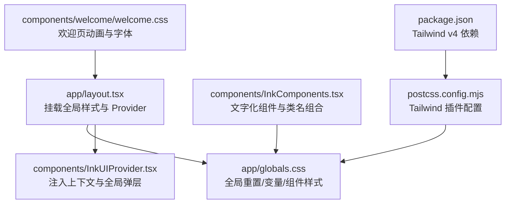
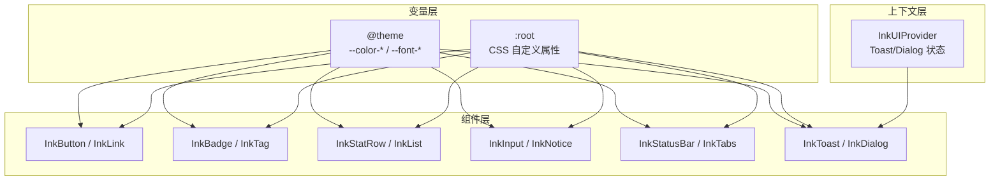
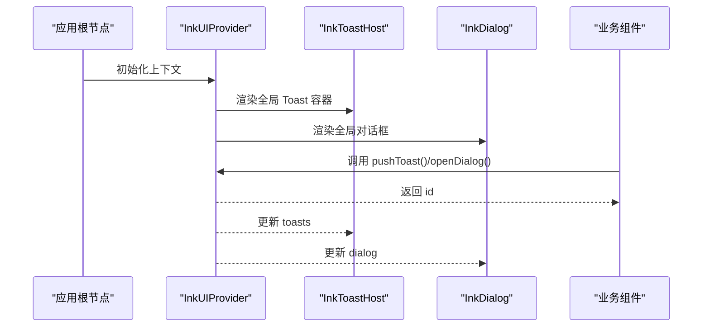
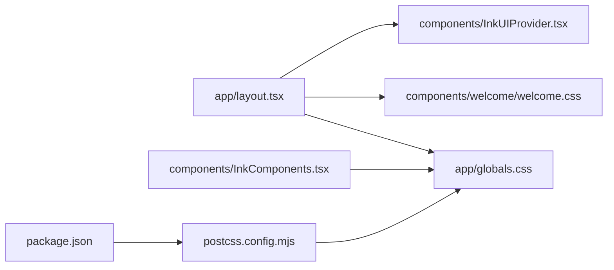

# 样式规范

<cite>
**本文引用的文件**
- [app/globals.css](file://app/globals.css)
- [components/welcome/welcome.css](file://components/welcome/welcome.css)
- [components/InkComponents.tsx](file://components/InkComponents.tsx)
- [components/InkUIProvider.tsx](file://components/InkUIProvider.tsx)
- [components/InkLayout.tsx](file://components/InkLayout.tsx)
- [app/layout.tsx](file://app/layout.tsx)
- [postcss.config.mjs](file://postcss.config.mjs)
- [package.json](file://package.json)
</cite>

## 目录
1. [引言](#引言)
2. [项目结构](#项目结构)
3. [核心组件](#核心组件)
4. [架构总览](#架构总览)
5. [详细组件分析](#详细组件分析)
6. [依赖关系分析](#依赖关系分析)
7. [性能考量](#性能考量)
8. [故障排查指南](#故障排查指南)
9. [结论](#结论)
10. [附录](#附录)

## 引言
本文件聚焦于样式系统的设计与实现，重点说明以下方面：
- Tailwind CSS 与自定义 CSS 的协同工作模式
- globals.css 中的全局样式重置与修仙主题变量
- welcome.css 中的特定动画与字体样式
- InkComponents.tsx 如何通过 Tailwind 实用类与自定义 ink-* 类名构建一致的视觉语言
- InkUIProvider 如何注入主题配置与动态样式上下文
- CSS 变量在主题切换中的应用方式
- 通过 BEM 或类似命名规范避免样式冲突
- 组件样式扩展与定制指南，确保新功能保持视觉统一性

## 项目结构
样式体系由三层构成：
- 应用级全局样式：app/globals.css 定义字体、颜色、间距、基础组件样式与响应式规则
- 主题与变量：通过 CSS 自定义属性与 @theme 声明集中管理主题变量
- 组件级样式：InkComponents.tsx 通过组合 ink-* 类名与 Tailwind 实用类实现一致风格；InkUIProvider 注入全局交互态（Toast、Dialog）

图表来源
- [app/layout.tsx](file://app/layout.tsx#L1-L33)
- [app/globals.css](file://app/globals.css#L1-L120)
- [components/InkUIProvider.tsx](file://components/InkUIProvider.tsx#L1-L82)
- [components/InkComponents.tsx](file://components/InkComponents.tsx#L1-L120)
- [components/welcome/welcome.css](file://components/welcome/welcome.css#L1-L60)
- [postcss.config.mjs](file://postcss.config.mjs#L1-L8)
- [package.json](file://package.json#L1-L54)

章节来源
- [app/layout.tsx](file://app/layout.tsx#L1-L33)
- [postcss.config.mjs](file://postcss.config.mjs#L1-L8)
- [package.json](file://package.json#L1-L54)

## 核心组件
- 全局样式与主题变量
  - 在 app/globals.css 中使用 @theme 声明主题变量，并在 :root 中提供 CSS 自定义属性，使 Tailwind 与自定义类共享同一套设计令牌
  - 通过 --color-*、--font-*、--ink-gap-*、--ink-radius-* 等变量统一色彩、字体与间距
- 文字化组件库
  - InkComponents.tsx 将语义化的组件封装为“文字化”风格，结合 ink-* 类名与 Tailwind 实用类，形成一致的视觉语言
  - 例如 InkButton、InkLink、InkBadge、InkTag、InkStatRow、InkList、InkInput、InkNotice、InkStatusBar、InkToast、InkDialog、InkTabs 等
- 动态样式上下文
  - InkUIProvider.tsx 通过 React Context 管理 Toast 与 Dialog 的全局状态，并在渲染树末尾挂载对应 UI，保证层级与交互一致性

章节来源
- [app/globals.css](file://app/globals.css#L1-L120)
- [components/InkComponents.tsx](file://components/InkComponents.tsx#L1-L120)
- [components/InkUIProvider.tsx](file://components/InkUIProvider.tsx#L1-L82)

## 架构总览
样式系统采用“变量驱动 + 组件类名 + Tailwind 实用类”的三层协作：
- 变量层：@theme 与 :root 定义主题变量，供 Tailwind 与自定义类共同消费
- 组件层：InkComponents.tsx 以 ink-* 前缀命名类，配合 Tailwind 实用类，形成稳定的视觉基线
- 上下文层：InkUIProvider.tsx 注入全局交互态，确保 Toast/Dialog 等跨组件的一致性

图表来源
- [app/globals.css](file://app/globals.css#L1-L120)
- [components/InkComponents.tsx](file://components/InkComponents.tsx#L1-L200)
- [components/InkUIProvider.tsx](file://components/InkUIProvider.tsx#L1-L82)

## 详细组件分析

### 全局样式与主题变量（globals.css）
- 字体与背景
  - 引入 LXGWWenKai 与 Ma Shan Zheng 字体，设置默认字体族与标题字体族
  - body 默认使用 --color-paper 作为背景、--color-ink 作为前景色
- 主题变量
  - @theme 声明色彩与字体变量，@theme inline 将变量映射到 --color-background/--color-foreground/--font-sans/--font-mono
  - :root 同步声明相同变量，便于直接使用 CSS var() 访问
- 组件样式基线
  - ink-button、ink-link、ink-nav、ink-divider、ink-card、ink-badge、ink-tag、ink-stat-row、ink-list、ink-input、ink-notice、ink-status-bar、ink-toast、ink-dialog 等类名定义了统一的视觉与交互行为
  - 响应式规则在移动端对字号、内边距与主内容区底部留白进行优化
- 宣纸背景与装饰
  - bg-paper、bg-paper-light、cloud-divider 等类提供修仙风格的背景与分隔线装饰

章节来源
- [app/globals.css](file://app/globals.css#L1-L120)
- [app/globals.css](file://app/globals.css#L114-L400)
- [app/globals.css](file://app/globals.css#L400-L800)

### 欢迎页动画与字体（welcome.css）
- 页面堆叠与翻页动画
  - page-stack-container、page-layer、page-static、page-flipping 与 @keyframes page-flip-turn 实现书页翻转的 3D 效果
- 淡入与竖排文字
  - animate-fade-in、writing-mode-vertical 提供页面进入与竖排阅读体验
- 封面与书页质感
  - book-cover、book-page 通过伪元素与径向渐变、线性渐变增强纸张光泽与反光
- 响应式与滚动
  - 针对移动端的字体大小与内边距调整；html 设置平滑滚动；body.welcome-active 防止背景滚动

章节来源
- [components/welcome/welcome.css](file://components/welcome/welcome.css#L1-L155)

### 文字化组件（InkComponents.tsx）
- 设计原则
  - 以 ink-* 类名承载统一视觉基线，同时通过 Tailwind 实用类微调布局、间距与颜色
  - 通过 variants（如 primary、secondary、outline、ghost、default）与 tone（如 accent、warning、danger、good、bad、info）控制语义化外观
- 关键组件
  - InkButton / InkLink：统一的方括号风格与悬停/禁用态
  - InkBadge：品阶徽记，支持紧凑、色调与品阶色板映射
  - InkTag：标签，支持轮廓与幽灵风格
  - InkStatRow：属性行，支持基础值与最终值对比
  - InkList / InkListItem：列表容器与项，支持列/行布局与高亮
  - InkInput：输入容器，支持多行与错误/提示文案
  - InkNotice：空状态/提示信息，支持多种语义色调
  - InkStatusBar：状态条，支持堆叠布局与图标/提示
  - InkToast / InkToastHost：全局 Toast 容器与消息展示
  - InkDialog：全局对话框，支持确认/取消与加载态
  - InkTabs：标签页，支持激活态与过渡
- 与 Tailwind 的协作
  - 组件内部优先使用 ink-* 类名，同时在需要时叠加 Tailwind 实用类（如边框、颜色透明度、间距、过渡等），确保一致性与可维护性

```mermaid
classDiagram
class InkButton {
+props : children, onClick, href, disabled, variant, className
+render() : JSX.Element
}
class InkLink {
+props : children, href, className, active
+render() : JSX.Element
}
class InkBadge {
+props : children, tier, tierText, tone, compact, className, hideTierText
+render() : JSX.Element
}
class InkTag {
+props : children, variant, tone, className
+render() : JSX.Element
}
class InkStatRow {
+props : label, code, base, final, detail, emphasize
+render() : JSX.Element
}
class InkList {
+props : children, dense, className
+render() : JSX.Element
}
class InkListItem {
+props : title, meta, description, actions, highlight, newMark, layout
+render() : JSX.Element
}
class InkInput {
+props : label, placeholder, value, onChange, multiline, rows, hint, error, disabled, onKeyDown
+render() : JSX.Element
}
class InkNotice {
+props : tone, className, children
+render() : JSX.Element
}
class InkStatusBar {
+props : items, stacked, className
+render() : JSX.Element
}
class InkToast {
+props : id, message, tone, actionLabel, onAction, onDismiss
+render() : JSX.Element
}
class InkDialog {
+props : dialog, onClose
+render() : JSX.Element
}
class InkTabs {
+props : items, activeValue, onChange, className
+render() : JSX.Element
}
```

图表来源
- [components/InkComponents.tsx](file://components/InkComponents.tsx#L1-L200)
- [components/InkComponents.tsx](file://components/InkComponents.tsx#L200-L420)
- [components/InkComponents.tsx](file://components/InkComponents.tsx#L420-L665)

章节来源
- [components/InkComponents.tsx](file://components/InkComponents.tsx#L1-L200)
- [components/InkComponents.tsx](file://components/InkComponents.tsx#L200-L420)
- [components/InkComponents.tsx](file://components/InkComponents.tsx#L420-L665)

### 动态样式上下文（InkUIProvider）
- 职责
  - 管理全局 Toast 与 Dialog 的状态，提供 pushToast、dismissToast、openDialog、closeDialog 方法
  - 在渲染树末尾挂载 InkToastHost 与 InkDialog，确保层级与交互一致性
- 使用方式
  - 在 app/layout.tsx 中包裹应用根节点，使所有子组件可通过 useInkUI 获取上下文能力
- 与组件的关系
  - InkToastHost 接收 toasts 数组并渲染 InkToast
  - InkDialog 接收 dialog 对象并在遮罩层中展示

图表来源
- [components/InkUIProvider.tsx](file://components/InkUIProvider.tsx#L1-L82)
- [components/InkComponents.tsx](file://components/InkComponents.tsx#L520-L620)
- [app/layout.tsx](file://app/layout.tsx#L1-L33)

章节来源
- [components/InkUIProvider.tsx](file://components/InkUIProvider.tsx#L1-L82)
- [components/InkComponents.tsx](file://components/InkComponents.tsx#L520-L620)
- [app/layout.tsx](file://app/layout.tsx#L1-L33)

### 页面壳与导航（InkLayout.tsx）
- InkPageShell
  - 提供页面标题、副标题、引导语、英雄区、返回链接、工具栏、页脚、状态栏与底部导航
  - 使用 Tailwind 实用类控制布局、间距与颜色，统一页面骨架
- InkNav
  - 基于 InkLink 构建底部导航，支持当前路径高亮

章节来源
- [components/InkLayout.tsx](file://components/InkLayout.tsx#L1-L111)
- [components/InkComponents.tsx](file://components/InkComponents.tsx#L60-L120)

## 依赖关系分析
- PostCSS 与 Tailwind
  - postcss.config.mjs 配置 @tailwindcss/postcss 插件，启用 Tailwind v4
  - package.json 明确 tailwindcss 与相关开发依赖版本
- 样式入口
  - app/layout.tsx 同时引入 app/globals.css 与 components/welcome/welcome.css，确保全局样式与欢迎页动画生效
- 组件与样式的耦合
  - InkComponents.tsx 通过 ink-* 类名与 Tailwind 实用类耦合，既保证统一性，又允许局部微调

图表来源
- [app/layout.tsx](file://app/layout.tsx#L1-L33)
- [postcss.config.mjs](file://postcss.config.mjs#L1-L8)
- [package.json](file://package.json#L1-L54)
- [app/globals.css](file://app/globals.css#L1-L120)
- [components/welcome/welcome.css](file://components/welcome/welcome.css#L1-L60)
- [components/InkComponents.tsx](file://components/InkComponents.tsx#L1-L120)

章节来源
- [postcss.config.mjs](file://postcss.config.mjs#L1-L8)
- [package.json](file://package.json#L1-L54)
- [app/layout.tsx](file://app/layout.tsx#L1-L33)

## 性能考量
- 变量复用与减少重复计算
  - 通过 @theme 与 :root 统一变量，避免在多个组件中重复声明颜色与字体
- CSS 体积控制
  - 仅在必要处引入 welcome.css，避免非欢迎页场景加载额外动画资源
- Tailwind 实用类的按需使用
  - 在 InkComponents.tsx 中优先使用 ink-* 类名，减少 Tailwind 未使用类的打包体积
- 响应式与媒体查询
  - 在 globals.css 中集中处理移动端适配，避免在组件中分散重复

[本节为通用建议，不直接分析具体文件]

## 故障排查指南
- 样式未生效
  - 检查 app/layout.tsx 是否正确引入 app/globals.css 与 components/welcome/welcome.css
  - 确认 postcss.config.mjs 已启用 @tailwindcss/postcss 插件
- 主题变量无效
  - 确认 @theme 与 :root 中的变量名称一致，且在组件中通过 var(--xxx) 使用
- 动态 Toast/Dialog 不显示
  - 确认 InkUIProvider 已包裹应用根节点，且 InkToastHost 与 InkDialog 在渲染树末尾存在
- 组件样式冲突
  - 避免在组件内直接覆盖 ink-* 类名，优先通过 className 扩展或使用 Tailwind 实用类微调
  - 采用 BEM 或类似命名规范，避免类名冲突

章节来源
- [app/layout.tsx](file://app/layout.tsx#L1-L33)
- [postcss.config.mjs](file://postcss.config.mjs#L1-L8)
- [components/InkUIProvider.tsx](file://components/InkUIProvider.tsx#L1-L82)
- [app/globals.css](file://app/globals.css#L1-L120)

## 结论
该样式系统通过“变量驱动 + 组件类名 + Tailwind 实用类”的模式，实现了统一、可扩展且易于维护的视觉体系。InkComponents.tsx 以 ink-* 前缀类名承载一致的视觉基线，同时借助 Tailwind 实用类进行局部布局与状态微调；InkUIProvider 注入全局交互态，确保 Toast 与 Dialog 的一致性。globals.css 与 welcome.css 分别承担主题变量与特定动画/字体职责，配合 PostCSS/Tailwind v4 插件，形成清晰的样式架构。

[本节为总结性内容，不直接分析具体文件]

## 附录

### CSS 变量在主题切换中的应用
- 当前实现
  - 主题变量通过 @theme 与 :root 声明，组件通过 var(--color-*) 使用
- 切换策略建议
  - 在 :root 上切换主题变量（如 --color-paper、--color-ink 等），组件自动响应
  - 若需更细粒度控制，可在父容器上设置 data-theme 属性并通过属性选择器覆盖部分变量

章节来源
- [app/globals.css](file://app/globals.css#L1-L120)

### 命名规范与冲突避免（BEM/类似）
- 命名建议
  - 基类：ink-组件名（如 ink-button、ink-badge）
  - 修饰：ink-组件名--修饰（如 ink-button--primary、ink-badge--compact）
  - 子元素：ink-组件名__子元素（如 ink-list__item、ink-stat-row__label）
- 冲突规避
  - 优先使用 ink-* 前缀，避免与第三方库类名冲突
  - 在组件内部通过 className 扩展，而非直接覆盖基类

章节来源
- [components/InkComponents.tsx](file://components/InkComponents.tsx#L1-L200)

### 组件样式扩展与定制指南
- 扩展原则
  - 优先使用 ink-* 类名作为基线，再叠加 Tailwind 实用类进行微调
  - 通过 variants 与 tones 控制语义化外观，避免新增类名破坏一致性
- 定制流程
  - 在 app/globals.css 中新增 ink-* 类名或变量，确保与现有命名规范一致
  - 在 InkComponents.tsx 中暴露 props 以控制外观（如 variant、tone、compact 等）
  - 在业务组件中通过 className 进行局部覆盖，保持最小改动

章节来源
- [app/globals.css](file://app/globals.css#L114-L400)
- [components/InkComponents.tsx](file://components/InkComponents.tsx#L1-L200)