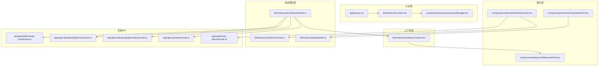
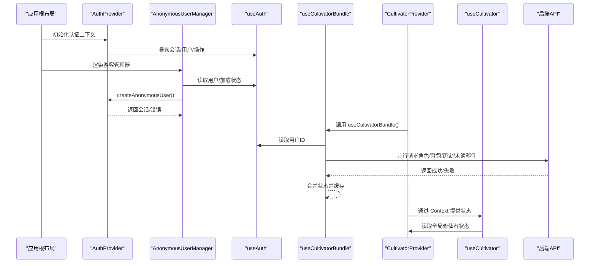
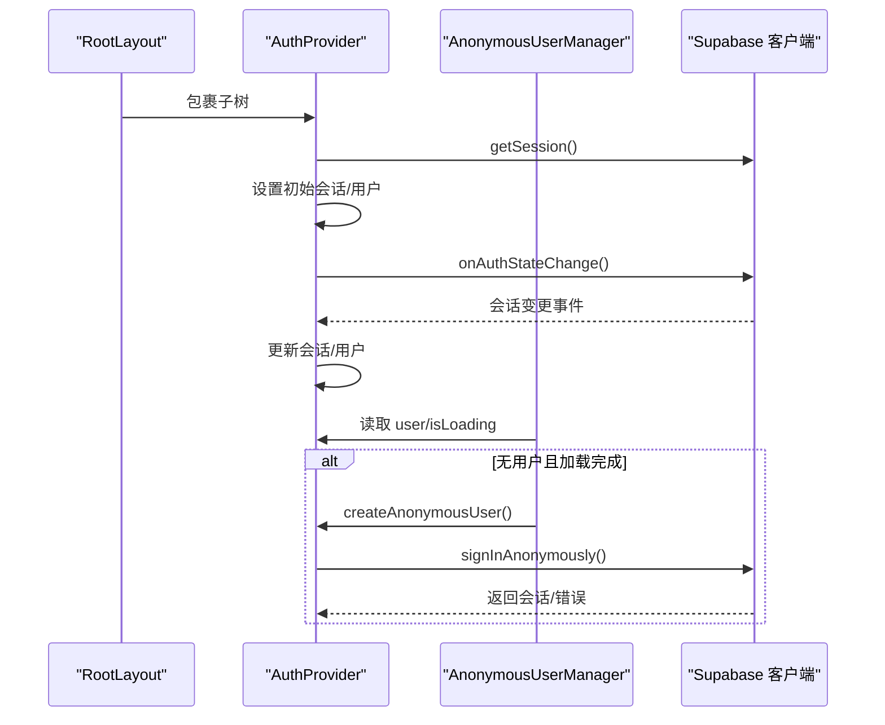
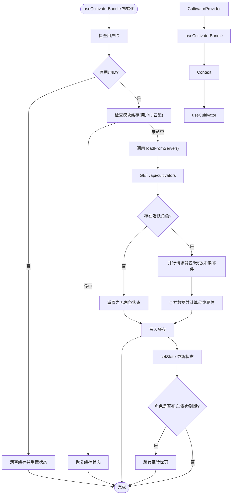
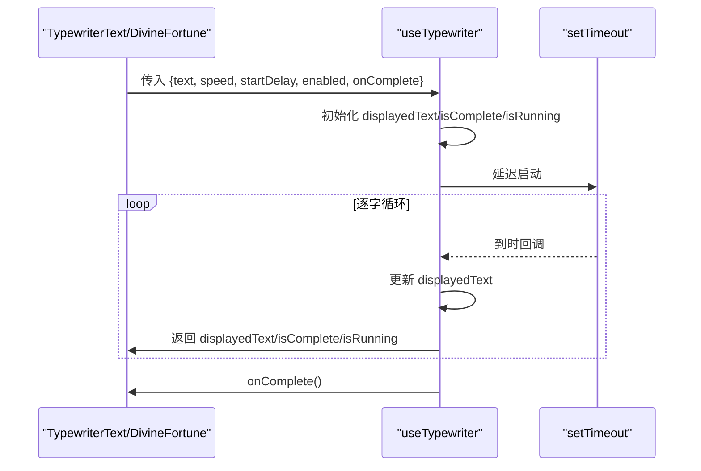
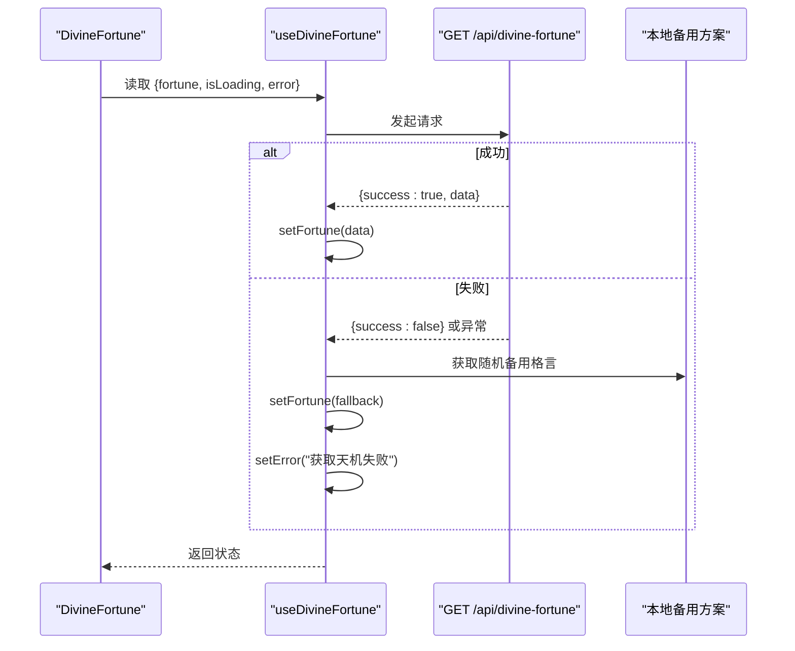
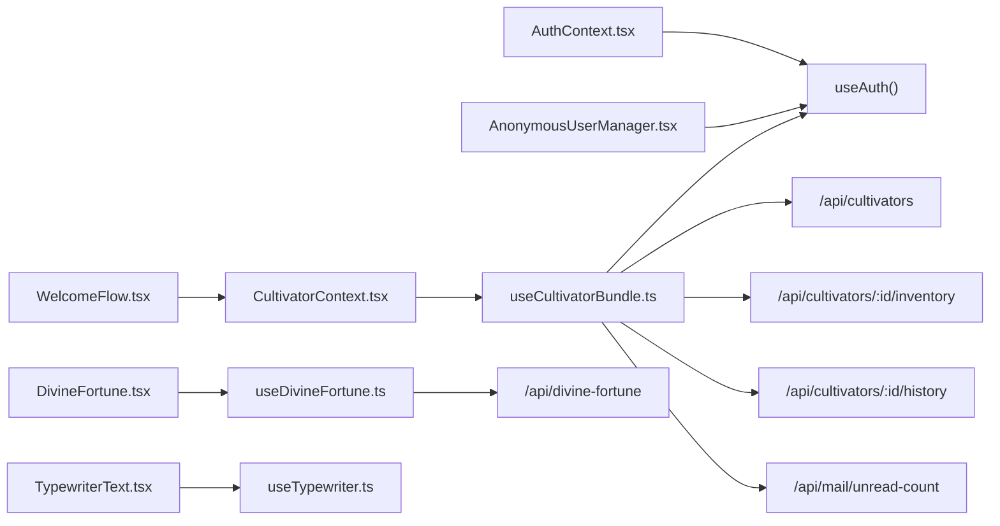

# 状态管理

<cite>
**本文引用的文件**
- [AuthContext.tsx](file://lib/auth/AuthContext.tsx)
- [AnonymousUserManager.tsx](file://components/AnonymousUserManager.tsx)
- [layout.tsx](file://app/layout.tsx)
- [useCultivatorBundle.ts](file://lib/hooks/useCultivatorBundle.ts)
- [CultivatorContext.tsx](file://lib/contexts/CultivatorContext.tsx)
- [useTypewriter.ts](file://lib/hooks/useTypewriter.ts)
- [useDivineFortune.ts](file://lib/hooks/useDivineFortune.ts)
- [DivineFortune.tsx](file://components/welcome/DivineFortune.tsx)
- [TypewriterText.tsx](file://components/welcome/TypewriterText.tsx)
- [WelcomeFlow.tsx](file://components/welcome/WelcomeFlow.tsx)
- [route.ts](file://app/api/divine-fortune/route.ts)
- [route.ts](file://app/api/cultivators/route.ts)
- [route.ts](file://app/api/cultivators/[id]/inventory/route.ts)
- [route.ts](file://app/api/cultivators/[id]/history/route.ts)
- [route.ts](file://app/api/mail/unread-count/route.ts)
- [cultivatorRepository.ts](file://lib/repositories/cultivatorRepository.ts)
</cite>

## 更新摘要
**变更内容**
- 更新了项目结构、核心组件、架构总览、详细组件分析、依赖关系分析、性能考量和故障排查指南等章节，以反映从 `useCultivatorBundle` 到 `CultivatorContext` 的状态管理重构
- 新增了 `CultivatorProvider` 的实现和使用说明
- 更新了架构图以反映新的状态流设计
- 移除了关于 `useCultivatorBundle` 作为主要状态聚合器的过时描述

## 目录
1. [引言](#引言)
2. [项目结构](#项目结构)
3. [核心组件](#核心组件)
4. [架构总览](#架构总览)
5. [详细组件分析](#详细组件分析)
6. [依赖关系分析](#依赖关系分析)
7. [性能考量](#性能考量)
8. [故障排查指南](#故障排查指南)
9. [结论](#结论)

## 引言
本文件聚焦于前端状态流设计，系统化梳理以下主题：
- React Context（AuthProvider）在全局用户认证状态管理中的作用机制
- AnonymousUserManager 如何处理游客用户的自动创建与会话维持
- 自定义 Hook 体系：useCultivatorBundle 聚合角色数据获取逻辑，useTypewriter 实现打字机文本动画效果，useDivineFortune 管理神签抽取状态
- 这些 Hook 如何封装复杂业务逻辑并提供简洁 API 供组件调用
- 状态更新流程、错误处理策略及与后端 API 的异步交互模式
- 状态调试技巧与常见问题解决方案，如状态不同步、重复渲染等性能问题

## 项目结构
围绕“状态管理”的关键文件分布如下：
- 认证上下文与游客管理：lib/auth/AuthContext.tsx、components/AnonymousUserManager.tsx、app/layout.tsx
- 角色数据聚合 Hook：lib/hooks/useCultivatorBundle.ts
- 角色上下文提供器：lib/contexts/CultivatorContext.tsx
- 文本动画 Hook：lib/hooks/useTypewriter.ts
- 神签 Hook：lib/hooks/useDivineFortune.ts
- 神签展示组件：components/welcome/DivineFortune.tsx、components/welcome/TypewriterText.tsx
- 欢迎页流程：components/welcome/WelcomeFlow.tsx
- 后端 API（节选）：app/api/divine-fortune/route.ts、app/api/cultivators/route.ts、app/api/cultivators/[id]/inventory/route.ts、app/api/cultivators/[id]/history/route.ts、app/api/mail/unread-count/route.ts
- 角色仓库（服务端查询）：lib/repositories/cultivatorRepository.ts

图表来源
- [layout.tsx](file://app/layout.tsx#L16-L31)
- [AuthContext.tsx](file://lib/auth/AuthContext.tsx#L37-L125)
- [AnonymousUserManager.tsx](file://components/AnonymousUserManager.tsx#L1-L20)
- [useCultivatorBundle.ts](file://lib/hooks/useCultivatorBundle.ts#L40-L351)
- [CultivatorContext.tsx](file://lib/contexts/CultivatorContext.tsx#L9-L36)
- [useTypewriter.ts](file://lib/hooks/useTypewriter.ts#L1-L118)
- [useDivineFortune.ts](file://lib/hooks/useDivineFortune.ts#L1-L45)
- [WelcomeFlow.tsx](file://components/welcome/WelcomeFlow.tsx#L1-L285)
- [DivineFortune.tsx](file://components/welcome/DivineFortune.tsx#L1-L77)
- [TypewriterText.tsx](file://components/welcome/TypewriterText.tsx#L1-L50)
- [route.ts](file://app/api/divine-fortune/route.ts)
- [route.ts](file://app/api/cultivators/route.ts)
- [route.ts](file://app/api/cultivators/[id]/inventory/route.ts)
- [route.ts](file://app/api/cultivators/[id]/history/route.ts)
- [route.ts](file://app/api/mail/unread-count/route.ts)

章节来源
- [layout.tsx](file://app/layout.tsx#L16-L31)

## 核心组件
- 全局认证上下文（AuthProvider）：提供用户会话、登录/登出、匿名用户创建与链接、密码重置等能力，并通过 Context 将状态与方法注入子树。
- 游客自动创建器（AnonymousUserManager）：在应用启动时检测无用户且加载完成的状态，自动创建匿名用户，确保游客也能获得有效会话。
- 角色数据聚合 Hook（useCultivatorBundle）：封装角色、背包、历史、技能、装备、未读邮件等多源数据的拉取、合并、缓存与刷新逻辑；提供统一状态与刷新接口。
- 修仙者上下文提供器（CultivatorProvider）：基于 useCultivatorBundle 创建全局唯一的修仙者数据源，通过 Context 向 (main) 分组内的所有组件提供状态。
- 打字机文本 Hook（useTypewriter）：提供逐字显示文本的能力，支持速度、延迟、启用开关、完成回调、跳过与重置。
- 神签 Hook（useDivineFortune）：从后端 API 获取天机格言，失败时降级到本地备用方案，并提供加载与错误状态。

章节来源
- [AuthContext.tsx](file://lib/auth/AuthContext.tsx#L13-L33)
- [AnonymousUserManager.tsx](file://components/AnonymousUserManager.tsx#L1-L20)
- [useCultivatorBundle.ts](file://lib/hooks/useCultivatorBundle.ts#L17-L67)
- [CultivatorContext.tsx](file://lib/contexts/CultivatorContext.tsx#L17-L36)
- [useTypewriter.ts](file://lib/hooks/useTypewriter.ts#L1-L118)
- [useDivineFortune.ts](file://lib/hooks/useDivineFortune.ts#L1-L45)

## 架构总览
整体采用“上下文 + 自定义 Hook + 展示组件”的分层设计：
- 上下文层：集中管理认证状态与操作，向子树提供统一入口
- Hook 层：封装复杂数据流与副作用，暴露简洁状态与方法
- 展示层：根据状态渲染 UI，组合动画与业务组件

图表来源
- [layout.tsx](file://app/layout.tsx#L16-L31)
- [AuthContext.tsx](file://lib/auth/AuthContext.tsx#L37-L125)
- [AnonymousUserManager.tsx](file://components/AnonymousUserManager.tsx#L1-L20)
- [useCultivatorBundle.ts](file://lib/hooks/useCultivatorBundle.ts#L175-L291)
- [CultivatorContext.tsx](file://lib/contexts/CultivatorContext.tsx#L28-L36)

## 详细组件分析

### 认证上下文（AuthProvider）与游客自动创建
- 作用机制
  - 初始化阶段通过客户端 SDK 获取当前会话并设置初始状态
  - 监听 AuthStateChange 事件，实时同步会话与用户信息
  - 提供注册、登录、登出、重置密码、匿名用户创建与链接等方法
  - isAnonymous 字段基于 user.is_anonymous 推断
- 游客自动创建
  - AnonymousUserManager 在用户为空且加载完成时调用 createAnonymousUser
  - 保证游客也能拥有可用会话，便于后续角色数据与功能使用

图表来源
- [AuthContext.tsx](file://lib/auth/AuthContext.tsx#L37-L125)
- [AnonymousUserManager.tsx](file://components/AnonymousUserManager.tsx#L1-L20)
- [layout.tsx](file://app/layout.tsx#L16-L31)

章节来源
- [AuthContext.tsx](file://lib/auth/AuthContext.tsx#L37-L125)
- [AnonymousUserManager.tsx](file://components/AnonymousUserManager.tsx#L1-L20)
- [layout.tsx](file://app/layout.tsx#L16-L31)

### 角色数据聚合 Hook（useCultivatorBundle）与上下文提供器（CultivatorProvider）
- 聚合逻辑
  - 从 /api/cultivators 获取角色列表与元信息（含是否有活跃角色）
  - 若存在活跃角色，则并行拉取背包、历史、未读邮件数量
  - 计算最终属性，组装完整角色对象
  - 提供 refresh、refreshInventory、refreshHistory 等刷新方法
- 缓存策略
  - 模块级缓存（cachedData、cachedUserId），在用户 ID 相同的情况下复用数据，避免重复请求
  - 首次渲染时优先恢复缓存，减少白屏与抖动
- 错误处理
  - 对各 API 请求进行 try/catch，失败时记录日志并保持稳定状态
  - 加载失败时仍返回可用状态，避免组件崩溃
- 导航联动
  - 当角色死亡或寿命到期且不在转世页时，自动导航至转世页
- 上下文提供器
  - CultivatorProvider 在 (main) 布局中包裹子树，通过 useCultivatorBundle 获取数据并注入 Context
  - 子组件通过 useCultivator Hook 订阅全局状态，实现单一数据源

图表来源
- [useCultivatorBundle.ts](file://lib/hooks/useCultivatorBundle.ts#L175-L351)
- [CultivatorContext.tsx](file://lib/contexts/CultivatorContext.tsx#L28-L36)

章节来源
- [useCultivatorBundle.ts](file://lib/hooks/useCultivatorBundle.ts#L17-L67)
- [useCultivatorBundle.ts](file://lib/hooks/useCultivatorBundle.ts#L175-L291)
- [useCultivatorBundle.ts](file://lib/hooks/useCultivatorBundle.ts#L293-L351)
- [CultivatorContext.tsx](file://lib/contexts/CultivatorContext.tsx#L28-L36)

### 打字机文本 Hook（useTypewriter）
- 能力概述
  - 逐字显示文本，支持速度、开始延迟、启用开关
  - 提供 skip（跳过动画）、reset（重置）、isComplete、isRunning 等控制与状态
- 优化点
  - 使用 setTimeout 替代 requestAnimationFrame，逻辑更精简
  - 通过 ref 保存 onComplete，避免闭包陷阱
- 与展示组件配合
  - TypewriterText 将 Hook 状态映射为可视文本与光标
  - DivineFortune 使用两个 TypewriterText 分别展示“天机格言”和“提示”，并通过延迟实现分段出现

图表来源
- [useTypewriter.ts](file://lib/hooks/useTypewriter.ts#L1-L118)
- [TypewriterText.tsx](file://components/welcome/TypewriterText.tsx#L1-L50)
- [DivineFortune.tsx](file://components/welcome/DivineFortune.tsx#L1-L77)

章节来源
- [useTypewriter.ts](file://lib/hooks/useTypewriter.ts#L1-L118)
- [TypewriterText.tsx](file://components/welcome/TypewriterText.tsx#L1-L50)
- [DivineFortune.tsx](file://components/welcome/DivineFortune.tsx#L1-L77)

### 神签 Hook（useDivineFortune）
- 能力概述
  - 从 /api/divine-fortune 获取天机格言
  - 成功时设置数据，失败时降级到本地备用方案
  - 提供 isLoading、error 状态
- 与展示组件配合
  - DivineFortune 在加载时显示提示，加载完成后通过 TypewriterText 渲染文本

图表来源
- [useDivineFortune.ts](file://lib/hooks/useDivineFortune.ts#L1-L45)
- [DivineFortune.tsx](file://components/welcome/DivineFortune.tsx#L1-L77)
- [route.ts](file://app/api/divine-fortune/route.ts)

章节来源
- [useDivineFortune.ts](file://lib/hooks/useDivineFortune.ts#L1-L45)
- [DivineFortune.tsx](file://components/welcome/DivineFortune.tsx#L1-L77)

### 欢迎页流程（WelcomeFlow）与状态联动
- 流程要点
  - 使用 useWelcomeStatus 管理“跳过欢迎页”偏好与访问统计
  - 使用 useCultivator 获取角色状态，决定页面内容分支
  - 使用多个 TypewriterText 实现分段打字机效果
- 性能注意
  - 通过页面栈与翻页动画状态控制，避免重复渲染
  - 在页面切换时利用 useCultivatorBundle 的缓存机制减少请求

章节来源
- [WelcomeFlow.tsx](file://components/welcome/WelcomeFlow.tsx#L1-L285)
- [useCultivatorBundle.ts](file://lib/hooks/useCultivatorBundle.ts#L330-L351)

## 依赖关系分析
- 认证上下文依赖 Supabase 客户端，提供会话监听与用户操作
- 游客管理器依赖 useAuth，按条件触发匿名登录
- 角色聚合 Hook 依赖 useAuth 获取用户 ID，并依赖多个后端 API
- 修仙者上下文提供器依赖 useCultivatorBundle，向子树提供全局状态
- 神签 Hook 依赖 /api/divine-fortune
- 展示组件依赖对应 Hook 的状态与方法

图表来源
- [AuthContext.tsx](file://lib/auth/AuthContext.tsx#L37-L125)
- [AnonymousUserManager.tsx](file://components/AnonymousUserManager.tsx#L1-L20)
- [useCultivatorBundle.ts](file://lib/hooks/useCultivatorBundle.ts#L175-L291)
- [CultivatorContext.tsx](file://lib/contexts/CultivatorContext.tsx#L28-L36)
- [useDivineFortune.ts](file://lib/hooks/useDivineFortune.ts#L1-L45)
- [DivineFortune.tsx](file://components/welcome/DivineFortune.tsx#L1-L77)
- [TypewriterText.tsx](file://components/welcome/TypewriterText.tsx#L1-L50)
- [WelcomeFlow.tsx](file://components/welcome/WelcomeFlow.tsx#L1-L285)

章节来源
- [useCultivatorBundle.ts](file://lib/hooks/useCultivatorBundle.ts#L175-L291)
- [CultivatorContext.tsx](file://lib/contexts/CultivatorContext.tsx#L28-L36)
- [useDivineFortune.ts](file://lib/hooks/useDivineFortune.ts#L1-L45)

## 性能考量
- 缓存与去抖
  - useCultivatorBundle 使用模块级缓存与 initializedRef，避免重复加载与重复渲染
  - 在用户切换或首次加载时再触发请求，减少不必要的网络开销
- 并行请求
  - 在存在活跃角色时，对背包、历史、未读邮件采用 Promise.all 并行拉取，缩短总等待时间
- 动画与定时器
  - useTypewriter 使用 setTimeout 控制节奏，避免高频重绘
  - 在组件卸载时清理定时器，防止内存泄漏
- 导航与状态同步
  - 在角色状态变化时进行路由跳转，避免无效渲染与状态漂移
- 单一数据源
  - 通过 CultivatorProvider 实现单一数据源，避免多个组件独立调用 useCultivatorBundle 导致的状态不一致

章节来源
- [useCultivatorBundle.ts](file://lib/hooks/useCultivatorBundle.ts#L228-L234)
- [useCultivatorBundle.ts](file://lib/hooks/useCultivatorBundle.ts#L330-L351)
- [useTypewriter.ts](file://lib/hooks/useTypewriter.ts#L36-L61)
- [CultivatorContext.tsx](file://lib/contexts/CultivatorContext.tsx#L28-L36)

## 故障排查指南
- 症状：状态不同步（游客未创建匿名会话）
  - 检查 AnonymousUserManager 是否在用户为空且加载完成时被调用
  - 确认 AuthProvider 已包裹应用根布局
  - 关注 createAnonymousUser 的返回错误
- 症状：重复渲染或闪烁
  - useCultivatorBundle 已通过缓存与 initializedRef 控制，若仍出现，检查父组件是否频繁重建
  - 确保 key 与状态稳定，避免不必要的重渲染
- 症状：角色数据未更新
  - 使用 refresh/refreshInventory/refreshHistory 主动刷新
  - 检查后端 API 返回 success 字段与数据结构一致性
- 症状：打字机动画卡顿
  - 调整 speed/startDelay 参数，避免过小的间隔
  - 确保在组件卸载时调用 skip/reset 清理定时器
- 症状：神签加载失败
  - 查看 useDivineFortune 的 error 状态与控制台日志
  - 确认 /api/divine-fortune 可用，必要时检查本地备用方案是否生效
- 症状：上下文未提供（useCultivator 报错）
  - 确认 (main) 布局中已使用 CultivatorProvider 包裹子树
  - 检查组件是否在 (main) 分组内

章节来源
- [AnonymousUserManager.tsx](file://components/AnonymousUserManager.tsx#L1-L20)
- [AuthContext.tsx](file://lib/auth/AuthContext.tsx#L37-L125)
- [layout.tsx](file://app/layout.tsx#L16-L31)
- [useCultivatorBundle.ts](file://lib/hooks/useCultivatorBundle.ts#L107-L143)
- [useCultivatorBundle.ts](file://lib/hooks/useCultivatorBundle.ts#L145-L173)
- [useCultivatorBundle.ts](file://lib/hooks/useCultivatorBundle.ts#L330-L351)
- [useTypewriter.ts](file://lib/hooks/useTypewriter.ts#L36-L61)
- [useDivineFortune.ts](file://lib/hooks/useDivineFortune.ts#L1-L45)
- [CultivatorContext.tsx](file://lib/contexts/CultivatorContext.tsx#L17-L22)

## 结论
该状态管理体系以 AuthProvider 为核心，结合 useCultivatorBundle、useTypewriter、useDivineFortune 等 Hook，实现了：
- 全局认证状态的统一管理与游客自动创建
- 角色数据的聚合、缓存与增量刷新
- 通过 CultivatorProvider 实现单一数据源，提升数据一致性
- 文本动画的可控与可降级
- 与后端 API 的稳健异步交互与错误兜底

通过模块级缓存、并行请求与定时器清理等手段，兼顾了性能与用户体验；同时，清晰的 Hook API 降低了组件耦合度，便于扩展与维护。