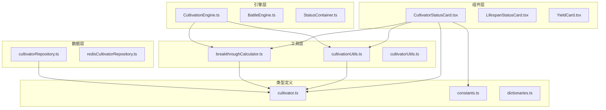
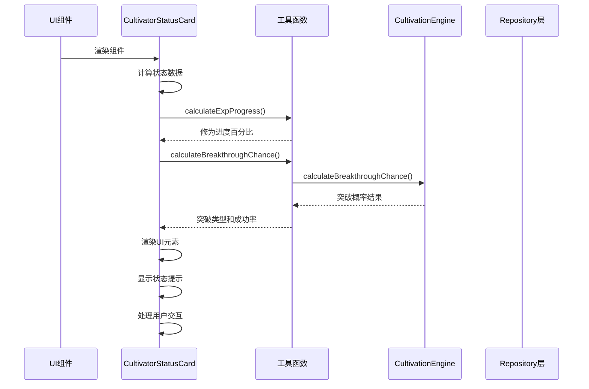
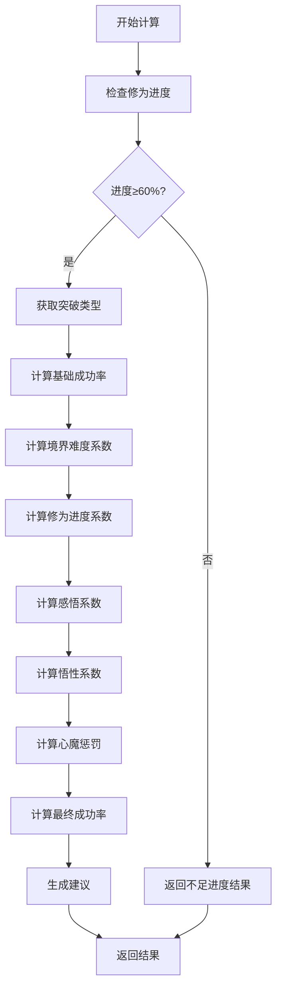
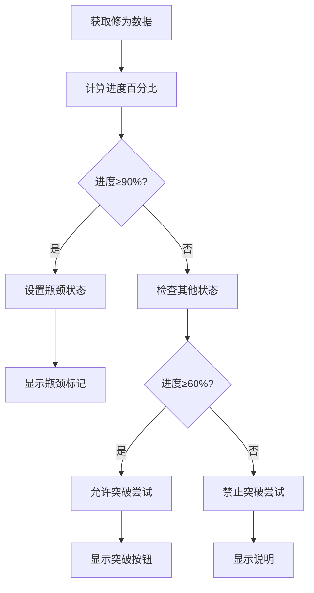
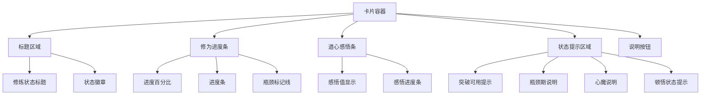
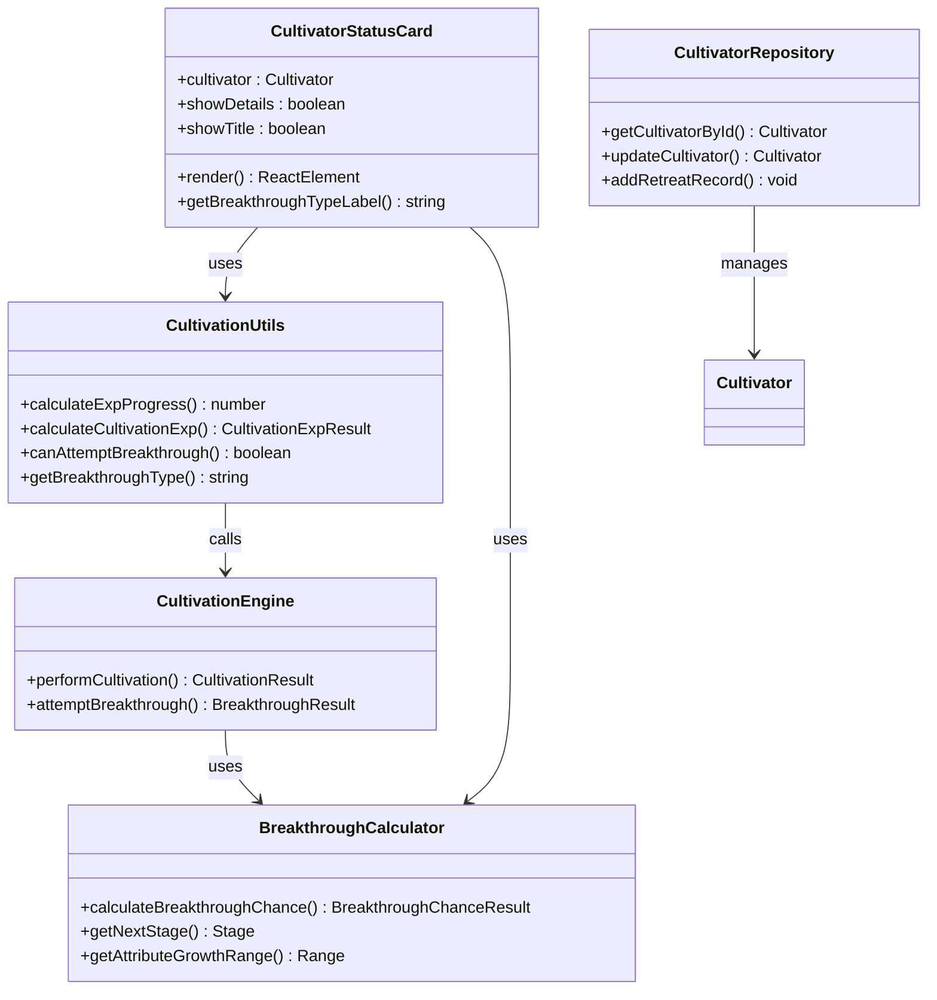
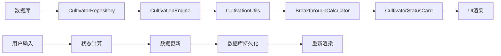

# 修炼者状态卡片

<cite>
**本文档引用的文件**
- [CultivatorStatusCard.tsx](file://components/CultivatorStatusCard.tsx)
- [cultivationUtils.ts](file://utils/cultivationUtils.ts)
- [breakthroughCalculator.ts](file://utils/breakthroughCalculator.ts)
- [cultivator.ts](file://types/cultivator.ts)
- [constants.ts](file://types/constants.ts)
- [CultivationEngine.ts](file://engine/cultivation/CultivationEngine.ts)
- [cultivatorRepository.ts](file://lib/repositories/cultivatorRepository.ts)
- [page.tsx](file://app/cultivator/page.tsx)
- [LifespanStatusCard.tsx](file://components/LifespanStatusCard.tsx)
</cite>

## 目录
1. [简介](#简介)
2. [项目结构](#项目结构)
3. [核心组件](#核心组件)
4. [架构概览](#架构概览)
5. [详细组件分析](#详细组件分析)
6. [依赖关系分析](#依赖关系分析)
7. [性能考虑](#性能考虑)
8. [故障排除指南](#故障排除指南)
9. [结论](#结论)

## 简介

修炼者状态卡片是《万界道游》项目中的核心UI组件，用于展示修仙角色的修炼状态、修为进度、突破可能性等关键信息。该组件采用React Hooks模式，结合TypeScript类型系统，提供了完整的修炼状态可视化功能。

该组件不仅展示了角色的基本修炼信息，还集成了突破概率计算、状态提示、说明弹窗等功能，为玩家提供了全面的修炼状态管理界面。

## 项目结构

项目采用模块化的组织方式，主要分为以下几个层次：

**图表来源**
- [CultivatorStatusCard.tsx](file://components/CultivatorStatusCard.tsx#L1-L341)
- [cultivationUtils.ts](file://utils/cultivationUtils.ts#L1-L378)
- [breakthroughCalculator.ts](file://utils/breakthroughCalculator.ts#L1-L468)

**章节来源**
- [CultivatorStatusCard.tsx](file://components/CultivatorStatusCard.tsx#L1-L341)
- [cultivationUtils.ts](file://utils/cultivationUtils.ts#L1-L378)
- [breakthroughCalculator.ts](file://utils/breakthroughCalculator.ts#L1-L468)

## 核心组件

### CultivatorStatusCard 组件

CultivatorStatusCard 是一个功能完整的修炼状态展示组件，具有以下核心特性：

#### 主要功能
- **修为进度可视化**：显示修为百分比、当前修为值和上限
- **突破可能性计算**：基于修为进度和感悟值计算突破成功率
- **状态提示系统**：显示瓶颈期、心魔、顿悟等特殊状态
- **交互式说明**：提供详细的修炼系统说明弹窗
- **响应式设计**：支持不同屏幕尺寸的自适应布局

#### 数据结构
组件接收 `CultivatorStatusCardProps` 类型的props，包含：
- `cultivator`: 修炼者完整数据对象
- `showDetails`: 是否显示详细信息（默认true）
- `showTitle`: 是否显示标题（默认true）

#### 状态管理
组件内部维护以下状态：
- `showExplanation`: 控制说明弹窗的显示状态
- `statusData`: 通过useMemo缓存的计算结果

**章节来源**
- [CultivatorStatusCard.tsx](file://components/CultivatorStatusCard.tsx#L10-L65)

## 架构概览

系统采用分层架构设计，确保职责分离和代码可维护性：

**图表来源**
- [CultivatorStatusCard.tsx](file://components/CultivatorStatusCard.tsx#L23-L65)
- [cultivationUtils.ts](file://utils/cultivationUtils.ts#L308-L343)
- [breakthroughCalculator.ts](file://utils/breakthroughCalculator.ts#L74-L158)

## 详细组件分析

### 1. 突破概率计算系统

#### 计算流程
突破概率计算采用多因子加权模型：

**图表来源**
- [breakthroughCalculator.ts](file://utils/breakthroughCalculator.ts#L74-L158)

#### 系数计算规则
- **基础成功率**：根据突破类型（强行/常规/圆满）设定
- **境界难度系数**：使用指数衰减模型（0.9^境界等级）
- **修为进度系数**：60-69%:0.6, 70-79%:0.8, 80-89%:0.95, 90-99%:1.1, 100%:1.25
- **感悟系数**：1.0 + (感悟值/100) × 0.25
- **悟性系数**：1.0 + log10(悟性)/30（限制在0.8-1.2之间）
- **心魔惩罚**：存在心魔时×0.95

**章节来源**
- [breakthroughCalculator.ts](file://utils/breakthroughCalculator.ts#L100-L131)

### 2. 修为进度管理系统

#### 进度计算逻辑
修为进度采用百分比显示系统：

**图表来源**
- [cultivationUtils.ts](file://utils/cultivationUtils.ts#L308-L326)

#### 状态检测机制
- **瓶颈期检测**：进度达到90%时触发
- **心魔检测**：连续3次突破失败触发
- **顿悟检测**：基于悟性计算的随机事件
- **突破许可**：至少60%进度才能尝试突破

**章节来源**
- [cultivationUtils.ts](file://utils/cultivationUtils.ts#L316-L343)

### 3. UI组件设计

#### 视觉层次结构
组件采用清晰的视觉层次设计：

**图表来源**
- [CultivatorStatusCard.tsx](file://components/CultivatorStatusCard.tsx#L89-L229)

#### 交互设计
- **说明弹窗**：点击"说明"按钮显示详细系统说明
- **状态徽章**：实时显示当前修炼状态
- **进度动画**：平滑的进度条过渡效果
- **响应式布局**：适配不同屏幕尺寸

**章节来源**
- [CultivatorStatusCard.tsx](file://components/CultivatorStatusCard.tsx#L87-L339)

## 依赖关系分析

### 组件间依赖关系

**图表来源**
- [CultivatorStatusCard.tsx](file://components/CultivatorStatusCard.tsx#L1-L341)
- [cultivationUtils.ts](file://utils/cultivationUtils.ts#L1-L378)
- [breakthroughCalculator.ts](file://utils/breakthroughCalculator.ts#L1-L468)
- [CultivationEngine.ts](file://engine/cultivation/CultivationEngine.ts#L1-L379)
- [cultivatorRepository.ts](file://lib/repositories/cultivatorRepository.ts#L1-L800)

### 数据流分析

**图表来源**
- [cultivatorRepository.ts](file://lib/repositories/cultivatorRepository.ts#L1-L800)
- [CultivationEngine.ts](file://engine/cultivation/CultivationEngine.ts#L1-L379)
- [CultivatorStatusCard.tsx](file://components/CultivatorStatusCard.tsx#L1-L341)

**章节来源**
- [cultivatorRepository.ts](file://lib/repositories/cultivatorRepository.ts#L1-L800)
- [CultivationEngine.ts](file://engine/cultivation/CultivationEngine.ts#L1-L379)

## 性能考虑

### 计算优化策略

1. **Memoization优化**
   - 使用useMemo缓存计算结果，避免重复计算
   - 依赖数组精确控制重新计算时机

2. **异步数据加载**
   - Repository层使用Promise.all并行加载关联数据
   - 避免N+1查询问题

3. **渲染优化**
   - 条件渲染减少DOM节点数量
   - 状态徽章按需显示

### 内存管理

- 合理的useState使用，避免不必要的状态更新
- 组件卸载时清理定时器和订阅
- 适当的错误边界处理

## 故障排除指南

### 常见问题及解决方案

#### 1. 突破概率计算异常
**症状**：突破概率显示为NaN或异常值
**原因**：修为进度数据缺失或计算错误
**解决**：检查CultivationProgress数据完整性，确保exp_cap大于0

#### 2. 状态显示不正确
**症状**：瓶颈期、心魔等状态显示异常
**原因**：状态标志位未正确更新
**解决**：验证状态检测逻辑，检查状态转换条件

#### 3. 性能问题
**症状**：页面渲染缓慢或卡顿
**原因**：频繁的重新计算和渲染
**解决**：检查useMemo依赖数组，优化计算复杂度

**章节来源**
- [CultivatorStatusCard.tsx](file://components/CultivatorStatusCard.tsx#L44-L55)
- [cultivationUtils.ts](file://utils/cultivationUtils.ts#L308-L343)

## 结论

修炼者状态卡片组件展现了现代React应用的最佳实践，通过合理的架构设计、类型安全的实现和优秀的用户体验，为修仙游戏提供了完整的修炼状态管理功能。

该组件的主要优势包括：
- **类型安全**：完整的TypeScript类型定义确保数据一致性
- **性能优化**：智能的缓存和渲染策略提升用户体验
- **可扩展性**：清晰的架构便于功能扩展和维护
- **用户体验**：直观的界面设计和丰富的交互反馈

未来可以考虑的功能增强：
- 添加更多修炼状态的可视化效果
- 实现状态提醒和通知功能
- 优化移动端的触摸交互体验
- 增加自定义主题和样式选项