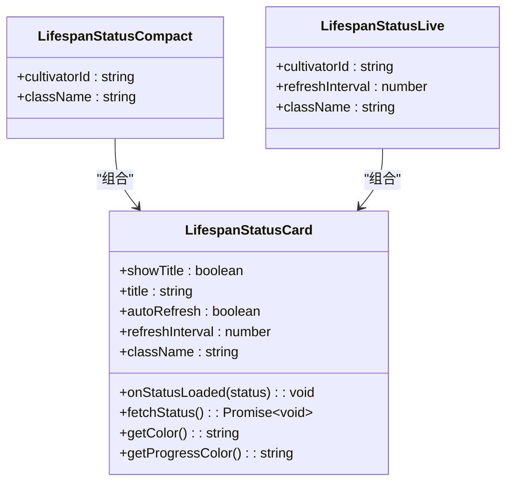
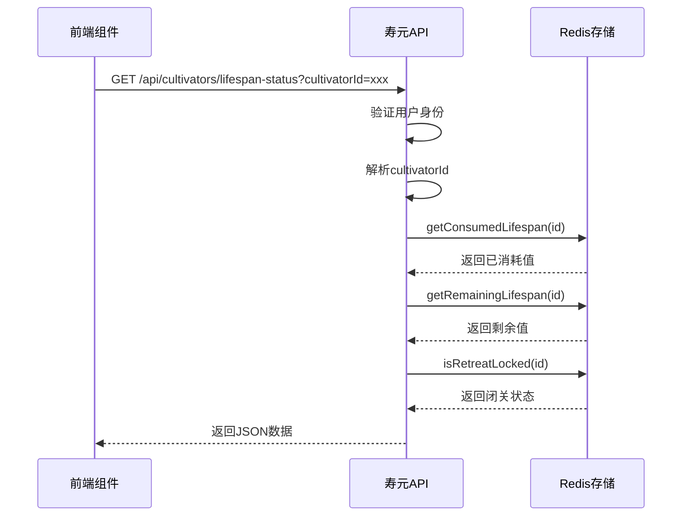
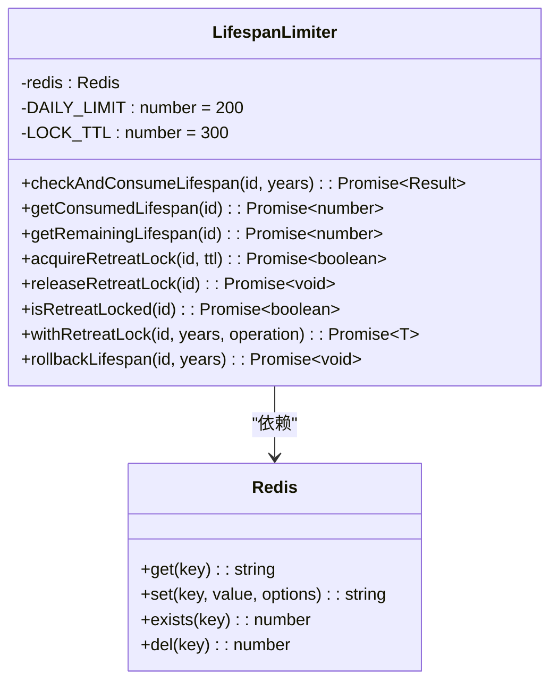

# 寿命状态卡片

<cite>
**本文档引用文件**   
- [LifespanStatusCard.tsx](file://components/LifespanStatusCard.tsx)
- [route.ts](file://app/api/cultivators/lifespan-status/route.ts)
- [lifespanLimiter.ts](file://lib/redis/lifespanLimiter.ts)
- [LIFESPAN_LIMITER_GUIDE.md](file://LIFESPAN_LIMITER_GUIDE.md)
- [cultivator.ts](file://types/cultivator.ts)
</cite>

## 目录
1. [简介](#简介)
2. [核心功能](#核心功能)
3. [组件结构与实现](#组件结构与实现)
4. [API 接口分析](#api-接口分析)
5. [后端服务与状态管理](#后端服务与状态管理)
6. [使用场景与最佳实践](#使用场景与最佳实践)
7. [样式与用户体验](#样式与用户体验)
8. [总结](#总结)

## 简介

寿命状态卡片是修仙系统中的关键UI组件，用于展示角色每日寿元消耗情况。该组件以直观的进度条形式呈现已消耗和剩余寿元，并支持实时刷新与闭关状态提示，帮助玩家掌握角色修炼资源使用情况。

此文档将深入分析`LifespanStatusCard`组件及其相关后端逻辑，涵盖前端实现、API接口、Redis状态管理以及整体架构设计，为开发者提供全面的技术参考。

## 核心功能

寿命状态卡片提供以下核心功能：

- **寿元消耗可视化**：通过进度条显示当日寿元使用比例
- **动态数据获取**：从后端API异步加载最新寿元状态
- **自动刷新机制**：可配置定时刷新以保持数据实时性
- **闭关状态标识**：显示角色是否正处于闭关修炼中
- **错误处理与加载状态**：优雅地处理网络异常和加载过程
- **多版本支持**：提供标准版、紧凑版和实时刷新版三种变体

该组件在首页`page.tsx`中被直接调用，作为角色核心状态的一部分展示给用户。

**Section sources**
- [LifespanStatusCard.tsx](file://components/LifespanStatusCard.tsx#L1-L227)
- [page.tsx](file://app/page.tsx#L214-L215)

## 组件结构与实现

### 主要组件 `LifespanStatusCard`

`LifespanStatusCard` 是一个客户端组件，基于React函数式组件构建，使用TypeScript定义了清晰的接口类型。

#### 接口定义

```typescript
interface LifespanStatus {
  dailyLimit: number;
  consumed: number;
  remaining: number;
  isInRetreat: boolean;
}

interface LifespanStatusCardProps {
  cultivatorId: string;
  showTitle?: boolean;
  title?: string;
  autoRefresh?: boolean;
  refreshInterval?: number;
  onStatusLoaded?: (status: LifespanStatus) => void;
  className?: string;
}
```

#### 功能逻辑

组件通过`fetchStatus`方法向`/api/cultivators/lifespan-status`发起请求获取数据，并利用`useEffect`实现初始化加载和可选的自动刷新功能。根据消耗比例动态调整文字和进度条颜色：
- 低于70%：默认墨色
- 70%-90%：琥珀色警告
- 超过90%：朱砂红色警报

当角色处于闭关状态时，会在标题区域显示“闭关中”徽章。

#### 辅助组件

组件还导出了两个便捷变体：

1. **`LifespanStatusCompact`**：紧凑模式，隐藏标题仅显示核心数据
2. **`LifespanStatusLive`**：实时模式，启用自动刷新（默认30秒间隔）



**Diagram sources **
- [LifespanStatusCard.tsx](file://components/LifespanStatusCard.tsx#L49-L227)

**Section sources**
- [LifespanStatusCard.tsx](file://components/LifespanStatusCard.tsx#L1-L227)

## API 接口分析

### 获取寿元状态 API

位于 `app/api/cultivators/lifespan-status/route.ts` 的GET接口负责提供寿元数据。

#### 请求流程

1. 验证用户身份（通过Supabase Auth）
2. 解析查询参数中的`cultivatorId`
3. 调用Redis服务获取消耗、剩余及闭关状态
4. 返回标准化JSON响应

#### 响应结构

```json
{
  "success": true,
  "data": {
    "cultivatorId": "xxx",
    "dailyLimit": 200,
    "consumed": 50,
    "remaining": 150,
    "isInRetreat": false
  }
}
```

该接口每日上限固定为200年，数据每日凌晨自动重置。



**Diagram sources **
- [route.ts](file://app/api/cultivators/lifespan-status/route.ts#L8-L42)

**Section sources**
- [route.ts](file://app/api/cultivators/lifespan-status/route.ts#L1-L57)

## 后端服务与状态管理

### 寿元限制器（LifespanLimiter）

位于 `lib/redis/lifespanLimiter.ts` 的`LifespanLimiter`类是整个寿元管理系统的核心。

#### 核心功能

- **每日限额控制**：每个角色每天最多消耗200年寿元
- **并发锁机制**：防止同一角色同时进行多个消耗操作
- **自动过期**：数据在次日零点自动重置
- **事务安全**：提供`withRetreatLock`方法确保操作原子性

#### 关键方法

| 方法 | 描述 |
|------|------|
| `checkAndConsumeLifespan()` | 检查并消耗指定年数寿元 |
| `getConsumedLifespan()` | 获取已消耗寿元 |
| `getRemainingLifespan()` | 获取剩余寿元 |
| `acquireRetreatLock()` | 获取闭关锁（防并发） |
| `releaseRetreatLock()` | 释放闭关锁 |
| `isRetreatLocked()` | 检查是否正在闭关 |
| `withRetreatLock()` | 安全执行闭关操作（自动加锁/解锁） |

#### 数据存储结构

- **每日消耗**：`lifespan:daily:{id}:{YYYY-MM-DD}`
- **闭关锁**：`retreat:lock:{id}`

该服务采用单例模式，通过`getLifespanLimiter()`函数获取实例。



**Diagram sources **
- [lifespanLimiter.ts](file://lib/redis/lifespanLimiter.ts#L8-L199)

**Section sources**
- [lifespanLimiter.ts](file://lib/redis/lifespanLimiter.ts#L1-L199)

## 使用场景与最佳实践

### 典型使用场景

1. **首页状态展示**：在主界面显示角色当日寿元使用情况
2. **闭关操作前验证**：确保有足够的寿元进行闭关
3. **副本探索消耗**：处理副本选择导致的寿元扣除
4. **战斗结算**：根据战斗结果扣除相应寿元
5. **炼丹炼器**：长时间制作过程消耗寿元

### 最佳实践建议

根据`LIFESPAN_LIMITER_GUIDE.md`文档，推荐以下使用方式：

#### 简单场景：使用`withRetreatLock`

```typescript
const limiter = getLifespanLimiter();
const result = await limiter.withRetreatLock(
  cultivatorId,
  years,
  async () => {
    // 业务逻辑
    return performOperation();
  }
);
```

#### 复杂场景：手动控制流程

```typescript
const limiter = getLifespanLimiter();
let lockAcquired = false;

try {
  lockAcquired = await limiter.acquireRetreatLock(cultivatorId);
  if (!lockAcquired) throw new Error('正在闭关');

  const check = await limiter.checkAndConsumeLifespan(cultivatorId, years);
  if (!check.allowed) throw new Error(check.message);

  // 执行业务逻辑

} catch (err) {
  if (cultivatorId && years > 0) {
    await limiter.rollbackLifespan(cultivatorId, years);
  }
  throw err;
} finally {
  if (lockAcquired && cultivatorId) {
    await limiter.releaseRetreatLock(cultivatorId);
  }
}
```

### 注意事项

- 必须在`finally`块中释放锁，防止死锁
- 操作失败时应及时回滚寿元消耗
- 闭关锁默认5分钟过期，避免长时间占用
- 每日凌晨自动重置每日限额

**Section sources**
- [LIFESPAN_LIMITER_GUIDE.md](file://LIFESPAN_LIMITER_GUIDE.md#L1-L198)

## 样式与用户体验

### 视觉设计原则

组件遵循项目整体的"文字化"UI风格，采用传统宣纸与墨色配色方案：

- **背景色**：`#f8f3e6`（旧纸）
- **文字色**：`#2c1810`（正文墨色）
- **警告色**：`#c1121f`（朱砂红）
- **强调色**：`#efbf04`（金色）

### 交互体验

- **加载状态**：显示"正在查询体力状态..."提示
- **错误处理**：红色文字显示具体错误信息
- **颜色渐变**：根据消耗比例平滑过渡颜色
- **动画效果**：进度条宽度变化带有300ms过渡动画

### 响应式设计

组件通过`className`属性支持外部样式扩展，可轻松集成到不同布局中。紧凑版本适用于空间受限的场景，如侧边栏或移动设备。

**Section sources**
- [globals.css](file://app/globals.css#L1-L200)
- [InkComponents.tsx](file://components/InkComponents.tsx#L1-L200)

## 总结

寿命状态卡片是一个功能完整、设计精良的UI组件，它不仅提供了直观的寿元消耗可视化，还构建了一个健壮的后端服务支撑体系。通过Redis实现高性能的状态存储与并发控制，结合清晰的API接口和灵活的前端组件，形成了一个可复用的资源管理系统模板。

该设计模式可推广至其他类似的限时资源管理场景，如体力值、灵气值等，具有良好的扩展性和维护性。