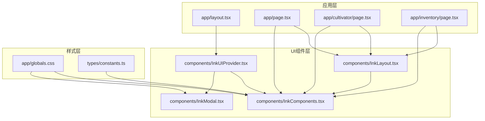
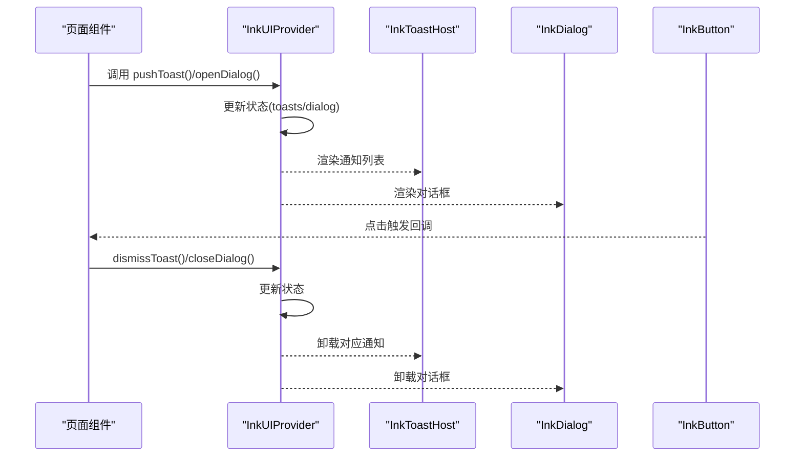
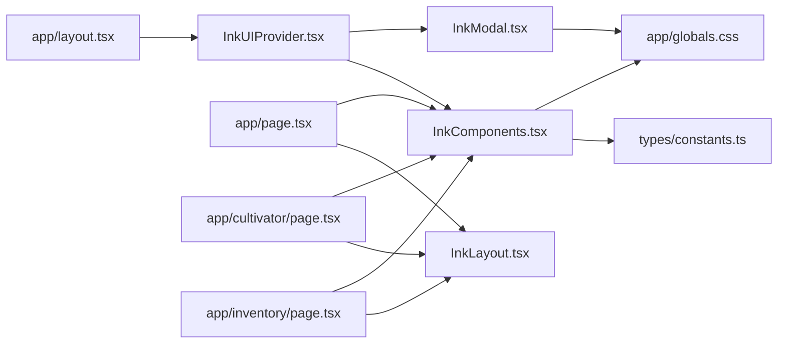

# 组件体系

<cite>
**本文引用的文件**
- [components/InkComponents.tsx](file://components/InkComponents.tsx)
- [components/InkModal.tsx](file://components/InkModal.tsx)
- [components/InkUIProvider.tsx](file://components/InkUIProvider.tsx)
- [components/InkLayout.tsx](file://components/InkLayout.tsx)
- [app/layout.tsx](file://app/layout.tsx)
- [app/page.tsx](file://app/page.tsx)
- [app/cultivator/page.tsx](file://app/cultivator/page.tsx)
- [app/inventory/page.tsx](file://app/inventory/page.tsx)
- [app/globals.css](file://app/globals.css)
- [types/constants.ts](file://types/constants.ts)
</cite>

## 目录
1. [引言](#引言)
2. [项目结构](#项目结构)
3. [核心组件](#核心组件)
4. [架构总览](#架构总览)
5. [组件详解](#组件详解)
6. [依赖关系分析](#依赖关系分析)
7. [性能考量](#性能考量)
8. [故障排查指南](#故障排查指南)
9. [结论](#结论)
10. [附录](#附录)

## 引言
本文件系统性梳理“Ink系列”UI组件体系，围绕 InksComponents.tsx 中的组件与 InkModal.tsx 的模态框封装，结合 InkUIProvider.tsx 的全局状态管理，解释各组件的职责、Props 定义、视觉表现、交互行为与修仙主题样式实现机制，并通过实际页面用例展示如何组合使用这些组件构建统一风格的界面。同时说明组件如何借助 Tailwind CSS 实现响应式设计与主题一致性。

## 项目结构
Ink 系列组件位于 components 目录，配合 InkUIProvider 在应用根布局中注入全局状态与对话框/通知宿主；页面级组件通过 InkLayout.tsx 提供统一的页面外壳与导航，页面内大量使用 InkComponents.tsx 中的原子组件进行组合。

图表来源
- [app/layout.tsx](file://app/layout.tsx#L1-L33)
- [components/InkUIProvider.tsx](file://components/InkUIProvider.tsx#L1-L82)
- [components/InkComponents.tsx](file://components/InkComponents.tsx#L1-L665)
- [components/InkModal.tsx](file://components/InkModal.tsx#L1-L86)
- [components/InkLayout.tsx](file://components/InkLayout.tsx#L1-L111)
- [app/globals.css](file://app/globals.css#L114-L811)
- [types/constants.ts](file://types/constants.ts#L1-L191)

章节来源
- [app/layout.tsx](file://app/layout.tsx#L1-L33)
- [components/InkUIProvider.tsx](file://components/InkUIProvider.tsx#L1-L82)
- [components/InkComponents.tsx](file://components/InkComponents.tsx#L1-L665)
- [components/InkModal.tsx](file://components/InkModal.tsx#L1-L86)
- [components/InkLayout.tsx](file://components/InkLayout.tsx#L1-L111)
- [app/globals.css](file://app/globals.css#L114-L811)
- [types/constants.ts](file://types/constants.ts#L1-L191)

## 核心组件
本节对 Ink 系列核心组件进行概览，后续章节将逐个深入。

- InkButton：文字化按钮，支持多种变体与禁用态，可作为链接或按钮渲染。
- InkLink：文字化链接，支持激活态与方括号/双角括号显示。
- InkNav：基于 InkLink 的导航栏。
- InkDivider：分隔线，支持符号型与线条型。
- InkCard：极简卡片容器，支持高亮强调。
- InkActionGroup：底部操作区布局容器。
- InkBadge：品阶徽记，支持色调、紧凑、隐藏文本等。
- InkTag：标签，支持轮廓/幽灵/默认与多色调。
- InkStatRow：属性行，展示基础值与最终值差异与细节。
- InkList/InkListItem：列表容器与列表项，支持列布局、高亮、新标记等。
- InkInput：输入控件，支持单行/多行、提示/错误、键盘事件。
- InkNotice：空状态/提示信息。
- InkStatusBar：状态条，支持堆叠布局与图标/提示。
- InkToast/InkToastHost：通知提示与宿主容器。
- InkDialog：对话框，支持确认/取消、加载态、自动关闭。
- InkTabs：标签页。
- InkModal：模态框封装，支持 Esc 关闭、背景遮罩、滚动锁定。

章节来源
- [components/InkComponents.tsx](file://components/InkComponents.tsx#L1-L665)
- [components/InkModal.tsx](file://components/InkModal.tsx#L1-L86)

## 架构总览
InkUIProvider 负责全局状态（toasts、dialogs），并通过上下文暴露 pushToast、dismissToast、openDialog、closeDialog 方法；InkToastHost 与 InkDialog 分别挂载在 Provider 子树末尾，实现全局可见与一次性渲染。页面通过 InkLayout.tsx 提供统一外壳，内部组合 InkComponents.tsx 的原子组件完成页面布局与交互。

图表来源
- [components/InkUIProvider.tsx](file://components/InkUIProvider.tsx#L1-L82)
- [components/InkComponents.tsx](file://components/InkComponents.tsx#L497-L664)

章节来源
- [components/InkUIProvider.tsx](file://components/InkUIProvider.tsx#L1-L82)
- [components/InkComponents.tsx](file://components/InkComponents.tsx#L497-L664)

## 组件详解

### InkButton（文字化按钮）
- 功能：提供统一的“方括号”风格按钮，既可作为链接也可作为按钮；支持变体（default/primary/secondary/outline/ghost）、禁用态与自定义类名。
- Props
  - children: ReactNode
  - onClick?: () => void
  - href?: string
  - disabled?: boolean
  - variant?: 'default' | 'primary' | 'secondary' | 'outline' | 'ghost'
  - className?: string
- 交互与视觉
  - 当传入 href 且未禁用时，渲染为带方括号样式的链接；否则渲染为按钮。
  - hover、禁用态、主色强调由 CSS 类控制。
- 适用场景
  - 页面快捷入口、操作按钮、返回链接等。

章节来源
- [components/InkComponents.tsx](file://components/InkComponents.tsx#L15-L56)
- [app/globals.css](file://app/globals.css#L114-L181)

### InkLink（修仙风格链接）
- 功能：文字化链接，支持 active 激活态；激活时使用双角括号包裹。
- Props
  - children: ReactNode
  - href: string
  - className?: string
  - active?: boolean
- 适用场景
  - 导航项、菜单链接。

章节来源
- [components/InkComponents.tsx](file://components/InkComponents.tsx#L61-L83)
- [app/globals.css](file://app/globals.css#L114-L181)

### InkNav（导航栏）
- 功能：基于 InkLink 的导航容器，根据当前路径高亮对应项。
- Props
  - items: Array<{ label: string; href: string }>
  - currentPath?: string
- 适用场景
  - 底部导航、页面内主导航。

章节来源
- [components/InkComponents.tsx](file://components/InkComponents.tsx#L85-L106)
- [components/InkLayout.tsx](file://components/InkLayout.tsx#L1-L111)

### InkDivider（分隔线）
- 功能：提供“线条型”与“符号型”两种分隔线。
- Props
  - variant?: 'line' | 'symbol'
  - symbol?: string
  - className?: string
- 适用场景
  - 区块间分隔、装饰性分隔。

章节来源
- [components/InkComponents.tsx](file://components/InkComponents.tsx#L108-L137)
- [app/globals.css](file://app/globals.css#L114-L181)

### InkCard（极简卡片）
- 功能：最小化视觉元素的卡片容器，支持高亮强调。
- Props
  - children: ReactNode
  - className?: string
  - highlighted?: boolean
- 适用场景
  - 信息区块容器、强调区域。

章节来源
- [components/InkComponents.tsx](file://components/InkComponents.tsx#L139-L158)
- [app/globals.css](file://app/globals.css#L114-L181)

### InkActionGroup（底部操作区）
- 功能：底部操作按钮组，支持对齐方式（left/center/right/between）。
- Props
  - children: ReactNode
  - align?: 'left' | 'center' | 'right' | 'between'
  - className?: string
- 适用场景
  - 页面底部确认/取消、返回/下一步等操作区。

章节来源
- [components/InkComponents.tsx](file://components/InkComponents.tsx#L160-L178)
- [app/globals.css](file://app/globals.css#L114-L181)

### InkBadge（品阶徽记）
- 功能：徽记组件，支持色调（default/accent/warning/danger）、紧凑模式、隐藏文本、扩展文本等；根据传入的 Tier 映射到不同颜色类别。
- Props
  - children?: string
  - tier?: Tier（Quality | SpiritualRootGrade | SkillGrade | RealmType）
  - tierText?: string
  - tone?: 'default' | 'accent' | 'warning' | 'danger'
  - compact?: boolean
  - className?: string
  - expandText?: string
  - hideTierText?: boolean
- 样式实现机制
  - 通过 tierSlugMap 将枚举映射到 CSS 类名（如 fan/ling/xuan/zhen/di/tian/xian/shen），再由全局 CSS 控制颜色。
- 适用场景
  - 境界、灵根、法宝品阶、技能品阶等标识。

章节来源
- [components/InkComponents.tsx](file://components/InkComponents.tsx#L180-L263)
- [types/constants.ts](file://types/constants.ts#L55-L127)
- [app/globals.css](file://app/globals.css#L416-L477)

### InkTag（标签）
- 功能：标签组件，支持变体（default/outline/ghost）与多色调（neutral/good/bad/info）。
- Props
  - children: ReactNode
  - variant?: 'default' | 'outline' | 'ghost'
  - tone?: 'neutral' | 'good' | 'bad' | 'info'
  - className?: string
- 适用场景
  - 状态标签、功能标签、分类标签。

章节来源
- [components/InkComponents.tsx](file://components/InkComponents.tsx#L265-L284)
- [app/globals.css](file://app/globals.css#L479-L512)

### InkStatRow（属性行）
- 功能：展示属性的基础值与最终值差异，支持代码标注、强调与详情说明。
- Props
  - label: ReactNode
  - code?: string
  - base: number | string
  - final?: number | string
  - detail?: ReactNode
  - emphasize?: boolean
- 适用场景
  - 属性面板、加成拆解、对比展示。

章节来源
- [components/InkComponents.tsx](file://components/InkComponents.tsx#L286-L320)
- [app/globals.css](file://app/globals.css#L514-L556)

### InkList / InkListItem（列表容器与项）
- 功能：列表容器支持密集模式；列表项支持标题、副标题、描述、动作区、高亮、新标记、列布局等。
- Props
  - InkList: children, dense?, className?
  - InkListItem: title, meta?, description?, actions?, highlight?, newMark?, layout?
- 适用场景
  - 列表展示、操作项、详情卡片化展示。

章节来源
- [components/InkComponents.tsx](file://components/InkComponents.tsx#L322-L377)
- [app/globals.css](file://app/globals.css#L559-L607)

### InkInput（输入控件）
- 功能：支持单行/多行、占位符、提示/错误、禁用、键盘事件；label 与 hint/error 区域化展示。
- Props
  - label?: string
  - placeholder?: string
  - value: string
  - onChange: (value, event) => void
  - multiline?: boolean
  - rows?: number
  - hint?: string
  - error?: string
  - disabled?: boolean
  - onKeyDown?: (event) => void
- 适用场景
  - 表单输入、备注编辑、标题输入等。

章节来源
- [components/InkComponents.tsx](file://components/InkComponents.tsx#L379-L434)
- [app/globals.css](file://app/globals.css#L609-L649)

### InkNotice（空状态/提示）
- 功能：空状态与提示信息，支持多色调。
- Props
  - tone?: 'muted' | 'info' | 'warning' | 'danger'
  - className?: string
  - children: ReactNode
- 适用场景
  - 空列表提示、操作结果提示。

章节来源
- [components/InkComponents.tsx](file://components/InkComponents.tsx#L436-L455)
- [app/globals.css](file://app/globals.css#L650-L672)

### InkStatusBar（状态条）
- 功能：展示 HP/MP/寿元等状态，支持堆叠布局与图标/提示。
- Props
  - items: Array<{ label, value, icon?, hint? }>
  - stacked?: boolean
  - className?: string
- 适用场景
  - 角色状态展示、面板状态条。

章节来源
- [components/InkComponents.tsx](file://components/InkComponents.tsx#L457-L492)
- [app/globals.css](file://app/globals.css#L673-L699)

### InkToast / InkToastHost（通知提示）
- 功能：通知提示组件与宿主容器；支持消息、色调、动作按钮与自动消失。
- Props
  - InkToastData: id, message, tone?, actionLabel?, onAction?
  - InkToast: onDismiss(id)
  - InkToastHost: toasts, onDismiss
- 交互行为
  - 通过 InkUIProvider 的 pushToast/dismissToast 管理；InkToastHost 渲染所有通知，底部居中堆叠。
- 适用场景
  - 操作反馈、成功/警告/失败提示。

章节来源
- [components/InkComponents.tsx](file://components/InkComponents.tsx#L497-L553)
- [components/InkUIProvider.tsx](file://components/InkUIProvider.tsx#L1-L82)
- [app/globals.css](file://app/globals.css#L700-L744)

### InkDialog（对话框）
- 功能：全局对话框，支持标题、内容、确认/取消按钮、加载态与自动关闭；内部使用 InkButton 渲染操作按钮。
- Props
  - dialog: InkDialogState | null
  - onClose: () => void
- 交互行为
  - 通过 InkUIProvider 的 openDialog/closeDialog 管理；渲染在遮罩层之上，支持 ESC 关闭。
- 适用场景
  - 确认/取消、加载提示、帮助说明。

章节来源
- [components/InkComponents.tsx](file://components/InkComponents.tsx#L555-L621)
- [components/InkUIProvider.tsx](file://components/InkUIProvider.tsx#L1-L82)
- [app/globals.css](file://app/globals.css#L745-L780)

### InkTabs（标签页）
- 功能：标签页切换，支持活动态样式与过渡。
- Props
  - items: Array<{ label, value }>
  - activeValue: string
  - onChange: (value) => void
  - className?: string
- 适用场景
  - 多面板切换、分类浏览。

章节来源
- [components/InkComponents.tsx](file://components/InkComponents.tsx#L623-L664)
- [app/globals.css](file://app/globals.css#L114-L181)

### InkModal（模态框封装）
- 功能：基于 Portal 的模态框，支持 Esc 关闭、背景遮罩、滚动锁定、可选头部与底部区域。
- Props
  - isOpen: boolean
  - onClose: () => void
  - title?: ReactNode
  - children: ReactNode
  - footer?: ReactNode
  - className?: string
- 交互行为
  - mounted 延迟确保客户端渲染；监听键盘事件；打开时锁定 body 滚动。
- 适用场景
  - 详情弹窗、设置面板、二次确认等。

章节来源
- [components/InkModal.tsx](file://components/InkModal.tsx#L1-L86)
- [app/globals.css](file://app/globals.css#L745-L780)

## 依赖关系分析
- 组件耦合
  - InkComponents.tsx 为纯函数组件集合，不直接依赖页面业务逻辑，耦合度低、复用性强。
  - InkModal.tsx 依赖 React Portal 与 DOM 操作，仅在需要全局遮罩时使用。
  - InkUIProvider.tsx 通过上下文暴露全局状态方法，被页面广泛使用。
- 外部依赖
  - Tailwind CSS 类名贯穿组件样式，全局 CSS 定义变量与主题色。
  - types/constants.ts 提供枚举与派生类型，用于 Badge 的 tier 映射。
- 潜在循环依赖
  - 组件间无直接循环导入；Provider 仅向下提供，不反向依赖页面。

图表来源
- [components/InkComponents.tsx](file://components/InkComponents.tsx#L1-L665)
- [components/InkModal.tsx](file://components/InkModal.tsx#L1-L86)
- [components/InkUIProvider.tsx](file://components/InkUIProvider.tsx#L1-L82)
- [components/InkLayout.tsx](file://components/InkLayout.tsx#L1-L111)
- [app/page.tsx](file://app/page.tsx#L1-L317)
- [app/cultivator/page.tsx](file://app/cultivator/page.tsx#L1-L330)
- [app/inventory/page.tsx](file://app/inventory/page.tsx#L1-L638)
- [app/layout.tsx](file://app/layout.tsx#L1-L33)
- [types/constants.ts](file://types/constants.ts#L1-L191)
- [app/globals.css](file://app/globals.css#L114-L811)

章节来源
- [components/InkComponents.tsx](file://components/InkComponents.tsx#L1-L665)
- [components/InkModal.tsx](file://components/InkModal.tsx#L1-L86)
- [components/InkUIProvider.tsx](file://components/InkUIProvider.tsx#L1-L82)
- [components/InkLayout.tsx](file://components/InkLayout.tsx#L1-L111)
- [app/page.tsx](file://app/page.tsx#L1-L317)
- [app/cultivator/page.tsx](file://app/cultivator/page.tsx#L1-L330)
- [app/inventory/page.tsx](file://app/inventory/page.tsx#L1-L638)
- [app/layout.tsx](file://app/layout.tsx#L1-L33)
- [types/constants.ts](file://types/constants.ts#L1-L191)
- [app/globals.css](file://app/globals.css#L114-L811)

## 性能考量
- 组件渲染
  - InkComponents.tsx 多为轻量纯函数组件，Props 传递简单，渲染成本低。
  - InkToastHost 与 InkDialog 仅在存在数据时渲染，避免不必要的 DOM。
- 状态管理
  - InkUIProvider 使用 useState 与 useMemo 缓存上下文值，减少重渲染。
- 模态框
  - InkModal 使用 Portal 渲染至 body，避免层级与布局抖动；mounted 延迟避免同步更新警告。
- 样式
  - Tailwind 类名集中于组件 className，CSS 通过变量与主题色控制，减少运行时计算。

[本节为通用建议，无需特定文件来源]

## 故障排查指南
- 按钮点击无效
  - 检查 disabled 是否为 true；检查 onClick 是否正确传入。
  - 参考路径：[components/InkComponents.tsx](file://components/InkComponents.tsx#L15-L56)
- 链接未生效
  - 确认 href 是否传入；active 为 true 时显示双角括号。
  - 参考路径：[components/InkComponents.tsx](file://components/InkComponents.tsx#L61-L83)
- Badge 颜色异常
  - 确认 tier 是否在枚举范围内；检查 tierSlugMap 映射是否正确。
  - 参考路径：[components/InkComponents.tsx](file://components/InkComponents.tsx#L180-L263)，[types/constants.ts](file://types/constants.ts#L55-L127)
- Toast 不显示
  - 确认已在 InkUIProvider 下使用；检查 pushToast 调用与 onDismiss 传参。
  - 参考路径：[components/InkUIProvider.tsx](file://components/InkUIProvider.tsx#L1-L82)，[components/InkComponents.tsx](file://components/InkComponents.tsx#L497-L553)
- Dialog 不出现
  - 确认 openDialog 已调用并传入 id；onClose 是否正确关闭。
  - 参考路径：[components/InkUIProvider.tsx](file://components/InkUIProvider.tsx#L1-L82)，[components/InkComponents.tsx](file://components/InkComponents.tsx#L555-L621)
- Modal 无法关闭
  - 检查 isOpen 与 onClose；Esc 键监听是否生效；body 滚动是否被锁定。
  - 参考路径：[components/InkModal.tsx](file://components/InkModal.tsx#L1-L86)

章节来源
- [components/InkComponents.tsx](file://components/InkComponents.tsx#L1-L665)
- [components/InkModal.tsx](file://components/InkModal.tsx#L1-L86)
- [components/InkUIProvider.tsx](file://components/InkUIProvider.tsx#L1-L82)
- [types/constants.ts](file://types/constants.ts#L1-L191)

## 结论
Ink 系列组件以“文字化”为核心风格，通过统一的 props 设计与 Tailwind 类名实现一致的视觉与交互体验。InkUIProvider 将通知与对话框抽象为全局状态，InkModal 提供稳定的遮罩层封装，InkLayout 提供页面外壳与导航。页面通过组合这些组件快速搭建统一风格的修仙主题界面，具备良好的可维护性与扩展性。

[本节为总结，无需特定文件来源]

## 附录

### 组件与样式映射关系
- InkButton -> .ink-button, .ink-button-primary, .ink-button-secondary, .ink-button-disabled
- InkLink -> .ink-link, .ink-link-active
- InkCard -> .ink-card, .ink-card-highlighted
- InkBadge -> .ink-badge, .ink-badge-tier-*, .ink-badge-*（tone）
- InkTag -> .ink-tag, .ink-tag-*(variant), .ink-tag-*(tone)
- InkStatRow -> .ink-stat-row, .ink-stat-row-strong, .ink-stat-label, .ink-stat-values, .ink-stat-final
- InkList/InkListItem -> .ink-list, .ink-list-dense, .ink-list-item, .ink-list-item-highlight, .ink-list-title, .ink-list-meta, .ink-list-desc, .ink-list-actions
- InkInput -> .ink-input, .ink-input-label, .ink-input-field, .ink-input-hint, .ink-input-error
- InkNotice -> .ink-notice, .ink-notice-*(tone)
- InkStatusBar -> .ink-status-bar, .ink-status-bar-stacked, .ink-status-item, .ink-status-icon, .ink-status-hint
- InkToast/Host -> .ink-toast-host, .ink-toast, .ink-toast-*(tone), .ink-toast-actions button
- InkDialog -> .ink-dialog-overlay, .ink-dialog, .ink-dialog-title, .ink-dialog-content, .ink-dialog-actions
- InkTabs -> 自定义样式（border-b、hover、active）

章节来源
- [components/InkComponents.tsx](file://components/InkComponents.tsx#L1-L665)
- [app/globals.css](file://app/globals.css#L114-L811)

### 页面组合示例（路径指引）
- 首页（主页壳 + 列表 + 状态条 + 按钮 + 对话框 + 模态框）
  - [app/page.tsx](file://app/page.tsx#L1-L317)
- 道身页（属性面板 + 列表 + 状态条 + 对话框 + 操作组）
  - [app/cultivator/page.tsx](file://app/cultivator/page.tsx#L1-L330)
- 储物袋页（标签页 + 列表 + 模态框 + 对话框 + 操作组）
  - [app/inventory/page.tsx](file://app/inventory/page.tsx#L1-L638)

章节来源
- [app/page.tsx](file://app/page.tsx#L1-L317)
- [app/cultivator/page.tsx](file://app/cultivator/page.tsx#L1-L330)
- [app/inventory/page.tsx](file://app/inventory/page.tsx#L1-L638)