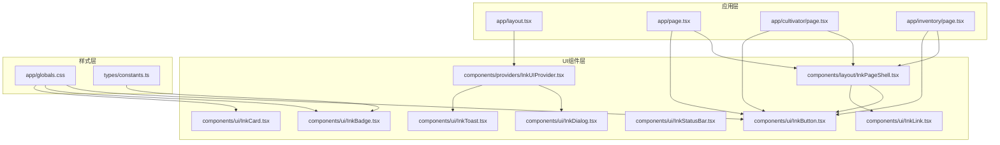
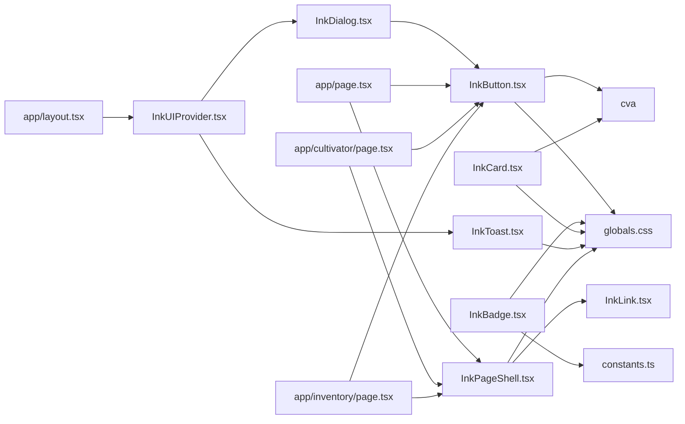

# 组件体系

<cite>
**本文引用的文件**
- [components/ui/InkButton.tsx](file://components/ui/InkButton.tsx)
- [components/ui/InkBadge.tsx](file://components/ui/InkBadge.tsx)
- [components/ui/InkCard.tsx](file://components/ui/InkCard.tsx)
- [components/ui/InkLink.tsx](file://components/ui/InkLink.tsx)
- [components/ui/InkStatusBar.tsx](file://components/ui/InkStatusBar.tsx)
- [components/ui/InkDialog.tsx](file://components/ui/InkDialog.tsx)
- [components/ui/InkToast.tsx](file://components/ui/InkToast.tsx)
- [components/layout/InkPageShell.tsx](file://components/layout/InkPageShell.tsx)
- [components/providers/InkUIProvider.tsx](file://components/providers/InkUIProvider.tsx)
- [app/globals.css](file://app/globals.css)
- [types/constants.ts](file://types/constants.ts)
</cite>

## 更新摘要
**变更内容**
- 更新了核心组件的实现机制，从旧的 `InkComponents.tsx` 单一文件重构为基于 `class-variance-authority` 的原子化组件体系
- 所有UI组件现位于 `components/ui/` 目录下，采用独立文件管理
- 组件样式逻辑由 `cva` 定义变体，提升类型安全与复用性
- 移除了已废弃的 `highlighted` 属性，统一使用 `variant` 控制外观
- 保留并优化了修仙主题的“文字化”视觉风格，包括方括号按钮、品阶颜色映射等

## 目录
1. [引言](#引言)
2. [项目结构](#项目结构)
3. [核心组件](#核心组件)
4. [架构总览](#架构总览)
5. [组件详解](#组件详解)
6. [依赖关系分析](#依赖关系分析)
7. [性能考量](#性能考量)
8. [故障排查指南](#故障排查指南)
9. [结论](#结论)
10. [附录](#附录)

## 引言
本文档系统性梳理重构后的“Ink系列”UI组件体系，围绕 `components/ui` 目录下的原子化组件，结合 `InkUIProvider.tsx` 的全局状态管理，解释各组件的职责、Props定义、视觉表现、交互行为与修仙主题样式实现机制。重点说明基于 `class-variance-authority` 的变体系统如何实现更一致的“文字化”视觉风格，并通过实际页面用例展示组件组合方式。同时阐述组件如何借助Tailwind CSS与自定义主题变量实现响应式设计与主题一致性。

## 项目结构
Ink系列组件现位于 `components/ui` 目录，每个组件独立为 `.tsx` 文件并通过 `index.ts` 导出；`InkUIProvider` 在应用根布局中注入全局状态与对话框/通知宿主；页面级组件通过 `InkPageShell.tsx` 提供统一的页面外壳与导航，页面内大量使用 `components/ui` 中的原子组件进行组合。

**图表来源**
- [app/layout.tsx](file://app/layout.tsx#L1-L33)
- [components/providers/InkUIProvider.tsx](file://components/providers/InkUIProvider.tsx#L1-L82)
- [components/ui/InkButton.tsx](file://components/ui/InkButton.tsx#L1-L80)
- [components/ui/InkBadge.tsx](file://components/ui/InkBadge.tsx#L1-L111)
- [components/layout/InkPageShell.tsx](file://components/layout/InkPageShell.tsx#L1-L106)
- [app/globals.css](file://app/globals.css#L1-L162)
- [types/constants.ts](file://types/constants.ts#L1-L191)

**章节来源**
- [app/layout.tsx](file://app/layout.tsx#L1-L33)
- [components/providers/InkUIProvider.tsx](file://components/providers/InkUIProvider.tsx#L1-L82)
- [components/ui/InkButton.tsx](file://components/ui/InkButton.tsx#L1-L80)
- [components/ui/InkBadge.tsx](file://components/ui/InkBadge.tsx#L1-L111)
- [components/layout/InkPageShell.tsx](file://components/layout/InkPageShell.tsx#L1-L106)
- [app/globals.css](file://app/globals.css#L1-L162)
- [types/constants.ts](file://types/constants.ts#L1-L191)

## 核心组件
本节对Ink系列核心组件进行概览，后续章节将逐个深入。

- InkButton：文字化按钮，支持多种变体与禁用态，可作为链接或按钮渲染，基于 `cva` 实现样式变体。
- InkLink：修仙风格链接，支持激活态与方括号/双角括号显示。
- InkCard：极简卡片容器，支持高亮强调与多种布局变体。
- InkBadge：品阶徽记，支持色调、紧凑、隐藏文本等，通过枚举映射到颜色类。
- InkStatusBar：状态条，支持堆叠布局与图标/提示。
- InkDialog：对话框，支持确认/取消、加载态、自动关闭，内部使用InkButton。
- InkToast/InkToastHost：通知提示与宿主容器，支持动作按钮与自动消失。
- InkPageShell：页面外壳组件，提供统一的头部、内容区、底部导航结构。
- InkUIProvider：全局状态提供者，管理对话框与通知状态。

**章节来源**
- [components/ui/InkButton.tsx](file://components/ui/InkButton.tsx#L1-L80)
- [components/ui/InkBadge.tsx](file://components/ui/InkBadge.tsx#L1-L111)
- [components/ui/InkCard.tsx](file://components/ui/InkCard.tsx#L1-L69)
- [components/layout/InkPageShell.tsx](file://components/layout/InkPageShell.tsx#L1-L106)
- [components/providers/InkUIProvider.tsx](file://components/providers/InkUIProvider.tsx#L1-L82)

## 架构总览
`InkUIProvider` 负责全局状态（toasts、dialogs），并通过上下文暴露 `pushToast`、`dismissToast`、`openDialog`、`closeDialog` 方法；`InkToastHost` 与 `InkDialog` 分别挂载在Provider子树末尾，实现全局可见与一次性渲染。页面通过 `InkPageShell.tsx` 提供统一外壳，内部组合 `components/ui` 的原子组件完成页面布局与交互。

**图表来源**
- [components/providers/InkUIProvider.tsx](file://components/providers/InkUIProvider.tsx#L1-L82)
- [components/ui/InkToast.tsx](file://components/ui/InkToast.tsx#L1-L94)
- [components/ui/InkDialog.tsx](file://components/ui/InkDialog.tsx#L1-L93)

**章节来源**
- [components/providers/InkUIProvider.tsx](file://components/providers/InkUIProvider.tsx#L1-L82)
- [components/ui/InkToast.tsx](file://components/ui/InkToast.tsx#L1-L94)
- [components/ui/InkDialog.tsx](file://components/ui/InkDialog.tsx#L1-L93)

## 组件详解

### InkButton（文字化按钮）
- 功能：提供统一的“方括号”风格按钮，既可作为链接也可作为按钮；支持变体（default/primary/secondary/outline/ghost）、禁用态与自定义类名。
- Props
  - children: ReactNode
  - onClick?: () => void
  - href?: string
  - disabled?: boolean
  - variant?: 'default' | 'primary' | 'secondary' | 'outline' | 'ghost'
  - className?: string
  - type?: 'button' | 'submit' | 'reset'
- 交互与视觉
  - 使用 `class-variance-authority` 的 `cva` 定义变体，确保类型安全与样式一致性。
  - 当传入 `href` 且未禁用时，渲染为带方括号样式的链接；否则渲染为按钮。
  - hover、禁用态、主色强调由CSS类控制。
- 适用场景
  - 页面快捷入口、操作按钮、返回链接等。

**章节来源**
- [components/ui/InkButton.tsx](file://components/ui/InkButton.tsx#L1-L80)
- [app/globals.css](file://app/globals.css#L1-L162)

### InkLink（修仙风格链接）
- 功能：文字化链接，支持 active 激活态；激活时使用双角括号包裹。
- Props
  - children: ReactNode
  - href: string
  - className?: string
  - active?: boolean
- 适用场景
  - 导航项、菜单链接。

**章节来源**
- [components/ui/InkLink.tsx](file://components/ui/InkLink.tsx#L1-L34)
- [app/globals.css](file://app/globals.css#L1-L162)

### InkCard（极简卡片）
- 功能：最小化视觉元素的卡片容器，支持高亮强调、多种布局与内边距。
- Props
  - children: ReactNode
  - className?: string
  - variant?: 'default' | 'highlighted' | 'elevated' | 'plain'
  - padding?: 'none' | 'sm' | 'md' | 'lg'
  - highlighted?: boolean (已废弃，建议使用 variant="highlighted")
- 适用场景
  - 信息区块容器、强调区域。

**章节来源**
- [components/ui/InkCard.tsx](file://components/ui/InkCard.tsx#L1-L69)
- [app/globals.css](file://app/globals.css#L1-L162)

### InkBadge（品阶徽记）
- 功能：徽记组件，支持色调（default/accent/warning/danger）、紧凑模式、隐藏文本、扩展文本等；根据传入的 Tier 映射到不同颜色类别。
- Props
  - children?: string
  - tier?: Tier（Quality | SpiritualRootGrade | SkillGrade | RealmType）
  - tierText?: string
  - tone?: 'default' | 'accent' | 'warning' | 'danger'
  - compact?: boolean
  - className?: string
  - hideTierText?: boolean
- 样式实现机制
  - 通过 `tierColorMap` 将枚举映射到CSS类名（如 fan/ling/xuan/zhen/di/tian/xian/shen），再由全局CSS控制颜色。
  - 未指定 `tier` 时，使用 `toneColorMap` 提供的色调。
- 适用场景
  - 境界、灵根、法宝品阶、技能品阶等标识。

**章节来源**
- [components/ui/InkBadge.tsx](file://components/ui/InkBadge.tsx#L1-L111)
- [types/constants.ts](file://types/constants.ts#L1-L191)
- [app/globals.css](file://app/globals.css#L1-L162)

### InkStatusBar（状态条）
- 功能：展示 HP/MP/寿元等状态，支持堆叠布局与图标/提示。
- Props
  - items: Array<{ label, value, icon?, hint? }>
  - stacked?: boolean
  - className?: string
- 适用场景
  - 角色状态展示、面板状态条。

**章节来源**
- [components/ui/InkStatusBar.tsx](file://components/ui/InkStatusBar.tsx#L1-L50)
- [app/globals.css](file://app/globals.css#L1-L162)

### InkDialog（对话框）
- 功能：全局对话框，支持标题、内容、确认/取消按钮、加载态与自动关闭；内部使用 InkButton 渲染操作按钮。
- Props
  - dialog: InkDialogState | null
  - onClose: () => void
- 交互行为
  - 通过 InkUIProvider 的 openDialog/closeDialog 管理；渲染在遮罩层之上，支持 ESC 关闭。
- 适用场景
  - 确认/取消、加载提示、帮助说明。

**章节来源**
- [components/ui/InkDialog.tsx](file://components/ui/InkDialog.tsx#L1-L93)
- [components/providers/InkUIProvider.tsx](file://components/providers/InkUIProvider.tsx#L1-L82)
- [app/globals.css](file://app/globals.css#L1-L162)

### InkToast / InkToastHost（通知提示）
- 功能：通知提示组件与宿主容器；支持消息、色调、动作按钮与自动消失。
- Props
  - InkToastData: id, message, tone?, actionLabel?, onAction?
  - InkToast: onDismiss(id)
  - InkToastHost: toasts, onDismiss
- 交互行为
  - 通过 InkUIProvider 的 pushToast/dismissToast 管理；InkToastHost 渲染所有通知，底部居中堆叠。
- 适用场景
  - 操作反馈、成功/警告/失败提示。

**章节来源**
- [components/ui/InkToast.tsx](file://components/ui/InkToast.tsx#L1-L94)
- [components/providers/InkUIProvider.tsx](file://components/providers/InkUIProvider.tsx#L1-L82)
- [app/globals.css](file://app/globals.css#L1-L162)

### InkPageShell（页面外壳）
- 功能：提供统一的页面布局结构，包含头部（标题、副标题、操作区）、主内容区和底部导航。
- Props
  - title: string
  - subtitle?: string
  - lead?: string
  - hero?: ReactNode
  - backHref?: string
  - note?: string
  - actions?: ReactNode
  - children: ReactNode
  - footer?: ReactNode
  - statusBar?: ReactNode
  - toolbar?: ReactNode
  - currentPath?: string
  - showBottomNav?: boolean
  - navItems?: Array<{ label: string; href: string }>
- 适用场景
  - 所有主要页面的布局容器，确保风格统一。

**章节来源**
- [components/layout/InkPageShell.tsx](file://components/layout/InkPageShell.tsx#L1-L106)
- [app/globals.css](file://app/globals.css#L1-L162)

## 依赖关系分析
- 组件耦合
  - `components/ui` 下的组件为独立的函数组件，通过 `cva` 实现样式变体，耦合度低、复用性强。
  - `InkDialog` 和 `InkToast` 依赖 `InkButton`，形成组件组合。
  - `InkUIProvider` 通过上下文暴露全局状态方法，被页面广泛使用。
- 外部依赖
  - Tailwind CSS 类名贯穿组件样式，全局CSS定义变量与主题色。
  - `types/constants.ts` 提供枚举与派生类型，用于 `InkBadge` 的 `tier` 映射。
  - `class-variance-authority` 库用于实现类型安全的样式变体。
- 潜在循环依赖
  - 组件间无直接循环导入；`InkUIProvider` 仅向下提供，不反向依赖页面。

**图表来源**
- [components/ui/InkButton.tsx](file://components/ui/InkButton.tsx#L1-L80)
- [components/ui/InkBadge.tsx](file://components/ui/InkBadge.tsx#L1-L111)
- [components/ui/InkCard.tsx](file://components/ui/InkCard.tsx#L1-L69)
- [components/ui/InkDialog.tsx](file://components/ui/InkDialog.tsx#L1-L93)
- [components/ui/InkToast.tsx](file://components/ui/InkToast.tsx#L1-L94)
- [components/layout/InkPageShell.tsx](file://components/layout/InkPageShell.tsx#L1-L106)
- [components/providers/InkUIProvider.tsx](file://components/providers/InkUIProvider.tsx#L1-L82)
- [app/page.tsx](file://app/page.tsx#L1-L317)
- [app/cultivator/page.tsx](file://app/cultivator/page.tsx#L1-L330)
- [app/inventory/page.tsx](file://app/inventory/page.tsx#L1-L638)
- [app/layout.tsx](file://app/layout.tsx#L1-L33)
- [types/constants.ts](file://types/constants.ts#L1-L191)
- [app/globals.css](file://app/globals.css#L1-L162)

**章节来源**
- [components/ui/InkButton.tsx](file://components/ui/InkButton.tsx#L1-L80)
- [components/ui/InkBadge.tsx](file://components/ui/InkBadge.tsx#L1-L111)
- [components/ui/InkCard.tsx](file://components/ui/InkCard.tsx#L1-L69)
- [components/ui/InkDialog.tsx](file://components/ui/InkDialog.tsx#L1-L93)
- [components/ui/InkToast.tsx](file://components/ui/InkToast.tsx#L1-L94)
- [components/layout/InkPageShell.tsx](file://components/layout/InkPageShell.tsx#L1-L106)
- [components/providers/InkUIProvider.tsx](file://components/providers/InkUIProvider.tsx#L1-L82)
- [app/page.tsx](file://app/page.tsx#L1-L317)
- [app/cultivator/page.tsx](file://app/cultivator/page.tsx#L1-L330)
- [app/inventory/page.tsx](file://app/inventory/page.tsx#L1-L638)
- [app/layout.tsx](file://app/layout.tsx#L1-L33)
- [types/constants.ts](file://types/constants.ts#L1-L191)
- [app/globals.css](file://app/globals.css#L1-L162)

## 性能考量
- 组件渲染
  - `components/ui` 组件多为轻量纯函数组件，Props传递简单，渲染成本低。
  - `InkToastHost` 与 `InkDialog` 仅在存在数据时渲染，避免不必要的DOM。
- 状态管理
  - `InkUIProvider` 使用 `useState` 与 `useMemo` 缓存上下文值，减少重渲染。
- 样式
  - 使用 `class-variance-authority` 预定义变体，避免运行时字符串拼接，提升性能。
  - Tailwind类名集中于组件 `className`，CSS通过变量与主题色控制，减少运行时计算。

[本节为通用建议，无需特定文件来源]

## 故障排查指南
- 按钮点击无效
  - 检查 `disabled` 是否为 `true`；检查 `onClick` 是否正确传入。
  - 参考路径：[components/ui/InkButton.tsx](file://components/ui/InkButton.tsx#L1-L80)
- 链接未生效
  - 确认 `href` 是否传入；`active` 为 `true` 时显示双角括号。
  - 参考路径：[components/ui/InkLink.tsx](file://components/ui/InkLink.tsx#L1-L34)
- Badge 颜色异常
  - 确认 `tier` 是否在枚举范围内；检查 `tierColorMap` 映射是否正确。
  - 参考路径：[components/ui/InkBadge.tsx](file://components/ui/InkBadge.tsx#L1-L111)，[types/constants.ts](file://types/constants.ts#L1-L191)
- Toast 不显示
  - 确认已在 `InkUIProvider` 下使用；检查 `pushToast` 调用与 `onDismiss` 传参。
  - 参考路径：[components/providers/InkUIProvider.tsx](file://components/providers/InkUIProvider.tsx#L1-L82)，[components/ui/InkToast.tsx](file://components/ui/InkToast.tsx#L1-L94)
- Dialog 不出现
  - 确认 `openDialog` 已调用并传入 `id`；`onClose` 是否正确关闭。
  - 参考路径：[components/providers/InkUIProvider.tsx](file://components/providers/InkUIProvider.tsx#L1-L82)，[components/ui/InkDialog.tsx](file://components/ui/InkDialog.tsx#L1-L93)
- 页面布局错乱
  - 检查是否使用了 `InkPageShell`；`variant` 和 `padding` 参数是否正确。
  - 参考路径：[components/layout/InkPageShell.tsx](file://components/layout/InkPageShell.tsx#L1-L106)

**章节来源**
- [components/ui/InkButton.tsx](file://components/ui/InkButton.tsx#L1-L80)
- [components/ui/InkLink.tsx](file://components/ui/InkLink.tsx#L1-L34)
- [components/ui/InkBadge.tsx](file://components/ui/InkBadge.tsx#L1-L111)
- [components/ui/InkDialog.tsx](file://components/ui/InkDialog.tsx#L1-L93)
- [components/ui/InkToast.tsx](file://components/ui/InkToast.tsx#L1-L94)
- [components/layout/InkPageShell.tsx](file://components/layout/InkPageShell.tsx#L1-L106)
- [components/providers/InkUIProvider.tsx](file://components/providers/InkUIProvider.tsx#L1-L82)
- [types/constants.ts](file://types/constants.ts#L1-L191)

## 结论
重构后的Ink系列组件以“文字化”为核心风格，通过 `class-variance-authority` 实现类型安全的样式变体，提升了组件的一致性与可维护性。`InkUIProvider` 将通知与对话框抽象为全局状态，`InkPageShell` 提供统一的页面外壳与导航。页面通过组合这些原子化组件快速搭建统一风格的修仙主题界面，具备良好的可维护性、扩展性与性能表现。

[本节为总结，无需特定文件来源]

## 附录

### 组件与样式映射关系
- InkButton -> .ink-button, .ink-button-primary, .ink-button-secondary, .ink-button-disabled
- InkLink -> .ink-link, .ink-link-active
- InkCard -> .ink-card, .ink-card-highlighted
- InkBadge -> .ink-badge, .ink-badge-tier-*, .ink-badge-*（tone）
- InkStatusBar -> .ink-status-bar, .ink-status-bar-stacked, .ink-status-item, .ink-status-icon, .ink-status-hint
- InkToast/Host -> .ink-toast-host, .ink-toast, .ink-toast-*(tone), .ink-toast-actions button
- InkDialog -> .ink-dialog-overlay, .ink-dialog, .ink-dialog-title, .ink-dialog-content, .ink-dialog-actions
- InkPageShell -> .ink-page-shell, .ink-page-header, .ink-page-footer

**章节来源**
- [components/ui/InkButton.tsx](file://components/ui/InkButton.tsx#L1-L80)
- [components/ui/InkCard.tsx](file://components/ui/InkCard.tsx#L1-L69)
- [components/ui/InkBadge.tsx](file://components/ui/InkBadge.tsx#L1-L111)
- [components/layout/InkPageShell.tsx](file://components/layout/InkPageShell.tsx#L1-L106)
- [app/globals.css](file://app/globals.css#L1-L162)

### 页面组合示例（路径指引）
- 首页（页面外壳 + 状态条 + 按钮 + 对话框 + Toast）
  - [app/page.tsx](file://app/page.tsx#L1-L317)
- 道身页（页面外壳 + 属性面板 + 状态条 + 对话框）
  - [app/cultivator/page.tsx](file://app/cultivator/page.tsx#L1-L330)
- 储物袋页（页面外壳 + 标签页 + 列表 + 对话框）
  - [app/inventory/page.tsx](file://app/inventory/page.tsx#L1-L638)

**章节来源**
- [app/page.tsx](file://app/page.tsx#L1-L317)
- [app/cultivator/page.tsx](file://app/cultivator/page.tsx#L1-L330)
- [app/inventory/page.tsx](file://app/inventory/page.tsx#L1-L638)