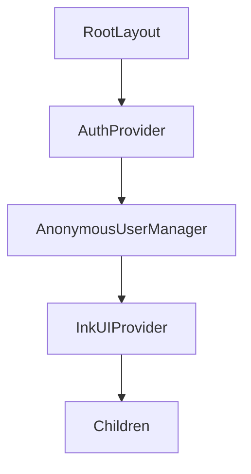
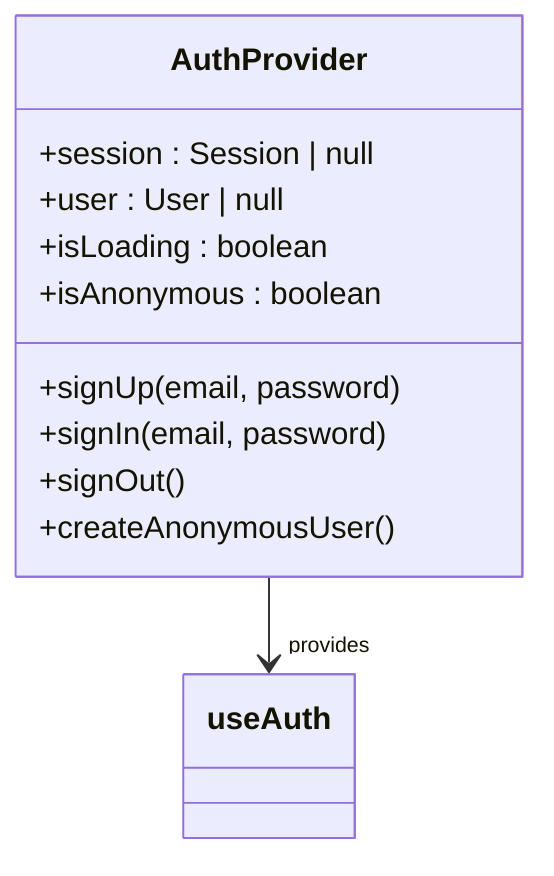
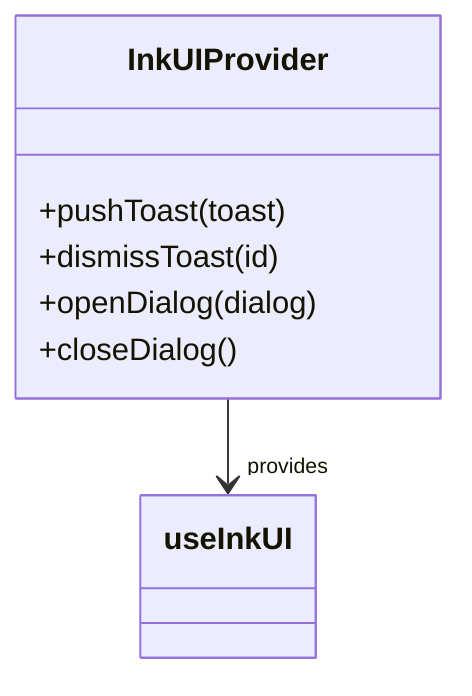
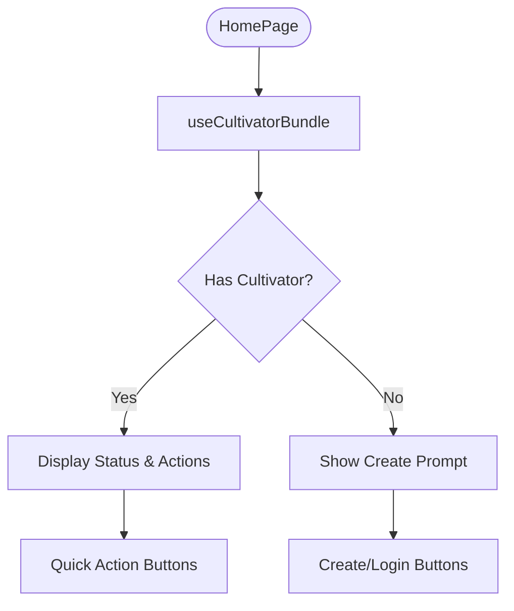
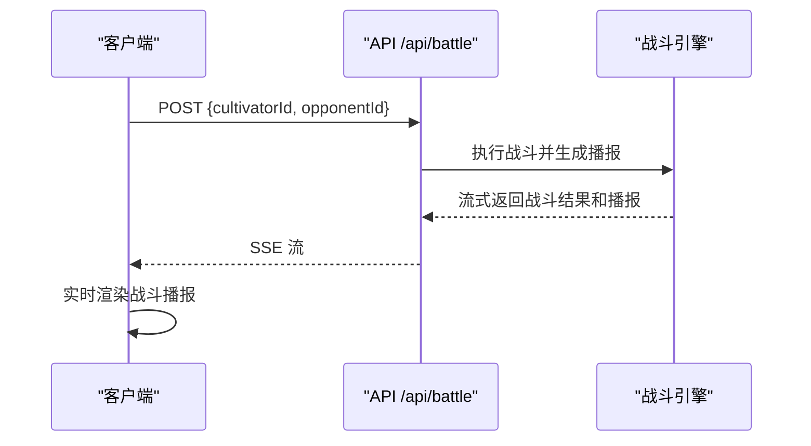
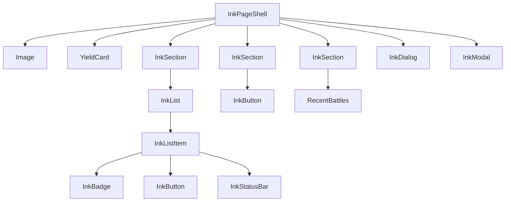

# 页面结构

<cite>
**本文档引用的文件**   
- [layout.tsx](file://app/layout.tsx)
- [page.tsx](file://app/page.tsx)
- [battle/page.tsx](file://app/battle/page.tsx)
- [cultivator/page.tsx](file://app/cultivator/page.tsx)
- [inventory/page.tsx](file://app/inventory/page.tsx)
- [InkUIProvider.tsx](file://components/InkUIProvider.tsx)
- [AuthContext.tsx](file://lib/auth/AuthContext.tsx)
- [useCultivatorBundle.ts](file://lib/hooks/useCultivatorBundle.ts)
- [BattlePageLayout.tsx](file://components/BattlePageLayout.tsx)
- [InkLayout.tsx](file://components/InkLayout.tsx)
</cite>

## 目录
1. [项目结构概览](#项目结构概览)
2. [根布局与全局状态提供](#根布局与全局状态提供)
3. [核心页面分析](#核心页面分析)
4. [组件树与数据流](#组件树与数据流)
5. [服务器与客户端组件混合策略](#服务器与客户端组件混合策略)
6. [性能优化建议](#性能优化建议)

## 项目结构概览

本项目采用 Next.js App Router 架构，页面路由通过 `app/` 目录下的文件夹结构定义。每个功能模块（如 `/battle`、`/cultivator`、`/inventory`）均对应一个独立的页面目录，其中 `page.tsx` 为该路由的入口文件。API 路由则位于 `app/api/` 目录下，遵循 RESTful 风格。

```
app/
├── battle/
│   ├── [id]/page.tsx
│   ├── challenge/page.tsx
│   ├── history/page.tsx
│   └── page.tsx
├── cultivator/page.tsx
├── inventory/page.tsx
├── layout.tsx
└── page.tsx
```

这种结构清晰地分离了不同功能区域，便于维护和扩展。`layout.tsx` 文件作为根布局，为整个应用提供统一的 UI 框架和全局状态。

**Section sources**
- [layout.tsx](file://app/layout.tsx)
- [page.tsx](file://app/page.tsx)

## 根布局与全局状态提供

根布局文件 `app/layout.tsx` 是整个应用的入口点，它通过嵌套的 Provider 组件为所有子页面提供全局状态和上下文。



**Diagram sources**
- [layout.tsx](file://app/layout.tsx#L1-L33)

### 认证上下文 (AuthProvider)

`AuthProvider` 来自 `lib/auth/AuthContext.tsx`，它使用 Supabase 进行用户认证管理。该 Provider 提供了用户会话、登录、登出等核心功能，并通过 `useAuth` Hook 供其他组件使用。



**Diagram sources**
- [AuthContext.tsx](file://lib/auth/AuthContext.tsx#L1-L134)

### UI 全局状态 (InkUIProvider)

`InkUIProvider` 来自 `components/InkUIProvider.tsx`，它管理应用内的 UI 状态，如 Toast 通知和 Dialog 对话框。通过 `useInkUI` Hook，任何组件都可以触发 UI 反馈。



**Diagram sources**
- [InkUIProvider.tsx](file://components/InkUIProvider.tsx#L1-L82)

### 匿名用户管理

`AnonymousUserManager` 组件在用户未登录时自动创建一个匿名会话，确保所有用户都能立即开始游戏体验，无需强制注册。

**Section sources**
- [layout.tsx](file://app/layout.tsx#L1-L33)
- [AuthContext.tsx](file://lib/auth/AuthContext.tsx#L1-L134)
- [InkUIProvider.tsx](file://components/InkUIProvider.tsx#L1-L82)
- [AnonymousUserManager.tsx](file://components/AnonymousUserManager.tsx#L1-L20)

## 核心页面分析

### 主页 (/)

主页 `app/page.tsx` 是应用的中心枢纽，它展示了玩家的核心信息和快捷入口。该页面是一个客户端组件（`'use client'`），因为它需要与用户进行交互。



**Diagram sources**
- [page.tsx](file://app/page.tsx#L1-L317)

### 战斗页面 (/battle)

`app/battle/page.tsx` 是一个典型的客户端组件，负责处理实时战斗逻辑。它通过 `useSearchParams` 获取对手 ID，并自动发起战斗请求。

#### 组件构成
- **BattlePageLayout**: 统一的页面布局，包含标题、返回按钮和操作区。
- **BattleTimelineViewer**: 可交互的战斗回放组件，显示每回合的 HP/MP 变化。
- **BattleReportViewer**: 流式渲染的战斗播报，使用 Server-Sent Events (SSE) 实时更新。



**Diagram sources**
- [battle/page.tsx](file://app/battle/page.tsx#L1-L313)
- [BattlePageLayout.tsx](file://components/BattlePageLayout.tsx#L1-L104)
- [BattleTimelineViewer.tsx](file://components/BattleTimelineViewer.tsx#L1-L141)
- [BattleReportViewer.tsx](file://components/BattleReportViewer.tsx#L1-L108)

### 角色页面 (/cultivator)

`app/cultivator/page.tsx` 展示了玩家角色的详细信息，包括灵根、命格、属性和装备。它使用 `useCultivatorBundle` Hook 获取完整的角色数据。

#### 数据获取流程
1. 调用 `/api/cultivators` 获取角色基本信息。
2. 并行调用 `/api/cultivators/[id]/inventory` 和 `/api/cultivators/[id]/history` 获取背包和历史记录。
3. 计算最终属性（考虑功法、法宝、命格加成）。

```mermaid
flowchart LR
A[useCultivatorBundle] --> B[/api/cultivators]
A --> C[/api/cultivators/[id]/inventory]
A --> D[/api/cultivators/[id]/history]
B --> E[角色基础数据]
C --> F[背包数据]
D --> G[历史记录]
E & F & G --> H[合并为完整角色数据]
```

**Diagram sources**
- [cultivator/page.tsx](file://app/cultivator/page.tsx#L1-L330)
- [useCultivatorBundle.ts](file://lib/hooks/useCultivatorBundle.ts#L1-L351)

### 背包页面 (/inventory)

`app/inventory/page.tsx` 允许玩家管理其物品，包括法宝、材料和丹药。它支持装备/卸下、服用和丢弃等操作。

#### 交互逻辑
- **标签页**: 使用 `InkTabs` 组件在不同物品类型间切换。
- **模态框**: 点击物品详情时，通过 `InkModal` 显示详细信息。
- **确认对话框**: 执行危险操作（如丢弃）时，弹出 `InkDialog` 进行确认。

**Section sources**
- [inventory/page.tsx](file://app/inventory/page.tsx#L1-L638)
- [InkComponents.tsx](file://components/InkComponents.tsx#L1-L665)

## 组件树与数据流

以主页为例，其组件树结构如下：



**Diagram sources**
- [page.tsx](file://app/page.tsx#L1-L317)
- [InkLayout.tsx](file://components/InkLayout.tsx#L1-L111)

数据流始于 `useCultivatorBundle` Hook，它从多个 API 端点获取数据并合并成一个完整的状态对象，然后通过 React 的 props 传递给各个子组件。

## 服务器与客户端组件混合策略

本项目巧妙地结合了服务器端渲染 (SSR) 和客户端组件 (Client Components) 的优势。

### 服务器端渲染 (SSR)
- **优势**: 提升首屏加载速度和 SEO。
- **应用场景**: 静态内容和非交互性页面。
- **实现**: 默认情况下，`page.tsx` 文件是服务器组件。例如，`app/battle/[id]/page.tsx` 在服务器端获取战斗记录并生成静态 HTML。

### 客户端组件 (Client Components)
- **优势**: 支持交互性和实时更新。
- **应用场景**: 需要用户交互或实时数据的页面。
- **实现**: 通过 `'use client'` 指令声明。例如，`app/page.tsx` 和 `app/battle/page.tsx` 都是客户端组件，因为它们需要处理用户点击和实时战斗流。

#### 混合策略示例
在 `app/battle/page.tsx` 中：
1. 页面骨架由服务器端渲染。
2. 战斗逻辑和实时播报由客户端组件处理。
3. 使用 `Suspense` 包裹客户端组件，提供加载状态。

```tsx
export default function BattlePage() {
  return (
    <Suspense fallback={<Loading />}>
      <BattlePageContent />
    </Suspense>
  );
}
```

**Section sources**
- [page.tsx](file://app/page.tsx#L1-L317)
- [battle/page.tsx](file://app/battle/page.tsx#L1-L313)
- [battle/[id]/page.tsx](file://app/battle/[id]/page.tsx#L1-L103)

## 性能优化建议

1. **懒加载与动态导入**: 对于大型组件（如 `BattleTimelineViewer`），可以使用 `lazy` 和 `Suspense` 进行懒加载，减少初始包体积。
2. **数据缓存**: `useCultivatorBundle` 已经实现了模块级缓存，避免不必要的重复请求。可以进一步利用 React Query 或 SWR 进行更精细的缓存管理。
3. **代码分割**: 利用 Next.js 的自动代码分割功能，确保每个页面只加载其所需的代码。
4. **图片优化**: 使用 Next.js 的 `next/image` 组件进行图片懒加载和格式优化。
5. **减少重渲染**: 使用 `React.memo` 和 `useCallback` 优化子组件的重渲染。

**Section sources**
- [useCultivatorBundle.ts](file://lib/hooks/useCultivatorBundle.ts#L1-L351)
- [page.tsx](file://app/page.tsx#L1-L317)
- [battle/page.tsx](file://app/battle/page.tsx#L1-L313)