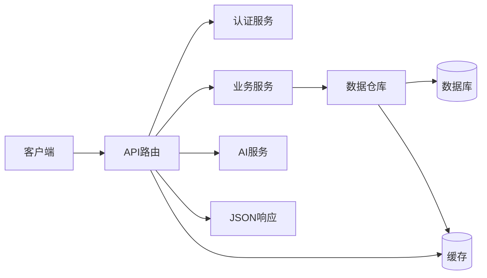
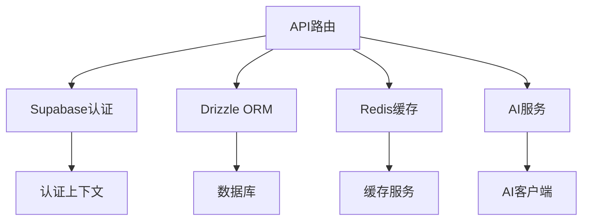

# API路由设计

<cite>
**本文档中引用的文件**  
- [app/api/cultivators/route.ts](file://app/api/cultivators/route.ts)
- [app/api/battle/route.ts](file://app/api/battle/route.ts)
- [app/api/battles/route.ts](file://app/api/battles/route.ts)
- [app/api/battles/[id]/route.ts](file://app/api/battles/[id]/route.ts)
- [app/api/cultivators/[id]/inventory/discard/route.ts](file://app/api/cultivators/[id]/inventory/discard/route.ts)
- [app/api/mail/route.ts](file://app/api/mail/route.ts)
- [app/api/mail/[id]/claim/route.ts](file://app/api/mail/[id]/claim/route.ts)
- [app/api/market/buy/route.ts](file://app/api/market/buy/route.ts)
- [app/api/rankings/route.ts](file://app/api/rankings/route.ts)
- [app/api/cultivators/yield/route.ts](file://app/api/cultivators/yield/route.ts)
- [app/api/divine-fortune/route.ts](file://app/api/divine-fortune/route.ts)
- [app/api/save-character/route.ts](file://app/api/save-character/route.ts)
- [app/api/generate-character/route.ts](file://app/api/generate-character/route.ts)
- [vercel.json](file://vercel.json)
</cite>

## 目录
1. [简介](#简介)
2. [项目结构](#项目结构)
3. [核心组件](#核心组件)
4. [架构概述](#架构概述)
5. [详细组件分析](#详细组件分析)
6. [依赖分析](#依赖分析)
7. [性能考虑](#性能考虑)
8. [故障排除指南](#故障排除指南)
9. [结论](#结论)

## 简介
本文档详细阐述了基于Next.js App Router的API路由设计，聚焦于RESTful接口的实现机制。文档涵盖API路由如何处理HTTP方法、解析请求参数、实现动态与嵌套路由、集成认证与错误处理，并说明其在Vercel环境下的性能表现与限制。

## 项目结构

Next.js应用的API路由遵循约定优于配置的原则，所有API端点均位于`app/api`目录下，每个`route.ts`文件对应一个RESTful接口。文件路径直接映射为URL路径，支持动态参数和嵌套路由。

```mermaid
graph TB
subgraph "API路由结构"
A[app/api]
A --> B[battle/route.ts]
A --> C[battles/[id]/route.ts]
A --> D[battles/route.ts]
A --> E[cultivators/route.ts]
A --> F[cultivators/[id]/inventory/discard/route.ts]
A --> G[mail/route.ts]
A --> H[mail/[id]/claim/route.ts]
A --> I[market/buy/route.ts]
A --> J[rankings/route.ts]
end
```

**图示来源**
- [app/api/cultivators/route.ts](file://app/api/cultivators/route.ts)
- [app/api/battle/route.ts](file://app/api/battle/route.ts)
- [app/api/battles/route.ts](file://app/api/battles/route.ts)
- [app/api/battles/[id]/route.ts](file://app/api/battles/[id]/route.ts)

## 核心组件

API路由作为控制器层，负责处理HTTP请求、调用服务层业务逻辑、返回JSON响应。每个`route.ts`文件导出对应HTTP方法的处理函数（如`GET`、`POST`），实现RESTful接口。

**核心功能包括：**
- 用户身份认证与授权
- 请求参数验证与解析
- 调用数据访问层（Repository）或服务层（Service）
- 事务处理与并发控制
- 错误处理与安全响应
- 流式响应（SSE）支持

**组件来源**
- [app/api/cultivators/route.ts](file://app/api/cultivators/route.ts#L1-L147)
- [app/api/battle/route.ts](file://app/api/battle/route.ts#L1-L172)
- [app/api/market/buy/route.ts](file://app/api/market/buy/route.ts#L1-L182)

## 架构概述

API路由层位于前端与数据层之间，作为系统的控制中枢。它接收客户端请求，经过认证和验证后，调用下层服务处理业务逻辑，最终返回标准化的JSON响应。



**图示来源**
- [app/api/cultivators/route.ts](file://app/api/cultivators/route.ts)
- [app/api/battle/route.ts](file://app/api/battle/route.ts)
- [app/api/divine-fortune/route.ts](file://app/api/divine-fortune/route.ts)
- [app/api/market/buy/route.ts](file://app/api/market/buy/route.ts)

## 详细组件分析

### RESTful接口实现

API路由通过导出`GET`、`POST`、`DELETE`等函数来处理对应HTTP方法。每个函数接收`NextRequest`对象，返回`NextResponse`或`Response`。

#### 示例：获取角色列表
```typescript
export async function GET(request: NextRequest) {
  // 认证用户
  // 解析查询参数
  // 调用数据仓库获取数据
  // 返回JSON响应
}
```

**组件来源**
- [app/api/cultivators/route.ts](file://app/api/cultivators/route.ts#L15-L90)

### 动态路由与参数解析

使用方括号`[param]`定义动态路由参数。参数通过`params`对象在请求处理函数中获取。

#### 示例：根据ID获取战斗记录
```typescript
export async function GET(req: Request, ctx: { params: Promise<{ id: string }> }) {
  const { id } = await ctx.params;
  // 使用id查询数据库
}
```

**组件来源**
- [app/api/battles/[id]/route.ts](file://app/api/battles/[id]/route.ts#L11-L47)

### 嵌套路由设计

嵌套路由通过目录结构实现，支持复杂的资源层级。例如`cultivators/[id]/inventory/discard`表示对特定角色的物品进行丢弃操作。

#### 设计逻辑
- `cultivators/[id]`：角色资源
- `inventory`：角色的物品子资源
- `discard`：物品的丢弃操作

这种设计符合RESTful资源层级规范，使URL语义清晰。

**组件来源**
- [app/api/cultivators/[id]/inventory/discard/route.ts](file://app/api/cultivators/[id]/inventory/discard/route.ts#L7-L115)

### 控制器层与业务逻辑分离

API路由作为控制器，不包含核心业务逻辑，而是调用`lib/services`或`lib/repositories`中的服务。

#### 示例：邮件领取
```typescript
// API路由调用服务
await MailService.sendMail(...);
```

**组件来源**
- [app/api/mail/[id]/claim/route.ts](file://app/api/mail/[id]/claim/route.ts#L56-L154)
- [app/api/save-character/route.ts](file://app/api/save-character/route.ts#L100-L106)

### JSON响应结构

所有API返回标准化的JSON响应，包含`success`、`data`、`error`等字段，便于前端统一处理。

```json
{
  "success": true,
  "data": { ... }
}
```

或

```json
{
  "success": false,
  "error": "错误信息"
}
```

**组件来源**
- [app/api/cultivators/route.ts](file://app/api/cultivators/route.ts#L45-L52)
- [app/api/battles/route.ts](file://app/api/battles/route.ts#L89-L98)

## 依赖分析

API路由依赖多个核心模块，形成清晰的依赖链。



**图示来源**
- [app/api/cultivators/route.ts](file://app/api/cultivators/route.ts#L7)
- [app/api/battle/route.ts](file://app/api/battle/route.ts#L2)
- [app/api/market/buy/route.ts](file://app/api/market/buy/route.ts#L3)
- [app/api/divine-fortune/route.ts](file://app/api/divine-fortune/route.ts#L2)

## 性能考虑

### 流式响应（SSE）
对于耗时操作（如战斗播报生成），使用Server-Sent Events（SSE）流式传输数据，提升用户体验。

```typescript
const stream = new ReadableStream({ ... });
return new Response(stream, { headers: { 'Content-Type': 'text/event-stream' } });
```

**组件来源**
- [app/api/battle/route.ts](file://app/api/battle/route.ts#L54-L148)
- [app/api/cultivators/yield/route.ts](file://app/api/cultivators/yield/route.ts#L131-L180)

### 缓存策略
使用Redis缓存频繁访问的数据（如排行榜、天机），减少数据库压力。

```typescript
const cached = await redis.get(CACHE_KEY);
if (cached) return cached;
```

**组件来源**
- [app/api/rankings/route.ts](file://app/api/rankings/route.ts#L11)
- [app/api/divine-fortune/route.ts](file://app/api/divine-fortune/route.ts#L21-L28)

### 并发控制
使用Redis分布式锁防止并发操作导致的数据不一致。

```typescript
const acquired = await redis.set(lockKey, 'locked', { nx: true, ex: 10 });
if (!acquired) return 429;
```

**组件来源**
- [app/api/market/buy/route.ts](file://app/api/market/buy/route.ts#L37-L47)
- [app/api/cultivators/yield/route.ts](file://app/api/cultivators/yield/route.ts#L40-L47)

### Vercel部署限制
- **冷启动**：无服务器函数可能有冷启动延迟
- **执行时间**：最长10秒（Pro）或60秒（Enterprise）
- **并发**：受配额限制
- **定时任务**：通过`vercel.json`配置

```json
{
  "crons": [
    { "path": "/api/market", "schedule": "0 1 * * *" }
  ]
}
```

**组件来源**
- [vercel.json](file://vercel.json#L3-L12)

## 故障排除指南

### 认证失败
- 检查Supabase会话是否有效
- 确保请求包含正确的认证凭据

### 参数验证错误
- 检查请求体和查询参数格式
- 验证必填字段是否存在

### 数据库操作失败
- 检查外键约束和数据完整性
- 验证事务边界和锁机制

### 缓存不一致
- 检查缓存失效策略
- 验证缓存与数据库同步

**组件来源**
- [app/api/cultivators/route.ts](file://app/api/cultivators/route.ts#L77-L89)
- [app/api/battle/route.ts](file://app/api/battle/route.ts#L130-L144)
- [app/api/market/buy/route.ts](file://app/api/market/buy/route.ts#L174-L179)

## 结论
本项目通过Next.js App Router实现了清晰、可维护的API路由设计。采用RESTful架构，结合动态路由、嵌套路由、流式响应和缓存策略，构建了高性能、高可用的后端接口。通过合理的分层设计，实现了业务逻辑与控制器的分离，确保了代码的可测试性和可扩展性。