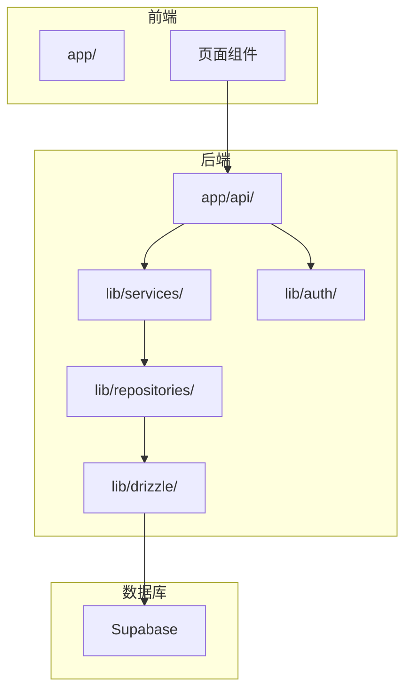
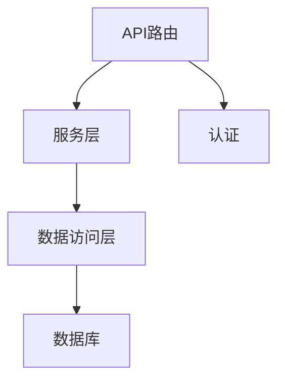
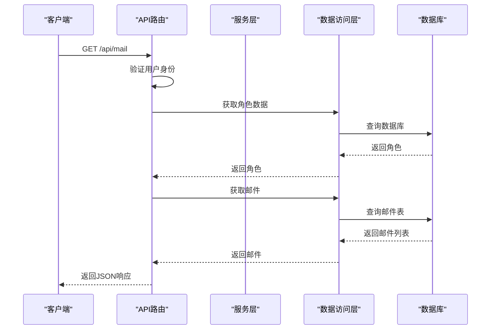
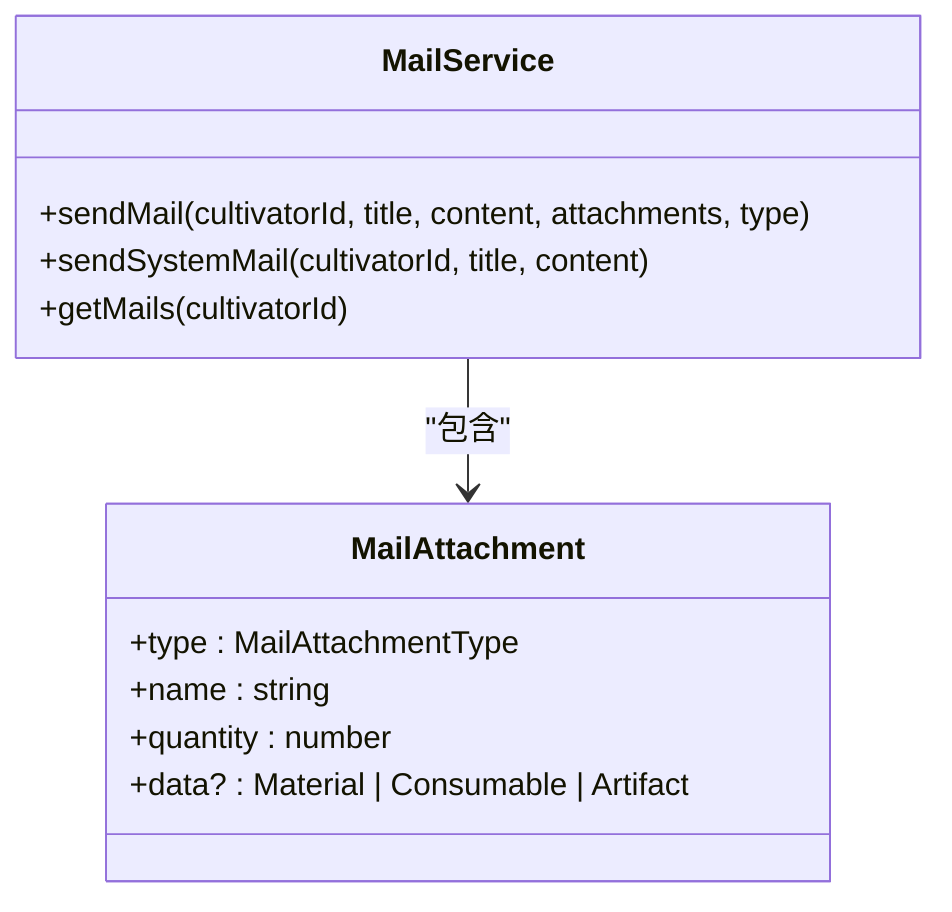
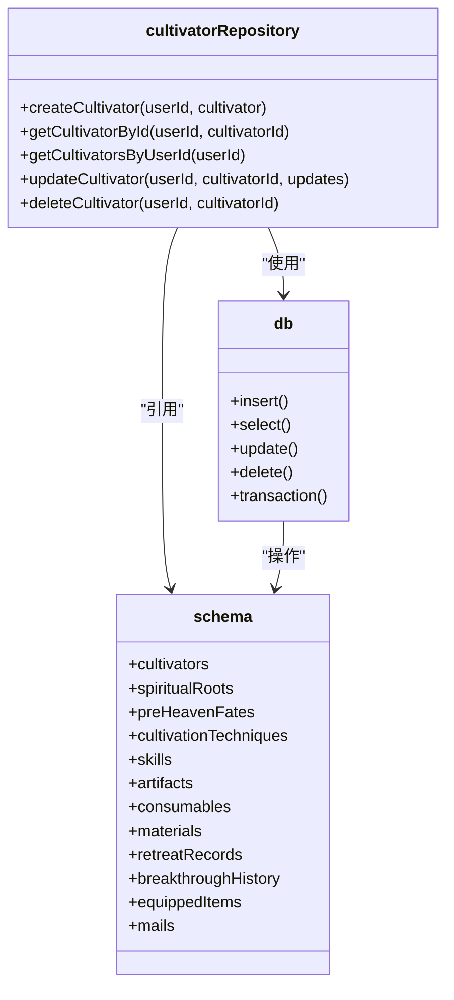
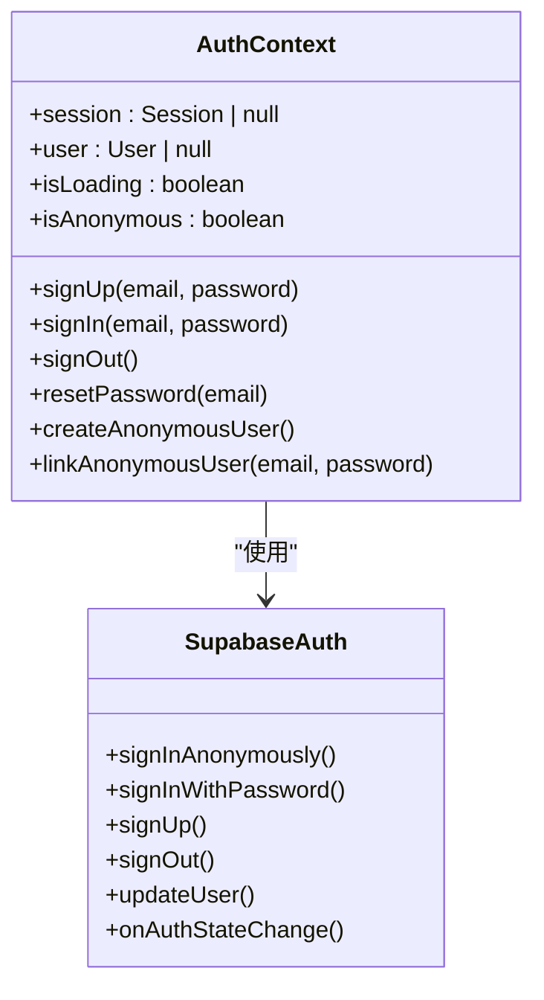
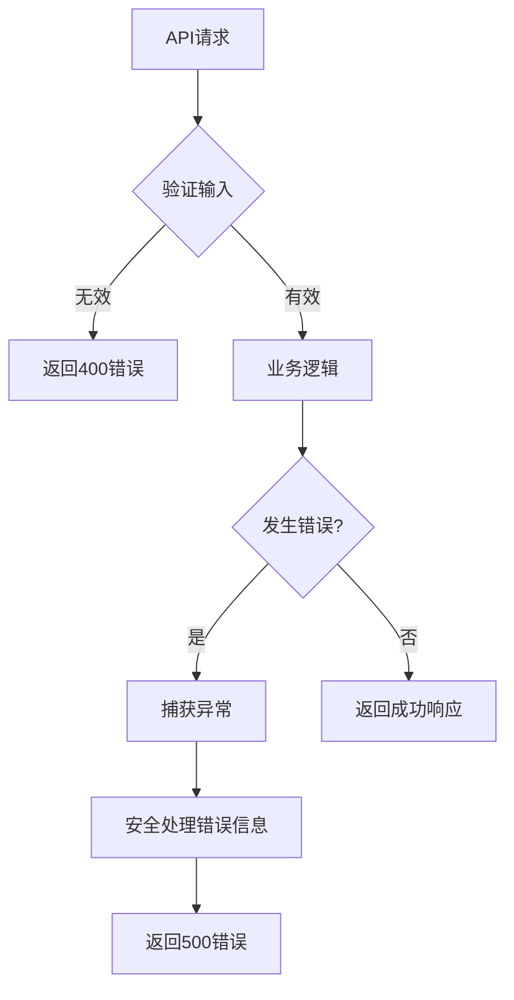

# 后端架构

<cite>
**本文档中引用的文件**  
- [app/api/mail/route.ts](file://app/api/mail/route.ts)
- [app/api/market/route.ts](file://app/api/market/route.ts)
- [app/api/generate-character/route.ts](file://app/api/generate-character/route.ts)
- [app/api/save-character/route.ts](file://app/api/save-character/route.ts)
- [lib/services/MailService.ts](file://lib/services/MailService.ts)
- [lib/repositories/cultivatorRepository.ts](file://lib/repositories/cultivatorRepository.ts)
- [lib/drizzle/db.ts](file://lib/drizzle/db.ts)
- [lib/drizzle/schema.ts](file://lib/drizzle/schema.ts)
- [lib/auth/AuthContext.tsx](file://lib/auth/AuthContext.tsx)
- [lib/supabase/server.ts](file://lib/supabase/server.ts)
</cite>

## 目录
1. [项目结构](#项目结构)
2. [分层架构设计](#分层架构设计)
3. [API路由与控制器](#api路由与控制器)
4. [服务层](#服务层)
5. [数据访问层](#数据访问层)
6. [认证与会话管理](#认证与会话管理)
7. [错误处理与日志记录](#错误处理与日志记录)
8. [架构优势](#架构优势)

## 项目结构

项目采用Next.js App Router架构，后端逻辑主要分布在`app/api`目录下的API路由文件中。业务逻辑被分层组织在`lib`目录下，包括服务层（`services`）、数据访问层（`repositories`）、数据库配置（`drizzle`）和认证（`auth`）等模块。数据模型定义在`types`目录中，数据库迁移文件位于`drizzle`目录。

**图示来源**
- [app/api/](file://app/api/)
- [lib/services/](file://lib/services/)
- [lib/repositories/](file://lib/repositories/)
- [lib/drizzle/](file://lib/drizzle/)

**本节来源**
- [app/api/](file://app/api/)
- [lib/](file://lib/)

## 分层架构设计

本系统采用典型的三层架构设计：API路由作为控制器层、服务层封装业务逻辑、数据访问层处理数据持久化。这种分层设计实现了高内聚、低耦合，使得各层职责清晰，便于维护和扩展。

**图示来源**
- [app/api/](file://app/api/)
- [lib/services/](file://lib/services/)
- [lib/repositories/](file://lib/repositories/)

**本节来源**
- [app/api/](file://app/api/)
- [lib/services/](file://lib/services/)
- [lib/repositories/](file://lib/repositories/)

## API路由与控制器

Next.js的API路由（位于`app/api/`目录）充当MVC模式中的控制器角色，负责处理HTTP请求、验证输入、调用服务层并返回响应。每个路由文件对应一个或多个API端点。

例如，`/api/mail/route.ts`处理邮件相关的GET请求，验证用户身份后调用数据访问层获取邮件数据：

**图示来源**
- [app/api/mail/route.ts](file://app/api/mail/route.ts)
- [lib/repositories/cultivatorRepository.ts](file://lib/repositories/cultivatorRepository.ts)

**本节来源**
- [app/api/mail/route.ts](file://app/api/mail/route.ts)
- [app/api/generate-character/route.ts](file://app/api/generate-character/route.ts)
- [app/api/save-character/route.ts](file://app/api/save-character/route.ts)

## 服务层

服务层（位于`lib/services/`）封装了核心业务逻辑，协调多个数据仓库完成复杂的业务操作。服务层是无状态的，通过静态方法提供服务。

`MailService.ts`是一个典型的服务类，提供了发送邮件、获取邮件等业务方法：

服务层通过调用数据访问层来持久化数据，例如`MailService`使用`db`实例插入邮件记录。`save-character`路由在保存角色后调用`MailService.sendMail`发放新手礼包，体现了服务层的复用性。

**图示来源**
- [lib/services/MailService.ts](file://lib/services/MailService.ts)
- [lib/drizzle/db.ts](file://lib/drizzle/db.ts)

**本节来源**
- [lib/services/MailService.ts](file://lib/services/MailService.ts)
- [app/api/save-character/route.ts](file://app/api/save-character/route.ts)

## 数据访问层

数据访问层（位于`lib/repositories/`）负责与数据库交互，封装了数据访问细节。该层使用Drizzle ORM作为数据库抽象层，通过`db.ts`创建的实例与Supabase数据库通信。

`cultivatorRepository.ts`是主要的数据访问组件，提供了创建、获取、更新和删除角色的方法。它使用Drizzle ORM的查询构建器来操作数据库：

`db.ts`文件创建了Drizzle实例，配置了与PostgreSQL数据库的连接。`schema.ts`定义了所有数据库表的结构，与Supabase中的表对应。这种设计使得数据访问逻辑集中管理，便于维护和测试。

**图示来源**
- [lib/repositories/cultivatorRepository.ts](file://lib/repositories/cultivatorRepository.ts)
- [lib/drizzle/db.ts](file://lib/drizzle/db.ts)
- [lib/drizzle/schema.ts](file://lib/drizzle/schema.ts)

**本节来源**
- [lib/repositories/cultivatorRepository.ts](file://lib/repositories/cultivatorRepository.ts)
- [lib/drizzle/db.ts](file://lib/drizzle/db.ts)
- [lib/drizzle/schema.ts](file://lib/drizzle/schema.ts)

## 认证与会话管理

认证系统基于Supabase Auth实现，通过`AuthContext.tsx`提供React上下文来管理用户会话状态。系统支持匿名用户和注册用户两种身份，并提供了匿名用户转正式账户的功能。

`AuthContext`封装了Supabase客户端的认证方法，并通过React状态管理会话。`createClient`函数根据运行环境（客户端或服务器）创建相应的Supabase客户端实例。服务器端使用`@supabase/ssr`包处理cookies，确保会话在服务端渲染中正确传递。

**图示来源**
- [lib/auth/AuthContext.tsx](file://lib/auth/AuthContext.tsx)
- [lib/supabase/client.ts](file://lib/supabase/client.ts)
- [lib/supabase/server.ts](file://lib/supabase/server.ts)

**本节来源**
- [lib/auth/AuthContext.tsx](file://lib/auth/AuthContext.tsx)
- [lib/supabase/client.ts](file://lib/supabase/client.ts)
- [lib/supabase/server.ts](file://lib/supabase/server.ts)

## 错误处理与日志记录

系统在各个层次都实现了错误处理机制。API路由层捕获所有异常，进行安全处理以避免敏感信息泄露，并根据环境返回适当的错误信息。服务层和数据访问层也包含特定的错误处理逻辑。

日志记录主要通过`console.error`实现，在开发环境中输出详细错误信息，在生产环境中只输出通用错误消息。例如，`generate-character`和`save-character`路由都包含了try-catch块来捕获和处理错误。

**图示来源**
- [app/api/generate-character/route.ts](file://app/api/generate-character/route.ts)
- [app/api/save-character/route.ts](file://app/api/save-character/route.ts)

**本节来源**
- [app/api/generate-character/route.ts](file://app/api/generate-character/route.ts)
- [app/api/save-character/route.ts](file://app/api/save-character/route.ts)

## 架构优势

本系统的分层架构带来了显著的优势：

1. **高内聚低耦合**：各层职责清晰，API路由只处理HTTP交互，服务层专注业务逻辑，数据访问层管理数据持久化。
2. **可维护性**：代码组织清晰，修改某一层的实现不会影响其他层。
3. **可测试性**：各层可以独立测试，服务层和数据访问层可以进行单元测试。
4. **可扩展性**：可以轻松添加新的API端点或服务，而不会影响现有代码。
5. **复用性**：服务层的方法可以在多个API路由中复用，如`MailService`被多个地方调用。

这种架构设计使得系统更加健壮和灵活，能够适应未来的需求变化。

**本节来源**
- [app/api/](file://app/api/)
- [lib/services/](file://lib/services/)
- [lib/repositories/](file://lib/repositories/)