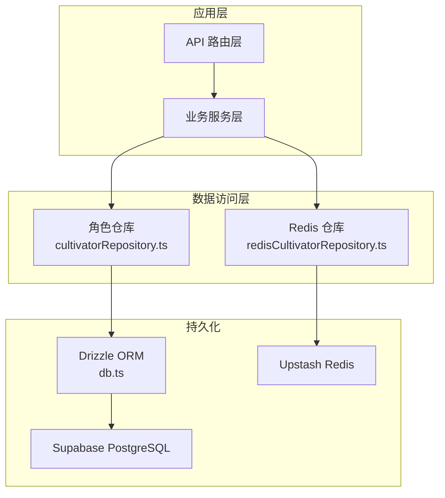
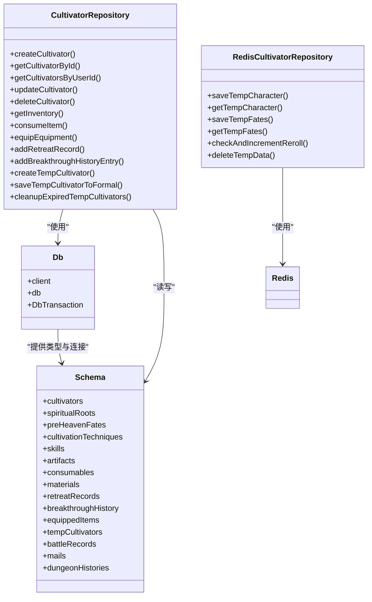
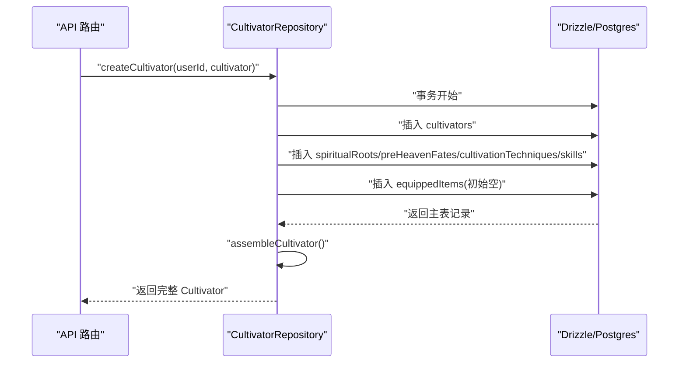
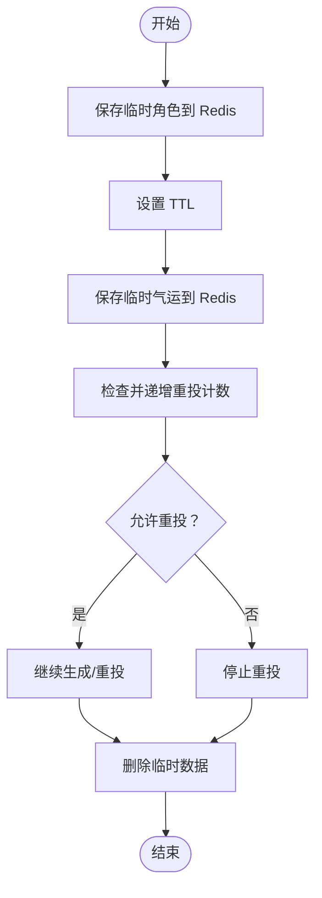
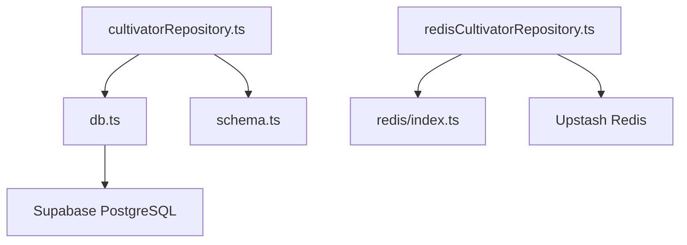

# 数据访问层

<cite>
**本文引用的文件**
- [lib/drizzle/db.ts](file://lib/drizzle/db.ts)
- [lib/drizzle/schema.ts](file://lib/drizzle/schema.ts)
- [lib/repositories/cultivatorRepository.ts](file://lib/repositories/cultivatorRepository.ts)
- [lib/repositories/redisCultivatorRepository.ts](file://lib/repositories/redisCultivatorRepository.ts)
- [lib/redis/index.ts](file://lib/redis/index.ts)
- [drizzle.config.ts](file://drizzle.config.ts)
- [drizzle/0000_equal_the_fury.sql](file://drizzle/0000_equal_the_fury.sql)
- [drizzle/0017_good_jimmy_woo.sql](file://drizzle/0017_good_jimmy_woo.sql)
- [drizzle/meta/0017_snapshot.json](file://drizzle/meta/0017_snapshot.json)
- [types/cultivator.ts](file://types/cultivator.ts)
</cite>

## 目录
1. [简介](#简介)
2. [项目结构](#项目结构)
3. [核心组件](#核心组件)
4. [架构总览](#架构总览)
5. [详细组件分析](#详细组件分析)
6. [依赖分析](#依赖分析)
7. [性能考虑](#性能考虑)
8. [故障排查指南](#故障排查指南)
9. [结论](#结论)
10. [附录](#附录)

## 简介
本文件面向数据访问层，系统性阐述如何通过 Drizzle ORM 与 Supabase PostgreSQL 数据库交互，以及如何以 Repository 模式抽象数据操作、实现 CRUD 接口并支持复杂查询构建；同时对比 Upstash Redis 缓存读写策略，分析冷热数据分离的设计考量。文档还覆盖数据库连接配置、连接池管理、查询性能优化技巧，以及 schema.ts 中表结构与 JSONB 字段的映射关系；结合迁移文件说明数据库版本控制流程，并提供典型查询语句与执行计划分析示例。

## 项目结构
数据访问层主要由以下模块构成：
- 连接与配置：lib/drizzle/db.ts（Drizzle 实例与连接）、drizzle.config.ts（Drizzle Kit 配置）
- 模式定义：lib/drizzle/schema.ts（PostgreSQL 表结构与 JSONB 映射）
- 仓库实现：lib/repositories/cultivatorRepository.ts（角色数据访问）、lib/repositories/redisCultivatorRepository.ts（Redis 缓存）
- 缓存客户端：lib/redis/index.ts（Upstash Redis 客户端）
- 类型定义：types/cultivator.ts（运行时数据模型）
- 迁移与快照：drizzle/*.sql、drizzle/meta/*.json（版本控制与快照）

图表来源
- [lib/repositories/cultivatorRepository.ts](file://lib/repositories/cultivatorRepository.ts#L1-L120)
- [lib/repositories/redisCultivatorRepository.ts](file://lib/repositories/redisCultivatorRepository.ts#L1-L103)
- [lib/drizzle/db.ts](file://lib/drizzle/db.ts#L1-L13)
- [lib/redis/index.ts](file://lib/redis/index.ts#L1-L6)

章节来源
- [lib/drizzle/db.ts](file://lib/drizzle/db.ts#L1-L13)
- [drizzle.config.ts](file://drizzle.config.ts#L1-L11)

## 核心组件
- Drizzle 连接与事务
  - 通过 lib/drizzle/db.ts 创建 Drizzle 实例，使用 postgres-js 客户端连接 Supabase PostgreSQL；禁用预取以适配事务池模式；导出事务类型别名以便统一事务参数签名。
- Repository 模式
  - 以 lib/repositories/cultivatorRepository.ts 为例，封装角色主表与关联表的读写、权限校验、批量查询、历史记录与临时数据处理等逻辑；通过 Drizzle 的类型推断保证查询安全。
- JSONB 字段映射
  - lib/drizzle/schema.ts 中大量使用 jsonb 字段存储复杂对象（如 attribute_mod、details、bonus、special_effects、curses、battle_result、result 等），并在运行时通过 types/cultivator.ts 的类型进行约束与消费。
- 缓存策略
  - lib/repositories/redisCultivatorRepository.ts 基于 Upstash Redis，提供临时角色、临时气运、重投计数等缓存读写，采用 TTL 控制生命周期，实现冷热数据分离与低延迟读取。

章节来源
- [lib/drizzle/db.ts](file://lib/drizzle/db.ts#L1-L13)
- [lib/repositories/cultivatorRepository.ts](file://lib/repositories/cultivatorRepository.ts#L1-L120)
- [lib/drizzle/schema.ts](file://lib/drizzle/schema.ts#L1-L292)
- [lib/repositories/redisCultivatorRepository.ts](file://lib/repositories/redisCultivatorRepository.ts#L1-L103)
- [types/cultivator.ts](file://types/cultivator.ts#L1-L253)

## 架构总览
数据访问层采用分层与职责分离：
- 连接层：db.ts 提供单一 Drizzle 实例与事务类型别名
- 模式层：schema.ts 定义表结构与 JSONB 字段映射
- 仓库层：cultivatorRepository.ts 实现角色 CRUD 与复杂查询；redisCultivatorRepository.ts 实现缓存读写
- 类型层：types/cultivator.ts 提供运行时数据模型，确保 JSONB 结构与业务逻辑一致
- 迁移层：drizzle/*.sql 与 drizzle/meta/*.json 记录数据库演进历史

图表来源
- [lib/drizzle/db.ts](file://lib/drizzle/db.ts#L1-L13)
- [lib/drizzle/schema.ts](file://lib/drizzle/schema.ts#L1-L292)
- [lib/repositories/cultivatorRepository.ts](file://lib/repositories/cultivatorRepository.ts#L1-L200)
- [lib/repositories/redisCultivatorRepository.ts](file://lib/repositories/redisCultivatorRepository.ts#L1-L103)

## 详细组件分析

### 数据库连接与事务（db.ts）
- 连接字符串来自环境变量 DATABASE_URL
- 禁用 postgres-js 的预取以适配 Drizzle 的事务池模式
- 导出 db 实例与 DbTransaction 类型别名，便于在仓库层统一使用事务回调参数

章节来源
- [lib/drizzle/db.ts](file://lib/drizzle/db.ts#L1-L13)

### 模式定义与 JSONB 映射（schema.ts）
- 主表：wanjiedaoyou_cultivators（角色主表）
- 关联表：spiritualRoots、preHeavenFates、cultivationTechniques、skills、artifacts、consumables、materials、retreatRecords、breakthroughHistory、equippedItems
- 临时与历史：tempCultivators、battleRecords、dungeonHistories
- JSONB 字段广泛用于存储复杂对象，如 attribute_mod、details、bonus、special_effects、curses、battle_result、result 等
- 外键约束与级联删除策略：多数子表对 cultivators 使用 onDelete: 'cascade'，确保主表删除时自动清理关联数据

章节来源
- [lib/drizzle/schema.ts](file://lib/drizzle/schema.ts#L1-L292)

### 角色仓库（cultivatorRepository.ts）
- 组装与权限
  - assembleCultivator：并行加载灵根、先天气运、功法、技能、装备状态，延迟加载法宝与消耗品/材料，组装为完整 Cultivator 对象；严格按 userId 校验权限
- CRUD 与复杂查询
  - createCultivator：事务内创建主表与多张关联表，返回完整对象
  - getCultivatorById、getCultivatorsByUserId：带权限与状态过滤
  - updateCultivator：部分字段更新，数值字段四舍五入入库
  - deleteCultivator：权限校验后删除主表，依赖外键级联删除关联数据
  - getInventory：并行获取三类物品，组装 Inventory
  - consumeItem：事务内消耗物品并更新角色属性，结合境界阶段上限判断
  - equipEquipment：按部位切换装备，维护 equippedItems
  - addRetreatRecord、addBreakthroughHistoryEntry：追加历史记录
  - 临时角色：createTempCultivator、getTempCultivator、saveTempCultivatorToFormal、cleanupExpiredTempCultivators
- 批量与系统用途接口
  - getCultivatorBasicsByIdsUnsafe、getCultivatorsByIdsUnsafe：系统用途批量查询基础信息与完整对象
  - getCultivatorOwnerId：系统用途获取角色所属用户ID

图表来源
- [lib/repositories/cultivatorRepository.ts](file://lib/repositories/cultivatorRepository.ts#L180-L294)
- [lib/drizzle/db.ts](file://lib/drizzle/db.ts#L1-L13)

章节来源
- [lib/repositories/cultivatorRepository.ts](file://lib/repositories/cultivatorRepository.ts#L1-L1366)

### Redis 缓存仓库（redisCultivatorRepository.ts）
- 临时角色与临时气运：saveTempCharacter、getTempCharacter、saveTempFates、getTempFates
- 重投计数：checkAndIncrementReroll，使用 Redis 自增与 TTL 控制生命周期
- 清理：deleteTempData 批量删除临时键

图表来源
- [lib/repositories/redisCultivatorRepository.ts](file://lib/repositories/redisCultivatorRepository.ts#L1-L103)
- [lib/redis/index.ts](file://lib/redis/index.ts#L1-L6)

章节来源
- [lib/repositories/redisCultivatorRepository.ts](file://lib/repositories/redisCultivatorRepository.ts#L1-L103)
- [lib/redis/index.ts](file://lib/redis/index.ts#L1-L6)

### 冷热数据分离设计
- 热数据（高频读取、强一致性）：角色主表与关联表数据存储于 PostgreSQL，通过 Drizzle ORM 提供强类型查询与事务保障
- 冷数据（临时生成、高并发读取、可丢失）：临时角色、临时气运、重投计数等存储于 Redis，利用 TTL 与原子自增实现快速读写与生命周期管理
- 设计考量：
  - 降低主库压力，提升生成环节响应速度
  - 通过 TTL 限制临时数据占用，避免缓存膨胀
  - 重投计数与临时数据键前缀隔离，便于统一清理

章节来源
- [lib/repositories/redisCultivatorRepository.ts](file://lib/repositories/redisCultivatorRepository.ts#L1-L103)
- [lib/repositories/cultivatorRepository.ts](file://lib/repositories/cultivatorRepository.ts#L864-L981)

### 数据模型与 JSONB 映射（types/cultivator.ts）
- 运行时模型与 schema.ts 的 JSONB 字段一一对应，包括：
  - 属性修正：PreHeavenFateAttributeMod、ArtifactBonus
  - 效果类型：ArtifactEffect、ConsumableEffect
  - 物品与技能：Artifact、Consumable、Skill、Material
  - 角色完整结构：Cultivator
- 通过类型约束，确保 JSONB 数据在入库与出库时保持结构正确性

章节来源
- [types/cultivator.ts](file://types/cultivator.ts#L1-L253)
- [lib/drizzle/schema.ts](file://lib/drizzle/schema.ts#L1-L292)

### 数据库版本控制（迁移与快照）
- 迁移文件：drizzle/0000_equal_the_fury.sql、drizzle/0017_good_jimmy_woo.sql 等，记录表结构变更与外键约束
- 快照文件：drizzle/meta/0017_snapshot.json，记录各版本的表结构快照，包含列定义、索引、外键、默认值等
- Drizzle Kit 配置：drizzle.config.ts，指定 schema 文件路径与数据库凭证

图表来源
- [drizzle/0000_equal_the_fury.sql](file://drizzle/0000_equal_the_fury.sql#L1-L115)
- [drizzle/0017_good_jimmy_woo.sql](file://drizzle/0017_good_jimmy_woo.sql#L1-L10)
- [drizzle/meta/0017_snapshot.json](file://drizzle/meta/0017_snapshot.json#L1-L200)
- [drizzle.config.ts](file://drizzle.config.ts#L1-L11)

章节来源
- [drizzle/0000_equal_the_fury.sql](file://drizzle/0000_equal_the_fury.sql#L1-L115)
- [drizzle/0017_good_jimmy_woo.sql](file://drizzle/0017_good_jimmy_woo.sql#L1-L10)
- [drizzle/meta/0017_snapshot.json](file://drizzle/meta/0017_snapshot.json#L1-L200)
- [drizzle.config.ts](file://drizzle.config.ts#L1-L11)

## 依赖分析
- 组件耦合
  - cultivatorRepository.ts 依赖 db.ts 与 schema.ts，形成“仓库-连接-模式”的稳定依赖链
  - redisCultivatorRepository.ts 依赖 lib/redis/index.ts，与 Drizzle 解耦
- 外部依赖
  - Drizzle ORM 与 postgres-js 提供类型安全的 SQL 构建与执行
  - Upstash Redis 提供高性能键值存储与 TTL 管理
- 可能的循环依赖
  - 当前文件组织避免了循环导入；若未来引入跨仓库调用，应通过接口或中间层解耦

图表来源
- [lib/repositories/cultivatorRepository.ts](file://lib/repositories/cultivatorRepository.ts#L1-L120)
- [lib/repositories/redisCultivatorRepository.ts](file://lib/repositories/redisCultivatorRepository.ts#L1-L103)
- [lib/drizzle/db.ts](file://lib/drizzle/db.ts#L1-L13)
- [lib/redis/index.ts](file://lib/redis/index.ts#L1-L6)

章节来源
- [lib/repositories/cultivatorRepository.ts](file://lib/repositories/cultivatorRepository.ts#L1-L1366)
- [lib/repositories/redisCultivatorRepository.ts](file://lib/repositories/redisCultivatorRepository.ts#L1-L103)
- [lib/drizzle/db.ts](file://lib/drizzle/db.ts#L1-L13)
- [lib/redis/index.ts](file://lib/redis/index.ts#L1-L6)

## 性能考虑
- 查询性能优化
  - 使用事务包裹多表写入，减少往返与锁竞争（参见 createCultivator 与 consumeItem）
  - 并行加载关联数据（如 assembleCultivator 中的 Promise.all），降低总等待时间
  - 使用 inArray 与 limit 限制批量查询规模，避免全表扫描
  - JSONB 字段查询建议配合 GIN 索引（如需）与合理字段拆分，避免过度嵌套导致的扫描成本上升
- 连接池与事务
  - 禁用预取以适配事务池模式，避免事务上下文下的兼容问题
  - 在高并发场景下，合理划分读写路径，将临时数据放入 Redis，减轻主库压力
- 缓存策略
  - TTL 控制临时数据生命周期，防止缓存膨胀
  - 使用原子自增计数器实现重投限制，避免频繁读写带来的竞争

章节来源
- [lib/repositories/cultivatorRepository.ts](file://lib/repositories/cultivatorRepository.ts#L1-L1366)
- [lib/repositories/redisCultivatorRepository.ts](file://lib/repositories/redisCultivatorRepository.ts#L1-L103)
- [lib/drizzle/db.ts](file://lib/drizzle/db.ts#L1-L13)

## 故障排查指南
- 权限与存在性
  - 若 getCultivatorById 返回空，检查 userId 与 status 条件；确认主表记录存在且状态为 active
- 事务回滚
  - createCultivator 与 consumeItem 使用事务，若中途失败，检查关联表插入顺序与外键约束
- JSONB 结构不一致
  - 若 JSONB 字段解析异常，核对 schema.ts 与 types/cultivator.ts 的字段映射是否一致
- 缓存失效
  - 临时角色与气运过期或被清理，检查 TTL 设置与键前缀；确认 checkAndIncrementReroll 的计数逻辑
- 迁移冲突
  - 若迁移执行失败，核对 drizzle.config.ts 的 DATABASE_URL 与 schema 路径；比对 drizzle/meta/* 快照与当前 schema 是否一致

章节来源
- [lib/repositories/cultivatorRepository.ts](file://lib/repositories/cultivatorRepository.ts#L1-L1366)
- [lib/repositories/redisCultivatorRepository.ts](file://lib/repositories/redisCultivatorRepository.ts#L1-L103)
- [drizzle.config.ts](file://drizzle.config.ts#L1-L11)
- [drizzle/meta/0017_snapshot.json](file://drizzle/meta/0017_snapshot.json#L1-L200)

## 结论
本数据访问层以 Drizzle ORM 为核心，结合 Repository 模式实现了角色数据的强类型、事务化与复杂查询能力；通过 Upstash Redis 实现临时数据的高效缓存与生命周期管理，达成冷热数据分离。配合完善的迁移与快照体系，确保数据库演进的可追踪与可回溯。建议在高并发场景下持续优化查询路径与缓存策略，并关注 JSONB 字段的结构稳定性与索引设计。

## 附录
- 典型查询语句与执行计划分析示例（概念性说明）
  - 获取用户活跃角色列表：使用 where(userId=..., status='active')，建议在 user_id 与 status 上建立复合索引以加速过滤
  - 组装角色完整数据：使用 Promise.all 并行查询多个关联表，注意控制并发度与数据库负载
  - 临时角色清理：使用 delete 与 expiresAt 比较，建议定期任务清理过期记录
  - 重投计数：使用 incr 与 expire，确保首次计数时设置 TTL，避免长期占用内存

[本节为通用指导，不直接分析具体文件]