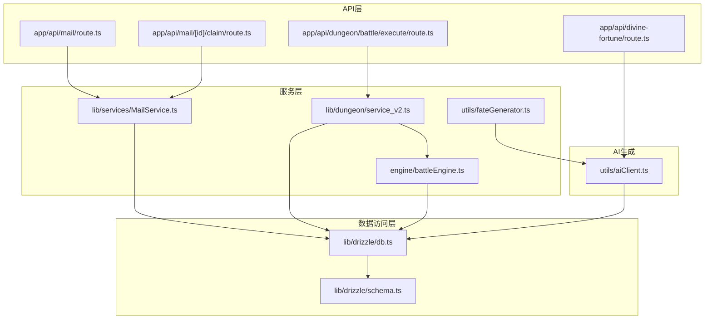
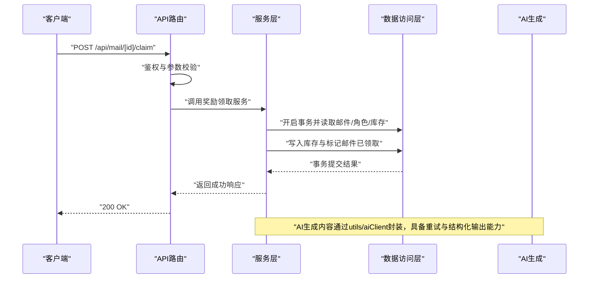
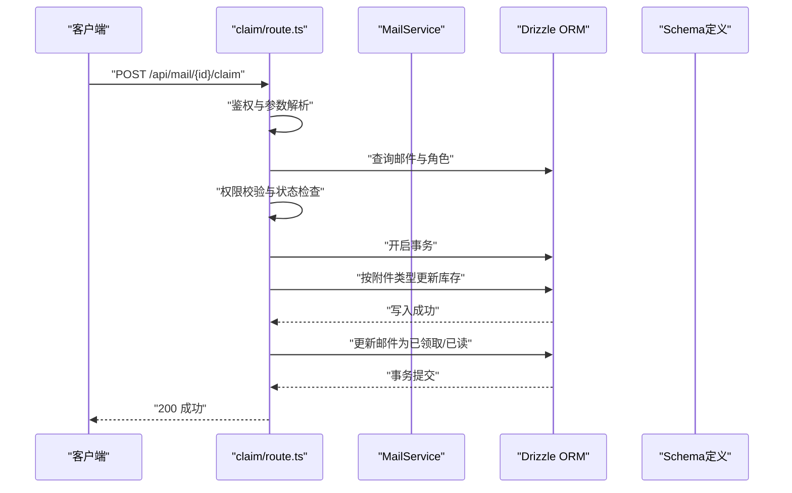
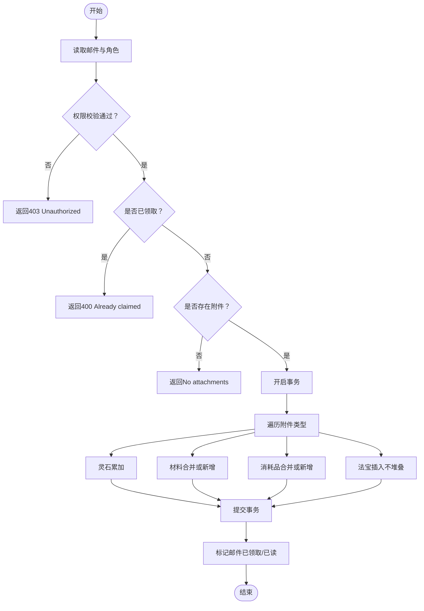
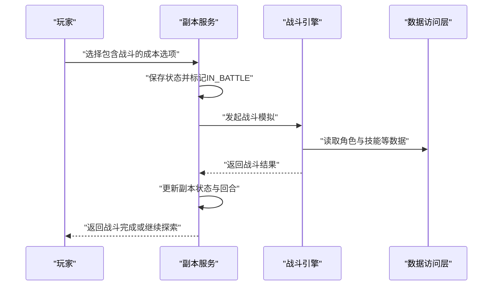
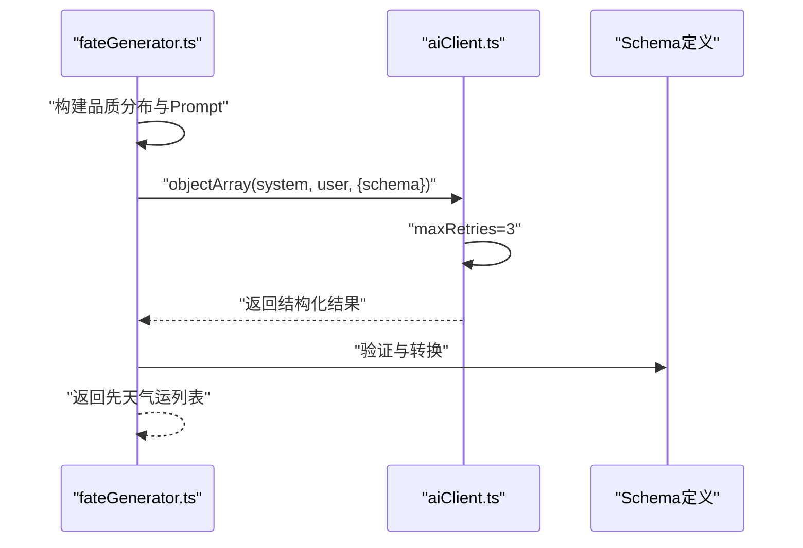
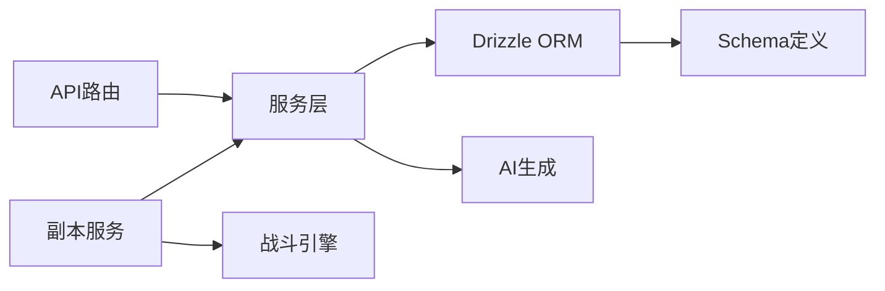

# 服务层架构

<cite>
**本文引用的文件**
- [lib/services/MailService.ts](file://lib/services/MailService.ts)
- [lib/services/MailService.test.ts](file://lib/services/MailService.test.ts)
- [app/api/mail/route.ts](file://app/api/mail/route.ts)
- [app/api/mail/[id]/claim/route.ts](file://app/api/mail/[id]/claim/route.ts)
- [lib/repositories/cultivatorRepository.ts](file://lib/repositories/cultivatorRepository.ts)
- [lib/drizzle/schema.ts](file://lib/drizzle/schema.ts)
- [lib/drizzle/db.ts](file://lib/drizzle/db.ts)
- [engine/battleEngine.ts](file://engine/battleEngine.ts)
- [utils/fateGenerator.ts](file://utils/fateGenerator.ts)
- [utils/aiClient.ts](file://utils/aiClient.ts)
- [app/api/divine-fortune/route.ts](file://app/api/divine-fortune/route.ts)
- [lib/dungeon/service_v2.ts](file://lib/dungeon/service_v2.ts)
- [app/api/dungeon/battle/execute/route.ts](file://app/api/dungeon/battle/execute/route.ts)
</cite>

## 目录
1. [引言](#引言)
2. [项目结构](#项目结构)
3. [核心组件](#核心组件)
4. [架构总览](#架构总览)
5. [详细组件分析](#详细组件分析)
6. [依赖关系分析](#依赖关系分析)
7. [性能考量](#性能考量)
8. [故障排查指南](#故障排查指南)
9. [结论](#结论)
10. [附录](#附录)

## 引言
本文件聚焦服务层架构，系统阐述服务类如何封装核心业务逻辑，以及服务层在API路由与数据访问层之间的协调作用。重点围绕MailService的邮件创建、发送、奖励领取流程，说明事务管理、跨仓库操作、业务规则验证与领域事件触发的实现方式；同时扩展到战斗引擎、命运生成器等服务的集成模式，阐明服务间解耦设计原则，并给出服务调用时序图、异常传播机制、重试策略与AI生成内容协同逻辑。

## 项目结构
服务层位于lib/services目录，围绕业务域划分：邮件服务、角色仓库、AI生成工具、战斗引擎等。API路由位于app/api，负责鉴权、参数校验与调用服务层；数据访问层基于Drizzle ORM，提供事务、查询与Schema定义；AI生成通过utils/aiClient封装，支持结构化输出与流式输出。

图表来源
- [app/api/mail/route.ts](file://app/api/mail/route.ts#L1-L37)
- [app/api/mail/[id]/claim/route.ts](file://app/api/mail/[id]/claim/route.ts#L1-L165)
- [lib/services/MailService.ts](file://lib/services/MailService.ts#L1-L65)
- [lib/dungeon/service_v2.ts](file://lib/dungeon/service_v2.ts#L133-L311)
- [engine/battleEngine.ts](file://engine/battleEngine.ts#L674-L830)
- [utils/fateGenerator.ts](file://utils/fateGenerator.ts#L94-L166)
- [utils/aiClient.ts](file://utils/aiClient.ts#L1-L211)
- [lib/drizzle/db.ts](file://lib/drizzle/db.ts#L1-L12)
- [lib/drizzle/schema.ts](file://lib/drizzle/schema.ts#L1-L292)

章节来源
- [lib/services/MailService.ts](file://lib/services/MailService.ts#L1-L65)
- [lib/drizzle/schema.ts](file://lib/drizzle/schema.ts#L266-L279)

## 核心组件
- 邮件服务MailService：封装邮件发送、系统通知、邮件列表查询等能力，提供静态方法供API路由调用。
- 邮件路由：app/api/mail/route.ts负责鉴权与查询；app/api/mail/[id]/claim/route.ts负责奖励领取的事务与库存变更。
- 角色仓库：lib/repositories/cultivatorRepository.ts提供角色装配、权限校验、批量查询等，支撑服务层的跨仓库操作。
- 数据访问层：lib/drizzle/db.ts与schema.ts提供统一连接与表结构定义，事务与查询均通过db实例执行。
- 战斗引擎：engine/battleEngine.ts提供回合制战斗模拟、状态管理、伤害计算与日志记录。
- 命运生成器：utils/fateGenerator.ts通过AI结构化输出生成先天气运，配合utils/aiClient.ts的重试与流式能力。
- 副本服务：lib/dungeon/service_v2.ts协调副本状态、资源消耗与战斗拦截，桥接战斗引擎与前端流式渲染。

章节来源
- [lib/services/MailService.ts](file://lib/services/MailService.ts#L1-L65)
- [app/api/mail/route.ts](file://app/api/mail/route.ts#L1-L37)
- [app/api/mail/[id]/claim/route.ts](file://app/api/mail/[id]/claim/route.ts#L1-L165)
- [lib/repositories/cultivatorRepository.ts](file://lib/repositories/cultivatorRepository.ts#L1-L120)
- [lib/drizzle/db.ts](file://lib/drizzle/db.ts#L1-L12)
- [lib/drizzle/schema.ts](file://lib/drizzle/schema.ts#L1-L292)
- [engine/battleEngine.ts](file://engine/battleEngine.ts#L674-L830)
- [utils/fateGenerator.ts](file://utils/fateGenerator.ts#L94-L166)
- [utils/aiClient.ts](file://utils/aiClient.ts#L1-L211)
- [lib/dungeon/service_v2.ts](file://lib/dungeon/service_v2.ts#L133-L311)

## 架构总览
服务层在API与数据访问之间承担“业务编排”职责：API路由完成鉴权与参数校验后，调用服务层；服务层根据业务规则组织跨仓库操作与事务边界，必要时调用AI生成模块或战斗引擎；数据访问层统一提供事务、查询与Schema约束。

图表来源
- [app/api/mail/[id]/claim/route.ts](file://app/api/mail/[id]/claim/route.ts#L1-L165)
- [lib/services/MailService.ts](file://lib/services/MailService.ts#L1-L65)
- [lib/drizzle/db.ts](file://lib/drizzle/db.ts#L1-L12)
- [utils/aiClient.ts](file://utils/aiClient.ts#L92-L124)

## 详细组件分析

### 邮件服务与路由协作
- 邮件发送：MailService提供sendMail/sendSystemMail，将邮件持久化到mails表，附件类型与数据结构在Schema中定义。
- 邮件列表：API路由app/api/mail/route.ts根据当前活跃角色查询其邮件列表。
- 奖励领取：API路由app/api/mail/[id]/claim/route.ts在事务内完成：
  - 权限校验：确保邮件归属当前用户
  - 业务规则：禁止重复领取、空附件提示
  - 跨仓库操作：按附件类型分别更新角色灵石、材料、消耗品、法宝库存
  - 状态更新：标记邮件为已领取与已读

图表来源
- [app/api/mail/[id]/claim/route.ts](file://app/api/mail/[id]/claim/route.ts#L1-L165)
- [lib/services/MailService.ts](file://lib/services/MailService.ts#L1-L65)
- [lib/drizzle/schema.ts](file://lib/drizzle/schema.ts#L266-L279)

章节来源
- [lib/services/MailService.ts](file://lib/services/MailService.ts#L1-L65)
- [app/api/mail/route.ts](file://app/api/mail/route.ts#L1-L37)
- [app/api/mail/[id]/claim/route.ts](file://app/api/mail/[id]/claim/route.ts#L1-L165)
- [lib/drizzle/schema.ts](file://lib/drizzle/schema.ts#L266-L279)

### 事务管理与跨仓库操作
- 事务边界：claim路由明确使用db.transaction包裹，确保库存更新与邮件状态变更原子性。
- 跨仓库操作：依据附件类型分别操作cultivators/materials/consumables/artifacts等表，遵循Schema约束与字段映射。
- 权限与状态：在事务内进行权限校验与状态检查，避免并发竞态。

图表来源
- [app/api/mail/[id]/claim/route.ts](file://app/api/mail/[id]/claim/route.ts#L55-L154)

章节来源
- [app/api/mail/[id]/claim/route.ts](file://app/api/mail/[id]/claim/route.ts#L55-L154)

### 业务规则验证与领域事件触发
- 业务规则：
  - 邮件类型由是否有附件决定（有附件强制为奖励类型）
  - 领取前检查权限与状态，避免越权与重复领取
- 领域事件：
  - 邮件奖励发放后，库存变化可视为“奖励发放事件”，在后续流程中可扩展为事件发布（例如写入事件表或触发消息队列），当前实现以事务提交与状态更新为核心。

章节来源
- [lib/services/MailService.ts](file://lib/services/MailService.ts#L23-L42)
- [app/api/mail/[id]/claim/route.ts](file://app/api/mail/[id]/claim/route.ts#L37-L54)

### 单元测试保障质量
- MailService.test.ts覆盖系统邮件与带附件邮件的发送流程，验证服务方法的正确性与数据结构一致性。
- 测试通过断言数据库中邮件记录的存在与附件结构，确保服务层行为符合预期。

章节来源
- [lib/services/MailService.test.ts](file://lib/services/MailService.test.ts#L1-L65)

### 战斗引擎集成模式
- 副本服务lib/dungeon/service_v2.ts在检测到选项成本包含“战斗”时，暂停副本状态，进入战斗阶段，并通过战斗引擎engine/battleEngine.ts进行回合制模拟。
- 战斗结果回传后，副本服务更新状态、记录结果并推进回合，最终结算。

图表来源
- [lib/dungeon/service_v2.ts](file://lib/dungeon/service_v2.ts#L133-L311)
- [engine/battleEngine.ts](file://engine/battleEngine.ts#L674-L830)

章节来源
- [lib/dungeon/service_v2.ts](file://lib/dungeon/service_v2.ts#L133-L311)
- [engine/battleEngine.ts](file://engine/battleEngine.ts#L674-L830)

### 命运生成器与AI协同
- 命运生成器utils/fateGenerator.ts通过utils/aiClient.ts的objectArray接口，以结构化Schema生成先天气运，支持重试与数组输出。
- 当AI生成失败时，提供降级策略（抛出错误或返回空结果），由上游捕获并处理。

图表来源
- [utils/fateGenerator.ts](file://utils/fateGenerator.ts#L94-L166)
- [utils/aiClient.ts](file://utils/aiClient.ts#L129-L159)

章节来源
- [utils/fateGenerator.ts](file://utils/fateGenerator.ts#L94-L166)
- [utils/aiClient.ts](file://utils/aiClient.ts#L129-L159)

### 天机推演与降级策略
- app/api/divine-fortune/route.ts通过Redis缓存天机格言，若AI生成失败或格式不合法，则回退到随机备用格言，保证服务可用性。

章节来源
- [app/api/divine-fortune/route.ts](file://app/api/divine-fortune/route.ts#L1-L81)

## 依赖关系分析
- 服务层依赖数据访问层：通过db实例执行事务与查询，依赖schema定义的数据模型。
- API路由依赖服务层：路由负责鉴权、参数校验与错误包装，调用服务层执行业务。
- AI生成依赖外部模型：通过utils/aiClient封装，提供重试与结构化输出能力。
- 战斗引擎独立于服务层：副本服务通过接口调用战斗引擎，实现领域功能解耦。

图表来源
- [lib/drizzle/db.ts](file://lib/drizzle/db.ts#L1-L12)
- [lib/drizzle/schema.ts](file://lib/drizzle/schema.ts#L1-L292)
- [utils/aiClient.ts](file://utils/aiClient.ts#L1-L211)
- [engine/battleEngine.ts](file://engine/battleEngine.ts#L674-L830)
- [lib/dungeon/service_v2.ts](file://lib/dungeon/service_v2.ts#L133-L311)

章节来源
- [lib/drizzle/db.ts](file://lib/drizzle/db.ts#L1-L12)
- [lib/drizzle/schema.ts](file://lib/drizzle/schema.ts#L1-L292)
- [utils/aiClient.ts](file://utils/aiClient.ts#L1-L211)
- [engine/battleEngine.ts](file://engine/battleEngine.ts#L674-L830)
- [lib/dungeon/service_v2.ts](file://lib/dungeon/service_v2.ts#L133-L311)

## 性能考量
- 事务粒度：在奖励领取场景采用单事务包裹，减少多次往返与锁竞争，提升吞吐。
- 并发控制：副本服务在关键路径使用Redis锁与缓存，避免并发冲突。
- 流式输出：天机推演与历练产出采用SSE流式输出，降低前端等待时间。
- 结构化输出：AI生成使用结构化Schema与重试，提高稳定性与解析效率。

[本节为通用指导，无需特定文件来源]

## 故障排查指南
- 邮件领取失败
  - 检查权限：确认当前用户与邮件归属一致
  - 检查状态：确认邮件未被领取且存在附件
  - 查看事务：关注数据库事务提交日志与回滚原因
- AI生成异常
  - 查看重试次数与错误日志，确认模型配置与网络连通性
  - 若结构化输出失败，检查Schema定义与AI响应格式
- 副本战斗卡顿
  - 检查SSE流是否正常关闭，避免锁未释放
  - 核对战斗回合上限与状态推进逻辑

章节来源
- [app/api/mail/[id]/claim/route.ts](file://app/api/mail/[id]/claim/route.ts#L155-L164)
- [utils/aiClient.ts](file://utils/aiClient.ts#L114-L124)
- [lib/dungeon/service_v2.ts](file://lib/dungeon/service_v2.ts#L278-L311)

## 结论
服务层通过清晰的职责划分与严格的事务边界，有效封装了邮件、副本、战斗等核心业务流程。API路由专注于鉴权与参数校验，服务层负责业务编排与跨仓库操作，数据访问层提供统一的事务与Schema约束，AI生成模块以结构化输出与重试机制增强稳定性。整体架构体现了良好的解耦与可扩展性，便于未来引入领域事件与更复杂的业务规则。

[本节为总结性内容，无需特定文件来源]

## 附录
- 邮件Schema字段说明
  - mails表包含标题、内容、类型、附件、已读与已领取状态等字段，附件为JSONB数组，支持多种类型与具体数据。
- 奖励领取流程要点
  - 灵石累加、材料与消耗品合并或新增、法宝不堆叠插入，最后标记邮件状态。

章节来源
- [lib/drizzle/schema.ts](file://lib/drizzle/schema.ts#L266-L279)
- [app/api/mail/[id]/claim/route.ts](file://app/api/mail/[id]/claim/route.ts#L55-L154)