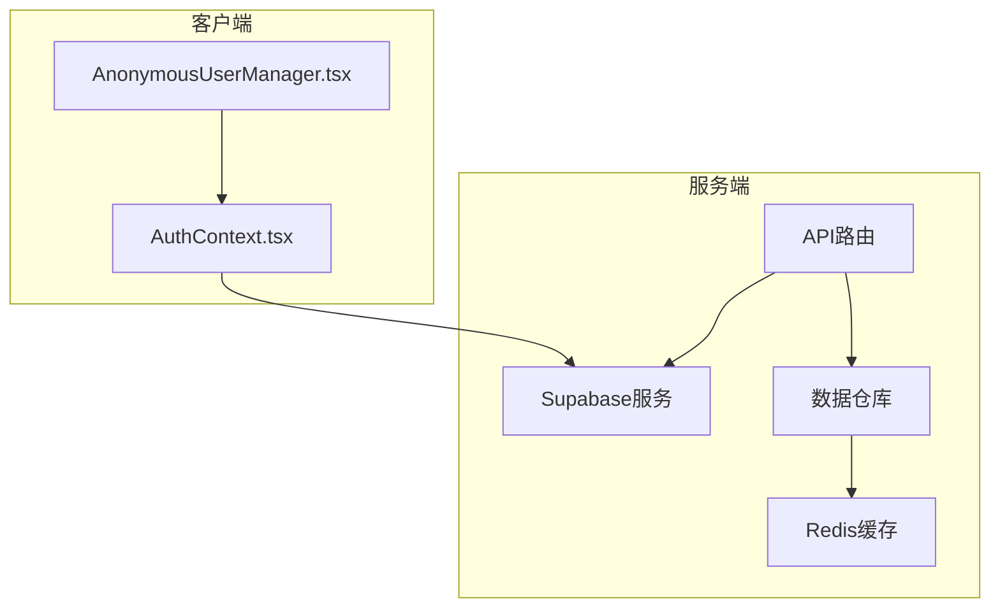
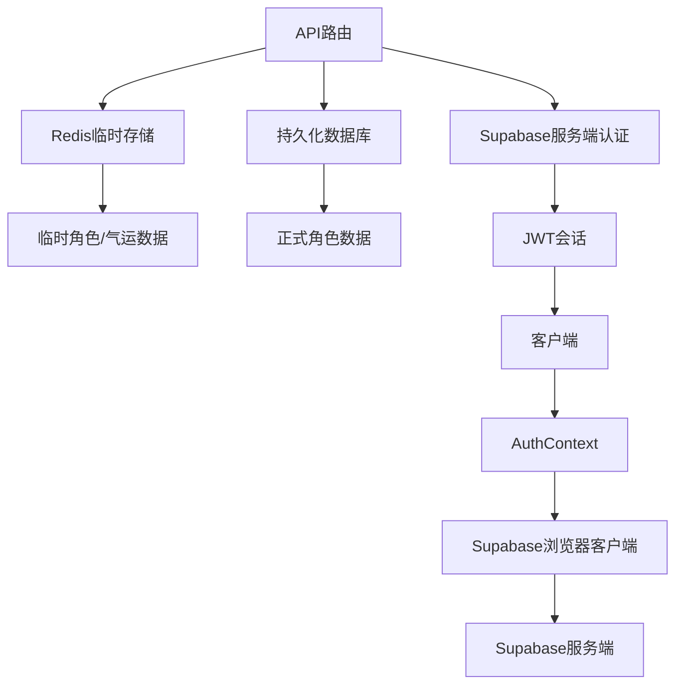
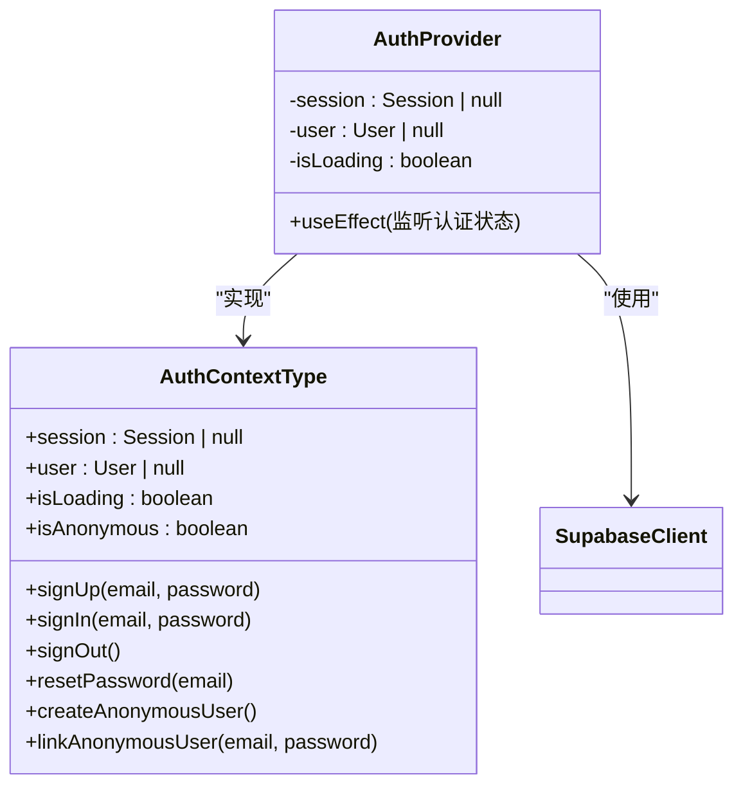
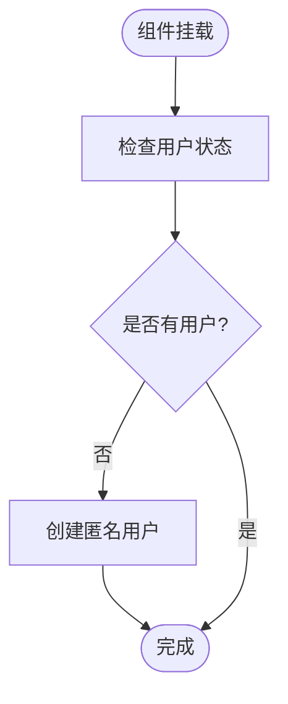
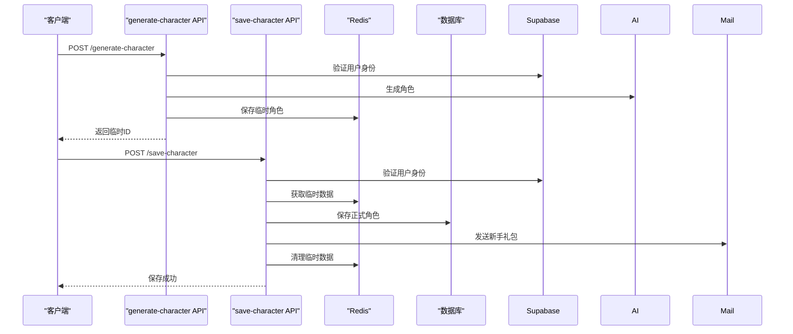
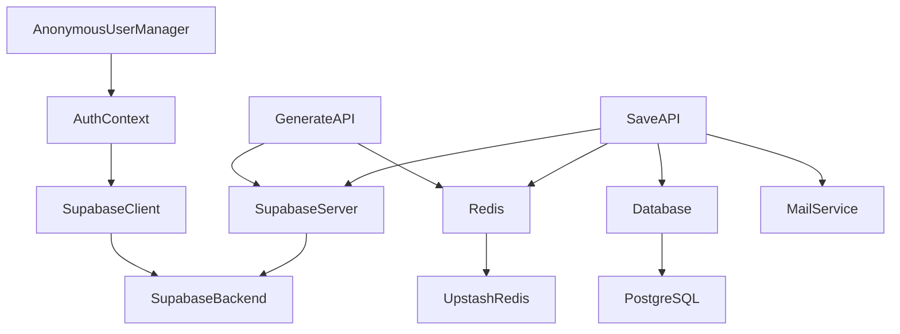

# 认证与会话管理

<cite>
**本文档引用文件**  
- [AuthContext.tsx](file://lib/auth/AuthContext.tsx)
- [AnonymousUserManager.tsx](file://components/AnonymousUserManager.tsx)
- [client.ts](file://lib/supabase/client.ts)
- [server.ts](file://lib/supabase/server.ts)
- [generate-character/route.ts](file://app/api/generate-character/route.ts)
- [save-character/route.ts](file://app/api/save-character/route.ts)
- [redisCultivatorRepository.ts](file://lib/repositories/redisCultivatorRepository.ts)
- [userMigrationRepository.ts](file://lib/repositories/userMigrationRepository.ts)
- [mail/[id]/read/route.ts](file://app/api/mail/[id]/read/route.ts)
- [rankings.ts](file://lib/redis/rankings.ts)
- [index.ts](file://lib/redis/index.ts)
</cite>

## 目录
1. [简介](#简介)
2. [项目结构](#项目结构)
3. [核心组件](#核心组件)
4. [架构概述](#架构概述)
5. [详细组件分析](#详细组件分析)
6. [依赖分析](#依赖分析)
7. [性能考虑](#性能考虑)
8. [故障排除指南](#故障排除指南)
9. [结论](#结论)

## 简介
本文档详细阐述了基于Supabase Auth的身份认证与会话管理系统，重点解析游客模式下的匿名用户自动创建、角色数据绑定、JWT令牌管理、权限校验机制，以及临时状态保存与账户关联的完整流程。同时涵盖安全策略、会话过期处理和用户迁移等关键设计。

## 项目结构
项目采用Next.js App Router架构，认证相关逻辑分层清晰：
- `lib/auth/`：客户端认证上下文
- `components/`：匿名用户管理组件
- `lib/supabase/`：Supabase客户端封装
- `app/api/`：生成与保存角色的API路由
- `lib/repositories/`：数据持久化逻辑
- `lib/redis/`：临时状态存储

**图示来源**  
- [AuthContext.tsx](file://lib/auth/AuthContext.tsx)
- [AnonymousUserManager.tsx](file://components/AnonymousUserManager.tsx)
- [server.ts](file://lib/supabase/server.ts)
- [redisCultivatorRepository.ts](file://lib/repositories/redisCultivatorRepository.ts)

**本节来源**  
- [AuthContext.tsx](file://lib/auth/AuthContext.tsx)
- [AnonymousUserManager.tsx](file://components/AnonymousUserManager.tsx)
- [server.ts](file://lib/supabase/server.ts)

## 核心组件
系统核心围绕`AuthContext.tsx`构建，提供统一的认证状态管理。`AnonymousUserManager.tsx`实现游客模式的无缝体验，API路由确保安全的数据持久化。

**本节来源**  
- [AuthContext.tsx](file://lib/auth/AuthContext.tsx#L1-L134)
- [AnonymousUserManager.tsx](file://components/AnonymousUserManager.tsx#L1-L20)

## 架构概述
系统采用Supabase作为认证后端，结合Redis实现临时状态管理，形成"持久化+缓存"的双层数据架构。

**图示来源**  
- [client.ts](file://lib/supabase/client.ts)
- [server.ts](file://lib/supabase/server.ts)
- [generate-character/route.ts](file://app/api/generate-character/route.ts)
- [save-character/route.ts](file://app/api/save-character/route.ts)

## 详细组件分析

### 认证上下文分析
`AuthContext.tsx`使用React Context提供全局认证状态，封装Supabase Auth的所有操作。

**图示来源**  
- [AuthContext.tsx](file://lib/auth/AuthContext.tsx#L13-L125)

**本节来源**  
- [AuthContext.tsx](file://lib/auth/AuthContext.tsx#L1-L134)

### 匿名用户管理分析
`AnonymousUserManager.tsx`在客户端自动处理匿名用户创建，确保未登录用户也能获得完整体验。

**图示来源**  
- [AnonymousUserManager.tsx](file://components/AnonymousUserManager.tsx#L6-L17)

**本节来源**  
- [AnonymousUserManager.tsx](file://components/AnonymousUserManager.tsx#L1-L20)
- [AuthContext.tsx](file://lib/auth/AuthContext.tsx#L96-L109)

### 角色生成与保存流程
`generate-character`和`save-character`API路由实现从临时生成到永久保存的完整流程。

**图示来源**  
- [generate-character/route.ts](file://app/api/generate-character/route.ts)
- [save-character/route.ts](file://app/api/save-character/route.ts)
- [redisCultivatorRepository.ts](file://lib/repositories/redisCultivatorRepository.ts)

**本节来源**  
- [generate-character/route.ts](file://app/api/generate-character/route.ts#L1-L80)
- [save-character/route.ts](file://app/api/save-character/route.ts#L1-L128)
- [redisCultivatorRepository.ts](file://lib/repositories/redisCultivatorRepository.ts#L1-L103)

## 依赖分析
系统依赖关系清晰，各层职责分明。

**图示来源**  
- [client.ts](file://lib/supabase/client.ts)
- [server.ts](file://lib/supabase/server.ts)
- [redis/index.ts](file://lib/redis/index.ts)
- [drizzle/db.ts](file://lib/drizzle/db.ts)

**本节来源**  
- [client.ts](file://lib/supabase/client.ts#L1-L9)
- [server.ts](file://lib/supabase/server.ts#L1-L28)
- [index.ts](file://lib/redis/index.ts#L1-L6)

## 性能考虑
- **会话管理**：利用Supabase的JWT机制，减少数据库查询
- **临时存储**：使用Redis存储临时角色数据，TTL设置为1小时
- **权限校验**：在API路由中尽早进行身份验证，避免不必要的处理
- **数据迁移**：提供匿名用户数据迁移到注册账户的机制

## 故障排除指南
- **未授权访问**：检查Supabase会话是否有效，确保`createClient`正确初始化
- **数据过期**：临时角色数据在Redis中存储1小时后自动清除
- **重复角色**：系统限制每个用户只能创建一个道身
- **气运选择错误**：确保选择3个有效的先天气运索引

**本节来源**  
- [generate-character/route.ts](file://app/api/generate-character/route.ts#L24-L26)
- [save-character/route.ts](file://app/api/save-character/route.ts#L54-L60)
- [redisCultivatorRepository.ts](file://lib/repositories/redisCultivatorRepository.ts#L4-L5)

## 结论
本系统通过Supabase Auth与Redis的有机结合，实现了流畅的认证体验和安全的数据管理。游客模式降低了使用门槛，而严谨的权限校验和数据持久化机制确保了系统的安全性与可靠性。未来可进一步优化用户迁移流程和会话管理策略。