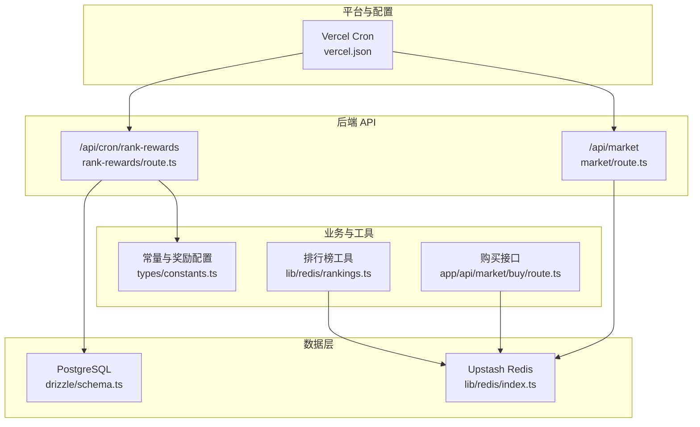
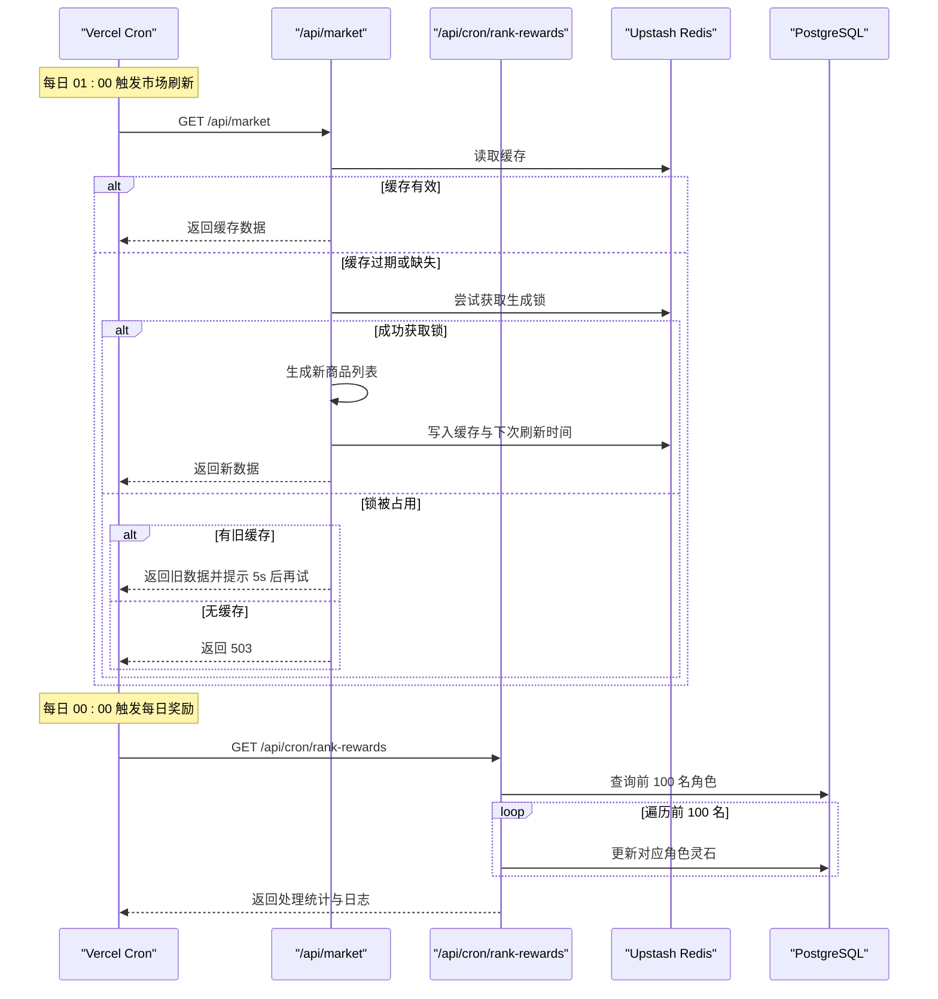
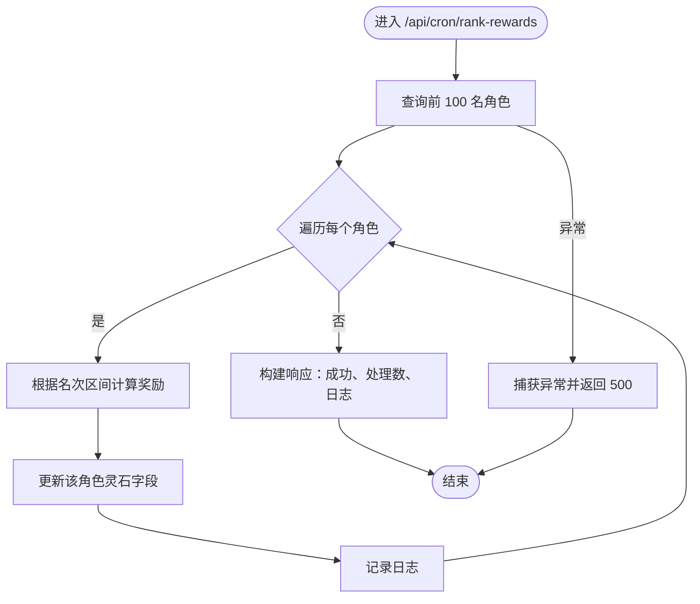
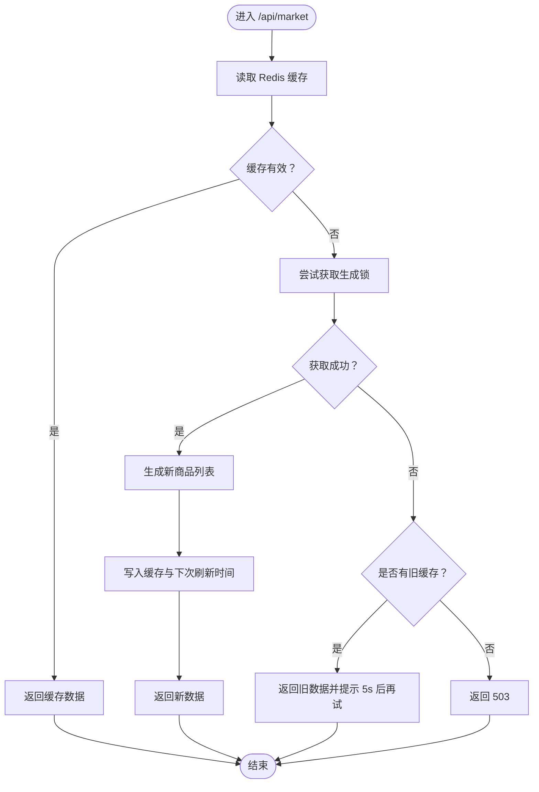
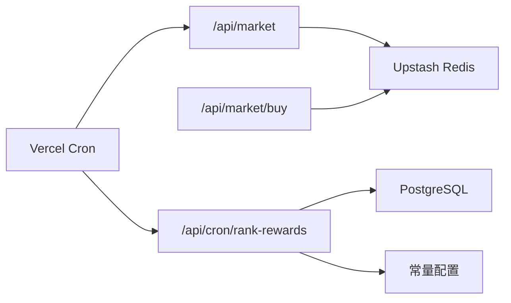

# 定时任务与后台作业

<cite>
**本文引用的文件**
- [vercel.json](file://vercel.json)
- [app/api/cron/rank-rewards/route.ts](file://app/api/cron/rank-rewards/route.ts)
- [app/api/market/route.ts](file://app/api/market/route.ts)
- [types/constants.ts](file://types/constants.ts)
- [lib/drizzle/schema.ts](file://lib/drizzle/schema.ts)
- [lib/redis/index.ts](file://lib/redis/index.ts)
- [lib/redis/rankings.ts](file://lib/redis/rankings.ts)
- [app/api/market/buy/route.ts](file://app/api/market/buy/route.ts)
</cite>

## 目录
1. [引言](#引言)
2. [项目结构](#项目结构)
3. [核心组件](#核心组件)
4. [架构总览](#架构总览)
5. [详细组件分析](#详细组件分析)
6. [依赖关系分析](#依赖关系分析)
7. [性能考量](#性能考量)
8. [故障排查指南](#故障排查指南)
9. [结论](#结论)
10. [附录](#附录)

## 引言
本文件面向运维与开发人员，系统性说明本项目的定时任务与后台作业机制。重点包括：
- Vercel Cron 如何通过 vercel.json 配置定期触发 /api/cron/rank-rewards 与 /api/market。
- 每日奖励发放任务（rank-rewards）的业务逻辑与数据一致性保障。
- 市场刷新任务（market）的缓存与并发控制策略。
- 幂等性、错误重试与日志记录实践。
- 后台任务的生命周期与监控建议。

## 项目结构
与定时任务直接相关的文件与职责如下：
- vercel.json：定义两个 Cron 调度器，分别在每日 00:00 与 01:00 触发对应 API。
- app/api/cron/rank-rewards/route.ts：每日奖励发放逻辑入口。
- app/api/market/route.ts：市场商品列表的定时刷新与缓存管理。
- types/constants.ts：提供每日奖励配置（灵石）。
- lib/drizzle/schema.ts：数据库表结构，包含角色灵石字段等。
- lib/redis/index.ts：Redis 客户端初始化。
- lib/redis/rankings.ts：排行榜相关 Redis 操作（保护、挑战、挑战次数等）。
- app/api/market/buy/route.ts：购买接口读取市场缓存，体现市场刷新对下游的影响。

图表来源
- [vercel.json](file://vercel.json#L1-L13)
- [app/api/cron/rank-rewards/route.ts](file://app/api/cron/rank-rewards/route.ts#L1-L68)
- [app/api/market/route.ts](file://app/api/market/route.ts#L1-L100)
- [types/constants.ts](file://types/constants.ts#L166-L191)
- [lib/drizzle/schema.ts](file://lib/drizzle/schema.ts#L16-L55)
- [lib/redis/index.ts](file://lib/redis/index.ts#L1-L6)
- [lib/redis/rankings.ts](file://lib/redis/rankings.ts#L1-L408)
- [app/api/market/buy/route.ts](file://app/api/market/buy/route.ts#L49-L92)

章节来源
- [vercel.json](file://vercel.json#L1-L13)

## 核心组件
- Vercel Cron 调度器
  - 每日 00:00 触发 /api/cron/rank-rewards，用于结算每日奖励。
  - 每日 01:00 触发 /api/market，用于刷新市场商品列表。
- 每日奖励发放（rank-rewards）
  - 读取数据库中前 100 名角色，按名次区间发放不同灵石奖励，并返回处理统计与日志。
- 市场刷新（market）
  - 通过 Redis 缓存商品列表与下次刷新时间；使用分布式锁避免并发重复生成；支持手动触发刷新。

章节来源
- [vercel.json](file://vercel.json#L1-L13)
- [app/api/cron/rank-rewards/route.ts](file://app/api/cron/rank-rewards/route.ts#L1-L68)
- [app/api/market/route.ts](file://app/api/market/route.ts#L1-L100)
- [types/constants.ts](file://types/constants.ts#L166-L191)
- [lib/drizzle/schema.ts](file://lib/drizzle/schema.ts#L16-L55)
- [lib/redis/index.ts](file://lib/redis/index.ts#L1-L6)

## 架构总览
定时任务的触发与执行流程如下：

图表来源
- [vercel.json](file://vercel.json#L1-L13)
- [app/api/market/route.ts](file://app/api/market/route.ts#L1-L100)
- [app/api/cron/rank-rewards/route.ts](file://app/api/cron/rank-rewards/route.ts#L1-L68)

## 详细组件分析

### Vercel Cron 配置与触发机制
- 配置项
  - /api/market：0 1 * * *（每日 01:00）
  - /api/cron/rank-rewards：0 0 * * *（每日 00:00）
- 触发行为
  - Vercel 会向上述路径发送 HTTP 请求，无需鉴权头（当前注释掉授权校验），请求方法为 GET。
- 影响范围
  - market：刷新市场商品列表，影响购买与展示。
  - rank-rewards：结算前 100 名角色的灵石奖励，影响角色资产。

章节来源
- [vercel.json](file://vercel.json#L1-L13)

### 每日奖励发放（rank-rewards）
- 数据来源
  - 从数据库表中查询前 100 名角色（当前实现以简单方式获取，注释建议与排行榜 API 保持一致）。
- 奖励规则
  - 奖励配置来源于常量文件，按名次区间发放不同灵石数量。
- 执行流程
  - 遍历前 100 名角色，计算奖励并更新对应角色的灵石字段。
  - 记录每名角色的奖励日志，返回处理总数与日志数组。
- 错误处理
  - 捕获异常并返回 500，同时在控制台输出错误日志。

图表来源
- [app/api/cron/rank-rewards/route.ts](file://app/api/cron/rank-rewards/route.ts#L1-L68)
- [types/constants.ts](file://types/constants.ts#L166-L191)
- [lib/drizzle/schema.ts](file://lib/drizzle/schema.ts#L16-L55)

章节来源
- [app/api/cron/rank-rewards/route.ts](file://app/api/cron/rank-rewards/route.ts#L1-L68)
- [types/constants.ts](file://types/constants.ts#L166-L191)
- [lib/drizzle/schema.ts](file://lib/drizzle/schema.ts#L16-L55)

### 市场刷新（market）
- 缓存策略
  - 使用 Redis 键存储商品列表与下次刷新时间戳。
  - 缓存有效期为 2 小时；若缓存缺失或过期，则尝试刷新。
- 并发控制
  - 使用分布式锁键防止多个实例同时生成数据。
  - 若锁被占用且存在旧缓存，返回旧数据并提示客户端 5 秒后重试；若无旧缓存，返回 503。
- 生成流程
  - 生成固定数量的商品列表，为每件物品生成唯一 ID，打乱顺序后写入缓存。
  - 设置下次刷新时间为当前时间加上缓存 TTL。
- 手动触发
  - 提供 POST /api/market 可清除缓存并立即刷新。

图表来源
- [app/api/market/route.ts](file://app/api/market/route.ts#L1-L100)
- [lib/redis/index.ts](file://lib/redis/index.ts#L1-L6)

章节来源
- [app/api/market/route.ts](file://app/api/market/route.ts#L1-L100)
- [lib/redis/index.ts](file://lib/redis/index.ts#L1-L6)

### 排行榜与挑战相关（辅助理解）
- 排行榜工具提供：
  - 获取排行榜顺序与保护状态。
  - 挑战成功后的排名调整与挑战次数统计。
  - 与排行榜相关的 TTL 计算（距午夜剩余秒数）。
- 这些能力与每日奖励发放的“前 100 名”概念相互关联，但当前 rank-rewards 的实现并未直接依赖这些 Redis 排行榜操作。

章节来源
- [lib/redis/rankings.ts](file://lib/redis/rankings.ts#L1-L408)

## 依赖关系分析
- 外部依赖
  - Vercel Cron：负责定时触发 API。
  - Upstash Redis：提供缓存、锁与排行榜数据存储。
  - PostgreSQL（Drizzle ORM）：持久化角色与相关业务数据。
- 内部依赖
  - rank-rewards 依赖常量配置与数据库 schema。
  - market 依赖 Redis 与商品生成工具。
  - 购买接口依赖 market 的缓存键，体现市场刷新对下游的影响。

图表来源
- [vercel.json](file://vercel.json#L1-L13)
- [app/api/cron/rank-rewards/route.ts](file://app/api/cron/rank-rewards/route.ts#L1-L68)
- [app/api/market/route.ts](file://app/api/market/route.ts#L1-L100)
- [types/constants.ts](file://types/constants.ts#L166-L191)
- [lib/redis/index.ts](file://lib/redis/index.ts#L1-L6)
- [app/api/market/buy/route.ts](file://app/api/market/buy/route.ts#L49-L92)

章节来源
- [vercel.json](file://vercel.json#L1-L13)
- [app/api/cron/rank-rewards/route.ts](file://app/api/cron/rank-rewards/route.ts#L1-L68)
- [app/api/market/route.ts](file://app/api/market/route.ts#L1-L100)
- [types/constants.ts](file://types/constants.ts#L166-L191)
- [lib/redis/index.ts](file://lib/redis/index.ts#L1-L6)
- [app/api/market/buy/route.ts](file://app/api/market/buy/route.ts#L49-L92)

## 性能考量
- 市场刷新
  - 使用分布式锁避免重复生成，降低数据库与生成成本。
  - 缓存 2 小时，减少频繁生成；锁超时 60 秒，平衡并发与可用性。
  - 返回旧数据时提示客户端短间隔重试，提升用户体验。
- 每日奖励
  - 遍历前 100 名角色并逐条更新，复杂度 O(n)，n=100，开销可控。
  - 当前实现未显式排序，建议与排行榜 API 保持一致，以保证奖励发放的公平性与一致性。
- 日志与可观测性
  - 控制台输出错误日志，便于快速定位问题。
  - 建议引入结构化日志与指标上报，以便监控任务成功率、耗时与失败原因。

[本节为通用指导，不直接分析具体文件]

## 故障排查指南
- 市场刷新 503
  - 现象：首次部署或冷启动时返回 503。
  - 原因：锁被占用且无缓存。
  - 处理：等待 503 后重试，或手动触发刷新。
- 市场返回旧数据
  - 现象：返回旧列表并提示 5 秒后重试。
  - 原因：生成锁被占用且存在旧缓存。
  - 处理：遵循提示等待后重试。
- 每日奖励发放失败
  - 现象：返回 500。
  - 原因：数据库查询或更新异常。
  - 处理：检查数据库连接、权限与网络；查看控制台日志定位错误。
- 手动触发市场刷新
  - 方法：POST /api/market 可清除缓存并立即刷新。
  - 适用场景：调试、紧急替换缓存或验证新生成逻辑。

章节来源
- [app/api/market/route.ts](file://app/api/market/route.ts#L1-L100)
- [app/api/cron/rank-rewards/route.ts](file://app/api/cron/rank-rewards/route.ts#L1-L68)
- [app/api/market/buy/route.ts](file://app/api/market/buy/route.ts#L49-L92)

## 结论
- 本项目通过 Vercel Cron 实现稳定的定时任务：每日 00:00 发放每日奖励，每日 01:00 刷新市场。
- market 采用缓存 + 分布式锁策略，兼顾性能与一致性；rank-rewards 以简单方式实现奖励发放，建议后续与排行榜逻辑对齐以增强公平性。
- 建议补充结构化日志与监控指标，完善后台任务的可观测性与运维保障。

[本节为总结性内容，不直接分析具体文件]

## 附录

### 幂等性、错误重试与日志记录
- 幂等性
  - market：GET 本身幂等；POST 用于强制刷新，建议仅在调试或运维场景使用。
  - rank-rewards：当前实现非幂等（多次执行会重复发放奖励）。建议在业务侧增加幂等键或去重策略，例如基于日期的唯一键。
- 错误重试
  - Vercel Cron 默认会在一定时间内重试失败的请求；建议结合业务幂等性设计，避免重复发放。
- 日志记录
  - 控制台日志：rank-rewards 与 market 在异常时输出错误日志。
  - 建议：引入结构化日志（JSON）、错误码与上下文信息，便于集中检索与告警。

[本节为通用指导，不直接分析具体文件]