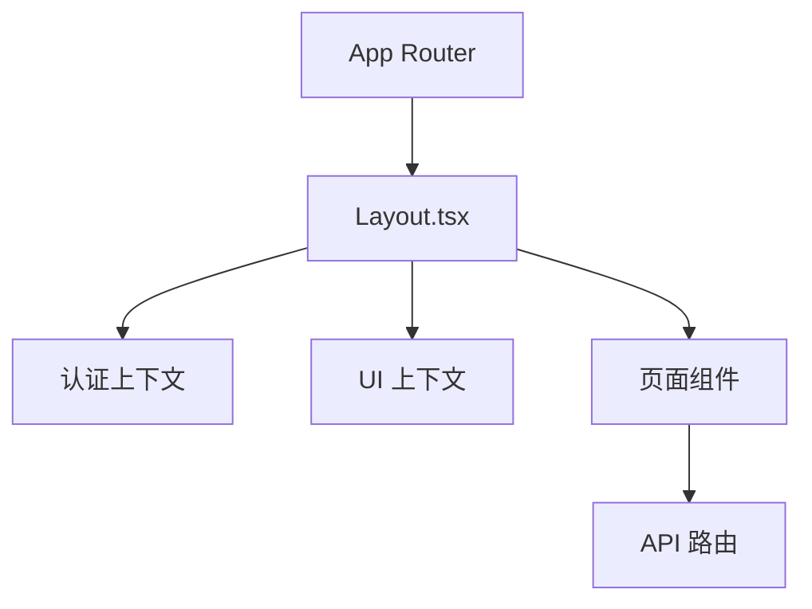
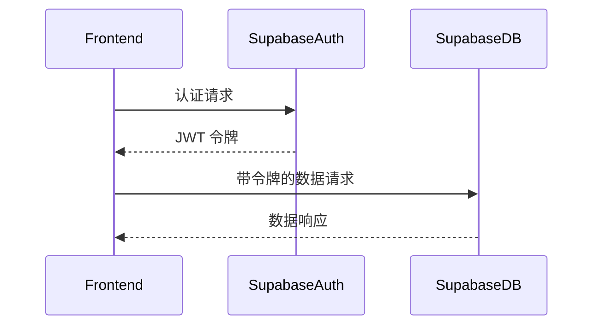
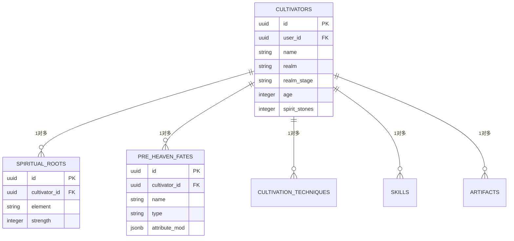
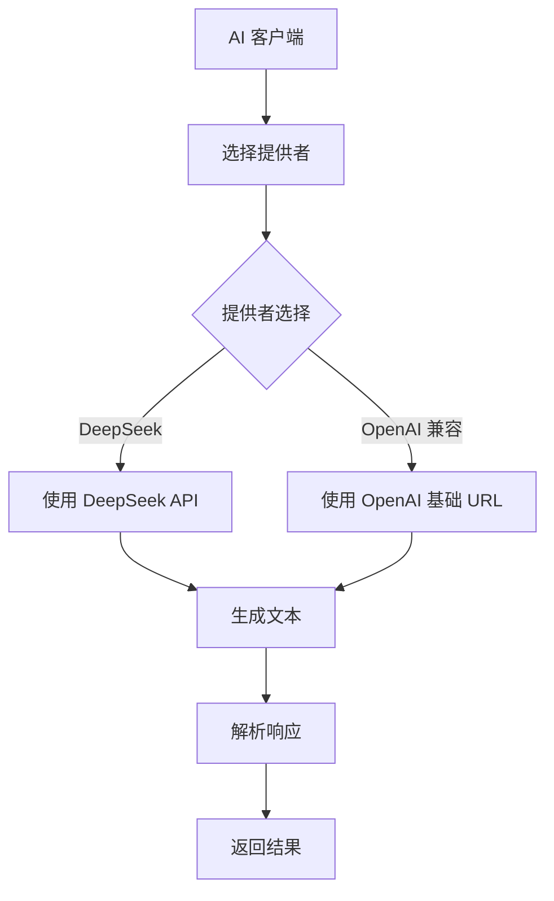
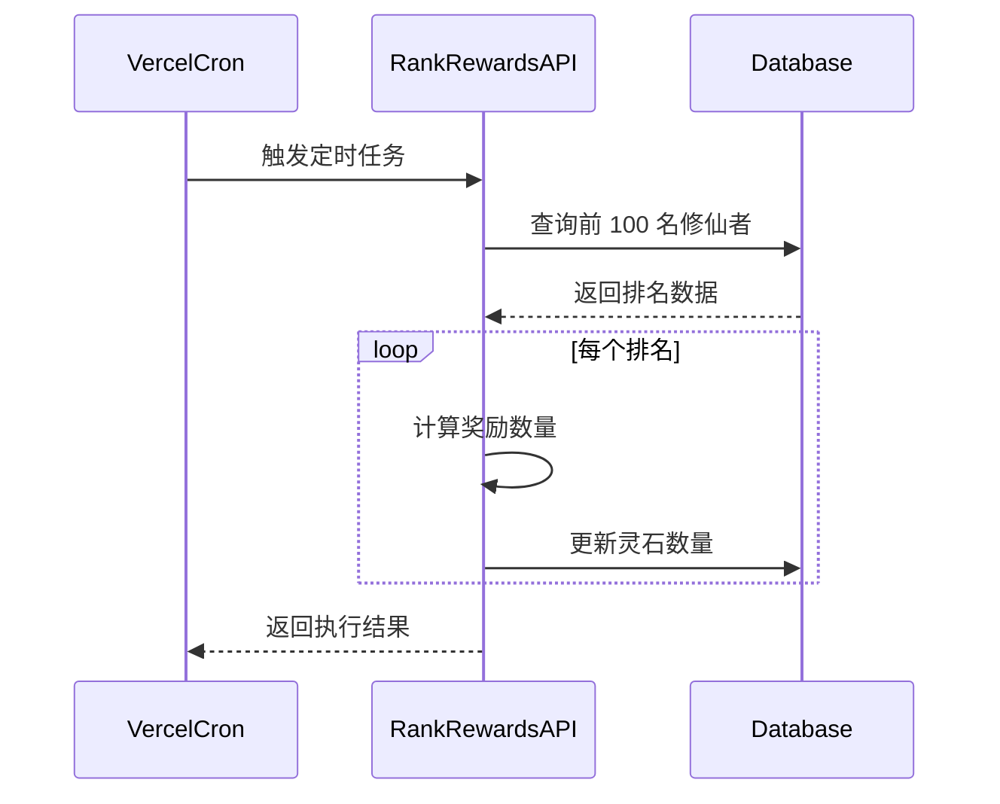

# 技术栈与依赖

<cite>
**本文档中引用的文件**  
- [package.json](file://package.json)
- [ENV_SETUP.md](file://ENV_SETUP.md)
- [next.config.ts](file://next.config.ts)
- [tsconfig.json](file://tsconfig.json)
- [vercel.json](file://vercel.json)
- [app/layout.tsx](file://app/layout.tsx)
- [lib/supabase/client.ts](file://lib/supabase/client.ts)
- [lib/supabase/server.ts](file://lib/supabase/server.ts)
- [lib/drizzle/db.ts](file://lib/drizzle/db.ts)
- [lib/drizzle/schema.ts](file://lib/drizzle/schema.ts)
- [drizzle.config.ts](file://drizzle.config.ts)
- [lib/redis/index.ts](file://lib/redis/index.ts)
- [utils/aiClient.ts](file://utils/aiClient.ts)
- [app/globals.css](file://app/globals.css)
- [postcss.config.mjs](file://postcss.config.mjs)
- [app/api/cron/rank-rewards/route.ts](file://app/api/cron/rank-rewards/route.ts)
- [lib/repositories/cultivatorRepository.ts](file://lib/repositories/cultivatorRepository.ts)
</cite>

## 目录
1. [项目结构概览](#项目结构概览)
2. [前端技术栈](#前端技术栈)
3. [后端服务与集成](#后端服务与集成)
4. [部署与定时任务](#部署与定时任务)
5. [核心依赖分析](#核心依赖分析)
6. [环境配置与初始化](#环境配置与初始化)
7. [架构集成图](#架构集成图)

## 项目结构概览

本项目采用基于 Next.js App Router 的现代化架构，结合 TypeScript 提供类型安全，使用 Tailwind CSS 实现响应式设计。项目结构清晰，主要分为以下几个部分：

- `app/`：Next.js App Router 的核心目录，包含页面和 API 路由
- `components/`：可复用的 UI 组件
- `lib/`：核心库和工具函数，包括数据库、缓存、认证等
- `drizzle/`：Drizzle ORM 的数据库迁移和模式定义
- `utils/`：业务逻辑和 AI 相关的工具函数
- `types/`：TypeScript 类型定义

**项目结构**
- [package.json](file://package.json)
- [next.config.ts](file://next.config.ts)
- [tsconfig.json](file://tsconfig.json)

## 前端技术栈

### Next.js (App Router)

项目采用 Next.js 16 的 App Router 架构，这是目前 Next.js 的推荐模式。App Router 提供了更灵活的路由系统、更好的数据获取模式和更清晰的文件结构。

在 `app/layout.tsx` 中，可以看到应用的根布局组件，它使用了 React 19 的新特性，并通过 `AuthProvider` 和 `InkUIProvider` 提供了认证和 UI 上下文。



**Diagram sources**
- [app/layout.tsx](file://app/layout.tsx)

**Section sources**
- [next.config.ts](file://next.config.ts)
- [app/layout.tsx](file://app/layout.tsx)

### TypeScript

项目使用 TypeScript 提供完整的类型安全。在 `tsconfig.json` 中配置了严格的类型检查，包括 `strict: true` 和模块解析设置。

TypeScript 在项目中被广泛应用于：
- 定义 API 接口的请求和响应类型
- 定义数据库模式和实体类型
- 提供组件的 props 类型检查
- 确保 AI 生成内容的结构化输出

### Tailwind CSS

项目使用 Tailwind CSS 作为 CSS 框架，结合 PostCSS 进行处理。在 `postcss.config.mjs` 中配置了 Tailwind 插件。

在 `app/globals.css` 中，可以看到 Tailwind 的导入以及自定义的字体和主题变量。项目采用了修仙主题的视觉设计，使用了宣纸背景、墨色文字和朱砂红色调。

```css
@theme {
  --color-paper: #f8f3e6; /* 旧纸 */
  --color-ink: #2c1810; /* 正文墨色 */
  --color-crimson: #c1121f; /* 朱砂红 */
}
```

**Section sources**
- [app/globals.css](file://app/globals.css)
- [postcss.config.mjs](file://postcss.config.mjs)

## 后端服务与集成

### Supabase（认证与数据库）

项目使用 Supabase 作为后端服务，提供认证和数据库功能。在 `lib/supabase/client.ts` 和 `lib/supabase/server.ts` 中，可以看到 Supabase 客户端的创建和配置。

Supabase 集成分为两个部分：
- 浏览器端：使用 `createBrowserClient` 创建客户端，用于前端的认证和数据访问
- 服务端：使用 `createServerClient` 创建服务器端客户端，用于 API 路由中的数据操作

环境变量 `NEXT_PUBLIC_SUPABASE_URL` 和 `NEXT_PUBLIC_SUPABASE_ANON_KEY` 用于配置 Supabase 连接。



**Diagram sources**
- [lib/supabase/client.ts](file://lib/supabase/client.ts)
- [lib/supabase/server.ts](file://lib/supabase/server.ts)

**Section sources**
- [lib/supabase/client.ts](file://lib/supabase/client.ts)
- [lib/supabase/server.ts](file://lib/supabase/server.ts)

### Drizzle ORM（类型安全查询）

项目使用 Drizzle ORM 作为数据库访问层，提供类型安全的 SQL 查询。在 `lib/drizzle/db.ts` 中，可以看到 Drizzle 实例的创建和配置。

Drizzle 与 PostgreSQL 数据库集成，通过 `postgres` 包进行连接。在 `drizzle.config.ts` 中配置了 Drizzle 的迁移设置，指向 `lib/drizzle/schema.ts` 作为模式定义文件。

数据库模式定义在 `lib/drizzle/schema.ts` 中，使用 `pgTable` 定义了多个表，包括：
- `cultivators`：角色主表
- `spiritualRoots`：灵根表
- `preHeavenFates`：先天命格表
- `cultivationTechniques`：功法表
- `skills`：技能表
- `artifacts`：法宝表



**Diagram sources**
- [lib/drizzle/schema.ts](file://lib/drizzle/schema.ts)
- [lib/drizzle/db.ts](file://lib/drizzle/db.ts)

**Section sources**
- [lib/drizzle/db.ts](file://lib/drizzle/db.ts)
- [lib/drizzle/schema.ts](file://lib/drizzle/schema.ts)
- [drizzle.config.ts](file://drizzle.config.ts)

### Upstash Redis（高性能缓存）

项目使用 Upstash Redis 作为高性能缓存服务。在 `lib/redis/index.ts` 中，可以看到 Redis 客户端的创建。

通过 `Redis.fromEnv()` 方法，从环境变量中自动读取 Redis 连接信息，简化了配置。Redis 在项目中可能用于：
- 缓存频繁访问的数据
- 存储会话状态
- 实现排行榜功能
- 缓存 AI 生成结果

### @ai-sdk/deepseek（AI内容生成）

项目使用 `@ai-sdk/deepseek` 包集成 DeepSeek AI 模型，用于生成游戏内容。在 `utils/aiClient.ts` 中，可以看到 AI 客户端的完整实现。

AI 客户端提供了多种生成模式：
- `text`：直接生成文本
- `stream_text`：流式生成文本
- `object`：生成结构化数据
- `objectArray`：生成结构化数据数组
- `tool`：使用工具生成文本

通过 `getDeepSeekProvider` 函数，支持多种 AI 服务提供商，包括 DeepSeek、OpenAI 兼容的 API 等。环境变量 `OPENAI_API_KEY` 是必需的，用于认证 AI 服务。



**Diagram sources**
- [utils/aiClient.ts](file://utils/aiClient.ts)

**Section sources**
- [utils/aiClient.ts](file://utils/aiClient.ts)

## 部署与定时任务

### Vercel 部署平台

项目使用 Vercel 作为部署平台，在 `vercel.json` 中配置了定时任务。Vercel 提供了以下优势：
- 无缝集成 Next.js 应用
- 自动化的 CI/CD 流程
- 全球 CDN 加速
- 内置的监控和分析
- 简化的环境变量管理

### 定时任务（cron）

在 `vercel.json` 中配置了两个定时任务：
- `/api/market`：每天凌晨 1 点执行
- `/api/cron/rank-rewards`：每天午夜执行

`app/api/cron/rank-rewards/route.ts` 实现了排行榜奖励发放逻辑，每天为排名前 100 的修仙者发放灵石奖励。该 API 使用 Drizzle ORM 查询数据库，根据排名位置发放不同数量的奖励。



**Diagram sources**
- [vercel.json](file://vercel.json)
- [app/api/cron/rank-rewards/route.ts](file://app/api/cron/rank-rewards/route.ts)

**Section sources**
- [vercel.json](file://vercel.json)
- [app/api/cron/rank-rewards/route.ts](file://app/api/cron/rank-rewards/route.ts)

## 核心依赖分析

### 前端依赖

| 依赖包 | 版本 | 用途 |
|--------|------|------|
| next | 16.0.8 | React 框架，提供服务端渲染和路由 |
| react | 19.2.1 | UI 组件库 |
| tailwindcss | ^4 | 实用优先的 CSS 框架 |
| @vercel/analytics | ^1.6.1 | 网站分析 |

### 后端依赖

| 依赖包 | 版本 | 用途 |
|--------|------|------|
| drizzle-orm | ^0.45.0 | 类型安全的数据库 ORM |
| @supabase/supabase-js | ^2.87.0 | Supabase 客户端 |
| @upstash/redis | ^1.35.7 | Redis 客户端 |
| ai | ^5.0.108 | AI SDK，支持多种模型 |
| @ai-sdk/deepseek | ^1.0.31 | DeepSeek AI 模型集成 |

### 开发依赖

| 依赖包 | 版本 | 用途 |
|--------|------|------|
| typescript | ^5 | JavaScript 超集，提供类型检查 |
| eslint | ^9 | 代码质量检查 |
| prettier | ^3.7.4 | 代码格式化 |
| drizzle-kit | ^0.31.8 | Drizzle ORM 工具包 |

**Section sources**
- [package.json](file://package.json)

## 环境配置与初始化

### 环境变量配置

根据 `ENV_SETUP.md` 文件，环境变量配置分为必需和可选两部分：

#### 必需配置
- `OPENAI_API_KEY`：AI 服务的 API 密钥

#### 可选配置
- `OPENAI_BASE_URL`：自定义 AI 服务基础 URL
- `OPENAI_MODEL`：使用的 AI 模型名称
- `PROVIDER_CHOOSE`：选择 AI 服务提供商
- `ARK_BASE_URL` 和 `ARK_API_KEY`：ARK 服务提供商的配置

环境变量应在 `.env.local` 文件中配置，该文件已被 `.gitignore` 忽略，不会提交到版本控制。

### 依赖服务初始化流程

1. **创建 `.env.local` 文件**：根据 `ENV_SETUP.md` 的说明，创建环境变量文件
2. **配置 Supabase**：设置 `NEXT_PUBLIC_SUPABASE_URL` 和 `NEXT_PUBLIC_SUPABASE_ANON_KEY`
3. **配置数据库**：设置 `DATABASE_URL` 环境变量
4. **配置 Redis**：Upstash Redis 会自动从环境变量中读取连接信息
5. **配置 AI 服务**：设置 `OPENAI_API_KEY` 和其他相关变量
6. **部署到 Vercel**：在 Vercel 控制台中配置相同的环境变量

**Section sources**
- [ENV_SETUP.md](file://ENV_SETUP.md)

## 架构集成图

```mermaid
graph TD
A[前端] --> B[Next.js App Router]
B --> C[Tailwind CSS]
B --> D[TypeScript]
E[后端服务] --> F[Supabase]
F --> G[认证]
F --> H[数据库]
E --> I[Drizzle ORM]
I --> J[PostgreSQL]
E --> K[Upstash Redis]
E --> L[AI 服务]
L --> M[DeepSeek]
L --> N[OpenAI 兼容]
O[Vercel] --> P[部署]
O --> Q[定时任务]
Q --> R[/api/market]
Q --> S[/api/cron/rank-rewards]
B --> E
C --> E
D --> E
```

**Diagram sources**
- [package.json](file://package.json)
- [ENV_SETUP.md](file://ENV_SETUP.md)
- [next.config.ts](file://next.config.ts)
- [tsconfig.json](file://tsconfig.json)
- [vercel.json](file://vercel.json)

**Section sources**
- [package.json](file://package.json)
- [ENV_SETUP.md](file://ENV_SETUP.md)
- [next.config.ts](file://next.config.ts)
- [tsconfig.json](file://tsconfig.json)
- [vercel.json](file://vercel.json)