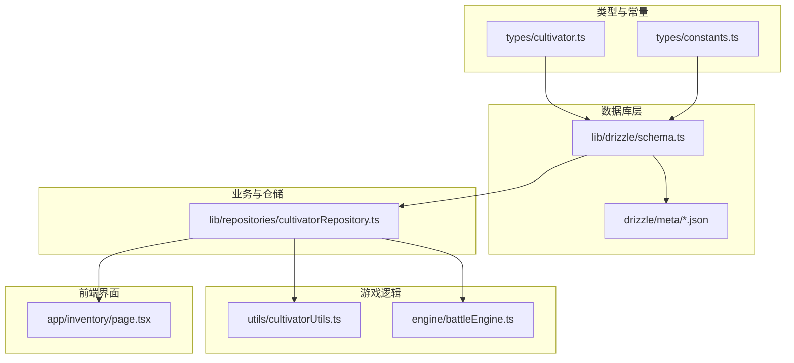
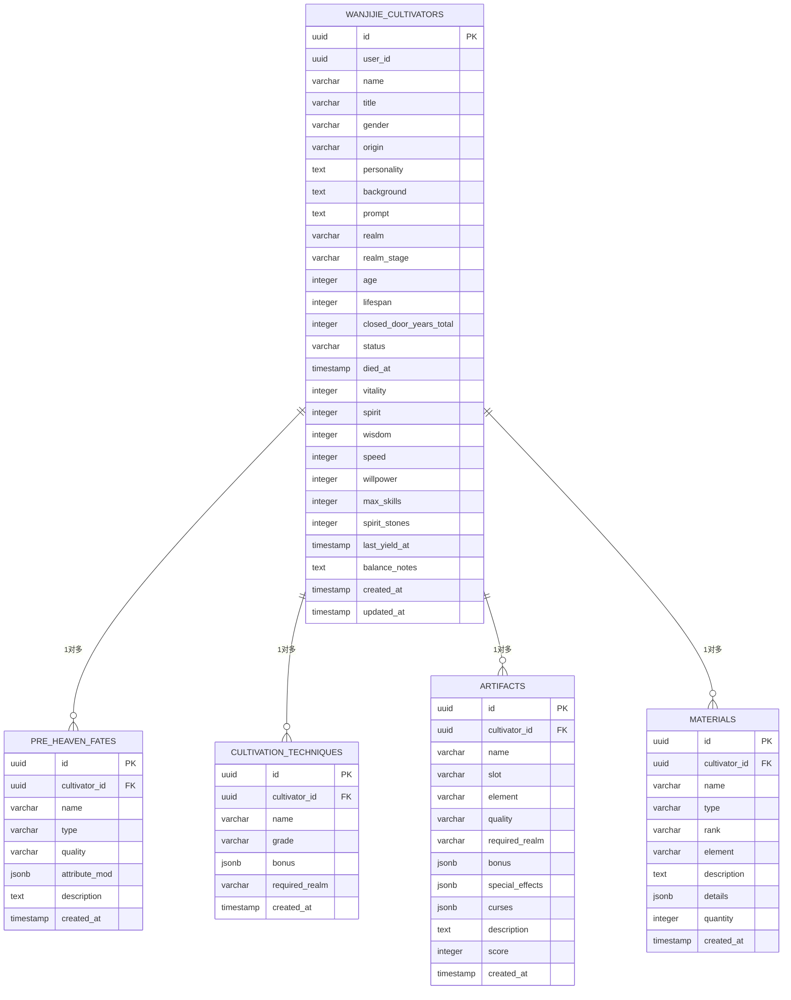
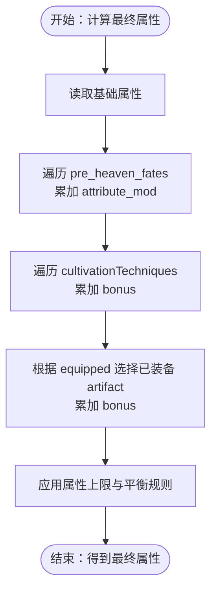
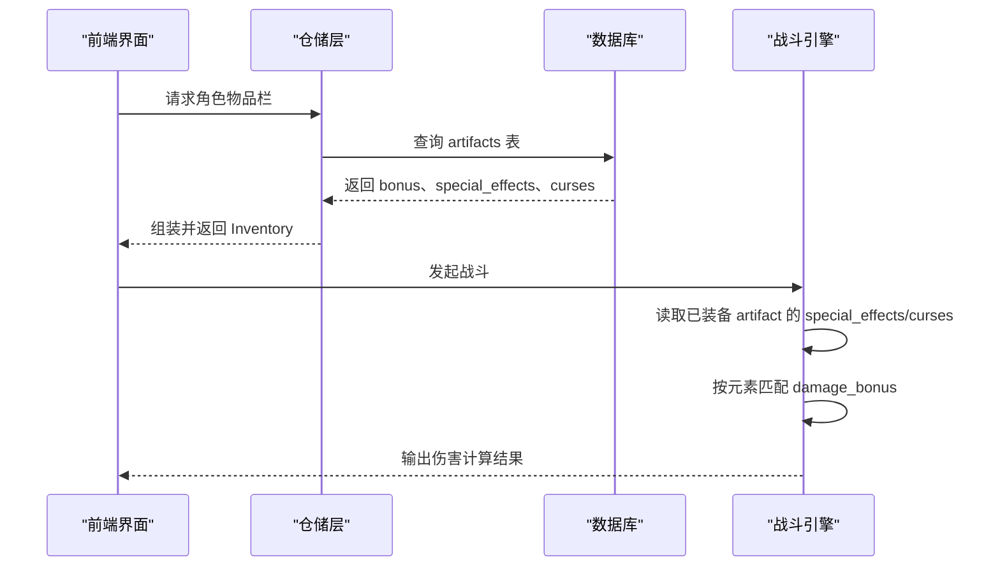
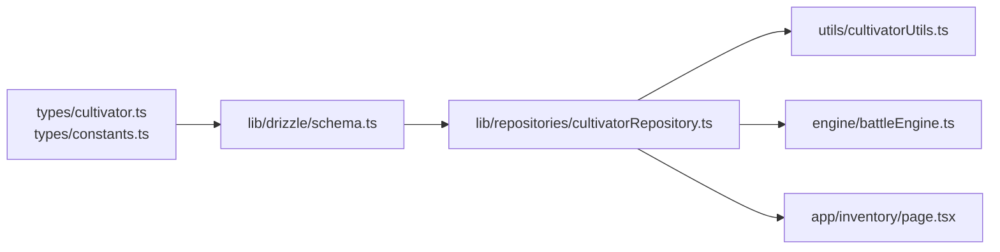

# JSONB数据模式与类型定义

<cite>
**本文引用的文件**
- [types/cultivator.ts](file://types/cultivator.ts)
- [types/constants.ts](file://types/constants.ts)
- [lib/drizzle/schema.ts](file://lib/drizzle/schema.ts)
- [lib/repositories/cultivatorRepository.ts](file://lib/repositories/cultivatorRepository.ts)
- [utils/cultivatorUtils.ts](file://utils/cultivatorUtils.ts)
- [engine/battleEngine.ts](file://engine/battleEngine.ts)
- [app/inventory/page.tsx](file://app/inventory/page.tsx)
- [drizzle/meta/0017_snapshot.json](file://drizzle/meta/0017_snapshot.json)
- [drizzle/meta/0016_snapshot.json](file://drizzle/meta/0016_snapshot.json)
- [drizzle/meta/0015_snapshot.json](file://drizzle/meta/0015_snapshot.json)
- [drizzle/meta/0014_snapshot.json](file://drizzle/meta/0014_snapshot.json)
- [drizzle/meta/0013_snapshot.json](file://drizzle/meta/0013_snapshot.json)
- [drizzle/meta/0012_snapshot.json](file://drizzle/meta/0012_snapshot.json)
- [drizzle/meta/0011_snapshot.json](file://drizzle/meta/0011_snapshot.json)
- [drizzle/meta/0010_snapshot.json](file://drizzle/meta/0010_snapshot.json)
- [drizzle/meta/0009_snapshot.json](file://drizzle/meta/0009_snapshot.json)
- [drizzle/meta/0008_snapshot.json](file://drizzle/meta/0008_snapshot.json)
- [drizzle/meta/0007_snapshot.json](file://drizzle/meta/0007_snapshot.json)
- [drizzle/meta/0005_snapshot.json](file://drizzle/meta/0005_snapshot.json)
- [drizzle/meta/0004_snapshot.json](file://drizzle/meta/0004_snapshot.json)
- [drizzle/meta/0002_snapshot.json](file://drizzle/meta/0002_snapshot.json)
- [drizzle/meta/0001_snapshot.json](file://drizzle/meta/0001_snapshot.json)
- [drizzle/meta/0000_snapshot.json](file://drizzle/meta/0000_snapshot.json)
</cite>

## 目录
1. [简介](#简介)
2. [项目结构](#项目结构)
3. [核心组件](#核心组件)
4. [架构总览](#架构总览)
5. [详细组件分析](#详细组件分析)
6. [依赖关系分析](#依赖关系分析)
7. [性能考量](#性能考量)
8. [故障排查指南](#故障排查指南)
9. [结论](#结论)
10. [附录](#附录)

## 简介
本文件聚焦于数据库中JSONB字段的设计与实现，重点解析cultivators表及其关联表的半结构化数据存储策略，尤其是以下字段：
- cultivators表的属性字段（基础属性）
- pre_heaven_fates表的attribute_mod字段
- cultivationTechniques表的bonus字段
- artifacts表的bonus、special_effects、curses字段
- materials表的details字段
- tempCultivators表的cultivator_data、available_fates字段
- retreatRecords表的modifiers字段
- mails表的attachments字段

同时，文档将说明这些JSONB字段与前端TypeScript类型定义（types/cultivator.ts）的映射关系，解释attribute_mod、bonus、special_effects等动态属性字段在游戏逻辑中的使用方式，并提供在Drizzle ORM中进行高效检索与更新的查询思路与示例路径。

## 项目结构
该仓库采用分层架构，TypeScript类型定义位于types目录，数据库Schema与迁移快照位于drizzle目录，业务逻辑与仓储层位于lib目录，游戏引擎逻辑位于engine目录，前端界面位于app目录。

图表来源
- [types/cultivator.ts](file://types/cultivator.ts#L1-L253)
- [types/constants.ts](file://types/constants.ts#L1-L191)
- [lib/drizzle/schema.ts](file://lib/drizzle/schema.ts#L1-L292)
- [lib/repositories/cultivatorRepository.ts](file://lib/repositories/cultivatorRepository.ts#L1-L200)
- [utils/cultivatorUtils.ts](file://utils/cultivatorUtils.ts#L34-L131)
- [engine/battleEngine.ts](file://engine/battleEngine.ts#L166-L214)
- [app/inventory/page.tsx](file://app/inventory/page.tsx#L435-L465)

章节来源
- [lib/drizzle/schema.ts](file://lib/drizzle/schema.ts#L1-L292)
- [types/cultivator.ts](file://types/cultivator.ts#L1-L253)

## 核心组件
- 类型与常量
  - types/cultivator.ts：定义了Cultivator、Attributes、PreHeavenFate、CultivationTechnique、Skill、Artifact、Consumable、Material、Inventory、EquippedItems等接口，涵盖JSONB字段的结构与可选字段。
  - types/constants.ts：定义ElementType、SkillType、StatusEffect、EquipmentSlot、ConsumableType、GenderType、RealmType、RealmStage、Quality、EffectType、MaterialType等枚举与派生类型，确保JSONB字段的值域一致。
- 数据库Schema
  - lib/drizzle/schema.ts：定义了cultivators、spiritualRoots、preHeavenFates、cultivationTechniques、skills、artifacts、consumables、materials、retreatRecords、breakthroughHistory、equippedItems、tempCultivators、battleRecords、mails等表，其中多处使用jsonb列存储半结构化数据。
- 仓储与装配
  - lib/repositories/cultivatorRepository.ts：负责将数据库记录与JSONB字段装配为完整的Cultivator对象；并提供查询、创建、保存临时角色等操作。
- 游戏逻辑
  - utils/cultivatorUtils.ts：计算最终属性、属性平衡校验与调整。
  - engine/battleEngine.ts：在战斗中读取artifact的special_effects与curses，结合元素与伤害计算。
- 前端展示
  - app/inventory/page.tsx：渲染artifact的bonus与special_effects。

章节来源
- [types/cultivator.ts](file://types/cultivator.ts#L1-L253)
- [types/constants.ts](file://types/constants.ts#L1-L191)
- [lib/drizzle/schema.ts](file://lib/drizzle/schema.ts#L1-L292)
- [lib/repositories/cultivatorRepository.ts](file://lib/repositories/cultivatorRepository.ts#L1-L200)
- [utils/cultivatorUtils.ts](file://utils/cultivatorUtils.ts#L34-L131)
- [engine/battleEngine.ts](file://engine/battleEngine.ts#L166-L214)
- [app/inventory/page.tsx](file://app/inventory/page.tsx#L435-L465)

## 架构总览
JSONB字段贯穿角色主表与多个子表，形成“主表+多张JSONB子表”的半结构化数据模型。TypeScript接口与Drizzle Schema相互映射，保证运行时与数据库层的一致性。

图表来源
- [lib/drizzle/schema.ts](file://lib/drizzle/schema.ts#L1-L292)

## 详细组件分析

### cultivators表与基础属性
- 字段说明
  - 基础属性：vitality、spirit、wisdom、speed、willpower均为整数，直接存储角色的基础属性点数。
  - 其他关键字段：realm、realm_stage、age、lifespan、status、closedDoorYearsTotal、spirit_stones、last_yield_at、max_skills、balance_notes、prompt、background、personality、origin、title、userId、createdAt、updatedAt。
- 类型映射
  - TypeScript接口Cultivator的attributes字段与数据库列一一对应，确保运行时类型安全。
- 使用场景
  - 作为最终属性计算的起点，配合pre_heaven_fates、cultivations、artifacts的bonus进行累加。

章节来源
- [lib/drizzle/schema.ts](file://lib/drizzle/schema.ts#L17-L54)
- [types/cultivator.ts](file://types/cultivator.ts#L21-L27)

### pre_heaven_fates表与attribute_mod
- 字段说明
  - attribute_mod为jsonb，结构与PreHeavenFateAttributeMod一致，允许按需包含vitality、spirit、wisdom、speed、willpower中的若干字段。
- 类型映射
  - PreHeavenFate与PreHeavenFateAttributeMod均来自types/cultivator.ts，确保字段存在性与可选性一致。
- 使用场景
  - 在utils/cultivatorUtils.ts中，遍历pre_heaven_fates并累加attribute_mod到fromFates，作为最终属性的一部分。

图表来源
- [utils/cultivatorUtils.ts](file://utils/cultivatorUtils.ts#L51-L131)
- [types/cultivator.ts](file://types/cultivator.ts#L64-L78)
- [lib/drizzle/schema.ts](file://lib/drizzle/schema.ts#L69-L80)

章节来源
- [lib/drizzle/schema.ts](file://lib/drizzle/schema.ts#L69-L80)
- [types/cultivator.ts](file://types/cultivator.ts#L64-L78)
- [utils/cultivatorUtils.ts](file://utils/cultivatorUtils.ts#L51-L131)

### cultivationTechniques表与bonus
- 字段说明
  - bonus为jsonb，结构与Partial<Attributes>一致，允许按需包含vitality、spirit、wisdom、speed、willpower中的若干字段。
- 类型映射
  - CultivationTechnique.bonus与types/cultivator.ts中的Attributes键集合一致。
- 使用场景
  - 在utils/cultivatorUtils.ts中，遍历cultivations并累加bonus到fromCultivations。

章节来源
- [lib/drizzle/schema.ts](file://lib/drizzle/schema.ts#L82-L96)
- [types/cultivator.ts](file://types/cultivator.ts#L80-L87)
- [utils/cultivatorUtils.ts](file://utils/cultivatorUtils.ts#L88-L112)

### artifacts表与bonus、special_effects、curses
- 字段说明
  - bonus为jsonb，结构与ArtifactBonus一致，允许按需包含vitality、spirit、wisdom、speed、willpower中的若干字段。
  - special_effects与curses为jsonb数组，元素类型为ArtifactEffect联合类型，包括damage_bonus、on_hit_add_effect、on_use_cost_hp、environment_change等。
- 类型映射
  - Artifact、ArtifactBonus、ArtifactEffect、OnHitAddEffect、OnUseCostHpEffect、EnvironmentChangeEffect、DamageBonusEffect等均来自types/cultivator.ts与types/constants.ts。
- 使用场景
  - 在engine/battleEngine.ts中，读取已装备artifact的special_effects与curses，按元素匹配damage_bonus并参与伤害倍率计算。
  - 在app/inventory/page.tsx中，渲染artifact的bonus与special_effects列表。

图表来源
- [lib/repositories/cultivatorRepository.ts](file://lib/repositories/cultivatorRepository.ts#L834-L861)
- [engine/battleEngine.ts](file://engine/battleEngine.ts#L166-L214)
- [app/inventory/page.tsx](file://app/inventory/page.tsx#L435-L465)
- [lib/drizzle/schema.ts](file://lib/drizzle/schema.ts#L136-L156)
- [types/cultivator.ts](file://types/cultivator.ts#L113-L171)
- [types/constants.ts](file://types/constants.ts#L138-L153)

章节来源
- [lib/drizzle/schema.ts](file://lib/drizzle/schema.ts#L136-L156)
- [types/cultivator.ts](file://types/cultivator.ts#L113-L171)
- [types/constants.ts](file://types/constants.ts#L138-L153)
- [engine/battleEngine.ts](file://engine/battleEngine.ts#L166-L214)
- [app/inventory/page.tsx](file://app/inventory/page.tsx#L435-L465)

### materials表与details
- 字段说明
  - details为jsonb，默认空对象，用于存储材料的额外属性（如稀有度、特殊效果等）。
- 类型映射
  - Material.details为Record<string, unknown>，允许任意键值对。
- 使用场景
  - 可在业务逻辑中按需扩展材料的属性，无需修改Schema。

章节来源
- [lib/drizzle/schema.ts](file://lib/drizzle/schema.ts#L120-L134)
- [types/cultivator.ts](file://types/cultivator.ts#L193-L203)

### tempCultivators表与cultivator_data、available_fates
- 字段说明
  - cultivator_data为jsonb，存储完整角色数据（包含所有字段），用于AI生成角色预览与确认。
  - available_fates为jsonb，存储可选的先天气运列表。
- 类型映射
  - 与Cultivator接口保持一致，便于序列化/反序列化。
- 使用场景
  - 在lib/repositories/cultivatorRepository.ts中，createTempCultivator、getTempCultivator、saveTempCultivatorToFormal等函数围绕该表进行操作。

章节来源
- [lib/drizzle/schema.ts](file://lib/drizzle/schema.ts#L230-L239)
- [lib/repositories/cultivatorRepository.ts](file://lib/repositories/cultivatorRepository.ts#L865-L952)
- [drizzle/meta/0017_snapshot.json](file://drizzle/meta/0017_snapshot.json#L1401-L1446)

### retreatRecords表与modifiers
- 字段说明
  - modifiers为jsonb，存储闭关记录的数值修正项（如理解度、年份、失败连击等）。
- 类型映射
  - RetreatRecordModifiers与RetreatRecord在types/cultivator.ts中定义。
- 使用场景
  - 在utils/cultivatorUtils.ts中，计算最终属性时会考虑modifiers对属性增长的影响。

章节来源
- [lib/drizzle/schema.ts](file://lib/drizzle/schema.ts#L175-L188)
- [types/cultivator.ts](file://types/cultivator.ts#L36-L51)
- [lib/repositories/cultivatorRepository.ts](file://lib/repositories/cultivatorRepository.ts#L780-L811)

### mails表与attachments
- 字段说明
  - attachments为jsonb，存储邮件附件数组，元素包含type、id、name、quantity、data等字段。
- 类型映射
  - 与邮件系统业务一致，便于扩展不同类型的附件。
- 使用场景
  - 在业务逻辑中处理邮件领取、查看等操作。

章节来源
- [lib/drizzle/schema.ts](file://lib/drizzle/schema.ts#L266-L280)

### JSONB字段与TypeScript类型一致性
- attribute_mod
  - 类型：PreHeavenFateAttributeMod（可选vitality、spirit、wisdom、speed、willpower）
  - 映射：lib/drizzle/schema.ts中preHeavenFates.attribute_mod为jsonb
- bonus
  - 类型：ArtifactBonus（可选vitality、spirit、wisdom、speed、willpower）
  - 映射：lib/drizzle/schema.ts中artifacts.bonus为jsonb
- special_effects/curses
  - 类型：ArtifactEffect[]（damage_bonus、on_hit_add_effect、on_use_cost_hp、environment_change）
  - 映射：lib/drizzle/schema.ts中artifacts.special_effects、curses为jsonb数组
- details
  - 类型：Record<string, unknown>
  - 映射：lib/drizzle/schema.ts中materials.details为jsonb
- modifiers
  - 类型：RetreatRecordModifiers
  - 映射：lib/drizzle/schema.ts中retreatRecords.modifiers为jsonb
- cultivator_data、available_fates
  - 类型：Cultivator、Cultivator['pre_heaven_fates'][]（可选）
  - 映射：lib/drizzle/schema.ts中tempCultivators.cultivator_data、available_fates为jsonb

章节来源
- [types/cultivator.ts](file://types/cultivator.ts#L36-L78)
- [types/cultivator.ts](file://types/cultivator.ts#L113-L171)
- [types/cultivator.ts](file://types/cultivator.ts#L193-L203)
- [lib/drizzle/schema.ts](file://lib/drizzle/schema.ts#L69-L80)
- [lib/drizzle/schema.ts](file://lib/drizzle/schema.ts#L136-L156)
- [lib/drizzle/schema.ts](file://lib/drizzle/schema.ts#L120-L134)
- [lib/drizzle/schema.ts](file://lib/drizzle/schema.ts#L175-L188)
- [lib/drizzle/schema.ts](file://lib/drizzle/schema.ts#L230-L239)

## 依赖关系分析
- 类型驱动Schema
  - types/cultivator.ts与types/constants.ts定义的枚举与接口，决定lib/drizzle/schema.ts中jsonb字段的结构与默认值。
- 仓储装配
  - lib/repositories/cultivatorRepository.ts将数据库记录与JSONB字段装配为Cultivator对象，确保运行时类型安全。
- 引擎使用
  - engine/battleEngine.ts与utils/cultivatorUtils.ts直接消费JSONB字段，进行属性计算与战斗逻辑。
- 前端渲染
  - app/inventory/page.tsx读取artifact的bonus与special_effects进行展示。

图表来源
- [types/cultivator.ts](file://types/cultivator.ts#L1-L253)
- [types/constants.ts](file://types/constants.ts#L1-L191)
- [lib/drizzle/schema.ts](file://lib/drizzle/schema.ts#L1-L292)
- [lib/repositories/cultivatorRepository.ts](file://lib/repositories/cultivatorRepository.ts#L1-L200)
- [utils/cultivatorUtils.ts](file://utils/cultivatorUtils.ts#L34-L131)
- [engine/battleEngine.ts](file://engine/battleEngine.ts#L166-L214)
- [app/inventory/page.tsx](file://app/inventory/page.tsx#L435-L465)

章节来源
- [lib/repositories/cultivatorRepository.ts](file://lib/repositories/cultivatorRepository.ts#L1-L200)
- [utils/cultivatorUtils.ts](file://utils/cultivatorUtils.ts#L34-L131)
- [engine/battleEngine.ts](file://engine/battleEngine.ts#L166-L214)
- [app/inventory/page.tsx](file://app/inventory/page.tsx#L435-L465)

## 性能考量
- JSONB查询建议
  - 对频繁过滤的字段（如element、slot、grade、quality）建立合适的索引以优化查询性能（例如GIN索引）。
  - 在聚合计算（如累加bonus、attribute_mod）时，尽量在应用层进行，避免复杂的JSONB聚合SQL。
- 事务与批量写入
  - 在创建角色时，使用事务一次性插入主表与多张子表，减少往返次数。
- 分页与懒加载
  - 对artifacts、consumables、materials等大表采用分页或延迟加载，降低单次查询负载。

## 故障排查指南
- 类型不一致
  - 若出现运行时类型错误，检查types/cultivator.ts与lib/drizzle/schema.ts中jsonb字段的结构是否一致。
- JSONB字段为空或默认值
  - 检查drizzle/meta/*_snapshot.json中jsonb字段的默认值定义（如'[]'::jsonb、'{}'::jsonb）。
- 查询异常
  - 确认Drizzle ORM查询条件与字段类型匹配，避免隐式转换导致的性能问题。
- 属性溢出
  - 使用utils/cultivatorUtils.ts中的属性平衡校验与调整函数，确保属性总和不超过上限的80%。

章节来源
- [drizzle/meta/0017_snapshot.json](file://drizzle/meta/0017_snapshot.json#L1401-L1446)
- [drizzle/meta/0016_snapshot.json](file://drizzle/meta/0016_snapshot.json#L49-L104)
- [drizzle/meta/0015_snapshot.json](file://drizzle/meta/0015_snapshot.json#L49-L104)
- [drizzle/meta/0014_snapshot.json](file://drizzle/meta/0014_snapshot.json#L49-L99)
- [utils/cultivatorUtils.ts](file://utils/cultivatorUtils.ts#L272-L313)

## 结论
本项目通过JSONB字段实现了灵活的半结构化数据存储，使角色的属性加成、技能效果、法宝特效、材料详情等复杂嵌套数据得以高效表达与使用。TypeScript接口与Drizzle Schema相互映射，确保了类型安全与运行时一致性。在实际开发中，应重视类型与Schema的一致性、合理使用事务与索引、并在应用层完成复杂聚合计算，以获得更好的性能与可维护性。

## 附录

### JSONB查询示例（路径指引）
以下为在Drizzle ORM中进行JSONB查询与更新的示例路径（不包含具体代码内容）：
- 查询并装配角色（含JSONB字段）
  - [lib/repositories/cultivatorRepository.ts](file://lib/repositories/cultivatorRepository.ts#L322-L343)
  - [lib/repositories/cultivatorRepository.ts](file://lib/repositories/cultivatorRepository.ts#L348-L366)
- 获取角色物品栏（artifacts）
  - [lib/repositories/cultivatorRepository.ts](file://lib/repositories/cultivatorRepository.ts#L834-L861)
- 临时角色保存与清理
  - [lib/repositories/cultivatorRepository.ts](file://lib/repositories/cultivatorRepository.ts#L865-L952)
  - [lib/repositories/cultivatorRepository.ts](file://lib/repositories/cultivatorRepository.ts#L974-L982)
- 读取artifact的special_effects与curses（战斗引擎）
  - [engine/battleEngine.ts](file://engine/battleEngine.ts#L166-L214)
- 前端渲染artifact的bonus与special_effects
  - [app/inventory/page.tsx](file://app/inventory/page.tsx#L435-L465)

### JSONB字段快照对照（节选）
- artifacts表（bonus、special_effects、curses）
  - [drizzle/meta/0017_snapshot.json](file://drizzle/meta/0017_snapshot.json#L49-L104)
  - [drizzle/meta/0016_snapshot.json](file://drizzle/meta/0016_snapshot.json#L49-L104)
  - [drizzle/meta/0015_snapshot.json](file://drizzle/meta/0015_snapshot.json#L49-L104)
  - [drizzle/meta/0014_snapshot.json](file://drizzle/meta/0014_snapshot.json#L49-L99)
- materials表（details）
  - [drizzle/meta/0017_snapshot.json](file://drizzle/meta/0017_snapshot.json#L912-L933)
  - [drizzle/meta/0016_snapshot.json](file://drizzle/meta/0016_snapshot.json#L880-L935)
  - [drizzle/meta/0015_snapshot.json](file://drizzle/meta/0015_snapshot.json#L880-L935)
  - [drizzle/meta/0014_snapshot.json](file://drizzle/meta/0014_snapshot.json#L880-L935)
- pre_heaven_fates表（attribute_mod）
  - [drizzle/meta/0017_snapshot.json](file://drizzle/meta/0017_snapshot.json#L1056-L1067)
  - [drizzle/meta/0016_snapshot.json](file://drizzle/meta/0016_snapshot.json#L1056-L1067)
  - [drizzle/meta/0015_snapshot.json](file://drizzle/meta/0015_snapshot.json#L1056-L1067)
  - [drizzle/meta/0014_snapshot.json](file://drizzle/meta/0014_snapshot.json#L1056-L1067)
- tempCultivators表（cultivator_data、available_fates）
  - [drizzle/meta/0017_snapshot.json](file://drizzle/meta/0017_snapshot.json#L1401-L1446)
  - [drizzle/meta/0016_snapshot.json](file://drizzle/meta/0016_snapshot.json#L1305-L1358)
  - [drizzle/meta/0015_snapshot.json](file://drizzle/meta/0015_snapshot.json#L1208-L1260)
  - [drizzle/meta/0014_snapshot.json](file://drizzle/meta/0014_snapshot.json#L1208-L1260)