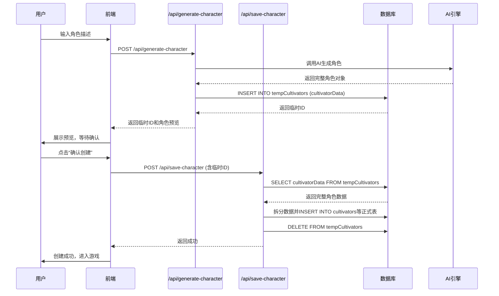
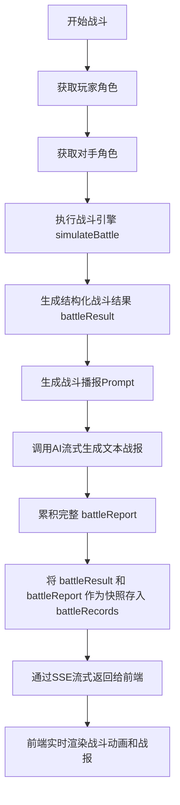

# 临时角色与战斗记录快照

<cite>
**本文档引用的文件**   
- [schema.ts](file://lib/drizzle/schema.ts)
- [generate-character/route.ts](file://app/api/generate-character/route.ts)
- [save-character/route.ts](file://app/api/save-character/route.ts)
- [battle/route.ts](file://app/api/battle/route.ts)
- [battles/route.ts](file://app/api/battles/route.ts)
- [battles/[id]/route.ts](file://app/api/battles/[id]/route.ts)
- [battleHistory.tsx](file://app/battle/history/page.tsx)
- [cultivatorRepository.ts](file://lib/repositories/cultivatorRepository.ts)
</cite>

## 目录
1. [引言](#引言)
2. [核心设计：快照机制](#核心设计快照机制)
3. [临时角色表（tempCultivators）](#临时角色表tempcultivators)
4. [战斗记录表（battleRecords）](#战斗记录表battlerecords)
5. [数据一致性与防作弊机制](#数据一致性与防作弊机制)
6. [战报回放与数据分析](#战报回放与数据分析)
7. [结论](#结论)

## 引言
本项目为一款修仙题材的互动游戏，其核心玩法依赖于AI生成的角色与战斗系统。为确保用户体验的流畅性与数据的可靠性，系统设计了两个关键的数据快照表：`tempCultivators`（临时角色）和`battleRecords`（战斗记录）。这两个表通过快照机制，分别解决了角色创建过程中的预览确认问题和战斗过程中的结果存档与回放问题。本文档将深入解析这两个表的设计意图与技术实现，阐述其在保证数据一致性、支持战报回放、防止作弊方面的重要作用。

## 核心设计：快照机制
快照机制是本系统数据架构的核心设计理念。它指的是在特定业务流程的关键节点，将当时完整的、结构化的数据状态以不可变的形式持久化存储。这种设计与传统的仅存储最终状态的模式不同，快照保留了“历史瞬间”的完整信息，为系统提供了强大的数据追溯、审计和复现能力。

在本项目中，快照机制主要应用于两个场景：
1.  **角色创建流程**：当用户提交角色描述后，AI生成的完整角色数据并非直接存入正式表，而是先作为“快照”存入`tempCultivators`表。这为用户提供了预览和确认的机会，避免了直接修改主数据可能带来的错误。
2.  **战斗执行流程**：每一场战斗的完整过程和结果，包括战斗引擎的原始输出和AI生成的文本战报，都会被作为一个“快照”存入`battleRecords`表。这确保了战斗结果的可追溯性和不可篡改性。

**Section sources**
- [schema.ts](file://lib/drizzle/schema.ts#L230-L264)

## 临时角色表（tempCultivators）
`tempCultivators`表是角色创建流程中的关键环节，其设计旨在实现“预览-确认”模式，提升用户体验并保证主数据的纯净。

### 设计意图
在传统的角色创建流程中，用户提交信息后，系统直接生成并保存角色。如果生成结果不符合预期，用户将面临无法修改或需要复杂回滚操作的困境。`tempCultivators`表通过引入一个临时存储层，将“生成”与“保存”两个动作分离。用户可以先预览AI生成的完整角色，满意后再确认保存，不满意则可以重新生成，整个过程对正式角色表`cultivators`无任何影响。

### 技术实现
该表的核心在于`cultivatorData`字段，其技术实现如下：
- **字段类型**：`cultivatorData`字段使用`jsonb`类型，这是一种PostgreSQL提供的二进制JSON格式，支持高效的存储、索引和查询。
- **数据内容**：该字段以JSON格式完整存储了AI生成的角色对象，包括基础属性、灵根、功法、技能、材料等所有信息。这相当于将一个完整的、复杂的对象图序列化后存入单个数据库字段。
- **工作流程**：
  1. 用户在前端输入角色描述并提交。
  2. 后端API `/api/generate-character` 调用AI生成角色，并将生成的完整角色对象存入`tempCultivators`表的`cultivatorData`字段。
  3. 前端获取该临时ID，展示角色预览。
  4. 用户确认后，调用 `/api/save-character` 接口，后端从`tempCultivators`表读取`cultivatorData`，将其解析并拆分后，存入正式的`cultivators`及其关联表中，随后删除临时记录。

**Diagram sources**
- [schema.ts](file://lib/drizzle/schema.ts#L230-L238)
- [generate-character/route.ts](file://app/api/generate-character/route.ts#L56)
- [save-character/route.ts](file://app/api/save-character/route.ts#L63-L97)

**Section sources**
- [schema.ts](file://lib/drizzle/schema.ts#L230-L238)
- [generate-character/route.ts](file://app/api/generate-character/route.ts)
- [save-character/route.ts](file://app/api/save-character/route.ts)

## 战斗记录表（battleRecords）
`battleRecords`表是战斗系统的数据基石，其设计旨在完整、不可变地记录每一次战斗的全过程，为战报回放、数据分析和反作弊提供支持。

### 设计意图
战斗是游戏的核心交互，其结果直接影响玩家的体验和游戏的公平性。`battleRecords`表的设计意图有三：
1.  **结果存档**：永久保存每一场战斗的最终结果，供玩家随时查阅。
2.  **过程回放**：结合结构化数据和非结构化文本，实现战斗过程的完整复现。
3.  **数据审计**：提供一个不可篡改的记录，用于验证战斗结果的公正性，防止客户端作弊。

### 技术实现
该表通过两个核心字段实现了结构化与非结构化数据的互补：
- **battleResult 字段**：此字段同样使用`jsonb`类型，用于存储战斗引擎（`battleEngine`）输出的完整结构化结果。这个结果对象包含了战斗的每一个回合、每一次技能释放、双方的生命值变化、胜负判定等所有精确的、可程序化解析的数据。它是战斗的“事实真相”。
- **battleReport 字段**：此字段使用`text`类型，用于存储由AI根据`battleResult`生成的、生动形象的文本战报。这段文本以文学化的方式描述了战斗的激烈场面，是给玩家看的“故事”。

这种设计形成了完美的互补：
- **结构化数据 (`battleResult`)**：机器可读，便于程序进行统计分析、成就判定、排行榜计算等。
- **非结构化数据 (`battleReport`)**：人类可读，极大地提升了叙事体验和沉浸感。

**Diagram sources**
- [schema.ts](file://lib/drizzle/schema.ts#L240-L264)
- [battle/route.ts](file://app/api/battle/route.ts#L73-L120)

**Section sources**
- [schema.ts](file://lib/drizzle/schema.ts#L240-L264)
- [battle/route.ts](file://app/api/battle/route.ts)
- [battles/route.ts](file://app/api/battles/route.ts)
- [battles/[id]/route.ts](file://app/api/battles/[id]/route.ts)

## 数据一致性与防作弊机制
快照机制是保障系统数据一致性和防止作弊的核心手段。

### 数据一致性
通过将关键流程的结果以快照形式固化，系统避免了因业务逻辑复杂或网络问题导致的数据不一致。例如，在战斗流程中，即使前端因网络中断未能完整接收SSE流，后端依然会将完整的`battleResult`和`battleReport`写入`battleRecords`表。当用户重新加载页面时，可以从数据库中获取完整的战斗记录，确保了数据的一致性。

### 防止作弊
该机制有效防止了客户端作弊。所有核心逻辑（角色生成、战斗计算）都在服务端完成，客户端仅负责展示。`battleRecords`表中的`battleResult`是唯一可信的来源。即使客户端被篡改，试图伪造胜利，服务端在写入数据库时依然会使用真实的计算结果。玩家的战斗历史页面（`battle/history/page.tsx`）通过调用`/api/battles`接口获取数据，这些数据直接来源于数据库快照，而非客户端上报，从根本上杜绝了伪造战绩的可能性。

**Section sources**
- [battle/route.ts](file://app/api/battle/route.ts#L114-L124)
- [battles/route.ts](file://app/api/battles/route.ts)
- [battleHistory.tsx](file://app/battle/history/page.tsx)

## 战报回放与数据分析
`battleRecords`表为战报回放和深度数据分析提供了坚实的基础。

### 战报回放
系统可以利用`battleRecords`表中的数据，实现高质量的战斗回放功能。前端组件`BattleReplayViewer`可以读取`battleResult`中的`timeline`字段，精确地复现战斗的每一个动作和状态变化，同时将`battleReport`中的文本作为旁白同步播放，为玩家提供电影级的回放体验。

### 数据分析
结构化的`battleResult`数据为数据分析打开了大门。运营团队可以分析：
- 各类技能的胜率和使用频率。
- 不同境界、不同属性组合的角色的战斗表现。
- 战斗的平均回合数和激烈程度。
这些数据可以用于平衡游戏数值、设计新内容和优化玩家体验。

**Section sources**
- [battleRecords](file://lib/drizzle/schema.ts#L240-L264)
- [battleEngine.ts](file://engine/battleEngine.ts)

## 结论
`tempCultivators`和`battleRecords`这两个快照表的设计，体现了以数据为中心的稳健架构思想。通过`jsonb`字段存储完整的结构化对象，系统实现了复杂数据的高效快照。`tempCultivators`表保障了角色创建流程的用户体验和数据安全，而`battleRecords`表则通过结构化与非结构化数据的互补，完美地解决了战斗结果的存档、回放和防作弊问题。这一快照机制不仅提升了系统的可靠性和可维护性，也为未来实现更丰富的功能（如战斗录像、AI对战分析）奠定了坚实的数据基础。