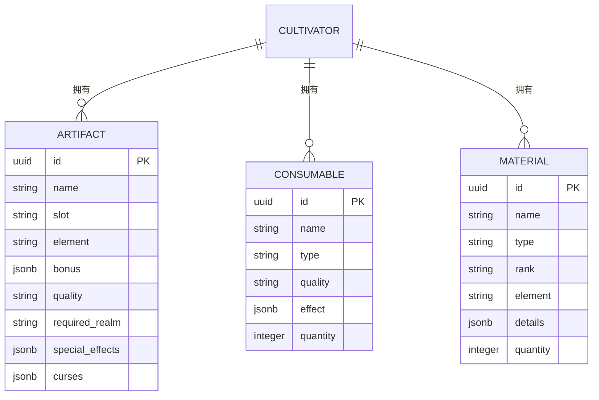
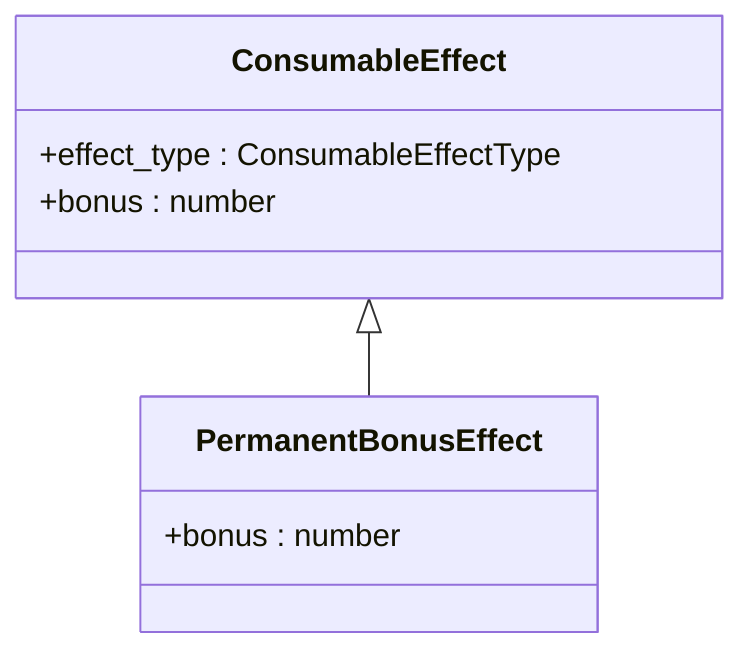
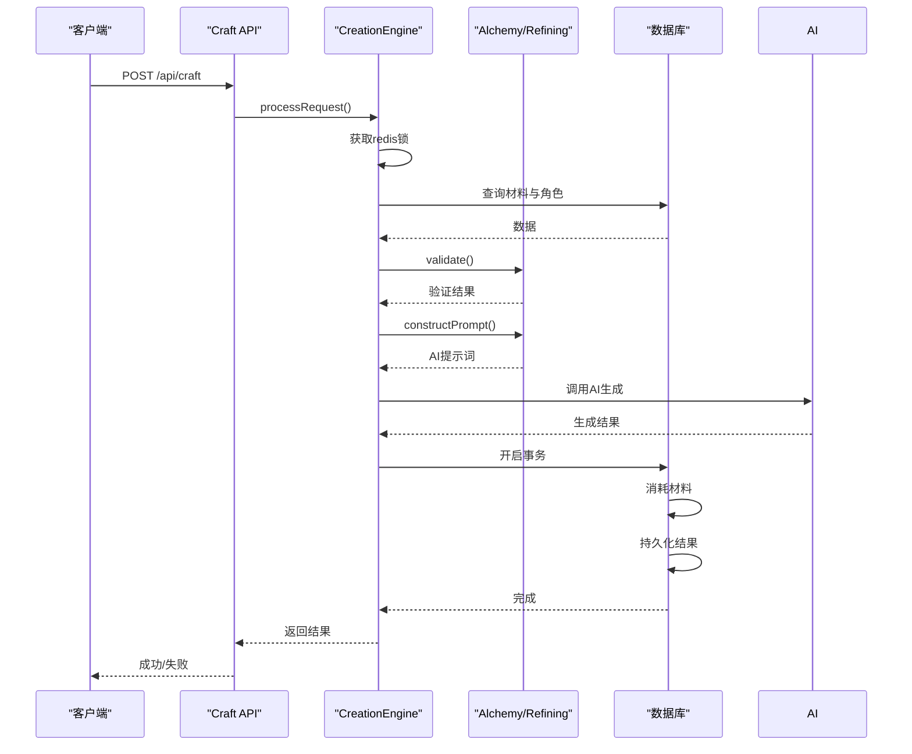
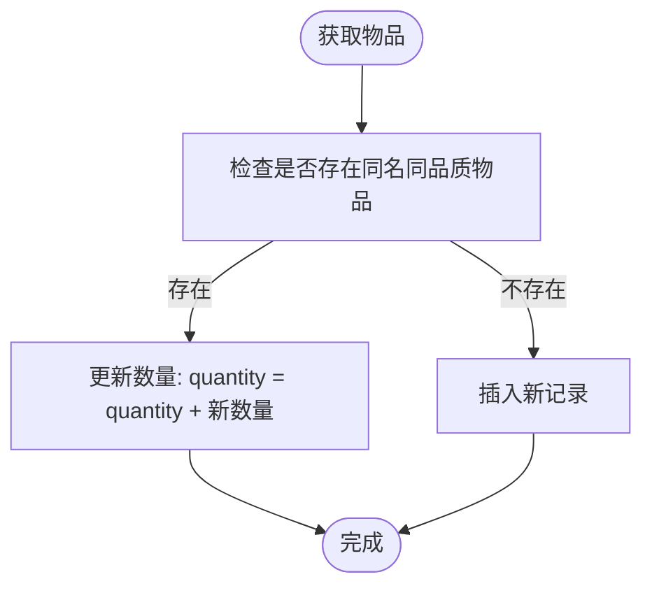

# 储物袋与材料消耗品管理

<cite>
**本文档引用文件**   
- [schema.ts](file://lib/drizzle/schema.ts)
- [AlchemyStrategy.ts](file://engine/creation/strategies/AlchemyStrategy.ts)
- [RefiningStrategy.ts](file://engine/creation/strategies/RefiningStrategy.ts)
- [CreationEngine.ts](file://engine/creation/CreationEngine.ts)
- [craft/route.ts](file://app/api/craft/route.ts)
- [inventory/route.ts](file://app/api/cultivators/[id]/inventory/route.ts)
- [cultivatorRepository.ts](file://lib/repositories/cultivatorRepository.ts)
- [constants.ts](file://types/constants.ts)
- [rankingUtils.ts](file://utils/rankingUtils.ts)
- [consumables](file://drizzle/0013_brown_nico_minoru.sql)
- [materials](file://drizzle/meta/0014_snapshot.json)
</cite>

## 目录
1. [储物袋整体结构设计](#储物袋整体结构设计)
2. [三大物品类别数据模型差异](#三大物品类别数据模型差异)
3. [消耗品效果设计](#消耗品效果设计)
4. [材料表灵活扩展能力](#材料表灵活扩展能力)
5. [炼器炼丹合成逻辑](#炼器炼丹合成逻辑)
6. [堆叠管理机制](#堆叠管理机制)

## 储物袋整体结构设计

储物袋（Inventory）是修仙者管理个人物品的核心系统，其结构设计围绕角色（Cultivator）展开，通过数据库外键关联实现数据隔离与归属。储物袋包含三大核心物品类别：法宝（Artifacts）、消耗品（Consumables）和材料（Materials），均以1对多关系挂载于角色主表。

系统通过`/api/cultivators/[id]/inventory`接口获取指定角色的完整库存数据，该接口并行查询三张物品表，确保高效响应。库存数据在前端通过`InventoryPage`组件以标签页形式展示，支持查看、丢弃等操作。所有物品操作均需通过`redis`分布式锁（`craft:lock:${cultivatorId}`）进行并发控制，防止多线程操作导致的数据不一致。

**Section sources**
- [schema.ts](file://lib/drizzle/schema.ts#L136-L173)
- [inventory/route.ts](file://app/api/cultivators/[id]/inventory/route.ts#L9-L45)
- [inventory/page.tsx](file://app/inventory/page.tsx#L1-L353)

## 三大物品类别数据模型差异

三类物品在数据模型上存在显著差异，体现了其不同的功能定位和使用场景。



**Diagram sources **
- [schema.ts](file://lib/drizzle/schema.ts#L137-L173)

### 法宝（Artifacts）
法宝是角色的核心装备，直接影响战斗属性。其数据模型最为复杂，包含`slot`（部位）、`element`（元素）、`bonus`（基础属性加成）、`special_effects`（特效）和`curses`（诅咒）等字段。`required_realm`字段确保法宝与角色境界匹配，防止越级使用。

### 消耗品（Consumables）
消耗品主要用于临时或永久提升角色能力。其核心是`effect`字段，以JSONB格式存储效果数据。`type`字段目前固定为“丹药”，为未来扩展其他类型（如符箓）预留空间。`quantity`字段支持堆叠，优化存储与展示。

### 材料（Materials）
材料是炼器、炼丹的输入资源。其`type`字段区分`herb`（草药）、`ore`（矿石）等类型，用于合成逻辑校验。`rank`（品阶）和`element`（元素）影响合成产物品质。`details`字段提供灵活的元数据扩展能力。

**Section sources**
- [schema.ts](file://lib/drizzle/schema.ts#L121-L173)
- [constants.ts](file://types/constants.ts#L128-L136)

## 消耗品效果设计

消耗品的`effect`字段采用JSONB类型存储`ConsumableEffect`数组，实现灵活的效果定义。其设计核心在于`ConsumableEffectType`枚举，定义了五种永久增益效果。

### ConsumableEffect类型设计


**Diagram sources **
- [types/cultivator.ts](file://types/cultivator.ts#L172-L181)
- [constants.ts](file://types/constants.ts#L157-L164)

`ConsumableEffect`是一个基础接口，包含`effect_type`和`bonus`字段。`PermanentBonusEffect`是其具体实现，代表永久属性提升。`effect_type`的取值严格限定在`CONSUMABLE_EFFECT_VALUES`枚举中，确保数据一致性。

### JSONB存储格式
当一个消耗品被创建时，其`effect`字段存储为JSON数组。例如，一个提升体魄和灵力的丹药，其存储格式如下：
```json
[{"effect_type": "永久提升体魄", "bonus": 15}, {"effect_type": "永久提升灵力", "bonus": 10}]
```
这种设计允许单个消耗品拥有多个效果，同时保持查询的灵活性。

**Section sources**
- [types/cultivator.ts](file://types/cultivator.ts#L172-L181)
- [AlchemyStrategy.ts](file://engine/creation/strategies/AlchemyStrategy.ts#L19-L31)

## 材料表灵活扩展能力

材料表的`details`字段是其灵活性的核心，允许存储任意结构的元数据，适应不同材料类型的特殊需求。

### details字段设计
`details`字段定义为`jsonb('details').default({})`，默认值为空JSON对象。这使得系统可以为特定材料类型存储额外属性，而无需修改数据库表结构。

例如，一个`monster`（妖兽）类型的材料，其`details`可能包含：
```json
{"drop_rate": 0.25, "habitat": "幽暗森林", "weakness": "雷"}
```
而一个`ore`（矿石）类型的材料，其`details`可能包含：
```json
{"purity": 0.95, "hardness": 8}
```
这种设计极大地增强了系统的可扩展性，新类型的材料可以无缝集成。

**Section sources**
- [schema.ts](file://lib/drizzle/schema.ts#L131)
- [materials](file://drizzle/meta/0014_snapshot.json#L812-L818)

## 炼器炼丹合成逻辑

材料作为炼器、炼丹的输入，通过`craft`系统参与合成逻辑。合成过程由`CreationEngine`统一调度，根据`craftType`选择不同的策略。

### 合成流程


**Diagram sources **
- [CreationEngine.ts](file://engine/creation/CreationEngine.ts#L35-L132)
- [craft/route.ts](file://app/api/craft/route.ts#L7-L62)

1. **请求处理**：客户端通过`/api/craft`接口发起合成请求，携带`materialIds`、`prompt`和`craftType`。
2. **并发控制**：`CreationEngine`首先尝试获取`redis`锁，确保同一角色的合成操作串行执行。
3. **数据验证**：引擎验证材料归属和角色状态，并根据`craftType`选择`AlchemyStrategy`（炼丹）或`RefiningStrategy`（炼器）。
4. **AI生成**：策略类构建AI提示词，调用AI生成合成结果。炼丹策略会根据材料元素和品阶，生成符合规则的丹药。
5. **事务持久化**：在数据库事务中，先消耗材料（更新`quantity`或删除记录），再将生成的法宝或消耗品存入数据库。

**Section sources**
- [CreationEngine.ts](file://engine/creation/CreationEngine.ts#L35-L132)
- [AlchemyStrategy.ts](file://engine/creation/strategies/AlchemyStrategy.ts#L44-L165)
- [RefiningStrategy.ts](file://engine/creation/strategies/RefiningStrategy.ts#L62-L154)

## 堆叠管理机制

所有物品类别均通过`quantity`字段实现堆叠管理，优化了库存空间和用户体验。

### quantity字段实现
`quantity`字段在三张表中均有定义，类型为`integer`，默认值为1。当获取物品时，系统会检查是否存在同名、同品质的物品，若存在则增加其`quantity`，否则创建新记录。



**Diagram sources **
- [mail/[id]/claim/route.ts](file://app/api/mail/[id]/claim/route.ts#L80-L98)
- [schema.ts](file://lib/drizzle/schema.ts#L132)

例如，在领取邮件附件时，系统会先查询是否存在相同的材料，若存在则执行`UPDATE materials SET quantity = quantity + ? WHERE id = ?`，避免产生重复条目。当使用物品时，若`quantity`大于1，则执行`UPDATE`减1；若等于1，则执行`DELETE`。

**Section sources**
- [mail/[id]/claim/route.ts](file://app/api/mail/[id]/claim/route.ts#L80-L98)
- [consumables](file://drizzle/0013_brown_nico_minoru.sql#L1)
- [cultivatorRepository.ts](file://lib/repositories/cultivatorRepository.ts#L1354-L1364)