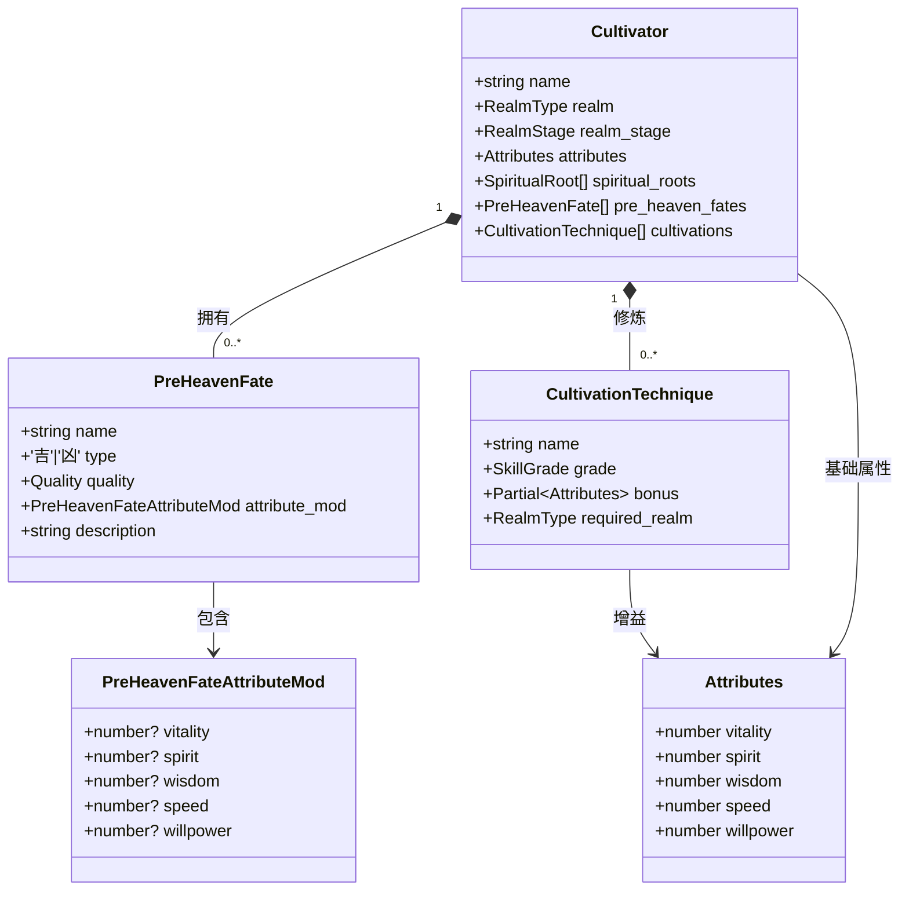
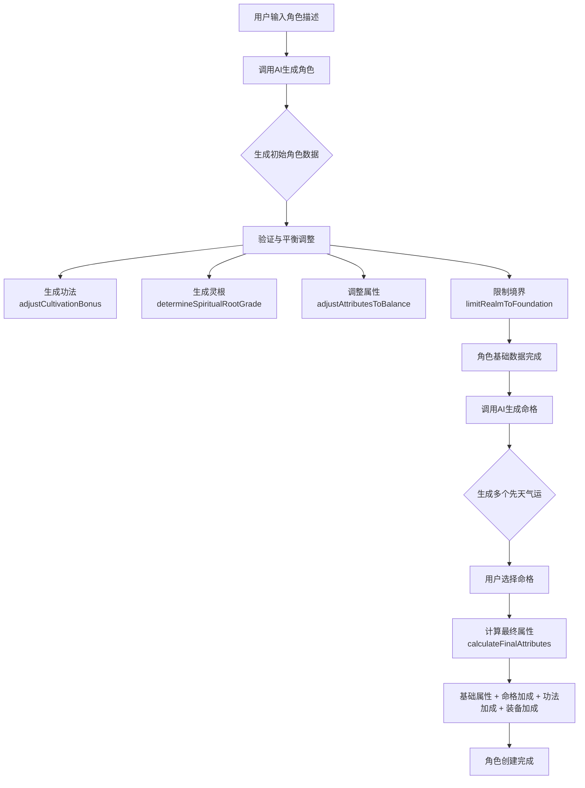

# 先天命格与功法修炼体系

<cite>
**本文档引用文件**  
- [schema.ts](file://lib/drizzle/schema.ts)
- [cultivator.ts](file://types/cultivator.ts)
- [fateGenerator.ts](file://utils/fateGenerator.ts)
- [characterEngine.ts](file://utils/characterEngine.ts)
- [prompts.ts](file://utils/prompts.ts)
- [cultivatorUtils.ts](file://utils/cultivatorUtils.ts)
- [generate-character/route.ts](file://app/api/generate-character/route.ts)
- [generate-fates/route.ts](file://app/api/generate-fates/route.ts)
- [constants.ts](file://types/constants.ts)
</cite>

## 目录
1. [先天命格系统](#先天命格系统)
2. [功法修炼系统](#功法修炼系统)
3. [AI生成流程与角色塑造](#ai生成流程与角色塑造)

## 先天命格系统

先天命格（Pre-Heaven Fates）是角色成长的核心系统之一，通过`preHeavenFates`数据库表与`PreHeavenFate`接口共同实现。该系统利用JSONB字段`attribute_mod`存储动态属性修正值，为角色提供长期、稳定的属性加成。

在数据结构层面，`preHeavenFates`表（`wanjiedaoyou_pre_heaven_fates`）包含`name`（命格名称）、`type`（吉凶类型）、`quality`（品质）以及`attribute_mod`（属性修正）等关键字段。其中，`attribute_mod`被定义为`jsonb`类型，允许存储一个包含`vitality`（体魄）、`spirit`（灵力）、`wisdom`（悟性）、`speed`（速度）、`willpower`（神识）等可选键的JSON对象，实现了高度灵活的属性修正机制。

对应的TypeScript接口`PreHeavenFate`定义了相同的数据结构。`attribute_mod`字段的类型为`PreHeavenFateAttributeMod`，其属性均为可选的数值类型，与数据库的JSONB列完全对应。这种设计使得后端可以轻松地将数据库中的JSON数据反序列化为TypeScript对象，并在前端进行展示和计算。

命格的吉凶品质对角色的长期发展具有深远影响。`type`字段明确区分“吉”与“凶”，代表了命格带来的整体倾向。而`quality`字段（品质）则直接决定了`attribute_mod`中加成数值的绝对值范围。根据`fateGenerator.ts`中的`QUALITY_RANGES`常量，品质越高，允许的加成范围越大。例如，“凡品”命格的加成范围为[-5, 5]，而“神品”则高达[60, 100]。这意味着一个“神品”吉运可以为角色提供极其强大的正面加成，而一个“神品”凶运则可能带来毁灭性的负面效果，深刻影响角色的战斗能力、突破几率和生存策略。

**Section sources**
- [schema.ts](file://lib/drizzle/schema.ts#L68-L80)
- [cultivator.ts](file://types/cultivator.ts#L64-L78)
- [fateGenerator.ts](file://utils/fateGenerator.ts#L6-L15)

## 功法修炼系统

功法修炼系统是角色提升实力的另一大支柱，通过`cultivationTechniques`表（`wanjiedaoyou_cultivation_techniques`）进行管理。该系统同样采用JSONB结构来存储功法的核心增益效果，并通过境界限制来控制角色的修炼进程。

`cultivationTechniques`表的核心字段包括`name`（功法名称）、`grade`（品阶）、`bonus`（增益）和`required_realm`（所需境界）。其中，`bonus`字段被定义为`jsonb`类型，其结构与命格的`attribute_mod`完全一致，同样是一个包含`vitality`、`spirit`、`wisdom`、`speed`、`willpower`等可选键的JSON对象。这种统一的设计模式简化了属性计算逻辑。`required_realm`字段则是一个`varchar`类型的字符串，用于存储角色修炼该功法所必须达到的最低境界，如“炼气”、“筑基”等。

在业务逻辑上，`required_realm`字段是修炼系统的关键控制点。它确保了角色必须循序渐进地提升境界，才能解锁更强大的功法。例如，一个角色在“炼气”期无法修炼需要“筑基”境界的功法，这符合修仙小说中境界压制的设定，增加了游戏的策略性和成长感。

功法的`grade`（品阶）与其`bonus`（增益）之间存在严格的数值范围约束。`characterEngine.ts`中的`CULTIVATION_BONUS_RANGES`常量定义了不同品阶功法的增幅范围。例如，“天阶上品”功法的单项属性增幅范围为[50, 80]，而“黄阶下品”仅为[10, 15]。系统在生成或验证角色时，会调用`adjustCultivationBonus`函数，确保功法的实际增益值落在其品阶所允许的范围内，维护了游戏的平衡性。

**Diagram sources**
- [schema.ts](file://lib/drizzle/schema.ts#L68-L96)
- [cultivator.ts](file://types/cultivator.ts#L64-L86)

**Section sources**
- [schema.ts](file://lib/drizzle/schema.ts#L82-L96)
- [cultivator.ts](file://types/cultivator.ts#L81-L86)
- [characterEngine.ts](file://utils/characterEngine.ts#L223-L240)

## AI生成流程与角色塑造

先天命格与功法修炼系统通过AI生成流程协同工作，共同塑造出每个角色的独特性。整个流程始于用户输入，由AI模型生成角色的初始数据，再经过系统性的平衡调整，最终形成一个既符合用户期望又游戏平衡的角色。

角色生成的核心流程在`generate-character/route.ts`中实现。当用户提交角色描述后，API会调用`characterEngine.ts`中的`generateCultivatorFromAI`函数。该函数利用AI模型（通过`aiClient`）根据用户输入生成一个包含基础属性、灵根、神通和功法的初始角色。其中，功法（`cultivations`）作为初始数据的一部分被生成。

随后，系统调用`validateAndAdjustCultivator`函数对AI生成的角色进行严格的验证和调整。此函数会执行多项平衡性检查，包括：限制角色境界（`limitRealmToFoundation`）、调整属性总和以符合平衡要求（`adjustAttributesToBalance`）、确定灵根品阶、调整功法增益以符合品阶范围（`adjustCultivationBonus`）等。这确保了即使AI生成了过于强大的角色，系统也能通过“天道平衡”机制进行削弱，维持游戏的公平性。

先天命格的生成则是一个独立但并行的流程，由`generate-fates/route.ts`处理。在角色基础数据生成后，系统会调用`fateGenerator.ts`中的`generatePreHeavenFates`函数。该函数利用AI模型生成多个（如6个）先天气运供用户选择。这些命格同样遵循严格的规则，如`PreHeavenFateSchema`定义的名称长度、品质分布和属性加成范围。用户选择命格后，其`attribute_mod`将与角色的基础属性和功法`bonus`共同作用。

最终，角色的最终属性由`cultivatorUtils.ts`中的`calculateFinalAttributes`函数计算得出。该函数将角色的**基础属性**、**先天命格加成**（`fromFates`）、**功法加成**（`fromCultivations`）和**装备加成**（`fromEquipment`）相加，得到最终的战斗力。这种多层叠加的加成机制，使得先天命格和功法修炼系统深度耦合，共同决定了角色的最终形态，实现了“千人千面”的独特体验。

**Diagram sources**
- [generate-character/route.ts](file://app/api/generate-character/route.ts#L13-L65)
- [generate-fates/route.ts](file://app/api/generate-fates/route.ts#L16-L68)
- [characterEngine.ts](file://utils/characterEngine.ts#L134-L642)
- [cultivatorUtils.ts](file://utils/cultivatorUtils.ts#L51-L193)

**Section sources**
- [generate-character/route.ts](file://app/api/generate-character/route.ts#L13-L65)
- [generate-fates/route.ts](file://app/api/generate-fates/route.ts#L16-L68)
- [characterEngine.ts](file://utils/characterEngine.ts#L134-L642)
- [cultivatorUtils.ts](file://utils/cultivatorUtils.ts#L51-L193)