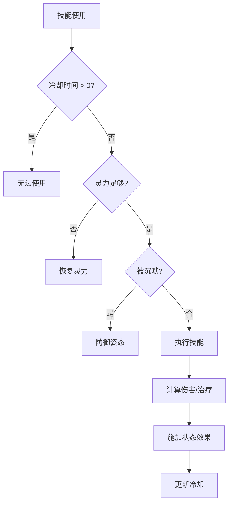
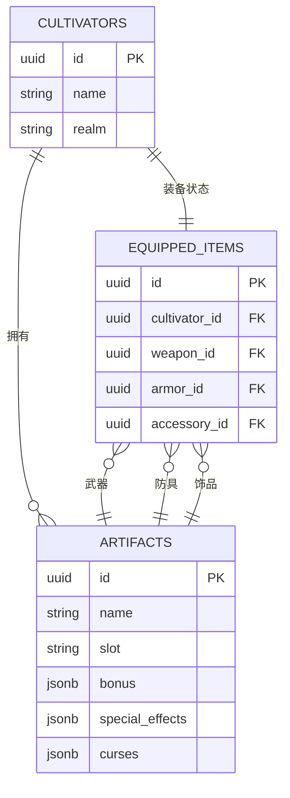

# 技能系统与法宝装备模型

<cite>
**本文档引用文件**  
- [schema.ts](file://lib/drizzle/schema.ts)
- [SkillCreationStrategy.ts](file://engine/creation/strategies/SkillCreationStrategy.ts)
- [cultivator.ts](file://types/cultivator.ts)
- [constants.ts](file://types/constants.ts)
- [equip/route.ts](file://app/api/cultivators/[id]/equip/route.ts)
- [battleEngine.ts](file://engine/battleEngine.ts)
- [cultivatorUtils.ts](file://utils/cultivatorUtils.ts)
- [rankingUtils.ts](file://utils/rankingUtils.ts)
</cite>

## 目录
1. [技能系统数据模型](#技能系统数据模型)
2. [法宝装备数据模型](#法宝装备数据模型)
3. [战斗中的技能与法宝应用](#战斗中的技能与法宝应用)
4. [装备槽位与状态管理](#装备槽位与状态管理)

## 技能系统数据模型

技能系统通过 `skills` 表存储，每个技能与角色（cultivator）形成一对多关系。技能的核心字段包括 `type`、`element`、`power`、`cooldown` 等，这些字段共同定义了技能的类型、属性、强度和使用限制。

- **type**：技能类型，取值为 `attack`（攻击）、`heal`（治疗）、`control`（控制）、`debuff`（减益）、`buff`（增益）。该字段决定了技能的基本行为模式。
- **element**：元素属性，取值包括 `金`、`木`、`水`、`火`、`土`、`风`、`雷`、`冰`。元素属性影响技能与角色灵根、法宝的契合度。
- **power**：威力值，范围为 30-150，直接影响技能造成的伤害或治疗量。威力受角色悟性、境界、灵根匹配度等因素影响。
- **cooldown**：冷却回合数，表示技能使用后需要等待的回合数。冷却时间越长，技能通常越强大。
- **effect**：特殊效果，如 `burn`（燃烧）、`bleed`（流血）、`poison`（中毒）、`stun`（眩晕）等，可对目标施加持续性状态。
- **duration**：效果持续回合数，与 `effect` 配合使用，定义状态效果的持续时间。

技能的创建受到严格的平衡性设计原则约束，包括五行契合度、器术合一、悟性与境界限制、气运影响等。例如，若角色灵根与技能元素匹配，则威力上浮，消耗降低；反之则威力大幅下降，消耗剧增。

**Section sources**
- [schema.ts](file://lib/drizzle/schema.ts#L98-L118)
- [SkillCreationStrategy.ts](file://engine/creation/strategies/SkillCreationStrategy.ts#L20-L255)
- [constants.ts](file://types/constants.ts#L17-L40)

## 法宝装备数据模型

法宝系统通过 `artifacts` 表存储，每个法宝与角色形成一对多关系。法宝的核心属性包括 `bonus` 加成、`special_effects` 特殊效果和 `curses` 诅咒效果。

- **bonus**：属性加成，以 JSONB 格式存储，包含 `vitality`（体魄）、`spirit`（灵力）、`wisdom`（悟性）、`speed`（速度）、`willpower`（神识）等基础属性的数值加成。
- **special_effects**：特殊效果数组，存储法宝的主动或被动能力。每个效果为联合类型 `ArtifactEffect`，包括 `damage_bonus`（伤害加成）、`on_hit_add_effect`（攻击命中后添加状态效果）、`on_use_cost_hp`（使用法术消耗气血）等。
- **curses**：诅咒效果数组，结构与 `special_effects` 相同，但代表负面效果。

`ArtifactEffect` 联合类型在运行时通过 `type` 字段进行判别。例如，`on_hit_add_effect` 类型的效果会在攻击命中时触发，根据 `chance` 字段的概率施加指定的 `effect` 状态。

**Section sources**
- [schema.ts](file://lib/drizzle/schema.ts#L136-L156)
- [cultivator.ts](file://types/cultivator.ts#L113-L157)
- [constants.ts](file://types/constants.ts#L138-L152)

## 战斗中的技能与法宝应用

在战斗中，技能和法宝的效果通过 `battleEngine.ts` 进行解析和执行。技能的使用受到冷却时间、灵力消耗、状态限制（如 `silence` 沉默状态无法使用技能）等因素的影响。

法宝的特殊效果在战斗中动态触发。例如，`on_hit_add_effect` 效果会在角色攻击命中时，根据设定的概率对目标施加状态效果。`on_use_cost_hp` 效果则在使用法宝技能时消耗使用者的气血。

技能的威力计算综合考虑了角色的灵力、法宝的伤害加成、元素克制等因素。状态效果的命中率由技能威力和目标的神识决定，公式为 `calculateStatusHitChance(skill.power, defFinal.willpower)`。

**Diagram sources**
- [battleEngine.ts](file://engine/battleEngine.ts#L286-L296)
- [battleEngine.ts](file://engine/battleEngine.ts#L518-L624)

**Section sources**
- [battleEngine.ts](file://engine/battleEngine.ts#L216-L803)

## 装备槽位与状态管理

装备系统通过 `equippedItems` 表管理角色的装备状态。该表与 `cultivators` 表一对一关联，通过外键约束确保每个角色只能有一套装备。

- **weapon_id**：武器槽位，外键指向 `artifacts.id`，onDelete 为 `set null`，表示卸下武器时设为 null。
- **armor_id**：防具槽位，同上。
- **accessory_id**：饰品槽位，同上。

装备槽位的设计确保了角色在战斗中只能使用已装备的法宝。装备的属性加成在计算角色最终属性时被计入，通过 `calculateFinalAttributes` 函数汇总基础属性、命格、功法和装备的加成。

装备的管理通过 `/api/cultivators/[id]/equip` 接口实现，支持装备和卸下操作。接口首先验证用户身份和角色归属，然后更新 `equippedItems` 表中的对应字段。

**Diagram sources**
- [schema.ts](file://lib/drizzle/schema.ts#L208-L228)
- [equip/route.ts](file://app/api/cultivators/[id]/equip/route.ts#L1-L153)

**Section sources**
- [schema.ts](file://lib/drizzle/schema.ts#L208-L228)
- [equip/route.ts](file://app/api/cultivators/[id]/equip/route.ts#L1-L153)
- [cultivatorUtils.ts](file://utils/cultivatorUtils.ts#L51-L198)