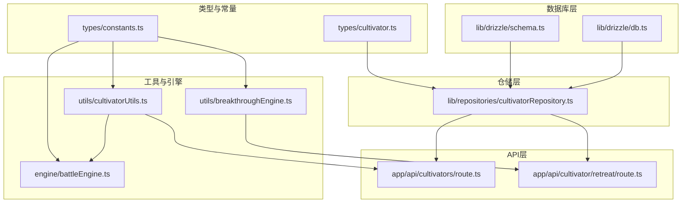
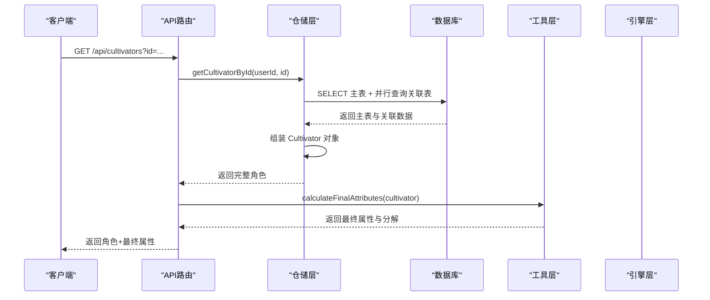
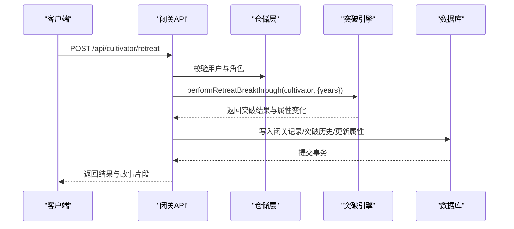
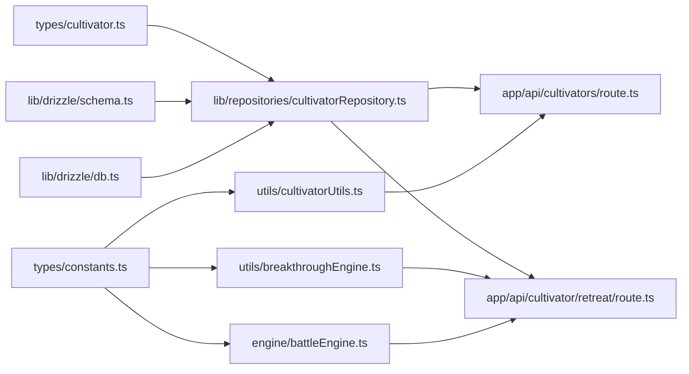

# 角色基础属性与灵根系统

<cite>
**本文引用的文件**
- [types/cultivator.ts](file://types/cultivator.ts)
- [types/constants.ts](file://types/constants.ts)
- [lib/drizzle/schema.ts](file://lib/drizzle/schema.ts)
- [lib/repositories/cultivatorRepository.ts](file://lib/repositories/cultivatorRepository.ts)
- [utils/cultivatorUtils.ts](file://utils/cultivatorUtils.ts)
- [engine/battleEngine.ts](file://engine/battleEngine.ts)
- [utils/breakthroughEngine.ts](file://utils/breakthroughEngine.ts)
- [app/api/cultivators/route.ts](file://app/api/cultivators/route.ts)
- [app/api/cultivator/retreat/route.ts](file://app/api/cultivator/retreat/route.ts)
- [lib/drizzle/db.ts](file://lib/drizzle/db.ts)
</cite>

## 目录
1. [简介](#简介)
2. [项目结构](#项目结构)
3. [核心组件](#核心组件)
4. [架构总览](#架构总览)
5. [详细组件分析](#详细组件分析)
6. [依赖关系分析](#依赖关系分析)
7. [性能考量](#性能考量)
8. [故障排查指南](#故障排查指南)
9. [结论](#结论)
10. [附录](#附录)

## 简介
本文件围绕“修仙”角色模型中的基础属性（Attributes）与灵根（SpiritualRoot）进行深入解析，阐述以下要点：
- vitalit、spirit、wisdom、speed、willpower五项核心属性在战斗、突破、顿悟等系统中的作用与影响。
- 灵根系统中元素类型（ElementType）与强度（strength）的组合如何影响角色成长路径。
- 基于数据库表 spiritual_roots 的1对多关系实现方式。
- 使用 Drizzle ORM 查询示例，展示如何根据灵根属性筛选角色或计算属性加成。

## 项目结构
该系统采用分层架构：
- 类型与常量层：定义 Attributes、SpiritualRoot、ElementType、RealmStage 等核心类型与常量。
- 数据库层：基于 Drizzle ORM 的 schema 定义，包括 cultivators、spiritual_roots、pre_heaven_fates、cultivation_techniques、skills 等表。
- 仓储层：封装数据库读写与组装逻辑，负责将主表与多对一/一对多关系的数据合并为完整 Cultivator 对象。
- 工具与引擎层：计算最终属性、突破概率与结果、战斗伤害与状态判定等。
- API 层：对外暴露角色查询与闭关突破等接口。

图表来源
- [types/cultivator.ts](file://types/cultivator.ts#L20-L35)
- [types/constants.ts](file://types/constants.ts#L1-L120)
- [lib/drizzle/schema.ts](file://lib/drizzle/schema.ts#L17-L66)
- [lib/repositories/cultivatorRepository.ts](file://lib/repositories/cultivatorRepository.ts#L22-L177)
- [utils/cultivatorUtils.ts](file://utils/cultivatorUtils.ts#L34-L194)
- [utils/breakthroughEngine.ts](file://utils/breakthroughEngine.ts#L82-L233)
- [engine/battleEngine.ts](file://engine/battleEngine.ts#L124-L205)
- [app/api/cultivators/route.ts](file://app/api/cultivators/route.ts#L1-L90)
- [app/api/cultivator/retreat/route.ts](file://app/api/cultivator/retreat/route.ts#L51-L84)

章节来源
- [lib/drizzle/schema.ts](file://lib/drizzle/schema.ts#L17-L66)
- [lib/repositories/cultivatorRepository.ts](file://lib/repositories/cultivatorRepository.ts#L22-L177)
- [utils/cultivatorUtils.ts](file://utils/cultivatorUtils.ts#L34-L194)
- [utils/breakthroughEngine.ts](file://utils/breakthroughEngine.ts#L82-L233)
- [engine/battleEngine.ts](file://engine/battleEngine.ts#L124-L205)
- [app/api/cultivators/route.ts](file://app/api/cultivators/route.ts#L1-L90)
- [app/api/cultivator/retreat/route.ts](file://app/api/cultivator/retreat/route.ts#L51-L84)

## 核心组件
- Attributes（基础属性）
  - vitalit：体魄，影响气血上限与伤害减免。
  - spirit：灵力，影响法术伤害与蓝量上限。
  - wisdom：悟性，影响突破成功率、顿悟与部分技能效果。
  - speed：速度，影响出手顺序与闪避率。
  - willpower：神识，影响抗状态能力与暴击伤害。
- SpiritualRoot（灵根）
  - element：元素类型（金、木、水、火、土、风、雷、冰）。
  - strength：强度（0-100），用于计算元素伤害加成与平衡。
  - grade：灵根品阶（天灵根、真灵根、伪灵根、变异灵根）。

章节来源
- [types/cultivator.ts](file://types/cultivator.ts#L20-L35)
- [types/constants.ts](file://types/constants.ts#L1-L120)

## 架构总览
角色数据从数据库 schema 读取，仓储层并行拉取关联数据，组装为完整 Cultivator 对象；API 层在返回时计算最终属性；工具与引擎层分别负责属性合成、突破概率与战斗伤害计算。

图表来源
- [app/api/cultivators/route.ts](file://app/api/cultivators/route.ts#L1-L90)
- [lib/repositories/cultivatorRepository.ts](file://lib/repositories/cultivatorRepository.ts#L22-L177)
- [utils/cultivatorUtils.ts](file://utils/cultivatorUtils.ts#L34-L194)

## 详细组件分析

### 基础属性与系统影响
- 战斗系统
  - 法术伤害：受 spirit 影响，且受灵根元素加成与法宝伤害加成共同影响。
  - 防御：vitality 影响减伤系数与防御状态加成。
  - 暴击：wisdom 影响暴击率，isCrit 决定伤害倍率。
  - 状态命中：wisdom 与 willpower 共同影响状态命中与抗性。
- 突破系统
  - 成功率：wisdom 提供理解修正，years 与失败连败提供修正。
  - 属性增长：wisdom 影响增长幅度，大境界突破可能提升悟性。
- 顿悟/推演
  - 悟性（wisdom）决定神通品阶上限与推演效率。
  - 灵根元素决定元素亲和与施法形态匹配度。

章节来源
- [engine/battleEngine.ts](file://engine/battleEngine.ts#L124-L205)
- [utils/breakthroughEngine.ts](file://utils/breakthroughEngine.ts#L82-L233)
- [app/enlightenment/skill/page.tsx](file://app/enlightenment/skill/page.tsx#L160-L202)

### 灵根系统与成长路径
- 灵根品阶与强度
  - 单灵根：天灵根（强度70-90或70-95，变异灵根）。
  - 双灵根：真灵根（强度50-80）。
  - 三/四灵根：伪灵根（强度30-60）。
  - 强度越高，元素伤害加成越强，平衡时也更易被天道压制。
- 元素类型与强度的组合
  - 元素类型决定法术伤害加成与状态效果匹配度。
  - 强度参与最终属性计算与平衡阈值，影响突破与战斗表现。

章节来源
- [utils/characterEngine.ts](file://utils/characterEngine.ts#L327-L362)
- [utils/characterEngine.ts](file://utils/characterEngine.ts#L272-L313)

### 数据库结构与1对多关系
- 角色主表 cultivators
  - 存储基础属性（vitality、spirit、wisdom、speed、willpower）。
- 灵根表 spiritual_roots
  - 通过 cultivatorId 外键关联主表，onDelete: 'cascade'。
  - 字段：element（元素）、strength（强度）、grade（品阶）。
- 先天气运、功法、技能等均为 1 对多 关系，均以 cultivatorId 外键关联主表。

章节来源
- [lib/drizzle/schema.ts](file://lib/drizzle/schema.ts#L17-L66)
- [lib/drizzle/schema.ts](file://lib/drizzle/schema.ts#L68-L118)

### Drizzle ORM 查询示例（路径指引）
以下为常见查询场景的代码路径指引，便于在仓储层或服务层复用：
- 根据元素类型筛选拥有特定灵根的角色
  - 参考路径：[lib/repositories/cultivatorRepository.ts](file://lib/repositories/cultivatorRepository.ts#L43-L63)
  - 说明：在组装 Cultivator 时并行查询 spiritual_roots，并按 element 过滤。
- 计算属性加成（最终属性）
  - 参考路径：[utils/cultivatorUtils.ts](file://utils/cultivatorUtils.ts#L34-L194)
  - 说明：汇总基础属性、先天气运、功法与装备加成，并考虑境界阶段上限。
- 战斗伤害与状态判定
  - 参考路径：[engine/battleEngine.ts](file://engine/battleEngine.ts#L124-L205)
  - 说明：法术伤害受 spirit、灵根元素加成与防御减伤影响；状态命中受 wisdom 与 willpower 影响。
- 突破概率与结果
  - 参考路径：[utils/breakthroughEngine.ts](file://utils/breakthroughEngine.ts#L82-L233)
  - 说明：wisdom、years、失败连败与难度共同决定成功率；大境界突破可能提升悟性并增加寿元。

章节来源
- [lib/repositories/cultivatorRepository.ts](file://lib/repositories/cultivatorRepository.ts#L43-L63)
- [utils/cultivatorUtils.ts](file://utils/cultivatorUtils.ts#L34-L194)
- [engine/battleEngine.ts](file://engine/battleEngine.ts#L124-L205)
- [utils/breakthroughEngine.ts](file://utils/breakthroughEngine.ts#L82-L233)

### API 流程与关键节点
- 获取角色（含最终属性）
  - API 路由：[app/api/cultivators/route.ts](file://app/api/cultivators/route.ts#L1-L90)
  - 逻辑：鉴权后查询角色，计算最终属性并返回。
- 闭关突破
  - API 路由：[app/api/cultivator/retreat/route.ts](file://app/api/cultivator/retreat/route.ts#L51-L84)
  - 逻辑：校验寿元与冷却，执行突破计算，记录闭关与突破历史。

图表来源
- [app/api/cultivator/retreat/route.ts](file://app/api/cultivator/retreat/route.ts#L51-L84)
- [utils/breakthroughEngine.ts](file://utils/breakthroughEngine.ts#L119-L233)
- [lib/repositories/cultivatorRepository.ts](file://lib/repositories/cultivatorRepository.ts#L580-L652)

## 依赖关系分析
- 类型与常量
  - types/cultivator.ts 定义 Attributes 与 SpiritualRoot。
  - types/constants.ts 定义 ElementType、RealmType、RealmStage、属性上限等。
- 数据库 schema
  - schema.ts 定义 cultivators 与 spiritual_roots 表及外键关系。
- 仓储层
  - cultivatorRepository.ts 并行查询关联表，组装完整对象。
- 工具与引擎
  - calculateFinalAttributes：综合基础属性、先天气运、功法、装备与上限。
  - battleEngine：法术伤害、防御、状态命中等战斗机制。
  - breakthroughEngine：突破概率、属性增长、大境界寿元奖励。
- API 层
  - api/cultivators/route.ts：返回最终属性。
  - api/cultivator/retreat/route.ts：执行闭关突破流程。

图表来源
- [types/cultivator.ts](file://types/cultivator.ts#L20-L35)
- [types/constants.ts](file://types/constants.ts#L1-L120)
- [lib/drizzle/schema.ts](file://lib/drizzle/schema.ts#L17-L66)
- [lib/repositories/cultivatorRepository.ts](file://lib/repositories/cultivatorRepository.ts#L22-L177)
- [utils/cultivatorUtils.ts](file://utils/cultivatorUtils.ts#L34-L194)
- [utils/breakthroughEngine.ts](file://utils/breakthroughEngine.ts#L82-L233)
- [engine/battleEngine.ts](file://engine/battleEngine.ts#L124-L205)
- [app/api/cultivators/route.ts](file://app/api/cultivators/route.ts#L1-L90)
- [app/api/cultivator/retreat/route.ts](file://app/api/cultivator/retreat/route.ts#L51-L84)

## 性能考量
- 并行查询：仓储层在组装角色时对关联表采用 Promise.all 并行拉取，减少往返延迟。
- 属性计算：calculateFinalAttributes 为纯函数式计算，复杂度 O(n)（n 为命格、功法、装备数量之和）。
- 战斗计算：battleEngine 的计算集中在单回合内，避免重复计算，状态命中与减伤采用阈值裁剪。
- 数据库约束：spiritual_roots 的外键 onDelete: 'cascade'，确保删除主表时级联清理，避免脏数据。

章节来源
- [lib/repositories/cultivatorRepository.ts](file://lib/repositories/cultivatorRepository.ts#L35-L63)
- [utils/cultivatorUtils.ts](file://utils/cultivatorUtils.ts#L34-L194)
- [engine/battleEngine.ts](file://engine/battleEngine.ts#L124-L205)
- [lib/drizzle/schema.ts](file://lib/drizzle/schema.ts#L56-L66)

## 故障排查指南
- 未授权访问
  - 现象：API 返回未授权。
  - 排查：确认 Supabase 用户鉴权是否成功。
  - 参考路径：[app/api/cultivators/route.ts](file://app/api/cultivators/route.ts#L17-L40)
- 角色不存在
  - 现象：查询单个角色返回 404。
  - 排查：确认 cultivatorId 与 userId 匹配，角色状态为 active。
  - 参考路径：[app/api/cultivators/route.ts](file://app/api/cultivators/route.ts#L34-L52)
- 闭关冷却
  - 现象：请求被拒绝，提示等待冷却时间。
  - 排查：检查最近一次闭关记录的时间戳与冷却时间。
  - 参考路径：[app/api/cultivator/retreat/route.ts](file://app/api/cultivator/retreat/route.ts#L59-L80)
- 属性总和超限
  - 现象：角色属性总和超过上限的80%，被系统压制。
  - 排查：降低属性点或提升境界上限。
  - 参考路径：[utils/characterEngine.ts](file://utils/characterEngine.ts#L272-L313)

章节来源
- [app/api/cultivators/route.ts](file://app/api/cultivators/route.ts#L17-L52)
- [app/api/cultivator/retreat/route.ts](file://app/api/cultivator/retreat/route.ts#L59-L80)
- [utils/characterEngine.ts](file://utils/characterEngine.ts#L272-L313)

## 结论
- Attributes 与 SpiritualRoot 是角色成长与战斗的核心参数：vitality、spirit、wisdom、speed、willpower 分别影响气血、法术、突破、速度与抗性；灵根的 element 与 strength 决定元素亲和与伤害加成。
- 数据库层面通过 1 对多关系清晰表达角色与其灵根、命格、功法、技能的关系，删除主表时级联清理，保障一致性。
- 工具与引擎层将抽象属性转化为可执行的游戏机制，API 层提供稳定的对外接口，支撑闭关突破与战斗体验。

## 附录
- 常用查询路径参考
  - 灵根按元素过滤：[lib/repositories/cultivatorRepository.ts](file://lib/repositories/cultivatorRepository.ts#L43-L63)
  - 最终属性计算：[utils/cultivatorUtils.ts](file://utils/cultivatorUtils.ts#L34-L194)
  - 战斗伤害与状态：[engine/battleEngine.ts](file://engine/battleEngine.ts#L124-L205)
  - 突破概率与结果：[utils/breakthroughEngine.ts](file://utils/breakthroughEngine.ts#L82-L233)
  - 闭关突破 API：[app/api/cultivator/retreat/route.ts](file://app/api/cultivator/retreat/route.ts#L51-L84)