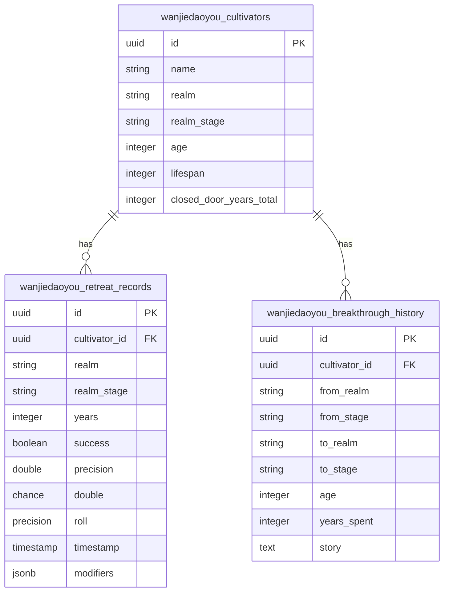
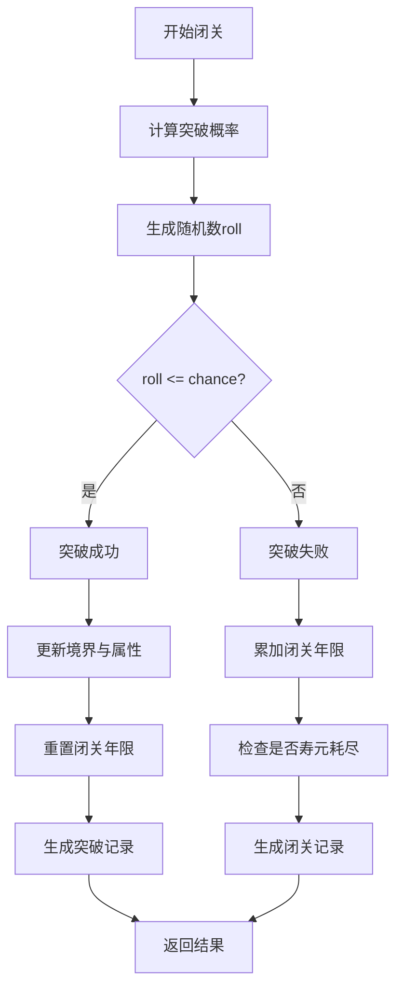
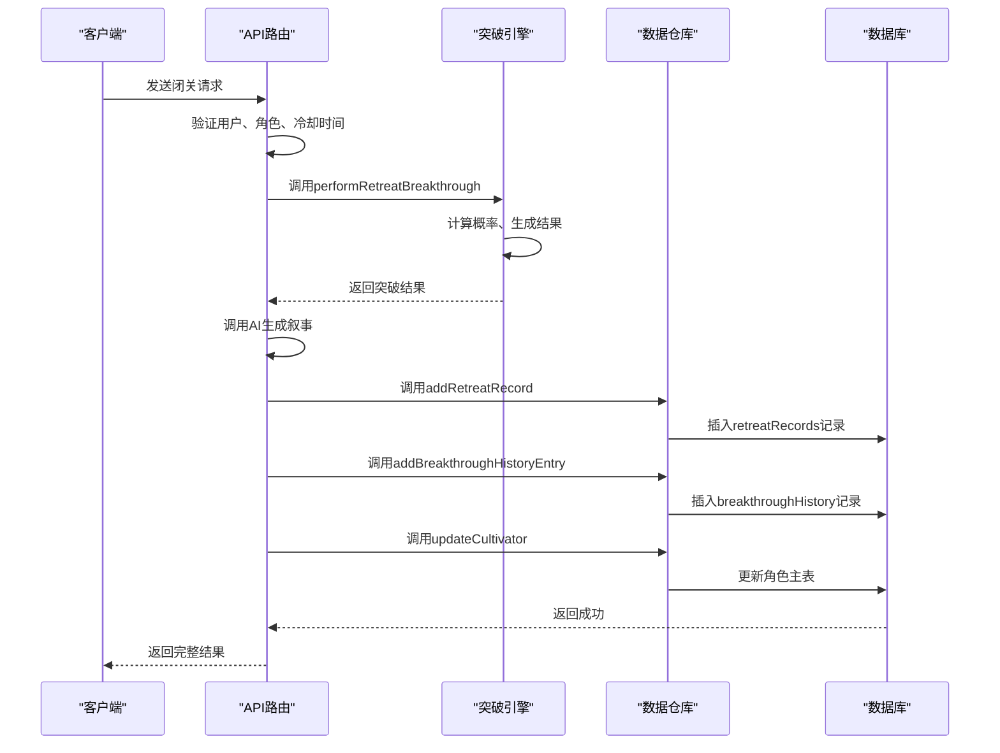

# 闭关突破与轮回记录

<cite>
**本文档引用文件**  
- [breakthroughEngine.ts](file://utils/breakthroughEngine.ts)
- [characterEngine.ts](file://utils/characterEngine.ts)
- [schema.ts](file://lib/drizzle/schema.ts)
- [route.ts](file://app/api/cultivator/retreat/route.ts)
- [cultivatorRepository.ts](file://lib/repositories/cultivatorRepository.ts)
- [storyService.ts](file://utils/storyService.ts)
- [cultivator.ts](file://types/cultivator.ts)
- [cultivatorUtils.ts](file://utils/cultivatorUtils.ts)
</cite>

## 目录
1. [引言](#引言)
2. [核心数据结构设计](#核心数据结构设计)
3. [闭关突破逻辑实现](#闭关突破逻辑实现)
4. [持久化机制与数据流](#持久化机制与数据流)
5. [突破叙事生成集成](#突破叙事生成集成)
6. [角色成长轨迹回溯](#角色成长轨迹回溯)
7. [结论](#结论)

## 引言

本系统围绕修仙角色的“闭关突破”与“境界跃迁”两大核心成长机制，构建了一套完整的持久化记录体系。通过`retreatRecords`表记录每次闭关的详细过程与随机结果，利用`breakthroughHistory`表追踪角色的境界跃迁历程，并结合AI生成叙事，实现了角色成长轨迹的可追溯性与故事性。该设计不仅支撑了游戏的核心玩法循环，也为后续的角色背景生成与数据分析提供了坚实基础。

## 核心数据结构设计

系统的核心数据结构围绕角色（Cultivator）展开，通过多个关联表实现属性、功法、技能等模块的灵活扩展。其中，与闭关突破直接相关的数据结构为`retreatRecords`和`breakthroughHistory`表。

**图示来源**  
- [schema.ts](file://lib/drizzle/schema.ts#L175-L206)

**Section sources**
- [schema.ts](file://lib/drizzle/schema.ts#L175-L206)
- [cultivator.ts](file://types/cultivator.ts#L42-L61)

### retreatRecords表设计

`retreatRecords`表用于记录每一次闭关尝试的详细过程，是突破逻辑的“过程日志”。

| 字段名 | 类型 | 说明 |
| :--- | :--- | :--- |
| `success` | boolean | 本次闭关是否成功突破。`true`表示成功，`false`表示失败。 |
| `chance` | double precision | 系统计算出的本次突破的理论成功率，是一个0.0到1.0之间的浮点数。 |
| `roll` | double precision | 系统生成的随机数，同样在0.0到1.0之间，用于与`chance`比较以决定成败。 |
| `modifiers` | jsonb | 一个JSON对象，存储了影响本次突破成功率的所有动态因子。 |

`modifiers`字段的结构定义了影响突破的核心因素：
- `base`: 基础成功率，根据当前境界和突破类型（小境界/大境界）计算。
- `comprehension`: 悟性修正，基于角色的“悟性”属性计算。
- `years`: 闭关年限修正，闭关时间越长，成功率越高。
- `failureStreak`: 失败连败修正，连续失败的闭关年数越多，下一次的成功率会获得加成。
- `summaryDifficulty`: 突破难度修正，随着境界的提升，整体突破难度会指数级下降。

此设计将复杂的突破概率计算过程透明化，所有影响因素都被记录，确保了结果的可追溯性和公平性。

### breakthroughHistory表设计

`breakthroughHistory`表是角色成长的“里程碑记录”，只在突破成功时写入。

| 字段名 | 类型 | 说明 |
| :--- | :--- | :--- |
| `from_realm` / `from_stage` | string | 突破前的境界和阶段。 |
| `to_realm` / `to_stage` | string | 突破后的境界和阶段。 |
| `age` | integer | 突破成功时角色的年龄。 |
| `years_spent` | integer | 本次闭关所花费的年数。 |
| `story` | text | 由AI生成的关于此次突破的叙事性描述。 |

该表清晰地记录了角色从低境界到高境界的完整跃迁路径，`from/to`字段直观地展示了境界转换，`years_spent`字段可用于统计角色在每个境界的平均耗时，为游戏平衡性分析提供数据支持。

## 闭关突破逻辑实现

闭关突破的核心逻辑由`breakthroughEngine.ts`中的`performRetreatBreakthrough`函数实现，其流程遵循“计算概率 -> 生成随机数 -> 判定结果 -> 更新状态”的模式。

**图示来源**  
- [breakthroughEngine.ts](file://utils/breakthroughEngine.ts#L119-L233)
- [route.ts](file://app/api/cultivator/retreat/route.ts#L82)

**Section sources**
- [breakthroughEngine.ts](file://utils/breakthroughEngine.ts#L82-L233)

### 突破概率计算

突破概率的计算是整个逻辑的核心，由`calculateBreakthroughChance`函数完成。该函数综合了多个动态因子：
1.  **基础成功率**：根据当前境界和突破类型（小境界提升或大境界跨越）确定一个基础值。
2.  **悟性修正**：角色的“悟性”属性越高，对成功率的加成越大。
3.  **年限修正**：闭关时间越长，积累的感悟越多，成功率线性提升。
4.  **失败连败修正**：系统会记录角色连续失败的闭关总年数（`closed_door_years_total`），这个数值越高，代表角色越“憋屈”，系统会给予更高的成功率加成，防止玩家因连续失败而放弃。
5.  **难度修正**：随着境界的提升，突破的难度会自然增加，通过一个指数衰减因子来体现。

最终的成功率`chance`是这些修正因子的综合结果。`roll`字段的值由`Math.random()`生成，其与`chance`的比较直接决定了突破的成败，实现了“天道难测”的随机性。

### 成功与失败的处理

-   **成功处理**：当`roll <= chance`时，角色境界提升。系统会根据新的境界阶段，计算属性增长范围，并随机增长各项属性。同时，`closed_door_years_total`（累计闭关年数）被重置为0，表示瓶颈已突破。
-   **失败处理**：当`roll > chance`时，突破失败。角色的`closed_door_years_total`会累加本次闭关的年数。如果角色的年龄加上本次闭关年数超过了其寿元上限，则角色会进入“寿元耗尽”状态，可能面临坐化。

## 持久化机制与数据流

整个闭关突破流程的数据持久化由API路由和数据仓库协同完成，形成了一个完整的闭环。

**图示来源**  
- [route.ts](file://app/api/cultivator/retreat/route.ts#L18-L163)
- [cultivatorRepository.ts](file://lib/repositories/cultivatorRepository.ts#L674-L709)

**Section sources**
- [route.ts](file://app/api/cultivator/retreat/route.ts#L18-L163)
- [cultivatorRepository.ts](file://lib/repositories/cultivatorRepository.ts#L674-L709)

1.  **API入口**：`/api/cultivator/retreat/route.ts`是闭关操作的入口。它首先进行用户身份验证、角色存在性检查、寿元检查和冷却时间验证。
2.  **逻辑执行**：验证通过后，调用`breakthroughEngine.ts`中的`performRetreatBreakthrough`函数执行核心逻辑，得到一个包含成功与否、属性变化等信息的`BreakthroughOutcome`对象。
3.  **叙事生成**：如果突破成功或角色寿元耗尽，API会调用`storyService.ts`中的`createBreakthroughStory`或`createLifespanExhaustedStory`函数，向AI请求生成一段叙事文本。
4.  **数据持久化**：API将结果中的`retreatRecord`和`breakthroughHistory`（如果存在）通过`cultivatorRepository.ts`中的`addRetreatRecord`和`addBreakthroughHistoryEntry`方法写入数据库。同时，调用`updateCultivator`更新角色主表中的境界、年龄、属性等信息。
5.  **响应返回**：所有操作成功后，将完整的角色数据和叙事返回给客户端。

## 突破叙事生成集成

系统通过AI将枯燥的数据变化转化为生动的故事，极大地增强了游戏的沉浸感。`storyService.ts`模块负责与AI模型交互，生成叙事。

-   **输入**：`createBreakthroughStory`函数接收一个包含角色当前状态和突破摘要（`summary`）的`payload`。
-   **处理**：该模块会根据`payload`构造系统提示词（system prompt）和用户提示词（user prompt），然后调用AI的文本生成接口。
-   **输出**：AI返回一段描述突破过程的文本，例如“道友于九幽寒潭闭关三百年，历经心魔劫，终在雷劫中悟透生死，一举突破至金丹期！”。
-   **集成**：生成的叙事文本`story`会被直接写入`breakthroughHistory`表的`story`字段中。

这种设计将数据记录与故事生成无缝衔接，使得每一次成功的突破都成为角色传奇的一部分。

## 角色成长轨迹回溯

`retreatRecords`和`breakthroughHistory`两张表共同构成了角色完整的成长档案。

-   **回溯突破历程**：通过查询`breakthroughHistory`表，可以按时间顺序列出角色的所有成功突破，清晰地看到其从“炼气期”到“渡劫期”的完整晋升路径。
-   **分析闭关策略**：`retreatRecords`表提供了丰富的分析维度。开发者或玩家可以分析：
    -   在某个境界，角色平均需要尝试多少次才能成功突破。
    -   闭关年限与成功率之间的关系，验证“闭关越久越容易成功”的设计是否合理。
    -   失败连败修正的实际效果，确保系统不会让玩家陷入永久的失败循环。
-   **生成背景故事**：AI生成的叙事文本`story`是角色背景故事的直接来源。通过拼接`breakthroughHistory`中的所有`story`，可以自动生成一份详尽的、基于角色真实经历的传记，这比静态的预设背景更具个性和说服力。

## 结论

本系统通过精心设计的`retreatRecords`和`breakthroughHistory`数据表，实现了对“闭关突破”这一核心玩法的全面持久化。`success`、`chance`、`roll`等字段透明地记录了每一次尝试的随机结果，而`modifiers`字段则揭示了影响结果的动态因子，确保了游戏机制的公平与可理解。`breakthroughHistory`表不仅记录了境界的转换和耗时，更通过集成AI叙事生成，将数据转化为生动的故事。这一设计完美地结合了游戏性、数据追踪和叙事生成，为角色的成长提供了坚实的技术支撑和丰富的表现力。