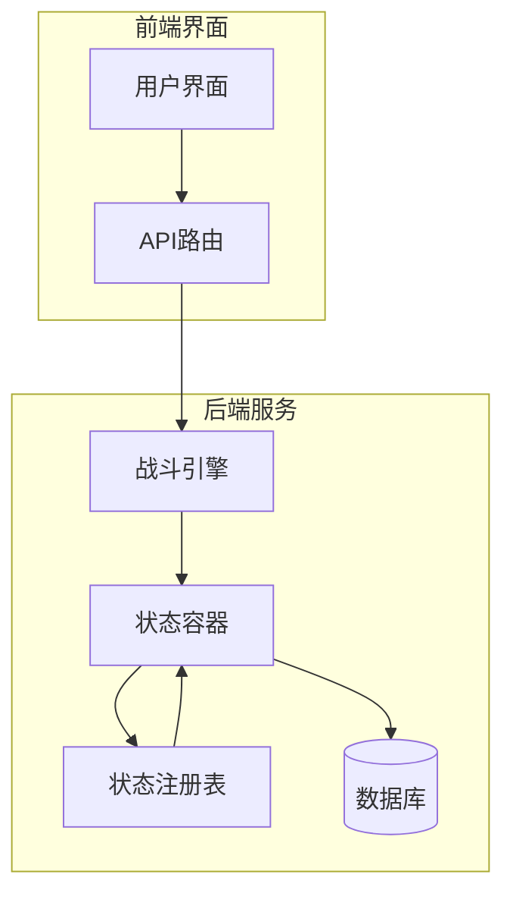
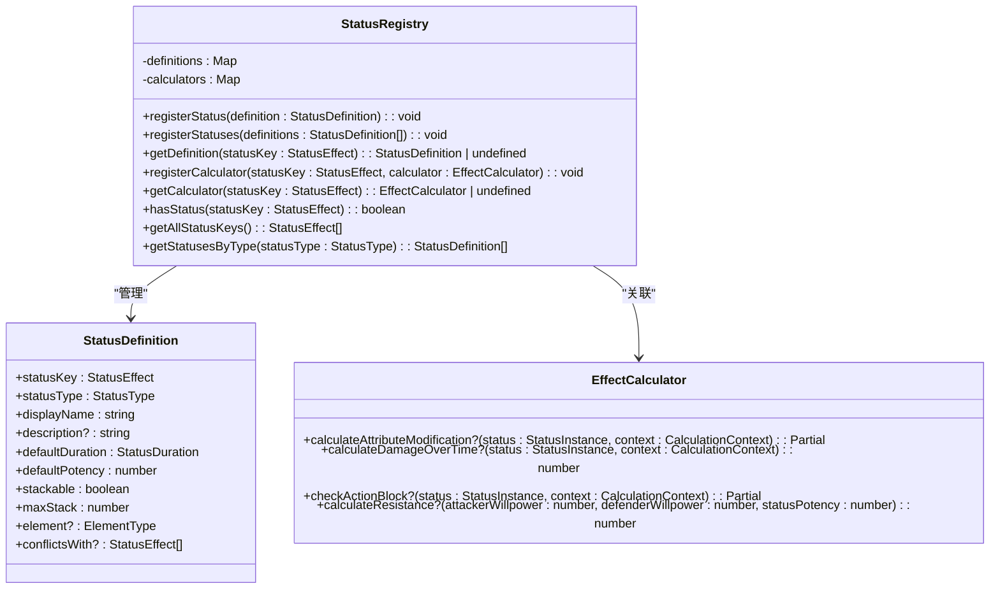
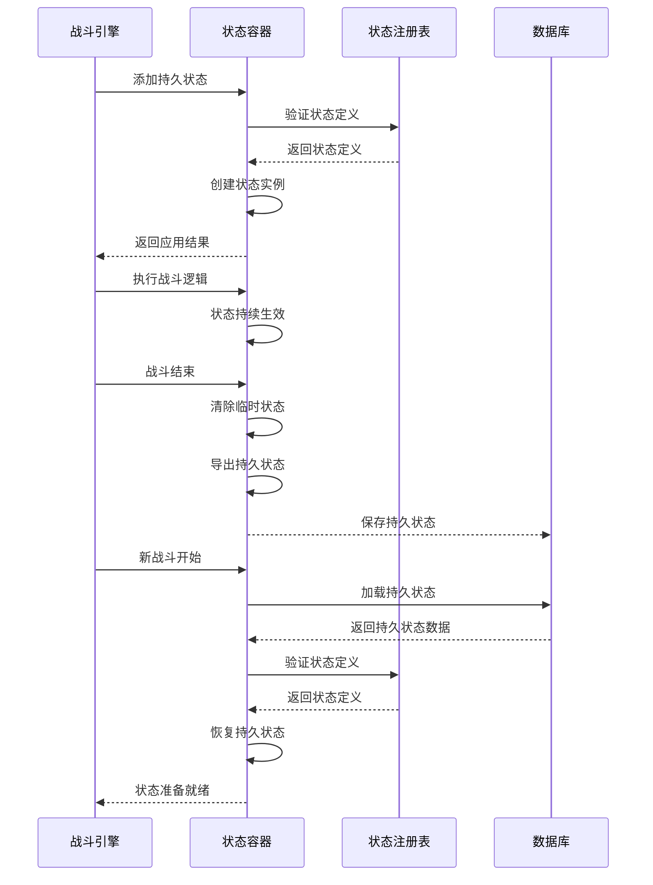
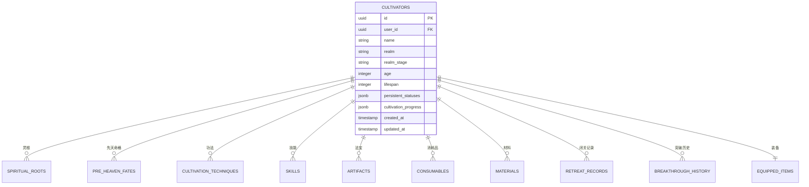
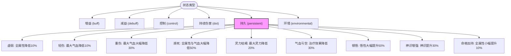
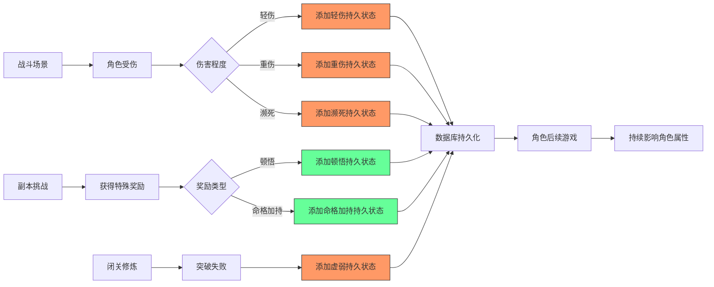
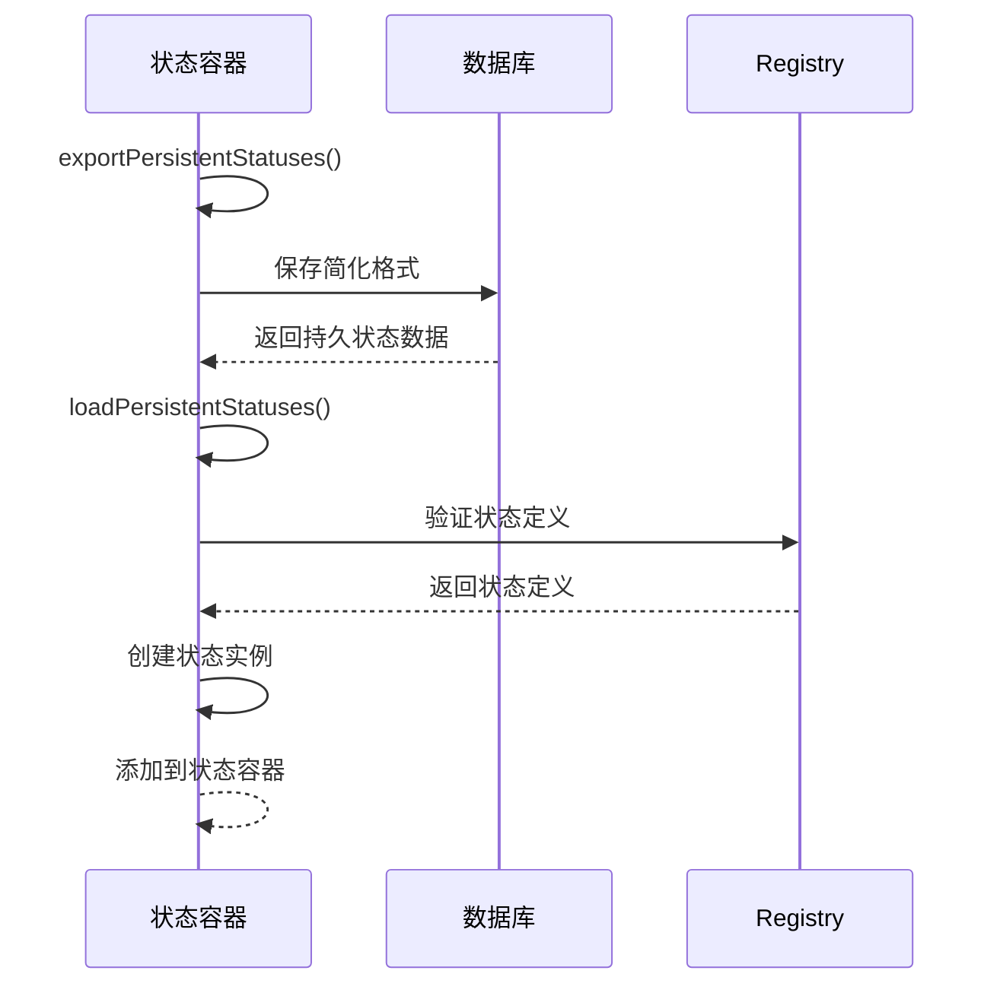

# 持久状态

<cite>
**本文档引用的文件**   
- [StatusContainer.ts](file://engine/status/StatusContainer.ts)
- [types.ts](file://engine/status/types.ts)
- [StatusRegistry.ts](file://engine/status/StatusRegistry.ts)
- [schema.ts](file://lib/drizzle/schema.ts)
- [cultivatorRepository.ts](file://lib/repositories/cultivatorRepository.ts)
- [BattleEngine.v2.ts](file://engine/battle/BattleEngine.v2.ts)
- [cultivator.ts](file://types/cultivator.ts)
</cite>

## 目录
1. [引言](#引言)
2. [持久状态系统架构](#持久状态系统架构)
3. [核心组件分析](#核心组件分析)
4. [持久状态的生命周期](#持久状态的生命周期)
5. [数据库持久化机制](#数据库持久化机制)
6. [状态类型与定义](#状态类型与定义)
7. [持久状态的应用场景](#持久状态的应用场景)
8. [序列化与反序列化](#序列化与反序列化)
9. [结论](#结论)

## 引言

在修仙类游戏中，角色的状态管理是核心机制之一。本项目实现了一套完整的状态管理系统，其中"持久状态"（Persistent Status）是一种特殊的状态类型，其效果不会在战斗或副本结束后消失，而是会持续影响角色的长期属性和能力。这种机制模拟了修仙世界中因战斗创伤、顿悟、命格加持等事件对修士产生的长期影响。

持久状态系统通过状态容器（StatusContainer）、状态注册表（StatusRegistry）和数据库持久化机制的协同工作，实现了状态的创建、管理、存储和恢复。该系统不仅支持临时战斗状态（如增益、减益、控制等），还特别设计了持久状态类型，用于记录对角色产生长期影响的特殊状态。

**Section sources**
- [StatusContainer.ts](file://engine/status/StatusContainer.ts#L1-L450)
- [types.ts](file://engine/status/types.ts#L1-L275)

## 持久状态系统架构



**Diagram sources**
- [StatusContainer.ts](file://engine/status/StatusContainer.ts#L25-L450)
- [StatusRegistry.ts](file://engine/status/StatusRegistry.ts#L8-L412)
- [BattleEngine.v2.ts](file://engine/battle/BattleEngine.v2.ts#L30-L487)

## 核心组件分析

### 状态容器（StatusContainer）

状态容器是整个状态管理系统的核心，负责管理单个角色的所有状态实例。它提供了添加、移除、查询和刷新状态的完整功能。

```mermaid
classDiagram
class StatusContainer {
-statusesById : Map<string, StatusInstance>
-statusesByKey : Map<StatusEffect, StatusInstance[]>
+addStatus(request : StatusApplicationRequest, target : UnitSnapshot) : ApplyResult
+removeStatus(statusId : string) : boolean
+removeStatusByKey(statusKey : StatusEffect) : number
+hasStatus(statusKey : StatusEffect) : boolean
+getStatus(statusKey : StatusEffect) : StatusInstance | undefined
+getActiveStatuses() : StatusInstance[]
+tickStatuses(context : TickContext) : TickResult
+clearStatusesByType(statusTypes : StatusType | StatusType[]) : number
+clearAllStatuses() : void
+calculateAttributeModifications(context : CalculationContext) : AttributeModification
+exportPersistentStatuses() : Array<{statusKey : string, potency : number, createdAt : number, metadata : Record<string, unknown>}>
+loadPersistentStatuses(persistentStatuses : Array<{...}>, target : UnitSnapshot) : void
+clearTemporaryStatuses() : void
}
class StatusInstance {
+statusId : string
+statusType : StatusType
+statusKey : StatusEffect
+displayName : string
+description? : string
+source : StatusSource
+duration : StatusDuration
+potency : number
+stackable : boolean
+maxStack : number
+currentStack : number
+element? : ElementType
+metadata : Record<string, unknown>
+createdAt : number
}
class StatusApplicationRequest {
+statusKey : StatusEffect
+source : StatusSource
+durationOverride? : Partial<StatusDuration>
+potency? : number
+stackToAdd? : number
+element? : ElementType
+metadata? : Record<string, unknown>
}
class ApplyResult {
+success : boolean
+statusId? : string
+resistedByWillpower? : boolean
+message : string
}
StatusContainer --> StatusInstance : "包含"
StatusContainer --> StatusApplicationRequest : "使用"
StatusContainer --> ApplyResult : "返回"
```

**Diagram sources**
- [StatusContainer.ts](file://engine/status/StatusContainer.ts#L25-L450)
- [types.ts](file://engine/status/types.ts#L98-L144)

### 状态注册表（StatusRegistry）

状态注册表是状态系统的配置中心，负责维护所有状态的元信息定义。它采用单例模式，确保整个应用中状态定义的一致性。



**Diagram sources**
- [StatusRegistry.ts](file://engine/status/StatusRegistry.ts#L8-L412)
- [types.ts](file://engine/status/types.ts#L118-L129)

## 持久状态的生命周期

持久状态的生命周期包括创建、应用、存储和恢复四个主要阶段。与其他临时状态不同，持久状态在战斗结束后不会被清除，而是会被保存到数据库中，以便在角色后续的游戏中持续生效。



**Diagram sources**
- [StatusContainer.ts](file://engine/status/StatusContainer.ts#L376-L448)
- [BattleEngine.v2.ts](file://engine/battle/BattleEngine.v2.ts#L34-L487)

## 数据库持久化机制

持久状态的数据库持久化机制通过在角色主表中添加`persistent_statuses`字段实现。该字段使用JSONB类型存储，能够灵活地保存各种持久状态的数据。



**Diagram sources**
- [schema.ts](file://lib/drizzle/schema.ts#L17-L60)
- [cultivator.ts](file://types/cultivator.ts#L280-L282)

## 状态类型与定义

系统定义了多种状态类型，其中`persistent`类型专门用于持久状态。每种状态都有详细的定义，包括显示名称、描述、默认持续时间、默认强度等。



**Diagram sources**
- [StatusRegistry.ts](file://engine/status/StatusRegistry.ts#L216-L308)
- [types.ts](file://engine/status/types.ts#L9-L16)

## 持久状态的应用场景

持久状态系统在多个游戏场景中发挥作用，包括战斗、副本、闭关修炼等。这些场景中产生的特殊状态会被标记为持久状态，并在角色后续的游戏中持续生效。



**Diagram sources**
- [StatusContainer.ts](file://engine/status/StatusContainer.ts#L376-L448)
- [cultivatorRepository.ts](file://lib/repositories/cultivatorRepository.ts#L1-L1377)

## 序列化与反序列化

持久状态的序列化与反序列化是实现状态持久化的关键环节。系统提供了专门的方法将持久状态从状态容器导出为数据库存储格式，以及从数据库数据恢复为状态实例。



**Diagram sources**
- [StatusContainer.ts](file://engine/status/StatusContainer.ts#L376-L414)
- [StatusRegistry.ts](file://engine/status/StatusRegistry.ts#L29-L48)

## 结论

持久状态系统是本项目状态管理机制的重要组成部分，它通过精心设计的架构实现了对角色长期状态的管理。系统采用模块化设计，将状态容器、状态注册表和数据库持久化机制分离，提高了代码的可维护性和可扩展性。

持久状态的实现不仅增强了游戏的沉浸感和策略性，还为未来的功能扩展提供了坚实的基础。通过JSONB字段存储持久状态，系统能够灵活地支持各种类型的状态数据，而无需频繁修改数据库结构。

该系统的成功实现为修仙类游戏的状态管理提供了一个优秀的范例，展示了如何通过合理的架构设计来解决复杂的游戏机制问题。