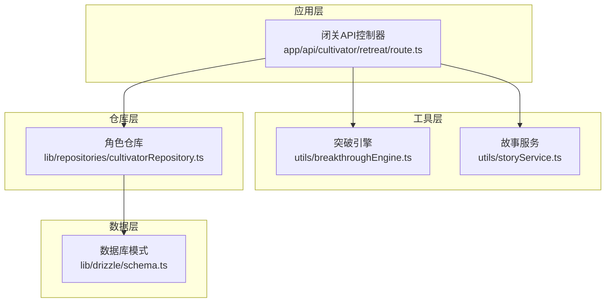
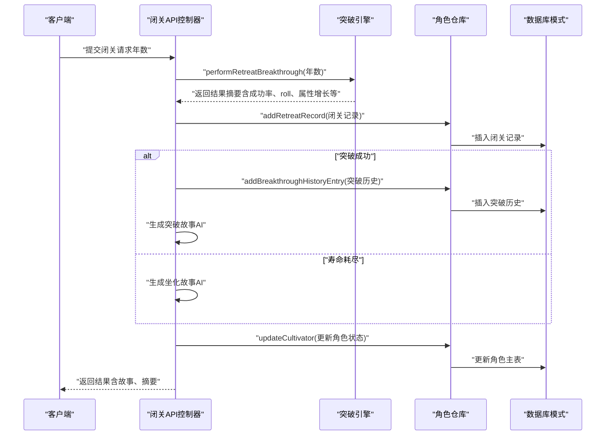
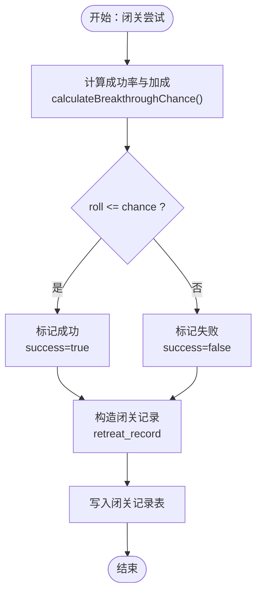
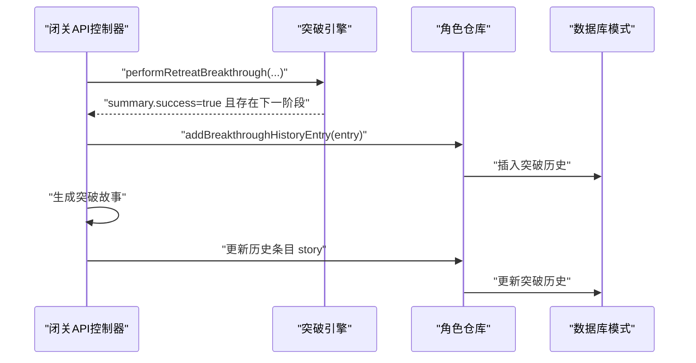
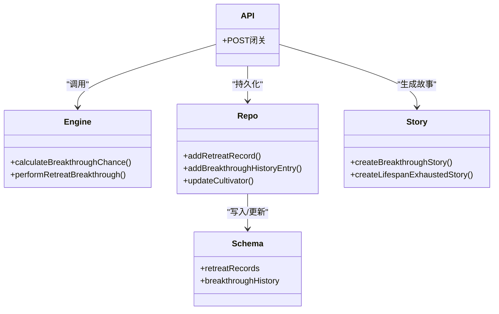

# 修行进程表

<cite>
**本文引用的文件**
- [lib/drizzle/schema.ts](file://lib/drizzle/schema.ts)
- [app/api/cultivator/retreat/route.ts](file://app/api/cultivator/retreat/route.ts)
- [utils/breakthroughEngine.ts](file://utils/breakthroughEngine.ts)
- [lib/repositories/cultivatorRepository.ts](file://lib/repositories/cultivatorRepository.ts)
- [utils/storyService.ts](file://utils/storyService.ts)
- [types/cultivator.ts](file://types/cultivator.ts)
- [types/constants.ts](file://types/constants.ts)
</cite>

## 目录
1. [简介](#简介)
2. [项目结构](#项目结构)
3. [核心组件](#核心组件)
4. [架构总览](#架构总览)
5. [详细组件分析](#详细组件分析)
6. [依赖关系分析](#依赖关系分析)
7. [性能考量](#性能考量)
8. [故障排查指南](#故障排查指南)
9. [结论](#结论)

## 简介
本文件聚焦“修行进程”相关的核心数据表：闭关记录表（retreatRecords）与突破历史表（breakthroughHistory）。前者用于记录每次闭关尝试的详细过程与结果，后者用于追踪角色从一个境界到另一个境界的完整历程。文档将深入解析以下要点：
- retreatRecords 表中 years、success、chance 等字段如何刻画闭关关键数据；
- modifiers 字段以 JSONB 形式保存影响突破的各类加成因素；
- breakthroughHistory 表如何记录角色从一个境界突破到另一个境界的完整历程，包括 from_realm/to_realm 的状态迁移与 story 字段的叙事生成机制；
- 这些表在角色成长可视化、突破成功率分析与历史回溯功能中的数据支撑作用。

## 项目结构
围绕“修行进程”的数据层主要由以下部分构成：
- 数据库模式定义：位于数据层，定义了角色主表、闭关记录表、突破历史表及其字段约束与外键关系；
- 业务逻辑引擎：位于工具层，负责计算突破概率、判定成功与否、生成属性增长与寿命增益，并构造闭关记录与突破历史条目；
- API 控制器：位于应用层，接收请求、校验参数、调用引擎与存储层、返回结果并生成故事；
- 存储仓库：位于仓库层，封装数据库插入与查询操作；
- 类型与常量：提供领域模型与枚举值，确保字段取值一致。

图表来源
- [app/api/cultivator/retreat/route.ts](file://app/api/cultivator/retreat/route.ts#L1-L179)
- [utils/breakthroughEngine.ts](file://utils/breakthroughEngine.ts#L1-L342)
- [lib/repositories/cultivatorRepository.ts](file://lib/repositories/cultivatorRepository.ts#L674-L746)
- [lib/drizzle/schema.ts](file://lib/drizzle/schema.ts#L175-L206)

章节来源
- [lib/drizzle/schema.ts](file://lib/drizzle/schema.ts#L175-L206)
- [app/api/cultivator/retreat/route.ts](file://app/api/cultivator/retreat/route.ts#L1-L179)
- [utils/breakthroughEngine.ts](file://utils/breakthroughEngine.ts#L1-L342)
- [lib/repositories/cultivatorRepository.ts](file://lib/repositories/cultivatorRepository.ts#L674-L746)

## 核心组件
- 闭关记录表（wanjiedaoyou_retreat_records）
  - 记录每次闭关尝试的上下文与结果，便于统计与回溯。
  - 关键字段：years（闭关年数）、success（是否成功）、chance（计算出的成功率）、roll（随机抽样）、timestamp（记录时间）、modifiers（JSONB 加成集合）。
- 突破历史表（wanjiedaoyou_breakthrough_history）
  - 记录角色从一个境界到另一个境界的完整历程，支持状态迁移与叙事生成。
  - 关键字段：from_realm/from_stage（起始境界与阶段）、to_realm/to_stage（目标境界与阶段）、age（突破时年龄）、years_spent（闭关耗时）、story（AI生成的叙事文本）。

章节来源
- [lib/drizzle/schema.ts](file://lib/drizzle/schema.ts#L175-L206)
- [types/cultivator.ts](file://types/cultivator.ts#L42-L61)

## 架构总览
闭关流程从 API 控制器发起，经由突破引擎计算概率与判定结果，再写入闭关记录与突破历史，并通过故事服务生成叙事文本。最终更新角色主表状态并返回结果。

图表来源
- [app/api/cultivator/retreat/route.ts](file://app/api/cultivator/retreat/route.ts#L1-L179)
- [utils/breakthroughEngine.ts](file://utils/breakthroughEngine.ts#L119-L233)
- [lib/repositories/cultivatorRepository.ts](file://lib/repositories/cultivatorRepository.ts#L674-L746)
- [lib/drizzle/schema.ts](file://lib/drizzle/schema.ts#L175-L206)

## 详细组件分析

### 闭关记录表（retreatRecords）
- 字段语义与用途
  - years：本次闭关的年数，决定“闭关年限修正”项的贡献。
  - success：布尔值，表示本次闭关是否成功。
  - chance：引擎计算出的成功率（浮点数），用于分析与可视化。
  - roll：实际随机抽样值，用于判定成功与否。
  - timestamp：记录时间戳，便于按时间序列分析。
  - modifiers：JSONB，保存影响突破的各类加成因素，如“悟性修正”、“闭关年限修正”、“失败连败修正”、“突破难度修正”等。
- 数据流向
  - 引擎计算 chance 与 modifiers，并生成 retreat_record；
  - API 将最新闭关记录写入数据库；
  - 可用于统计“不同年数下的成功率分布”、“不同悟性/失败连败对成功率的影响”等。

图表来源
- [utils/breakthroughEngine.ts](file://utils/breakthroughEngine.ts#L82-L117)
- [utils/breakthroughEngine.ts](file://utils/breakthroughEngine.ts#L119-L233)
- [lib/repositories/cultivatorRepository.ts](file://lib/repositories/cultivatorRepository.ts#L674-L691)
- [lib/drizzle/schema.ts](file://lib/drizzle/schema.ts#L175-L188)

章节来源
- [lib/drizzle/schema.ts](file://lib/drizzle/schema.ts#L175-L188)
- [utils/breakthroughEngine.ts](file://utils/breakthroughEngine.ts#L82-L117)
- [lib/repositories/cultivatorRepository.ts](file://lib/repositories/cultivatorRepository.ts#L674-L691)
- [types/cultivator.ts](file://types/cultivator.ts#L36-L51)

### 突破历史表（breakthroughHistory）
- 字段语义与用途
  - from_realm/from_stage：起始境界与阶段，用于状态迁移追踪。
  - to_realm/to_stage：目标境界与阶段，用于状态迁移追踪。
  - age：突破时角色年龄，便于历史回溯与可视化。
  - years_spent：本次闭关所耗年数，用于统计“各阶段耗时”。
  - story：AI 生成的叙事文本，用于丰富角色成长故事。
- 数据流向
  - 成功突破时，引擎构造历史条目并写入数据库；
  - API 在生成故事后，将 story 回填至历史条目；
  - 可用于“境界迁移图谱”、“各阶段平均耗时”、“突破故事检索”等。

图表来源
- [utils/breakthroughEngine.ts](file://utils/breakthroughEngine.ts#L160-L197)
- [app/api/cultivator/retreat/route.ts](file://app/api/cultivator/retreat/route.ts#L86-L124)
- [lib/repositories/cultivatorRepository.ts](file://lib/repositories/cultivatorRepository.ts#L693-L709)
- [lib/drizzle/schema.ts](file://lib/drizzle/schema.ts#L190-L206)

章节来源
- [lib/drizzle/schema.ts](file://lib/drizzle/schema.ts#L190-L206)
- [utils/breakthroughEngine.ts](file://utils/breakthroughEngine.ts#L160-L197)
- [app/api/cultivator/retreat/route.ts](file://app/api/cultivator/retreat/route.ts#L86-L124)
- [lib/repositories/cultivatorRepository.ts](file://lib/repositories/cultivatorRepository.ts#L693-L709)

### modifiers 字段的结构与含义
- modifiers（JSONB）保存影响突破的各类加成因素，来源于引擎计算：
  - base：基础成功率（受“小/大境界突破”与“当前境界难度”影响）；
  - comprehension：悟性修正（随悟性提升而增加，上限控制）；
  - years：闭关年限修正（随闭关年数增加而提升，存在上限）；
  - failureStreak：失败连败修正（随累计闭关年数增加而提升，存在上限）；
  - summaryDifficulty：突破难度修正（随境界提升呈指数下降）。
- 用途
  - 用于“成功率归因分析”，帮助玩家理解为何某次闭关成功或失败；
  - 用于“加成权重可视化”，展示不同因素对最终 chance 的贡献。

章节来源
- [utils/breakthroughEngine.ts](file://utils/breakthroughEngine.ts#L82-L117)
- [types/cultivator.ts](file://types/cultivator.ts#L36-L51)

### 突破故事生成机制（story 字段）
- 何时生成
  - 成功突破：生成“突破故事”；
  - 寿命耗尽：生成“坐化故事”。
- 生成流程
  - API 调用故事服务，基于当前角色与摘要生成文本；
  - 将生成的 story 写入突破历史条目。
- 用途
  - 丰富角色成长叙事，便于历史回溯与分享；
  - 支持按故事关键词检索与筛选。

章节来源
- [app/api/cultivator/retreat/route.ts](file://app/api/cultivator/retreat/route.ts#L86-L124)
- [utils/storyService.ts](file://utils/storyService.ts#L1-L22)
- [lib/repositories/cultivatorRepository.ts](file://lib/repositories/cultivatorRepository.ts#L693-L709)

### 数据支撑角色成长可视化、突破成功率分析与历史回溯
- 角色成长可视化
  - 以突破历史表的 from/to_realm/stage 与 age/years_spent 构建“境界迁移图谱”；
  - 以闭关记录表的 timestamp/years/chance/roll 构建“闭关时间线”。
- 突破成功率分析
  - 以闭关记录表的 chance 与 modifiers 为依据，进行分组统计（如按 years、wisdom、failureStreak 分桶）；
  - 识别高成功率与低成功率的关键因素，辅助策略优化。
- 历史回溯
  - 通过闭关记录与突破历史的联合查询，还原角色每次闭关的决策与结果；
  - 通过 story 字段，复盘突破时刻的叙事细节。

章节来源
- [lib/drizzle/schema.ts](file://lib/drizzle/schema.ts#L175-L206)
- [utils/breakthroughEngine.ts](file://utils/breakthroughEngine.ts#L119-L233)
- [app/api/cultivator/retreat/route.ts](file://app/api/cultivator/retreat/route.ts#L1-L179)

## 依赖关系分析
- 模式定义与外键
  - 闭关记录表与突破历史表均通过 cultivator_id 外键关联角色主表，删除角色时级联删除其所有记录。
- 引擎与 API 的耦合
  - API 控制器依赖突破引擎生成摘要与记录；
  - API 控制器依赖仓库层执行插入与更新；
  - 故事服务独立于引擎，仅依赖摘要与角色数据。
- 类型与常量的一致性
  - 境界与阶段枚举来自常量文件，保证字段取值一致性；
  - 类型文件定义了闭关记录与突破历史的数据结构，确保前后端一致。

图表来源
- [lib/drizzle/schema.ts](file://lib/drizzle/schema.ts#L175-L206)
- [utils/breakthroughEngine.ts](file://utils/breakthroughEngine.ts#L82-L233)
- [app/api/cultivator/retreat/route.ts](file://app/api/cultivator/retreat/route.ts#L1-L179)
- [lib/repositories/cultivatorRepository.ts](file://lib/repositories/cultivatorRepository.ts#L674-L746)
- [utils/storyService.ts](file://utils/storyService.ts#L1-L22)

章节来源
- [lib/drizzle/schema.ts](file://lib/drizzle/schema.ts#L175-L206)
- [utils/breakthroughEngine.ts](file://utils/breakthroughEngine.ts#L82-L233)
- [app/api/cultivator/retreat/route.ts](file://app/api/cultivator/retreat/route.ts#L1-L179)
- [lib/repositories/cultivatorRepository.ts](file://lib/repositories/cultivatorRepository.ts#L674-L746)
- [utils/storyService.ts](file://utils/storyService.ts#L1-L22)
- [types/constants.ts](file://types/constants.ts#L54-L83)

## 性能考量
- 数据库层面
  - 闭关记录与突破历史均为高频写入表，建议在 cultivator_id 上建立索引以加速查询与外键约束；
  - modifiers 为 JSONB，若需频繁聚合分析，可在必要时拆分出常用字段或建立物化视图。
- 引擎层面
  - 计算成功率与加成项为纯函数，开销较低；注意避免重复计算相同参数；
  - 随机数生成器可注入，便于测试与可重复性。
- API 层面
  - 闭关冷却时间限制（默认 30 分钟）可减少短时间内的高并发写入；
  - 故事生成为外部调用，建议增加超时与重试策略。

## 故障排查指南
- 闭关失败
  - 检查闭关记录表的 chance 与 roll 是否符合预期；
  - 核对 modifiers 中各加成项是否合理（如悟性、失败连败、闭关年限）。
- 突破历史缺失
  - 确认 API 是否正确调用插入方法；
  - 检查角色状态是否被更新为死亡（status='dead'）导致无法继续突破。
- 故事未生成
  - 检查故事服务调用是否抛错；
  - 确认历史条目是否已写入 story 字段。

章节来源
- [app/api/cultivator/retreat/route.ts](file://app/api/cultivator/retreat/route.ts#L1-L179)
- [lib/repositories/cultivatorRepository.ts](file://lib/repositories/cultivatorRepository.ts#L674-L746)
- [utils/storyService.ts](file://utils/storyService.ts#L1-L22)

## 结论
闭关记录表与突破历史表共同构成了“修行进程”的核心数据骨架。前者以 years、success、chance、roll、timestamp、modifiers 等字段记录闭关过程的关键数据，后者以 from/to_realm/stage、age、years_spent、story 等字段记录角色从一个境界到另一个境界的完整历程。二者配合突破引擎与故事服务，既支撑了角色成长可视化、突破成功率分析与历史回溯，也为后续的深度分析与扩展提供了坚实的数据基础。