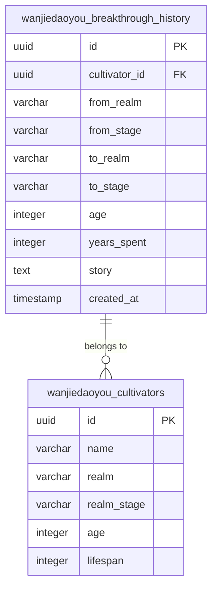
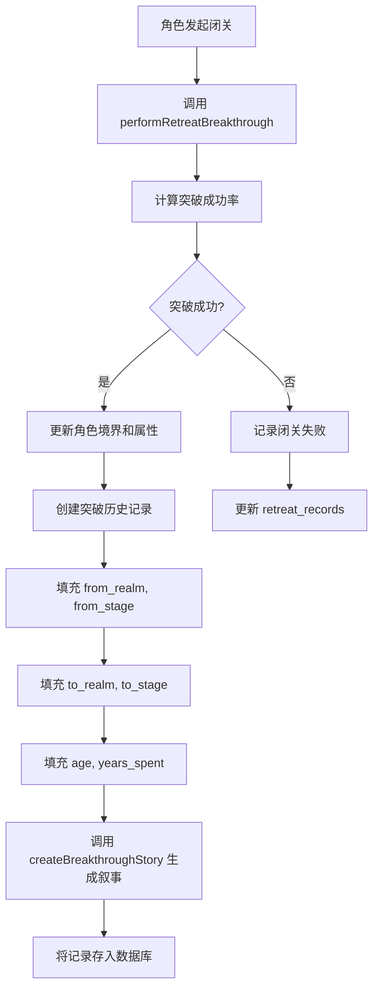
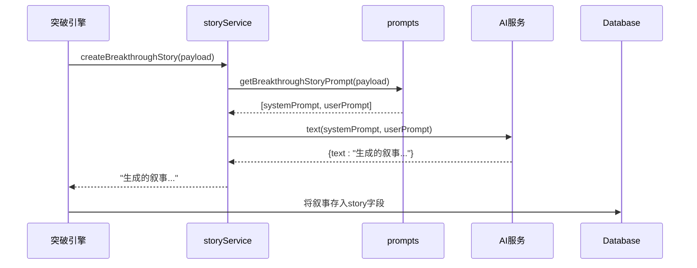

# 突破历史表

<cite>
**本文档引用文件**  
- [schema.ts](file://lib/drizzle/schema.ts#L190-L206)
- [storyService.ts](file://utils/storyService.ts#L9-L14)
- [prompts.ts](file://utils/prompts.ts#L152-L197)
- [breakthroughEngine.ts](file://utils/breakthroughEngine.ts#L186-L197)
- [cultivatorRepository.ts](file://lib/repositories/cultivatorRepository.ts#L477-L644)
- [route.ts](file://app/api/cultivators/[id]/history/route.ts#L25-L28)
</cite>

## 目录
1. [简介](#简介)
2. [表结构与核心字段](#表结构与核心字段)
3. [突破历程记录机制](#突破历程记录机制)
4. [叙事生成机制](#叙事生成机制)
5. [功能应用](#功能应用)
6. [数据一致性保障](#数据一致性保障)

## 简介
突破历史表（breakthrough_history）是修仙系统中用于记录角色境界突破历程的核心数据表。该表详细追踪角色从某一境界阶段向另一阶段跃迁的完整过程，包括突破起点、终点、耗时、年龄及突破过程的修仙风格叙事描述。通过结构化存储每一次突破的关键信息，该表为角色成长可视化、修行历程回放和境界变迁追踪提供了坚实的数据基础。

## 表结构与核心字段

突破历史表 `wanjiedaoyou_breakthrough_history` 定义了角色突破事件的完整数据结构，其核心字段如下：

| 字段名 | 类型 | 是否必填 | 说明 |
|-------|------|---------|------|
| id | UUID | 是 | 主键，唯一标识一次突破记录 |
| cultivator_id | UUID | 是 | 外键，关联角色主表 `wanjiedaoyou_cultivators`，标识所属角色 |
| from_realm | VARCHAR(20) | 是 | 突破前的境界，如“炼气”、“筑基” |
| from_stage | VARCHAR(10) | 是 | 突破前的阶段，如“初期”、“中期”、“后期”、“圆满” |
| to_realm | VARCHAR(20) | 是 | 突破后的境界 |
| to_stage | VARCHAR(10) | 是 | 突破后的阶段 |
| age | INTEGER | 是 | 突破成功时角色的年龄 |
| years_spent | INTEGER | 是 | 本次闭关突破所花费的年数 |
| story | TEXT | 否 | AI生成的突破过程叙事描述 |
| created_at | TIMESTAMP | 是 | 记录创建时间，默认为当前时间 |

**图表来源**  
- [schema.ts](file://lib/drizzle/schema.ts#L190-L206)

**本节来源**  
- [schema.ts](file://lib/drizzle/schema.ts#L190-L206)

## 突破历程记录机制

当角色成功完成一次境界突破时，系统会自动生成一条突破历史记录。该过程由 `breakthroughEngine.ts` 中的 `performRetreatBreakthrough` 函数驱动。

在突破成功后，系统会创建一个 `BreakthroughHistoryEntry` 对象，并将其推入角色的 `breakthrough_history` 数组中。该对象的字段值直接来源于突破前后的状态和突破过程的参数。

**图表来源**  
- [breakthroughEngine.ts](file://utils/breakthroughEngine.ts#L186-L197)
- [storyService.ts](file://utils/storyService.ts#L9-L14)

**本节来源**  
- [breakthroughEngine.ts](file://utils/breakthroughEngine.ts#L186-L197)

## 叙事生成机制

`story` 字段的生成是突破历史表的核心亮点，它通过调用AI服务，结合角色背景和突破详情，生成具有修仙风格的叙事文本。

### 调用流程
1.  **触发**：当 `performRetreatBreakthrough` 函数确认突破成功后，会准备一个包含角色信息和突破摘要的 `BreakthroughStoryPayload` 对象。
2.  **生成提示词**：`storyService.ts` 中的 `createBreakthroughStory` 函数被调用。该函数内部调用 `prompts.ts` 中的 `getBreakthroughStoryPrompt` 函数。
3.  **构建提示词**：`getBreakthroughStoryPrompt` 函数根据 `payload` 中的角色信息（如姓名、境界、灵根、功法、悟性）和突破摘要（如闭关年限、突破类型、属性增长）构建出符合修仙小说风格的系统提示词（system prompt）和用户提示词（user prompt）。
4.  **调用AI**：`createBreakthroughStory` 函数将构建好的提示词传递给 `aiClient.ts` 中的 `text` 函数，发起对AI模型的调用。
5.  **返回结果**：AI模型返回生成的叙事文本，该文本被作为 `story` 字段的值，填充到即将创建的突破历史记录中。

### 提示词模板
`prompts.ts` 中的 `getBreakthroughStoryPrompt` 函数定义了生成叙事的规则：
- **字数要求**：80-150字，语言古风、细腻、有意境。
- **内容要求**：必须结合角色姓名、境界、悟性、灵根、功法等背景，具体写出闭关年限、感悟、瓶颈、破境细节以及天地异象。
- **区分突破类型**：大境界突破需强调劫难与蜕变，小境界精进则突出积累与打磨。
- **结尾要求**：最后一两句点明突破后的境界与状态，为后续剧情埋下伏笔。

**图表来源**  
- [storyService.ts](file://utils/storyService.ts#L9-L14)
- [prompts.ts](file://utils/prompts.ts#L152-L197)

**本节来源**  
- [storyService.ts](file://utils/storyService.ts#L9-L14)
- [prompts.ts](file://utils/prompts.ts#L152-L197)

## 功能应用

突破历史表在系统中扮演着关键角色，支撑着多项核心功能：

1.  **角色成长可视化**：通过查询角色的 `breakthrough_history`，可以清晰地绘制出其境界提升的完整路径图，直观展示角色的成长轨迹。
2.  **修行历程回放**：用户可以查看每一次突破的详细记录，特别是 `story` 字段提供的生动叙事，让玩家能够沉浸式地回顾角色的每一次重大蜕变。
3.  **境界变迁追踪**：该表是追踪角色境界变迁的唯一权威来源。无论是用于排行榜计算、任务系统判定，还是剧情触发，都依赖于此表的准确记录。
4.  **数据分析**：系统可以分析所有角色的突破历史，统计不同境界的平均突破耗时、成功率等数据，用于平衡性调整。

**本节来源**  
- [route.ts](file://app/api/cultivators/[id]/history/route.ts#L25-L28)

## 数据一致性保障

为确保 `breakthrough_history` 表与 `cultivators` 主表之间的数据一致性，系统采用了以下机制：

1.  **外键约束**：在数据库层面，`breakthrough_history` 表的 `cultivator_id` 字段是外键，引用 `cultivators` 表的 `id`。这保证了每一条突破记录都必须对应一个真实存在的角色，防止了孤儿记录的产生。
2.  **事务性更新**：当角色进行突破时，对 `cultivators` 表的更新（如境界、年龄、属性）和向 `breakthrough_history` 表插入新记录的操作，通常在同一个数据库事务中完成。这确保了数据变更的原子性，要么全部成功，要么全部回滚，避免了数据不一致的状态。
3.  **权限校验**：在读取历史记录的API（如 `/api/cultivators/[id]/history`）中，会首先验证请求用户是否为该角色的所有者，确保了数据访问的安全性。

**本节来源**  
- [schema.ts](file://lib/drizzle/schema.ts#L195)
- [route.ts](file://app/api/cultivators/[id]/history/route.ts#L13-L24)
- [cultivatorRepository.ts](file://lib/repositories/cultivatorRepository.ts#L477-L644)