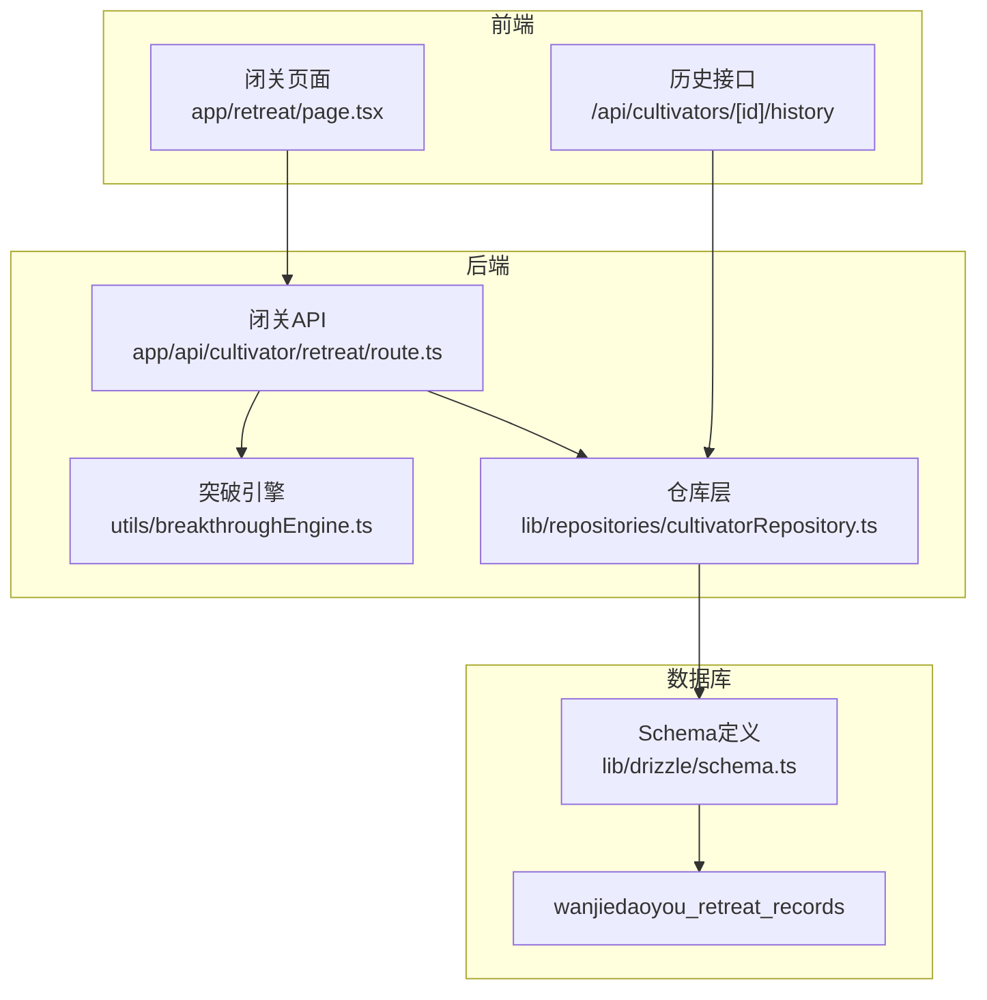
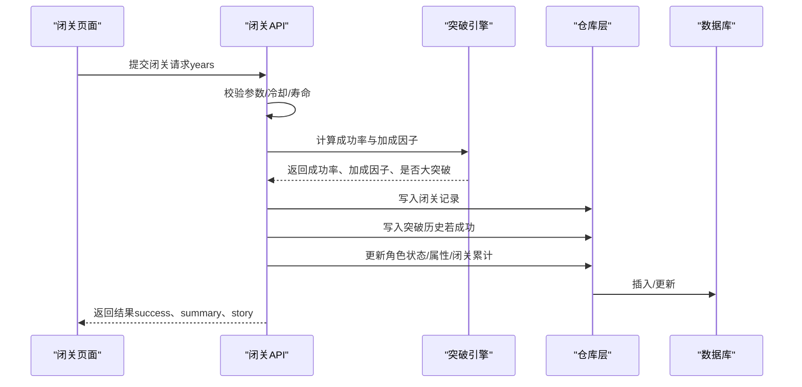
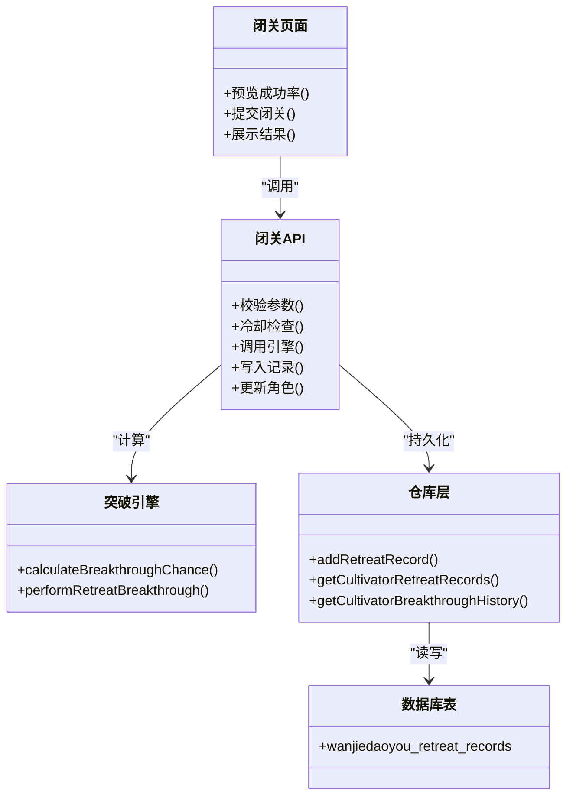

# 闭关记录表

<cite>
**本文引用的文件列表**
- [app/api/cultivator/retreat/route.ts](file://app/api/cultivator/retreat/route.ts)
- [utils/breakthroughEngine.ts](file://utils/breakthroughEngine.ts)
- [lib/drizzle/schema.ts](file://lib/drizzle/schema.ts)
- [lib/repositories/cultivatorRepository.ts](file://lib/repositories/cultivatorRepository.ts)
- [types/cultivator.ts](file://types/cultivator.ts)
- [app/retreat/page.tsx](file://app/retreat/page.tsx)
- [app/api/cultivators/[id]/history/route.ts](file://app/api/cultivators/[id]/history/route.ts)
</cite>

## 目录
1. [简介](#简介)
2. [项目结构与定位](#项目结构与定位)
3. [核心数据模型与字段说明](#核心数据模型与字段说明)
4. [架构总览](#架构总览)
5. [关键流程与实现细节](#关键流程与实现细节)
6. [依赖关系与耦合分析](#依赖关系与耦合分析)
7. [性能与可维护性考量](#性能与可维护性考量)
8. [故障排查与常见问题](#故障排查与常见问题)
9. [结论](#结论)

## 简介
本文档围绕“闭关记录表”（wanjiedaoyou_retreat_records）进行系统化说明，聚焦以下目标：
- 明确各字段的含义与作用：id、cultivator_id、realm、realm_stage、years、success、chance、modifiers、timestamp。
- 解释years如何记录闭关时长；success如何标识突破是否成功；chance如何存储基础成功率。
- 详解modifiers以JSONB格式保存的各类突破加成因子（如悟性、年限、连败修正、难度修正等）的结构设计与在概率计算中的应用。
- 说明该表如何支撑闭关页面的状态展示、历史回溯功能以及突破成功率分析系统。
- 结合breakthroughEngine.ts中的calculateBreakthroughChance函数，阐述数据生成逻辑。

## 项目结构与定位
闭关记录表位于数据库层，通过Drizzle ORM映射为retreatRecords表；业务逻辑由API路由触发，概率计算由引擎模块完成，前端页面负责展示与交互。

图表来源
- [app/retreat/page.tsx](file://app/retreat/page.tsx#L1-L218)
- [app/api/cultivator/retreat/route.ts](file://app/api/cultivator/retreat/route.ts#L1-L179)
- [utils/breakthroughEngine.ts](file://utils/breakthroughEngine.ts#L1-L342)
- [lib/repositories/cultivatorRepository.ts](file://lib/repositories/cultivatorRepository.ts#L674-L832)
- [lib/drizzle/schema.ts](file://lib/drizzle/schema.ts#L175-L188)

章节来源
- [app/retreat/page.tsx](file://app/retreat/page.tsx#L1-L218)
- [app/api/cultivator/retreat/route.ts](file://app/api/cultivator/retreat/route.ts#L1-L179)
- [lib/drizzle/schema.ts](file://lib/drizzle/schema.ts#L175-L188)

## 核心数据模型与字段说明
闭关记录表的字段与类型定义如下（对应数据库与类型定义）：

- id：UUID，主键，唯一标识一次闭关记录。
- cultivatorId：UUID，外键，指向角色表，表示该记录属于哪个角色。
- realm：字符串，当前境界名称（如筑基、金丹等）。
- realm_stage：字符串，当前境界阶段（初期、中期、后期、圆满）。
- years：整数，本次闭关时长（年），用于计算成功率与属性成长。
- success：布尔值，闭关尝试是否成功突破。
- chance：双精度浮点数，本次闭关计算出的基础成功率（0~1之间）。
- roll：双精度浮点数，随机数（0~1），用于判定是否成功。
- timestamp：时间戳，默认当前时间，用于排序与历史回溯。
- modifiers：JSONB，存储各类加成因子的结构化数据，见下节。

章节来源
- [lib/drizzle/schema.ts](file://lib/drizzle/schema.ts#L175-L188)
- [types/cultivator.ts](file://types/cultivator.ts#L42-L51)

## 架构总览
闭关流程的关键参与者与职责：
- 前端页面：收集闭关年限，预览成功率，提交请求并展示结果。
- API路由：校验参数、冷却时间、寿命限制，调用引擎计算，持久化记录与角色状态。
- 引擎模块：根据当前境界、悟性、闭关年限、连败次数、难度等计算成功率与加成因子。
- 仓库层：写入闭关记录、读取历史记录，供页面与分析使用。
- 数据库：存储闭关记录与突破历史，提供查询与排序能力。

图表来源
- [app/retreat/page.tsx](file://app/retreat/page.tsx#L91-L116)
- [app/api/cultivator/retreat/route.ts](file://app/api/cultivator/retreat/route.ts#L18-L178)
- [utils/breakthroughEngine.ts](file://utils/breakthroughEngine.ts#L82-L233)
- [lib/repositories/cultivatorRepository.ts](file://lib/repositories/cultivatorRepository.ts#L674-L709)

## 关键流程与实现细节

### 字段含义与作用
- id：唯一标识，便于前端展示与后端幂等处理。
- cultivator_id：关联角色，确保记录归属正确。
- realm/realm_stage：记录闭关时的角色境界，用于计算难度与成功率。
- years：闭关时长，直接影响年限修正项与属性成长幅度。
- success：决定是否写入突破历史、是否重置连败累计、是否增加寿元。
- chance：基础成功率，用于前端预览与统计分析。
- roll：随机判定值，与chance比较决定成败。
- timestamp：排序与历史回溯的依据。
- modifiers（JSONB）：存储各加成因子，包括基础成功率、悟性修正、年限修正、连败修正、难度修正等。

章节来源
- [lib/drizzle/schema.ts](file://lib/drizzle/schema.ts#L175-L188)
- [types/cultivator.ts](file://types/cultivator.ts#L36-L51)
- [utils/breakthroughEngine.ts](file://utils/breakthroughEngine.ts#L41-L64)

### modifiers结构设计与应用
modifiers在引擎中以对象形式组织，最终以JSONB存入数据库。其字段包括：
- base：基础成功率（受当前境界与尝试类型影响）
- comprehension：悟性修正（随悟性提升而提高，存在上限）
- years：闭关年限修正（随闭关年限线性提升，存在上限）
- failureStreak：连败修正（基于累计闭关年限，随连败增加而提高）
- summaryDifficulty：突破难度修正（随境界提升而降低）

这些因子在calculateBreakthroughChance中被累乘/累加，得到最终chance。前端页面通过calculateBreakthroughChance预览成功率，后端在performRetreatBreakthrough中生成roll并判定成功与否，随后将modifiers与roll一起写入数据库。

章节来源
- [utils/breakthroughEngine.ts](file://utils/breakthroughEngine.ts#L82-L117)
- [utils/breakthroughEngine.ts](file://utils/breakthroughEngine.ts#L119-L233)
- [app/retreat/page.tsx](file://app/retreat/page.tsx#L32-L39)

### years如何记录闭关时长
- 前端允许输入1~300年的闭关年限，API路由进行边界校验。
- 引擎按闭关年限计算年限修正项，同时在成功时重置累计闭关年限，失败时累加累计闭关年限。
- 数据库存储的是本次闭关的实际年限（years），用于历史回溯与统计。

章节来源
- [app/api/cultivator/retreat/route.ts](file://app/api/cultivator/retreat/route.ts#L38-L43)
- [utils/breakthroughEngine.ts](file://utils/breakthroughEngine.ts#L119-L156)
- [lib/repositories/cultivatorRepository.ts](file://lib/repositories/cultivatorRepository.ts#L674-L709)

### success如何标识突破是否成功
- 引擎根据roll与chance比较得出success。
- 若成功且存在下一境界，则写入突破历史；无论成功与否，都会写入闭关记录。
- 前端根据success渲染不同结果文案与后续动作（如转世重修提示）。

章节来源
- [utils/breakthroughEngine.ts](file://utils/breakthroughEngine.ts#L139-L141)
- [app/retreat/page.tsx](file://app/retreat/page.tsx#L184-L214)

### chance如何存储基础成功率
- 引擎在calculateBreakthroughChance中计算chance，并在performRetreatBreakthrough中将chance写入闭关记录。
- 前端通过calculateBreakthroughChance预览成功率，后端在API响应中返回summary.chance供展示。

章节来源
- [utils/breakthroughEngine.ts](file://utils/breakthroughEngine.ts#L82-L117)
- [utils/breakthroughEngine.ts](file://utils/breakthroughEngine.ts#L199-L209)
- [app/retreat/page.tsx](file://app/retreat/page.tsx#L173-L176)

### modifiers在概率计算中的应用
- 基础成功率由基础值与难度系数相乘得到。
- 悟性修正、年限修正、连败修正、难度修正共同影响最终成功率。
- modifiers最终以JSONB写入数据库，便于后续分析与可视化。

章节来源
- [utils/breakthroughEngine.ts](file://utils/breakthroughEngine.ts#L82-L117)
- [lib/drizzle/schema.ts](file://lib/drizzle/schema.ts#L175-L188)

### 如何支撑闭关页面的状态展示
- 页面预览：通过calculateBreakthroughChance实时计算并显示成功率。
- 提交闭关：调用闭关API，接收后端返回的summary与story，渲染结果。
- 寿元与连败累计：页面展示剩余寿元与累计闭关年限，辅助决策。

章节来源
- [app/retreat/page.tsx](file://app/retreat/page.tsx#L32-L39)
- [app/retreat/page.tsx](file://app/retreat/page.tsx#L91-L116)
- [app/retreat/page.tsx](file://app/retreat/page.tsx#L156-L181)

### 如何支撑历史回溯与分析
- 历史接口：/api/cultivators/[id]/history一次性拉取闭关记录与突破历史。
- 仓库层：提供按时间排序的历史查询，支持前端分页与筛选。
- 数据库：以timestamp为主键排序，便于快速检索最近记录与趋势分析。

章节来源
- [app/api/cultivators/[id]/history/route.ts](file://app/api/cultivators/[id]/history/route.ts#L1-L41)
- [lib/repositories/cultivatorRepository.ts](file://lib/repositories/cultivatorRepository.ts#L789-L832)

## 依赖关系与耦合分析
- 前端依赖引擎函数进行概率预览，依赖API路由进行提交与结果展示。
- API路由依赖引擎进行概率计算，依赖仓库层进行数据持久化。
- 仓库层依赖Schema定义进行ORM映射，依赖数据库驱动进行CRUD。
- Schema定义与类型定义相互约束，保证前后端一致的数据结构。

图表来源
- [app/retreat/page.tsx](file://app/retreat/page.tsx#L1-L218)
- [app/api/cultivator/retreat/route.ts](file://app/api/cultivator/retreat/route.ts#L1-L179)
- [utils/breakthroughEngine.ts](file://utils/breakthroughEngine.ts#L1-L342)
- [lib/repositories/cultivatorRepository.ts](file://lib/repositories/cultivatorRepository.ts#L674-L832)
- [lib/drizzle/schema.ts](file://lib/drizzle/schema.ts#L175-L188)

## 性能与可维护性考量
- 查询性能：历史查询按cultivatorId与timestamp排序，建议在cultivatorId与timestamp上建立索引以优化分页与趋势分析。
- 数据一致性：引擎计算与数据库写入在同一事务中进行，避免中间态不一致。
- 可维护性：modifiers以JSONB存储，便于扩展新的加成因子；类型定义与Schema定义分离，降低耦合度。
- 前端体验：预览成功率减少无效请求，提升交互流畅度。

[本节为通用建议，不直接分析具体文件]

## 故障排查与常见问题
- 闭关失败或失败原因：API路由会在冷却不足、寿命不足、参数非法时返回错误；前端应提示用户并引导调整。
- 成功率异常：若前端预览与后端实际不符，检查引擎计算逻辑与数据库写入是否一致。
- 历史缺失：确认仓库层查询是否按cultivatorId过滤，以及数据库中是否存在对应记录。
- modifiers解析：若前端解析JSONB失败，检查类型定义与数据库字段是否一致。

章节来源
- [app/api/cultivator/retreat/route.ts](file://app/api/cultivator/retreat/route.ts#L38-L79)
- [lib/repositories/cultivatorRepository.ts](file://lib/repositories/cultivatorRepository.ts#L789-L832)
- [types/cultivator.ts](file://types/cultivator.ts#L36-L51)

## 结论
闭关记录表通过严谨的字段设计与清晰的业务流程，有效支撑了闭关页面的状态展示、历史回溯与成功率分析。引擎模块将复杂的概率计算抽象为可配置的加成因子，配合JSONB存储，既保证了灵活性，又便于后续扩展与分析。建议在生产环境中完善索引策略与错误监控，持续优化用户体验与系统稳定性。