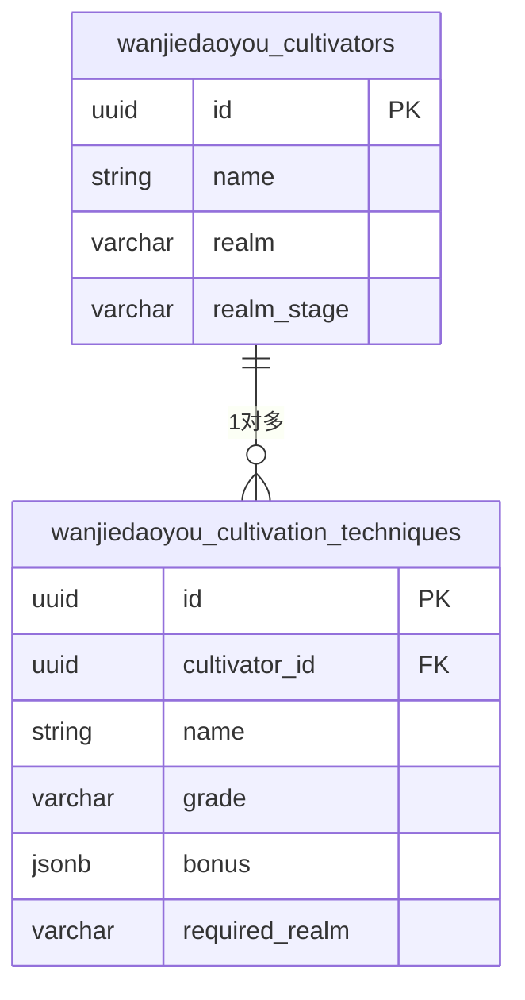
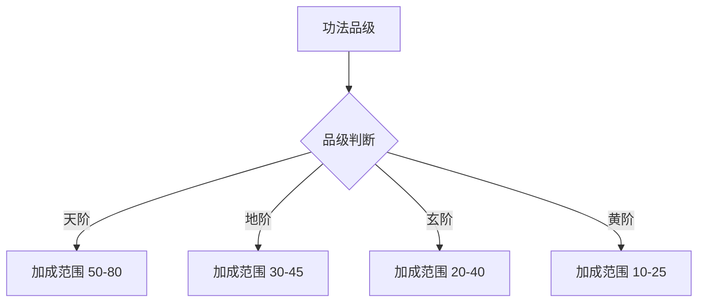
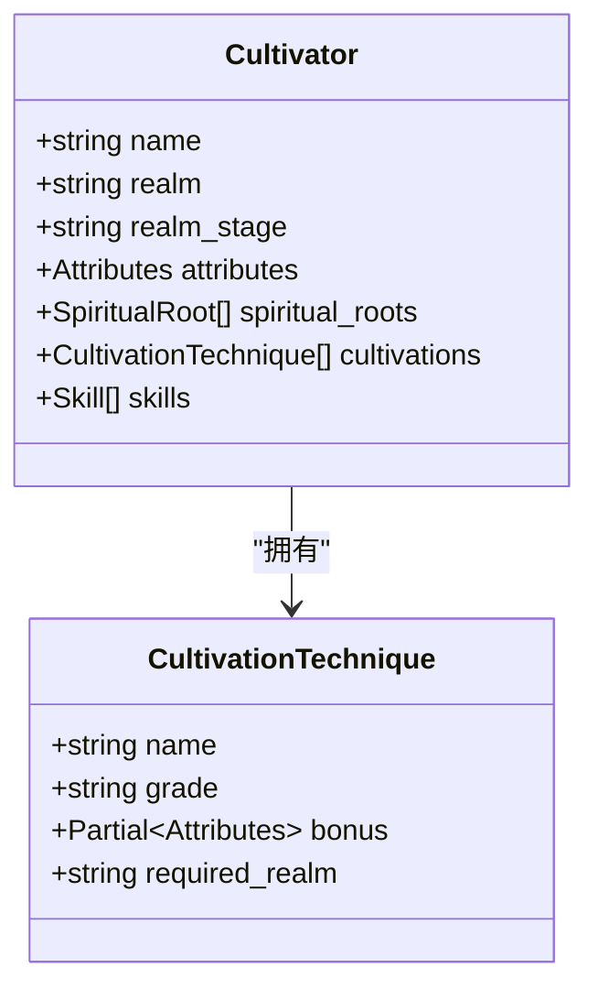
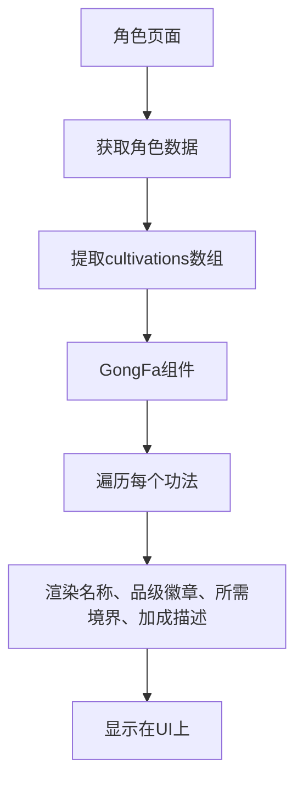

# 功法表 (cultivationTechniques)

<cite>
**本文档引用文件**   
- [schema.ts](file://lib/drizzle/schema.ts)
- [characterEngine.ts](file://utils/characterEngine.ts)
- [AlchemyStrategy.ts](file://engine/creation/strategies/AlchemyStrategy.ts)
- [GongFa.tsx](file://components/func/GongFa.tsx)
- [ShenTong.tsx](file://components/func/ShenTong.tsx)
- [cultivator.ts](file://types/cultivator.ts)
- [constants.ts](file://types/constants.ts)
</cite>

## 目录
1. [引言](#引言)
2. [功法表结构与核心字段](#功法表结构与核心字段)
3. [品级体系与修炼速度](#品级体系与修炼速度)
4. [属性加成机制](#属性加成机制)
5. [境界解锁约束](#境界解锁约束)
6. [与角色主表的关联机制](#与角色主表的关联机制)
7. [炼器系统中的功法生成流程](#炼器系统中的功法生成流程)
8. [功法数据样例与战斗加成](#功法数据样例与战斗加成)
9. [前端渲染组件分析](#前端渲染组件分析)
10. [结论](#结论)

## 引言
功法表（cultivationTechniques）是修仙角色成长路径的核心数据载体，承载着角色修炼的核心被动能力。该表通过品级、属性加成和境界要求等字段，构建了一个完整的功法体系，直接影响角色的基础属性和成长潜力。本文档将深入分析该表的结构、机制及其在整个系统中的作用。

## 功法表结构与核心字段

功法表作为角色主表的从属表，存储了角色所修习的功法信息。其核心字段包括`name`（功法名称）、`grade`（品级）、`bonus`（属性加成）和`required_realm`（所需境界）。

**图表来源**
- [schema.ts](file://lib/drizzle/schema.ts#L82-L96)

**本节来源**
- [schema.ts](file://lib/drizzle/schema.ts#L82-L96)
- [cultivator.ts](file://types/cultivator.ts#L80-L86)

## 品级体系与修炼速度

功法的`grade`字段采用“天阶上品”至“黄阶下品”的品级体系，共分为12个等级，从高到低依次为：天阶上品、天阶中品、天阶下品、地阶上品、地阶中品、地阶下品、玄阶上品、玄阶中品、玄阶下品、黄阶上品、黄阶中品、黄阶下品。

品级直接决定了功法提供的属性加成范围。品级越高，基础属性加成的下限和上限也越高，从而显著提升角色的修炼速度和最终潜力。例如，天阶上品功法的基础加成范围为50-80，而黄阶下品仅为10-15。

**图表来源**
- [characterEngine.ts](file://utils/characterEngine.ts#L223-L240)

**本节来源**
- [characterEngine.ts](file://utils/characterEngine.ts#L223-L240)
- [constants.ts](file://types/constants.ts#L120-L133)

## 属性加成机制

`bonus`字段是功法表的核心，其数据类型为JSONB，用于存储多维属性加成。该字段是一个对象，其键（key）对应角色的五维基础属性（`vitality`体魄、`spirit`灵力、`wisdom`悟性、`speed`身法、`willpower`神识），值（value）为具体的加成数值。

这种设计实现了高度的灵活性，允许一个功法同时对多个属性进行加成。例如，一个功法可以同时增加体魄和灵力，而另一个功法可能专注于提升悟性和身法。系统在计算角色最终属性时，会将所有已修习功法的`bonus`值进行累加。

**本节来源**
- [schema.ts](file://lib/drizzle/schema.ts#L92)
- [cultivator.ts](file://types/cultivator.ts#L84)

## 境界解锁约束

`required_realm`字段用于约束功法的解锁条件。它是一个字符串，其值必须是预定义的境界之一，如“炼气”、“筑基”、“金丹”等。

角色只有在达到或超过该字段指定的境界时，才能学习和修习该功法。这一机制确保了功法体系的层次性和合理性，防止低境界角色过早获得高阶功法，从而维护了游戏的成长曲线和平衡性。

**本节来源**
- [schema.ts](file://lib/drizzle/schema.ts#L93)
- [cultivator.ts](file://types/cultivator.ts#L85)

## 与角色主表的关联机制

功法表通过外键`cultivator_id`与角色主表`wanjiedaoyou_cultivators`建立关联。这是一个典型的“一对多”关系，即一个角色可以拥有多个功法，但每个功法只能属于一个角色。

当角色被删除时，其关联的所有功法也会被级联删除（`onDelete: "cascade"`），保证了数据的完整性。角色的完整数据模型（`Cultivator`接口）中包含一个`cultivations`数组，用于在运行时存储其所有功法。

**图表来源**
- [schema.ts](file://lib/drizzle/schema.ts#L88)
- [cultivator.ts](file://types/cultivator.ts#L218-L239)

**本节来源**
- [schema.ts](file://lib/drizzle/schema.ts#L88)
- [cultivator.ts](file://types/cultivator.ts#L218-L239)

## 炼器系统中的功法生成流程

虽然`AlchemyStrategy`（炼丹策略）主要用于生成消耗品，但其设计模式揭示了系统如何通过AI生成新功法。完整的流程如下：

1.  **用户输入**：玩家在炼器界面选择材料并输入意图。
2.  **上下文构建**：系统构建`CreationContext`，包含角色信息、所选材料和用户意图。
3.  **验证**：`validate`方法检查材料是否符合生成条件。
4.  **提示词生成**：`constructPrompt`方法根据角色境界、材料品阶和属性，结合严格的炼丹法则，生成一个结构化的系统提示（system prompt）和用户输入（user prompt）。
5.  **AI生成**：提示词被发送给AI模型，AI根据规则生成符合Zod Schema的JSON数据。
6.  **结果持久化**：`persistResult`方法将AI生成的JSON数据解析并存入数据库。对于功法，此步骤会将数据插入`cultivationTechniques`表。

**本节来源**
- [AlchemyStrategy.ts](file://engine/creation/strategies/AlchemyStrategy.ts)
- [CreationStrategy.ts](file://engine/creation/CreationStrategy.ts)

## 功法数据样例与战斗加成

以下为不同元素功法的实际数据样例及其对战斗技能的影响：

| 功法名称 | 品级 | 属性加成 (bonus) | 所需境界 | 战斗技能加成效果 |
| :--- | :--- | :--- | :--- | :--- |
| 九转玄功 | 天阶上品 | vitality: 65, spirit: 70 | 金丹 | 显著提升气血上限和法术伤害，使角色在持久战中更具优势。 |
| 青木诀 | 地阶中品 | wisdom: 35, speed: 38 | 筑基 | 提高暴击率和出手速度，适合追求速攻和控制的战斗风格。 |
| 炎阳真解 | 玄阶上品 | spirit: 32, willpower: 28 | 筑基 | 增强法术威力和状态抗性，使火系技能更具威胁。 |

**本节来源**
- [characterEngine.ts](file://utils/characterEngine.ts#L223-L240)
- [cultivator.ts](file://types/cultivator.ts#L84)

## 前端渲染组件分析

前端通过`GongFa.tsx`组件来渲染功法信息。该组件接收一个`cultivations`数组作为输入，遍历并展示每个功法的名称、品级、所需境界和属性加成。

`ShenTong.tsx`组件则负责渲染神通（技能），它与`GongFa.tsx`类似，但关注的是主动技能。两者共同构成了角色能力的核心展示界面。`GongFa.tsx`使用`InkListItem`和`InkBadge`等UI组件，将功法的品级以徽章形式可视化，提升了用户体验。

**图表来源**
- [GongFa.tsx](file://components/func/GongFa.tsx)
- [ShenTong.tsx](file://components/func/ShenTong.tsx)

**本节来源**
- [GongFa.tsx](file://components/func/GongFa.tsx)
- [ShenTong.tsx](file://components/func/ShenTong.tsx)
- [cultivator.ts](file://types/cultivator.ts#L80-L86)

## 结论
功法表（cultivationTechniques）是角色成长系统的核心枢纽。它通过严谨的品级体系、灵活的JSONB属性加成和明确的境界约束，构建了一个深度且平衡的修炼路径。该表与角色主表的关联确保了数据的一致性，而其设计模式也为通过AI生成新内容提供了可能。前端组件则有效地将这些数据转化为直观的用户界面，完成了从数据到体验的闭环。