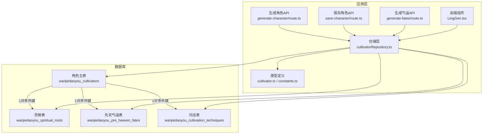
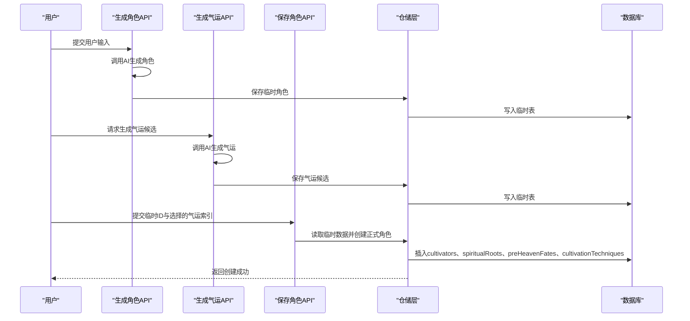
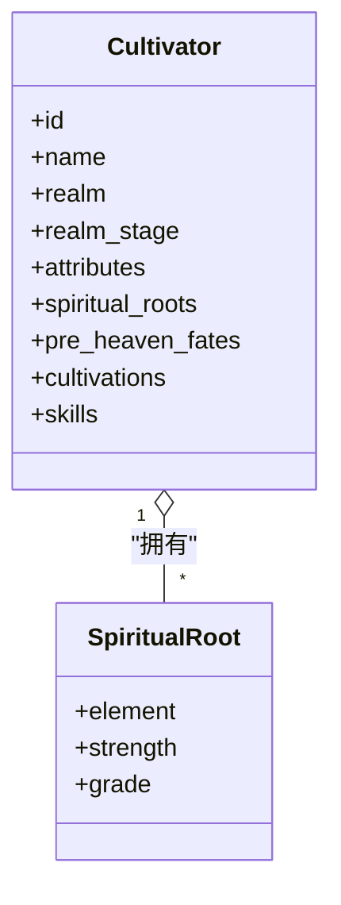
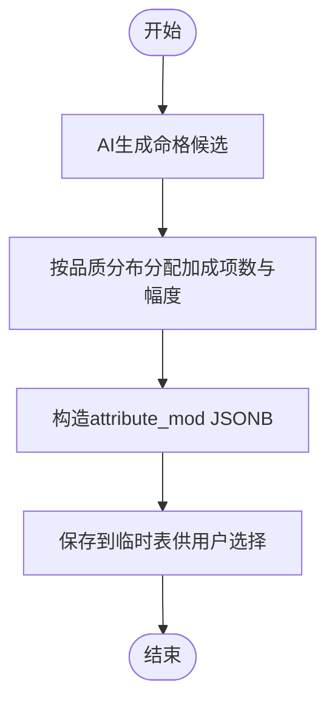
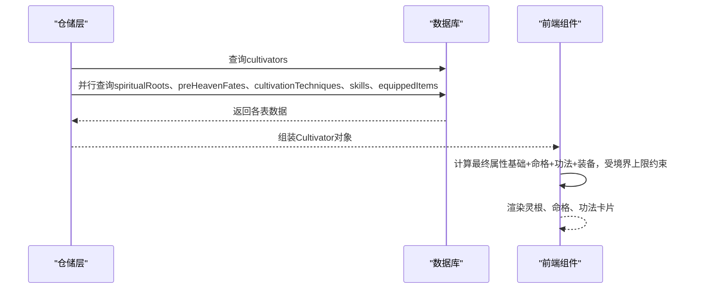
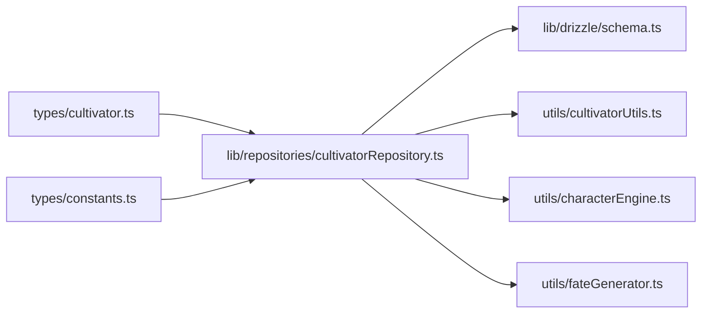

# 属性与资质表

<cite>
**本文引用的文件**
- [schema.ts](file://lib/drizzle/schema.ts)
- [cultivatorRepository.ts](file://lib/repositories/cultivatorRepository.ts)
- [cultivator.ts](file://types/cultivator.ts)
- [constants.ts](file://types/constants.ts)
- [fateGenerator.ts](file://utils/fateGenerator.ts)
- [characterEngine.ts](file://utils/characterEngine.ts)
- [cultivatorUtils.ts](file://utils/cultivatorUtils.ts)
- [LingGen.tsx](file://components/func/LingGen.tsx)
- [generate-character/route.ts](file://app/api/generate-character/route.ts)
- [save-character/route.ts](file://app/api/save-character/route.ts)
- [generate-fates/route.ts](file://app/api/generate-fates/route.ts)
- [0000_equal_the_fury.sql](file://drizzle/0000_equal_the_fury.sql)
</cite>

## 目录
1. [简介](#简介)
2. [项目结构](#项目结构)
3. [核心组件](#核心组件)
4. [架构总览](#架构总览)
5. [详细组件分析](#详细组件分析)
6. [依赖分析](#依赖分析)
7. [性能考量](#性能考量)
8. [故障排查指南](#故障排查指南)
9. [结论](#结论)
10. [附录](#附录)

## 简介
本文件聚焦于角色属性与资质相关的核心表：spiritualRoots（灵根）、preHeavenFates（先天命格）与cultivationTechniques（功法）。我们将从数据库表结构、类型定义、业务逻辑、与角色主表的关系、创建与成长过程中的数据联动，以及前端展示与API调用等方面进行系统化说明，并提供实际数据样例与API调用方式，帮助读者理解如何动态加载与展示角色资质信息。

## 项目结构
围绕属性与资质表的关键代码分布在以下模块：
- 数据库模式定义：lib/drizzle/schema.ts
- 仓储层与装配逻辑：lib/repositories/cultivatorRepository.ts
- 类型与常量：types/cultivator.ts、types/constants.ts
- 气运生成与平衡：utils/fateGenerator.ts、utils/characterEngine.ts、utils/cultivatorUtils.ts
- 前端展示组件：components/func/LingGen.tsx
- API路由：app/api/generate-character/route.ts、app/api/save-character/route.ts、app/api/generate-fates/route.ts
- 初始迁移脚本：drizzle/0000_equal_the_fury.sql

图表来源
- [schema.ts](file://lib/drizzle/schema.ts#L17-L96)
- [0000_equal_the_fury.sql](file://drizzle/0000_equal_the_fury.sql#L31-L115)
- [cultivatorRepository.ts](file://lib/repositories/cultivatorRepository.ts#L36-L108)
- [LingGen.tsx](file://components/func/LingGen.tsx#L1-L127)
- [generate-character/route.ts](file://app/api/generate-character/route.ts#L1-L80)
- [save-character/route.ts](file://app/api/save-character/route.ts#L1-L128)
- [generate-fates/route.ts](file://app/api/generate-fates/route.ts#L1-L69)

章节来源
- [schema.ts](file://lib/drizzle/schema.ts#L17-L96)
- [0000_equal_the_fury.sql](file://drizzle/0000_equal_the_fury.sql#L31-L115)

## 核心组件
- 角色主表（cultivators）：承载角色基础属性与状态，是灵根、先天气运、功法等子表的父表。
- 灵根表（spiritualRoots）：记录角色的元素属性与强度，支持多灵根，影响修炼效率与法术加成。
- 先天气运表（preHeavenFates）：记录命格名称、类型（吉/凶）、品质与属性加成JSONB，体现“天道无常”的设定。
- 功法表（cultivationTechniques）：记录功法名称、品阶、所需境界与被动加成JSONB，影响角色属性上限与战斗表现。

章节来源
- [schema.ts](file://lib/drizzle/schema.ts#L17-L96)
- [cultivator.ts](file://types/cultivator.ts#L21-L103)

## 架构总览
角色创建与成长的数据流如下：
- 生成角色：AI生成角色与基础属性，经平衡引擎调整后保存至临时表。
- 生成气运：AI生成多个先天气运候选，用户选择3个加入角色。
- 保存角色：将临时角色与选定气运写入正式表，同时创建灵根、功法、技能等关联数据。
- 展示与计算：前端组件读取角色完整数据，按境界阶段上限与命格/功法/装备加成计算最终属性。

图表来源
- [generate-character/route.ts](file://app/api/generate-character/route.ts#L1-L80)
- [generate-fates/route.ts](file://app/api/generate-fates/route.ts#L1-L69)
- [save-character/route.ts](file://app/api/save-character/route.ts#L1-L128)
- [cultivatorRepository.ts](file://lib/repositories/cultivatorRepository.ts#L182-L294)
- [0000_equal_the_fury.sql](file://drizzle/0000_equal_the_fury.sql#L31-L115)

## 详细组件分析

### 灵根表（spiritualRoots）
- 字段定义
  - element：元素类型，支持金、木、水、火、土、风、雷、冰。
  - strength：强度，范围0-100，强度越高，修炼速度越快，感应灵气越容易。
  - grade：灵根品级，支持“天灵根”“真灵根”“伪灵根”“变异灵根”，由算法根据数量与元素判定。
- 业务逻辑
  - 单一元素的天灵根修炼速度最快；双元素为真灵根；三/四元素为伪灵根；风、雷、冰为变异灵根，通常为单灵根且强度较高。
  - 强度受平衡引擎约束，确保角色整体不超上限。
- 与主表关系
  - 一对多：一个角色可拥有多个灵根，外键指向cultivators.id，删除角色时级联删除。
- 前端展示
  - LingGen组件以徽章形式展示元素与品级，支持紧凑模式与帮助说明。

图表来源
- [schema.ts](file://lib/drizzle/schema.ts#L57-L66)
- [cultivator.ts](file://types/cultivator.ts#L29-L35)
- [LingGen.tsx](file://components/func/LingGen.tsx#L1-L127)

章节来源
- [schema.ts](file://lib/drizzle/schema.ts#L57-L66)
- [cultivator.ts](file://types/cultivator.ts#L29-L35)
- [characterEngine.ts](file://utils/characterEngine.ts#L327-L362)
- [LingGen.tsx](file://components/func/LingGen.tsx#L1-L127)

### 先天气运表（preHeavenFates）
- 字段定义
  - name：命格名称，2-6字，体现宿命感。
  - type：类型，吉/凶，体现福祸相依。
  - quality：品质，凡品、灵品、玄品、真品、地品、天品、仙品、神品，影响加成幅度与数量。
  - attribute_mod：JSONB属性加成对象，可包含vitality、spirit、wisdom、speed、willpower的增减。
  - description：命格描述，包含来源、代价或触发条件。
- 业务逻辑
  - 品质越高，加成项数量越多，绝对值之和越大；加成可正可负，体现“天道无常”。
  - 生成器通过结构化输出与概率分布控制，保证品质分布合理。
- 与主表关系
  - 一对多：一个角色可拥有多个先天气运，外键指向cultivators.id，删除角色时级联删除。
- 属性计算
  - 最终属性 = 基础属性 + 命格加成 + 功法加成 + 装备加成，且不超过境界阶段上限。

图表来源
- [fateGenerator.ts](file://utils/fateGenerator.ts#L1-L166)
- [schema.ts](file://lib/drizzle/schema.ts#L69-L80)
- [cultivator.ts](file://types/cultivator.ts#L63-L79)

章节来源
- [schema.ts](file://lib/drizzle/schema.ts#L69-L80)
- [cultivator.ts](file://types/cultivator.ts#L63-L79)
- [fateGenerator.ts](file://utils/fateGenerator.ts#L1-L166)

### 功法表（cultivationTechniques）
- 字段定义
  - name：功法名称。
  - grade：品阶，天阶上品至黄阶下品。
  - bonus：JSONB被动加成，同attribute_mod结构，可作用于基础属性。
  - required_realm：所需最低境界，限制使用条件。
- 业务逻辑
  - 功法加成与命格加成共同参与最终属性计算；某些功法可能限制在特定境界阶段使用。
- 与主表关系
  - 一对多：一个角色可学习多门功法，外键指向cultivators.id，删除角色时级联删除。

章节来源
- [schema.ts](file://lib/drizzle/schema.ts#L82-L96)
- [cultivator.ts](file://types/cultivator.ts#L80-L87)

### 角色主表与资质表的关系
- 一对一/多对多关系
  - 与spiritualRoots：一对多（一个角色可有多个灵根）
  - 与preHeavenFates：一对多（一个角色可有多个命格）
  - 与cultivationTechniques：一对多（一个角色可有多门功法）
- 级联删除
  - 删除角色主表记录时，关联的灵根、命格、功法等均会被级联删除，保证数据一致性。

章节来源
- [schema.ts](file://lib/drizzle/schema.ts#L17-L96)
- [0000_equal_the_fury.sql](file://drizzle/0000_equal_the_fury.sql#L106-L115)

### 创建与成长过程中的数据联动
- 创建流程
  - 生成角色：AI生成基础属性与资质，保存至临时表。
  - 生成气运：AI生成候选，用户选择3个加入角色。
  - 保存角色：事务内插入cultivators、spiritualRoots、preHeavenFates、cultivationTechniques等表，随后装配完整角色对象返回。
- 成长与展示
  - 仓储层并行查询各子表，组装为Cultivator对象。
  - 前端组件读取并展示灵根、命格、功法等信息；最终属性通过工具函数按境界上限与加成累加计算。

图表来源
- [cultivatorRepository.ts](file://lib/repositories/cultivatorRepository.ts#L36-L108)
- [cultivatorUtils.ts](file://utils/cultivatorUtils.ts#L133-L194)
- [LingGen.tsx](file://components/func/LingGen.tsx#L1-L127)

章节来源
- [cultivatorRepository.ts](file://lib/repositories/cultivatorRepository.ts#L36-L108)
- [cultivatorUtils.ts](file://utils/cultivatorUtils.ts#L133-L194)

### 实际数据样例与API调用方式
- 数据样例（示意）
  - 灵根：element为“金”，strength为75，grade为“天灵根”
  - 先天气运：name为“剑仙转世”，type为“吉”，quality为“天品”，attribute_mod包含vitality与speed的正向加成
  - 功法：name为“九阳神功”，grade为“天阶上品”，bonus包含spirit与willpower的加成，required_realm为“金丹”
- API调用
  - 生成角色：POST /api/generate-character，请求体包含userInput，响应包含临时角色ID与平衡说明
  - 生成气运：POST /api/generate-fates，请求体包含tempId，响应包含候选气运列表与剩余重随次数
  - 保存角色：POST /api/save-character，请求体包含tempCultivatorId与selectedFateIndices，响应返回保存成功

章节来源
- [generate-character/route.ts](file://app/api/generate-character/route.ts#L1-L80)
- [generate-fates/route.ts](file://app/api/generate-fates/route.ts#L1-L69)
- [save-character/route.ts](file://app/api/save-character/route.ts#L1-L128)

## 依赖分析
- 表间依赖
  - spiritualRoots、preHeavenFates、cultivationTechniques均通过外键关联cultivators，删除角色时级联删除。
- 类型与常量依赖
  - types/cultivator.ts定义了Attributes、SpiritualRoot、PreHeavenFate、CultivationTechnique等接口。
  - types/constants.ts定义了ElementType、SkillGrade、Quality等枚举与派生类型。
- 工具函数依赖
  - utils/cultivatorUtils.ts负责最终属性计算与上限约束。
  - utils/characterEngine.ts负责灵根品级判定与整体平衡。
  - utils/fateGenerator.ts负责先天气运生成与JSONB结构校验。

图表来源
- [cultivator.ts](file://types/cultivator.ts#L21-L103)
- [constants.ts](file://types/constants.ts#L1-L191)
- [cultivatorRepository.ts](file://lib/repositories/cultivatorRepository.ts#L1-L120)
- [cultivatorUtils.ts](file://utils/cultivatorUtils.ts#L133-L194)
- [characterEngine.ts](file://utils/characterEngine.ts#L327-L362)
- [fateGenerator.ts](file://utils/fateGenerator.ts#L1-L166)

章节来源
- [cultivator.ts](file://types/cultivator.ts#L21-L103)
- [constants.ts](file://types/constants.ts#L1-L191)
- [cultivatorRepository.ts](file://lib/repositories/cultivatorRepository.ts#L1-L120)
- [cultivatorUtils.ts](file://utils/cultivatorUtils.ts#L133-L194)
- [characterEngine.ts](file://utils/characterEngine.ts#L327-L362)
- [fateGenerator.ts](file://utils/fateGenerator.ts#L1-L166)

## 性能考量
- 并行查询：仓储层在装配角色时对关联表采用Promise.all并行查询，减少往返延迟。
- 级联删除：删除主表即删除子表，避免冗余清理逻辑。
- JSONB结构：attribute_mod与bonus采用JSONB，便于灵活扩展属性维度，但需注意查询索引与序列化成本。
- 属性上限：按境界阶段上限约束最终属性，避免过度膨胀导致性能与平衡问题。

[本节为通用建议，无需列出具体文件来源]

## 故障排查指南
- 生成角色失败
  - 检查用户认证与输入长度；查看API返回的错误信息与堆栈。
- 保存角色失败
  - 确认临时角色ID有效、用户尚未拥有角色、所选气运索引合法。
- 气运重随次数用尽
  - 服务端限制最大重随次数，超过后需重新生成。
- 属性异常
  - 检查平衡引擎是否对属性进行了整体缩放；确认最终属性未超过当前境界上限。

章节来源
- [generate-character/route.ts](file://app/api/generate-character/route.ts#L1-L80)
- [save-character/route.ts](file://app/api/save-character/route.ts#L1-L128)
- [generate-fates/route.ts](file://app/api/generate-fates/route.ts#L1-L69)
- [characterEngine.ts](file://utils/characterEngine.ts#L311-L325)

## 结论
spiritualRoots、preHeavenFates与cultivationTechniques三张表共同构成了角色资质体系的核心：灵根决定修炼方向与效率，先天气运体现“天道无常”的加成与代价，功法提供可叠加的被动增益。通过仓储层的并行装配与工具函数的最终属性计算，系统实现了从创建到成长的完整数据联动。前端组件与API协同，提供了动态加载与展示资质信息的能力。

[本节为总结，无需列出具体文件来源]

## 附录
- 关键字段速览
  - 灵根：element、strength、grade
  - 先天气运：name、type、quality、attribute_mod、description
  - 功法：name、grade、bonus、required_realm
- 相关类型与常量
  - ElementType、SkillGrade、Quality等枚举与派生类型定义见types/constants.ts
  - 数据模型接口见types/cultivator.ts

章节来源
- [constants.ts](file://types/constants.ts#L1-L191)
- [cultivator.ts](file://types/cultivator.ts#L21-L103)