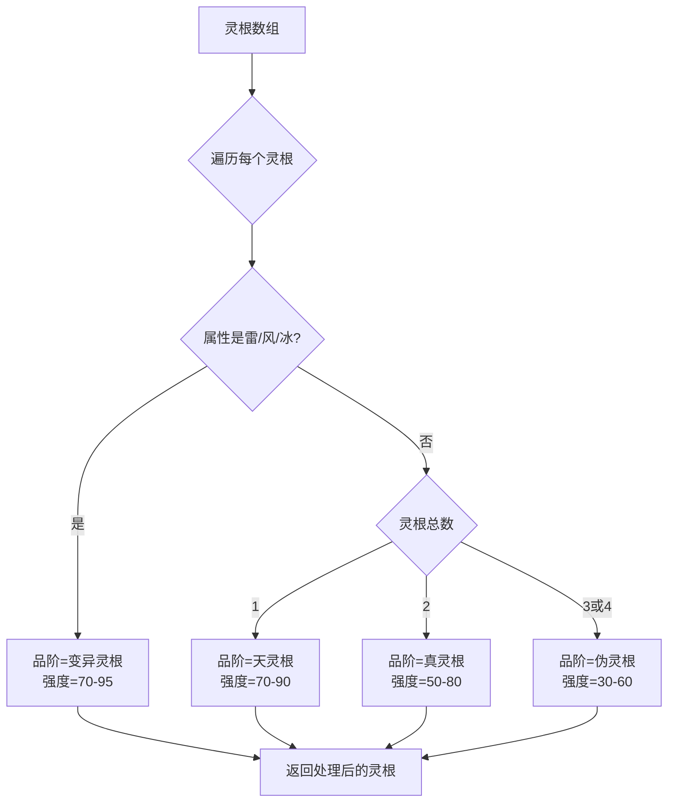
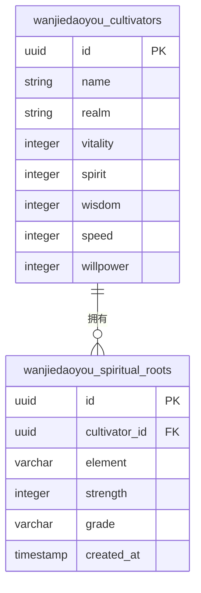

# 灵根表 (spiritualRoots)

<cite>
**本文档引用文件**   
- [spiritualRoots.ts](file://lib/drizzle/schema.ts#L57-L66)
- [characterEngine.ts](file://utils/characterEngine.ts#L330-L376)
- [cultivatorRepository.ts](file://lib/repositories/cultivatorRepository.ts#L217-L225)
- [LingGen.tsx](file://components/func/LingGen.tsx)
- [GongFa.tsx](file://components/func/GongFa.tsx)
- [constants.ts](file://types/constants.ts#L90-L96)
- [battleEngine.ts](file://engine/battleEngine.ts#L124-L130)
</cite>

## 目录
1. [简介](#简介)
2. [字段详解](#字段详解)
3. [品阶与强度规则](#品阶与强度规则)
4. [数据库结构与关系](#数据库结构与关系)
5. [角色创建与持久化流程](#角色创建与持久化流程)
6. [灵根对修炼的影响](#灵根对修炼的影响)
7. [数据库查询示例](#数据库查询示例)
8. [前端展示](#前端展示)
9. [常见问题](#常见问题)

## 简介
灵根表（spiritual_roots）是修仙体系中的核心数据表，用于存储角色的灵根属性。灵根是决定角色修炼天赋、灵气吸收效率和修炼上限的关键因素。该表与角色主表（cultivators）构成一对多关系，一个角色可以拥有一到多个灵根，共同影响其修炼之路。

**Section sources**
- [spiritualRoots.ts](file://lib/drizzle/schema.ts#L57-L66)

## 字段详解
灵根表包含以下核心字段，每个字段都承载着重要的修仙设定：

- **element**: 代表灵根的五行或特殊属性。可选值包括金、木、水、火、土五种基础属性，以及风、雷、冰三种变异属性。此属性决定了角色对特定元素功法和技能的亲和力。
- **strength**: 表示灵根的强度，取值范围为0-100。强度直接影响角色吸收灵气的效率，强度越高，单位时间内获取的灵气越多，修炼速度越快。
- **grade**: 代表灵根的品阶，是衡量修炼潜力的核心指标。品阶决定了角色的修炼上限和突破瓶颈的难易程度。
- **created_at**: 记录灵根数据的创建时间，用于数据追踪。

**Section sources**
- [spiritualRoots.ts](file://lib/drizzle/schema.ts#L57-L66)

## 品阶与强度规则
灵根的品阶（grade）并非独立设定，而是由灵根的数量和属性动态决定的，这体现了“天道平衡”的修仙法则。具体规则如下：

- **变异灵根**: 当灵根属性为雷、风、冰时，无论数量，品阶均为“变异灵根”。强度被限制在70-95之间。
- **天灵根**: 仅拥有单一基础属性（金木水火土）的灵根，品阶为“天灵根”，修炼潜力最高。强度被限制在70-90之间。
- **真灵根**: 拥有两种灵根的角色，品阶为“真灵根”。强度被限制在50-80之间。
- **伪灵根**: 拥有三种或四种灵根的角色，品阶为“伪灵根”，修炼最为艰难。强度被限制在30-60之间。

此规则在`characterEngine.ts`文件中的`determineSpiritualRootGrade`函数中实现，确保了AI生成的角色数据符合游戏平衡性。



**Diagram sources **
- [characterEngine.ts](file://utils/characterEngine.ts#L330-L376)

**Section sources**
- [characterEngine.ts](file://utils/characterEngine.ts#L330-L376)
- [constants.ts](file://types/constants.ts#L90-L96)

## 数据库结构与关系
灵根表在数据库中定义为`wanjiedaoyou_spiritual_roots`，其结构清晰，与角色主表通过外键紧密关联。

- **主键**: `id` (UUID类型)
- **外键**: `cultivator_id` (UUID类型)，引用`wanjiedaoyou_cultivators`表的`id`字段，并设置了`ON DELETE CASCADE`规则，确保当角色被删除时，其所有灵根数据也会被自动清除。
- **其他字段**: `element` (varchar(10)), `strength` (integer), `grade` (varchar(20)), `created_at` (timestamp)。

这种一对多的关系设计，使得一个角色可以灵活地拥有多个灵根，为角色的个性化发展提供了基础。



**Diagram sources **
- [spiritualRoots.ts](file://lib/drizzle/schema.ts#L57-L66)

**Section sources**
- [spiritualRoots.ts](file://lib/drizzle/schema.ts#L57-L66)

## 角色创建与持久化流程
当玩家创建角色时，系统会启动一个完整的流程来生成并持久化灵根数据：

1.  **AI生成**: 玩家输入角色描述后，系统调用AI模型生成角色的初始数据，其中包括未经品阶判定的灵根数组。
2.  **品阶判定**: 系统调用`determineSpiritualRootGrade`函数，根据上述规则为每个灵根确定品阶并调整强度。
3.  **数据持久化**: 在`cultivatorRepository.ts`的`createCultivator`函数中，系统通过数据库事务，先创建角色主表记录，然后将处理好的灵根数组批量插入到`spiritual_roots`表中，确保数据的一致性和完整性。

**Section sources**
- [characterEngine.ts](file://utils/characterEngine.ts#L330-L376)
- [cultivatorRepository.ts](file://lib/repositories/cultivatorRepository.ts#L217-L225)

## 灵根对修炼的影响
灵根不仅影响修炼速度，还在战斗中发挥着关键作用。在`battleEngine.ts`中，`getRootDamageMultiplier`函数利用灵根强度来计算技能伤害加成：

```typescript
function getRootDamageMultiplier(attacker: Cultivator, el: ElementType): number {
  const root = attacker.spiritual_roots.find((r) => r.element === el);
  if (!root) return 1.0;
  return 1.0 + (root.strength / 100) * 0.5; // 强度50%转化为伤害加成
}
```

这意味着，当角色使用与其灵根属性相同的技能时，可以获得最高达50%的伤害加成，极大地提升了属性相合的战斗策略价值。

**Section sources**
- [battleEngine.ts](file://engine/battleEngine.ts#L124-L130)

## 数据库查询示例
以下SQL查询展示了如何根据灵根属性计算角色的修炼加成。此查询可以用于排行榜或角色分析功能：

```sql
-- 查询所有角色的灵根总强度和平均品阶
SELECT 
  c.name AS character_name,
  c.realm,
  SUM(sr.strength) AS total_root_strength,
  AVG(
    CASE 
      WHEN sr.grade = '天灵根' THEN 4
      WHEN sr.grade = '真灵根' THEN 3
      WHEN sr.grade = '伪灵根' THEN 2
      WHEN sr.grade = '变异灵根' THEN 5
      ELSE 1 
    END
  ) AS avg_grade_score
FROM wanjiedaoyou_cultivators c
JOIN wanjiedaoyou_spiritual_roots sr ON c.id = sr.cultivator_id
GROUP BY c.id, c.name, c.realm
ORDER BY total_root_strength DESC;
```

**Section sources**
- [spiritualRoots.ts](file://lib/drizzle/schema.ts#L57-L66)

## 前端展示
灵根信息在前端通过`LingGen.tsx`组件进行展示。该组件支持两种模式：
- **详细模式**: 在角色详情页，以列表形式展示每个灵根的元素、品阶和强度。
- **简洁模式**: 在角色列表或小部件中，以徽章（Badge）形式紧凑地展示灵根信息。

此外，`GongFa.tsx`组件在展示功法时，会间接体现灵根的影响。虽然功法本身不直接依赖灵根，但角色选择与其灵根属性相符的功法，能最大化修炼收益，这在游戏策略上形成了深度关联。

**Section sources**
- [LingGen.tsx](file://components/func/LingGen.tsx)
- [GongFa.tsx](file://components/func/GongFa.tsx)

## 常见问题
### 为何多灵根角色修炼更慢？
这是一个常见的误解。多灵根角色（伪灵根）的修炼速度并非天生更慢，而是因为其灵根品阶为“伪灵根”，这代表了更高的修炼上限和更长的修炼周期。天灵根角色虽然初期修炼飞快，但容易遭遇瓶颈；而伪灵根角色修炼虽慢，却根基扎实，后期潜力巨大，正所谓“大器晚成”。

**Section sources**
- [characterEngine.ts](file://utils/characterEngine.ts#L330-L376)