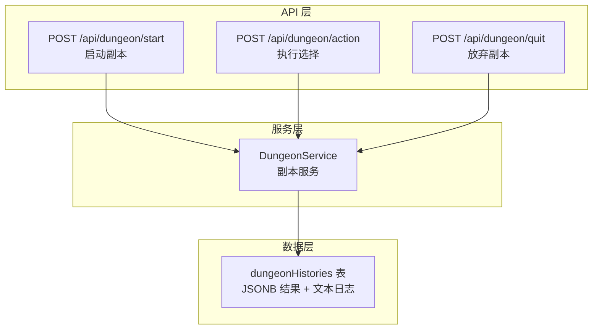
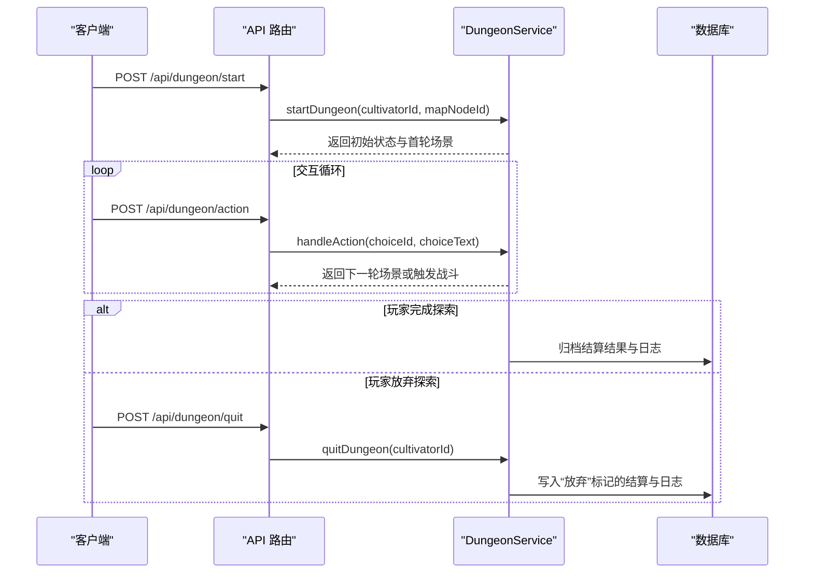
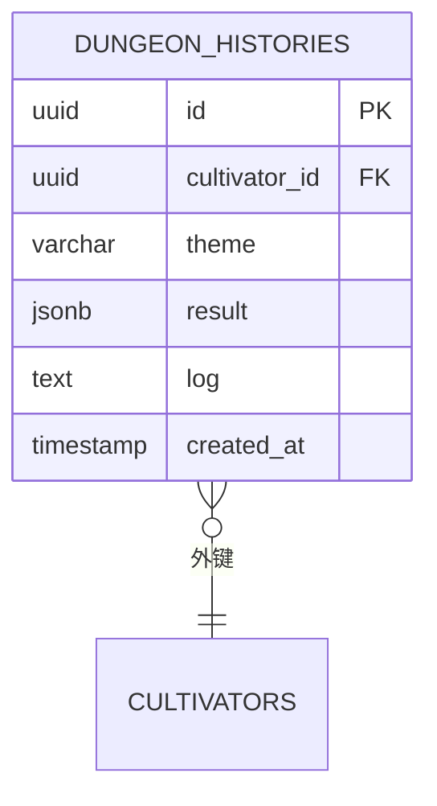
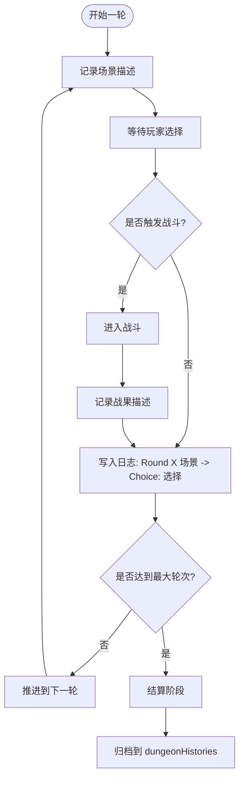
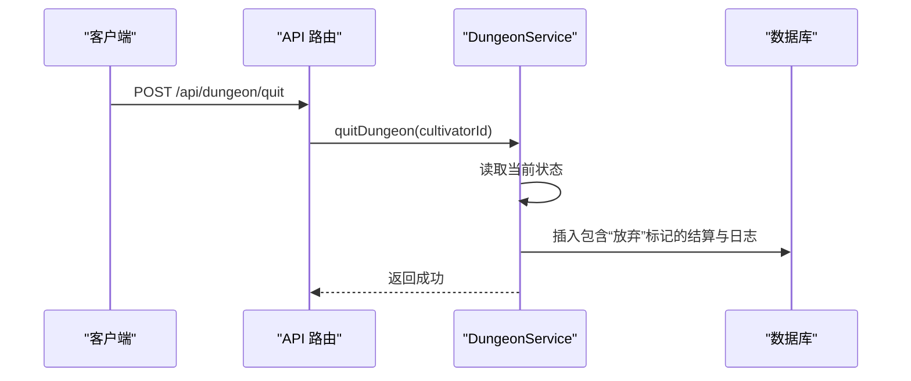
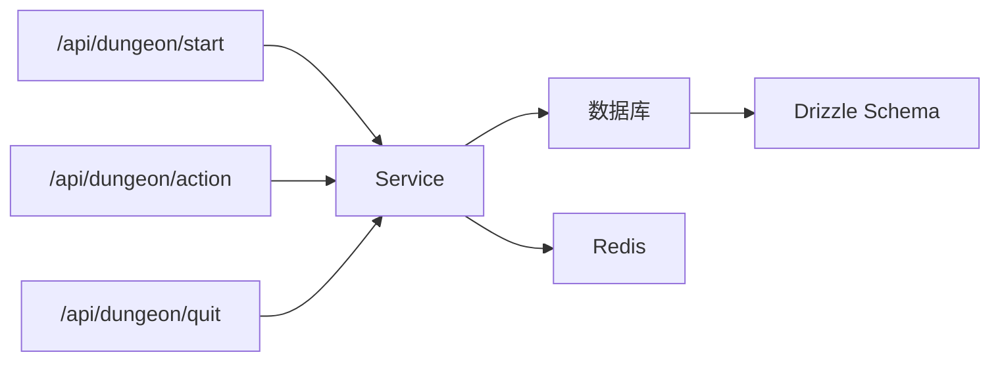

# 副本历史表 (dungeonHistories)

<cite>
**本文引用的文件列表**
- [schema.ts](file://lib/drizzle/schema.ts)
- [0017_good_jimmy_woo.sql](file://drizzle/0017_good_jimmy_woo.sql)
- [service_v2.ts](file://lib/dungeon/service_v2.ts)
- [types.ts](file://lib/dungeon/types.ts)
- [fuben.md](file://fuben.md)
- [start/route.ts](file://app/api/dungeon/start/route.ts)
- [action/route.ts](file://app/api/dungeon/action/route.ts)
- [quit/route.ts](file://app/api/dungeon/quit/route.ts)
</cite>

## 目录
1. [简介](#简介)
2. [项目结构](#项目结构)
3. [核心组件](#核心组件)
4. [架构概览](#架构概览)
5. [详细组件分析](#详细组件分析)
6. [依赖关系分析](#依赖关系分析)
7. [性能考量](#性能考量)
8. [故障排查指南](#故障排查指南)
9. [结论](#结论)
10. [附录](#附录)

## 简介
本文件围绕副本探索系统的核心持久化表 dungeonHistories 展开，系统性说明其设计目标、字段语义与使用方式，重点覆盖：
- result JSONB 字段的结构与语义，包括结局叙事 ending_narrative 与结算数据 settlement（奖励等级 reward_tier、潜在物品 potential_items、资源损失 resource_loss/losses 等）
- log 文本字段的格式规范与在副本回放中的关键作用
- theme 字段承载副本主题的意义与多样化体验支撑
- 结合 dungeonService.quitDungeon 方法，说明玩家放弃探索时的结算结果与日志生成策略
- 在成就追踪、玩家行为分析与游戏平衡性调整中的应用案例
- 基于创建时间与角色ID的查询性能优化建议

## 项目结构
dungeonHistories 表位于数据库层，配合副本服务层与 API 路由共同构成完整的副本生命周期管理：
- 数据库层：定义表结构与约束
- 服务层：封装副本状态、AI 推理、结算与归档
- API 层：对外暴露启动、行动、放弃等接口，驱动服务层执行

图表来源
- [start/route.ts](file://app/api/dungeon/start/route.ts#L1-L46)
- [action/route.ts](file://app/api/dungeon/action/route.ts#L1-L51)
- [quit/route.ts](file://app/api/dungeon/quit/route.ts#L1-L40)
- [service_v2.ts](file://lib/dungeon/service_v2.ts#L499-L541)
- [schema.ts](file://lib/drizzle/schema.ts#L281-L291)

章节来源
- [schema.ts](file://lib/drizzle/schema.ts#L281-L291)
- [0017_good_jimmy_woo.sql](file://drizzle/0017_good_jimmy_woo.sql#L1-L10)
- [service_v2.ts](file://lib/dungeon/service_v2.ts#L499-L541)
- [start/route.ts](file://app/api/dungeon/start/route.ts#L1-L46)
- [action/route.ts](file://app/api/dungeon/action/route.ts#L1-L51)
- [quit/route.ts](file://app/api/dungeon/quit/route.ts#L1-L40)

## 核心组件
- 表结构与字段
  - id：主键
  - cultivator_id：外键，指向角色表，级联删除
  - theme：副本主题字符串，用于标识本次探索的主题
  - result：JSONB，存储结算结果，包含 ending_narrative 与 settlement
  - log：文本，存储完整交互日志，格式为 "[Round X] 场景描述 -> Choice: 选择内容"
  - created_at：记录创建时间

- 结算结构（JSONB）
  - ending_narrative：结局叙事文本
  - settlement：结算对象
    - reward_tier：奖励等级（如 S/A/B/C/D 或“放弃”）
    - potential_items：潜在物品列表（如法宝、材料、消耗品等）
    - performance_tags：评价标签列表（如“收获颇丰”“险象环生”等）

- 日志格式
  - 每条日志记录包含轮次、场景描述、玩家选择与可选的战后结果
  - 放弃副本时追加标记，便于识别

- 主题字段
  - theme 用于标识副本主题，支持多样化的副本体验与内容扩展

章节来源
- [schema.ts](file://lib/drizzle/schema.ts#L281-L291)
- [0017_good_jimmy_woo.sql](file://drizzle/0017_good_jimmy_woo.sql#L1-L10)
- [types.ts](file://lib/dungeon/types.ts#L102-L116)
- [service_v2.ts](file://lib/dungeon/service_v2.ts#L499-L541)

## 架构概览
副本探索的生命周期由 API 路由触发，服务层负责状态管理与归档，最终将结果持久化至 dungeonHistories。

图表来源
- [start/route.ts](file://app/api/dungeon/start/route.ts#L1-L46)
- [action/route.ts](file://app/api/dungeon/action/route.ts#L1-L51)
- [quit/route.ts](file://app/api/dungeon/quit/route.ts#L1-L40)
- [service_v2.ts](file://lib/dungeon/service_v2.ts#L499-L541)

## 详细组件分析

### 结算 JSONB 字段结构（result）
- ending_narrative：由结算阶段生成的结局叙事文本，用于总结本次探索的最终结果与情感基调
- settlement：
  - reward_tier：奖励等级，用于衡量本次探索的总体收益与风险对冲
  - potential_items：可能获得的物品列表，作为奖励池抽样的依据
  - performance_tags：评价标签，用于快速标注本次探索的风格与结果特征

图表来源
- [schema.ts](file://lib/drizzle/schema.ts#L281-L291)
- [0017_good_jimmy_woo.sql](file://drizzle/0017_good_jimmy_woo.sql#L1-L10)

章节来源
- [types.ts](file://lib/dungeon/types.ts#L102-L116)
- [service_v2.ts](file://lib/dungeon/service_v2.ts#L326-L386)

### 日志文本字段（log）格式与回放
- 格式规范
  - 每条记录形如 "[Round X] 场景描述 -> Choice: 选择内容"
  - 每轮结束后将场景描述与玩家选择合并为一行
  - 战斗结束后将战果描述写入历史，随后推进到下一轮
- 回放能力
  - 完整的日志可用于回放副本过程，便于复盘与分析
  - 放弃副本时会在末尾追加标记，便于识别异常终止

图表来源
- [service_v2.ts](file://lib/dungeon/service_v2.ts#L136-L204)
- [service_v2.ts](file://lib/dungeon/service_v2.ts#L278-L324)
- [service_v2.ts](file://lib/dungeon/service_v2.ts#L499-L509)

章节来源
- [service_v2.ts](file://lib/dungeon/service_v2.ts#L136-L204)
- [service_v2.ts](file://lib/dungeon/service_v2.ts#L278-L324)
- [service_v2.ts](file://lib/dungeon/service_v2.ts#L499-L509)

### 主题字段（theme）设计意义
- 用于标识副本主题，支持多样化的副本体验与内容扩展
- 便于按主题聚合统计、分析不同主题的玩家偏好与难度分布

章节来源
- [schema.ts](file://lib/drizzle/schema.ts#L281-L291)
- [service_v2.ts](file://lib/dungeon/service_v2.ts#L102-L134)

### 放弃探索时的结算与日志生成
- 当玩家放弃探索时，服务层会：
  - 读取当前副本状态
  - 生成包含“放弃”标记的结算结果（reward_tier 为“放弃”，ending_narrative 为放弃叙事）
  - 将历史日志转换为文本并追加“放弃”标记
  - 归档到 dungeonHistories
- 该流程确保即使玩家中途放弃，也能保留完整的探索轨迹与标记

图表来源
- [quit/route.ts](file://app/api/dungeon/quit/route.ts#L1-L40)
- [service_v2.ts](file://lib/dungeon/service_v2.ts#L517-L541)

章节来源
- [service_v2.ts](file://lib/dungeon/service_v2.ts#L517-L541)

### 与副本流程的集成点
- 启动副本：API 路由调用服务层，生成首轮场景并写入 Redis
- 执行选择：服务层处理选项成本、推进轮次或触发战斗
- 战后回归：战斗回调将结果注入历史，继续推进
- 结算归档：达到最大轮次后生成结算，写入 dungeonHistories

章节来源
- [start/route.ts](file://app/api/dungeon/start/route.ts#L1-L46)
- [action/route.ts](file://app/api/dungeon/action/route.ts#L1-L51)
- [service_v2.ts](file://lib/dungeon/service_v2.ts#L136-L204)
- [service_v2.ts](file://lib/dungeon/service_v2.ts#L278-L324)
- [service_v2.ts](file://lib/dungeon/service_v2.ts#L499-L509)

## 依赖关系分析
- 表结构依赖
  - dungeonHistories 依赖角色表（外键约束）
  - JSONB 字段遵循类型定义（结算结构）
- 服务层依赖
  - 使用 Drizzle ORM 进行插入
  - 使用 Redis 存储活跃副本状态
- API 层依赖
  - 通过 Supabase 认证获取用户与角色
  - 调用服务层方法处理业务逻辑

图表来源
- [start/route.ts](file://app/api/dungeon/start/route.ts#L1-L46)
- [action/route.ts](file://app/api/dungeon/action/route.ts#L1-L51)
- [quit/route.ts](file://app/api/dungeon/quit/route.ts#L1-L40)
- [service_v2.ts](file://lib/dungeon/service_v2.ts#L499-L541)
- [schema.ts](file://lib/drizzle/schema.ts#L281-L291)

章节来源
- [schema.ts](file://lib/drizzle/schema.ts#L281-L291)
- [service_v2.ts](file://lib/dungeon/service_v2.ts#L499-L541)

## 性能考量
- 查询优化建议
  - 为 created_at 添加索引，便于按时间范围检索副本历史
  - 为 cultivator_id 添加索引，便于按角色快速筛选
  - 为 theme 添加索引，便于按主题聚合统计
- 日志体量控制
  - 日志为纯文本，建议在入库前对过长场景描述进行摘要，避免单条日志过大
- JSONB 查询
  - 若未来需要对 JSONB 字段进行复杂查询，建议在入库前规范化字段结构，减少动态键值带来的查询复杂度

章节来源
- [schema.ts](file://lib/drizzle/schema.ts#L281-L291)
- [0017_good_jimmy_woo.sql](file://drizzle/0017_good_jimmy_woo.sql#L1-L10)

## 故障排查指南
- 常见问题
  - 未找到活跃角色：API 层在获取活跃角色失败时会返回错误
  - 未找到副本状态：服务层读取 Redis 失败时会抛出异常
  - 放弃副本后仍显示进行中：确认 Redis 键是否清理，以及归档是否成功
- 排查步骤
  - 检查 API 层认证与角色绑定
  - 检查 Redis 中是否存在活跃副本键
  - 检查数据库中是否成功插入 dungeonHistories
  - 核对日志格式是否符合规范，必要时追加“放弃”标记

章节来源
- [start/route.ts](file://app/api/dungeon/start/route.ts#L1-L46)
- [action/route.ts](file://app/api/dungeon/action/route.ts#L1-L51)
- [quit/route.ts](file://app/api/dungeon/quit/route.ts#L1-L40)
- [service_v2.ts](file://lib/dungeon/service_v2.ts#L499-L541)

## 结论
dungeonHistories 表作为副本探索系统的持久化核心，通过 JSONB 字段承载丰富的结算信息，通过文本日志记录完整的交互过程，并以主题字段支持多样化的副本体验。结合服务层的归档与 API 层的统一入口，系统实现了从启动、交互、战斗到结算/放弃的完整闭环。合理的索引与日志摘要策略有助于提升查询性能与数据管理效率。

## 附录
- 设计背景与提示词工程
  - 副本系统强调“结构化输入、状态机循环、逻辑结算”，并通过提示词工程约束 LLM 的输出格式与逻辑
  - 结算阶段采用“等价交换”原则，确保玩家付出与回报的平衡

章节来源
- [fuben.md](file://fuben.md#L1-L200)