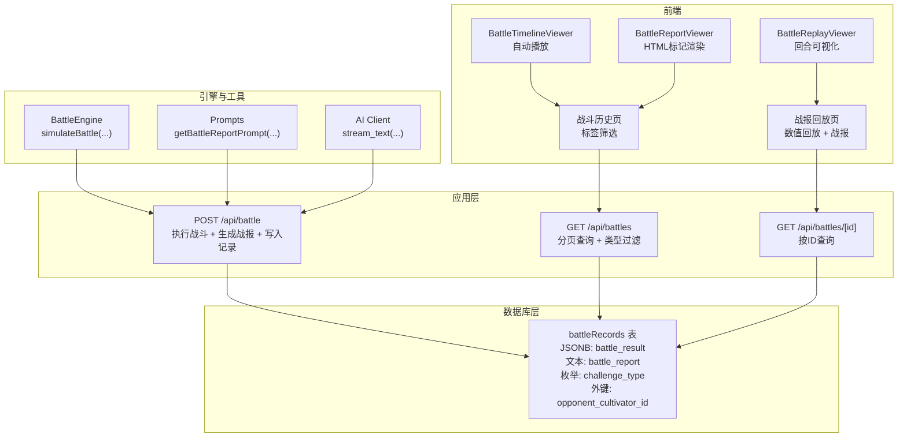
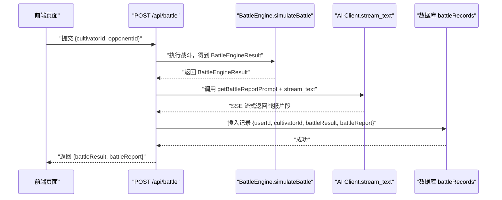
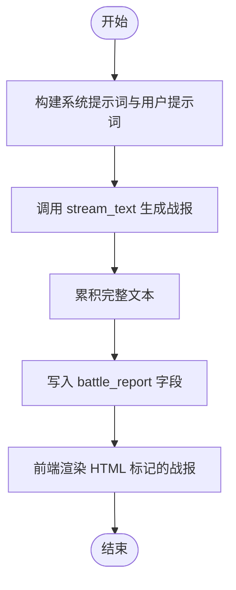
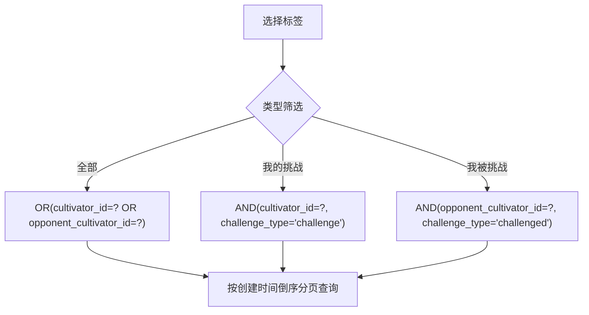
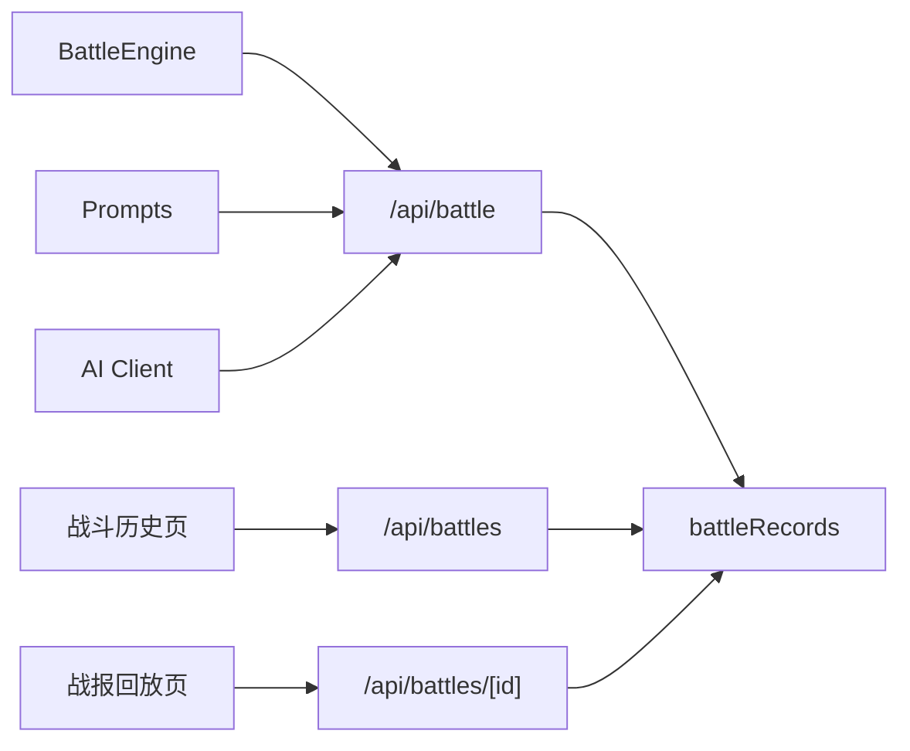

# 战斗记录表 (battleRecords)

<cite>
**本文引用的文件**
- [schema.ts](file://lib/drizzle/schema.ts)
- [0001_cynical_moonstone.sql](file://drizzle/0001_cynical_moonstone.sql)
- [0007_common_black_widow.sql](file://drizzle/0007_common_black_widow.sql)
- [battleEngine.ts](file://engine/battleEngine.ts)
- [prompts.ts](file://utils/prompts.ts)
- [aiClient.ts](file://utils/aiClient.ts)
- [app/api/battle/route.ts](file://app/api/battle/route.ts)
- [app/api/battles/route.ts](file://app/api/battles/route.ts)
- [app/api/battles/[id]/route.ts](file://app/api/battles/[id]/route.ts)
- [app/battle/history/page.tsx](file://app/battle/history/page.tsx)
- [app/battle/[id]/page.tsx](file://app/battle/[id]/page.tsx)
- [BattleReplayViewer.tsx](file://components/BattleReplayViewer.tsx)
- [BattleTimelineViewer.tsx](file://components/BattleTimelineViewer.tsx)
- [BattleReportViewer.tsx](file://components/BattleReportViewer.tsx)
</cite>

## 目录
1. [简介](#简介)
2. [项目结构](#项目结构)
3. [核心组件](#核心组件)
4. [架构总览](#架构总览)
5. [详细组件分析](#详细组件分析)
6. [依赖关系分析](#依赖关系分析)
7. [性能考虑](#性能考虑)
8. [故障排查指南](#故障排查指南)
9. [结论](#结论)
10. [附录](#附录)

## 简介
本文件围绕战斗记录表 battleRecords 展开，系统性说明其作为战斗系统核心数据存储的设计与实现。重点包括：
- battleResult JSONB 字段如何完整保存 BattleEngine 输出的战斗结果对象（回合序列、技能释放、状态变化等）。
- battleReport 文本字段在 AIGC 战报生成中的作用，以及如何通过 AI 模型将结构化战斗数据转化为生动的叙事文本。
- challengeType 字段的设计考量，区分 'challenge'（主动挑战）、'challenged'（被挑战）和 'normal'（普通战斗）三种类型的应用场景。
- opponentCultivatorId 外键在 PVP 战斗中的关联作用。
- 基于时间范围和角色 ID 的查询优化建议，以及该表在战报回放、成就系统和数据分析中的实际应用。

## 项目结构
battleRecords 表位于数据库层，通过 Drizzle ORM 在应用层进行访问；战斗引擎 BattleEngine 产生结构化结果，API 层负责调用引擎、生成战报并持久化记录；前端组件负责展示回放与战报。

图表来源
- [schema.ts](file://lib/drizzle/schema.ts#L240-L264)
- [0001_cynical_moonstone.sql](file://drizzle/0001_cynical_moonstone.sql#L1-L10)
- [0007_common_black_widow.sql](file://drizzle/0007_common_black_widow.sql#L1-L10)
- [battleEngine.ts](file://engine/battleEngine.ts#L674-L830)
- [prompts.ts](file://utils/prompts.ts#L63-L145)
- [aiClient.ts](file://utils/aiClient.ts#L63-L90)
- [app/api/battle/route.ts](file://app/api/battle/route.ts#L1-L124)
- [app/api/battles/route.ts](file://app/api/battles/route.ts#L1-L99)
- [app/api/battles/[id]/route.ts](file://app/api/battles/[id]/route.ts#L1-L46)
- [app/battle/history/page.tsx](file://app/battle/history/page.tsx#L36-L83)
- [app/battle/[id]/page.tsx](file://app/battle/[id]/page.tsx#L47-L102)
- [BattleReplayViewer.tsx](file://components/BattleReplayViewer.tsx#L1-L51)
- [BattleTimelineViewer.tsx](file://components/BattleTimelineViewer.tsx#L1-L53)
- [BattleReportViewer.tsx](file://components/BattleReportViewer.tsx#L34-L67)

章节来源
- [schema.ts](file://lib/drizzle/schema.ts#L240-L264)
- [0001_cynical_moonstone.sql](file://drizzle/0001_cynical_moonstone.sql#L1-L10)
- [0007_common_black_widow.sql](file://drizzle/0007_common_black_widow.sql#L1-L10)

## 核心组件
- 表结构与字段
  - 主键 id、用户关联 user_id、角色关联 cultivator_id。
  - 挑战相关字段 challenge_type（'challenge' | 'challenged' | 'normal'）、opponent_cultivator_id（PVP 对手角色ID）。
  - 战斗结果 JSONB battle_result（完整 BattleEngineResult 或其扩展）。
  - AIGC 战报文本 battle_report。
  - 时间戳 created_at。
- 数据来源与去向
  - BattleEngine 生成 BattleEngineResult，API 层将其写入 battle_result，并通过 AI 生成 battle_report。
  - 前端通过 /api/battles 和 /api/battles/[id] 查询记录，组件渲染回放与战报。

章节来源
- [schema.ts](file://lib/drizzle/schema.ts#L240-L264)
- [battleEngine.ts](file://engine/battleEngine.ts#L35-L44)
- [app/api/battle/route.ts](file://app/api/battle/route.ts#L1-L124)

## 架构总览
下面的时序图展示了从战斗执行到记录落库与战报生成的关键流程。

图表来源
- [app/api/battle/route.ts](file://app/api/battle/route.ts#L1-L124)
- [battleEngine.ts](file://engine/battleEngine.ts#L674-L830)
- [prompts.ts](file://utils/prompts.ts#L63-L145)
- [aiClient.ts](file://utils/aiClient.ts#L63-L90)
- [schema.ts](file://lib/drizzle/schema.ts#L240-L264)

## 详细组件分析

### battleResult JSONB 字段结构与语义
- 字段定位
  - battle_result 为 JSONB 类型，用于完整保存 BattleEngineResult 对象，确保回放与分析时具备完整的回合快照、胜负信息、日志与时间线。
- 关键字段映射
  - winner、loser：对战双方的获胜者与失败者标识。
  - log：每回合事件日志字符串数组，便于生成战报与审计。
  - turns：总回合数。
  - playerHp、opponentHp：最终气血值。
  - timeline：回合快照数组，每个元素包含玩家与对手的 HP/MP/状态，用于数值回放。
- 设计优势
  - 以结构化 JSONB 存储，避免冗余列与重复索引，同时保留强语义与可扩展性。
  - timeline 使前端可做自动播放与逐回合可视化，提升体验。
- 与 BattleEngine 的对应关系
  - BattleEngineResult 接口定义了上述字段，API 层直接将结果写入数据库，保证一致性。

章节来源
- [battleEngine.ts](file://engine/battleEngine.ts#L35-L44)
- [app/api/battle/route.ts](file://app/api/battle/route.ts#L1-L124)

### battleReport 文本字段与 AIGC 战报生成
- 字段定位
  - battle_report 为 text 类型，存储由 AI 生成的完整战报文本，支持 HTML 标记（用于前端高亮渲染）。
- 生成流程
  - API 层调用 getBattleReportPrompt 生成系统提示词与用户提示词，随后通过 stream_text 以 SSE 流式输出。
  - API 层在流式过程中累积完整文本，结束后将 battleReport 写入数据库。
- 前端展示
  - BattleReportViewer 将文本按行渲染，支持末行闪烁指示“正在生成”。
  - HTML 标记用于高亮回合数、人名、技能名、伤害/治疗数值、效果描述与胜负结果，增强可读性。

图表来源
- [prompts.ts](file://utils/prompts.ts#L63-L145)
- [aiClient.ts](file://utils/aiClient.ts#L63-L90)
- [app/api/battle/route.ts](file://app/api/battle/route.ts#L1-L124)
- [BattleReportViewer.tsx](file://components/BattleReportViewer.tsx#L34-L67)

章节来源
- [prompts.ts](file://utils/prompts.ts#L63-L145)
- [aiClient.ts](file://utils/aiClient.ts#L63-L90)
- [app/api/battle/route.ts](file://app/api/battle/route.ts#L1-L124)
- [BattleReportViewer.tsx](file://components/BattleReportViewer.tsx#L34-L67)

### challengeType 字段设计与应用场景
- 字段定义
  - challenge_type 为 varchar(20)，取值 'challenge' | 'challenged' | 'normal'。
- 应用场景
  - 'challenge'：玩家主动发起挑战，记录中以 cultivator_id 作为挑战者。
  - 'challenged'：玩家被他人挑战，记录中以 opponent_cultivator_id 作为挑战者，当前角色为防守者。
  - 'normal'：非竞技性质的普通战斗（如副本或遭遇战），默认归类为普通。
- 前端筛选
  - 战斗历史页提供“全部/我的挑战/我被挑战”标签，后端据此构造 where 条件并排序分页返回。

图表来源
- [app/api/battles/route.ts](file://app/api/battles/route.ts#L41-L74)
- [app/battle/history/page.tsx](file://app/battle/history/page.tsx#L36-L83)
- [schema.ts](file://lib/drizzle/schema.ts#L240-L264)

章节来源
- [schema.ts](file://lib/drizzle/schema.ts#L240-L264)
- [app/api/battles/route.ts](file://app/api/battles/route.ts#L41-L74)
- [app/battle/history/page.tsx](file://app/battle/history/page.tsx#L36-L83)

### opponentCultivatorId 外键在 PVP 战斗中的作用
- 外键约束
  - opponent_cultivator_id 引用 cultivators.id，onDelete 设置为 set null，避免级联删除影响历史记录完整性。
- PVP 关联
  - 当 challenge_type 为 'challenge' 时，cultivator_id 为挑战者，opponent_cultivator_id 为被挑战者。
  - 当 challenge_type 为 'challenged' 时，opponent_cultivator_id 为挑战者，cultivator_id 为被挑战者。
- 前端回放
  - 战报回放页根据记录中的 winner/loser 与 timeline 渲染数值回放与 HTML 战报。

章节来源
- [schema.ts](file://lib/drizzle/schema.ts#L240-L264)
- [app/battle/[id]/page.tsx](file://app/battle/[id]/page.tsx#L47-L102)
- [BattleReplayViewer.tsx](file://components/BattleReplayViewer.tsx#L1-L51)

### 数值回放与时间线可视化
- 回放数据来源
  - timeline：每回合快照包含玩家与对手的 HP/MP/状态列表，用于回放组件渲染。
- 组件职责
  - BattleTimelineViewer：自动播放、逐回合切换，适合快速浏览。
  - BattleReplayViewer：支持手动切换回合，展示 HP/MP 百分比与状态列表，适合深度分析。
- 与 battleReport 的关系
  - 若 timeline 为空，回放组件降级为仅展示 battle_report 文本。

章节来源
- [battleEngine.ts](file://engine/battleEngine.ts#L23-L34)
- [BattleTimelineViewer.tsx](file://components/BattleTimelineViewer.tsx#L1-L53)
- [BattleReplayViewer.tsx](file://components/BattleReplayViewer.tsx#L1-L51)

## 依赖关系分析
- 表结构依赖
  - battleRecords 依赖 cultivators 表（外键：cultivator_id、opponent_cultivator_id）。
  - 历史记录迁移脚本展示了表演进过程（新增 challenge_type 与 opponent_cultivator_id）。
- API 依赖
  - /api/battle 依赖 BattleEngine、Prompts、AI Client。
  - /api/battles 依赖 Drizzle ORM 的 where/order/limit/offset 实现分页与筛选。
- 前端依赖
  - 战斗历史页与战报回放页分别消费列表与详情 API，组件渲染回放与战报。

图表来源
- [battleEngine.ts](file://engine/battleEngine.ts#L674-L830)
- [prompts.ts](file://utils/prompts.ts#L63-L145)
- [aiClient.ts](file://utils/aiClient.ts#L63-L90)
- [app/api/battle/route.ts](file://app/api/battle/route.ts#L1-L124)
- [app/api/battles/route.ts](file://app/api/battles/route.ts#L1-L99)
- [app/api/battles/[id]/route.ts](file://app/api/battles/[id]/route.ts#L1-L46)

章节来源
- [0001_cynical_moonstone.sql](file://drizzle/0001_cynical_moonstone.sql#L1-L10)
- [0007_common_black_widow.sql](file://drizzle/0007_common_black_widow.sql#L1-L10)
- [schema.ts](file://lib/drizzle/schema.ts#L240-L264)

## 性能考虑
- 查询优化建议
  - 为高频过滤字段建立复合索引（如：(challenge_type, cultivator_id)、(opponent_cultivator_id, challenge_type)），减少全表扫描。
  - 分页参数限制：pageSize 上限建议 50，避免过大分页导致 IO 压力。
  - 排序与过滤：按 created_at 倒序分页，避免额外排序成本。
  - 精简返回：列表页仅返回必要字段（如 id、createdAt、winner、loser、turns、challengeType、opponentCultivatorId），避免传输大体量 JSONB。
- 存储与 IO
  - battle_result 为 JSONB，建议仅在需要时解码；列表页可避免反序列化整个 JSONB。
  - battle_report 为文本，适合全文检索或按需展示。
- 并发与可靠性
  - 战报生成采用流式输出，写入记录失败不影响前端体验（仅记录日志）。
  - 副本/单人副本历史记录表（dungeon_histories）与 battleRecords 结构类似，可借鉴其索引与分页策略。

章节来源
- [app/api/battles/route.ts](file://app/api/battles/route.ts#L1-L99)

## 故障排查指南
- 未授权访问
  - API 层通过 Supabase 验证用户身份，未登录返回 401。
- 记录不存在
  - 详情接口按 id 查询，不存在返回错误。
- 写入失败
  - 战报生成后写入 battleRecords 失败会记录日志，不影响前端流式展示。
- 前端渲染异常
  - HTML 标记渲染需注意 XSS，组件已使用安全渲染方式；若出现样式错乱，检查标签闭合与空行处理。

章节来源
- [app/api/battles/[id]/route.ts](file://app/api/battles/[id]/route.ts#L1-L46)
- [app/api/battle/route.ts](file://app/api/battle/route.ts#L1-L124)
- [BattleReportViewer.tsx](file://components/BattleReportViewer.tsx#L34-L67)

## 结论
battleRecords 通过 JSONB 存储 BattleEngine 的完整结果，结合 AIGC 战报生成，实现了“可回放、可分享、可分析”的战斗数据闭环。challengeType 与 opponentCultivatorId 的引入，使得 PVP 场景下的记录具备明确的挑战关系与可追溯性。配合合理的查询与索引策略，可在高并发场景下保持良好的响应与稳定性。

## 附录
- 相关文件路径参考
  - 表定义与迁移：[schema.ts](file://lib/drizzle/schema.ts#L240-L264)、[0001_cynical_moonstone.sql](file://drizzle/0001_cynical_moonstone.sql#L1-L10)、[0007_common_black_widow.sql](file://drizzle/0007_common_black_widow.sql#L1-L10)
  - 战斗引擎与结果结构：[battleEngine.ts](file://engine/battleEngine.ts#L35-L44)
  - 战报生成与流式输出：[prompts.ts](file://utils/prompts.ts#L63-L145)、[aiClient.ts](file://utils/aiClient.ts#L63-L90)、[/api/battle/route.ts](file://app/api/battle/route.ts#L1-L124)
  - 列表与详情 API：[/api/battles/route.ts](file://app/api/battles/route.ts#L1-L99)、[/api/battles/[id]/route.ts](file://app/api/battles/[id]/route.ts#L1-L46)
  - 前端组件：[BattleReplayViewer.tsx](file://components/BattleReplayViewer.tsx#L1-L51)、[BattleTimelineViewer.tsx](file://components/BattleTimelineViewer.tsx#L1-L53)、[BattleReportViewer.tsx](file://components/BattleReportViewer.tsx#L34-L67)