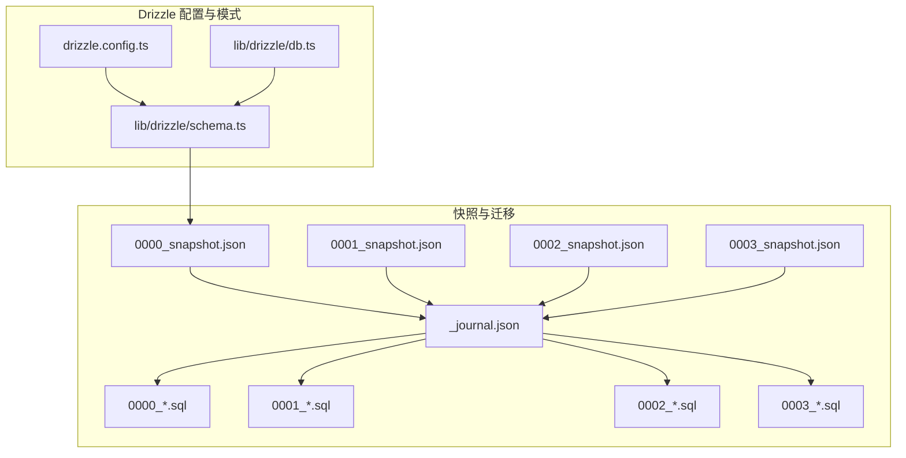
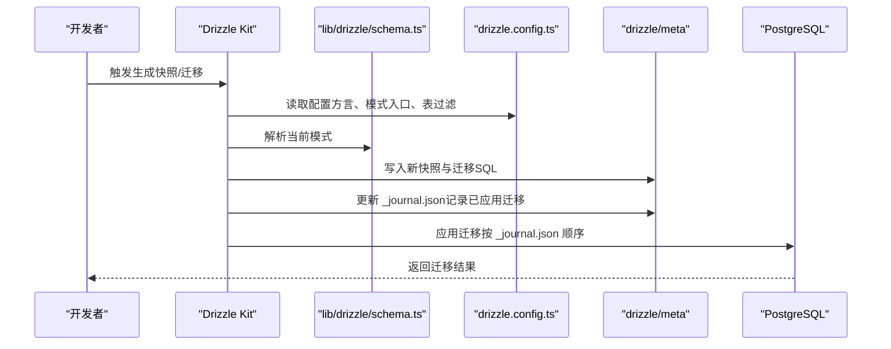
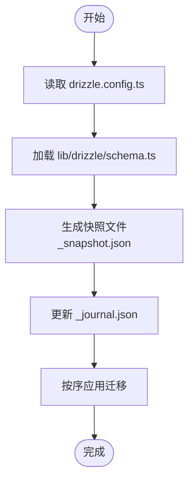
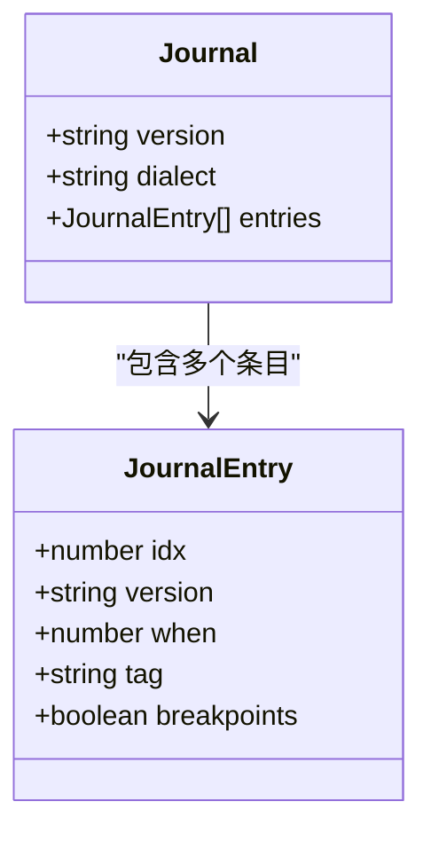
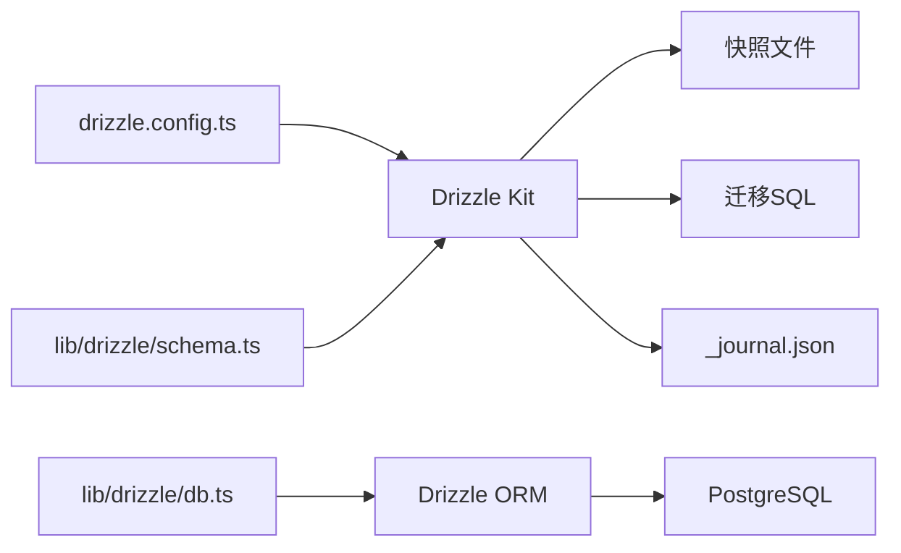
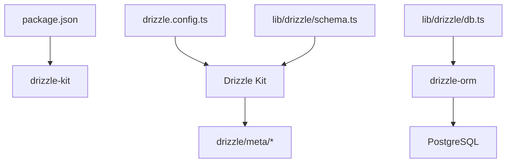

# 数据库模式快照

<cite>
**本文引用的文件**
- [drizzle.config.ts](file://drizzle.config.ts)
- [lib/drizzle/schema.ts](file://lib/drizzle/schema.ts)
- [lib/drizzle/db.ts](file://lib/drizzle/db.ts)
- [drizzle/meta/_journal.json](file://drizzle/meta/_journal.json)
- [drizzle/meta/0000_snapshot.json](file://drizzle/meta/0000_snapshot.json)
- [drizzle/meta/0001_snapshot.json](file://drizzle/meta/0001_snapshot.json)
- [drizzle/meta/0002_snapshot.json](file://drizzle/meta/0002_snapshot.json)
- [drizzle/meta/0003_snapshot.json](file://drizzle/meta/0003_snapshot.json)
- [package.json](file://package.json)
</cite>

## 目录
1. [引言](#引言)
2. [项目结构](#项目结构)
3. [核心组件](#核心组件)
4. [架构总览](#架构总览)
5. [详细组件分析](#详细组件分析)
6. [依赖关系分析](#依赖关系分析)
7. [性能考量](#性能考量)
8. [故障排查指南](#故障排查指南)
9. [结论](#结论)
10. [附录](#附录)

## 引言
本文件聚焦于数据库模式快照与迁移流程，系统性解释 drizzle/meta 目录下的每个_snapshot.json 文件的作用，以及它们如何与 Drizzle Kit 和 Drizzle ORM 协同工作，实现模式的版本化管理、差异比对与迁移执行。同时阐明 _journal.json 在迁移流程中的角色，包括迁移状态跟踪与执行记录；并给出基于仓库现状的快照查看、解析与回滚思路，以及触发快照生成的常见时机与自动化建议。

## 项目结构
- drizzle.config.ts：定义 Drizzle Kit 的方言、模式入口、表过滤规则与数据库凭据，是快照与迁移生成的配置源。
- lib/drizzle/schema.ts：定义应用使用的数据库表结构（如 wanjiedaoyou_*），为快照生成提供“当前模式”依据。
- lib/drizzle/db.ts：通过 drizzle-orm/postgres-js 初始化数据库连接，供业务层使用。
- drizzle/meta/_journal.json：记录已应用迁移的元数据（索引、标签、时间戳、断点标记等）。
- drizzle/meta/0000_snapshot.json 等：每个版本的完整模式快照，记录该版本的表、列、约束、策略等细节。
- package.json：包含 drizzle-kit 开发依赖，表明项目使用 Drizzle Kit 进行迁移与快照管理。

图表来源
- [drizzle.config.ts](file://drizzle.config.ts#L1-L10)
- [lib/drizzle/schema.ts](file://lib/drizzle/schema.ts#L1-L292)
- [lib/drizzle/db.ts](file://lib/drizzle/db.ts#L1-L13)
- [drizzle/meta/_journal.json](file://drizzle/meta/_journal.json#L1-L132)
- [drizzle/meta/0000_snapshot.json](file://drizzle/meta/0000_snapshot.json#L1-L730)
- [drizzle/meta/0001_snapshot.json](file://drizzle/meta/0001_snapshot.json#L1-L800)
- [drizzle/meta/0002_snapshot.json](file://drizzle/meta/0002_snapshot.json#L1-L866)
- [drizzle/meta/0003_snapshot.json](file://drizzle/meta/0003_snapshot.json#L1-L872)

章节来源
- [drizzle.config.ts](file://drizzle.config.ts#L1-L10)
- [lib/drizzle/schema.ts](file://lib/drizzle/schema.ts#L1-L292)
- [lib/drizzle/db.ts](file://lib/drizzle/db.ts#L1-L13)
- [drizzle/meta/_journal.json](file://drizzle/meta/_journal.json#L1-L132)
- [drizzle/meta/0000_snapshot.json](file://drizzle/meta/0000_snapshot.json#L1-L730)
- [drizzle/meta/0001_snapshot.json](file://drizzle/meta/0001_snapshot.json#L1-L800)
- [drizzle/meta/0002_snapshot.json](file://drizzle/meta/0002_snapshot.json#L1-L866)
- [drizzle/meta/0003_snapshot.json](file://drizzle/meta/0003_snapshot.json#L1-L872)
- [package.json](file://package.json#L1-L54)

## 核心组件
- 快照文件（_snapshot.json）：记录某版本的完整数据库模式状态，包含表、列、索引、外键、唯一约束、检查约束、策略、视图、枚举等。每个快照都包含 id、prevId、version、dialect 等元信息，prevId 指向前一个快照，形成线性演进链。
- 迁移日志（_journal.json）：记录已应用迁移的条目，包含 idx、version、when、tag、breakpoints 等字段，用于追踪迁移执行顺序与状态。
- Drizzle 配置（drizzle.config.ts）：指定方言、模式入口、表过滤规则与数据库凭据，是生成快照与迁移的基础。
- 模式定义（lib/drizzle/schema.ts）：以 TypeScript 表达数据库结构，作为“当前模式”的权威来源。
- 数据库连接（lib/drizzle/db.ts）：通过 drizzle-orm/postgres-js 初始化连接，供业务层使用。

章节来源
- [drizzle.config.ts](file://drizzle.config.ts#L1-L10)
- [lib/drizzle/schema.ts](file://lib/drizzle/schema.ts#L1-L292)
- [lib/drizzle/db.ts](file://lib/drizzle/db.ts#L1-L13)
- [drizzle/meta/_journal.json](file://drizzle/meta/_journal.json#L1-L132)
- [drizzle/meta/0000_snapshot.json](file://drizzle/meta/0000_snapshot.json#L1-L730)

## 架构总览
Drizzle Kit 以 lib/drizzle/schema.ts 为输入，结合 drizzle.config.ts 的配置，生成 drizzle/meta 下的快照文件与迁移 SQL。_journal.json 记录已应用迁移，驱动迁移执行与状态校验。业务层通过 lib/drizzle/db.ts 使用 drizzle-orm 连接数据库。

图表来源
- [drizzle.config.ts](file://drizzle.config.ts#L1-L10)
- [lib/drizzle/schema.ts](file://lib/drizzle/schema.ts#L1-L292)
- [drizzle/meta/_journal.json](file://drizzle/meta/_journal.json#L1-L132)
- [drizzle/meta/0000_snapshot.json](file://drizzle/meta/0000_snapshot.json#L1-L730)
- [drizzle/meta/0001_snapshot.json](file://drizzle/meta/0001_snapshot.json#L1-L800)

## 详细组件分析

### 快照文件（_snapshot.json）的作用与结构
- 版本化模式快照：每个快照记录某一时刻的完整数据库模式，包含 tables、enums、schemas、sequences、roles、policies、views、_meta 等字段，便于精确还原或对比。
- 线性演进链：每个快照包含 id、prevId、version、dialect 等元信息，prevId 指向前一快照，形成版本链路。
- 与模式定义的关系：快照由 Drizzle Kit 基于 lib/drizzle/schema.ts 生成，确保快照与当前模式一致。

图表来源
- [drizzle.config.ts](file://drizzle.config.ts#L1-L10)
- [lib/drizzle/schema.ts](file://lib/drizzle/schema.ts#L1-L292)
- [drizzle/meta/_journal.json](file://drizzle/meta/_journal.json#L1-L132)
- [drizzle/meta/0000_snapshot.json](file://drizzle/meta/0000_snapshot.json#L1-L730)

章节来源
- [drizzle/meta/0000_snapshot.json](file://drizzle/meta/0000_snapshot.json#L1-L730)
- [drizzle/meta/0001_snapshot.json](file://drizzle/meta/0001_snapshot.json#L1-L800)
- [drizzle/meta/0002_snapshot.json](file://drizzle/meta/0002_snapshot.json#L1-L866)
- [drizzle/meta/0003_snapshot.json](file://drizzle/meta/0003_snapshot.json#L1-L872)

### 迁移日志（_journal.json）的角色与内容
- 记录已应用迁移：包含 idx、version、when、tag、breakpoints 等字段，idx 为迁移顺序索引，tag 为迁移文件名前缀，breakpoints 标记是否为断点迁移。
- 迁移状态跟踪：通过 entries 数组维护迁移执行顺序与状态，便于回滚、重放与一致性校验。
- 与快照的协作：Drizzle Kit 会根据 _journal.json 的记录决定是否需要生成新的快照与迁移 SQL。

图表来源
- [drizzle/meta/_journal.json](file://drizzle/meta/_journal.json#L1-L132)

章节来源
- [drizzle/meta/_journal.json](file://drizzle/meta/_journal.json#L1-L132)

### Drizzle ORM 与 Drizzle Kit 的协同
- Drizzle ORM：通过 lib/drizzle/db.ts 初始化连接，供业务层查询与事务使用。
- Drizzle Kit：通过 drizzle.config.ts 与 lib/drizzle/schema.ts 生成快照与迁移 SQL，并维护 _journal.json。
- 配置与模式：drizzle.config.ts 指定方言、模式入口与表过滤规则，lib/drizzle/schema.ts 定义表结构，二者共同决定快照与迁移内容。

图表来源
- [drizzle.config.ts](file://drizzle.config.ts#L1-L10)
- [lib/drizzle/schema.ts](file://lib/drizzle/schema.ts#L1-L292)
- [lib/drizzle/db.ts](file://lib/drizzle/db.ts#L1-L13)
- [drizzle/meta/_journal.json](file://drizzle/meta/_journal.json#L1-L132)
- [drizzle/meta/0000_snapshot.json](file://drizzle/meta/0000_snapshot.json#L1-L730)

章节来源
- [drizzle.config.ts](file://drizzle.config.ts#L1-L10)
- [lib/drizzle/schema.ts](file://lib/drizzle/schema.ts#L1-L292)
- [lib/drizzle/db.ts](file://lib/drizzle/db.ts#L1-L13)

### 快照与迁移的差异比对
- 当前模式与目标快照比对：通过比较 lib/drizzle/schema.ts 与某个快照文件，可识别新增、修改、删除的表与列，从而生成差异化的迁移 SQL。
- 快照链路比对：prevId 指向的前一快照可用于两两比对，定位具体变更范围与影响面。

章节来源
- [lib/drizzle/schema.ts](file://lib/drizzle/schema.ts#L1-L292)
- [drizzle/meta/0000_snapshot.json](file://drizzle/meta/0000_snapshot.json#L1-L730)
- [drizzle/meta/0001_snapshot.json](file://drizzle/meta/0001_snapshot.json#L1-L800)

### 回滚、开发环境同步与团队协作
- 回滚：基于 _journal.json 的 entries 顺序，可逆向执行迁移或切换到指定快照版本。若需精确回滚，应结合 prevId 链路选择目标快照。
- 开发环境同步：团队成员可通过共享 drizzle/meta 下的快照与 _journal.json，确保本地与远端数据库结构一致。
- 团队协作：约定快照命名与提交规范，配合 CI/CD 在部署前自动应用迁移，减少人为错误。

章节来源
- [drizzle/meta/_journal.json](file://drizzle/meta/_journal.json#L1-L132)
- [drizzle/meta/0000_snapshot.json](file://drizzle/meta/0000_snapshot.json#L1-L730)
- [drizzle/meta/0001_snapshot.json](file://drizzle/meta/0001_snapshot.json#L1-L800)

### 查看与解析快照的工具命令示例
以下命令基于仓库中 drizzle-kit 的存在，用于生成快照与迁移文件。请在项目根目录执行：
- 生成快照与迁移文件：使用 Drizzle Kit 的命令生成新的快照与迁移 SQL，随后由 _journal.json 记录已应用迁移。
- 比对当前模式与最新快照：通过 Drizzle Kit 的差异比对能力，生成差异迁移 SQL。
- 查看迁移状态：读取 _journal.json 的 entries，确认已应用迁移的顺序与标签。

注意：以上命令来自 Drizzle Kit 的通用能力，具体命令名称以实际安装版本为准。项目中已包含 drizzle-kit 开发依赖，可据此运行相应命令。

章节来源
- [package.json](file://package.json#L1-L54)

### 快照生成的触发时机与自动化流程
- 触发时机：当 lib/drizzle/schema.ts 发生结构性变更（新增/修改/删除表或列）时，应重新生成快照与迁移 SQL，并更新 _journal.json。
- 自动化流程：可在 CI/CD 中加入步骤，执行 Drizzle Kit 的生成与应用命令，确保每次变更都能生成对应快照与迁移，并在测试/预生产环境自动应用。

章节来源
- [drizzle.config.ts](file://drizzle.config.ts#L1-L10)
- [lib/drizzle/schema.ts](file://lib/drizzle/schema.ts#L1-L292)
- [drizzle/meta/_journal.json](file://drizzle/meta/_journal.json#L1-L132)
- [package.json](file://package.json#L1-L54)

## 依赖关系分析
- drizzle.config.ts 依赖环境变量 DATABASE_URL 提供数据库连接字符串。
- lib/drizzle/schema.ts 是快照与迁移生成的输入源。
- lib/drizzle/db.ts 依赖 lib/drizzle/schema.ts 与数据库连接。
- drizzle/meta 下的快照与 _journal.json 由 Drizzle Kit 维护，驱动迁移执行。

图表来源
- [package.json](file://package.json#L1-L54)
- [drizzle.config.ts](file://drizzle.config.ts#L1-L10)
- [lib/drizzle/schema.ts](file://lib/drizzle/schema.ts#L1-L292)
- [lib/drizzle/db.ts](file://lib/drizzle/db.ts#L1-L13)
- [drizzle/meta/_journal.json](file://drizzle/meta/_journal.json#L1-L132)

章节来源
- [package.json](file://package.json#L1-L54)
- [drizzle.config.ts](file://drizzle.config.ts#L1-L10)
- [lib/drizzle/schema.ts](file://lib/drizzle/schema.ts#L1-L292)
- [lib/drizzle/db.ts](file://lib/drizzle/db.ts#L1-L13)

## 性能考量
- 快照体积：随着表与列增多，快照文件会增大。建议定期清理不再使用的旧快照，保留必要的版本链路。
- 迁移执行：_journal.json 记录的迁移顺序会影响执行性能。尽量避免大规模并发迁移，分批有序执行。
- 连接池与预处理：lib/drizzle/db.ts 已禁用预取以适配事务池模式，确保事务稳定性。

章节来源
- [lib/drizzle/db.ts](file://lib/drizzle/db.ts#L1-L13)

## 故障排查指南
- 快照不一致：若发现快照与当前模式不一致，应重新生成快照并更新 _journal.json。
- 迁移失败：检查 _journal.json 中最近一次条目的 when、tag 是否与预期一致，必要时回滚到上一个稳定快照。
- 连接问题：确认 DATABASE_URL 环境变量正确，lib/drizzle/db.ts 的连接初始化逻辑正常。

章节来源
- [drizzle/meta/_journal.json](file://drizzle/meta/_journal.json#L1-L132)
- [lib/drizzle/db.ts](file://lib/drizzle/db.ts#L1-L13)

## 结论
本项目通过 drizzle/config.ts 与 lib/drizzle/schema.ts 明确了数据库模式的权威来源，借助 drizzle/meta 下的快照与 _journal.json 实现了模式的版本化管理与迁移执行跟踪。快照文件记录了完整模式状态，_journal.json 记录了迁移执行顺序与状态，二者协同保证了开发、测试与生产环境的一致性。建议在团队内建立快照与迁移的规范化流程，并在 CI/CD 中自动化执行，以提升协作效率与发布质量。

## 附录
- 快照文件路径示例：drizzle/meta/0000_snapshot.json、drizzle/meta/0001_snapshot.json、drizzle/meta/0002_snapshot.json、drizzle/meta/0003_snapshot.json
- 日志文件路径示例：drizzle/meta/_journal.json
- 配置文件路径示例：drizzle.config.ts
- 模式定义路径示例：lib/drizzle/schema.ts
- 数据库连接路径示例：lib/drizzle/db.ts
- 依赖声明路径示例：package.json