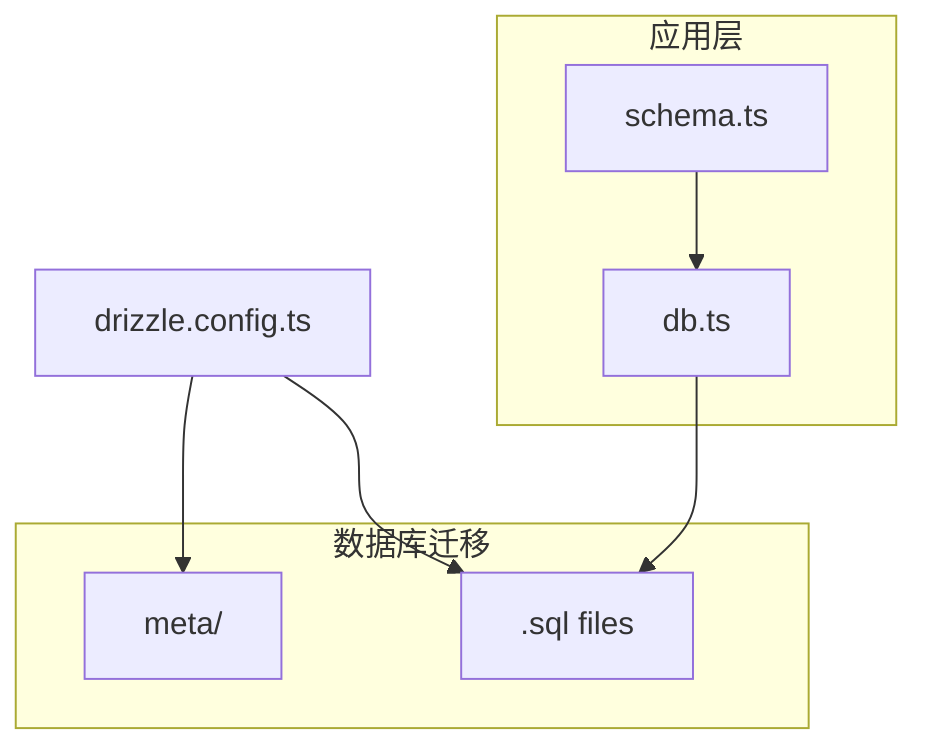
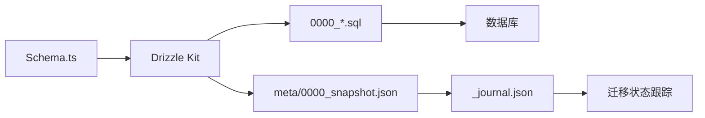
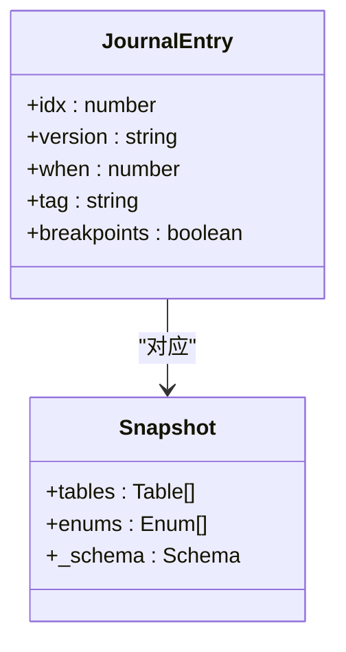
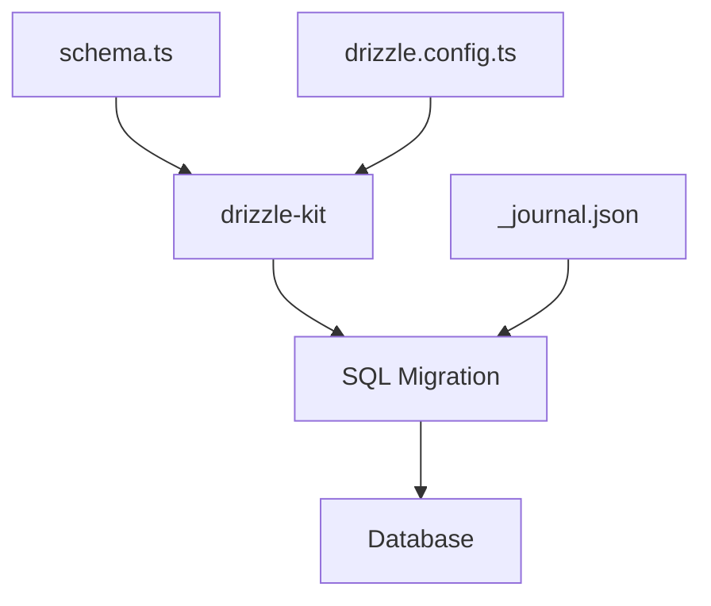

# 数据库模式演进

<cite>
**本文档中引用的文件**  
- [drizzle.config.ts](file://drizzle.config.ts)
- [lib/drizzle/db.ts](file://lib/drizzle/db.ts)
- [lib/drizzle/schema.ts](file://lib/drizzle/schema.ts)
- [drizzle/meta/_journal.json](file://drizzle/meta/_journal.json)
- [drizzle/0000_equal_the_fury.sql](file://drizzle/0000_equal_the_fury.sql)
- [drizzle/0001_cynical_moonstone.sql](file://drizzle/0001_cynical_moonstone.sql)
- [drizzle/0002_strong_proemial_gods.sql](file://drizzle/0002_strong_proemial_gods.sql)
- [drizzle/0003_careless_tigra.sql](file://drizzle/0003_careless_tigra.sql)
- [drizzle/0004_redundant_exiles.sql](file://drizzle/0004_redundant_exiles.sql)
- [drizzle/0005_crazy_joseph.sql](file://drizzle/0005_crazy_joseph.sql)
- [drizzle/0006_nice_wong.sql](file://drizzle/0006_nice_wong.sql)
- [drizzle/0007_common_black_widow.sql](file://drizzle/0007_common_black_widow.sql)
- [drizzle/0008_acoustic_nova.sql](file://drizzle/0008_acoustic_nova.sql)
- [drizzle/0009_zippy_sharon_ventura.sql](file://drizzle/0009_zippy_sharon_ventura.sql)
- [drizzle/0010_previous_silver_fox.sql](file://drizzle/0010_previous_silver_fox.sql)
- [drizzle/0011_strong_the_spike.sql](file://drizzle/0011_strong_the_spike.sql)
- [drizzle/0012_awesome_micromacro.sql](file://drizzle/0012_awesome_micromacro.sql)
- [drizzle/0013_brown_nico_minoru.sql](file://drizzle/0013_brown_nico_minoru.sql)
- [drizzle/0014_striped_sister_grimm.sql](file://drizzle/0014_striped_sister_grimm.sql)
- [drizzle/0015_freezing_marvex.sql](file://drizzle/0015_freezing_marvex.sql)
- [drizzle/0016_keen_valeria_richards.sql](file://drizzle/0016_keen_valeria_richards.sql)
- [drizzle/0017_good_jimmy_woo.sql](file://drizzle/0017_good_jimmy_woo.sql)
- [drizzle/meta/0000_snapshot.json](file://drizzle/meta/0000_snapshot.json)
- [drizzle/meta/0001_snapshot.json](file://drizzle/meta/0001_snapshot.json)
- [drizzle/meta/0002_snapshot.json](file://drizzle/meta/0002_snapshot.json)
- [drizzle/meta/0003_snapshot.json](file://drizzle/meta/0003_snapshot.json)
- [drizzle/meta/0004_snapshot.json](file://drizzle/meta/0004_snapshot.json)
- [drizzle/meta/0005_snapshot.json](file://drizzle/meta/0005_snapshot.json)
- [drizzle/meta/0006_snapshot.json](file://drizzle/meta/0006_snapshot.json)
- [drizzle/meta/0007_snapshot.json](file://drizzle/meta/0007_snapshot.json)
- [drizzle/meta/0008_snapshot.json](file://drizzle/meta/0008_snapshot.json)
- [drizzle/meta/0009_snapshot.json](file://drizzle/meta/0009_snapshot.json)
- [drizzle/meta/0010_snapshot.json](file://drizzle/meta/0010_snapshot.json)
- [drizzle/meta/0011_snapshot.json](file://drizzle/meta/0011_snapshot.json)
- [drizzle/meta/0012_snapshot.json](file://drizzle/meta/0012_snapshot.json)
- [drizzle/meta/0013_snapshot.json](file://drizzle/meta/0013_snapshot.json)
- [drizzle/meta/0014_snapshot.json](file://drizzle/meta/0014_snapshot.json)
- [drizzle/meta/0015_snapshot.json](file://drizzle/meta/0015_snapshot.json)
- [drizzle/meta/0016_snapshot.json](file://drizzle/meta/0016_snapshot.json)
- [drizzle/meta/0017_snapshot.json](file://drizzle/meta/0017_snapshot.json)
</cite>

## 目录
1. [引言](#引言)
2. [项目结构](#项目结构)
3. [核心组件](#核心组件)
4. [架构概述](#架构概述)
5. [详细组件分析](#详细组件分析)
6. [依赖分析](#依赖分析)
7. [性能考虑](#性能考虑)
8. [故障排除指南](#故障排除指南)
9. [结论](#结论)

## 引言
本文档详细阐述了基于Drizzle ORM的数据库模式演进与迁移管理机制。通过分析`drizzle/meta`目录下的JSON快照文件和`drizzle`目录中的SQL迁移脚本，揭示了数据库模式如何通过版本化迁移实现安全、可追溯的变更。文档将解释从0000到0017的每次模式变更的业务背景，并提供迁移执行的最佳实践。

## 项目结构
项目采用分层结构，数据库相关文件集中于`drizzle`和`lib/drizzle`目录。`drizzle`目录存放SQL迁移脚本和元数据快照，`lib/drizzle`包含TypeScript模式定义和数据库连接配置。

**图示来源**  
- [drizzle.config.ts](file://drizzle.config.ts#L1-L11)
- [lib/drizzle/schema.ts](file://lib/drizzle/schema.ts#L1-L292)
- [lib/drizzle/db.ts](file://lib/drizzle/db.ts#L1-L13)

**本节来源**  
- [drizzle.config.ts](file://drizzle.config.ts#L1-L11)
- [lib/drizzle/db.ts](file://lib/drizzle/db.ts#L1-L13)
- [lib/drizzle/schema.ts](file://lib/drizzle/schema.ts#L1-L292)

## 核心组件
核心数据库组件包括：`drizzle.config.ts`定义迁移配置，`schema.ts`定义TypeScript模式，`db.ts`创建数据库实例，以及`drizzle/`目录下的版本化SQL迁移脚本和`meta/`目录中的JSON快照。

**本节来源**  
- [drizzle.config.ts](file://drizzle.config.ts#L1-L11)
- [lib/drizzle/db.ts](file://lib/drizzle/db.ts#L1-L13)
- [lib/drizzle/schema.ts](file://lib/drizzle/schema.ts#L1-L292)

## 架构概述
系统采用Drizzle ORM进行数据库模式管理，通过声明式TypeScript模式文件生成SQL迁移脚本。每次模式变更都会生成新的迁移文件和JSON快照，确保开发、测试和生产环境的一致性。

**图示来源**  
- [drizzle.config.ts](file://drizzle.config.ts#L1-L11)
- [lib/drizzle/schema.ts](file://lib/drizzle/schema.ts#L1-L292)
- [drizzle/meta/_journal.json](file://drizzle/meta/_journal.json#L1-L132)

## 详细组件分析
### Drizzle迁移机制分析
Drizzle ORM通过`_journal.json`文件管理迁移状态，记录每个迁移的执行时间、版本和标签。每次迁移对应一个SQL文件和一个JSON快照，确保模式变更的可追溯性。

#### 迁移状态管理

**图示来源**  
- [drizzle/meta/_journal.json](file://drizzle/meta/_journal.json#L1-L132)
- [drizzle/meta/0000_snapshot.json](file://drizzle/meta/0000_snapshot.json)

### 模式变更历史分析
#### 初始模式 (0000_equal_the_fury)
创建了核心表结构，包括角色、功法、技能、灵根、法宝等基础实体及其外键关系。

**本节来源**  
- [drizzle/0000_equal_the_fury.sql](file://drizzle/0000_equal_the_fury.sql#L1-L115)

#### 战斗记录表添加 (0001_cynical_moonstone)
引入`wanjiedaoyou_battle_records`表，用于存储战斗结果和战报，支持战斗系统的数据持久化。

**本节来源**  
- [drizzle/0001_cynical_moonstone.sql](file://drizzle/0001_cynical_moonstone.sql#L1-L10)

#### 品质等级扩展 (0002_strong_proemial_gods)
为功法、先天气运、技能和灵根添加`grade`或`quality`字段，支持更丰富的属性分级系统。

**本节来源**  
- [drizzle/0002_strong_proemial_gods.sql](file://drizzle/0002_strong_proemial_gods.sql#L1-L5)

#### 角色平衡笔记 (0003_careless_tigra)
在角色表中添加`balance_notes`字段，用于记录游戏平衡相关的备注信息。

**本节来源**  
- [drizzle/0003_careless_tigra.sql](file://drizzle/0003_careless_tigra.sql#L1-L1)

#### 闭关与突破历史 (0004_redundant_exiles)
新增`wanjiedaoyou_breakthrough_history`和`wanjiedaoyou_retreat_records`表，记录角色的境界突破和闭关修炼历史。

**本节来源**  
- [drizzle/0004_redundant_exiles.sql](file://drizzle/0004_redundant_exiles.sql#L1-L29)

#### 角色状态管理 (0005_crazy_joseph)
在角色表中添加`status`和`died_at`字段，支持角色生命周期的状态跟踪。

**本节来源**  
- [drizzle/0005_crazy_joseph.sql](file://drizzle/0005_crazy_joseph.sql#L1-L2)

#### 挑战战斗支持 (0006_nice_wong)
扩展战斗记录表，添加`challenge_type`和`opponent_cultivator_id`字段，支持挑战系统的数据结构。

**本节来源**  
- [drizzle/0006_nice_wong.sql](file://drizzle/0006_nice_wong.sql#L1-L3)

#### 材料系统 (0007_common_black_widow)
引入`wanjiedaoyou_materials`表，支持材料收集和管理功能。

**本节来源**  
- [drizzle/0007_common_black_widow.sql](file://drizzle/0007_common_black_widow.sql#L1-L15)

#### 法宝品质与境界要求 (0008_acoustic_nova)
为法宝表添加`quality`和`required_realm`字段，完善法宝的属性体系。

**本节来源**  
- [drizzle/0008_acoustic_nova.sql](file://drizzle/0008_acoustic_nova.sql#L1-L2)

#### 提示词与描述字段 (0009_zippy_sharon_ventura)
为法宝和消耗品添加`prompt`和`description`字段，增强AI生成内容的可配置性。

**本节来源**  
- [drizzle/0009_zippy_sharon_ventura.sql](file://drizzle/0009_zippy_sharon_ventura.sql#L1-L5)

#### 灵石与收获时间 (0010_previous_silver_fox)
在角色表中添加`spirit_stones`和`last_yield_at`字段，支持资源管理和收获机制。

**本节来源**  
- [drizzle/0010_previous_silver_fox.sql](file://drizzle/0010_previous_silver_fox.sql#L1-L1)

#### 技能描述 (0011_strong_the_spike)
为技能表添加`description`字段，完善技能信息展示。

**本节来源**  
- [drizzle/0011_strong_the_spike.sql](file://drizzle/0011_strong_the_spike.sql#L1-L1)

#### 角色称号 (0012_awesome_micromacro)
在角色表中添加`title`字段，支持角色称号系统。

**本节来源**  
- [drizzle/0012_awesome_micromacro.sql](file://drizzle/0012_awesome_micromacro.sql#L1-L1)

#### 消耗品数量 (0013_brown_nico_minoru)
为消耗品表添加`quantity`字段，支持堆叠功能。

**本节来源**  
- [drizzle/0013_brown_nico_minoru.sql](file://drizzle/0013_brown_nico_minoru.sql#L1-L1)

#### 技能提示词 (0014_striped_sister_grimm)
为技能表添加`prompt`字段，增强技能AI生成的灵活性。

**本节来源**  
- [drizzle/0014_striped_sister_grimm.sql](file://drizzle/0014_striped_sister_grimm.sql#L1-L1)

#### 邮件系统 (0015_freezing_marvex)
引入`wanjiedaoyou_mails`表，支持邮件/传音玉简功能。

**本节来源**  
- [drizzle/0015_freezing_marvex.sql](file://drizzle/0015_freezing_marvex.sql#L1-L10)

#### 副本历史 (0016_keen_valeria_richards)
引入`wanjiedaoyou_dungeon_histories`表，记录单人副本的挑战历史。

**本节来源**  
- [drizzle/0016_keen_valeria_richards.sql](file://drizzle/0016_keen_valeria_richards.sql#L1-L10)

#### 更新时间戳 (0017_good_jimmy_woo)
为多个表添加`updated_at`字段，支持数据变更时间跟踪。

**本节来源**  
- [drizzle/0017_good_jimmy_woo.sql](file://drizzle/0017_good_jimmy_woo.sql#L1-L10)

## 依赖分析
数据库模式依赖于Drizzle ORM工具链，通过`drizzle.config.ts`配置文件连接模式定义和迁移系统。TypeScript模式文件是所有迁移的源头，确保类型安全和开发效率。

**图示来源**  
- [drizzle.config.ts](file://drizzle.config.ts#L1-L11)
- [lib/drizzle/schema.ts](file://lib/drizzle/schema.ts#L1-L292)
- [drizzle/meta/_journal.json](file://drizzle/meta/_journal.json#L1-L132)

**本节来源**  
- [drizzle.config.ts](file://drizzle.config.ts#L1-L11)
- [lib/drizzle/schema.ts](file://lib/drizzle/schema.ts#L1-L292)
- [drizzle/meta/_journal.json](file://drizzle/meta/_journal.json#L1-L132)

## 性能考虑
建议在添加新索引时评估查询模式，避免过度索引影响写入性能。对于频繁查询的字段如`cultivator_id`，已通过外键约束自动创建索引，确保关联查询效率。

## 故障排除指南
当迁移失败时，检查`_journal.json`中的最后成功条目，确认数据库状态与预期一致。使用`drizzle-kit`命令行工具可查看待应用的迁移列表和当前状态。

**本节来源**  
- [drizzle/meta/_journal.json](file://drizzle/meta/_journal.json#L1-L132)
- [drizzle.config.ts](file://drizzle.config.ts#L1-L11)

## 结论
Drizzle ORM提供了一套完整的数据库模式演进解决方案，通过版本化迁移和JSON快照确保模式变更的安全性和可追溯性。建议遵循既定的迁移流程，在开发环境中充分测试后，再部署到生产环境。